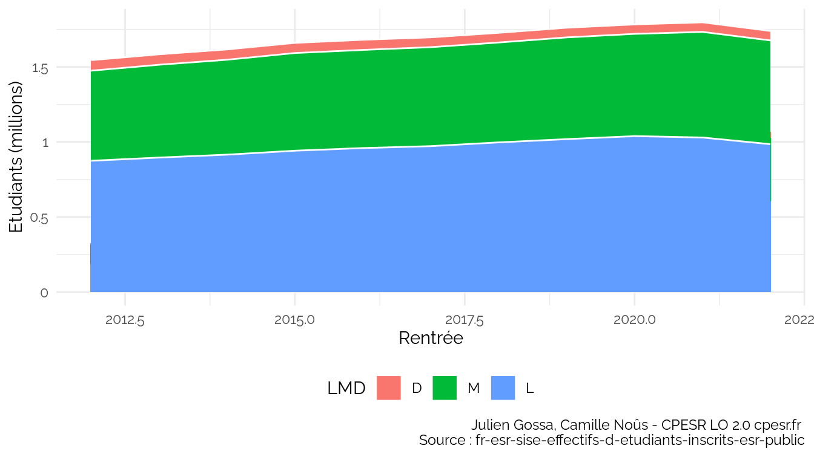
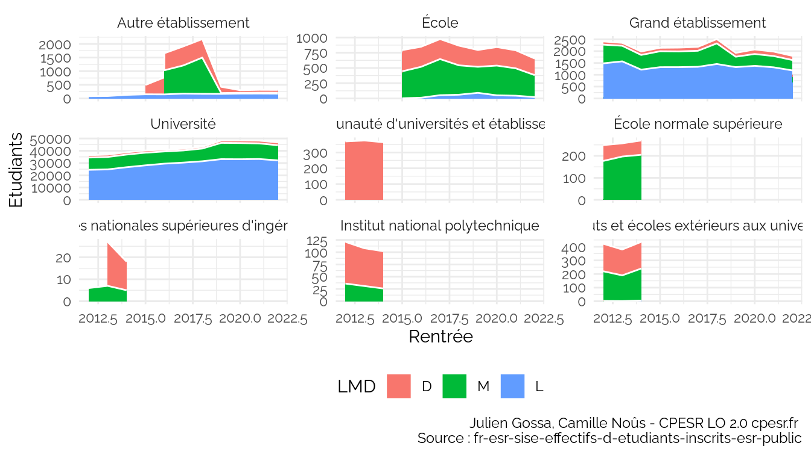

SISE
================

## Tout

    ## `summarise()` has grouped output by 'Rentrée'. You can override using the
    ## `.groups` argument.

## Disciplines

    ## `summarise()` has grouped output by 'LMD'. You can override using the `.groups`
    ## argument.

    ## `summarise()` has grouped output by 'LMD'. You can override using the `.groups`
    ## argument.

### L3 vs M1

    ## `summarise()` has grouped output by 'Rentrée'. You can override using the
    ## `.groups` argument.

    ## `summarise()` has grouped output by 'Rentrée'. You can override using the
    ## `.groups` argument.

    ## `summarise()` has grouped output by 'Rentrée'. You can override using the
    ## `.groups` argument.

    ## `summarise()` has grouped output by 'Rentrée'. You can override using the
    ## `.groups` argument.

    ## `summarise()` has grouped output by 'Rentrée', 'Niveau'. You can override using
    ## the `.groups` argument.

    ## `summarise()` has grouped output by 'Rentrée', 'Niveau'. You can override using
    ## the `.groups` argument.

    ## `summarise()` has grouped output by 'Rentrée', 'Niveau'. You can override using
    ## the `.groups` argument.

    ## `summarise()` has grouped output by 'Rentrée', 'Niveau'. You can override using
    ## the `.groups` argument.
    ## `geom_line()`: Each group consists of only one observation. ℹ Do you need to
    ## adjust the group aesthetic?
    ## `geom_line()`: Each group consists of only one observation. ℹ Do you need to
    ## adjust the group aesthetic?
    ## `geom_line()`: Each group consists of only one observation. ℹ Do you need to
    ## adjust the group aesthetic?
    ## `geom_line()`: Each group consists of only one observation. ℹ Do you need to
    ## adjust the group aesthetic?
    ## `geom_line()`: Each group consists of only one observation. ℹ Do you need to
    ## adjust the group aesthetic?
    ## `geom_line()`: Each group consists of only one observation. ℹ Do you need to
    ## adjust the group aesthetic?
    ## `geom_line()`: Each group consists of only one observation. ℹ Do you need to
    ## adjust the group aesthetic?
    ## `geom_line()`: Each group consists of only one observation. ℹ Do you need to
    ## adjust the group aesthetic?

## Informatique

### Effectifs

    ## `summarise()` has grouped output by 'Rentrée'. You can override using the
    ## `.groups` argument.

Voir les données

| Rentrée |     L |     M |    D |
|--------:|------:|------:|-----:|
|    2012 | 26046 | 11227 | 2817 |
|    2013 | 26467 | 11214 | 2719 |
|    2014 | 27951 | 11384 | 2758 |
|    2015 | 29595 | 11427 | 2634 |
|    2016 | 30981 | 12000 | 2561 |
|    2017 | 31920 | 12205 | 2605 |

### Type d’établissement

    ## `summarise()` has grouped output by 'Rentrée', 'Type.d.établissement'. You can
    ## override using the `.groups` argument.

Voir les données

| Rentrée | Type.d.établissement                       |     L |    M |    D |
|--------:|:-------------------------------------------|------:|-----:|-----:|
|    2012 | Autre établissement                        |    83 |   NA |   NA |
|    2012 | Grand établissement                        |  1484 |  791 |  135 |
|    2012 | Université                                 | 24477 | 9999 | 1953 |
|    2012 | Communauté d’universités et établissements |    NA |   NA |  370 |
|    2012 | École normale supérieure                   |    NA |  177 |   72 |
|    2012 | Écoles nationales supérieures d’ingénieurs |    NA |    6 |   NA |

### Attractivité internationale

    ## `summarise()` has grouped output by 'Rentrée', 'Attractivité.internationale'.
    ## You can override using the `.groups` argument.

Voir les données

| Rentrée | Attractivité.internationale                                              |     L |    M |    D |
|--------:|:-------------------------------------------------------------------------|------:|-----:|-----:|
|    2012 | Autres cas                                                               | 23366 | 6376 | 1323 |
|    2012 | Etudiants de nationalité étrangère issus de systèmes éducatifs étrangers |  2680 | 4851 | 1494 |
|    2013 | Autres cas                                                               | 23779 | 6455 | 1245 |
|    2013 | Etudiants de nationalité étrangère issus de systèmes éducatifs étrangers |  2688 | 4759 | 1474 |
|    2014 | Autres cas                                                               | 25228 | 6724 | 1308 |
|    2014 | Etudiants de nationalité étrangère issus de systèmes éducatifs étrangers |  2723 | 4660 | 1450 |

### Niveau

    ## `summarise()` has grouped output by 'Rentrée'. You can override using the
    ## `.groups` argument.

Voir les données

| Rentrée | D-XX |  L-01 |  L-02 | L-03 | L-XX | M-01 | M-02 | M-XX |
|--------:|-----:|------:|------:|-----:|-----:|-----:|-----:|-----:|
|    2012 | 2817 |  9054 |  7404 | 4539 | 5049 | 5074 | 5902 |  251 |
|    2013 | 2719 |  9273 |  7599 | 4758 | 4837 | 4955 | 5994 |  265 |
|    2014 | 2758 |  9966 |  8568 | 4694 | 4723 | 4970 | 6184 |  230 |
|    2015 | 2634 | 10362 |  9040 | 5376 | 4817 | 5190 | 6013 |  224 |
|    2016 | 2561 | 10991 |  9747 | 5345 | 4898 | 5485 | 6216 |  299 |
|    2017 | 2605 | 11170 | 10044 | 5811 | 4895 | 5511 | 6232 |  462 |

