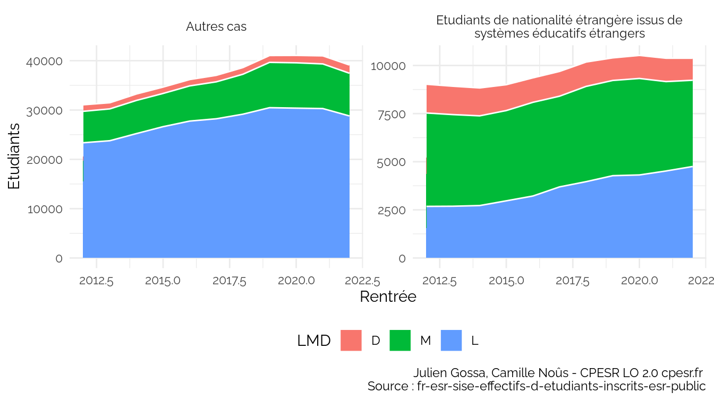

Untitled
================

## Informatique

### Effectifs

    ## `summarise()` has grouped output by 'Rentrée'. You can override using the
    ## `.groups` argument.

Voir les données

| Rentrée |     L |     M |    D |
|--------:|------:|------:|-----:|
|    2013 | 26467 | 11214 | 2719 |
|    2014 | 27951 | 11384 | 2758 |
|    2015 | 29595 | 11427 | 2634 |
|    2016 | 30981 | 12000 | 2561 |
|    2017 | 31920 | 12205 | 2605 |
|    2018 | 33125 | 13048 | 2621 |
|    2019 | 34752 | 14135 | 2563 |
|    2020 | 34698 | 14205 | 2699 |
|    2021 | 34819 | 13693 | 2849 |

### Type d’établissement

    ## `summarise()` has grouped output by 'Rentrée', 'Type.d.établissement'. You can
    ## override using the `.groups` argument.

Voir les données

| Rentrée | Type.d.établissement |     L |    D |     M |
|--------:|:---------------------|------:|-----:|------:|
|    2013 | Autre établissement  |    89 |  376 |    NA |
|    2013 | École                |     1 |  347 |   424 |
|    2013 | Grand établissement  |  1568 |  123 |   659 |
|    2013 | Université           | 24809 | 1873 | 10131 |
|    2014 | Autre établissement  |   131 |  365 |    NA |
|    2014 | École                |     5 |  350 |   471 |
|    2014 | Grand établissement  |  1217 |  146 |   622 |
|    2014 | Université           | 26598 | 1897 | 10291 |
|    2015 | Autre établissement  |   152 |  344 |    NA |
|    2015 | École                |     3 |  348 |   442 |
|    2015 | Grand établissement  |  1322 |  147 |   673 |
|    2015 | Université           | 28118 | 1795 | 10312 |
|    2016 | Autre établissement  |   149 |  626 |   886 |
|    2016 | École                |    12 |  329 |   507 |
|    2016 | Grand établissement  |  1324 |  162 |   664 |
|    2016 | Université           | 29496 | 1444 |  9943 |
|    2017 | Autre établissement  |   177 |  700 |  1034 |
|    2017 | École                |    53 |  328 |   593 |
|    2017 | Grand établissement  |  1337 |  167 |   678 |
|    2017 | Université           | 30353 | 1410 |  9900 |
|    2018 | Autre établissement  |   169 |  680 |  1330 |
|    2018 | École                |    61 |  323 |   482 |
|    2018 | Grand établissement  |  1456 |  183 |   871 |
|    2018 | Université           | 31439 | 1435 | 10365 |
|    2019 | Autre établissement  |   167 |  230 |    30 |
|    2019 | École                |    92 |  276 |   427 |
|    2019 | Grand établissement  |  1324 |  162 |   441 |
|    2019 | Université           | 33169 | 1895 | 13237 |
|    2020 | Autre établissement  |   177 |   97 |    29 |
|    2020 | École                |    51 |  304 |   488 |
|    2020 | Grand établissement  |  1378 |  192 |   500 |
|    2020 | Université           | 33092 | 2106 | 13188 |
|    2021 | Autre établissement  |   179 |  105 |    33 |
|    2021 | École                |    45 |  296 |   449 |
|    2021 | Grand établissement  |  1316 |  189 |   477 |
|    2021 | Université           | 33279 | 2259 | 12734 |

### Attractivité internationale

    ## `summarise()` has grouped output by 'Rentrée', 'Attractivité.internationale'.
    ## You can override using the `.groups` argument.

Voir les données

| Rentrée | Attractivité.internationale                                              |     L |    M |    D |
|--------:|:-------------------------------------------------------------------------|------:|-----:|-----:|
|    2013 | Autres cas                                                               | 23779 | 6455 | 1245 |
|    2013 | Etudiants de nationalité étrangère issus de systèmes éducatifs étrangers |  2688 | 4759 | 1474 |
|    2014 | Autres cas                                                               | 25228 | 6724 | 1308 |
|    2014 | Etudiants de nationalité étrangère issus de systèmes éducatifs étrangers |  2723 | 4660 | 1450 |
|    2015 | Autres cas                                                               | 26626 | 6738 | 1290 |
|    2015 | Etudiants de nationalité étrangère issus de systèmes éducatifs étrangers |  2969 | 4689 | 1344 |
|    2016 | Autres cas                                                               | 27762 | 7133 | 1289 |
|    2016 | Etudiants de nationalité étrangère issus de systèmes éducatifs étrangers |  3219 | 4867 | 1272 |
|    2017 | Autres cas                                                               | 28227 | 7494 | 1318 |
|    2017 | Etudiants de nationalité étrangère issus de systèmes éducatifs étrangers |  3693 | 4711 | 1287 |
|    2018 | Autres cas                                                               | 29160 | 8099 | 1355 |
|    2018 | Etudiants de nationalité étrangère issus de systèmes éducatifs étrangers |  3965 | 4949 | 1266 |
|    2019 | Autres cas                                                               | 30477 | 9188 | 1390 |
|    2019 | Etudiants de nationalité étrangère issus de systèmes éducatifs étrangers |  4275 | 4947 | 1173 |
|    2020 | Autres cas                                                               | 30385 | 9193 | 1501 |
|    2020 | Etudiants de nationalité étrangère issus de systèmes éducatifs étrangers |  4313 | 5012 | 1198 |
|    2021 | Autres cas                                                               | 30300 | 9049 | 1636 |
|    2021 | Etudiants de nationalité étrangère issus de systèmes éducatifs étrangers |  4519 | 4644 | 1213 |

### Niveau

    ## `summarise()` has grouped output by 'Rentrée'. You can override using the
    ## `.groups` argument.

Voir les données

| Rentrée | D-XX |  L-01 |  L-02 | L-03 | L-XX | M-01 | M-02 | M-XX |
|--------:|-----:|------:|------:|-----:|-----:|-----:|-----:|-----:|
|    2013 | 2719 |  9273 |  7599 | 4758 | 4837 | 4955 | 5994 |  265 |
|    2014 | 2758 |  9966 |  8568 | 4694 | 4723 | 4970 | 6184 |  230 |
|    2015 | 2634 | 10362 |  9040 | 5376 | 4817 | 5190 | 6013 |  224 |
|    2016 | 2561 | 10991 |  9747 | 5345 | 4898 | 5485 | 6216 |  299 |
|    2017 | 2605 | 11170 | 10044 | 5811 | 4895 | 5511 | 6232 |  462 |
|    2018 | 2621 | 11416 | 10757 | 5928 | 5024 | 6149 | 6391 |  508 |
|    2019 | 2563 | 11613 | 11679 | 6244 | 5216 | 5904 | 6780 | 1451 |
|    2020 | 2699 | 11254 | 11977 | 6576 | 4891 | 5925 | 7094 | 1186 |
|    2021 | 2849 | 11795 | 11627 | 6366 | 5031 | 5924 | 6775 |  994 |

