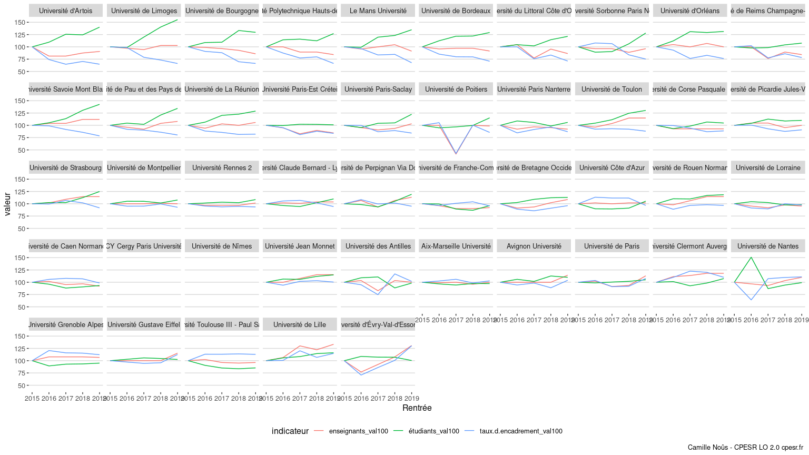

STAPS
================

``` r
lvl <- staps %>% filter(Rentrée==2019) %>% arrange(taux.d.encadrement_val100) %>% pull(Etablissement) %>% unique()

staps %>%
  mutate(Etablissement = factor(Etablissement,levels=lvl)) %>%
  filter(!is.na(Etablissement)) %>%
  pivot_longer(ends_with("_val100"),names_to="indicateur",values_to = "valeur") %>%
  ggplot(aes(x=Rentrée,y=valeur,color=indicateur)) +
  geom_line(aes(group=indicateur)) +
  facet_wrap(.~Etablissement) +
  theme_cpesr_cap()
```

    ## geom_path: Each group consists of only one observation. Do you need to adjust
    ## the group aesthetic?
    ## geom_path: Each group consists of only one observation. Do you need to adjust
    ## the group aesthetic?

<!-- -->
