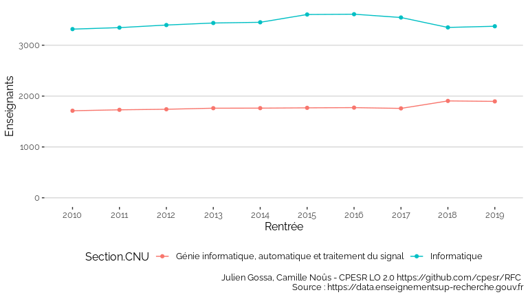
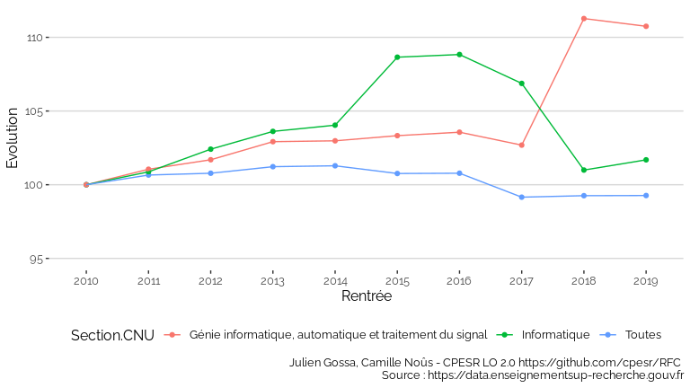

Section27
================

<table>
<thead>
<tr>
<th style="text-align:right;">
Rentrée
</th>
<th style="text-align:left;">
Établissement
</th>
<th style="text-align:right;">
Enseignants
</th>
<th style="text-align:right;">
evol
</th>
</tr>
</thead>
<tbody>
<tr>
<td style="text-align:right;">
2018
</td>
<td style="text-align:left;">
Le Mans Université
</td>
<td style="text-align:right;">
11
</td>
<td style="text-align:right;">
1.571429
</td>
</tr>
<tr>
<td style="text-align:right;">
2018
</td>
<td style="text-align:left;">
Université Toulouse - Jean Jaurès (UT2)
</td>
<td style="text-align:right;">
14
</td>
<td style="text-align:right;">
1.555556
</td>
</tr>
<tr>
<td style="text-align:right;">
2018
</td>
<td style="text-align:left;">
Université de Tours
</td>
<td style="text-align:right;">
12
</td>
<td style="text-align:right;">
1.500000
</td>
</tr>
<tr>
<td style="text-align:right;">
2018
</td>
<td style="text-align:left;">
Université Lumière - Lyon 2
</td>
<td style="text-align:right;">
3
</td>
<td style="text-align:right;">
1.500000
</td>
</tr>
<tr>
<td style="text-align:right;">
2018
</td>
<td style="text-align:left;">
Université de Bretagne Occidentale (UBO)
</td>
<td style="text-align:right;">
24
</td>
<td style="text-align:right;">
1.411765
</td>
</tr>
<tr>
<td style="text-align:right;">
2018
</td>
<td style="text-align:left;">
Université de La Réunion
</td>
<td style="text-align:right;">
7
</td>
<td style="text-align:right;">
1.400000
</td>
</tr>
<tr>
<td style="text-align:right;">
2018
</td>
<td style="text-align:left;">
Université de Pau et des Pays de l’Adour (UPPA)
</td>
<td style="text-align:right;">
7
</td>
<td style="text-align:right;">
1.400000
</td>
</tr>
<tr>
<td style="text-align:right;">
2018
</td>
<td style="text-align:left;">
Université de Rouen Normandie
</td>
<td style="text-align:right;">
27
</td>
<td style="text-align:right;">
1.350000
</td>
</tr>
<tr>
<td style="text-align:right;">
2018
</td>
<td style="text-align:left;">
Avignon Université (AU)
</td>
<td style="text-align:right;">
4
</td>
<td style="text-align:right;">
1.333333
</td>
</tr>
<tr>
<td style="text-align:right;">
2018
</td>
<td style="text-align:left;">
Université de Limoges
</td>
<td style="text-align:right;">
12
</td>
<td style="text-align:right;">
1.333333
</td>
</tr>
</tbody>
</table>

<!-- -->

<!-- -->
