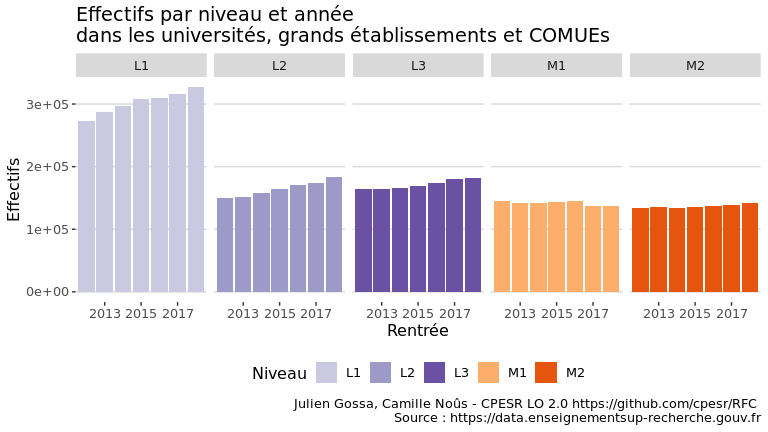
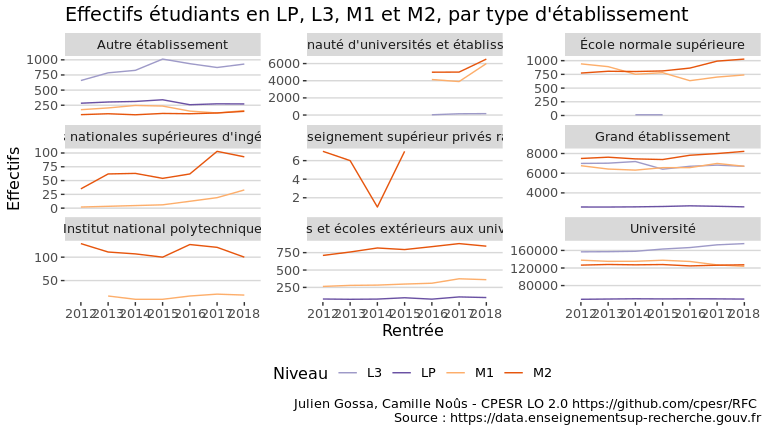
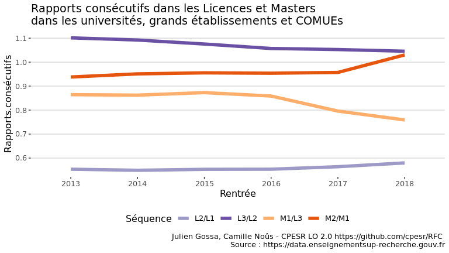
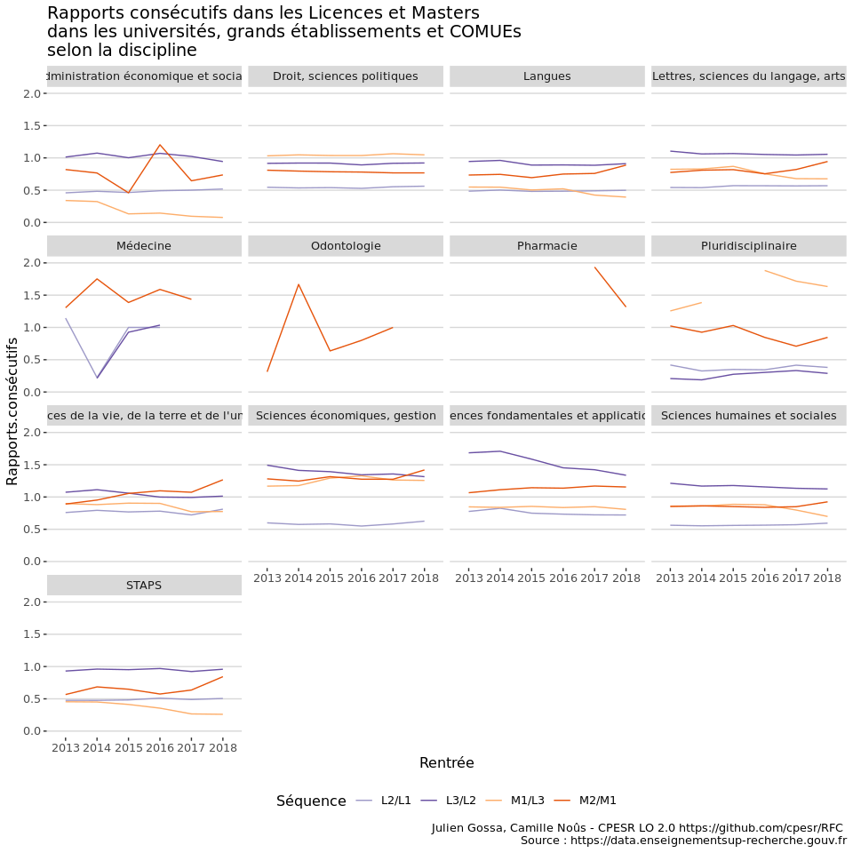
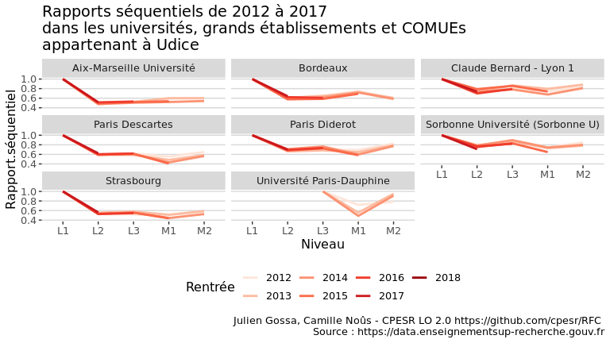

Sélection en Master
================

Jeu de données
    :

  - <https://data.enseignementsup-recherche.gouv.fr/explore/dataset/fr-esr-sise-effectifs-d-etudiants-inscrits-esr-public/information/?disjunctive.rentree_lib>

<!-- -->

<!-- -->

<!-- -->

<!-- -->

## Mobilité

<!-- -->
<!-- -->

<!-- -->

<!-- -->

## Focus L3/M1/M2

<!-- -->

<!-- -->

<!-- -->

<!-- -->

<!-- -->

<!-- -->

### Rapports consécutifs

Le rapport consécutif se calcule comme le rapport entre les effectifs
étudiants d’une année à un certain niveau, et les effectifs étudiants
de l’année précédente au niveau précédent.

Par exemple, le rapport consécutif M1/L3 en 2017 est le rapport entre
les effectifs de M1 en 2017 et les effectifs de L3 en 2016.

Il résulte donc des taux de passage et d’abandon, mais aussi des
passerelles et des capacités d’accueil et
sélections.

<!-- -->

<!-- -->

<!-- -->

Top 10

<table>

<thead>

<tr>

<th style="text-align:left;">

Rentrée

</th>

<th style="text-align:left;">

critere

</th>

<th style="text-align:left;">

Niveau

</th>

<th style="text-align:right;">

Effectifs

</th>

<th style="text-align:right;">

Effectifs2

</th>

<th style="text-align:right;">

Rapports.consécutifs

</th>

<th style="text-align:left;">

Séquence

</th>

</tr>

</thead>

<tbody>

<tr>

<td style="text-align:left;">

2018

</td>

<td style="text-align:left;">

Université de Haute-Alsace

</td>

<td style="text-align:left;">

M2

</td>

<td style="text-align:right;">

886

</td>

<td style="text-align:right;">

661

</td>

<td style="text-align:right;">

1.340393

</td>

<td style="text-align:left;">

M2/M1

</td>

</tr>

<tr>

<td style="text-align:left;">

2018

</td>

<td style="text-align:left;">

Université de Toulon

</td>

<td style="text-align:left;">

M2

</td>

<td style="text-align:right;">

784

</td>

<td style="text-align:right;">

594

</td>

<td style="text-align:right;">

1.319865

</td>

<td style="text-align:left;">

M2/M1

</td>

</tr>

<tr>

<td style="text-align:left;">

2018

</td>

<td style="text-align:left;">

Université Paris Descartes

</td>

<td style="text-align:left;">

M2

</td>

<td style="text-align:right;">

2312

</td>

<td style="text-align:right;">

1762

</td>

<td style="text-align:right;">

1.312145

</td>

<td style="text-align:left;">

M2/M1

</td>

</tr>

<tr>

<td style="text-align:left;">

2018

</td>

<td style="text-align:left;">

Université Paris Diderot

</td>

<td style="text-align:left;">

M2

</td>

<td style="text-align:right;">

2340

</td>

<td style="text-align:right;">

1803

</td>

<td style="text-align:right;">

1.297837

</td>

<td style="text-align:left;">

M2/M1

</td>

</tr>

<tr>

<td style="text-align:left;">

2018

</td>

<td style="text-align:left;">

Université Paris-Dauphine

</td>

<td style="text-align:left;">

M2

</td>

<td style="text-align:right;">

1141

</td>

<td style="text-align:right;">

881

</td>

<td style="text-align:right;">

1.295119

</td>

<td style="text-align:left;">

M2/M1

</td>

</tr>

<tr>

<td style="text-align:left;">

2018

</td>

<td style="text-align:left;">

Université de Versailles
Saint-Quentin-en-Yvelines

</td>

<td style="text-align:left;">

M2

</td>

<td style="text-align:right;">

973

</td>

<td style="text-align:right;">

766

</td>

<td style="text-align:right;">

1.270235

</td>

<td style="text-align:left;">

M2/M1

</td>

</tr>

</tbody>

</table>

<!-- -->

<!-- -->

## Rapports séquentiels

Les rapports séquentiels se calculent comme le rapport entre les
effectifs étudiants d’une année et d’un niveau de référence, et les
effectifs étudiants des années précédentes aux niveaux suivants.

Par exemple, les rapports séquentiels de L1 en 2012 prennent cet
effectif en référence pour calculer les rapports avec L2 en 2013, puis
L3 en 2014, etc.

Il résulte donc des taux de passage et d’abandon, mais aussi des
passerelles et des capacités d’accueil et
sélections.

    ## Warning: Removed 10 row(s) containing missing values (geom_path).

<!-- -->

    ## Warning: Removed 10 row(s) containing missing values (geom_path).

<!-- -->

    ## Warning: Removed 10 row(s) containing missing values (geom_path).

<!-- -->

    ## Warning: Removed 10 row(s) containing missing values (geom_path).

<!-- -->

## LM vs. DU

<!-- -->

<!-- -->

<!-- -->

<!-- -->
