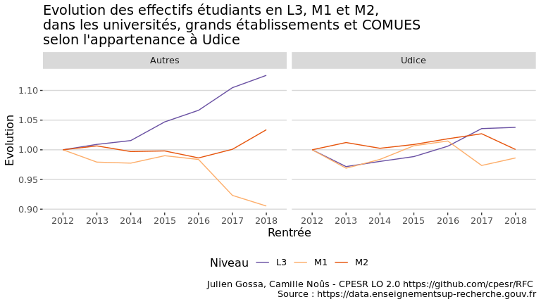

Sélection en Master
================

Jeu de donnée
    :

  - <https://data.enseignementsup-recherche.gouv.fr/explore/dataset/fr-esr-sise-effectifs-d-etudiants-inscrits-esr-public/information/?disjunctive.rentree_lib>

<!-- -->

## Focus L3/M1/M2

<!-- -->

<!-- -->

<!-- -->

<!-- -->

<!-- -->

### Rapports consécutifs

Le rapport consécutif se calcule comme le rapport entre les effectifs
étudiants d’une année à un certain niveau, et les effectifs étudiants
de l’année précédente au niveau précédent.

Par exemple, le rapport consécutif M1/L3 en 2017 est le rapport entre
les effectifs de M1 en 2017 et les effectifs de L3 en 2016.

Il résulte donc des taux de passage et d’abandon, mais aussi des
passerelles et des capacités d’accueil et
sélections.

<!-- -->

<!-- -->

    ## Warning: Removed 1 row(s) containing missing values (geom_path).

<!-- -->
