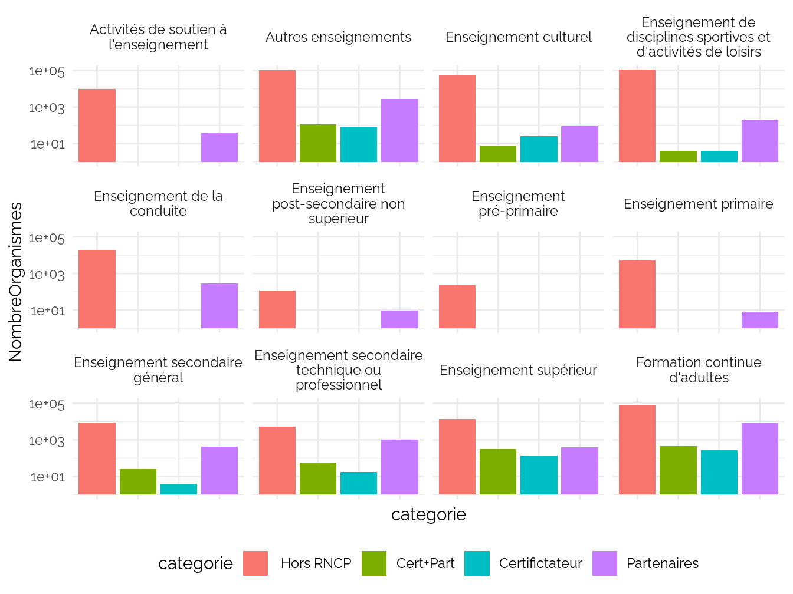
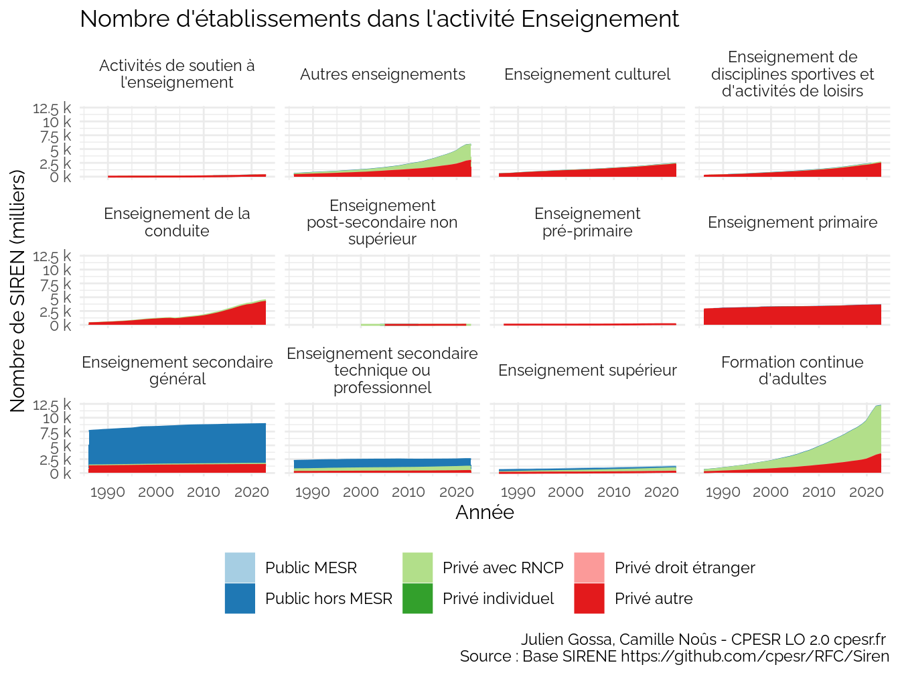
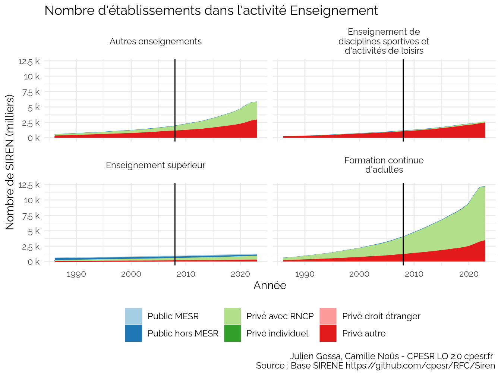

CPESR
================
CPESR
2024-02-20

## Données

- <https://www.data.gouv.fr/fr/datasets/base-sirene-des-entreprises-et-de-leurs-etablissements-siren-siret/>
- <https://insee.fr/fr/information/2406147>
- <https://www.insee.fr/fr/information/2028129>
- <https://www.data.gouv.fr/fr/datasets/repertoire-national-des-certifications-professionnelles-et-repertoire-specifique/>

## Catégories

Attention : échelle logarithmique.

### Tranche effectif

### Categorie d’entreprise

### Categorie juridique

### RNCP

#### Nombre certifications+partenariats

### Secteur

### MESR

MESR privé

| NomMESR                                                                     | categorieJuridique        | categorieJuridiqueGroupee | categorieJuridiqueSecteur |
|:----------------------------------------------------------------------------|:--------------------------|:--------------------------|:--------------------------|
| École supérieure d’informatique électronique automatique                    | Groupement de droit privé | Autres                    | Privé                     |
| Institut protestant de théologie                                            | Groupement de droit privé | Autres                    | Privé                     |
| Institut textile et chimique                                                | Groupement de droit privé | Autres                    | Privé                     |
| École spéciale des travaux publics, du bâtiment et de l’industrie           | Groupement de droit privé | Autres                    | Privé                     |
| Institut catholique de Lyon                                                 | Groupement de droit privé | Autres                    | Privé                     |
| Institut des relations publiques et de la communication d’Angers            | Groupement de droit privé | Autres                    | Privé                     |
| Institut français de la mode                                                | Groupement de droit privé | Autres                    | Privé                     |
| Centre national des arts du cirque                                          | Groupement de droit privé | Autres                    | Privé                     |
| École supérieure d’agriculture                                              | Groupement de droit privé | Autres                    | Privé                     |
| ISMANS                                                                      | Groupement de droit privé | Autres                    | Privé                     |
| Excelia Group                                                               | Groupement de droit privé | Autres                    | Privé                     |
| EIGSI La Rochelle                                                           | Groupement de droit privé | Autres                    | Privé                     |
| Rennes School of Business                                                   | Groupement de droit privé | Autres                    | Privé                     |
| ECAM Rennes Louis de Broglie                                                | Groupement de droit privé | Autres                    | Privé                     |
| Institut catholique de Vendée                                               | Groupement de droit privé | Autres                    | Privé                     |
| École supérieure angevine en informatique et productique                    | Groupement de droit privé | Autres                    | Privé                     |
| École centrale d’électronique                                               | Groupement de droit privé | Autres                    | Privé                     |
| ICN Business School                                                         | Groupement de droit privé | Autres                    | Privé                     |
| Institut régional du travail social de Champagne-Ardennes                   | Groupement de droit privé | Autres                    | Privé                     |
| ISEN Yncréa Méditerranée                                                    | Groupement de droit privé | Autres                    | Privé                     |
| École d’ingénieur d’agro-développement international                        | Groupement de droit privé | Autres                    | Privé                     |
| École de biologie industrielle                                              | Groupement de droit privé | Autres                    | Privé                     |
| ECAM-EPMI                                                                   | Groupement de droit privé | Autres                    | Privé                     |
| École supérieure d’ingénieurs des travaux de la construction de Metz        | Groupement de droit privé | Autres                    | Privé                     |
| EPF - École d’ingénieurs                                                    | Groupement de droit privé | Autres                    | Privé                     |
| École supérieure de chimie physique électronique de Lyon                    | Groupement de droit privé | Autres                    | Privé                     |
| École supérieure d’ingénieurs des travaux de la construction de Paris       | Groupement de droit privé | Autres                    | Privé                     |
| Institut d’ingénierie informatique de Limoges                               | Groupement de droit privé | Autres                    | Privé                     |
| Institut supérieur de l’électronique et du numérique de Brest               | Groupement de droit privé | Autres                    | Privé                     |
| École d’ingénieur généraliste en informatique et technologies du numérique  | Groupement de droit privé | Autres                    | Privé                     |
| École supérieure d’ingénieurs en électronique et électrotechnique d’Amiens  | Groupement de droit privé | Autres                    | Privé                     |
| École supérieure d’ingénieurs Léonard-de-Vinci                              | Groupement de droit privé | Autres                    | Privé                     |
| BUILDERS École d’ingénieurs                                                 | Groupement de droit privé | Autres                    | Privé                     |
| École supérieure d’ingénieurs en génie électrique                           | Groupement de droit privé | Autres                    | Privé                     |
| Institut catholique de Rennes                                               | Groupement de droit privé | Autres                    | Privé                     |
| Institut polytechnique des sciences avancées                                | Groupement de droit privé | Autres                    | Privé                     |
| École spéciale de mécanique et d’électricité                                | Groupement de droit privé | Autres                    | Privé                     |
| École pour l’informatique et les techniques avancées                        | Groupement de droit privé | Autres                    | Privé                     |
| Centre de formation des journalistes                                        | Groupement de droit privé | Autres                    | Privé                     |
| Institut Sup’Biotech de Paris                                               | Groupement de droit privé | Autres                    | Privé                     |
| École de management de Normandie                                            | Groupement de droit privé | Autres                    | Privé                     |
| École d’ingénierie des sciences aérospatiales                               | Groupement de droit privé | Autres                    | Privé                     |
| KEDGE Business School                                                       | Groupement de droit privé | Autres                    | Privé                     |
| École supérieure des technologies et des affaires de Belfort                | Groupement de droit privé | Autres                    | Privé                     |
| Y SCHOOLS                                                                   | Groupement de droit privé | Autres                    | Privé                     |
| École spéciale militaire de Saint-Cyr                                       | Groupement de droit privé | Autres                    | Privé                     |
| École spéciale militaire de Saint-Cyr                                       | Groupement de droit privé | Autres                    | Privé                     |
| Institut catholique de Lille                                                | Groupement de droit privé | Autres                    | Privé                     |
| École supérieure des sciences économiques et commerciales                   | Groupement de droit privé | Autres                    | Privé                     |
| École supérieure de fonderie et de forge                                    | Groupement de droit privé | Autres                    | Privé                     |
| Institut européen d’administration des affaires                             | Groupement de droit privé | Autres                    | Privé                     |
| CESI                                                                        | Groupement de droit privé | Autres                    | Privé                     |
| Facultés Libres de Philosophie et de Psychologie                            | Groupement de droit privé | Autres                    | Privé                     |
| Institut catholique de Toulouse                                             | Groupement de droit privé | Autres                    | Privé                     |
| École d’ingénieurs de Purpan                                                | Groupement de droit privé | Autres                    | Privé                     |
| Institut supérieur d’agriculture Rhône-Alpes                                | Groupement de droit privé | Autres                    | Privé                     |
| École catholique des arts et métiers                                        | Groupement de droit privé | Autres                    | Privé                     |
| Institut polytechnique UniLaSalle                                           | Groupement de droit privé | Autres                    | Privé                     |
| Skema Business School                                                       | Groupement de droit privé | Autres                    | Privé                     |
| Junia                                                                       | Groupement de droit privé | Autres                    | Privé                     |
| École supérieure de journalisme de Lille                                    | Groupement de droit privé | Autres                    | Privé                     |
| Institut d’économie scientifique et de gestion                              | Groupement de droit privé | Autres                    | Privé                     |
| École des hautes études commerciales du nord                                | Groupement de droit privé | Autres                    | Privé                     |
| École supérieure des techniques aéronautiques et de construction automobile | Groupement de droit privé | Autres                    | Privé                     |
| Institut catholique de Paris                                                | Groupement de droit privé | Autres                    | Privé                     |
| Institut supérieur d’électronique de Paris                                  | Groupement de droit privé | Autres                    | Privé                     |
| École supérieure de chimie organique et minérale                            | Groupement de droit privé | Autres                    | Privé                     |
| IPAG Business School                                                        | Groupement de droit privé | Autres                    | Privé                     |
| Institut de management et de communication interculturels                   | Groupement de droit privé | Autres                    | Privé                     |
| École supérieure du bois                                                    | Groupement de droit privé | Autres                    | Privé                     |
| École spéciale d’architecture                                               | Groupement de droit privé | Autres                    | Privé                     |
| Centre des hautes études de la construction                                 | Groupement de droit privé | Autres                    | Privé                     |
| Institut supérieur du commerce de Paris                                     | Groupement de droit privé | Autres                    | Privé                     |
| Facultés libres de l’Ouest                                                  | Groupement de droit privé | Autres                    | Privé                     |
| École supérieure d’électronique de l’Ouest                                  | Groupement de droit privé | Autres                    | Privé                     |
| École supérieure des sciences commerciales d’Angers                         | Groupement de droit privé | Autres                    | Privé                     |
| École de management de Normandie                                            | Groupement de droit privé | Autres                    | Privé                     |
| Burgundy School of Business                                                 | Groupement de droit privé | Autres                    | Privé                     |
| MBS                                                                         | Groupement de droit privé | Autres                    | Privé                     |
| Neoma Business School                                                       | Groupement de droit privé | Autres                    | Privé                     |
| Toulouse Business School                                                    | Société commerciale       | Autres                    | Privé                     |
| École des hautes études commerciales de Paris                               | Société commerciale       | Autres                    | Privé                     |
| École supérieure des technologies industrielles avancées                    | Groupement de droit privé | Autres                    | Privé                     |
| ESCP Business School                                                        | Société commerciale       | Autres                    | Privé                     |
| Audencia                                                                    | Société commerciale       | Autres                    | Privé                     |
| ESIEE-IT                                                                    | Société commerciale       | Autres                    | Privé                     |
| Institut Sup’Biotech de Paris                                               | Société commerciale       | Autres                    | Privé                     |
| Institut polytechnique des sciences avancées                                | Société commerciale       | Autres                    | Privé                     |
| École pour l’informatique et les techniques avancées                        | Société commerciale       | Autres                    | Privé                     |

### All

## Evolutions

# Ouvertures / Fermetures

    ## Warning: Using `size` aesthetic for lines was deprecated in ggplot2 3.4.0.
    ## ℹ Please use `linewidth` instead.
    ## This warning is displayed once every 8 hours.
    ## Call `lifecycle::last_lifecycle_warnings()` to see where this warning was
    ## generated.

# Nombre d’établissements

