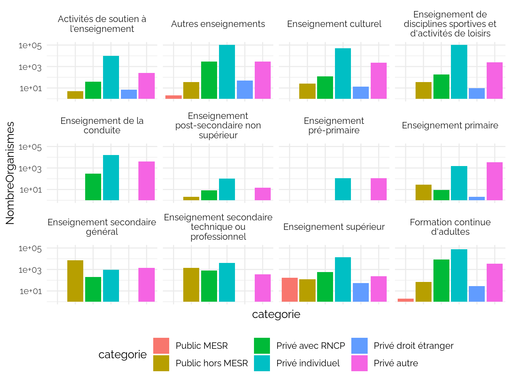
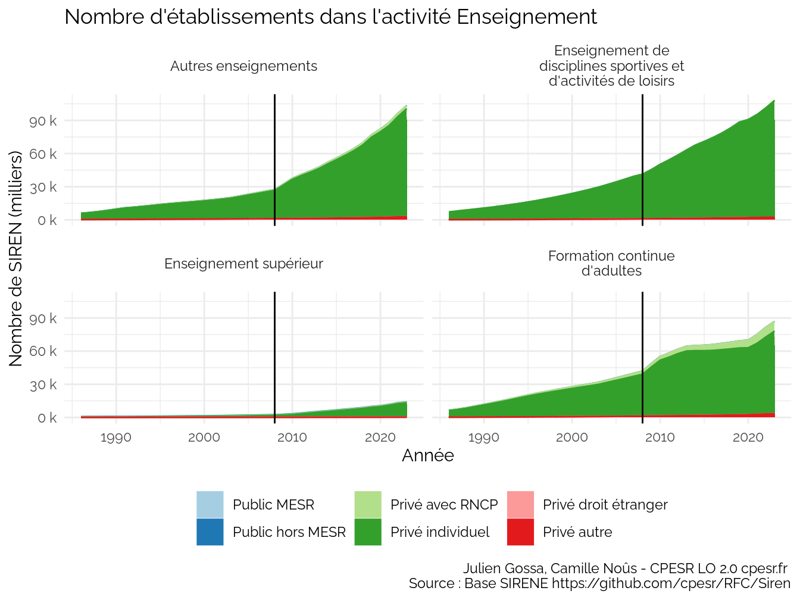
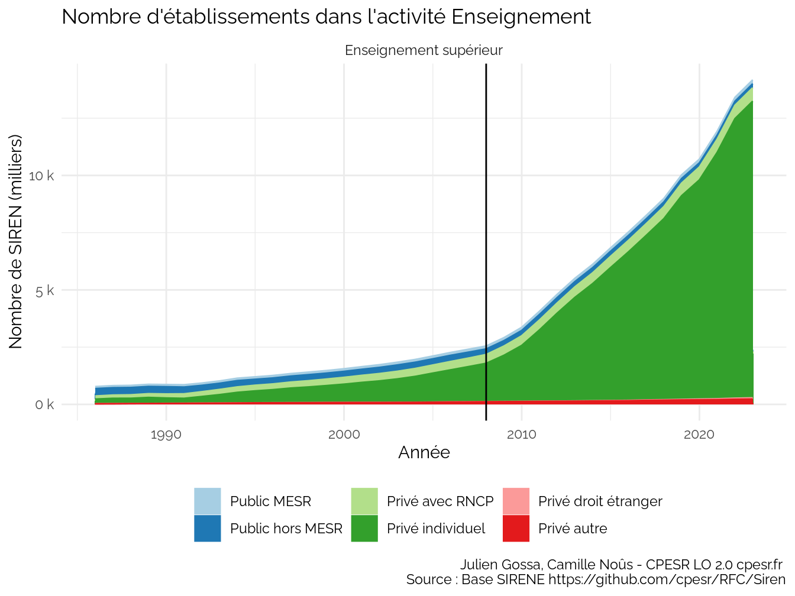
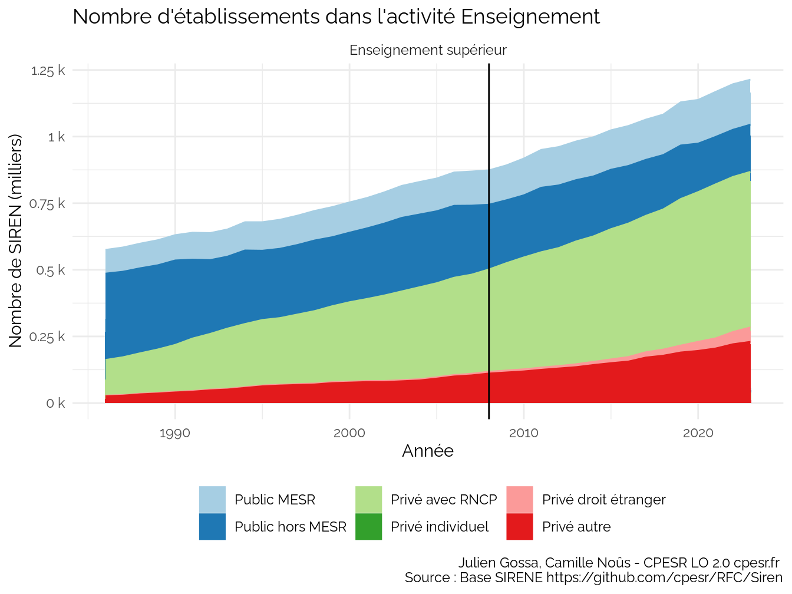
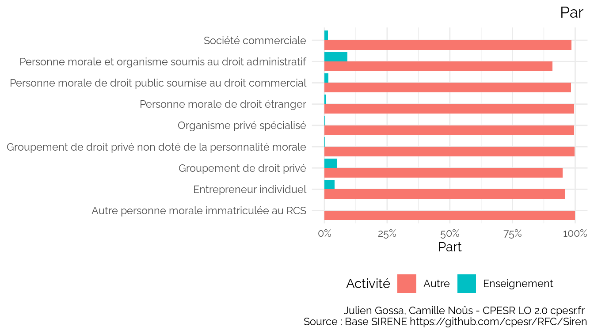

CPESR
================
CPESR
2024-03-10

## Données

- <https://www.data.gouv.fr/fr/datasets/base-sirene-des-entreprises-et-de-leurs-etablissements-siren-siret/>
- <https://insee.fr/fr/information/2406147>
- <https://www.insee.fr/fr/information/2028129>
- <https://www.data.gouv.fr/fr/datasets/repertoire-national-des-certifications-professionnelles-et-repertoire-specifique/>

## Catégories

Attention : échelle logarithmique.

### Tranche effectif

### Categorie d’entreprise

### Categorie juridique

### RNCP

#### Nombre certifications+partenariats

### Secteur

### MESR

MESR privé

| NomMESR                                                                    | categorieJuridique        | categorieJuridiqueGroupee | categorieJuridiqueSecteur |
|:---------------------------------------------------------------------------|:--------------------------|:--------------------------|:--------------------------|
| Centre national des arts du cirque                                         | Groupement de droit privé | Autres                    | Privé                     |
| Institut régional du travail social de Champagne-Ardennes                  | Groupement de droit privé | Autres                    | Privé                     |
| École d’ingénieur généraliste en informatique et technologies du numérique | Groupement de droit privé | Autres                    | Privé                     |
| Centre de formation des journalistes                                       | Groupement de droit privé | Autres                    | Privé                     |
| École de management de Normandie                                           | Groupement de droit privé | Autres                    | Privé                     |
| École spéciale militaire de Saint-Cyr                                      | Groupement de droit privé | Autres                    | Privé                     |
| École spéciale militaire de Saint-Cyr                                      | Groupement de droit privé | Autres                    | Privé                     |
| Institut de management et de communication interculturels                  | Groupement de droit privé | Autres                    | Privé                     |
| Centre des hautes études de la construction                                | Groupement de droit privé | Autres                    | Privé                     |
| Toulouse Business School                                                   | Société commerciale       | Autres                    | Privé                     |
| École supérieure des technologies industrielles avancées                   | Groupement de droit privé | Autres                    | Privé                     |
| Audencia                                                                   | Société commerciale       | Autres                    | Privé                     |
| Institut Sup’Biotech de Paris                                              | Société commerciale       | Autres                    | Privé                     |
| Institut polytechnique des sciences avancées                               | Société commerciale       | Autres                    | Privé                     |
| École pour l’informatique et les techniques avancées                       | Société commerciale       | Autres                    | Privé                     |

### All

Toutes catégories

| Categorie   | Activité                                                        | categorieEntreprise | categorieJuridiqueSecteur | categorieJuridiqueGroupee                                   | MESR | RNCP  | Nombre |
|:------------|:----------------------------------------------------------------|:--------------------|:--------------------------|:------------------------------------------------------------|:-----|:------|-------:|
| Public MESR | Autres enseignements                                            | PME                 | Privé                     | Autres                                                      | TRUE | TRUE  |      2 |
| Public MESR | Enseignement de disciplines sportives et d’activités de loisirs | PME                 | Public                    | Personne morale et organisme soumis au droit administratif  | TRUE | TRUE  |      1 |
| Public MESR | Enseignement supérieur                                          | PME                 | Public                    | Personne morale de droit public soumise au droit commercial | TRUE | TRUE  |      2 |
| Public MESR | Enseignement supérieur                                          | PME                 | Public                    | Personne morale et organisme soumis au droit administratif  | TRUE | FALSE |      4 |
| Public MESR | Enseignement supérieur                                          | PME                 | Public                    | Personne morale et organisme soumis au droit administratif  | TRUE | TRUE  |     53 |
| Public MESR | Enseignement supérieur                                          | PME                 | Privé                     | Autres                                                      | TRUE | TRUE  |      4 |

## Evolutions

# Ouvertures / Fermetures

    ## Warning: Using `size` aesthetic for lines was deprecated in ggplot2 3.4.0.
    ## ℹ Please use `linewidth` instead.
    ## This warning is displayed once every 8 hours.
    ## Call `lifecycle::last_lifecycle_warnings()` to see where this warning was
    ## generated.

# Nombre d’établissements

Enseignement supérieur

| Activité               | Indicateur           | Nombre_1986 | Nombre_2008 | Nombre_2023 | Part_1986 | Part_2008 | Part_2023 |  Evolution |
|:-----------------------|:---------------------|------------:|------------:|------------:|:----------|:----------|:----------|-----------:|
| Enseignement supérieur | Public hors MESR     |         324 |         243 |         177 | 42%       | 10%       | 1%        |  0.5462963 |
| Enseignement supérieur | Privé individuel     |         202 |        1675 |       12960 | 26%       | 66%       | 91%       | 64.1584158 |
| Enseignement supérieur | Privé avec RNCP      |         134 |         384 |         584 | 17%       | 15%       | 4%        |  4.3582090 |
| Enseignement supérieur | Privé droit étranger |           2 |          NA |          54 | 0%        | NA        | 0%        | 27.0000000 |
| Enseignement supérieur | Public MESR          |          89 |         129 |         169 | 11%       | 5%        | 1%        |  1.8988764 |
| Enseignement supérieur | Privé autre          |          26 |         111 |         230 | 3%        | 4%        | 2%        |  8.8461538 |

Enseignement supérieur hors indiv

| Activité               | Indicateur           | Nombre_1986 | Nombre_2023 | Part_1986 | Part_2023 |  Evolution |
|:-----------------------|:---------------------|------------:|------------:|:----------|:----------|-----------:|
| Enseignement supérieur | Public hors MESR     |         324 |         177 | 56%       | 15%       |  0.5462963 |
| Enseignement supérieur | Privé avec RNCP      |         134 |         584 | 23%       | 48%       |  4.3582090 |
| Enseignement supérieur | Privé droit étranger |           2 |          54 | 0%        | 4%        | 27.0000000 |
| Enseignement supérieur | Public MESR          |          89 |         169 | 15%       | 14%       |  1.8988764 |
| Enseignement supérieur | Privé autre          |          26 |         230 | 5%        | 19%       |  8.8461538 |

Enseignement supérieur total

| Année | Nombre |
|------:|-------:|
|  1986 |    777 |
|  2023 |  14174 |

## Listes

Privé droit étranger

| siren     | dateCreationUniteLegale | sigleUniteLegale | nomUniteLegale | nomUsageUniteLegale | denominationUniteLegale                                      | trancheEffectifsUniteLegale | categorieEntreprise | categorieJuridiqueUniteLegale | etatAdministratifUniteLegale | dateDebut  | activitePrincipaleUniteLegale | nomenclatureActivitePrincipaleUniteLegale | caractereEmployeurUniteLegale | TrancheEffectif | categorieJuridiqueDetaillee                       | categorieJuridique                | categorieJuridiqueGroupee         | categorieJuridiqueSecteur | NomRNCP | CertificationsRNCP | PartenariatsRNCP | NomMESR | Categorie            | ActivitéSource                                                  | Activité                                                        |
|:----------|:------------------------|:-----------------|:---------------|:--------------------|:-------------------------------------------------------------|:----------------------------|:--------------------|:------------------------------|:-----------------------------|:-----------|:------------------------------|:------------------------------------------|:------------------------------|:----------------|:--------------------------------------------------|:----------------------------------|:----------------------------------|:--------------------------|:--------|-------------------:|-----------------:|:--------|:---------------------|:----------------------------------------------------------------|:----------------------------------------------------------------|
| 307112425 | 1900-01-01              | NA               | NA             | NA                  | UNIVERSITE DE SYRACUSE                                       | 11                          | PME                 | 3290                          | A                            | 2013-07-25 | 85.59B                        | NAFRev2                                   | TRUE                          | 10-19           | Autre personne morale de droit étranger           | Personne morale de droit étranger | Personne morale de droit étranger | Privé                     | NA      |                 NA |               NA | NA      | Privé droit étranger | Autres enseignements                                            | Autres enseignements                                            |
| 311772610 | 1900-01-01              | NA               | NA             | NA                  | HAMILTON COLLEGE                                             | 02                          | PME                 | 3220                          | A                            | 2008-01-01 | 85.59B                        | NAFRev2                                   | TRUE                          | 3-5             | Société étrangère non immatriculée au RCS         | Personne morale de droit étranger | Personne morale de droit étranger | Privé                     | NA      |                 NA |               NA | NA      | Privé droit étranger | Autres enseignements                                            | Autres enseignements                                            |
| 338642697 | 1985-10-01              | NA               | NA             | NA                  | SARAH LAWRENCE COLLEGE                                       | 03                          | PME                 | 3220                          | A                            | 2023-09-30 | 85.42Z                        | NAFRev2                                   | FALSE                         | 6-9             | Société étrangère non immatriculée au RCS         | Personne morale de droit étranger | Personne morale de droit étranger | Privé                     | NA      |                 NA |               NA | NA      | Privé droit étranger | Enseignement supérieur                                          | Enseignement supérieur                                          |
| 403020076 | 1995-09-01              | APA              | NA             | NA                  | ACADEMIC PROGRAMS ABROAD INC                                 | 02                          | PME                 | 3120                          | A                            | 2016-06-24 | 85.42Z                        | NAFRev2                                   | TRUE                          | 3-5             | Société commerciale étrangère immatriculée au RCS | Personne morale de droit étranger | Personne morale de droit étranger | Privé                     | NA      |                 NA |               NA | NA      | Privé droit étranger | Enseignement supérieur                                          | Enseignement supérieur                                          |
| 420237059 | 1998-09-01              | LTD              | NA             | NA                  | DRIVING SCHOOL DIRECT LIMITED                                | 02                          | PME                 | 3120                          | A                            | 2023-12-05 | 85.53Z                        | NAFRev2                                   | FALSE                         | 3-5             | Société commerciale étrangère immatriculée au RCS | Personne morale de droit étranger | Personne morale de droit étranger | Privé                     | NA      |                 NA |               NA | NA      | Privé droit étranger | Enseignement de la conduite                                     | Enseignement de la conduite                                     |
| 420464497 | 1998-07-20              | NA               | NA             | NA                  | THE OXFORD GROUP CONSULTING TRAININGLTD                      | 03                          | PME                 | 3120                          | A                            | 2022-06-01 | 85.59A                        | NAFRev2                                   | FALSE                         | 6-9             | Société commerciale étrangère immatriculée au RCS | Personne morale de droit étranger | Personne morale de droit étranger | Privé                     | NA      |                 NA |               NA | NA      | Privé droit étranger | Formation continue d’adultes                                    | Formation continue d’adultes                                    |
| 428689632 | 2000-01-01              | NA               | NA             | NA                  | VERTEX PROFESSIONAL SERVICES GMBH                            | 11                          | PME                 | 3120                          | A                            | 2022-09-12 | 85.59A                        | NAFRev2                                   | TRUE                          | 10-19           | Société commerciale étrangère immatriculée au RCS | Personne morale de droit étranger | Personne morale de droit étranger | Privé                     | NA      |                 NA |               NA | NA      | Privé droit étranger | Formation continue d’adultes                                    | Formation continue d’adultes                                    |
| 435254446 | 2001-03-05              | NA               | NA             | NA                  | EUROTECH GLOBAL SPORTS AG                                    | NA                          | PME                 | 3220                          | A                            | 2015-03-31 | 85.51Z                        | NAFRev2                                   | TRUE                          | NA              | Société étrangère non immatriculée au RCS         | Personne morale de droit étranger | Personne morale de droit étranger | Privé                     | NA      |                 NA |               NA | NA      | Privé droit étranger | Enseignement de disciplines sportives et d’activités de loisirs | Enseignement de disciplines sportives et d’activités de loisirs |
| 441926342 | 2002-05-02              | NA               | NA             | NA                  | HEC MONTREAL                                                 | 02                          | PME                 | 3220                          | A                            | 2022-09-01 | 85.42Z                        | NAFRev2                                   | TRUE                          | 3-5             | Société étrangère non immatriculée au RCS         | Personne morale de droit étranger | Personne morale de droit étranger | Privé                     | NA      |                 NA |               NA | NA      | Privé droit étranger | Enseignement supérieur                                          | Enseignement supérieur                                          |
| 480711050 | 2005-01-03              | NA               | NA             | NA                  | AGEDOC-ECOLE PRIVEE SAINTE ANNE                              | NA                          | PME                 | 3220                          | A                            | 2008-01-01 | 85.59B                        | NAFRev2                                   | TRUE                          | NA              | Société étrangère non immatriculée au RCS         | Personne morale de droit étranger | Personne morale de droit étranger | Privé                     | NA      |                 NA |               NA | NA      | Privé droit étranger | Autres enseignements                                            | Autres enseignements                                            |
| 484190657 | 2005-09-20              | NA               | NA             | NA                  | CARLY ABRAMOWITZ CONSULTING                                  | 02                          | PME                 | 3120                          | A                            | 2019-06-28 | 85.59A                        | NAFRev2                                   | TRUE                          | 3-5             | Société commerciale étrangère immatriculée au RCS | Personne morale de droit étranger | Personne morale de droit étranger | Privé                     | NA      |                 NA |               NA | NA      | Privé droit étranger | Formation continue d’adultes                                    | Formation continue d’adultes                                    |
| 484780150 | 2005-10-03              | NA               | NA             | NA                  | EASYLESSONS LIMITED                                          | NA                          | NA                  | 3120                          | C                            | 2010-01-31 | 85.59A                        | NAFRev2                                   | TRUE                          | NA              | Société commerciale étrangère immatriculée au RCS | Personne morale de droit étranger | Personne morale de droit étranger | Privé                     | NA      |                 NA |               NA | NA      | Privé droit étranger | Formation continue d’adultes                                    | Formation continue d’adultes                                    |
| 487443442 | 2005-09-01              | NA               | NA             | NA                  | STANFORD UNIVERSITY                                          | NA                          | PME                 | 3220                          | A                            | 2008-01-01 | 85.42Z                        | NAFRev2                                   | TRUE                          | NA              | Société étrangère non immatriculée au RCS         | Personne morale de droit étranger | Personne morale de droit étranger | Privé                     | NA      |                 NA |               NA | NA      | Privé droit étranger | Enseignement supérieur                                          | Enseignement supérieur                                          |
| 491456216 | 2006-02-06              | NA               | NA             | NA                  | TAUROSUD ESPECTACULOS S.L                                    | NA                          | PME                 | 3220                          | A                            | 2008-01-01 | 85.51Z                        | NAFRev2                                   | TRUE                          | NA              | Société étrangère non immatriculée au RCS         | Personne morale de droit étranger | Personne morale de droit étranger | Privé                     | NA      |                 NA |               NA | NA      | Privé droit étranger | Enseignement de disciplines sportives et d’activités de loisirs | Enseignement de disciplines sportives et d’activités de loisirs |
| 501623797 | 2007-09-01              | NA               | NA             | NA                  | KIP SIU LLC                                                  | 11                          | PME                 | 3120                          | A                            | 2022-06-10 | 85.59A                        | NAFRev2                                   | FALSE                         | 10-19           | Société commerciale étrangère immatriculée au RCS | Personne morale de droit étranger | Personne morale de droit étranger | Privé                     | NA      |                 NA |               NA | NA      | Privé droit étranger | Formation continue d’adultes                                    | Formation continue d’adultes                                    |
| 502553340 | 2007-12-07              | NA               | NA             | NA                  | ISO SET SA                                                   | 11                          | PME                 | 3120                          | A                            | 2019-11-01 | 85.59A                        | NAFRev2                                   | TRUE                          | 10-19           | Société commerciale étrangère immatriculée au RCS | Personne morale de droit étranger | Personne morale de droit étranger | Privé                     | NA      |                 NA |               NA | NA      | Privé droit étranger | Formation continue d’adultes                                    | Formation continue d’adultes                                    |
| 508712882 | 2012-10-01              | NA               | NA             | NA                  | UNIVERZITA KARLOVA V PRAZE USTAV JAZYKOVE A ODBORNE PRIPRAVY | NA                          | PME                 | 3220                          | A                            | 2018-08-02 | 85.59B                        | NAFRev2                                   | TRUE                          | NA              | Société étrangère non immatriculée au RCS         | Personne morale de droit étranger | Personne morale de droit étranger | Privé                     | NA      |                 NA |               NA | NA      | Privé droit étranger | Autres enseignements                                            | Autres enseignements                                            |
| 520571217 | 2010-01-14              | NA               | NA             | NA                  | OBJECTIF SCIENCES INTERNATIONAL                              | 02                          | PME                 | 3290                          | A                            | 2021-06-15 | 85.59B                        | NAFRev2                                   | TRUE                          | 3-5             | Autre personne morale de droit étranger           | Personne morale de droit étranger | Personne morale de droit étranger | Privé                     | NA      |                 NA |               NA | NA      | Privé droit étranger | Autres enseignements                                            | Autres enseignements                                            |
| 521682997 | 2010-01-01              | NA               | NA             | NA                  | TELLUS GROUP LTD                                             | NA                          | NA                  | 3220                          | C                            | 2010-01-01 | 85.59A                        | NAFRev2                                   | TRUE                          | NA              | Société étrangère non immatriculée au RCS         | Personne morale de droit étranger | Personne morale de droit étranger | Privé                     | NA      |                 NA |               NA | NA      | Privé droit étranger | Formation continue d’adultes                                    | Formation continue d’adultes                                    |
| 524715356 | 2010-11-01              | NA               | NA             | NA                  | ALANCITY SA                                                  | NA                          | PME                 | 3220                          | A                            | 2010-11-01 | 85.59B                        | NAFRev2                                   | TRUE                          | NA              | Société étrangère non immatriculée au RCS         | Personne morale de droit étranger | Personne morale de droit étranger | Privé                     | NA      |                 NA |               NA | NA      | Privé droit étranger | Autres enseignements                                            | Autres enseignements                                            |
| 533148649 | 2011-06-20              | NA               | NA             | NA                  | GLOBAL SYNERGY                                               | NA                          | PME                 | 3220                          | A                            | 2011-06-20 | 85.59A                        | NAFRev2                                   | TRUE                          | NA              | Société étrangère non immatriculée au RCS         | Personne morale de droit étranger | Personne morale de droit étranger | Privé                     | NA      |                 NA |               NA | NA      | Privé droit étranger | Formation continue d’adultes                                    | Formation continue d’adultes                                    |
| 538102229 | 2010-05-20              | NA               | NA             | NA                  | GROUPEMENT INTERCOMMUNAL POUR L ANIMATION PARASCOLAIRE       | NA                          | PME                 | 3220                          | A                            | 2021-11-15 | 85.59B                        | NAFRev2                                   | TRUE                          | NA              | Société étrangère non immatriculée au RCS         | Personne morale de droit étranger | Personne morale de droit étranger | Privé                     | NA      |                 NA |               NA | NA      | Privé droit étranger | Autres enseignements                                            | Autres enseignements                                            |
| 754085504 | 2010-11-02              | NA               | NA             | NA                  | NIRO RENEE                                                   | NA                          | PME                 | 3220                          | A                            | 2010-11-02 | 85.52Z                        | NAFRev2                                   | TRUE                          | NA              | Société étrangère non immatriculée au RCS         | Personne morale de droit étranger | Personne morale de droit étranger | Privé                     | NA      |                 NA |               NA | NA      | Privé droit étranger | Enseignement culturel                                           | Enseignement culturel                                           |
| 754086262 | 2007-06-01              | NA               | NA             | NA                  | BEACON DEVELOPMENT TRAINING LTD                              | NA                          | PME                 | 3220                          | A                            | 2007-06-01 | 85.60Z                        | NAFRev2                                   | TRUE                          | NA              | Société étrangère non immatriculée au RCS         | Personne morale de droit étranger | Personne morale de droit étranger | Privé                     | NA      |                 NA |               NA | NA      | Privé droit étranger | Activités de soutien à l’enseignement                           | Activités de soutien à l’enseignement                           |
| 784259541 | 1985-11-12              | NA               | NA             | NA                  | UNIVERSI OF LONDON INSTITU IN PARIS                          | 12                          | PME                 | 3220                          | A                            | 2008-01-01 | 85.59B                        | NAFRev2                                   | TRUE                          | 20-49           | Société étrangère non immatriculée au RCS         | Personne morale de droit étranger | Personne morale de droit étranger | Privé                     | NA      |                 NA |               NA | NA      | Privé droit étranger | Autres enseignements                                            | Autres enseignements                                            |
| 784280950 | 1986-02-13              | NA               | NA             | NA                  | SMITH COLLEGE JUNIOR YEAR FR ENSEIGNEMEN                     | 02                          | PME                 | 3220                          | A                            | 2008-01-01 | 85.42Z                        | NAFRev2                                   | TRUE                          | 3-5             | Société étrangère non immatriculée au RCS         | Personne morale de droit étranger | Personne morale de droit étranger | Privé                     | NA      |                 NA |               NA | NA      | Privé droit étranger | Enseignement supérieur                                          | Enseignement supérieur                                          |
| 784662421 | 1900-01-01              | NA               | NA             | NA                  | INSTITUT CULTUREL FRANCO JAPONAIS                            | 03                          | PME                 | 3290                          | A                            | 2008-01-01 | 85.20Z                        | NAFRev2                                   | TRUE                          | 6-9             | Autre personne morale de droit étranger           | Personne morale de droit étranger | Personne morale de droit étranger | Privé                     | NA      |                 NA |               NA | NA      | Privé droit étranger | Enseignement primaire                                           | Enseignement primaire                                           |
| 788827012 | 2011-04-01              | NA               | NA             | NA                  | RH EXPERT                                                    | NA                          | PME                 | 3220                          | A                            | 2011-04-01 | 85.59A                        | NAFRev2                                   | TRUE                          | NA              | Société étrangère non immatriculée au RCS         | Personne morale de droit étranger | Personne morale de droit étranger | Privé                     | NA      |                 NA |               NA | NA      | Privé droit étranger | Formation continue d’adultes                                    | Formation continue d’adultes                                    |
| 791659733 | 2013-03-01              | LF               | NA             | NA                  | LUMIERE FORMATION                                            | NA                          | NA                  | 3120                          | C                            | 2013-03-01 | 85.59A                        | NAFRev2                                   | TRUE                          | NA              | Société commerciale étrangère immatriculée au RCS | Personne morale de droit étranger | Personne morale de droit étranger | Privé                     | NA      |                 NA |               NA | NA      | Privé droit étranger | Formation continue d’adultes                                    | Formation continue d’adultes                                    |
| 793589953 | 2013-01-01              | NA               | NA             | NA                  | UNIVERSITE DE LIEGE                                          | NA                          | PME                 | 3220                          | A                            | 2013-01-01 | 85.42Z                        | NAFRev2                                   | TRUE                          | NA              | Société étrangère non immatriculée au RCS         | Personne morale de droit étranger | Personne morale de droit étranger | Privé                     | NA      |                 NA |               NA | NA      | Privé droit étranger | Enseignement supérieur                                          | Enseignement supérieur                                          |
| 793784562 | 2013-06-01              | NA               | NA             | NA                  | PURESURFCAMPS GMBH                                           | NA                          | PME                 | 3220                          | A                            | 2013-06-01 | 85.51Z                        | NAFRev2                                   | TRUE                          | NA              | Société étrangère non immatriculée au RCS         | Personne morale de droit étranger | Personne morale de droit étranger | Privé                     | NA      |                 NA |               NA | NA      | Privé droit étranger | Enseignement de disciplines sportives et d’activités de loisirs | Enseignement de disciplines sportives et d’activités de loisirs |
| 799169099 | 2013-09-01              | NA               | NA             | NA                  | FACHHOCHSCHULE NORDWESTSCHWEIZ                               | NA                          | PME                 | 3220                          | A                            | 2013-09-01 | 85.42Z                        | NAFRev2                                   | TRUE                          | NA              | Société étrangère non immatriculée au RCS         | Personne morale de droit étranger | Personne morale de droit étranger | Privé                     | NA      |                 NA |               NA | NA      | Privé droit étranger | Enseignement supérieur                                          | Enseignement supérieur                                          |
| 799210448 | 2007-01-01              | NA               | NA             | NA                  | WAVE TOURS                                                   | NA                          | PME                 | 3220                          | A                            | 2007-01-01 | 85.51Z                        | NAFRev2                                   | TRUE                          | NA              | Société étrangère non immatriculée au RCS         | Personne morale de droit étranger | Personne morale de droit étranger | Privé                     | NA      |                 NA |               NA | NA      | Privé droit étranger | Enseignement de disciplines sportives et d’activités de loisirs | Enseignement de disciplines sportives et d’activités de loisirs |
| 801967985 | 2012-10-01              | NA               | NA             | NA                  | UNIVERSITY OF BRIGHTON                                       | NA                          | PME                 | 3220                          | A                            | 2012-10-01 | 85.42Z                        | NAFRev2                                   | TRUE                          | NA              | Société étrangère non immatriculée au RCS         | Personne morale de droit étranger | Personne morale de droit étranger | Privé                     | NA      |                 NA |               NA | NA      | Privé droit étranger | Enseignement supérieur                                          | Enseignement supérieur                                          |
| 804180339 | 2014-08-18              | NA               | NA             | NA                  | APEX2100 LTD                                                 | 12                          | PME                 | 3120                          | A                            | 2019-10-01 | 85.51Z                        | NAFRev2                                   | TRUE                          | 20-49           | Société commerciale étrangère immatriculée au RCS | Personne morale de droit étranger | Personne morale de droit étranger | Privé                     | NA      |                 NA |               NA | NA      | Privé droit étranger | Enseignement de disciplines sportives et d’activités de loisirs | Enseignement de disciplines sportives et d’activités de loisirs |
| 807679840 | 2012-09-11              | NA               | NA             | NA                  | QUEEN MARY UNIVERSITY OF LONDON                              | NA                          | PME                 | 3220                          | A                            | 2019-09-01 | 85.42Z                        | NAFRev2                                   | TRUE                          | NA              | Société étrangère non immatriculée au RCS         | Personne morale de droit étranger | Personne morale de droit étranger | Privé                     | NA      |                 NA |               NA | NA      | Privé droit étranger | Enseignement supérieur                                          | Enseignement supérieur                                          |
| 808776660 | 2014-09-01              | NA               | NA             | NA                  | FONDATION DELAFONTAINE                                       | NA                          | PME                 | 3220                          | A                            | 2014-09-01 | 85.59B                        | NAFRev2                                   | TRUE                          | NA              | Société étrangère non immatriculée au RCS         | Personne morale de droit étranger | Personne morale de droit étranger | Privé                     | NA      |                 NA |               NA | NA      | Privé droit étranger | Autres enseignements                                            | Autres enseignements                                            |
| 810119594 | 2012-02-01              | NA               | NA             | NA                  | UNIVERSITAT MANNHEIM                                         | NA                          | PME                 | 3220                          | A                            | 2012-02-01 | 85.42Z                        | NAFRev2                                   | TRUE                          | NA              | Société étrangère non immatriculée au RCS         | Personne morale de droit étranger | Personne morale de droit étranger | Privé                     | NA      |                 NA |               NA | NA      | Privé droit étranger | Enseignement supérieur                                          | Enseignement supérieur                                          |
| 811726835 | 2015-06-24              | NA               | NA             | NA                  | ALPADIA SA                                                   | NA                          | PME                 | 3220                          | A                            | 2017-07-01 | 85.59B                        | NAFRev2                                   | TRUE                          | NA              | Société étrangère non immatriculée au RCS         | Personne morale de droit étranger | Personne morale de droit étranger | Privé                     | NA      |                 NA |               NA | NA      | Privé droit étranger | Autres enseignements                                            | Autres enseignements                                            |
| 812966117 | 2014-12-29              | NA               | NA             | NA                  | UNIVERSITY OF GREENWICH                                      | NA                          | PME                 | 3220                          | A                            | 2014-12-29 | 85.42Z                        | NAFRev2                                   | TRUE                          | NA              | Société étrangère non immatriculée au RCS         | Personne morale de droit étranger | Personne morale de droit étranger | Privé                     | NA      |                 NA |               NA | NA      | Privé droit étranger | Enseignement supérieur                                          | Enseignement supérieur                                          |
| 813045598 | 2015-02-01              | NA               | NA             | NA                  | THE UNIVERSITY OF SHEFFIELD                                  | NA                          | PME                 | 3220                          | A                            | 2020-03-01 | 85.42Z                        | NAFRev2                                   | TRUE                          | NA              | Société étrangère non immatriculée au RCS         | Personne morale de droit étranger | Personne morale de droit étranger | Privé                     | NA      |                 NA |               NA | NA      | Privé droit étranger | Enseignement supérieur                                          | Enseignement supérieur                                          |
| 813138708 | 2012-11-01              | NA               | NA             | NA                  | UNIVERSITE DU LUXEMBOURG                                     | NA                          | PME                 | 3220                          | A                            | 2012-11-01 | 85.42Z                        | NAFRev2                                   | TRUE                          | NA              | Société étrangère non immatriculée au RCS         | Personne morale de droit étranger | Personne morale de droit étranger | Privé                     | NA      |                 NA |               NA | NA      | Privé droit étranger | Enseignement supérieur                                          | Enseignement supérieur                                          |
| 813158177 | 2015-04-07              | NA               | NA             | NA                  | UNIVERSITY OF ECONOMICS                                      | NA                          | PME                 | 3220                          | A                            | 2015-04-07 | 85.59B                        | NAFRev2                                   | TRUE                          | NA              | Société étrangère non immatriculée au RCS         | Personne morale de droit étranger | Personne morale de droit étranger | Privé                     | NA      |                 NA |               NA | NA      | Privé droit étranger | Autres enseignements                                            | Autres enseignements                                            |
| 818033524 | 2014-09-01              | NA               | NA             | NA                  | UNIVERSITY OF OXFORD                                         | NA                          | PME                 | 3220                          | A                            | 2019-07-13 | 85.59B                        | NAFRev2                                   | TRUE                          | NA              | Société étrangère non immatriculée au RCS         | Personne morale de droit étranger | Personne morale de droit étranger | Privé                     | NA      |                 NA |               NA | NA      | Privé droit étranger | Autres enseignements                                            | Autres enseignements                                            |
| 818645228 | 2015-06-01              | NA               | NA             | NA                  | LES CADETS DE GENEVE                                         | NA                          | PME                 | 3220                          | A                            | 2015-06-01 | 85.52Z                        | NAFRev2                                   | TRUE                          | NA              | Société étrangère non immatriculée au RCS         | Personne morale de droit étranger | Personne morale de droit étranger | Privé                     | NA      |                 NA |               NA | NA      | Privé droit étranger | Enseignement culturel                                           | Enseignement culturel                                           |
| 819486762 | 2015-09-01              | NA               | NA             | NA                  | HELSINGIN YLIOPISTO                                          | NA                          | PME                 | 3220                          | A                            | 2015-09-01 | 85.42Z                        | NAFRev2                                   | TRUE                          | NA              | Société étrangère non immatriculée au RCS         | Personne morale de droit étranger | Personne morale de droit étranger | Privé                     | NA      |                 NA |               NA | NA      | Privé droit étranger | Enseignement supérieur                                          | Enseignement supérieur                                          |
| 821312733 | 2016-07-01              | NA               | NA             | NA                  | INSTITUT RUSSO-ARMENIEN                                      | NA                          | PME                 | 3120                          | A                            | 2018-11-06 | 85.59B                        | NAFRev2                                   | TRUE                          | NA              | Société commerciale étrangère immatriculée au RCS | Personne morale de droit étranger | Personne morale de droit étranger | Privé                     | NA      |                 NA |               NA | NA      | Privé droit étranger | Autres enseignements                                            | Autres enseignements                                            |
| 821401221 | 2016-08-01              | NA               | NA             | NA                  | STICHTING EUROPEANA                                          | 02                          | PME                 | 3220                          | A                            | 2016-08-01 | 85.52Z                        | NAFRev2                                   | FALSE                         | 3-5             | Société étrangère non immatriculée au RCS         | Personne morale de droit étranger | Personne morale de droit étranger | Privé                     | NA      |                 NA |               NA | NA      | Privé droit étranger | Enseignement culturel                                           | Enseignement culturel                                           |
| 822617833 | 2016-07-18              | NA               | NA             | NA                  | NIIT (IRELAND) LIMITED                                       | 02                          | PME                 | 3120                          | A                            | 2023-07-01 | 85.59B                        | NAFRev2                                   | TRUE                          | 3-5             | Société commerciale étrangère immatriculée au RCS | Personne morale de droit étranger | Personne morale de droit étranger | Privé                     | NA      |                 NA |               NA | NA      | Privé droit étranger | Autres enseignements                                            | Autres enseignements                                            |
| 822653937 | 2016-10-01              | NA               | NA             | NA                  | OSTRAVSKA UNIVERZITA                                         | NA                          | PME                 | 3220                          | A                            | 2016-10-01 | 85.42Z                        | NAFRev2                                   | TRUE                          | NA              | Société étrangère non immatriculée au RCS         | Personne morale de droit étranger | Personne morale de droit étranger | Privé                     | NA      |                 NA |               NA | NA      | Privé droit étranger | Enseignement supérieur                                          | Enseignement supérieur                                          |
| 823027636 | 2016-11-01              | NA               | NA             | NA                  | UPKNOWLEDGE                                                  | NA                          | PME                 | 3220                          | A                            | 2019-03-13 | 85.59A                        | NAFRev2                                   | TRUE                          | NA              | Société étrangère non immatriculée au RCS         | Personne morale de droit étranger | Personne morale de droit étranger | Privé                     | NA      |                 NA |               NA | NA      | Privé droit étranger | Formation continue d’adultes                                    | Formation continue d’adultes                                    |
| 823090287 | 2003-10-01              | NA               | NA             | NA                  | MUSIK AKADEMIE BASEL                                         | NA                          | PME                 | 3220                          | A                            | 2003-10-01 | 85.52Z                        | NAFRev2                                   | TRUE                          | NA              | Société étrangère non immatriculée au RCS         | Personne morale de droit étranger | Personne morale de droit étranger | Privé                     | NA      |                 NA |               NA | NA      | Privé droit étranger | Enseignement culturel                                           | Enseignement culturel                                           |
| 823622634 | 2016-10-01              | NA               | NA             | NA                  | ETTC GROUP LIMITED                                           | NA                          | PME                 | 3120                          | A                            | 2023-10-06 | 85.59A                        | NAFRev2                                   | TRUE                          | NA              | Société commerciale étrangère immatriculée au RCS | Personne morale de droit étranger | Personne morale de droit étranger | Privé                     | NA      |                 NA |               NA | NA      | Privé droit étranger | Formation continue d’adultes                                    | Formation continue d’adultes                                    |
| 824508220 | 2016-09-16              | NA               | NA             | NA                  | CHAT NOIR ASSOCIATES LIMITED                                 | NA                          | PME                 | 3220                          | A                            | 2016-09-16 | 85.59B                        | NAFRev2                                   | TRUE                          | NA              | Société étrangère non immatriculée au RCS         | Personne morale de droit étranger | Personne morale de droit étranger | Privé                     | NA      |                 NA |               NA | NA      | Privé droit étranger | Autres enseignements                                            | Autres enseignements                                            |
| 824876262 | 2016-03-24              | NA               | NA             | NA                  | LEEDS BECKETT UNIVERSITY                                     | NA                          | PME                 | 3220                          | A                            | 2016-03-24 | 85.42Z                        | NAFRev2                                   | TRUE                          | NA              | Société étrangère non immatriculée au RCS         | Personne morale de droit étranger | Personne morale de droit étranger | Privé                     | NA      |                 NA |               NA | NA      | Privé droit étranger | Enseignement supérieur                                          | Enseignement supérieur                                          |
| 825130222 | 2015-09-01              | NA               | NA             | NA                  | FOR2FEET                                                     | NA                          | PME                 | 3220                          | A                            | 2015-09-01 | 85.59B                        | NAFRev2                                   | TRUE                          | NA              | Société étrangère non immatriculée au RCS         | Personne morale de droit étranger | Personne morale de droit étranger | Privé                     | NA      |                 NA |               NA | NA      | Privé droit étranger | Autres enseignements                                            | Autres enseignements                                            |
| 830378923 | 2012-08-29              | NA               | NA             | NA                  | AKADEMIE FUR ALTE MUSIK BERLIN                               | NA                          | PME                 | 3220                          | A                            | 2012-08-29 | 85.52Z                        | NAFRev2                                   | TRUE                          | NA              | Société étrangère non immatriculée au RCS         | Personne morale de droit étranger | Personne morale de droit étranger | Privé                     | NA      |                 NA |               NA | NA      | Privé droit étranger | Enseignement culturel                                           | Enseignement culturel                                           |
| 838909158 | 2016-12-01              | NA               | NA             | NA                  | NORWEGIAN UNIVERSITY OF SCIENCE AND TECHNOLOGY               | NA                          | PME                 | 3220                          | A                            | 2016-12-01 | 85.42Z                        | NAFRev2                                   | TRUE                          | NA              | Société étrangère non immatriculée au RCS         | Personne morale de droit étranger | Personne morale de droit étranger | Privé                     | NA      |                 NA |               NA | NA      | Privé droit étranger | Enseignement supérieur                                          | Enseignement supérieur                                          |
| 842172785 | 2018-09-15              | NA               | NA             | NA                  | DREAM SERVICES LIMITED                                       | NA                          | NA                  | 3120                          | A                            | 2019-04-01 | 85.59A                        | NAFRev2                                   | TRUE                          | NA              | Société commerciale étrangère immatriculée au RCS | Personne morale de droit étranger | Personne morale de droit étranger | Privé                     | NA      |                 NA |               NA | NA      | Privé droit étranger | Formation continue d’adultes                                    | Formation continue d’adultes                                    |
| 842941114 | 2018-09-10              | NA               | NA             | NA                  | AS DRESSAGE SARL                                             | NA                          | PME                 | 3220                          | A                            | 2018-09-10 | 85.51Z                        | NAFRev2                                   | TRUE                          | NA              | Société étrangère non immatriculée au RCS         | Personne morale de droit étranger | Personne morale de droit étranger | Privé                     | NA      |                 NA |               NA | NA      | Privé droit étranger | Enseignement de disciplines sportives et d’activités de loisirs | Enseignement de disciplines sportives et d’activités de loisirs |
| 843235672 | 2018-07-01              | NA               | NA             | NA                  | 2B-ALIVE LTD                                                 | 03                          | PME                 | 3120                          | A                            | 2018-11-01 | 85.51Z                        | NAFRev2                                   | TRUE                          | 6-9             | Société commerciale étrangère immatriculée au RCS | Personne morale de droit étranger | Personne morale de droit étranger | Privé                     | NA      |                 NA |               NA | NA      | Privé droit étranger | Enseignement de disciplines sportives et d’activités de loisirs | Enseignement de disciplines sportives et d’activités de loisirs |
| 844252700 | 2018-11-01              | NA               | NA             | NA                  | BANGOR UNIVERSITY                                            | NA                          | PME                 | 3220                          | A                            | 2018-11-01 | 85.42Z                        | NAFRev2                                   | TRUE                          | NA              | Société étrangère non immatriculée au RCS         | Personne morale de droit étranger | Personne morale de droit étranger | Privé                     | NA      |                 NA |               NA | NA      | Privé droit étranger | Enseignement supérieur                                          | Enseignement supérieur                                          |
| 848065892 | 2015-06-01              | NA               | NA             | NA                  | MUSIQUE MUNICIPALE DE PLAN LES OUATES                        | NA                          | PME                 | 3220                          | A                            | 2023-08-01 | 85.59B                        | NAFRev2                                   | TRUE                          | NA              | Société étrangère non immatriculée au RCS         | Personne morale de droit étranger | Personne morale de droit étranger | Privé                     | NA      |                 NA |               NA | NA      | Privé droit étranger | Autres enseignements                                            | Autres enseignements                                            |
| 848315750 | 2018-09-01              | NA               | NA             | NA                  | UNIVERSITY OF EXETER                                         | NA                          | PME                 | 3220                          | A                            | 2018-09-01 | 85.42Z                        | NAFRev2                                   | TRUE                          | NA              | Société étrangère non immatriculée au RCS         | Personne morale de droit étranger | Personne morale de droit étranger | Privé                     | NA      |                 NA |               NA | NA      | Privé droit étranger | Enseignement supérieur                                          | Enseignement supérieur                                          |
| 848704284 | 2018-10-05              | NA               | NA             | NA                  | UNIVERSITY OF TAMPERE                                        | NA                          | PME                 | 3220                          | A                            | 2022-09-01 | 85.42Z                        | NAFRev2                                   | TRUE                          | NA              | Société étrangère non immatriculée au RCS         | Personne morale de droit étranger | Personne morale de droit étranger | Privé                     | NA      |                 NA |               NA | NA      | Privé droit étranger | Enseignement supérieur                                          | Enseignement supérieur                                          |
| 849204128 | 2018-09-01              | NA               | NA             | NA                  | EPSU ECOLE DE PREPARATION ET SOUTIEN UNIVERSITAIRE           | NA                          | PME                 | 3220                          | A                            | 2020-11-01 | 85.41Z                        | NAFRev2                                   | TRUE                          | NA              | Société étrangère non immatriculée au RCS         | Personne morale de droit étranger | Personne morale de droit étranger | Privé                     | NA      |                 NA |               NA | NA      | Privé droit étranger | Enseignement post-secondaire non supérieur                      | Enseignement post-secondaire non supérieur                      |
| 849290887 | 2019-04-01              | NA               | NA             | NA                  | PANORAMARANCH GMBH                                           | NA                          | PME                 | 3220                          | A                            | 2019-04-01 | 85.59B                        | NAFRev2                                   | TRUE                          | NA              | Société étrangère non immatriculée au RCS         | Personne morale de droit étranger | Personne morale de droit étranger | Privé                     | NA      |                 NA |               NA | NA      | Privé droit étranger | Autres enseignements                                            | Autres enseignements                                            |
| 849875620 | 2019-01-01              | NA               | NA             | NA                  | UNIVERZITA PALACKEHO V OLOMOUCI                              | NA                          | PME                 | 3220                          | A                            | 2019-01-01 | 85.42Z                        | NAFRev2                                   | TRUE                          | NA              | Société étrangère non immatriculée au RCS         | Personne morale de droit étranger | Personne morale de droit étranger | Privé                     | NA      |                 NA |               NA | NA      | Privé droit étranger | Enseignement supérieur                                          | Enseignement supérieur                                          |
| 850021783 | 2019-03-25              | NA               | NA             | NA                  | CLASSPASS EUROPE B V                                         | NA                          | PME                 | 3220                          | A                            | 2021-05-19 | 85.51Z                        | NAFRev2                                   | TRUE                          | NA              | Société étrangère non immatriculée au RCS         | Personne morale de droit étranger | Personne morale de droit étranger | Privé                     | NA      |                 NA |               NA | NA      | Privé droit étranger | Enseignement de disciplines sportives et d’activités de loisirs | Enseignement de disciplines sportives et d’activités de loisirs |
| 850258146 | 2017-10-01              | NA               | NA             | NA                  | INSTITUTE OF PHYSICS OF THE CZECH ACADEMY OF SCIENCES        | NA                          | PME                 | 3220                          | A                            | 2019-05-02 | 85.42Z                        | NAFRev2                                   | TRUE                          | NA              | Société étrangère non immatriculée au RCS         | Personne morale de droit étranger | Personne morale de droit étranger | Privé                     | NA      |                 NA |               NA | NA      | Privé droit étranger | Enseignement supérieur                                          | Enseignement supérieur                                          |
| 851031948 | 2019-06-01              | NA               | NA             | NA                  | SCIO SARL                                                    | NA                          | PME                 | 3220                          | A                            | 2019-06-01 | 85.59B                        | NAFRev2                                   | TRUE                          | NA              | Société étrangère non immatriculée au RCS         | Personne morale de droit étranger | Personne morale de droit étranger | Privé                     | NA      |                 NA |               NA | NA      | Privé droit étranger | Autres enseignements                                            | Autres enseignements                                            |
| 852750405 | 2019-04-01              | NA               | NA             | NA                  | TENNIS CLUB VERNIER                                          | NA                          | PME                 | 3220                          | A                            | 2019-04-01 | 85.51Z                        | NAFRev2                                   | TRUE                          | NA              | Société étrangère non immatriculée au RCS         | Personne morale de droit étranger | Personne morale de droit étranger | Privé                     | NA      |                 NA |               NA | NA      | Privé droit étranger | Enseignement de disciplines sportives et d’activités de loisirs | Enseignement de disciplines sportives et d’activités de loisirs |
| 877519926 | 2015-09-01              | NA               | NA             | NA                  | ESPACE MUSICAL                                               | NA                          | PME                 | 3220                          | A                            | 2015-09-01 | 85.52Z                        | NAFRev2                                   | TRUE                          | NA              | Société étrangère non immatriculée au RCS         | Personne morale de droit étranger | Personne morale de droit étranger | Privé                     | NA      |                 NA |               NA | NA      | Privé droit étranger | Enseignement culturel                                           | Enseignement culturel                                           |
| 877523258 | 2015-09-01              | NA               | NA             | NA                  | ONDINE GENEVOISE                                             | NA                          | PME                 | 3220                          | A                            | 2015-09-01 | 85.52Z                        | NAFRev2                                   | TRUE                          | NA              | Société étrangère non immatriculée au RCS         | Personne morale de droit étranger | Personne morale de droit étranger | Privé                     | NA      |                 NA |               NA | NA      | Privé droit étranger | Enseignement culturel                                           | Enseignement culturel                                           |
| 878954668 | 2017-08-01              | NA               | NA             | NA                  | EINWOHNERGEMEINDE STEIN                                      | NA                          | PME                 | 3220                          | A                            | 2017-08-01 | 85.52Z                        | NAFRev2                                   | TRUE                          | NA              | Société étrangère non immatriculée au RCS         | Personne morale de droit étranger | Personne morale de droit étranger | Privé                     | NA      |                 NA |               NA | NA      | Privé droit étranger | Enseignement culturel                                           | Enseignement culturel                                           |
| 880747878 | 2019-12-01              | NA               | NA             | NA                  | ELITECH EDUCATION LIMITED                                    | NA                          | PME                 | 3220                          | A                            | 2019-12-01 | 85.59B                        | NAFRev2                                   | TRUE                          | NA              | Société étrangère non immatriculée au RCS         | Personne morale de droit étranger | Personne morale de droit étranger | Privé                     | NA      |                 NA |               NA | NA      | Privé droit étranger | Autres enseignements                                            | Autres enseignements                                            |
| 881570337 | 2020-01-01              | NA               | NA             | NA                  | KONINKLIJKE NEDERLANDSE AKADEMIE VAN WETENSCHAPPEN           | NA                          | PME                 | 3220                          | A                            | 2020-01-01 | 85.59B                        | NAFRev2                                   | TRUE                          | NA              | Société étrangère non immatriculée au RCS         | Personne morale de droit étranger | Personne morale de droit étranger | Privé                     | NA      |                 NA |               NA | NA      | Privé droit étranger | Autres enseignements                                            | Autres enseignements                                            |
| 881637672 | 2020-01-01              | NA               | NA             | NA                  | UNIVERSITEIT MAASTRICHT                                      | NA                          | PME                 | 3220                          | A                            | 2020-01-01 | 85.42Z                        | NAFRev2                                   | TRUE                          | NA              | Société étrangère non immatriculée au RCS         | Personne morale de droit étranger | Personne morale de droit étranger | Privé                     | NA      |                 NA |               NA | NA      | Privé droit étranger | Enseignement supérieur                                          | Enseignement supérieur                                          |
| 882735509 | 2020-03-16              | NA               | NA             | NA                  | DEGREED BV                                                   | NA                          | PME                 | 3220                          | A                            | 2020-03-16 | 85.59B                        | NAFRev2                                   | TRUE                          | NA              | Société étrangère non immatriculée au RCS         | Personne morale de droit étranger | Personne morale de droit étranger | Privé                     | NA      |                 NA |               NA | NA      | Privé droit étranger | Autres enseignements                                            | Autres enseignements                                            |
| 882853104 | 2020-02-11              | NA               | NA             | NA                  | LYFTA OY                                                     | NA                          | PME                 | 3220                          | A                            | 2023-10-16 | 85.60Z                        | NAFRev2                                   | TRUE                          | NA              | Société étrangère non immatriculée au RCS         | Personne morale de droit étranger | Personne morale de droit étranger | Privé                     | NA      |                 NA |               NA | NA      | Privé droit étranger | Activités de soutien à l’enseignement                           | Activités de soutien à l’enseignement                           |
| 883019820 | 2020-04-01              | NA               | NA             | NA                  | BUDDHIST DIGITAL RESOURCE CENTER INCORPORATED                | NA                          | PME                 | 3220                          | A                            | 2022-01-01 | 85.59B                        | NAFRev2                                   | TRUE                          | NA              | Société étrangère non immatriculée au RCS         | Personne morale de droit étranger | Personne morale de droit étranger | Privé                     | NA      |                 NA |               NA | NA      | Privé droit étranger | Autres enseignements                                            | Autres enseignements                                            |
| 883414088 | 2020-03-02              | NA               | NA             | NA                  | ECOLE LFMP SARL                                              | NA                          | PME                 | 3220                          | A                            | 2021-06-17 | 85.59A                        | NAFRev2                                   | TRUE                          | NA              | Société étrangère non immatriculée au RCS         | Personne morale de droit étranger | Personne morale de droit étranger | Privé                     | NA      |                 NA |               NA | NA      | Privé droit étranger | Formation continue d’adultes                                    | Formation continue d’adultes                                    |
| 883492092 | 2019-08-26              | NA               | NA             | NA                  | ECOLE LEMANIA SA                                             | NA                          | PME                 | 3220                          | A                            | 2019-08-26 | 85.59B                        | NAFRev2                                   | TRUE                          | NA              | Société étrangère non immatriculée au RCS         | Personne morale de droit étranger | Personne morale de droit étranger | Privé                     | NA      |                 NA |               NA | NA      | Privé droit étranger | Autres enseignements                                            | Autres enseignements                                            |
| 883674012 | 2020-07-01              | NA               | NA             | NA                  | ERUDITUS LEARNING SOLUTIONS PTE LTD                          | NA                          | PME                 | 3220                          | A                            | 2020-07-01 | 85.59B                        | NAFRev2                                   | TRUE                          | NA              | Société étrangère non immatriculée au RCS         | Personne morale de droit étranger | Personne morale de droit étranger | Privé                     | NA      |                 NA |               NA | NA      | Privé droit étranger | Autres enseignements                                            | Autres enseignements                                            |
| 884030792 | 2020-05-01              | NA               | NA             | NA                  | IMMA SUISSE SARL                                             | NA                          | PME                 | 3220                          | A                            | 2020-07-08 | 85.59A                        | NAFRev2                                   | TRUE                          | NA              | Société étrangère non immatriculée au RCS         | Personne morale de droit étranger | Personne morale de droit étranger | Privé                     | NA      |                 NA |               NA | NA      | Privé droit étranger | Formation continue d’adultes                                    | Formation continue d’adultes                                    |
| 884113234 | 2020-01-01              | NA               | NA             | NA                  | RIJKSUNIVERSITEIT GRONINGEN                                  | NA                          | PME                 | 3220                          | A                            | 2020-01-01 | 85.42Z                        | NAFRev2                                   | TRUE                          | NA              | Société étrangère non immatriculée au RCS         | Personne morale de droit étranger | Personne morale de droit étranger | Privé                     | NA      |                 NA |               NA | NA      | Privé droit étranger | Enseignement supérieur                                          | Enseignement supérieur                                          |
| 887951846 | 2020-02-01              | NA               | NA             | NA                  | NATAKALLAM LLC                                               | NA                          | PME                 | 3220                          | A                            | 2020-02-01 | 85.59B                        | NAFRev2                                   | TRUE                          | NA              | Société étrangère non immatriculée au RCS         | Personne morale de droit étranger | Personne morale de droit étranger | Privé                     | NA      |                 NA |               NA | NA      | Privé droit étranger | Autres enseignements                                            | Autres enseignements                                            |
| 888638798 | 2004-09-22              | NA               | NA             | NA                  | ALTISSIMA                                                    | NA                          | PME                 | 3220                          | A                            | 2004-09-22 | 85.59A                        | NAFRev2                                   | TRUE                          | NA              | Société étrangère non immatriculée au RCS         | Personne morale de droit étranger | Personne morale de droit étranger | Privé                     | NA      |                 NA |               NA | NA      | Privé droit étranger | Formation continue d’adultes                                    | Formation continue d’adultes                                    |
| 888888906 | 2020-07-01              | NA               | NA             | NA                  | EUROPEAN DISABILITY FORUM                                    | NA                          | PME                 | 3220                          | A                            | 2020-07-01 | 85.52Z                        | NAFRev2                                   | TRUE                          | NA              | Société étrangère non immatriculée au RCS         | Personne morale de droit étranger | Personne morale de droit étranger | Privé                     | NA      |                 NA |               NA | NA      | Privé droit étranger | Enseignement culturel                                           | Enseignement culturel                                           |
| 889025094 | 2020-09-01              | NA               | NA             | NA                  | SOZIALPFLEGESCHULEN HEIMERER GMBH                            | NA                          | PME                 | 3220                          | A                            | 2020-09-01 | 85.59A                        | NAFRev2                                   | TRUE                          | NA              | Société étrangère non immatriculée au RCS         | Personne morale de droit étranger | Personne morale de droit étranger | Privé                     | NA      |                 NA |               NA | NA      | Privé droit étranger | Formation continue d’adultes                                    | Formation continue d’adultes                                    |
| 889068789 | 2020-08-15              | NA               | NA             | NA                  | AU COLLEGE LTD                                               | NA                          | PME                 | 3220                          | A                            | 2020-08-15 | 85.31Z                        | NAFRev2                                   | TRUE                          | NA              | Société étrangère non immatriculée au RCS         | Personne morale de droit étranger | Personne morale de droit étranger | Privé                     | NA      |                 NA |               NA | NA      | Privé droit étranger | Enseignement secondaire général                                 | Enseignement secondaire général                                 |
| 889163333 | 2020-09-01              | NA               | NA             | NA                  | CRISIS PREVENTION INSTITUTE, INC.                            | 02                          | PME                 | 3120                          | A                            | 2020-10-01 | 85.59B                        | NAFRev2                                   | TRUE                          | 3-5             | Société commerciale étrangère immatriculée au RCS | Personne morale de droit étranger | Personne morale de droit étranger | Privé                     | NA      |                 NA |               NA | NA      | Privé droit étranger | Autres enseignements                                            | Autres enseignements                                            |
| 889468344 | 2020-09-28              | NA               | NA             | NA                  | LALALANGUAGE LLC                                             | NA                          | PME                 | 3220                          | A                            | 2020-09-28 | 85.59B                        | NAFRev2                                   | TRUE                          | NA              | Société étrangère non immatriculée au RCS         | Personne morale de droit étranger | Personne morale de droit étranger | Privé                     | NA      |                 NA |               NA | NA      | Privé droit étranger | Autres enseignements                                            | Autres enseignements                                            |
| 890395775 | 2020-11-02              | NA               | NA             | NA                  | MUSIC HACKSPACE LTD                                          | NA                          | PME                 | 3220                          | A                            | 2020-11-02 | 85.59B                        | NAFRev2                                   | TRUE                          | NA              | Société étrangère non immatriculée au RCS         | Personne morale de droit étranger | Personne morale de droit étranger | Privé                     | NA      |                 NA |               NA | NA      | Privé droit étranger | Autres enseignements                                            | Autres enseignements                                            |
| 891136665 | 2020-11-01              | NA               | NA             | NA                  | OXFORD SCHOOL OF UPHOLSTERY                                  | NA                          | PME                 | 3220                          | A                            | 2020-11-01 | 85.59A                        | NAFRev2                                   | TRUE                          | NA              | Société étrangère non immatriculée au RCS         | Personne morale de droit étranger | Personne morale de droit étranger | Privé                     | NA      |                 NA |               NA | NA      | Privé droit étranger | Formation continue d’adultes                                    | Formation continue d’adultes                                    |
| 891313918 | 2020-11-01              | NA               | NA             | NA                  | THE MINDFUL LEARNING PROJECT LTD                             | NA                          | PME                 | 3220                          | A                            | 2020-11-01 | 85.60Z                        | NAFRev2                                   | TRUE                          | NA              | Société étrangère non immatriculée au RCS         | Personne morale de droit étranger | Personne morale de droit étranger | Privé                     | NA      |                 NA |               NA | NA      | Privé droit étranger | Activités de soutien à l’enseignement                           | Activités de soutien à l’enseignement                           |
| 891804346 | 2020-11-16              | NA               | NA             | NA                  | ZEPPELIN UNIVERSITAT GEMEINNUTZIGE GMBH                      | NA                          | PME                 | 3220                          | A                            | 2020-11-16 | 85.42Z                        | NAFRev2                                   | TRUE                          | NA              | Société étrangère non immatriculée au RCS         | Personne morale de droit étranger | Personne morale de droit étranger | Privé                     | NA      |                 NA |               NA | NA      | Privé droit étranger | Enseignement supérieur                                          | Enseignement supérieur                                          |
| 892373978 | 2020-12-01              | NA               | NA             | NA                  | UNIVERSITEIT UTRECHT                                         | NA                          | PME                 | 3220                          | A                            | 2020-12-01 | 85.42Z                        | NAFRev2                                   | TRUE                          | NA              | Société étrangère non immatriculée au RCS         | Personne morale de droit étranger | Personne morale de droit étranger | Privé                     | NA      |                 NA |               NA | NA      | Privé droit étranger | Enseignement supérieur                                          | Enseignement supérieur                                          |
| 892692245 | 2021-01-10              | NA               | NA             | NA                  | 4H TRAINING SOLUTIONS LIMITED                                | NA                          | PME                 | 3220                          | A                            | 2021-01-10 | 85.59A                        | NAFRev2                                   | TRUE                          | NA              | Société étrangère non immatriculée au RCS         | Personne morale de droit étranger | Personne morale de droit étranger | Privé                     | NA      |                 NA |               NA | NA      | Privé droit étranger | Formation continue d’adultes                                    | Formation continue d’adultes                                    |
| 892713694 | 2020-11-01              | NA               | NA             | NA                  | PRIME SNOWSPORTS LIMITED                                     | NA                          | PME                 | 3220                          | A                            | 2020-11-01 | 85.51Z                        | NAFRev2                                   | TRUE                          | NA              | Société étrangère non immatriculée au RCS         | Personne morale de droit étranger | Personne morale de droit étranger | Privé                     | NA      |                 NA |               NA | NA      | Privé droit étranger | Enseignement de disciplines sportives et d’activités de loisirs | Enseignement de disciplines sportives et d’activités de loisirs |
| 893531525 | 2020-09-01              | NA               | NA             | NA                  | UNIWERSYTET OPOLSKI                                          | NA                          | PME                 | 3220                          | A                            | 2020-09-01 | 85.42Z                        | NAFRev2                                   | TRUE                          | NA              | Société étrangère non immatriculée au RCS         | Personne morale de droit étranger | Personne morale de droit étranger | Privé                     | NA      |                 NA |               NA | NA      | Privé droit étranger | Enseignement supérieur                                          | Enseignement supérieur                                          |
| 894187681 | 2021-01-06              | NA               | NA             | NA                  | KERBS FZ LLC                                                 | NA                          | PME                 | 3220                          | A                            | 2021-01-06 | 85.59B                        | NAFRev2                                   | TRUE                          | NA              | Société étrangère non immatriculée au RCS         | Personne morale de droit étranger | Personne morale de droit étranger | Privé                     | NA      |                 NA |               NA | NA      | Privé droit étranger | Autres enseignements                                            | Autres enseignements                                            |
| 894496470 | 2019-09-01              | NA               | NA             | NA                  | DURHAM UNIVERSITY                                            | NA                          | PME                 | 3220                          | A                            | 2019-09-01 | 85.42Z                        | NAFRev2                                   | TRUE                          | NA              | Société étrangère non immatriculée au RCS         | Personne morale de droit étranger | Personne morale de droit étranger | Privé                     | NA      |                 NA |               NA | NA      | Privé droit étranger | Enseignement supérieur                                          | Enseignement supérieur                                          |
| 897505483 | 2019-04-01              | NA               | NA             | NA                  | UNIVERSITY OF SURREY                                         | NA                          | PME                 | 3220                          | A                            | 2019-04-01 | 85.42Z                        | NAFRev2                                   | TRUE                          | NA              | Société étrangère non immatriculée au RCS         | Personne morale de droit étranger | Personne morale de droit étranger | Privé                     | NA      |                 NA |               NA | NA      | Privé droit étranger | Enseignement supérieur                                          | Enseignement supérieur                                          |
| 898740220 | 2021-06-01              | NA               | NA             | NA                  | ATARAXIA FORMATIONS                                          | NA                          | PME                 | 3220                          | A                            | 2021-06-01 | 85.59B                        | NAFRev2                                   | TRUE                          | NA              | Société étrangère non immatriculée au RCS         | Personne morale de droit étranger | Personne morale de droit étranger | Privé                     | NA      |                 NA |               NA | NA      | Privé droit étranger | Autres enseignements                                            | Autres enseignements                                            |
| 899217814 | 2017-10-01              | NA               | NA             | NA                  | ASTON UNIVERSITY                                             | NA                          | PME                 | 3220                          | A                            | 2017-10-01 | 85.42Z                        | NAFRev2                                   | TRUE                          | NA              | Société étrangère non immatriculée au RCS         | Personne morale de droit étranger | Personne morale de droit étranger | Privé                     | NA      |                 NA |               NA | NA      | Privé droit étranger | Enseignement supérieur                                          | Enseignement supérieur                                          |
| 899433262 | 2021-04-20              | NA               | NA             | NA                  | OPEN MINDS EV                                                | NA                          | PME                 | 3220                          | A                            | 2021-04-20 | 85.59B                        | NAFRev2                                   | TRUE                          | NA              | Société étrangère non immatriculée au RCS         | Personne morale de droit étranger | Personne morale de droit étranger | Privé                     | NA      |                 NA |               NA | NA      | Privé droit étranger | Autres enseignements                                            | Autres enseignements                                            |
| 899685960 | 2021-05-01              | NA               | NA             | NA                  | UNIVERSITY OF LEEDS                                          | NA                          | PME                 | 3220                          | A                            | 2021-05-01 | 85.42Z                        | NAFRev2                                   | TRUE                          | NA              | Société étrangère non immatriculée au RCS         | Personne morale de droit étranger | Personne morale de droit étranger | Privé                     | NA      |                 NA |               NA | NA      | Privé droit étranger | Enseignement supérieur                                          | Enseignement supérieur                                          |
| 899890552 | 2017-06-01              | NA               | NA             | NA                  | ECOLE DE MANAGEMENT SA                                       | NA                          | PME                 | 3220                          | A                            | 2017-06-01 | 85.42Z                        | NAFRev2                                   | TRUE                          | NA              | Société étrangère non immatriculée au RCS         | Personne morale de droit étranger | Personne morale de droit étranger | Privé                     | NA      |                 NA |               NA | NA      | Privé droit étranger | Enseignement supérieur                                          | Enseignement supérieur                                          |
| 902281211 | 2021-09-01              | NA               | NA             | NA                  | UNIVERSITE DE MONTREAL                                       | NA                          | PME                 | 3220                          | A                            | 2021-09-01 | 85.42Z                        | NAFRev2                                   | TRUE                          | NA              | Société étrangère non immatriculée au RCS         | Personne morale de droit étranger | Personne morale de droit étranger | Privé                     | NA      |                 NA |               NA | NA      | Privé droit étranger | Enseignement supérieur                                          | Enseignement supérieur                                          |
| 903683571 | 2020-10-15              | NA               | NA             | NA                  | RADBOUD UNIVERSITEIT NIJMEGEN                                | NA                          | PME                 | 3220                          | A                            | 2022-10-01 | 85.42Z                        | NAFRev2                                   | TRUE                          | NA              | Société étrangère non immatriculée au RCS         | Personne morale de droit étranger | Personne morale de droit étranger | Privé                     | NA      |                 NA |               NA | NA      | Privé droit étranger | Enseignement supérieur                                          | Enseignement supérieur                                          |
| 904534088 | 2020-10-26              | NA               | NA             | NA                  | FACHHOCHSCHULE NORDWESTSCHWEIZ                               | NA                          | PME                 | 3220                          | A                            | 2020-10-26 | 85.42Z                        | NAFRev2                                   | TRUE                          | NA              | Société étrangère non immatriculée au RCS         | Personne morale de droit étranger | Personne morale de droit étranger | Privé                     | NA      |                 NA |               NA | NA      | Privé droit étranger | Enseignement supérieur                                          | Enseignement supérieur                                          |
| 904922895 | 2021-09-24              | NA               | NA             | NA                  | EURO AFRICA BUSINESS SCHOOL                                  | NA                          | PME                 | 3220                          | A                            | 2021-09-24 | 85.59A                        | NAFRev2                                   | TRUE                          | NA              | Société étrangère non immatriculée au RCS         | Personne morale de droit étranger | Personne morale de droit étranger | Privé                     | NA      |                 NA |               NA | NA      | Privé droit étranger | Formation continue d’adultes                                    | Formation continue d’adultes                                    |
| 905234886 | 2021-11-01              | NA               | NA             | NA                  | THE CORPORATION OF OUNDLE SCHOOL                             | NA                          | PME                 | 3220                          | A                            | 2021-11-01 | 85.59B                        | NAFRev2                                   | TRUE                          | NA              | Société étrangère non immatriculée au RCS         | Personne morale de droit étranger | Personne morale de droit étranger | Privé                     | NA      |                 NA |               NA | NA      | Privé droit étranger | Autres enseignements                                            | Autres enseignements                                            |
| 907727119 | 2021-12-01              | NA               | NA             | NA                  | IBERIKA EDUCATION GROUP GGMBH                                | NA                          | PME                 | 3220                          | A                            | 2021-12-01 | 85.59B                        | NAFRev2                                   | TRUE                          | NA              | Société étrangère non immatriculée au RCS         | Personne morale de droit étranger | Personne morale de droit étranger | Privé                     | NA      |                 NA |               NA | NA      | Privé droit étranger | Autres enseignements                                            | Autres enseignements                                            |
| 907820328 | 2021-10-04              | NA               | NA             | NA                  | AEC DAILY INC                                                | NA                          | PME                 | 3120                          | A                            | 2023-05-15 | 85.59A                        | NAFRev2                                   | TRUE                          | NA              | Société commerciale étrangère immatriculée au RCS | Personne morale de droit étranger | Personne morale de droit étranger | Privé                     | NA      |                 NA |               NA | NA      | Privé droit étranger | Formation continue d’adultes                                    | Formation continue d’adultes                                    |
| 908496870 | 2021-09-16              | NA               | NA             | NA                  | CENTRE IFAPME LIEGE HUY VERVIERS ASBL                        | NA                          | PME                 | 3220                          | A                            | 2021-09-16 | 85.59A                        | NAFRev2                                   | TRUE                          | NA              | Société étrangère non immatriculée au RCS         | Personne morale de droit étranger | Personne morale de droit étranger | Privé                     | NA      |                 NA |               NA | NA      | Privé droit étranger | Formation continue d’adultes                                    | Formation continue d’adultes                                    |
| 908696974 | 2021-12-01              | NA               | NA             | NA                  | KING SEJONG INSTITUTE FOUNDATION                             | NA                          | PME                 | 3120                          | A                            | 2022-04-01 | 85.52Z                        | NAFRev2                                   | TRUE                          | NA              | Société commerciale étrangère immatriculée au RCS | Personne morale de droit étranger | Personne morale de droit étranger | Privé                     | NA      |                 NA |               NA | NA      | Privé droit étranger | Enseignement culturel                                           | Enseignement culturel                                           |
| 908981889 | 2022-01-01              | NA               | NA             | NA                  | ECOLE DES FORMATIONS POSITIVES - HAPPYOLOGIE SARL            | NA                          | NA                  | 3120                          | A                            | 2022-01-01 | 85.60Z                        | NAFRev2                                   | TRUE                          | NA              | Société commerciale étrangère immatriculée au RCS | Personne morale de droit étranger | Personne morale de droit étranger | Privé                     | NA      |                 NA |               NA | NA      | Privé droit étranger | Activités de soutien à l’enseignement                           | Activités de soutien à l’enseignement                           |
| 910036342 | 2022-02-01              | NA               | NA             | NA                  | DESTINATION EUROPE LTD                                       | NA                          | NA                  | 3220                          | A                            | 2022-02-01 | 85.59B                        | NAFRev2                                   | TRUE                          | NA              | Société étrangère non immatriculée au RCS         | Personne morale de droit étranger | Personne morale de droit étranger | Privé                     | NA      |                 NA |               NA | NA      | Privé droit étranger | Autres enseignements                                            | Autres enseignements                                            |
| 910639145 | 2022-03-01              | NA               | NA             | NA                  | DEAKIN UNIVERSITY                                            | NA                          | NA                  | 3220                          | A                            | 2022-03-01 | 85.42Z                        | NAFRev2                                   | TRUE                          | NA              | Société étrangère non immatriculée au RCS         | Personne morale de droit étranger | Personne morale de droit étranger | Privé                     | NA      |                 NA |               NA | NA      | Privé droit étranger | Enseignement supérieur                                          | Enseignement supérieur                                          |
| 910692086 | 2020-05-12              | NA               | NA             | NA                  | PSY SCAN INSTITUTE                                           | NA                          | PME                 | 3220                          | A                            | 2023-06-23 | 85.42Z                        | NAFRev2                                   | TRUE                          | NA              | Société étrangère non immatriculée au RCS         | Personne morale de droit étranger | Personne morale de droit étranger | Privé                     | NA      |                 NA |               NA | NA      | Privé droit étranger | Enseignement supérieur                                          | Enseignement supérieur                                          |
| 911024644 | 2022-03-01              | NA               | NA             | NA                  | PHOENIX DIGITAL LEARNING                                     | NA                          | NA                  | 3220                          | A                            | 2022-03-01 | 85.59A                        | NAFRev2                                   | TRUE                          | NA              | Société étrangère non immatriculée au RCS         | Personne morale de droit étranger | Personne morale de droit étranger | Privé                     | NA      |                 NA |               NA | NA      | Privé droit étranger | Formation continue d’adultes                                    | Formation continue d’adultes                                    |
| 911863611 | 2022-04-14              | NA               | NA             | NA                  | AFRICA INFRASTRUCTURE FELLOWSHIP PROGRAM                     | NA                          | NA                  | 3220                          | A                            | 2022-04-14 | 85.59A                        | NAFRev2                                   | TRUE                          | NA              | Société étrangère non immatriculée au RCS         | Personne morale de droit étranger | Personne morale de droit étranger | Privé                     | NA      |                 NA |               NA | NA      | Privé droit étranger | Formation continue d’adultes                                    | Formation continue d’adultes                                    |
| 911936912 | 2021-04-01              | NA               | NA             | NA                  | BUCAREST UNIVERSITY                                          | NA                          | PME                 | 3220                          | A                            | 2021-04-01 | 85.42Z                        | NAFRev2                                   | TRUE                          | NA              | Société étrangère non immatriculée au RCS         | Personne morale de droit étranger | Personne morale de droit étranger | Privé                     | NA      |                 NA |               NA | NA      | Privé droit étranger | Enseignement supérieur                                          | Enseignement supérieur                                          |
| 912066115 | 2022-04-01              | NA               | NA             | NA                  | HEMSLEY FRASER GROUP LTD                                     | NA                          | NA                  | 3220                          | A                            | 2022-04-01 | 85.59A                        | NAFRev2                                   | TRUE                          | NA              | Société étrangère non immatriculée au RCS         | Personne morale de droit étranger | Personne morale de droit étranger | Privé                     | NA      |                 NA |               NA | NA      | Privé droit étranger | Formation continue d’adultes                                    | Formation continue d’adultes                                    |
| 912695442 | 2022-02-01              | NA               | NA             | NA                  | MERCIER MAHAL OU                                             | NA                          | NA                  | 3220                          | A                            | 2022-02-01 | 85.60Z                        | NAFRev2                                   | TRUE                          | NA              | Société étrangère non immatriculée au RCS         | Personne morale de droit étranger | Personne morale de droit étranger | Privé                     | NA      |                 NA |               NA | NA      | Privé droit étranger | Activités de soutien à l’enseignement                           | Activités de soutien à l’enseignement                           |
| 912770559 | 2022-03-17              | NA               | NA             | NA                  | DREAM TEAM CALL LTD                                          | NA                          | NA                  | 3120                          | A                            | 2023-02-01 | 85.59A                        | NAFRev2                                   | TRUE                          | NA              | Société commerciale étrangère immatriculée au RCS | Personne morale de droit étranger | Personne morale de droit étranger | Privé                     | NA      |                 NA |               NA | NA      | Privé droit étranger | Formation continue d’adultes                                    | Formation continue d’adultes                                    |
| 913080859 | 2022-04-01              | NA               | NA             | NA                  | UNIVERSITEIT TWENTE                                          | NA                          | NA                  | 3220                          | A                            | 2022-04-01 | 85.42Z                        | NAFRev2                                   | TRUE                          | NA              | Société étrangère non immatriculée au RCS         | Personne morale de droit étranger | Personne morale de droit étranger | Privé                     | NA      |                 NA |               NA | NA      | Privé droit étranger | Enseignement supérieur                                          | Enseignement supérieur                                          |
| 914021225 | 2021-06-27              | NA               | NA             | NA                  | AMICI DELLA MUSICA DI PADOVA                                 | NA                          | PME                 | 3220                          | A                            | 2024-02-28 | 85.52Z                        | NAFRev2                                   | TRUE                          | NA              | Société étrangère non immatriculée au RCS         | Personne morale de droit étranger | Personne morale de droit étranger | Privé                     | NA      |                 NA |               NA | NA      | Privé droit étranger | Enseignement culturel                                           | Enseignement culturel                                           |
| 914626569 | 2021-11-01              | NA               | NA             | NA                  | SCHULE FISLISBACH MUSIKSCHULE                                | NA                          | PME                 | 3220                          | A                            | 2021-11-01 | 85.52Z                        | NAFRev2                                   | TRUE                          | NA              | Société étrangère non immatriculée au RCS         | Personne morale de droit étranger | Personne morale de droit étranger | Privé                     | NA      |                 NA |               NA | NA      | Privé droit étranger | Enseignement culturel                                           | Enseignement culturel                                           |
| 917629321 | 2022-08-01              | NA               | NA             | NA                  | ELEVE TOI LTD                                                | NA                          | NA                  | 3220                          | A                            | 2022-08-01 | 85.59A                        | NAFRev2                                   | TRUE                          | NA              | Société étrangère non immatriculée au RCS         | Personne morale de droit étranger | Personne morale de droit étranger | Privé                     | NA      |                 NA |               NA | NA      | Privé droit étranger | Formation continue d’adultes                                    | Formation continue d’adultes                                    |
| 918012808 | 2022-05-01              | NA               | NA             | NA                  | CENTRE 2000 DE FORMATION PROFESSIONNELLE ET PLACEMENT        | NA                          | NA                  | 3220                          | A                            | 2022-05-01 | 85.59A                        | NAFRev2                                   | TRUE                          | NA              | Société étrangère non immatriculée au RCS         | Personne morale de droit étranger | Personne morale de droit étranger | Privé                     | NA      |                 NA |               NA | NA      | Privé droit étranger | Formation continue d’adultes                                    | Formation continue d’adultes                                    |
| 918018425 | 2022-07-01              | NA               | NA             | NA                  | SURVIVOR ALLIANCE                                            | NA                          | NA                  | 3220                          | A                            | 2022-07-01 | 85.59A                        | NAFRev2                                   | TRUE                          | NA              | Société étrangère non immatriculée au RCS         | Personne morale de droit étranger | Personne morale de droit étranger | Privé                     | NA      |                 NA |               NA | NA      | Privé droit étranger | Formation continue d’adultes                                    | Formation continue d’adultes                                    |
| 918105784 | 2020-01-01              | NA               | NA             | NA                  | UNIVERSITEIT LEIDEN                                          | NA                          | PME                 | 3220                          | A                            | 2020-01-01 | 85.59B                        | NAFRev2                                   | TRUE                          | NA              | Société étrangère non immatriculée au RCS         | Personne morale de droit étranger | Personne morale de droit étranger | Privé                     | NA      |                 NA |               NA | NA      | Privé droit étranger | Autres enseignements                                            | Autres enseignements                                            |
| 918950288 | 2022-09-01              | NA               | NA             | NA                  | ROELAND VZW JEUGDDIENST                                      | NA                          | NA                  | 3220                          | A                            | 2022-09-01 | 85.59B                        | NAFRev2                                   | TRUE                          | NA              | Société étrangère non immatriculée au RCS         | Personne morale de droit étranger | Personne morale de droit étranger | Privé                     | NA      |                 NA |               NA | NA      | Privé droit étranger | Autres enseignements                                            | Autres enseignements                                            |
| 919128710 | 2022-09-19              | NA               | NA             | NA                  | UNIVERSITE DE SHERBROOK                                      | NA                          | NA                  | 3220                          | A                            | 2022-09-19 | 85.42Z                        | NAFRev2                                   | TRUE                          | NA              | Société étrangère non immatriculée au RCS         | Personne morale de droit étranger | Personne morale de droit étranger | Privé                     | NA      |                 NA |               NA | NA      | Privé droit étranger | Enseignement supérieur                                          | Enseignement supérieur                                          |
| 919189316 | 2022-09-21              | NA               | NA             | NA                  | UNIVERSITY COLLEGE LONDON                                    | NA                          | NA                  | 3220                          | A                            | 2022-09-21 | 85.42Z                        | NAFRev2                                   | TRUE                          | NA              | Société étrangère non immatriculée au RCS         | Personne morale de droit étranger | Personne morale de droit étranger | Privé                     | NA      |                 NA |               NA | NA      | Privé droit étranger | Enseignement supérieur                                          | Enseignement supérieur                                          |
| 919557249 | 2022-10-01              | NA               | NA             | NA                  | TRINITY INTERNATIONAL UNIVERSITY                             | NA                          | NA                  | 3220                          | A                            | 2022-10-01 | 85.42Z                        | NAFRev2                                   | TRUE                          | NA              | Société étrangère non immatriculée au RCS         | Personne morale de droit étranger | Personne morale de droit étranger | Privé                     | NA      |                 NA |               NA | NA      | Privé droit étranger | Enseignement supérieur                                          | Enseignement supérieur                                          |
| 921116893 | 2022-04-11              | NA               | NA             | NA                  | TECHNISCHE UNIVERSITAT CHEMNITZ                              | NA                          | NA                  | 3220                          | A                            | 2022-04-11 | 85.42Z                        | NAFRev2                                   | TRUE                          | NA              | Société étrangère non immatriculée au RCS         | Personne morale de droit étranger | Personne morale de droit étranger | Privé                     | NA      |                 NA |               NA | NA      | Privé droit étranger | Enseignement supérieur                                          | Enseignement supérieur                                          |
| 921882205 | 2022-01-01              | NA               | NA             | NA                  | UNIVERSITEIT GENT                                            | NA                          | NA                  | 3220                          | A                            | 2022-01-01 | 85.42Z                        | NAFRev2                                   | TRUE                          | NA              | Société étrangère non immatriculée au RCS         | Personne morale de droit étranger | Personne morale de droit étranger | Privé                     | NA      |                 NA |               NA | NA      | Privé droit étranger | Enseignement supérieur                                          | Enseignement supérieur                                          |
| 921908174 | 2022-03-01              | NA               | NA             | NA                  | DIGIKA CO LTD                                                | NA                          | NA                  | 3220                          | A                            | 2022-03-01 | 85.59B                        | NAFRev2                                   | TRUE                          | NA              | Société étrangère non immatriculée au RCS         | Personne morale de droit étranger | Personne morale de droit étranger | Privé                     | NA      |                 NA |               NA | NA      | Privé droit étranger | Autres enseignements                                            | Autres enseignements                                            |
| 922171897 | 2022-11-01              | NA               | NA             | NA                  | CHARTERED COLLEGE OF TEACHING                                | NA                          | NA                  | 3220                          | A                            | 2022-11-01 | 85.59B                        | NAFRev2                                   | TRUE                          | NA              | Société étrangère non immatriculée au RCS         | Personne morale de droit étranger | Personne morale de droit étranger | Privé                     | NA      |                 NA |               NA | NA      | Privé droit étranger | Autres enseignements                                            | Autres enseignements                                            |
| 922188487 | 2023-01-01              | NA               | NA             | NA                  | LINGODA GMBH                                                 | NA                          | NA                  | 3220                          | A                            | 2023-01-01 | 85.59B                        | NAFRev2                                   | TRUE                          | NA              | Société étrangère non immatriculée au RCS         | Personne morale de droit étranger | Personne morale de droit étranger | Privé                     | NA      |                 NA |               NA | NA      | Privé droit étranger | Autres enseignements                                            | Autres enseignements                                            |
| 923040133 | 2020-09-01              | NA               | NA             | NA                  | ECOLE EUROPEENNE BRUXELLES IV                                | NA                          | PME                 | 3220                          | A                            | 2020-09-01 | 85.20Z                        | NAFRev2                                   | TRUE                          | NA              | Société étrangère non immatriculée au RCS         | Personne morale de droit étranger | Personne morale de droit étranger | Privé                     | NA      |                 NA |               NA | NA      | Privé droit étranger | Enseignement primaire                                           | Enseignement primaire                                           |
| 923242630 | 2023-03-06              | NA               | NA             | NA                  | DST GERMANY GMBH                                             | NA                          | NA                  | 3220                          | A                            | 2023-03-06 | 85.59A                        | NAFRev2                                   | TRUE                          | NA              | Société étrangère non immatriculée au RCS         | Personne morale de droit étranger | Personne morale de droit étranger | Privé                     | NA      |                 NA |               NA | NA      | Privé droit étranger | Formation continue d’adultes                                    | Formation continue d’adultes                                    |
| 923330039 | 2023-02-20              | NA               | NA             | NA                  | SEZIGYN PTY LTD                                              | NA                          | NA                  | 3220                          | A                            | 2023-02-20 | 85.59B                        | NAFRev2                                   | TRUE                          | NA              | Société étrangère non immatriculée au RCS         | Personne morale de droit étranger | Personne morale de droit étranger | Privé                     | NA      |                 NA |               NA | NA      | Privé droit étranger | Autres enseignements                                            | Autres enseignements                                            |
| 923350441 | 2020-09-15              | NA               | NA             | NA                  | ECOLE REGIONALE DE MUSIQUE DUDELANGE                         | NA                          | PME                 | 3220                          | A                            | 2020-09-15 | 85.52Z                        | NAFRev2                                   | TRUE                          | NA              | Société étrangère non immatriculée au RCS         | Personne morale de droit étranger | Personne morale de droit étranger | Privé                     | NA      |                 NA |               NA | NA      | Privé droit étranger | Enseignement culturel                                           | Enseignement culturel                                           |
| 923455240 | 2023-04-01              | NA               | NA             | NA                  | HEIMERER STIFTUNG                                            | NA                          | NA                  | 3220                          | A                            | 2023-04-01 | 85.59B                        | NAFRev2                                   | TRUE                          | NA              | Société étrangère non immatriculée au RCS         | Personne morale de droit étranger | Personne morale de droit étranger | Privé                     | NA      |                 NA |               NA | NA      | Privé droit étranger | Autres enseignements                                            | Autres enseignements                                            |
| 923522320 | 2023-07-01              | NA               | NA             | NA                  | ERROR IMAGE STUDIO LTD                                       | NA                          | NA                  | 3220                          | A                            | 2023-07-01 | 85.59B                        | NAFRev2                                   | TRUE                          | NA              | Société étrangère non immatriculée au RCS         | Personne morale de droit étranger | Personne morale de droit étranger | Privé                     | NA      |                 NA |               NA | NA      | Privé droit étranger | Autres enseignements                                            | Autres enseignements                                            |
| 923542799 | 2021-01-19              | NA               | NA             | NA                  | UNIVERSITE DE MONS                                           | NA                          | PME                 | 3220                          | A                            | 2021-01-19 | 85.42Z                        | NAFRev2                                   | TRUE                          | NA              | Société étrangère non immatriculée au RCS         | Personne morale de droit étranger | Personne morale de droit étranger | Privé                     | NA      |                 NA |               NA | NA      | Privé droit étranger | Enseignement supérieur                                          | Enseignement supérieur                                          |
| 923545180 | 2023-05-01              | NA               | NA             | NA                  | GLENALMOND COLLEGE                                           | NA                          | NA                  | 3220                          | A                            | 2023-05-01 | 85.42Z                        | NAFRev2                                   | TRUE                          | NA              | Société étrangère non immatriculée au RCS         | Personne morale de droit étranger | Personne morale de droit étranger | Privé                     | NA      |                 NA |               NA | NA      | Privé droit étranger | Enseignement supérieur                                          | Enseignement supérieur                                          |
| 923589824 | 2023-02-06              | NA               | NA             | NA                  | THE SMELL & TASTE LAB SARL                                   | NA                          | NA                  | 3220                          | A                            | 2023-02-06 | 85.42Z                        | NAFRev2                                   | TRUE                          | NA              | Société étrangère non immatriculée au RCS         | Personne morale de droit étranger | Personne morale de droit étranger | Privé                     | NA      |                 NA |               NA | NA      | Privé droit étranger | Enseignement supérieur                                          | Enseignement supérieur                                          |
| 923604490 | 2023-06-01              | NA               | NA             | NA                  | INTERNATIONAL PROFESSIONAL ASSOCIATES LLC                    | NA                          | NA                  | 3220                          | A                            | 2023-06-01 | 85.59B                        | NAFRev2                                   | TRUE                          | NA              | Société étrangère non immatriculée au RCS         | Personne morale de droit étranger | Personne morale de droit étranger | Privé                     | NA      |                 NA |               NA | NA      | Privé droit étranger | Autres enseignements                                            | Autres enseignements                                            |
| 923605299 | 2023-07-01              | NA               | NA             | NA                  | VYSOKA SKOLA PRIGO Z U                                       | NA                          | NA                  | 3220                          | A                            | 2023-07-01 | 85.42Z                        | NAFRev2                                   | TRUE                          | NA              | Société étrangère non immatriculée au RCS         | Personne morale de droit étranger | Personne morale de droit étranger | Privé                     | NA      |                 NA |               NA | NA      | Privé droit étranger | Enseignement supérieur                                          | Enseignement supérieur                                          |
| 923618599 | 2022-02-01              | NA               | NA             | NA                  | UNIVERSITE DE GENEVE                                         | NA                          | NA                  | 3220                          | A                            | 2023-02-01 | 85.42Z                        | NAFRev2                                   | TRUE                          | NA              | Société étrangère non immatriculée au RCS         | Personne morale de droit étranger | Personne morale de droit étranger | Privé                     | NA      |                 NA |               NA | NA      | Privé droit étranger | Enseignement supérieur                                          | Enseignement supérieur                                          |
| 923637458 | 2020-01-01              | NA               | NA             | NA                  | QA LTD                                                       | NA                          | PME                 | 3220                          | A                            | 2020-01-01 | 85.59A                        | NAFRev2                                   | TRUE                          | NA              | Société étrangère non immatriculée au RCS         | Personne morale de droit étranger | Personne morale de droit étranger | Privé                     | NA      |                 NA |               NA | NA      | Privé droit étranger | Formation continue d’adultes                                    | Formation continue d’adultes                                    |
| 923751820 | 2023-02-01              | NA               | NA             | NA                  | UNIVERSITE DE NEUCHATEL                                      | NA                          | NA                  | 3220                          | A                            | 2023-02-01 | 85.42Z                        | NAFRev2                                   | TRUE                          | NA              | Société étrangère non immatriculée au RCS         | Personne morale de droit étranger | Personne morale de droit étranger | Privé                     | NA      |                 NA |               NA | NA      | Privé droit étranger | Enseignement supérieur                                          | Enseignement supérieur                                          |
| 923819213 | 2023-09-01              | NA               | NA             | NA                  | SHANGHAI JIAO TONG UNIVERSITY                                | NA                          | NA                  | 3220                          | A                            | 2023-09-01 | 85.42Z                        | NAFRev2                                   | TRUE                          | NA              | Société étrangère non immatriculée au RCS         | Personne morale de droit étranger | Personne morale de droit étranger | Privé                     | NA      |                 NA |               NA | NA      | Privé droit étranger | Enseignement supérieur                                          | Enseignement supérieur                                          |
| 923822985 | 2023-10-01              | NA               | NA             | NA                  | KINGS COLLEGE LONDON                                         | NA                          | NA                  | 3220                          | A                            | 2023-10-01 | 85.42Z                        | NAFRev2                                   | TRUE                          | NA              | Société étrangère non immatriculée au RCS         | Personne morale de droit étranger | Personne morale de droit étranger | Privé                     | NA      |                 NA |               NA | NA      | Privé droit étranger | Enseignement supérieur                                          | Enseignement supérieur                                          |
| 924003114 | 2023-09-01              | NA               | NA             | NA                  | VOCATIONAL EDUCATION AND TRAINING IRELAND LIMITED            | NA                          | NA                  | 3220                          | A                            | 2023-09-01 | 85.59B                        | NAFRev2                                   | TRUE                          | NA              | Société étrangère non immatriculée au RCS         | Personne morale de droit étranger | Personne morale de droit étranger | Privé                     | NA      |                 NA |               NA | NA      | Privé droit étranger | Autres enseignements                                            | Autres enseignements                                            |
| 924337686 | 2022-10-01              | NA               | NA             | NA                  | CHRISTINE BRASSART                                           | NA                          | NA                  | 3220                          | A                            | 2022-10-01 | 85.60Z                        | NAFRev2                                   | TRUE                          | NA              | Société étrangère non immatriculée au RCS         | Personne morale de droit étranger | Personne morale de droit étranger | Privé                     | NA      |                 NA |               NA | NA      | Privé droit étranger | Activités de soutien à l’enseignement                           | Activités de soutien à l’enseignement                           |
| 924366370 | 2023-10-01              | NA               | NA             | NA                  | MOHAMED BIN ZAYED UNIVERSITY OF ARTIFICIAL INTELLIGENCE      | NA                          | NA                  | 3220                          | A                            | 2023-10-01 | 85.42Z                        | NAFRev2                                   | TRUE                          | NA              | Société étrangère non immatriculée au RCS         | Personne morale de droit étranger | Personne morale de droit étranger | Privé                     | NA      |                 NA |               NA | NA      | Privé droit étranger | Enseignement supérieur                                          | Enseignement supérieur                                          |
| 924375041 | 2022-01-01              | NA               | NA             | NA                  | FLYING TEACHERS GMBH                                         | NA                          | NA                  | 3220                          | A                            | 2022-01-01 | 85.59B                        | NAFRev2                                   | TRUE                          | NA              | Société étrangère non immatriculée au RCS         | Personne morale de droit étranger | Personne morale de droit étranger | Privé                     | NA      |                 NA |               NA | NA      | Privé droit étranger | Autres enseignements                                            | Autres enseignements                                            |
| 924447568 | 2023-09-01              | NA               | NA             | NA                  | ART AARHUS UNIVERSITET                                       | NA                          | NA                  | 3220                          | A                            | 2023-09-01 | 85.42Z                        | NAFRev2                                   | TRUE                          | NA              | Société étrangère non immatriculée au RCS         | Personne morale de droit étranger | Personne morale de droit étranger | Privé                     | NA      |                 NA |               NA | NA      | Privé droit étranger | Enseignement supérieur                                          | Enseignement supérieur                                          |
| 924503881 | 2023-03-15              | NA               | NA             | NA                  | 4EU PLUS EUROPEAN UNIVERSITY ALLIANCE                        | NA                          | NA                  | 3220                          | A                            | 2023-03-15 | 85.60Z                        | NAFRev2                                   | TRUE                          | NA              | Société étrangère non immatriculée au RCS         | Personne morale de droit étranger | Personne morale de droit étranger | Privé                     | NA      |                 NA |               NA | NA      | Privé droit étranger | Activités de soutien à l’enseignement                           | Activités de soutien à l’enseignement                           |
| 924520661 | 2024-02-01              | NA               | NA             | NA                  | 2LEARN SA NV                                                 | NA                          | NA                  | 3220                          | A                            | 2024-02-01 | 85.59B                        | NAFRev2                                   | TRUE                          | NA              | Société étrangère non immatriculée au RCS         | Personne morale de droit étranger | Personne morale de droit étranger | Privé                     | NA      |                 NA |               NA | NA      | Privé droit étranger | Autres enseignements                                            | Autres enseignements                                            |
| 924568199 | 2024-01-12              | NA               | NA             | NA                  | FUNDACION CIBERVOLUNTARIOS                                   | NA                          | NA                  | 3220                          | A                            | 2024-01-12 | 85.59B                        | NAFRev2                                   | TRUE                          | NA              | Société étrangère non immatriculée au RCS         | Personne morale de droit étranger | Personne morale de droit étranger | Privé                     | NA      |                 NA |               NA | NA      | Privé droit étranger | Autres enseignements                                            | Autres enseignements                                            |
| 924573140 | 2023-10-02              | NA               | NA             | NA                  | FREIE UNIVERSITAT BERLIN                                     | NA                          | NA                  | 3220                          | A                            | 2023-10-02 | 85.59B                        | NAFRev2                                   | TRUE                          | NA              | Société étrangère non immatriculée au RCS         | Personne morale de droit étranger | Personne morale de droit étranger | Privé                     | NA      |                 NA |               NA | NA      | Privé droit étranger | Autres enseignements                                            | Autres enseignements                                            |

## Comparaisons

Voir les données

| Activité     | categorieJuridique                                           | Nombre |      Part |
|:-------------|:-------------------------------------------------------------|-------:|----------:|
| Enseignement | Entrepreneur individuel                                      | 286332 | 0.0398832 |
| Enseignement | Société commerciale                                          |  60292 | 0.0140360 |
| Enseignement | Groupement de droit privé                                    |  66626 | 0.0492766 |
| Enseignement | Personne morale et organisme soumis au droit administratif   |   8914 | 0.0911079 |
| Enseignement | Groupement de droit privé non doté de la personnalité morale |    430 | 0.0023549 |
| Enseignement | Organisme privé spécialisé                                   |     98 | 0.0039925 |
| Enseignement | Autre personne morale immatriculée au RCS                    |   1730 | 0.0006877 |
| Enseignement | Personne morale de droit étranger                            |   1084 | 0.0047206 |
| Enseignement | Personne morale de droit public soumise au droit commercial  |     26 | 0.0161692 |
| Enseignement | Tout                                                         | 425554 | 0.0267946 |

