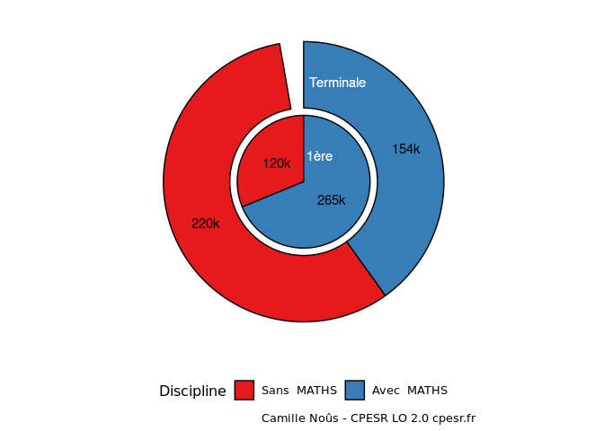
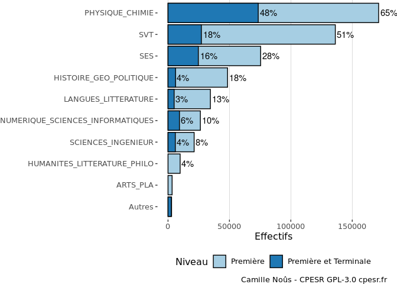

Choix spécialités Lycée
================

## Données sources

Les données accompagnent les notes de la DEPP :

  - <https://www.education.gouv.fr/choix-de-trois-specialites-en-premiere-generale-la-rentree-2019-15-combinaisons-pour-80-des-eleves-3245>
  - <https://www.education.gouv.fr/la-rentree-2020-les-eleves-de-terminale-precisent-leur-choix-de-parcours-307016>

### Test MATHS

    ## `summarise()` regrouping output by 'Niveau' (override with `.groups` argument)

<!-- -->

    ## `summarise()` regrouping output by 'Niveau' (override with `.groups` argument)
    ## `summarise()` regrouping output by 'Niveau' (override with `.groups` argument)

<!-- -->
