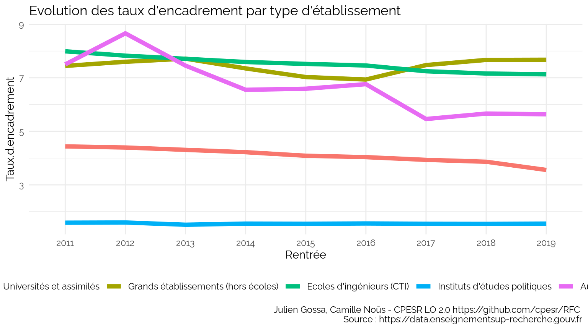
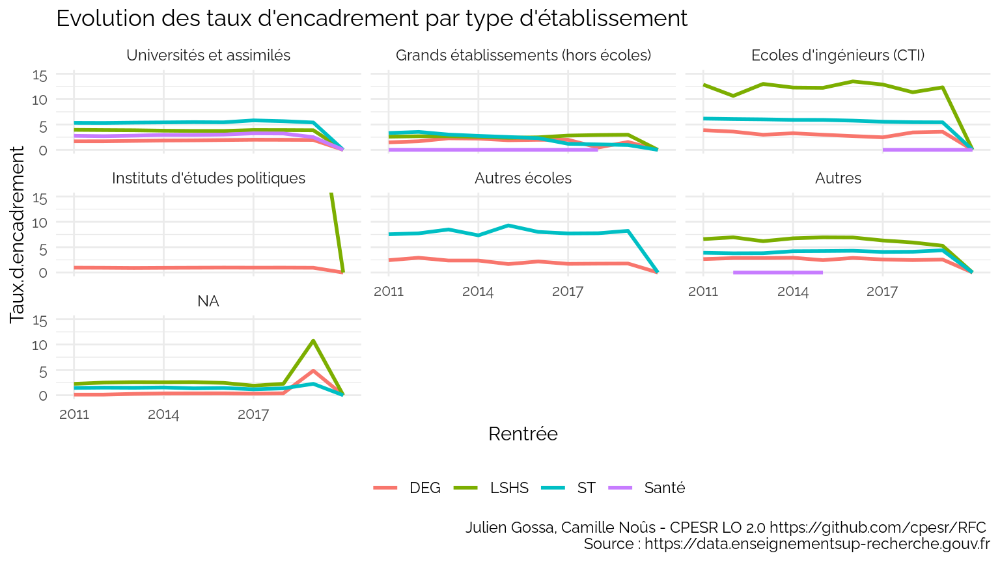
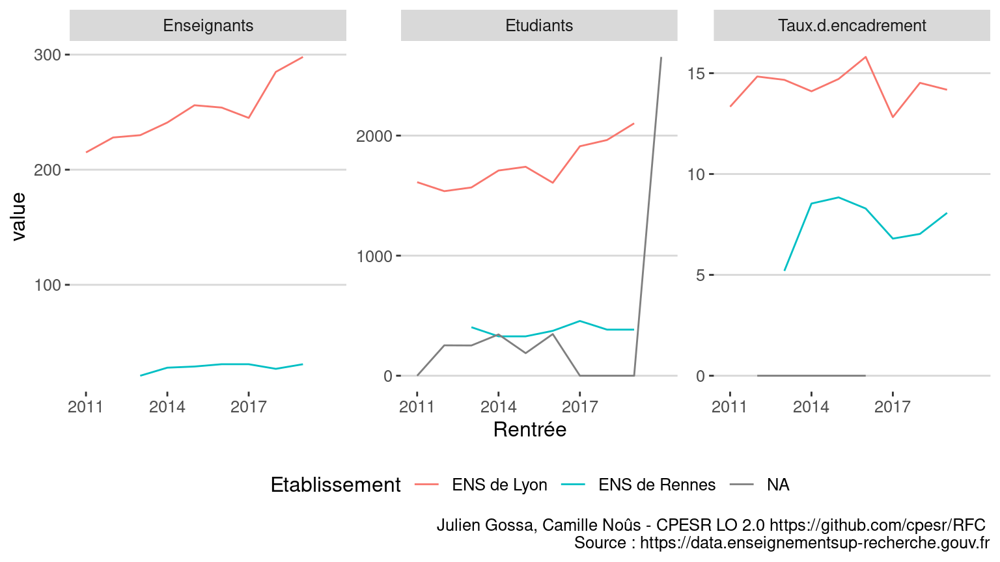
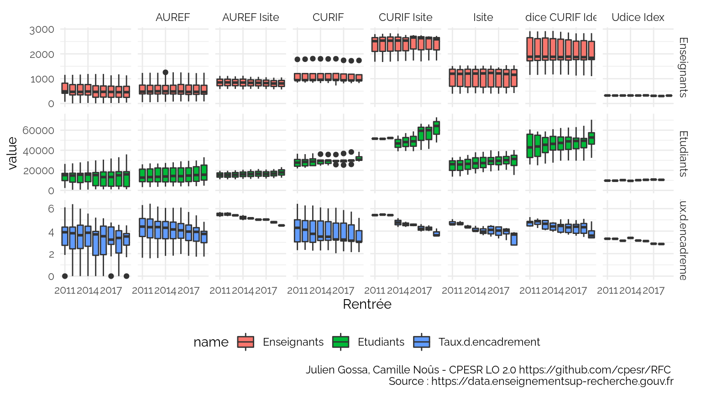
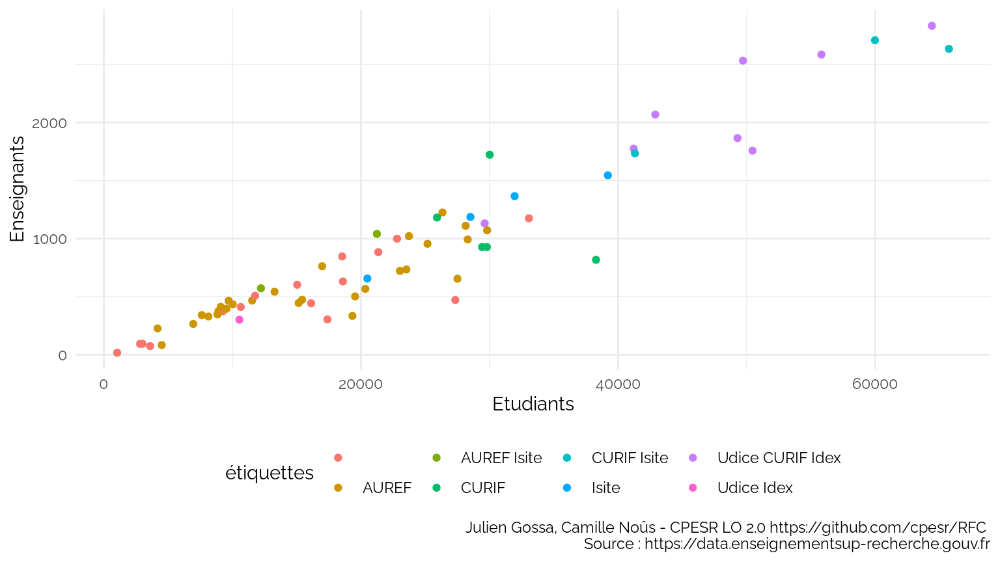
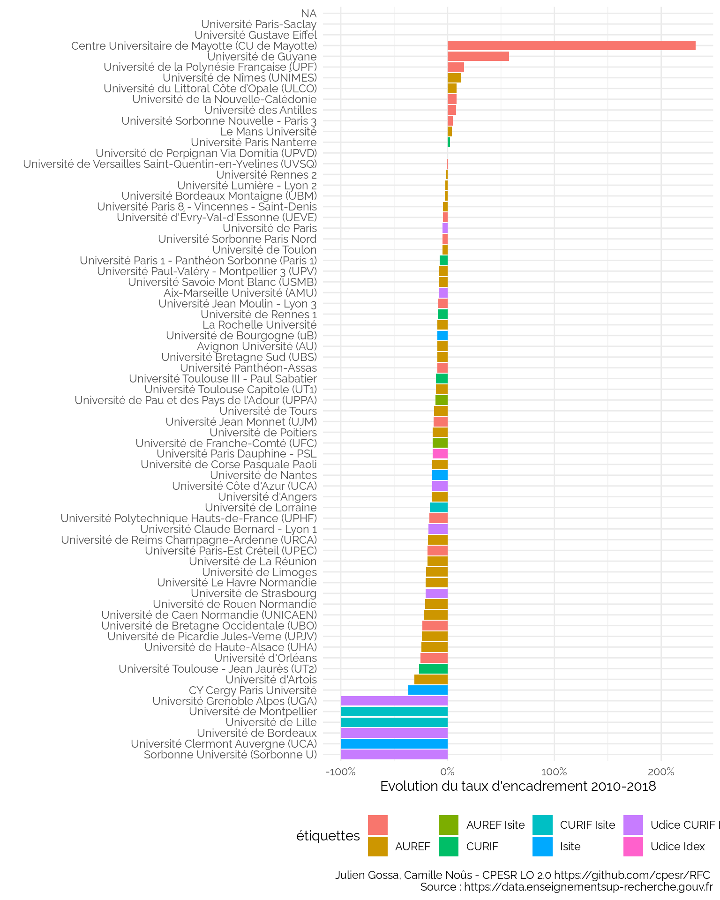

Taux d’encadrements
================

*Ce document est un brouillon de différentes visualisations. Il a
seulement vocation à permettre la discussion. Les observations et
propositions peuvent être ajoutées [en
issues](https://github.com/cpesr/RFC/issues).*

## Description des données

  - Sources :
      - <https://data.enseignementsup-recherche.gouv.fr/explore/dataset/fr-esr-statistiques-sur-les-effectifs-d-etudiants-inscrits-par-etablissement/export/>
      - <https://data.enseignementsup-recherche.gouv.fr/explore/dataset/fr-esr-enseignants-titulaires-esr-public/table/?disjunctive.annee&q=%22Universit%C3%A9+de+Nantes%22>
  - Nombre d’observations : 1016
  - Variables :

<!-- end list -->

    ## [1] "UAI"                "Rentrée"            "Etablissement"     
    ## [4] "Type.établissement" "Enseignants"        "Etudiants"

  - Définitions :
      - `Enseignants` : effectifs enseignants titulaires (EC et 2d
        degré)
      - `Etudiants` : effectifs étudiants (L, M et D)
      - `Taux.d.encadrement` : nombre d’enseignants pour 100 étudiants
        (`Enseignants / Etudiants * 100`)
  - Période : 2010, 2018
  - Limites :
      - les données ne concernent que le MESRI ;
      - des établissements ont été recollés après des changements
        d’identifiants ;
          - Paris Diderot et Paris Descartes sont considérés comme
            Université de Paris ;
          - Les données des étudiants de Paris Saclay ne sont pas
            recollables ;
          - Globalement, dès qu’il y a eu des transferts d’inscriptions
            d’étudiants ou d’enseignants avec une COMUE, les données
            sont sujettes à caution ;
      - les correspondances de disciplines sont imparfaites :
          - la discipline des enseignants est celle du CNU et non de la
            composante (UFR) d’affectation ;
          - la discipline des étudiants est celle de la composante (UFR)
            ;
          - l’imperfection est dûe aux enseignants d’une discipline
            affectés dans une autre, et aux services partagés entre
            plusieurs composantes.
          - les étudiant en STAPS on été classés en ST ;
      - pour les données disciplinaires, il est impossible de distinguer
        les doubles inscriptions (CPGE ou inscriptions principales et
        secondaires).

<!-- -->

*Attention : dans la suite, tous les graphiques avec les disciplines
comprennent donc les doubles inscriptions. Les tendances sont bonnes,
mais il peut y avoir un décalage dans les valeurs, et des effets
locaux.*

## Taux d’encadrement par type d’établissement

### Evolution globale

<!-- -->

### Evolution par type d’établissement et discipline

<!-- -->

### Distribution des établissements

<!-- -->

Top 10 :

<table>

<thead>

<tr>

<th style="text-align:left;">

Rentrée

</th>

<th style="text-align:left;">

Type.établissement

</th>

<th style="text-align:left;">

Etablissement

</th>

<th style="text-align:right;">

Enseignants

</th>

<th style="text-align:right;">

Etudiants

</th>

<th style="text-align:right;">

Taux.d.encadrement

</th>

</tr>

</thead>

<tbody>

<tr>

<td style="text-align:left;">

2018

</td>

<td style="text-align:left;">

Grand étab.

</td>

<td style="text-align:left;">

Observatoire de Paris

</td>

<td style="text-align:right;">

84

</td>

<td style="text-align:right;">

98

</td>

<td style="text-align:right;">

85.71429

</td>

</tr>

<tr>

<td style="text-align:left;">

2018

</td>

<td style="text-align:left;">

Grand étab.

</td>

<td style="text-align:left;">

Muséum national d’histoire naturelle (MNHN)

</td>

<td style="text-align:right;">

219

</td>

<td style="text-align:right;">

427

</td>

<td style="text-align:right;">

51.28806

</td>

</tr>

<tr>

<td style="text-align:left;">

2018

</td>

<td style="text-align:left;">

Grand étab.

</td>

<td style="text-align:left;">

Institut de physique du globe (IPG de Paris)

</td>

<td style="text-align:right;">

39

</td>

<td style="text-align:right;">

77

</td>

<td style="text-align:right;">

50.64935

</td>

</tr>

<tr>

<td style="text-align:left;">

2018

</td>

<td style="text-align:left;">

Grand étab.

</td>

<td style="text-align:left;">

École pratique des hautes études (EPHE)

</td>

<td style="text-align:right;">

191

</td>

<td style="text-align:right;">

916

</td>

<td style="text-align:right;">

20.85153

</td>

</tr>

<tr>

<td style="text-align:left;">

2018

</td>

<td style="text-align:left;">

ENS

</td>

<td style="text-align:left;">

École normale supérieure de Lyon (ENS de Lyon)

</td>

<td style="text-align:right;">

285

</td>

<td style="text-align:right;">

1963

</td>

<td style="text-align:right;">

14.51859

</td>

</tr>

<tr>

<td style="text-align:left;">

2018

</td>

<td style="text-align:left;">

Autre

</td>

<td style="text-align:left;">

Chimie ParisTech-PSL

</td>

<td style="text-align:right;">

43

</td>

<td style="text-align:right;">

430

</td>

<td style="text-align:right;">

10.00000

</td>

</tr>

</tbody>

</table>

<!-- -->

## Taux d’encadrement par grande discipline

### Evolution globale

<!-- -->

### Evolution par discpline et type d’établissement

<!-- -->

<!-- -->

### Distribution

<!-- -->

Top 10 (on y constate la limite disciplinaire expliquée au dessus) :

<table>

<thead>

<tr>

<th style="text-align:left;">

Rentrée

</th>

<th style="text-align:left;">

Etablissement

</th>

<th style="text-align:left;">

Grande.discipline

</th>

<th style="text-align:right;">

Enseignants

</th>

<th style="text-align:right;">

Etudiants

</th>

<th style="text-align:right;">

Taux.d.encadrement

</th>

</tr>

</thead>

<tbody>

<tr>

<td style="text-align:left;">

2018

</td>

<td style="text-align:left;">

Institut national des sciences appliquées de Lyon (INSA de Lyon)

</td>

<td style="text-align:left;">

LSHS

</td>

<td style="text-align:right;">

60

</td>

<td style="text-align:right;">

4

</td>

<td style="text-align:right;">

1500.0000

</td>

</tr>

<tr>

<td style="text-align:left;">

2018

</td>

<td style="text-align:left;">

Institut polytechnique de Grenoble (Grenoble INP)

</td>

<td style="text-align:left;">

DEG

</td>

<td style="text-align:right;">

15

</td>

<td style="text-align:right;">

1

</td>

<td style="text-align:right;">

1500.0000

</td>

</tr>

<tr>

<td style="text-align:left;">

2018

</td>

<td style="text-align:left;">

Toulouse INP

</td>

<td style="text-align:left;">

LSHS

</td>

<td style="text-align:right;">

21

</td>

<td style="text-align:right;">

2

</td>

<td style="text-align:right;">

1050.0000

</td>

</tr>

<tr>

<td style="text-align:left;">

2018

</td>

<td style="text-align:left;">

Université Panthéon-Assas

</td>

<td style="text-align:left;">

ST

</td>

<td style="text-align:right;">

20

</td>

<td style="text-align:right;">

3

</td>

<td style="text-align:right;">

666.6667

</td>

</tr>

<tr>

<td style="text-align:left;">

2018

</td>

<td style="text-align:left;">

Toulouse INP

</td>

<td style="text-align:left;">

DEG

</td>

<td style="text-align:right;">

10

</td>

<td style="text-align:right;">

2

</td>

<td style="text-align:right;">

500.0000

</td>

</tr>

<tr>

<td style="text-align:left;">

2018

</td>

<td style="text-align:left;">

Centrale Lyon (EC Lyon)

</td>

<td style="text-align:left;">

LSHS

</td>

<td style="text-align:right;">

12

</td>

<td style="text-align:right;">

7

</td>

<td style="text-align:right;">

171.4286

</td>

</tr>

</tbody>

</table>

<!-- -->

## Focus ENS

<!-- -->

<!-- -->

## Focus Universités

<!-- -->

<!-- -->

<!-- -->

<!-- -->

<!-- -->

<!-- -->

<!-- -->

<!-- -->

<!-- -->

<!-- -->

*Note : dans la suite, la barre verticale indique la valeur nationale
(donc pas la moyenne des établissements)*

<!-- -->

<!-- -->

### Focus Guyane

<table>

<thead>

<tr>

<th style="text-align:left;">

UAI

</th>

<th style="text-align:left;">

Rentrée

</th>

<th style="text-align:left;">

Etablissement

</th>

<th style="text-align:left;">

Type.établissement

</th>

<th style="text-align:right;">

Enseignants

</th>

<th style="text-align:right;">

Etudiants

</th>

</tr>

</thead>

<tbody>

<tr>

<td style="text-align:left;">

9730429D

</td>

<td style="text-align:left;">

2015

</td>

<td style="text-align:left;">

Université de Guyane

</td>

<td style="text-align:left;">

Université

</td>

<td style="text-align:right;">

37

</td>

<td style="text-align:right;">

2185

</td>

</tr>

<tr>

<td style="text-align:left;">

9730429D

</td>

<td style="text-align:left;">

2016

</td>

<td style="text-align:left;">

Université de Guyane

</td>

<td style="text-align:left;">

Université

</td>

<td style="text-align:right;">

57

</td>

<td style="text-align:right;">

2638

</td>

</tr>

<tr>

<td style="text-align:left;">

9730429D

</td>

<td style="text-align:left;">

2017

</td>

<td style="text-align:left;">

Université de Guyane

</td>

<td style="text-align:left;">

Université

</td>

<td style="text-align:right;">

93

</td>

<td style="text-align:right;">

2517

</td>

</tr>

<tr>

<td style="text-align:left;">

9730429D

</td>

<td style="text-align:left;">

2018

</td>

<td style="text-align:left;">

Université de Guyane

</td>

<td style="text-align:left;">

Université

</td>

<td style="text-align:right;">

74

</td>

<td style="text-align:right;">

2868

</td>

</tr>

</tbody>

</table>

Les données sont courtes et les valeurs très basses, au point de ne pas
être significatives.

### Focus Artois

<table>

<thead>

<tr>

<th style="text-align:left;">

UAI

</th>

<th style="text-align:left;">

Rentrée

</th>

<th style="text-align:left;">

Etablissement

</th>

<th style="text-align:left;">

Type.établissement

</th>

<th style="text-align:right;">

Enseignants

</th>

<th style="text-align:right;">

Etudiants

</th>

</tr>

</thead>

<tbody>

<tr>

<td style="text-align:left;">

0623957P

</td>

<td style="text-align:left;">

2010

</td>

<td style="text-align:left;">

Université d’Artois

</td>

<td style="text-align:left;">

Université

</td>

<td style="text-align:right;">

642

</td>

<td style="text-align:right;">

11404

</td>

</tr>

<tr>

<td style="text-align:left;">

0623957P

</td>

<td style="text-align:left;">

2011

</td>

<td style="text-align:left;">

Université d’Artois

</td>

<td style="text-align:left;">

Université

</td>

<td style="text-align:right;">

635

</td>

<td style="text-align:right;">

10817

</td>

</tr>

<tr>

<td style="text-align:left;">

0623957P

</td>

<td style="text-align:left;">

2012

</td>

<td style="text-align:left;">

Université d’Artois

</td>

<td style="text-align:left;">

Université

</td>

<td style="text-align:right;">

625

</td>

<td style="text-align:right;">

11370

</td>

</tr>

<tr>

<td style="text-align:left;">

0623957P

</td>

<td style="text-align:left;">

2013

</td>

<td style="text-align:left;">

Université d’Artois

</td>

<td style="text-align:left;">

Université

</td>

<td style="text-align:right;">

614

</td>

<td style="text-align:right;">

10956

</td>

</tr>

<tr>

<td style="text-align:left;">

0623957P

</td>

<td style="text-align:left;">

2014

</td>

<td style="text-align:left;">

Université d’Artois

</td>

<td style="text-align:left;">

Université

</td>

<td style="text-align:right;">

615

</td>

<td style="text-align:right;">

10134

</td>

</tr>

<tr>

<td style="text-align:left;">

0623957P

</td>

<td style="text-align:left;">

2015

</td>

<td style="text-align:left;">

Université d’Artois

</td>

<td style="text-align:left;">

Université

</td>

<td style="text-align:right;">

624

</td>

<td style="text-align:right;">

10593

</td>

</tr>

<tr>

<td style="text-align:left;">

0623957P

</td>

<td style="text-align:left;">

2016

</td>

<td style="text-align:left;">

Université d’Artois

</td>

<td style="text-align:left;">

Université

</td>

<td style="text-align:right;">

484

</td>

<td style="text-align:right;">

10844

</td>

</tr>

<tr>

<td style="text-align:left;">

0623957P

</td>

<td style="text-align:left;">

2017

</td>

<td style="text-align:left;">

Université d’Artois

</td>

<td style="text-align:left;">

Université

</td>

<td style="text-align:right;">

470

</td>

<td style="text-align:right;">

11325

</td>

</tr>

<tr>

<td style="text-align:left;">

0623957P

</td>

<td style="text-align:left;">

2018

</td>

<td style="text-align:left;">

Université d’Artois

</td>

<td style="text-align:left;">

Université

</td>

<td style="text-align:right;">

466

</td>

<td style="text-align:right;">

11536

</td>

</tr>

</tbody>

</table>

La baisse de près d’un quart des enseignants entre 2015 et 2016 est peu
crédible. Il s’agit probablement d’un changement de périmètre (à
confirmer).

### Focus UHA

<table>

<thead>

<tr>

<th style="text-align:left;">

UAI

</th>

<th style="text-align:left;">

Rentrée

</th>

<th style="text-align:left;">

Etablissement

</th>

<th style="text-align:left;">

Type.établissement

</th>

<th style="text-align:right;">

Enseignants

</th>

<th style="text-align:right;">

Etudiants

</th>

</tr>

</thead>

<tbody>

<tr>

<td style="text-align:left;">

0681166Y

</td>

<td style="text-align:left;">

2010

</td>

<td style="text-align:left;">

Université de Haute-Alsace (UHA)

</td>

<td style="text-align:left;">

Université

</td>

<td style="text-align:right;">

439

</td>

<td style="text-align:right;">

7947

</td>

</tr>

<tr>

<td style="text-align:left;">

0681166Y

</td>

<td style="text-align:left;">

2011

</td>

<td style="text-align:left;">

Université de Haute-Alsace (UHA)

</td>

<td style="text-align:left;">

Université

</td>

<td style="text-align:right;">

444

</td>

<td style="text-align:right;">

7743

</td>

</tr>

<tr>

<td style="text-align:left;">

0681166Y

</td>

<td style="text-align:left;">

2012

</td>

<td style="text-align:left;">

Université de Haute-Alsace (UHA)

</td>

<td style="text-align:left;">

Université

</td>

<td style="text-align:right;">

441

</td>

<td style="text-align:right;">

7536

</td>

</tr>

<tr>

<td style="text-align:left;">

0681166Y

</td>

<td style="text-align:left;">

2013

</td>

<td style="text-align:left;">

Université de Haute-Alsace (UHA)

</td>

<td style="text-align:left;">

Université

</td>

<td style="text-align:right;">

442

</td>

<td style="text-align:right;">

7436

</td>

</tr>

<tr>

<td style="text-align:left;">

0681166Y

</td>

<td style="text-align:left;">

2014

</td>

<td style="text-align:left;">

Université de Haute-Alsace (UHA)

</td>

<td style="text-align:left;">

Université

</td>

<td style="text-align:right;">

436

</td>

<td style="text-align:right;">

7688

</td>

</tr>

<tr>

<td style="text-align:left;">

0681166Y

</td>

<td style="text-align:left;">

2015

</td>

<td style="text-align:left;">

Université de Haute-Alsace (UHA)

</td>

<td style="text-align:left;">

Université

</td>

<td style="text-align:right;">

438

</td>

<td style="text-align:right;">

7923

</td>

</tr>

<tr>

<td style="text-align:left;">

0681166Y

</td>

<td style="text-align:left;">

2016

</td>

<td style="text-align:left;">

Université de Haute-Alsace (UHA)

</td>

<td style="text-align:left;">

Université

</td>

<td style="text-align:right;">

433

</td>

<td style="text-align:right;">

8064

</td>

</tr>

<tr>

<td style="text-align:left;">

0681166Y

</td>

<td style="text-align:left;">

2017

</td>

<td style="text-align:left;">

Université de Haute-Alsace (UHA)

</td>

<td style="text-align:left;">

Université

</td>

<td style="text-align:right;">

428

</td>

<td style="text-align:right;">

9376

</td>

</tr>

<tr>

<td style="text-align:left;">

0681166Y

</td>

<td style="text-align:left;">

2018

</td>

<td style="text-align:left;">

Université de Haute-Alsace (UHA)

</td>

<td style="text-align:left;">

Université

</td>

<td style="text-align:right;">

434

</td>

<td style="text-align:right;">

10029

</td>

</tr>

</tbody>

</table>

L’augmentation de 25% des effectifs étudiants entre 2017 et 2018 indique
un changement de périmètre des inscriptions étudiants, probablement
après des accord avec d’autres établissements pour délivrer des
diplômes UHA sans assurer les enseignements.

Ces chiffres ne reflètent donc pas le taux d’encadrement réel de
l’université.

### Classement sans : Guyane, Artois et UHA

<!-- -->
