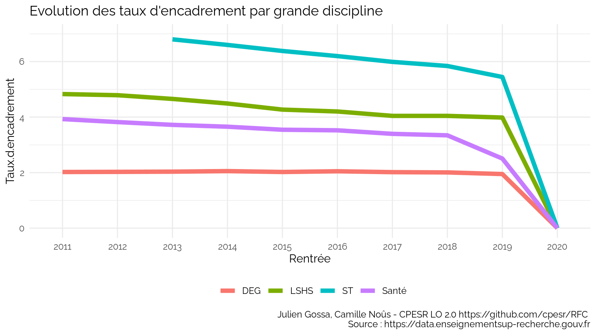
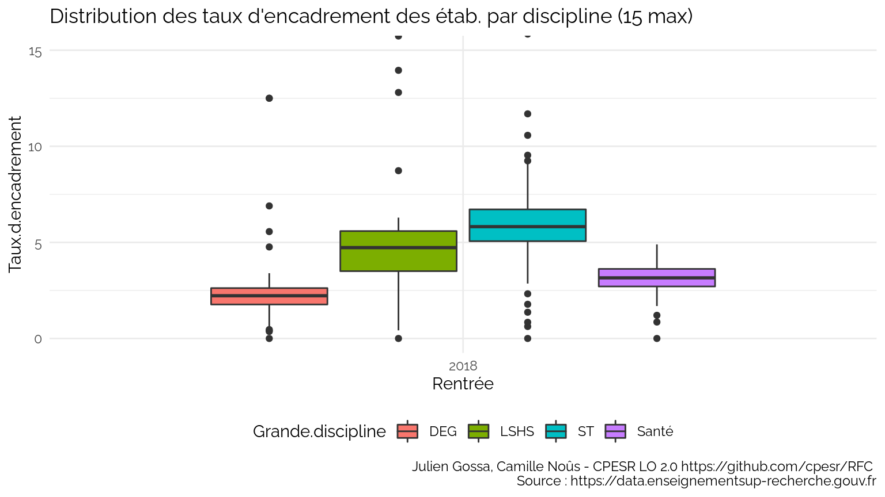
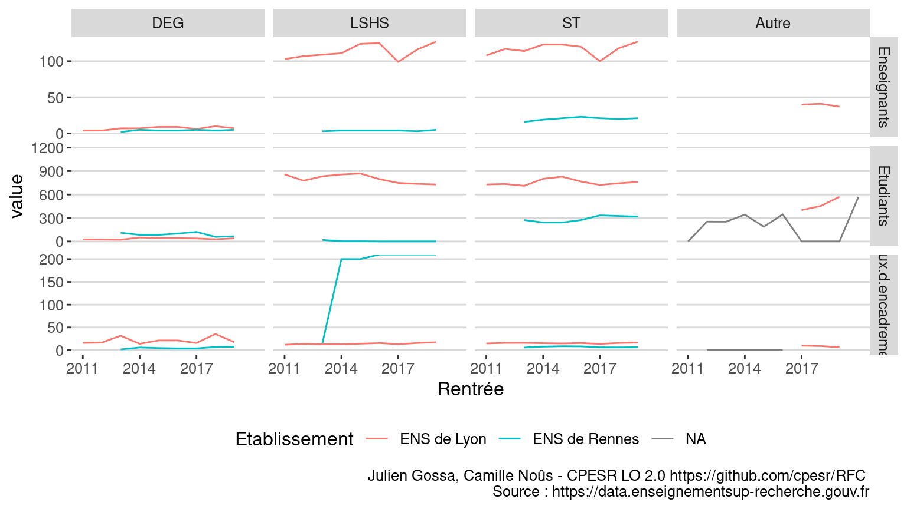
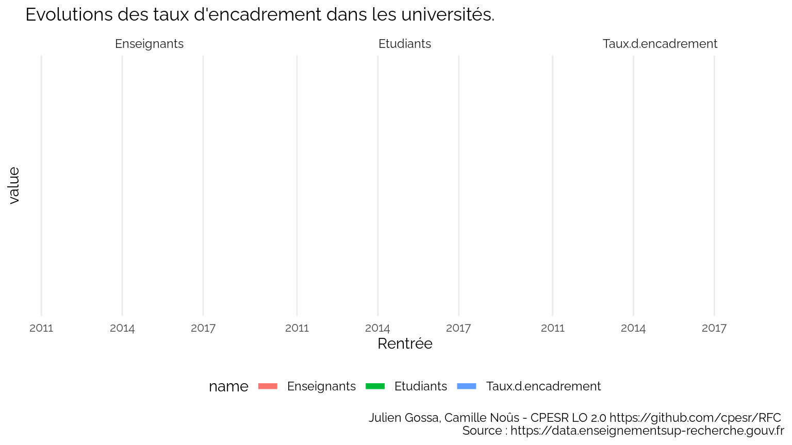
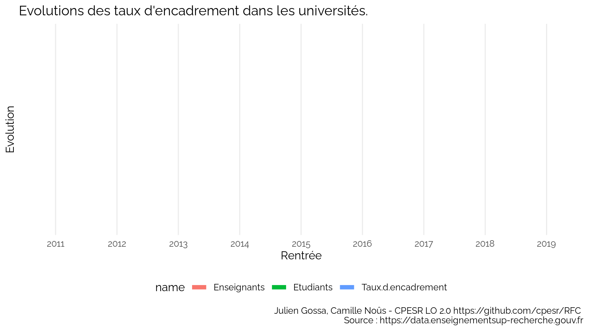
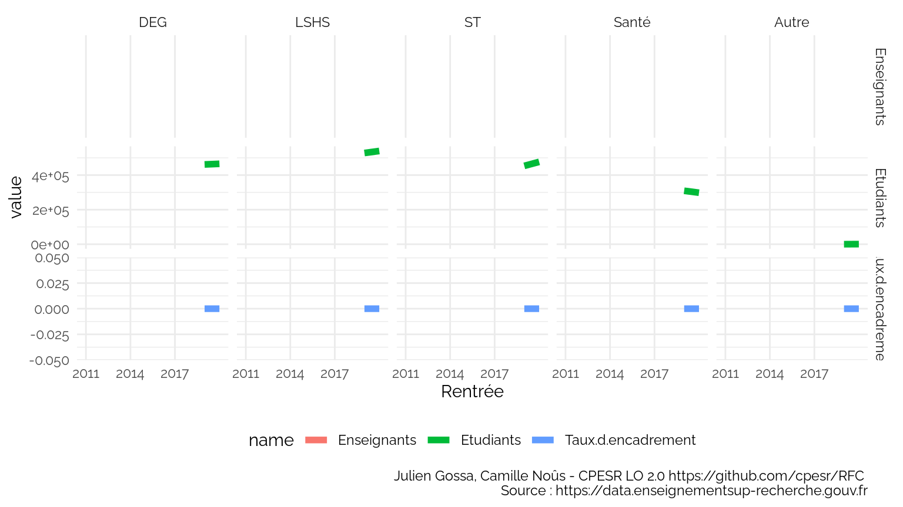
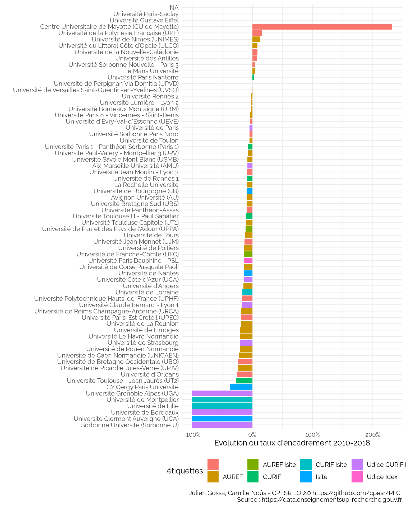

Taux d’encadrements
================

*Ce document est un brouillon de différentes visualisations. Il a
seulement vocation à permettre la discussion. Les observations et
propositions peuvent être ajoutées [en
issues](https://github.com/cpesr/RFC/issues).*

## Description des données

  - Sources :
      - <https://data.enseignementsup-recherche.gouv.fr/explore/dataset/fr-esr-statistiques-sur-les-effectifs-d-etudiants-inscrits-par-etablissement/export/>
      - <https://data.enseignementsup-recherche.gouv.fr/explore/dataset/fr-esr-enseignants-titulaires-esr-public/table/?disjunctive.annee&q=%22Universit%C3%A9+de+Nantes%22>
  - Nombre d’observations : 1016
  - Variables :

<!-- end list -->

    ## [1] "UAI"                "Rentrée"            "Etablissement"     
    ## [4] "Type.établissement" "Enseignants"        "Etudiants"

  - Définitions :
      - `Enseignants` : effectifs enseignants titulaires (EC et 2d
        degré)
      - `Etudiants` : effectifs étudiants (L, M et D)
      - `Taux.d.encadrement` : nombre d’enseignants pour 100 étudiants
        (`Enseignants / Etudiants * 100`)
  - Période : 2010, 2018
  - Limites :
      - les données ne concernent que le MESRI ;
      - des établissements ont été recollés après des changements
        d’identifiants ;
          - Paris Diderot et Paris Descartes sont considérés comme
            Université de Paris ;
          - Les données des étudiants de Paris Saclay ne sont pas
            recollables ;
          - Globalement, dès qu’il y a eu des transferts d’inscriptions
            d’étudiants ou d’enseignants avec une COMUE, les données
            sont sujettes à caution ;
      - les correspondances de disciplines sont imparfaites :
          - la discipline des enseignants est celle du CNU et non de la
            composante (UFR) d’affectation ;
          - la discipline des étudiants est celle de la composante (UFR)
            ;
          - l’imperfection est dûe aux enseignants d’une discipline
            affectés dans une autre, et aux services partagés entre
            plusieurs composantes.
          - les étudiant en STAPS on été classés en ST ;
      - pour les données disciplinaires, il est impossible de distinguer
        les doubles inscriptions (CPGE ou inscriptions principales et
        secondaires).

<!-- -->

*Attention : dans la suite, tous les graphiques avec les disciplines
comprennent donc les doubles inscriptions. Les tendances sont bonnes,
mais il peut y avoir un décalage dans les valeurs, et des effets locaux.
Les autres données sont hors double inscriptions.*

## Taux d’encadrement par type d’établissement

### Evolution globale

<!-- -->

### Evolution par type d’établissement et discipline

<!-- -->

### Distribution des établissements

<!-- -->

Top 10 :

<table>

<thead>

<tr>

<th style="text-align:left;">

Rentrée

</th>

<th style="text-align:left;">

Type.établissement

</th>

<th style="text-align:left;">

Etablissement

</th>

<th style="text-align:right;">

Enseignants

</th>

<th style="text-align:right;">

Etudiants

</th>

<th style="text-align:right;">

Taux.d.encadrement

</th>

</tr>

</thead>

<tbody>

<tr>

<td style="text-align:left;">

2018

</td>

<td style="text-align:left;">

Grand étab.

</td>

<td style="text-align:left;">

Observatoire de Paris

</td>

<td style="text-align:right;">

84

</td>

<td style="text-align:right;">

98

</td>

<td style="text-align:right;">

85.71429

</td>

</tr>

<tr>

<td style="text-align:left;">

2018

</td>

<td style="text-align:left;">

Grand étab.

</td>

<td style="text-align:left;">

Muséum national d’histoire naturelle (MNHN)

</td>

<td style="text-align:right;">

219

</td>

<td style="text-align:right;">

427

</td>

<td style="text-align:right;">

51.28806

</td>

</tr>

<tr>

<td style="text-align:left;">

2018

</td>

<td style="text-align:left;">

Grand étab.

</td>

<td style="text-align:left;">

Institut de physique du globe (IPG de Paris)

</td>

<td style="text-align:right;">

39

</td>

<td style="text-align:right;">

77

</td>

<td style="text-align:right;">

50.64935

</td>

</tr>

<tr>

<td style="text-align:left;">

2018

</td>

<td style="text-align:left;">

Grand étab.

</td>

<td style="text-align:left;">

École pratique des hautes études (EPHE)

</td>

<td style="text-align:right;">

191

</td>

<td style="text-align:right;">

916

</td>

<td style="text-align:right;">

20.85153

</td>

</tr>

<tr>

<td style="text-align:left;">

2018

</td>

<td style="text-align:left;">

ENS

</td>

<td style="text-align:left;">

École normale supérieure de Lyon (ENS de Lyon)

</td>

<td style="text-align:right;">

285

</td>

<td style="text-align:right;">

1963

</td>

<td style="text-align:right;">

14.51859

</td>

</tr>

<tr>

<td style="text-align:left;">

2018

</td>

<td style="text-align:left;">

Autre

</td>

<td style="text-align:left;">

Chimie ParisTech-PSL

</td>

<td style="text-align:right;">

43

</td>

<td style="text-align:right;">

430

</td>

<td style="text-align:right;">

10.00000

</td>

</tr>

</tbody>

</table>

<!-- -->

## Taux d’encadrement par grande discipline

### Evolution globale

<!-- -->

### Evolution par discpline et type d’établissement

<!-- -->

<!-- -->

### Distribution

<!-- -->

Top 10 (on y constate la limite disciplinaire expliquée au dessus) :

<table>

<thead>

<tr>

<th style="text-align:left;">

Rentrée

</th>

<th style="text-align:left;">

Etablissement

</th>

<th style="text-align:left;">

Grande.discipline

</th>

<th style="text-align:right;">

Enseignants

</th>

<th style="text-align:right;">

Etudiants

</th>

<th style="text-align:right;">

Taux.d.encadrement

</th>

</tr>

</thead>

<tbody>

<tr>

<td style="text-align:left;">

2018

</td>

<td style="text-align:left;">

Institut national des sciences appliquées de Lyon (INSA de Lyon)

</td>

<td style="text-align:left;">

LSHS

</td>

<td style="text-align:right;">

60

</td>

<td style="text-align:right;">

4

</td>

<td style="text-align:right;">

1500.0000

</td>

</tr>

<tr>

<td style="text-align:left;">

2018

</td>

<td style="text-align:left;">

Institut polytechnique de Grenoble (Grenoble INP)

</td>

<td style="text-align:left;">

DEG

</td>

<td style="text-align:right;">

15

</td>

<td style="text-align:right;">

1

</td>

<td style="text-align:right;">

1500.0000

</td>

</tr>

<tr>

<td style="text-align:left;">

2018

</td>

<td style="text-align:left;">

Toulouse INP

</td>

<td style="text-align:left;">

LSHS

</td>

<td style="text-align:right;">

21

</td>

<td style="text-align:right;">

2

</td>

<td style="text-align:right;">

1050.0000

</td>

</tr>

<tr>

<td style="text-align:left;">

2018

</td>

<td style="text-align:left;">

Université Panthéon-Assas

</td>

<td style="text-align:left;">

ST

</td>

<td style="text-align:right;">

20

</td>

<td style="text-align:right;">

3

</td>

<td style="text-align:right;">

666.6667

</td>

</tr>

<tr>

<td style="text-align:left;">

2018

</td>

<td style="text-align:left;">

Toulouse INP

</td>

<td style="text-align:left;">

DEG

</td>

<td style="text-align:right;">

10

</td>

<td style="text-align:right;">

2

</td>

<td style="text-align:right;">

500.0000

</td>

</tr>

<tr>

<td style="text-align:left;">

2018

</td>

<td style="text-align:left;">

Centrale Lyon (EC Lyon)

</td>

<td style="text-align:left;">

LSHS

</td>

<td style="text-align:right;">

12

</td>

<td style="text-align:right;">

7

</td>

<td style="text-align:right;">

171.4286

</td>

</tr>

</tbody>

</table>

<!-- -->

## Focus ENS

<!-- -->

<!-- -->

## Focus Universités

<!-- -->

<!-- -->

<!-- -->

<!-- -->

<!-- -->

<!-- -->

<!-- -->

<!-- -->

<!-- -->

<!-- -->

<!-- -->

*Note : dans la suite, la barre verticale indique la valeur nationale
(donc pas la moyenne des établissements)*

<!-- -->

<!-- -->

### Focus Guyane

<table>

<thead>

<tr>

<th style="text-align:left;">

UAI

</th>

<th style="text-align:left;">

Rentrée

</th>

<th style="text-align:left;">

Etablissement

</th>

<th style="text-align:left;">

Type.établissement

</th>

<th style="text-align:right;">

Enseignants

</th>

<th style="text-align:right;">

Etudiants

</th>

</tr>

</thead>

<tbody>

<tr>

<td style="text-align:left;">

9730429D

</td>

<td style="text-align:left;">

2015

</td>

<td style="text-align:left;">

Université de Guyane

</td>

<td style="text-align:left;">

Université

</td>

<td style="text-align:right;">

37

</td>

<td style="text-align:right;">

2185

</td>

</tr>

<tr>

<td style="text-align:left;">

9730429D

</td>

<td style="text-align:left;">

2016

</td>

<td style="text-align:left;">

Université de Guyane

</td>

<td style="text-align:left;">

Université

</td>

<td style="text-align:right;">

57

</td>

<td style="text-align:right;">

2638

</td>

</tr>

<tr>

<td style="text-align:left;">

9730429D

</td>

<td style="text-align:left;">

2017

</td>

<td style="text-align:left;">

Université de Guyane

</td>

<td style="text-align:left;">

Université

</td>

<td style="text-align:right;">

93

</td>

<td style="text-align:right;">

2517

</td>

</tr>

<tr>

<td style="text-align:left;">

9730429D

</td>

<td style="text-align:left;">

2018

</td>

<td style="text-align:left;">

Université de Guyane

</td>

<td style="text-align:left;">

Université

</td>

<td style="text-align:right;">

74

</td>

<td style="text-align:right;">

2868

</td>

</tr>

</tbody>

</table>

Les données sont courtes et les valeurs très basses, au point de ne pas
être significatives.

### Focus Artois

<table>

<thead>

<tr>

<th style="text-align:left;">

UAI

</th>

<th style="text-align:left;">

Rentrée

</th>

<th style="text-align:left;">

Etablissement

</th>

<th style="text-align:left;">

Type.établissement

</th>

<th style="text-align:right;">

Enseignants

</th>

<th style="text-align:right;">

Etudiants

</th>

</tr>

</thead>

<tbody>

<tr>

<td style="text-align:left;">

0623957P

</td>

<td style="text-align:left;">

2010

</td>

<td style="text-align:left;">

Université d’Artois

</td>

<td style="text-align:left;">

Université

</td>

<td style="text-align:right;">

642

</td>

<td style="text-align:right;">

11404

</td>

</tr>

<tr>

<td style="text-align:left;">

0623957P

</td>

<td style="text-align:left;">

2011

</td>

<td style="text-align:left;">

Université d’Artois

</td>

<td style="text-align:left;">

Université

</td>

<td style="text-align:right;">

635

</td>

<td style="text-align:right;">

10817

</td>

</tr>

<tr>

<td style="text-align:left;">

0623957P

</td>

<td style="text-align:left;">

2012

</td>

<td style="text-align:left;">

Université d’Artois

</td>

<td style="text-align:left;">

Université

</td>

<td style="text-align:right;">

625

</td>

<td style="text-align:right;">

11370

</td>

</tr>

<tr>

<td style="text-align:left;">

0623957P

</td>

<td style="text-align:left;">

2013

</td>

<td style="text-align:left;">

Université d’Artois

</td>

<td style="text-align:left;">

Université

</td>

<td style="text-align:right;">

614

</td>

<td style="text-align:right;">

10956

</td>

</tr>

<tr>

<td style="text-align:left;">

0623957P

</td>

<td style="text-align:left;">

2014

</td>

<td style="text-align:left;">

Université d’Artois

</td>

<td style="text-align:left;">

Université

</td>

<td style="text-align:right;">

615

</td>

<td style="text-align:right;">

10134

</td>

</tr>

<tr>

<td style="text-align:left;">

0623957P

</td>

<td style="text-align:left;">

2015

</td>

<td style="text-align:left;">

Université d’Artois

</td>

<td style="text-align:left;">

Université

</td>

<td style="text-align:right;">

624

</td>

<td style="text-align:right;">

10593

</td>

</tr>

<tr>

<td style="text-align:left;">

0623957P

</td>

<td style="text-align:left;">

2016

</td>

<td style="text-align:left;">

Université d’Artois

</td>

<td style="text-align:left;">

Université

</td>

<td style="text-align:right;">

484

</td>

<td style="text-align:right;">

10844

</td>

</tr>

<tr>

<td style="text-align:left;">

0623957P

</td>

<td style="text-align:left;">

2017

</td>

<td style="text-align:left;">

Université d’Artois

</td>

<td style="text-align:left;">

Université

</td>

<td style="text-align:right;">

470

</td>

<td style="text-align:right;">

11325

</td>

</tr>

<tr>

<td style="text-align:left;">

0623957P

</td>

<td style="text-align:left;">

2018

</td>

<td style="text-align:left;">

Université d’Artois

</td>

<td style="text-align:left;">

Université

</td>

<td style="text-align:right;">

466

</td>

<td style="text-align:right;">

11536

</td>

</tr>

</tbody>

</table>

La baisse de près d’un quart des enseignants entre 2015 et 2016 est peu
crédible. Il s’agit probablement d’un changement de périmètre (à
confirmer).

### Focus UHA

<table>

<thead>

<tr>

<th style="text-align:left;">

UAI

</th>

<th style="text-align:left;">

Rentrée

</th>

<th style="text-align:left;">

Etablissement

</th>

<th style="text-align:left;">

Type.établissement

</th>

<th style="text-align:right;">

Enseignants

</th>

<th style="text-align:right;">

Etudiants

</th>

</tr>

</thead>

<tbody>

<tr>

<td style="text-align:left;">

0681166Y

</td>

<td style="text-align:left;">

2010

</td>

<td style="text-align:left;">

Université de Haute-Alsace (UHA)

</td>

<td style="text-align:left;">

Université

</td>

<td style="text-align:right;">

439

</td>

<td style="text-align:right;">

7947

</td>

</tr>

<tr>

<td style="text-align:left;">

0681166Y

</td>

<td style="text-align:left;">

2011

</td>

<td style="text-align:left;">

Université de Haute-Alsace (UHA)

</td>

<td style="text-align:left;">

Université

</td>

<td style="text-align:right;">

444

</td>

<td style="text-align:right;">

7743

</td>

</tr>

<tr>

<td style="text-align:left;">

0681166Y

</td>

<td style="text-align:left;">

2012

</td>

<td style="text-align:left;">

Université de Haute-Alsace (UHA)

</td>

<td style="text-align:left;">

Université

</td>

<td style="text-align:right;">

441

</td>

<td style="text-align:right;">

7536

</td>

</tr>

<tr>

<td style="text-align:left;">

0681166Y

</td>

<td style="text-align:left;">

2013

</td>

<td style="text-align:left;">

Université de Haute-Alsace (UHA)

</td>

<td style="text-align:left;">

Université

</td>

<td style="text-align:right;">

442

</td>

<td style="text-align:right;">

7436

</td>

</tr>

<tr>

<td style="text-align:left;">

0681166Y

</td>

<td style="text-align:left;">

2014

</td>

<td style="text-align:left;">

Université de Haute-Alsace (UHA)

</td>

<td style="text-align:left;">

Université

</td>

<td style="text-align:right;">

436

</td>

<td style="text-align:right;">

7688

</td>

</tr>

<tr>

<td style="text-align:left;">

0681166Y

</td>

<td style="text-align:left;">

2015

</td>

<td style="text-align:left;">

Université de Haute-Alsace (UHA)

</td>

<td style="text-align:left;">

Université

</td>

<td style="text-align:right;">

438

</td>

<td style="text-align:right;">

7923

</td>

</tr>

<tr>

<td style="text-align:left;">

0681166Y

</td>

<td style="text-align:left;">

2016

</td>

<td style="text-align:left;">

Université de Haute-Alsace (UHA)

</td>

<td style="text-align:left;">

Université

</td>

<td style="text-align:right;">

433

</td>

<td style="text-align:right;">

8064

</td>

</tr>

<tr>

<td style="text-align:left;">

0681166Y

</td>

<td style="text-align:left;">

2017

</td>

<td style="text-align:left;">

Université de Haute-Alsace (UHA)

</td>

<td style="text-align:left;">

Université

</td>

<td style="text-align:right;">

428

</td>

<td style="text-align:right;">

9376

</td>

</tr>

<tr>

<td style="text-align:left;">

0681166Y

</td>

<td style="text-align:left;">

2018

</td>

<td style="text-align:left;">

Université de Haute-Alsace (UHA)

</td>

<td style="text-align:left;">

Université

</td>

<td style="text-align:right;">

434

</td>

<td style="text-align:right;">

10029

</td>

</tr>

</tbody>

</table>

L’augmentation de 25% des effectifs étudiants entre 2017 et 2018 indique
un changement de périmètre des inscriptions étudiants, probablement
après des accord avec d’autres établissements pour délivrer des
diplômes UHA sans assurer les enseignements.

Ces chiffres ne reflètent donc pas le taux d’encadrement réel de
l’université.

### Classement sans : Guyane, Artois et UHA

<!-- -->

### Hausse des inscriptions en université entre 2014 et 2015

*Question* : Que se passe-t-il en 2015 ?

Le [CP du
MESRI](https://cache.media.enseignementsup-recherche.gouv.fr/file/Rentree_universitaire/51/5/DP_optimise_467515.pdf)
confirme l’augmentation, ce qui permet de confirmer la hausse : *« Avec
ses 65 000 étudiants supplémentaires à l’université, cette année, la
rentrée revêt une importance toute particulière. Elle est la
manifestation tangible du succès de nos universités et de nos écoles, et
plus généralement, la preuve que le double mouvement de démocratisation
de notre enseignement supérieur et d’élévation des qualifications et des
diplômes de la jeunesse, est désormais universellement engagé. Cette
évolution implique des efforts renforcés en matière de qualité des
enseignements, de soutien à la vie étudiante dans tous ses aspects
sociaux, et d’amélioration des conditions matérielles et humaines
d’accueil des étudiants. »*

Effectifs étudiants entre 2013 et 2015 :

<table>

<thead>

<tr>

<th style="text-align:left;">

Etablissement

</th>

<th style="text-align:right;">

Rentrée2013

</th>

<th style="text-align:right;">

Rentrée2014

</th>

<th style="text-align:right;">

Rentrée2015

</th>

<th style="text-align:right;">

delta1314

</th>

<th style="text-align:right;">

delta1415

</th>

</tr>

</thead>

<tbody>

<tr>

<td style="text-align:left;">

Université de Lorraine

</td>

<td style="text-align:right;">

51272

</td>

<td style="text-align:right;">

52734

</td>

<td style="text-align:right;">

55207

</td>

<td style="text-align:right;">

1462

</td>

<td style="text-align:right;">

2473

</td>

</tr>

<tr>

<td style="text-align:left;">

Université de Paris

</td>

<td style="text-align:right;">

54847

</td>

<td style="text-align:right;">

56225

</td>

<td style="text-align:right;">

58193

</td>

<td style="text-align:right;">

1378

</td>

<td style="text-align:right;">

1968

</td>

</tr>

<tr>

<td style="text-align:left;">

Université de Caen Normandie (UNICAEN)

</td>

<td style="text-align:right;">

23675

</td>

<td style="text-align:right;">

24384

</td>

<td style="text-align:right;">

26105

</td>

<td style="text-align:right;">

709

</td>

<td style="text-align:right;">

1721

</td>

</tr>

<tr>

<td style="text-align:left;">

Université de Lille

</td>

<td style="text-align:right;">

65296

</td>

<td style="text-align:right;">

64329

</td>

<td style="text-align:right;">

67344

</td>

<td style="text-align:right;">

\-967

</td>

<td style="text-align:right;">

3015

</td>

</tr>

<tr>

<td style="text-align:left;">

Université Côte d’Azur (UCA)

</td>

<td style="text-align:right;">

26098

</td>

<td style="text-align:right;">

26359

</td>

<td style="text-align:right;">

28001

</td>

<td style="text-align:right;">

261

</td>

<td style="text-align:right;">

1642

</td>

</tr>

<tr>

<td style="text-align:left;">

Aix-Marseille Université (AMU)

</td>

<td style="text-align:right;">

58935

</td>

<td style="text-align:right;">

59922

</td>

<td style="text-align:right;">

60786

</td>

<td style="text-align:right;">

987

</td>

<td style="text-align:right;">

864

</td>

</tr>

<tr>

<td style="text-align:left;">

Université de Reims Champagne-Ardenne (URCA)

</td>

<td style="text-align:right;">

21994

</td>

<td style="text-align:right;">

22534

</td>

<td style="text-align:right;">

23698

</td>

<td style="text-align:right;">

540

</td>

<td style="text-align:right;">

1164

</td>

</tr>

<tr>

<td style="text-align:left;">

Université de Picardie Jules-Verne (UPJV)

</td>

<td style="text-align:right;">

22892

</td>

<td style="text-align:right;">

23020

</td>

<td style="text-align:right;">

24596

</td>

<td style="text-align:right;">

128

</td>

<td style="text-align:right;">

1576

</td>

</tr>

<tr>

<td style="text-align:left;">

Université Grenoble Alpes (UGA)

</td>

<td style="text-align:right;">

38916

</td>

<td style="text-align:right;">

39668

</td>

<td style="text-align:right;">

40583

</td>

<td style="text-align:right;">

752

</td>

<td style="text-align:right;">

915

</td>

</tr>

<tr>

<td style="text-align:left;">

Université de Bretagne Occidentale (UBO)

</td>

<td style="text-align:right;">

17370

</td>

<td style="text-align:right;">

17788

</td>

<td style="text-align:right;">

18861

</td>

<td style="text-align:right;">

418

</td>

<td style="text-align:right;">

1073

</td>

</tr>

<tr>

<td style="text-align:left;">

Université de Strasbourg

</td>

<td style="text-align:right;">

43955

</td>

<td style="text-align:right;">

44476

</td>

<td style="text-align:right;">

45407

</td>

<td style="text-align:right;">

521

</td>

<td style="text-align:right;">

931

</td>

</tr>

<tr>

<td style="text-align:left;">

Université Rennes 2

</td>

<td style="text-align:right;">

20632

</td>

<td style="text-align:right;">

21225

</td>

<td style="text-align:right;">

22021

</td>

<td style="text-align:right;">

593

</td>

<td style="text-align:right;">

796

</td>

</tr>

<tr>

<td style="text-align:left;">

Université Jean Monnet (UJM)

</td>

<td style="text-align:right;">

16514

</td>

<td style="text-align:right;">

17097

</td>

<td style="text-align:right;">

17799

</td>

<td style="text-align:right;">

583

</td>

<td style="text-align:right;">

702

</td>

</tr>

<tr>

<td style="text-align:left;">

Université de Poitiers

</td>

<td style="text-align:right;">

22803

</td>

<td style="text-align:right;">

22971

</td>

<td style="text-align:right;">

24076

</td>

<td style="text-align:right;">

168

</td>

<td style="text-align:right;">

1105

</td>

</tr>

<tr>

<td style="text-align:left;">

Université Claude Bernard - Lyon 1

</td>

<td style="text-align:right;">

33584

</td>

<td style="text-align:right;">

34049

</td>

<td style="text-align:right;">

34710

</td>

<td style="text-align:right;">

465

</td>

<td style="text-align:right;">

661

</td>

</tr>

<tr>

<td style="text-align:left;">

Université Jean Moulin - Lyon 3

</td>

<td style="text-align:right;">

25340

</td>

<td style="text-align:right;">

25334

</td>

<td style="text-align:right;">

26452

</td>

<td style="text-align:right;">

\-6

</td>

<td style="text-align:right;">

1118

</td>

</tr>

<tr>

<td style="text-align:left;">

Université Toulouse III - Paul Sabatier

</td>

<td style="text-align:right;">

28764

</td>

<td style="text-align:right;">

29483

</td>

<td style="text-align:right;">

29806

</td>

<td style="text-align:right;">

719

</td>

<td style="text-align:right;">

323

</td>

</tr>

<tr>

<td style="text-align:left;">

Université de Rouen Normandie

</td>

<td style="text-align:right;">

25315

</td>

<td style="text-align:right;">

25192

</td>

<td style="text-align:right;">

26288

</td>

<td style="text-align:right;">

\-123

</td>

<td style="text-align:right;">

1096

</td>

</tr>

<tr>

<td style="text-align:left;">

Université Toulouse Capitole (UT1)

</td>

<td style="text-align:right;">

20437

</td>

<td style="text-align:right;">

21074

</td>

<td style="text-align:right;">

21370

</td>

<td style="text-align:right;">

637

</td>

<td style="text-align:right;">

296

</td>

</tr>

<tr>

<td style="text-align:left;">

Université d’Évry-Val-d’Essonne (UEVE)

</td>

<td style="text-align:right;">

8780

</td>

<td style="text-align:right;">

9044

</td>

<td style="text-align:right;">

9691

</td>

<td style="text-align:right;">

264

</td>

<td style="text-align:right;">

647

</td>

</tr>

<tr>

<td style="text-align:left;">

Université de Bordeaux

</td>

<td style="text-align:right;">

46298

</td>

<td style="text-align:right;">

46044

</td>

<td style="text-align:right;">

47116

</td>

<td style="text-align:right;">

\-254

</td>

<td style="text-align:right;">

1072

</td>

</tr>

<tr>

<td style="text-align:left;">

Université d’Orléans

</td>

<td style="text-align:right;">

14142

</td>

<td style="text-align:right;">

14236

</td>

<td style="text-align:right;">

14933

</td>

<td style="text-align:right;">

94

</td>

<td style="text-align:right;">

697

</td>

</tr>

<tr>

<td style="text-align:left;">

Université de Nantes

</td>

<td style="text-align:right;">

34024

</td>

<td style="text-align:right;">

34719

</td>

<td style="text-align:right;">

34810

</td>

<td style="text-align:right;">

695

</td>

<td style="text-align:right;">

91

</td>

</tr>

<tr>

<td style="text-align:left;">

Université de Nîmes (UNÎMES)

</td>

<td style="text-align:right;">

3541

</td>

<td style="text-align:right;">

3780

</td>

<td style="text-align:right;">

4293

</td>

<td style="text-align:right;">

239

</td>

<td style="text-align:right;">

513

</td>

</tr>

<tr>

<td style="text-align:left;">

Université Lumière - Lyon 2

</td>

<td style="text-align:right;">

28270

</td>

<td style="text-align:right;">

28851

</td>

<td style="text-align:right;">

28898

</td>

<td style="text-align:right;">

581

</td>

<td style="text-align:right;">

47

</td>

</tr>

<tr>

<td style="text-align:left;">

Université Gustave Eiffel

</td>

<td style="text-align:right;">

10397

</td>

<td style="text-align:right;">

10286

</td>

<td style="text-align:right;">

11010

</td>

<td style="text-align:right;">

\-111

</td>

<td style="text-align:right;">

724

</td>

</tr>

<tr>

<td style="text-align:left;">

Université de La Réunion

</td>

<td style="text-align:right;">

12411

</td>

<td style="text-align:right;">

12136

</td>

<td style="text-align:right;">

13023

</td>

<td style="text-align:right;">

\-275

</td>

<td style="text-align:right;">

887

</td>

</tr>

<tr>

<td style="text-align:left;">

Université de Tours

</td>

<td style="text-align:right;">

22907

</td>

<td style="text-align:right;">

23482

</td>

<td style="text-align:right;">

23518

</td>

<td style="text-align:right;">

575

</td>

<td style="text-align:right;">

36

</td>

</tr>

<tr>

<td style="text-align:left;">

Université Toulouse - Jean Jaurès (UT2)

</td>

<td style="text-align:right;">

23274

</td>

<td style="text-align:right;">

23514

</td>

<td style="text-align:right;">

23861

</td>

<td style="text-align:right;">

240

</td>

<td style="text-align:right;">

347

</td>

</tr>

<tr>

<td style="text-align:left;">

Université Polytechnique Hauts-de-France (UPHF)

</td>

<td style="text-align:right;">

10029

</td>

<td style="text-align:right;">

10154

</td>

<td style="text-align:right;">

10608

</td>

<td style="text-align:right;">

125

</td>

<td style="text-align:right;">

454

</td>

</tr>

<tr>

<td style="text-align:left;">

La Rochelle Université

</td>

<td style="text-align:right;">

7317

</td>

<td style="text-align:right;">

7382

</td>

<td style="text-align:right;">

7837

</td>

<td style="text-align:right;">

65

</td>

<td style="text-align:right;">

455

</td>

</tr>

<tr>

<td style="text-align:left;">

Université de Haute-Alsace (UHA)

</td>

<td style="text-align:right;">

7436

</td>

<td style="text-align:right;">

7688

</td>

<td style="text-align:right;">

7923

</td>

<td style="text-align:right;">

252

</td>

<td style="text-align:right;">

235

</td>

</tr>

<tr>

<td style="text-align:left;">

Université d’Angers

</td>

<td style="text-align:right;">

21131

</td>

<td style="text-align:right;">

21217

</td>

<td style="text-align:right;">

21590

</td>

<td style="text-align:right;">

86

</td>

<td style="text-align:right;">

373

</td>

</tr>

<tr>

<td style="text-align:left;">

Université de Rennes 1

</td>

<td style="text-align:right;">

25657

</td>

<td style="text-align:right;">

25801

</td>

<td style="text-align:right;">

26112

</td>

<td style="text-align:right;">

144

</td>

<td style="text-align:right;">

311

</td>

</tr>

<tr>

<td style="text-align:left;">

Université Panthéon-Assas

</td>

<td style="text-align:right;">

16497

</td>

<td style="text-align:right;">

16570

</td>

<td style="text-align:right;">

16923

</td>

<td style="text-align:right;">

73

</td>

<td style="text-align:right;">

353

</td>

</tr>

<tr>

<td style="text-align:left;">

Université Bordeaux Montaigne (UBM)

</td>

<td style="text-align:right;">

14216

</td>

<td style="text-align:right;">

14563

</td>

<td style="text-align:right;">

14632

</td>

<td style="text-align:right;">

347

</td>

<td style="text-align:right;">

69

</td>

</tr>

<tr>

<td style="text-align:left;">

Université de Pau et des Pays de l’Adour (UPPA)

</td>

<td style="text-align:right;">

11003

</td>

<td style="text-align:right;">

11454

</td>

<td style="text-align:right;">

11413

</td>

<td style="text-align:right;">

451

</td>

<td style="text-align:right;">

\-41

</td>

</tr>

<tr>

<td style="text-align:left;">

Université Savoie Mont Blanc (USMB)

</td>

<td style="text-align:right;">

12483

</td>

<td style="text-align:right;">

12482

</td>

<td style="text-align:right;">

12842

</td>

<td style="text-align:right;">

\-1

</td>

<td style="text-align:right;">

360

</td>

</tr>

<tr>

<td style="text-align:left;">

Université de Franche-Comté (UFC)

</td>

<td style="text-align:right;">

19544

</td>

<td style="text-align:right;">

19540

</td>

<td style="text-align:right;">

19844

</td>

<td style="text-align:right;">

\-4

</td>

<td style="text-align:right;">

304

</td>

</tr>

<tr>

<td style="text-align:left;">

Université de Limoges

</td>

<td style="text-align:right;">

14474

</td>

<td style="text-align:right;">

14582

</td>

<td style="text-align:right;">

14743

</td>

<td style="text-align:right;">

108

</td>

<td style="text-align:right;">

161

</td>

</tr>

<tr>

<td style="text-align:left;">

Université de Toulon

</td>

<td style="text-align:right;">

8501

</td>

<td style="text-align:right;">

8545

</td>

<td style="text-align:right;">

8766

</td>

<td style="text-align:right;">

44

</td>

<td style="text-align:right;">

221

</td>

</tr>

<tr>

<td style="text-align:left;">

Avignon Université (AU)

</td>

<td style="text-align:right;">

6478

</td>

<td style="text-align:right;">

6519

</td>

<td style="text-align:right;">

6716

</td>

<td style="text-align:right;">

41

</td>

<td style="text-align:right;">

197

</td>

</tr>

<tr>

<td style="text-align:left;">

Université Le Havre Normandie

</td>

<td style="text-align:right;">

7225

</td>

<td style="text-align:right;">

7200

</td>

<td style="text-align:right;">

7376

</td>

<td style="text-align:right;">

\-25

</td>

<td style="text-align:right;">

176

</td>

</tr>

<tr>

<td style="text-align:left;">

Université de la Nouvelle-Calédonie

</td>

<td style="text-align:right;">

2618

</td>

<td style="text-align:right;">

2757

</td>

<td style="text-align:right;">

2757

</td>

<td style="text-align:right;">

139

</td>

<td style="text-align:right;">

0

</td>

</tr>

<tr>

<td style="text-align:left;">

Université Bretagne Sud (UBS)

</td>

<td style="text-align:right;">

8564

</td>

<td style="text-align:right;">

8127

</td>

<td style="text-align:right;">

8547

</td>

<td style="text-align:right;">

\-437

</td>

<td style="text-align:right;">

420

</td>

</tr>

<tr>

<td style="text-align:left;">

Université de Bourgogne (uB)

</td>

<td style="text-align:right;">

25882

</td>

<td style="text-align:right;">

25941

</td>

<td style="text-align:right;">

25857

</td>

<td style="text-align:right;">

59

</td>

<td style="text-align:right;">

\-84

</td>

</tr>

<tr>

<td style="text-align:left;">

Université de Perpignan Via Domitia (UPVD)

</td>

<td style="text-align:right;">

8636

</td>

<td style="text-align:right;">

8672

</td>

<td style="text-align:right;">

8598

</td>

<td style="text-align:right;">

36

</td>

<td style="text-align:right;">

\-74

</td>

</tr>

<tr>

<td style="text-align:left;">

Université de Corse Pasquale Paoli

</td>

<td style="text-align:right;">

3813

</td>

<td style="text-align:right;">

3703

</td>

<td style="text-align:right;">

3693

</td>

<td style="text-align:right;">

\-110

</td>

<td style="text-align:right;">

\-10

</td>

</tr>

<tr>

<td style="text-align:left;">

Université de Montpellier

</td>

<td style="text-align:right;">

39439

</td>

<td style="text-align:right;">

38957

</td>

<td style="text-align:right;">

39242

</td>

<td style="text-align:right;">

\-482

</td>

<td style="text-align:right;">

285

</td>

</tr>

<tr>

<td style="text-align:left;">

Université de la Polynésie Française (UPF)

</td>

<td style="text-align:right;">

3415

</td>

<td style="text-align:right;">

3255

</td>

<td style="text-align:right;">

3214

</td>

<td style="text-align:right;">

\-160

</td>

<td style="text-align:right;">

\-41

</td>

</tr>

<tr>

<td style="text-align:left;">

Université Paul-Valéry - Montpellier 3 (UPV)

</td>

<td style="text-align:right;">

19107

</td>

<td style="text-align:right;">

18085

</td>

<td style="text-align:right;">

18878

</td>

<td style="text-align:right;">

\-1022

</td>

<td style="text-align:right;">

793

</td>

</tr>

<tr>

<td style="text-align:left;">

Université Sorbonne Paris Nord

</td>

<td style="text-align:right;">

20822

</td>

<td style="text-align:right;">

20283

</td>

<td style="text-align:right;">

20539

</td>

<td style="text-align:right;">

\-539

</td>

<td style="text-align:right;">

256

</td>

</tr>

<tr>

<td style="text-align:left;">

Université Clermont Auvergne (UCA)

</td>

<td style="text-align:right;">

29232

</td>

<td style="text-align:right;">

28584

</td>

<td style="text-align:right;">

28884

</td>

<td style="text-align:right;">

\-648

</td>

<td style="text-align:right;">

300

</td>

</tr>

<tr>

<td style="text-align:left;">

Université d’Artois

</td>

<td style="text-align:right;">

10956

</td>

<td style="text-align:right;">

10134

</td>

<td style="text-align:right;">

10593

</td>

<td style="text-align:right;">

\-822

</td>

<td style="text-align:right;">

459

</td>

</tr>

<tr>

<td style="text-align:left;">

Sorbonne Université (Sorbonne U)

</td>

<td style="text-align:right;">

47540

</td>

<td style="text-align:right;">

46738

</td>

<td style="text-align:right;">

47062

</td>

<td style="text-align:right;">

\-802

</td>

<td style="text-align:right;">

324

</td>

</tr>

<tr>

<td style="text-align:left;">

CY Cergy Paris Université

</td>

<td style="text-align:right;">

13852

</td>

<td style="text-align:right;">

12642

</td>

<td style="text-align:right;">

13264

</td>

<td style="text-align:right;">

\-1210

</td>

<td style="text-align:right;">

622

</td>

</tr>

<tr>

<td style="text-align:left;">

Université Paris 8 - Vincennes - Saint-Denis

</td>

<td style="text-align:right;">

22298

</td>

<td style="text-align:right;">

21802

</td>

<td style="text-align:right;">

21659

</td>

<td style="text-align:right;">

\-496

</td>

<td style="text-align:right;">

\-143

</td>

</tr>

<tr>

<td style="text-align:left;">

Le Mans Université

</td>

<td style="text-align:right;">

9799

</td>

<td style="text-align:right;">

9177

</td>

<td style="text-align:right;">

9144

</td>

<td style="text-align:right;">

\-622

</td>

<td style="text-align:right;">

\-33

</td>

</tr>

<tr>

<td style="text-align:left;">

Université Sorbonne Nouvelle - Paris 3

</td>

<td style="text-align:right;">

16882

</td>

<td style="text-align:right;">

16624

</td>

<td style="text-align:right;">

16196

</td>

<td style="text-align:right;">

\-258

</td>

<td style="text-align:right;">

\-428

</td>

</tr>

<tr>

<td style="text-align:left;">

Université Paris 1 - Panthéon Sorbonne (Paris 1)

</td>

<td style="text-align:right;">

38031

</td>

<td style="text-align:right;">

37354

</td>

<td style="text-align:right;">

37312

</td>

<td style="text-align:right;">

\-677

</td>

<td style="text-align:right;">

\-42

</td>

</tr>

<tr>

<td style="text-align:left;">

Université Paris Nanterre

</td>

<td style="text-align:right;">

31404

</td>

<td style="text-align:right;">

30174

</td>

<td style="text-align:right;">

29948

</td>

<td style="text-align:right;">

\-1230

</td>

<td style="text-align:right;">

\-226

</td>

</tr>

<tr>

<td style="text-align:left;">

Université de Versailles Saint-Quentin-en-Yvelines (UVSQ)

</td>

<td style="text-align:right;">

16782

</td>

<td style="text-align:right;">

15686

</td>

<td style="text-align:right;">

15286

</td>

<td style="text-align:right;">

\-1096

</td>

<td style="text-align:right;">

\-400

</td>

</tr>

<tr>

<td style="text-align:left;">

Université Paris-Est Créteil (UPEC)

</td>

<td style="text-align:right;">

26710

</td>

<td style="text-align:right;">

25264

</td>

<td style="text-align:right;">

25118

</td>

<td style="text-align:right;">

\-1446

</td>

<td style="text-align:right;">

\-146

</td>

</tr>

<tr>

<td style="text-align:left;">

Université du Littoral Côte d’Opale (ULCO)

</td>

<td style="text-align:right;">

10071

</td>

<td style="text-align:right;">

9669

</td>

<td style="text-align:right;">

8256

</td>

<td style="text-align:right;">

\-402

</td>

<td style="text-align:right;">

\-1413

</td>

</tr>

<tr>

<td style="text-align:left;">

Université des Antilles

</td>

<td style="text-align:right;">

12625

</td>

<td style="text-align:right;">

9701

</td>

<td style="text-align:right;">

10184

</td>

<td style="text-align:right;">

\-2924

</td>

<td style="text-align:right;">

483

</td>

</tr>

<tr>

<td style="text-align:left;">

Université de Guyane

</td>

<td style="text-align:right;">

NA

</td>

<td style="text-align:right;">

NA

</td>

<td style="text-align:right;">

2185

</td>

<td style="text-align:right;">

NA

</td>

<td style="text-align:right;">

NA

</td>

</tr>

</tbody>

</table>

Ce n’est pas l’effet des doubles inscriptions, qui explosent également :

<!-- -->

Par rapport à [la hausse du nombre de
bacheliers](https://www.enseignementsup-recherche.gouv.fr/cid151347/projections-des-effectifs-dans-l-enseignement-superieur-pour-les-rentrees-de-2019-a-2028.html)
:

<!-- -->

Par rapport au diplôme préparé : c’est essentiellement en L.

<!-- -->

Par rapport à la discipline :

<!-- -->

Par rapport au secteur disciplinaire :

<!-- -->

Evolution 2014 2015 pour les pluridisciplinaires science

    ## # A tibble: 51 x 5
    ##    Établissement                         R2014 R2015 delta deltap
    ##    <chr>                                 <int> <int> <int>  <dbl>
    ##  1 Université de Bourgogne                   9   220   211  24.4 
    ##  2 Université du Littoral Côte d’Opale       4    69    65  17.2 
    ##  3 Université de Rennes 1                   65   975   910  15   
    ##  4 Université de Picardie Jules-Verne      104   605   501   5.82
    ##  5 Aix-Marseille Université                323  1638  1315   5.07
    ##  6 Université de Corse Pasquale Paoli        7    22    15   3.14
    ##  7 Université d'Artois                      48   150   102   3.12
    ##  8 La Rochelle Université                   42    88    46   2.10
    ##  9 Université de Reims Champagne-Ardenne   343   694   351   2.02
    ## 10 Université de Strasbourg                 87   169    82   1.94
    ## # … with 41 more rows

### Formation des maîtres

<!-- -->

**Conclusion**

La hausse des effectifs étudiants entre 2010 et 2015 semble réelle, avec
un effet de pic dû notamment à une baisse en Master d’enseignement en
2014, conséquente de la formation des maîtres.
