Taux d’encadrements
================

*Ce document est un brouillon de différentes visualisations. Il a
seulement vocation à permettre la discussion. Les observations et
propositions peuvent être ajoutées [en
issues](https://github.com/cpesr/RFC/issues).*

## Contexte

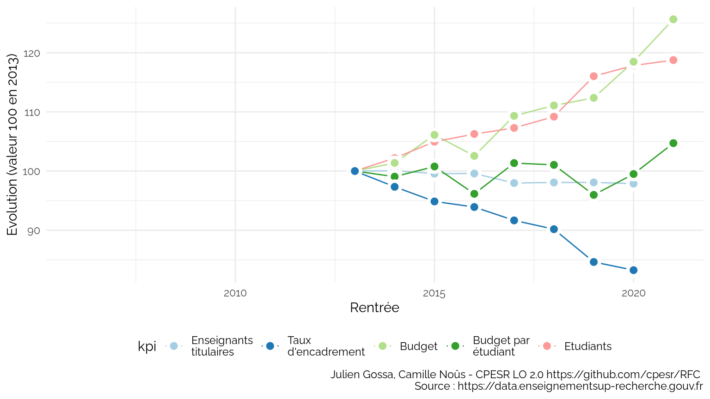<!-- -->

### Universités

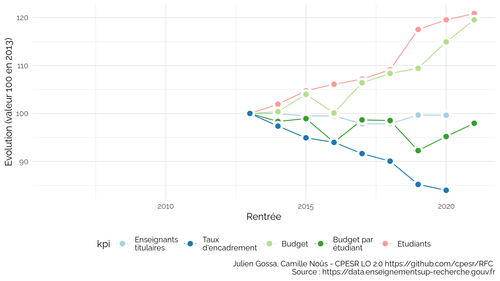<!-- -->

## Description des données

    ## Joining, by = "UAI"
    ## Joining, by = "UAI"
    ## Joining, by = c("UAI", "Rentrée", "Type.établissement")

-   Sources :
    -   <https://data.enseignementsup-recherche.gouv.fr/explore/dataset/fr-esr-statistiques-sur-les-effectifs-d-etudiants-inscrits-par-etablissement/export/>
    -   <https://data.enseignementsup-recherche.gouv.fr/explore/dataset/fr-esr-enseignants-titulaires-esr-public/table/?disjunctive.annee&q=%22Universit%C3%A9+de+Nantes%22>
-   Nombre d’observations : 1198
-   Variables :

<!-- -->

    ## [1] "UAI"                "Etablissement"      "Région"            
    ## [4] "Rentrée"            "Enseignants"        "Type.établissement"
    ## [7] "Etudiants"

-   Définitions :
    -   `Enseignants` : effectifs enseignants titulaires (EC et 2d
        degré)
    -   `Etudiants` : effectifs étudiants (L, M et D)
    -   `Taux.d.encadrement` : nombre d’enseignants pour 100 étudiants
        (`Enseignants / Etudiants * 100`)
-   Période : 2011, 2019
-   Limites :
    -   les données ne concernent que le MESRI ;
    -   des établissements ont été recollés après des changements
        d’identifiants ;
        -   Paris Diderot et Paris Descartes sont considérés comme
            Université de Paris ;
        -   Les données des étudiants de Paris Saclay ne sont pas
            recollables ;
        -   Globalement, dès qu’il y a eu des transferts d’inscriptions
            d’étudiants ou d’enseignants avec une COMUE, les données
            sont sujettes à caution ;
    -   les correspondances de disciplines sont imparfaites :
        -   la discipline des enseignants est celle du CNU et non de la
            composante (UFR) d’affectation ;
        -   la discipline des étudiants est celle de la composante (UFR)
            ;
        -   l’imperfection est dûe aux enseignants d’une discipline
            affectés dans une autre, et aux services partagés entre
            plusieurs composantes.
        -   les étudiant en STAPS on été classés en ST ;
    -   pour les données disciplinaires, il est impossible de distinguer
        les doubles inscriptions (CPGE ou inscriptions principales et
        secondaires).

<table>
<thead>
<tr>
<th style="text-align:right;">
Rentrée
</th>
<th style="text-align:right;">
Etudiants.MESRI
</th>
<th style="text-align:right;">
Evolution
</th>
</tr>
</thead>
<tbody>
<tr>
<td style="text-align:right;">
2006
</td>
<td style="text-align:right;">
1529623
</td>
<td style="text-align:right;">
50718
</td>
</tr>
<tr>
<td style="text-align:right;">
2007
</td>
<td style="text-align:right;">
1493175
</td>
<td style="text-align:right;">
14270
</td>
</tr>
<tr>
<td style="text-align:right;">
2008
</td>
<td style="text-align:right;">
1478905
</td>
<td style="text-align:right;">
0
</td>
</tr>
<tr>
<td style="text-align:right;">
2009
</td>
<td style="text-align:right;">
1522878
</td>
<td style="text-align:right;">
43973
</td>
</tr>
<tr>
<td style="text-align:right;">
2010
</td>
<td style="text-align:right;">
1517695
</td>
<td style="text-align:right;">
38790
</td>
</tr>
<tr>
<td style="text-align:right;">
2011
</td>
<td style="text-align:right;">
1529764
</td>
<td style="text-align:right;">
50859
</td>
</tr>
<tr>
<td style="text-align:right;">
2012
</td>
<td style="text-align:right;">
1545350
</td>
<td style="text-align:right;">
66445
</td>
</tr>
<tr>
<td style="text-align:right;">
2013
</td>
<td style="text-align:right;">
1584308
</td>
<td style="text-align:right;">
105403
</td>
</tr>
<tr>
<td style="text-align:right;">
2014
</td>
<td style="text-align:right;">
1616863
</td>
<td style="text-align:right;">
137958
</td>
</tr>
<tr>
<td style="text-align:right;">
2015
</td>
<td style="text-align:right;">
1660689
</td>
<td style="text-align:right;">
181784
</td>
</tr>
<tr>
<td style="text-align:right;">
2016
</td>
<td style="text-align:right;">
1681236
</td>
<td style="text-align:right;">
202331
</td>
</tr>
<tr>
<td style="text-align:right;">
2017
</td>
<td style="text-align:right;">
1696938
</td>
<td style="text-align:right;">
218033
</td>
</tr>
<tr>
<td style="text-align:right;">
2018
</td>
<td style="text-align:right;">
1727042
</td>
<td style="text-align:right;">
248137
</td>
</tr>
<tr>
<td style="text-align:right;">
2019
</td>
<td style="text-align:right;">
1836104
</td>
<td style="text-align:right;">
357199
</td>
</tr>
<tr>
<td style="text-align:right;">
2020
</td>
<td style="text-align:right;">
1864197
</td>
<td style="text-align:right;">
385292
</td>
</tr>
</tbody>
</table>

## Taux d’encadrement par type d’établissement

### Evolution globale

<!-- -->

### Evolution par type d’établissement et discipline

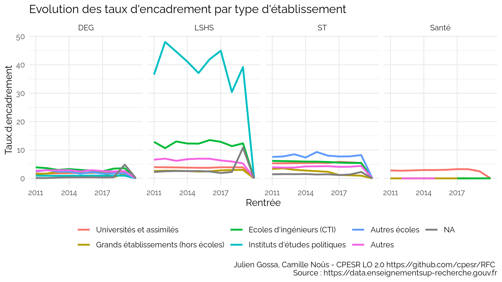<!-- -->

### Distribution des établissements

    ## Warning: Removed 13 rows containing non-finite values (stat_boxplot).

<!-- -->

Top 10 :

<table>
<thead>
<tr>
<th style="text-align:left;">
Rentrée
</th>
<th style="text-align:left;">
Type.établissement
</th>
<th style="text-align:left;">
Etablissement
</th>
<th style="text-align:right;">
Enseignants
</th>
<th style="text-align:right;">
Etudiants
</th>
<th style="text-align:right;">
Taux.d.encadrement
</th>
</tr>
</thead>
<tbody>
<tr>
<td style="text-align:left;">
2018
</td>
<td style="text-align:left;">
Universités et assimilés
</td>
<td style="text-align:left;">
Université Gustave Eiffel
</td>
<td style="text-align:right;">
403
</td>
<td style="text-align:right;">
0
</td>
<td style="text-align:right;">
Inf
</td>
</tr>
<tr>
<td style="text-align:left;">
2018
</td>
<td style="text-align:left;">
Universités et assimilés
</td>
<td style="text-align:left;">
Université Paris-Saclay
</td>
<td style="text-align:right;">
1532
</td>
<td style="text-align:right;">
0
</td>
<td style="text-align:right;">
Inf
</td>
</tr>
<tr>
<td style="text-align:left;">
2018
</td>
<td style="text-align:left;">
Ecoles d’ingénieurs (CTI)
</td>
<td style="text-align:left;">
Agrosup Dijon
</td>
<td style="text-align:right;">
30
</td>
<td style="text-align:right;">
0
</td>
<td style="text-align:right;">
Inf
</td>
</tr>
<tr>
<td style="text-align:left;">
2018
</td>
<td style="text-align:left;">
Ecoles d’ingénieurs (CTI)
</td>
<td style="text-align:left;">
Centrale Lille Institut (CLI)
</td>
<td style="text-align:right;">
131
</td>
<td style="text-align:right;">
0
</td>
<td style="text-align:right;">
Inf
</td>
</tr>
<tr>
<td style="text-align:left;">
2018
</td>
<td style="text-align:left;">
Ecoles d’ingénieurs (CTI)
</td>
<td style="text-align:left;">
Conservatoire national des arts et métiers (CNAM)
</td>
<td style="text-align:right;">
379
</td>
<td style="text-align:right;">
0
</td>
<td style="text-align:right;">
Inf
</td>
</tr>
<tr>
<td style="text-align:left;">
2018
</td>
<td style="text-align:left;">
Ecoles d’ingénieurs (CTI)
</td>
<td style="text-align:left;">
Institut national des sciences appliquées Centre Val de Loire (INSA
Centre Val de Loire)
</td>
<td style="text-align:right;">
89
</td>
<td style="text-align:right;">
0
</td>
<td style="text-align:right;">
Inf
</td>
</tr>
</tbody>
</table>

    ## Warning: Removed 13 rows containing non-finite values (stat_boxplot).

<!-- -->

## Taux d’encadrement par grande discipline

### Evolution globale

    ## Warning: Removed 2 row(s) containing missing values (geom_path).

<!-- -->

### Evolution par discpline et type d’établissement

<!-- -->

<!-- -->

### Distribution

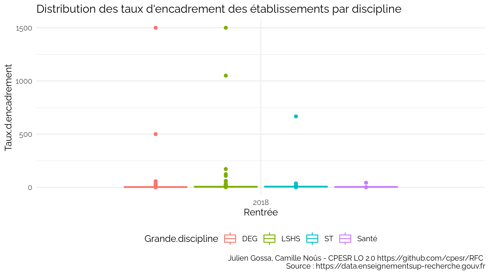<!-- -->

Top 10 (on y constate la limite disciplinaire expliquée au dessus) :

<table>
<thead>
<tr>
<th style="text-align:left;">
Rentrée
</th>
<th style="text-align:left;">
Etablissement
</th>
<th style="text-align:left;">
Grande.discipline
</th>
<th style="text-align:right;">
Enseignants
</th>
<th style="text-align:right;">
Etudiants
</th>
<th style="text-align:right;">
Taux.d.encadrement
</th>
</tr>
</thead>
<tbody>
<tr>
<td style="text-align:left;">
2018
</td>
<td style="text-align:left;">
Institut national des sciences appliquées de Lyon (INSA de Lyon)
</td>
<td style="text-align:left;">
LSHS
</td>
<td style="text-align:right;">
60
</td>
<td style="text-align:right;">
4
</td>
<td style="text-align:right;">
1500.0000
</td>
</tr>
<tr>
<td style="text-align:left;">
2018
</td>
<td style="text-align:left;">
Institut polytechnique de Grenoble (Grenoble INP)
</td>
<td style="text-align:left;">
DEG
</td>
<td style="text-align:right;">
15
</td>
<td style="text-align:right;">
1
</td>
<td style="text-align:right;">
1500.0000
</td>
</tr>
<tr>
<td style="text-align:left;">
2018
</td>
<td style="text-align:left;">
Toulouse INP
</td>
<td style="text-align:left;">
LSHS
</td>
<td style="text-align:right;">
21
</td>
<td style="text-align:right;">
2
</td>
<td style="text-align:right;">
1050.0000
</td>
</tr>
<tr>
<td style="text-align:left;">
2018
</td>
<td style="text-align:left;">
Université Panthéon-Assas
</td>
<td style="text-align:left;">
ST
</td>
<td style="text-align:right;">
20
</td>
<td style="text-align:right;">
3
</td>
<td style="text-align:right;">
666.6667
</td>
</tr>
<tr>
<td style="text-align:left;">
2018
</td>
<td style="text-align:left;">
Toulouse INP
</td>
<td style="text-align:left;">
DEG
</td>
<td style="text-align:right;">
10
</td>
<td style="text-align:right;">
2
</td>
<td style="text-align:right;">
500.0000
</td>
</tr>
<tr>
<td style="text-align:left;">
2018
</td>
<td style="text-align:left;">
Centrale Lyon (EC Lyon)
</td>
<td style="text-align:left;">
LSHS
</td>
<td style="text-align:right;">
12
</td>
<td style="text-align:right;">
7
</td>
<td style="text-align:right;">
171.4286
</td>
</tr>
</tbody>
</table>

<!-- -->

## Focus ENS

    ## Warning: Removed 10 row(s) containing missing values (geom_path).

<!-- -->

    ## Warning: Removed 13 row(s) containing missing values (geom_path).

<!-- -->

## Focus Universités

<table>
<thead>
<tr>
<th style="text-align:right;">
Rentrée
</th>
<th style="text-align:right;">
Etudiants.univ
</th>
<th style="text-align:right;">
Evolution
</th>
</tr>
</thead>
<tbody>
<tr>
<td style="text-align:right;">
2006
</td>
<td style="text-align:right;">
1358990
</td>
<td style="text-align:right;">
33508
</td>
</tr>
<tr>
<td style="text-align:right;">
2007
</td>
<td style="text-align:right;">
1325482
</td>
<td style="text-align:right;">
0
</td>
</tr>
<tr>
<td style="text-align:right;">
2008
</td>
<td style="text-align:right;">
1374736
</td>
<td style="text-align:right;">
49254
</td>
</tr>
<tr>
<td style="text-align:right;">
2009
</td>
<td style="text-align:right;">
1416209
</td>
<td style="text-align:right;">
90727
</td>
</tr>
<tr>
<td style="text-align:right;">
2010
</td>
<td style="text-align:right;">
1407650
</td>
<td style="text-align:right;">
82168
</td>
</tr>
<tr>
<td style="text-align:right;">
2011
</td>
<td style="text-align:right;">
1420222
</td>
<td style="text-align:right;">
94740
</td>
</tr>
<tr>
<td style="text-align:right;">
2012
</td>
<td style="text-align:right;">
1433950
</td>
<td style="text-align:right;">
108468
</td>
</tr>
<tr>
<td style="text-align:right;">
2013
</td>
<td style="text-align:right;">
1470049
</td>
<td style="text-align:right;">
144567
</td>
</tr>
<tr>
<td style="text-align:right;">
2014
</td>
<td style="text-align:right;">
1499833
</td>
<td style="text-align:right;">
174351
</td>
</tr>
<tr>
<td style="text-align:right;">
2015
</td>
<td style="text-align:right;">
1541269
</td>
<td style="text-align:right;">
215787
</td>
</tr>
<tr>
<td style="text-align:right;">
2016
</td>
<td style="text-align:right;">
1561204
</td>
<td style="text-align:right;">
235722
</td>
</tr>
<tr>
<td style="text-align:right;">
2017
</td>
<td style="text-align:right;">
1575022
</td>
<td style="text-align:right;">
249540
</td>
</tr>
<tr>
<td style="text-align:right;">
2018
</td>
<td style="text-align:right;">
1604091
</td>
<td style="text-align:right;">
278609
</td>
</tr>
<tr>
<td style="text-align:right;">
2019
</td>
<td style="text-align:right;">
1741436
</td>
<td style="text-align:right;">
415954
</td>
</tr>
<tr>
<td style="text-align:right;">
2020
</td>
<td style="text-align:right;">
1769743
</td>
<td style="text-align:right;">
444261
</td>
</tr>
</tbody>
</table>

    ## Warning: Removed 95 rows containing non-finite values (stat_boxplot).

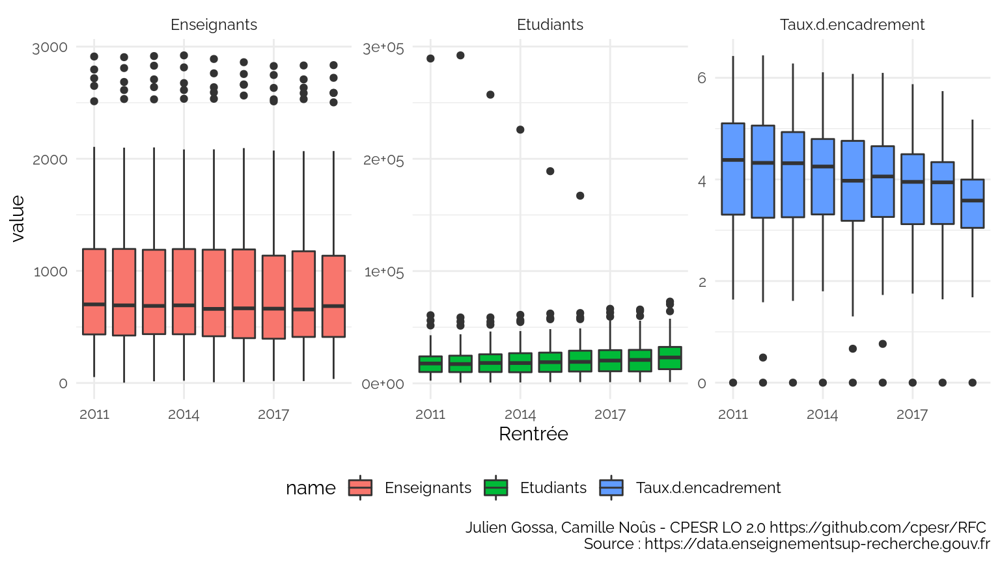<!-- -->

    ## Warning: Removed 27 row(s) containing missing values (geom_path).

<!-- -->

    ## Warning: Removed 27 row(s) containing missing values (geom_path).

<!-- -->

    ## Warning: Removed 18 rows containing missing values (geom_col).

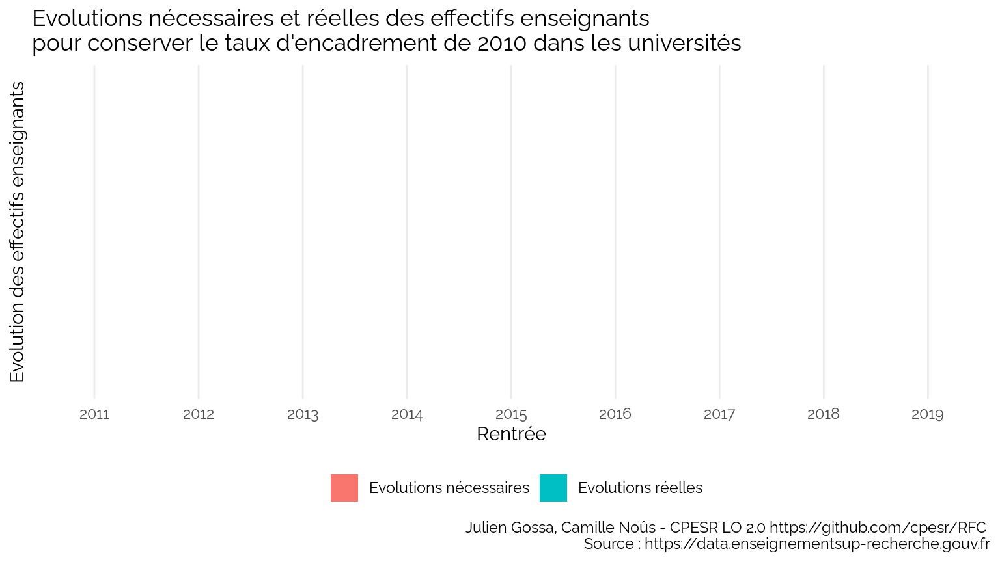<!-- -->

    ## Warning: Removed 66 row(s) containing missing values (geom_path).

<!-- -->

    ## Warning: Removed 120 row(s) containing missing values (geom_path).

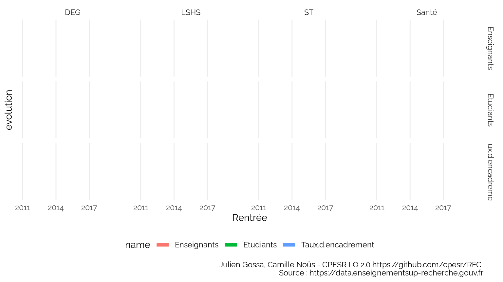<!-- -->

    ## Warning: Removed 10 row(s) containing missing values (geom_path).

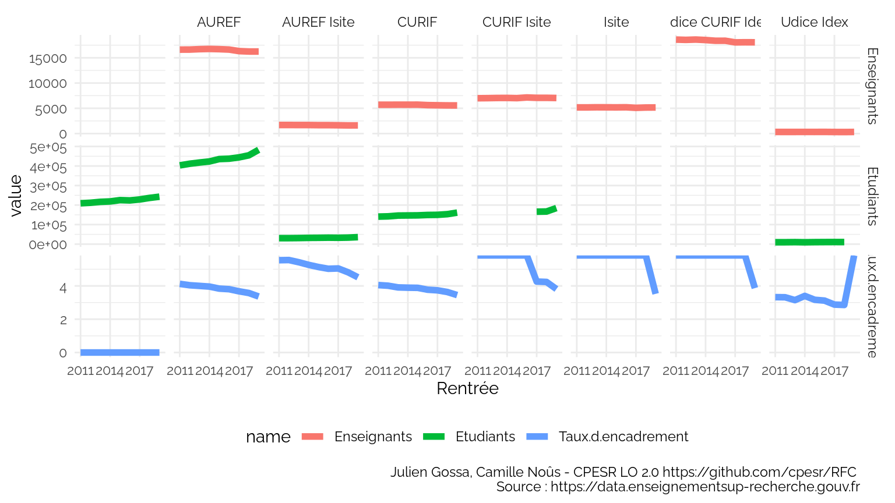<!-- -->

    ## Warning: Removed 19 row(s) containing missing values (geom_path).

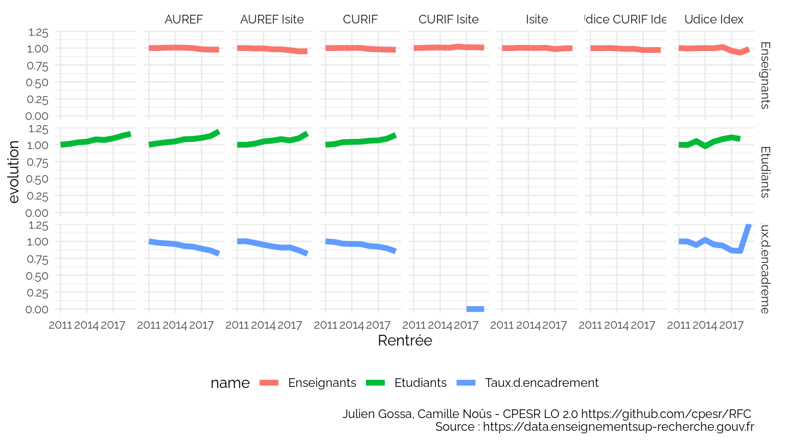<!-- -->

    ## Warning: Removed 95 rows containing non-finite values (stat_boxplot).

<!-- -->

    ## Warning: Removed 134 rows containing non-finite values (stat_boxplot).

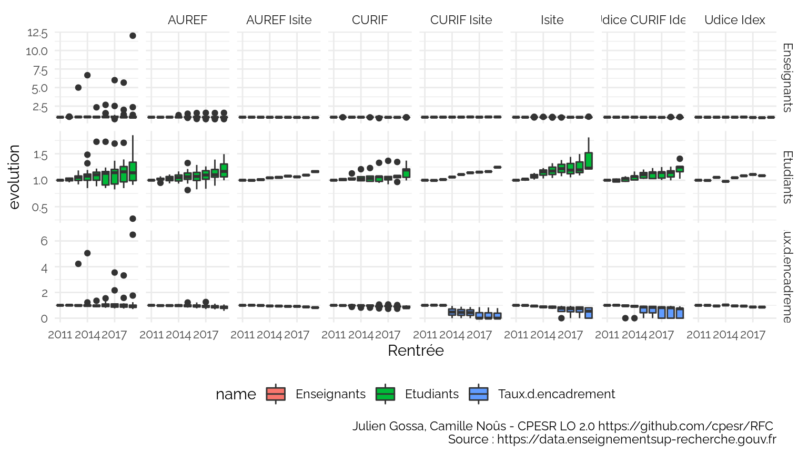<!-- -->

    ## Warning: Removed 3 rows containing missing values (geom_point).

<!-- -->

*Note : dans la suite, la barre verticale indique la valeur nationale
(donc pas la moyenne des établissements)*

    ## Warning: Removed 1 rows containing missing values (geom_hline).

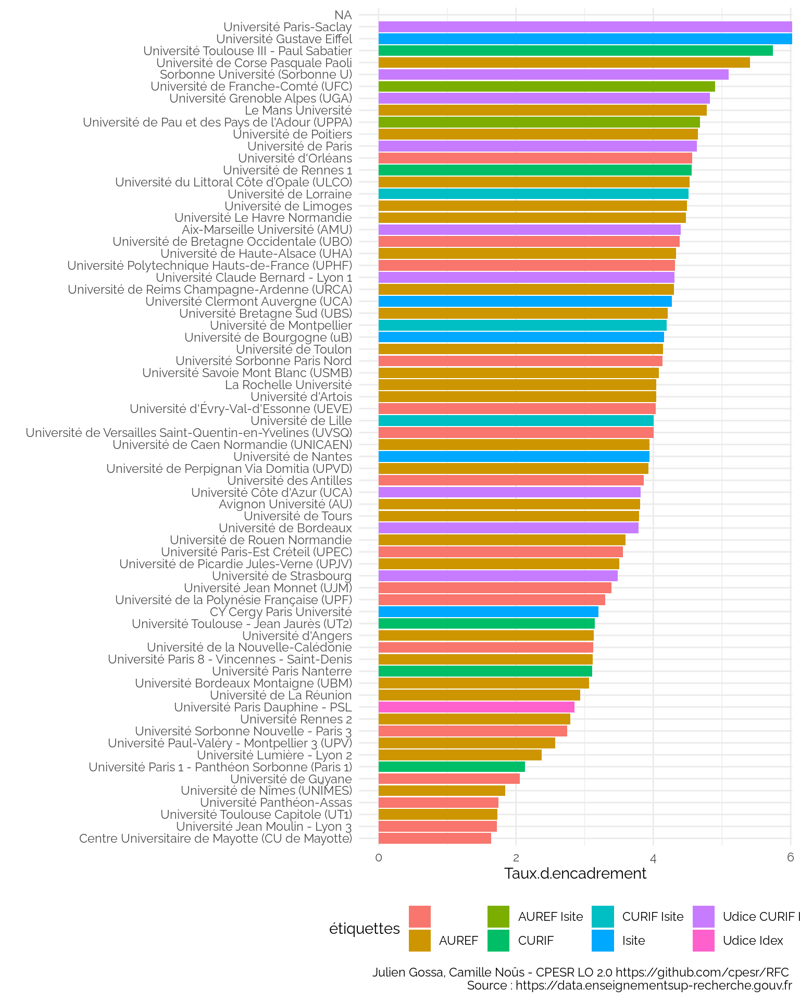<!-- -->

    ## Warning: Removed 3 rows containing missing values (position_stack).

    ## Warning: Removed 1 rows containing missing values (geom_hline).

<!-- -->

### Focus Guyane

<table>
<thead>
<tr>
<th style="text-align:left;">
UAI
</th>
<th style="text-align:left;">
Etablissement
</th>
<th style="text-align:left;">
Région
</th>
<th style="text-align:left;">
Rentrée
</th>
<th style="text-align:right;">
Enseignants
</th>
<th style="text-align:left;">
Type.établissement
</th>
<th style="text-align:right;">
Etudiants
</th>
</tr>
</thead>
<tbody>
<tr>
<td style="text-align:left;">
9730429D
</td>
<td style="text-align:left;">
Université de Guyane
</td>
<td style="text-align:left;">
Guyane
</td>
<td style="text-align:left;">
2015
</td>
<td style="text-align:right;">
37
</td>
<td style="text-align:left;">
Universités et assimilés
</td>
<td style="text-align:right;">
2838
</td>
</tr>
<tr>
<td style="text-align:left;">
9730429D
</td>
<td style="text-align:left;">
Université de Guyane
</td>
<td style="text-align:left;">
Guyane
</td>
<td style="text-align:left;">
2016
</td>
<td style="text-align:right;">
57
</td>
<td style="text-align:left;">
Universités et assimilés
</td>
<td style="text-align:right;">
3302
</td>
</tr>
<tr>
<td style="text-align:left;">
9730429D
</td>
<td style="text-align:left;">
Université de Guyane
</td>
<td style="text-align:left;">
Guyane
</td>
<td style="text-align:left;">
2017
</td>
<td style="text-align:right;">
93
</td>
<td style="text-align:left;">
Universités et assimilés
</td>
<td style="text-align:right;">
3297
</td>
</tr>
<tr>
<td style="text-align:left;">
9730429D
</td>
<td style="text-align:left;">
Université de Guyane
</td>
<td style="text-align:left;">
Guyane
</td>
<td style="text-align:left;">
2018
</td>
<td style="text-align:right;">
74
</td>
<td style="text-align:left;">
Universités et assimilés
</td>
<td style="text-align:right;">
3601
</td>
</tr>
<tr>
<td style="text-align:left;">
9730429D
</td>
<td style="text-align:left;">
Université de Guyane
</td>
<td style="text-align:left;">
Guyane
</td>
<td style="text-align:left;">
2019
</td>
<td style="text-align:right;">
87
</td>
<td style="text-align:left;">
Universités et assimilés
</td>
<td style="text-align:right;">
3802
</td>
</tr>
</tbody>
</table>

Les données sont courtes et les valeurs très basses, au point de ne pas
être significatives.

### Focus Artois

<table>
<thead>
<tr>
<th style="text-align:left;">
UAI
</th>
<th style="text-align:left;">
Etablissement
</th>
<th style="text-align:left;">
Région
</th>
<th style="text-align:left;">
Rentrée
</th>
<th style="text-align:right;">
Enseignants
</th>
<th style="text-align:left;">
Type.établissement
</th>
<th style="text-align:right;">
Etudiants
</th>
</tr>
</thead>
<tbody>
<tr>
<td style="text-align:left;">
0623957P
</td>
<td style="text-align:left;">
Université d’Artois
</td>
<td style="text-align:left;">
Hauts-de-France
</td>
<td style="text-align:left;">
2011
</td>
<td style="text-align:right;">
635
</td>
<td style="text-align:left;">
Universités et assimilés
</td>
<td style="text-align:right;">
10817
</td>
</tr>
<tr>
<td style="text-align:left;">
0623957P
</td>
<td style="text-align:left;">
Université d’Artois
</td>
<td style="text-align:left;">
Hauts-de-France
</td>
<td style="text-align:left;">
2012
</td>
<td style="text-align:right;">
625
</td>
<td style="text-align:left;">
Universités et assimilés
</td>
<td style="text-align:right;">
11370
</td>
</tr>
<tr>
<td style="text-align:left;">
0623957P
</td>
<td style="text-align:left;">
Université d’Artois
</td>
<td style="text-align:left;">
Hauts-de-France
</td>
<td style="text-align:left;">
2013
</td>
<td style="text-align:right;">
614
</td>
<td style="text-align:left;">
Universités et assimilés
</td>
<td style="text-align:right;">
10956
</td>
</tr>
<tr>
<td style="text-align:left;">
0623957P
</td>
<td style="text-align:left;">
Université d’Artois
</td>
<td style="text-align:left;">
Hauts-de-France
</td>
<td style="text-align:left;">
2014
</td>
<td style="text-align:right;">
615
</td>
<td style="text-align:left;">
Universités et assimilés
</td>
<td style="text-align:right;">
10134
</td>
</tr>
<tr>
<td style="text-align:left;">
0623957P
</td>
<td style="text-align:left;">
Université d’Artois
</td>
<td style="text-align:left;">
Hauts-de-France
</td>
<td style="text-align:left;">
2015
</td>
<td style="text-align:right;">
624
</td>
<td style="text-align:left;">
Universités et assimilés
</td>
<td style="text-align:right;">
10593
</td>
</tr>
<tr>
<td style="text-align:left;">
0623957P
</td>
<td style="text-align:left;">
Université d’Artois
</td>
<td style="text-align:left;">
Hauts-de-France
</td>
<td style="text-align:left;">
2016
</td>
<td style="text-align:right;">
484
</td>
<td style="text-align:left;">
Universités et assimilés
</td>
<td style="text-align:right;">
10844
</td>
</tr>
<tr>
<td style="text-align:left;">
0623957P
</td>
<td style="text-align:left;">
Université d’Artois
</td>
<td style="text-align:left;">
Hauts-de-France
</td>
<td style="text-align:left;">
2017
</td>
<td style="text-align:right;">
470
</td>
<td style="text-align:left;">
Universités et assimilés
</td>
<td style="text-align:right;">
11325
</td>
</tr>
<tr>
<td style="text-align:left;">
0623957P
</td>
<td style="text-align:left;">
Université d’Artois
</td>
<td style="text-align:left;">
Hauts-de-France
</td>
<td style="text-align:left;">
2018
</td>
<td style="text-align:right;">
466
</td>
<td style="text-align:left;">
Universités et assimilés
</td>
<td style="text-align:right;">
11536
</td>
</tr>
<tr>
<td style="text-align:left;">
0623957P
</td>
<td style="text-align:left;">
Université d’Artois
</td>
<td style="text-align:left;">
Hauts-de-France
</td>
<td style="text-align:left;">
2019
</td>
<td style="text-align:right;">
469
</td>
<td style="text-align:left;">
Universités et assimilés
</td>
<td style="text-align:right;">
14001
</td>
</tr>
</tbody>
</table>

La baisse de près d’un quart des enseignants entre 2015 et 2016 est peu
crédible. Il s’agit probablement d’un changement de périmètre (à
confirmer).

### Focus UHA

<table>
<thead>
<tr>
<th style="text-align:left;">
UAI
</th>
<th style="text-align:left;">
Etablissement
</th>
<th style="text-align:left;">
Région
</th>
<th style="text-align:left;">
Rentrée
</th>
<th style="text-align:right;">
Enseignants
</th>
<th style="text-align:left;">
Type.établissement
</th>
<th style="text-align:right;">
Etudiants
</th>
</tr>
</thead>
<tbody>
<tr>
<td style="text-align:left;">
0681166Y
</td>
<td style="text-align:left;">
Université de Haute-Alsace (UHA)
</td>
<td style="text-align:left;">
Grand Est
</td>
<td style="text-align:left;">
2011
</td>
<td style="text-align:right;">
444
</td>
<td style="text-align:left;">
Universités et assimilés
</td>
<td style="text-align:right;">
7743
</td>
</tr>
<tr>
<td style="text-align:left;">
0681166Y
</td>
<td style="text-align:left;">
Université de Haute-Alsace (UHA)
</td>
<td style="text-align:left;">
Grand Est
</td>
<td style="text-align:left;">
2012
</td>
<td style="text-align:right;">
441
</td>
<td style="text-align:left;">
Universités et assimilés
</td>
<td style="text-align:right;">
7536
</td>
</tr>
<tr>
<td style="text-align:left;">
0681166Y
</td>
<td style="text-align:left;">
Université de Haute-Alsace (UHA)
</td>
<td style="text-align:left;">
Grand Est
</td>
<td style="text-align:left;">
2013
</td>
<td style="text-align:right;">
442
</td>
<td style="text-align:left;">
Universités et assimilés
</td>
<td style="text-align:right;">
7436
</td>
</tr>
<tr>
<td style="text-align:left;">
0681166Y
</td>
<td style="text-align:left;">
Université de Haute-Alsace (UHA)
</td>
<td style="text-align:left;">
Grand Est
</td>
<td style="text-align:left;">
2014
</td>
<td style="text-align:right;">
436
</td>
<td style="text-align:left;">
Universités et assimilés
</td>
<td style="text-align:right;">
7688
</td>
</tr>
<tr>
<td style="text-align:left;">
0681166Y
</td>
<td style="text-align:left;">
Université de Haute-Alsace (UHA)
</td>
<td style="text-align:left;">
Grand Est
</td>
<td style="text-align:left;">
2015
</td>
<td style="text-align:right;">
438
</td>
<td style="text-align:left;">
Universités et assimilés
</td>
<td style="text-align:right;">
7923
</td>
</tr>
<tr>
<td style="text-align:left;">
0681166Y
</td>
<td style="text-align:left;">
Université de Haute-Alsace (UHA)
</td>
<td style="text-align:left;">
Grand Est
</td>
<td style="text-align:left;">
2016
</td>
<td style="text-align:right;">
433
</td>
<td style="text-align:left;">
Universités et assimilés
</td>
<td style="text-align:right;">
8064
</td>
</tr>
<tr>
<td style="text-align:left;">
0681166Y
</td>
<td style="text-align:left;">
Université de Haute-Alsace (UHA)
</td>
<td style="text-align:left;">
Grand Est
</td>
<td style="text-align:left;">
2017
</td>
<td style="text-align:right;">
428
</td>
<td style="text-align:left;">
Universités et assimilés
</td>
<td style="text-align:right;">
9376
</td>
</tr>
<tr>
<td style="text-align:left;">
0681166Y
</td>
<td style="text-align:left;">
Université de Haute-Alsace (UHA)
</td>
<td style="text-align:left;">
Grand Est
</td>
<td style="text-align:left;">
2018
</td>
<td style="text-align:right;">
434
</td>
<td style="text-align:left;">
Universités et assimilés
</td>
<td style="text-align:right;">
10029
</td>
</tr>
<tr>
<td style="text-align:left;">
0681166Y
</td>
<td style="text-align:left;">
Université de Haute-Alsace (UHA)
</td>
<td style="text-align:left;">
Grand Est
</td>
<td style="text-align:left;">
2019
</td>
<td style="text-align:right;">
441
</td>
<td style="text-align:left;">
Universités et assimilés
</td>
<td style="text-align:right;">
10237
</td>
</tr>
</tbody>
</table>

L’augmentation de 25% des effectifs étudiants entre 2017 et 2018 indique
un changement de périmètre des inscriptions étudiants, probablement
après des accord avec d’autres établissements pour délivrer des diplômes
UHA sans assurer les enseignements.

Ces chiffres ne reflètent donc pas le taux d’encadrement réel de
l’université.

### Classement sans : Guyane, Artois et UHA

    ## Warning: Removed 3 rows containing missing values (position_stack).

    ## Warning: Removed 1 rows containing missing values (geom_hline).

<!-- -->

## Focus Ile-de-France

Périmètre : Universités en Ile-de-France +
`Université Paris Dauphine - PSL`

<table>
<thead>
<tr>
<th style="text-align:left;">
Etablissement
</th>
</tr>
</thead>
<tbody>
<tr>
<td style="text-align:left;">
CY Cergy Paris Université
</td>
</tr>
<tr>
<td style="text-align:left;">
Sorbonne Université (Sorbonne U)
</td>
</tr>
<tr>
<td style="text-align:left;">
Université d’Évry-Val-d’Essonne (UEVE)
</td>
</tr>
<tr>
<td style="text-align:left;">
Université de Paris
</td>
</tr>
<tr>
<td style="text-align:left;">
Université de Versailles Saint-Quentin-en-Yvelines (UVSQ)
</td>
</tr>
<tr>
<td style="text-align:left;">
Université Gustave Eiffel
</td>
</tr>
<tr>
<td style="text-align:left;">
Université Panthéon-Assas
</td>
</tr>
<tr>
<td style="text-align:left;">
Université Paris 1 - Panthéon Sorbonne (Paris 1)
</td>
</tr>
<tr>
<td style="text-align:left;">
Université Paris 8 - Vincennes - Saint-Denis
</td>
</tr>
<tr>
<td style="text-align:left;">
Université Paris Dauphine - PSL
</td>
</tr>
<tr>
<td style="text-align:left;">
Université Paris Nanterre
</td>
</tr>
<tr>
<td style="text-align:left;">
Université Paris-Est Créteil (UPEC)
</td>
</tr>
<tr>
<td style="text-align:left;">
Université Paris-Saclay
</td>
</tr>
<tr>
<td style="text-align:left;">
Université Sorbonne Nouvelle - Paris 3
</td>
</tr>
<tr>
<td style="text-align:left;">
Université Sorbonne Paris Nord
</td>
</tr>
</tbody>
</table>

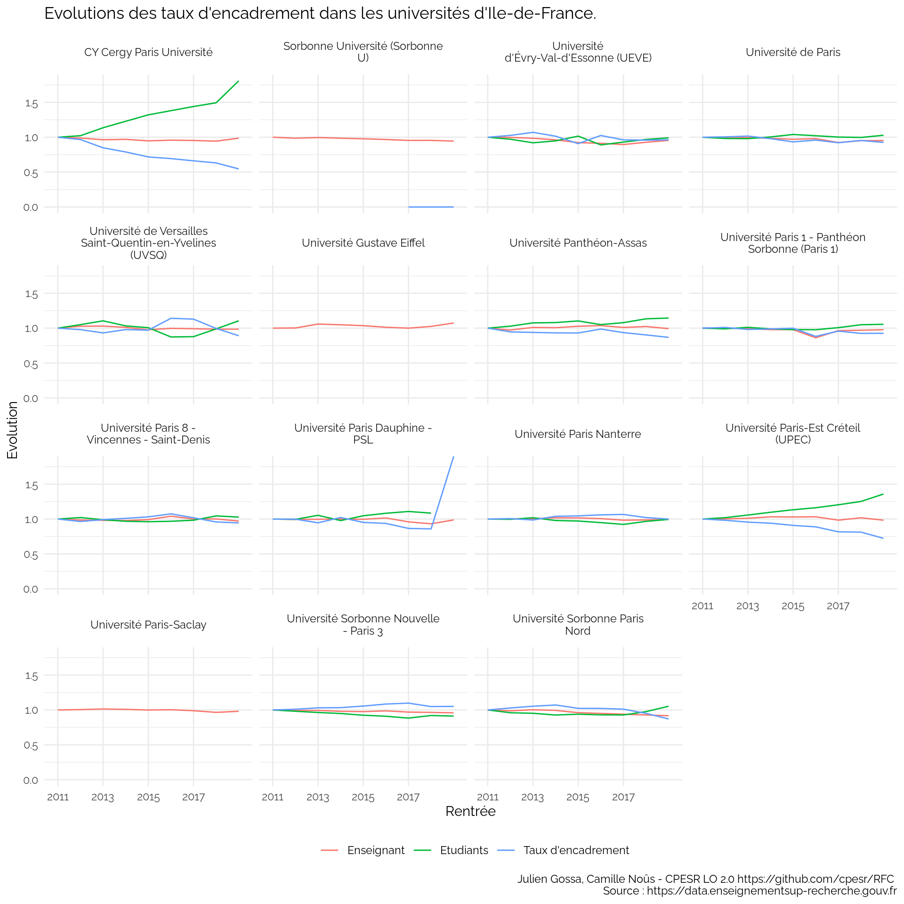<!-- -->

## Focus Paris 8

    ## Warning: Removed 51 rows containing non-finite values (stat_boxplot).

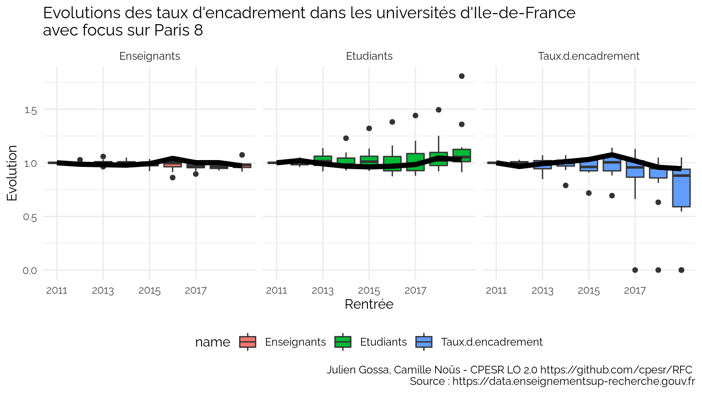<!-- -->

## Focus Strasbourg

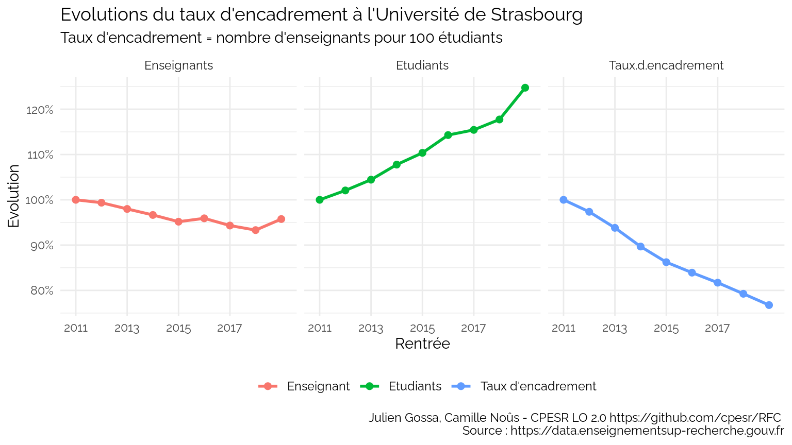<!-- -->
