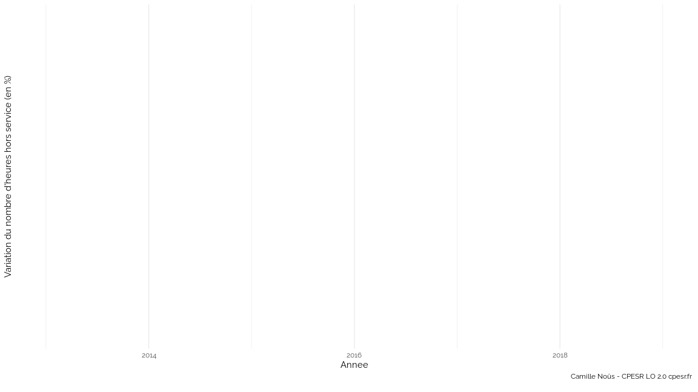
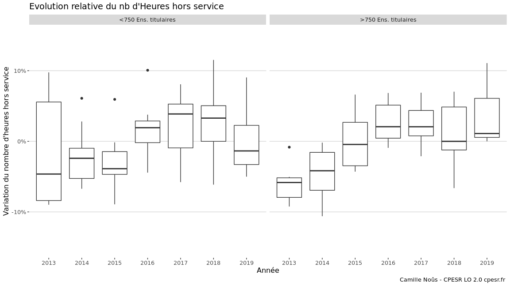

Etude sur les vacations/heures complémentaires
================

## Quelques dataviz

## Heures complémentaires et taille des établissement

On commence par le nb d’heures hors service (=heures complémentaires +
vacations d’enseignement) en fonction du nb de titulaires, en gardant
les data moyen à partir de 2014 et pour chaque établissement.

    ## `summarise()` ungrouping output (override with `.groups` argument)

<!-- --> On constate
graphiquement que les petits établissements font davantage appel à des
heures hors service que les gros.

## Evolution du nb d’heures complémentaires

On continue en regardant la variation (en %) du nombre d’heures hors
service par tous les établissements. Cette variation est obtenue, pour
chaque établissement, en regardant l’écart à la moyenne sur la période
2014-2018. La transparence représente cette valeur moyenne (moins c’est
transparent, plus le nombre d’heures moyen est élevé)

    ## `summarise()` regrouping output by 'Etablissement' (override with `.groups` argument)

<!-- -->

Une autre visualisation qui ne distingue plus les établissements mais
qui montre la tendance à l’augmentation des heures hors service sur la
période. On crée un boxplot qui agrège les données de tous les
établissements.

    ## `summarise()` regrouping output by 'Rentrée' (override with `.groups` argument)

<!-- -->
<!-- -->

## Effet de la taille des établissements

On a constaté (figure 1) qu’il existe deux populations d’établissements,
avec un recours différent aux heures hors service. Est-ce que cette
distinction se traduit également dans l’évolution temporelle observée ?

On commence par séparer les deux populations avec 750 titulaires comme
séparation.

<!-- -->

On trace l’évolution pour chacun des groupes sur la période 2014-2018

<!-- -->

<!-- -->

A première vue, on ne voit pas de différences majeures en fonction de la
taille des établissements.

## Autres approches

Enfin, on essaie de regarder les trajectoires suivies par les
établissements dans le plan (Heures hors service ; Nb de titulaires)
avec des gradients de transparence pour figurer l’année

<!-- -->
