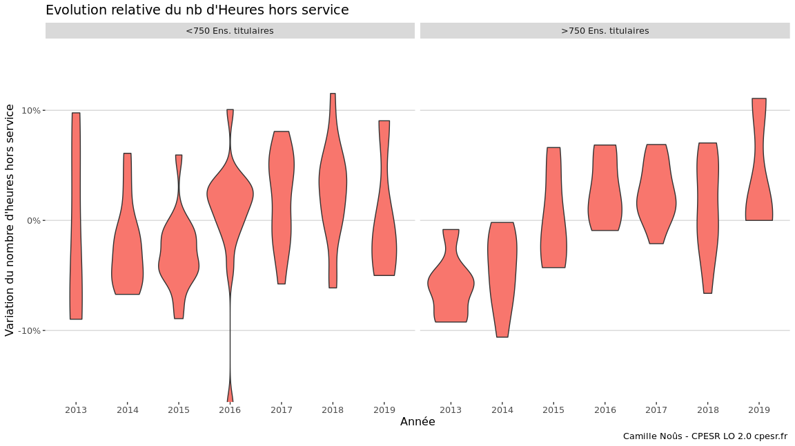
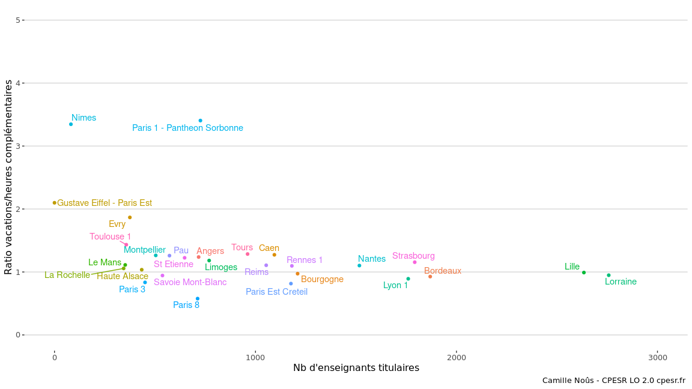
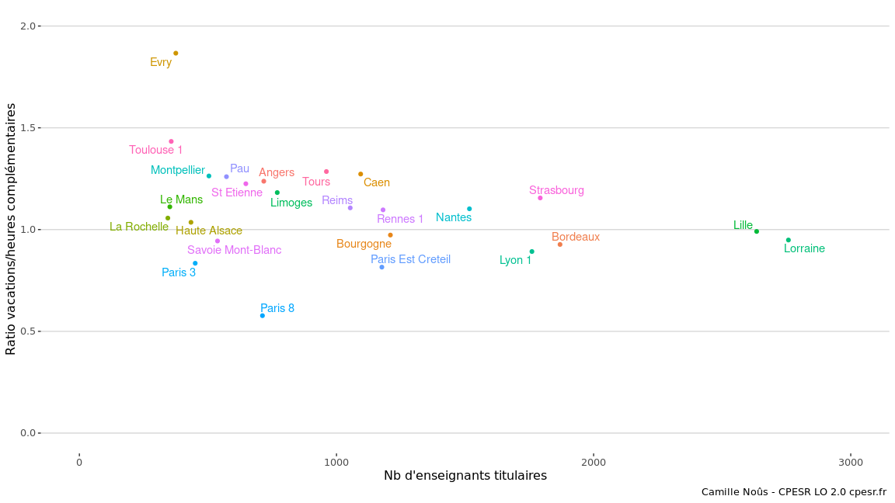
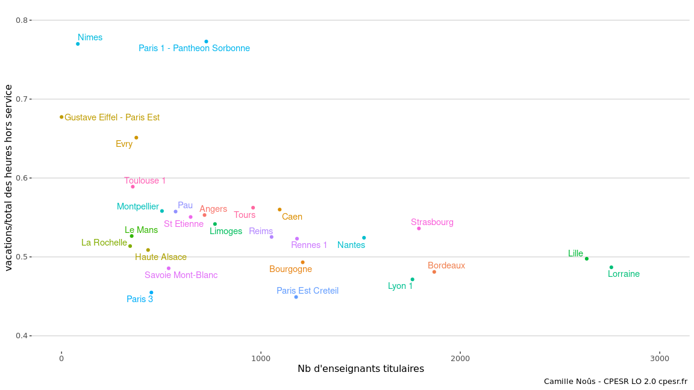
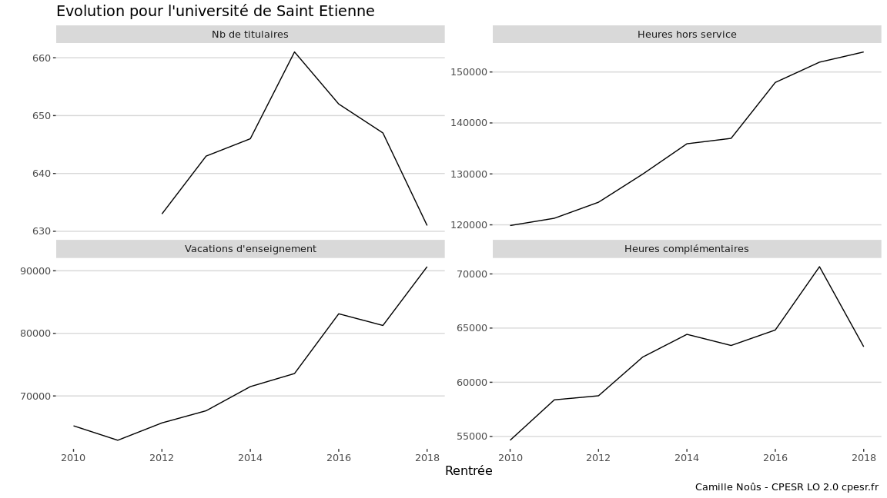
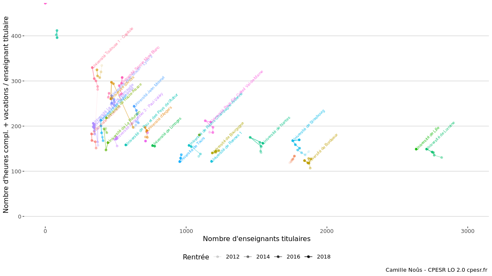

Etude sur les vacations/heures complémentaires
================

## Quelques visualisations

On propose ici une première analyse des heures de “vacations” à
l’université. Nous avons collecté les bilans sociaux des
établissements listés ci-dessous sur une période allant de 2005 à 2018.
Le corpus est fragmentaire et nécessite d’être complété, mais constitue
une première base d’analyse. Nous restreignons volontairement l’analyse
à la période 2014-2018 pour avoir suffisament d’établissements.

Liste des établissements :

    ## `summarise()` ungrouping output (override with `.groups` argument)

    ##  [1] "Angers"                      "Bordeaux"                   
    ##  [3] "Bourgogne"                   "Caen"                       
    ##  [5] "Evry"                        "Gustave Eiffel - Paris Est" 
    ##  [7] "Haute Alsace"                "La Reunion"                 
    ##  [9] "La Rochelle"                 "Le Havre"                   
    ## [11] "Le Mans"                     "Lille"                      
    ## [13] "Limoges"                     "Lorraine"                   
    ## [15] "Lyon 1"                      "Lyon 3"                     
    ## [17] "Montpellier"                 "Nantes"                     
    ## [19] "Nimes"                       "Paris 1 - Pantheon Sorbonne"
    ## [21] "Paris 3"                     "Paris 8"                    
    ## [23] "Paris Est Creteil"           "Pau"                        
    ## [25] "Reims"                       "Rennes 1"                   
    ## [27] "Savoie Mont-Blanc"           "St Etienne"                 
    ## [29] "Strasbourg"                  "Toulon"                     
    ## [31] "Toulouse 1"                  "Tours"                      
    ## [33] "Univ Artois"

Définitions :

  - Les heures complémentaires sont les heures réalisées par des
    employés de l’établissement (titulaires ou contractuels) au delà de
    leur obligation de service.

  - Les vacations d’enseignement sont les heures d’enseignement
    réalisées par des extérieurs à l’établissement (fonctionnaires ou
    non).

  - Les volumes horaires sont exprimés en Heures équivalent TD (HETD)

Dans la suite, on considère l’ensemble des heures hors service, à savoir
la somme des heures complémentaires et des vacations d’enseignement. Une
analyse plus fine pourra être menée dans un second temps.

## Heures hors service et taille des établissement

On commence par le nb d’heures hors service (=heures complémentaires +
vacations d’enseignement) en fonction du nb de titulaires, en gardant
les data moyen à partir de 2014 et pour chaque établissement.

    ## `summarise()` ungrouping output (override with `.groups` argument)

<!-- -->

On constate graphiquement que les petits établissements font davantage
appel à des heures hors service que les gros.

## Evolution du nb d’heures hors service

On continue en regardant la variation (en %) du nombre d’heures hors
service par tous les établissements. Cette variation est obtenue, pour
chaque établissement, en regardant l’écart à la moyenne sur la période
2014-2018. La transparence représente cette valeur moyenne (moins c’est
transparent, plus le nombre d’heures moyen est élevé).

    ## `summarise()` regrouping output by 'Etablissement' (override with `.groups` argument)

<!-- -->

Une autre visualisation qui ne distingue plus entre les établissements
mais qui montre la tendance à l’augmentation des heures hors service sur
la période. On crée un boxplot qui agrège les données de tous les
établissements.

    ## `summarise()` regrouping output by 'Rentrée' (override with `.groups` argument)

<!-- -->
<!-- -->

## Effet de la taille des établissements

On a constaté (figure 1) qu’il existe deux populations d’établissements,
avec un recours différent aux heures hors service. Est-ce que cette
distinction se traduit également dans l’évolution temporelle observée ?

On commence par séparer les deux populations avec 750 titulaires comme
séparation (choix arbitraire).

<!-- -->

On trace l’évolution pour chacun des groupes sur la période 2014-2018

<!-- -->

<!-- -->

A première vue, on ne voit pas de différences majeures en fonction de la
taille des établissements. Cette analyse doit être confirmée.

## Analyse différenciée entre les heures complémentaires et les vacations d’enseignement.

On va regarder ici le rapport entre vacations d’enseignement et heures
complémentaires. On choisit de garder le même critère de classification
des établissement, à savoir le nombre d’enseignants titulaires.

    ## `summarise()` ungrouping output (override with `.groups` argument)

    ## Warning: Removed 5 rows containing missing values (geom_point).

    ## Warning: Removed 5 rows containing missing values (geom_text_repel).

<!-- --> 2
établissements font fortement appels à des vacataires et écrasent la
lecture du graphique. On reprend les mêmes données en "zoomant sur la
zone centrale :

    ## `summarise()` ungrouping output (override with `.groups` argument)

    ## Warning: Removed 8 rows containing missing values (geom_point).

    ## Warning: Removed 8 rows containing missing values (geom_text_repel).

<!-- -->

Il semble que la majorité des établissements évolue dans un tunnel entre
.75 et 1.5. On propose une seconde visualisation, en regardant le ratio
vacations/total des heures hors-service.

    ## `summarise()` ungrouping output (override with `.groups` argument)

    ## Warning: Removed 6 rows containing missing values (geom_point).

    ## Warning: Removed 6 rows containing missing values (geom_text_repel).

<!-- -->

## Séries temporelles

Nous disposons des données sur des périodes plus longues pour quelques
établissements. Nous allons regarder l’évolution temporelle de qqs
quantités pour 3 établissements :

  - Strasbourg (2011-2019)

<!-- end list -->

    ## Warning: Removed 1 row(s) containing missing values (geom_path).

<!-- -->

  - Saint Etienne (2010-2018)

<!-- end list -->

    ## Warning: Removed 2 row(s) containing missing values (geom_path).

<!-- -->

  - Nantes (2006-2018)

<!-- end list -->

    ## Warning: Removed 6 row(s) containing missing values (geom_path).

<!-- -->

## Autres approches

Enfin, on essaie de regarder les trajectoires suivies par les
établissements dans le plan (Heures hors service ; Nb de titulaires)
avec des gradients de transparence pour figurer l’année

<!-- -->

## Crédits

Collecte et mise en forme des données : Antonin Eddi, Florent Figon,
Julien Gossa et Camille Noûs pour CPESR
