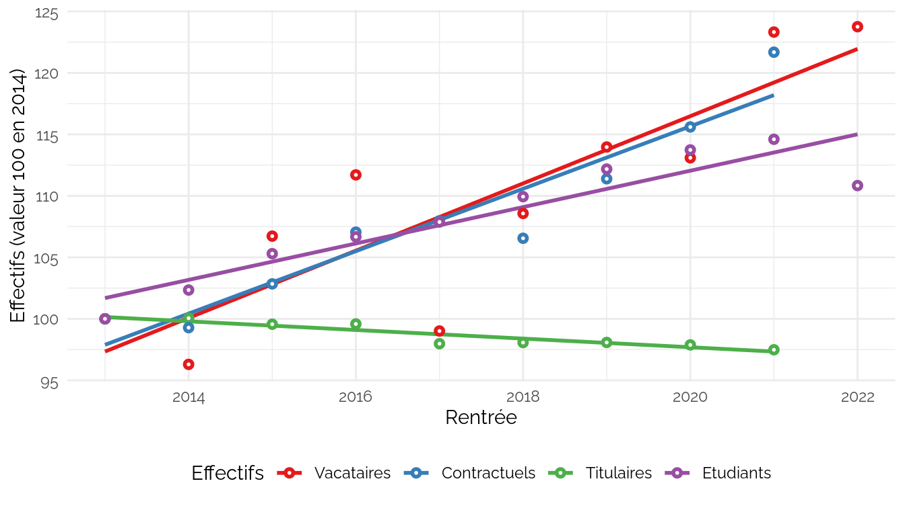

CPESR
================
CPESR
2024-03-29

## Données

- <https://www.aefinfo.fr/depeche/705453-vacataires-dans-l-esr-une-population-toujours-difficile-a-cerner-dont-la-croissance-se-poursuit-24-sur-2013-2022>

<!-- -->

    ## Warning: remplacement de l'importation précédente 'ggthemes::theme_map' par
    ## 'cowplot::theme_map' lors du chargement de 'kpiESR'

    ## Joining with `by = join_by(Rentrée)`

    ## [1] "Rentrée"      "Vacataires"   "Titulaires"   "Contractuels" "Etudiants"

## Explorations

    ## Warning: Removed 2 rows containing missing values (`geom_point()`).

    ## Warning: Removed 2 rows containing missing values (`geom_line()`).

    ## `geom_smooth()` using method = 'loess' and formula = 'y ~ x'

    ## Warning: Removed 2 rows containing non-finite values (`stat_smooth()`).

    ## Warning: Removed 2 rows containing missing values (`geom_point()`).

    ## Warning: Removed 1 rows containing missing values (`geom_rect()`).

    ## Warning: Removed 1 rows containing missing values (`geom_rect()`).

    ## Warning: Removed 1 rows containing missing values (`geom_text()`).

    ## Joining with `by = join_by(Rentrée)`

    ## [1] "Rentrée"      "Vacataires"   "Titulaires"   "Contractuels" "Etudiants"

