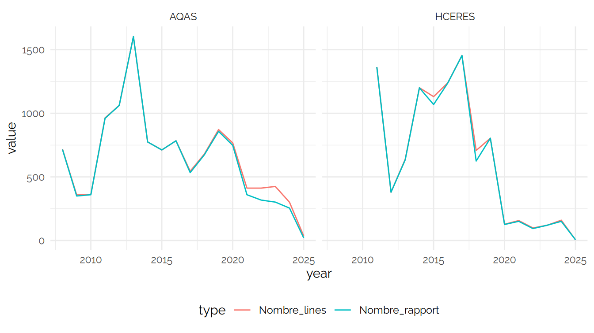
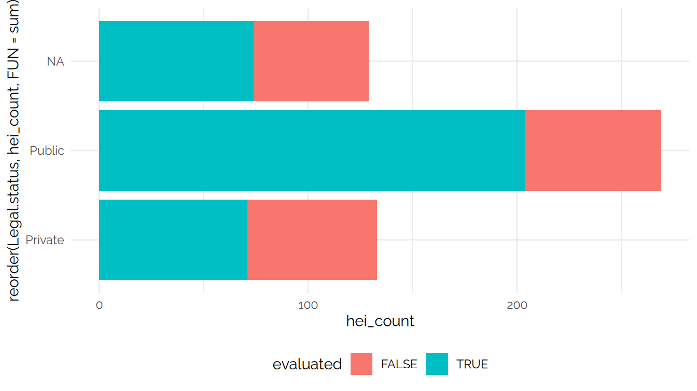
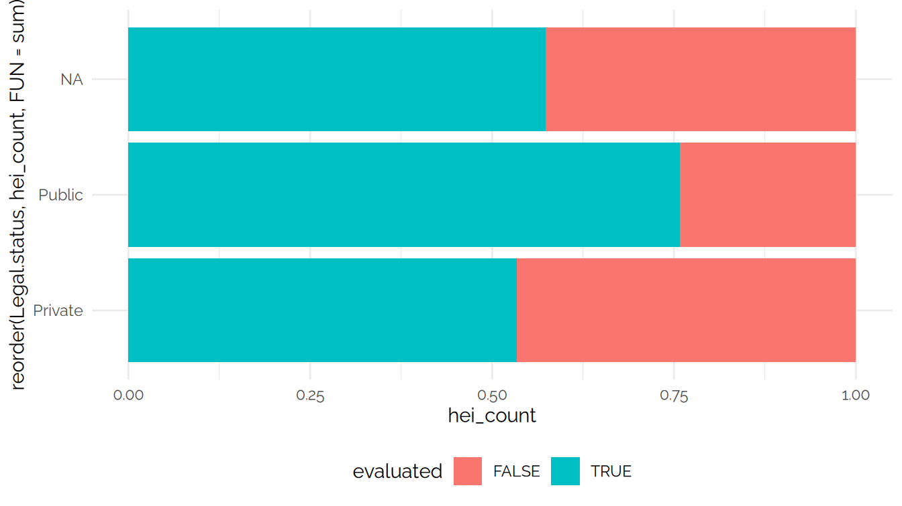
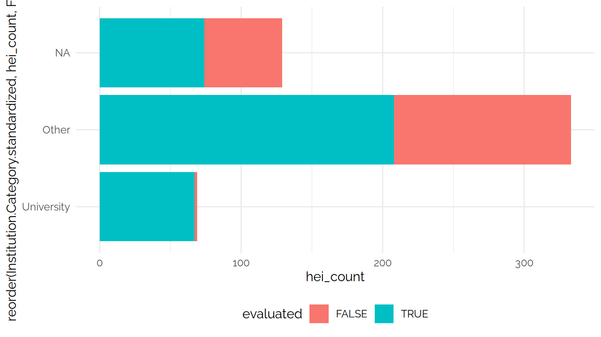
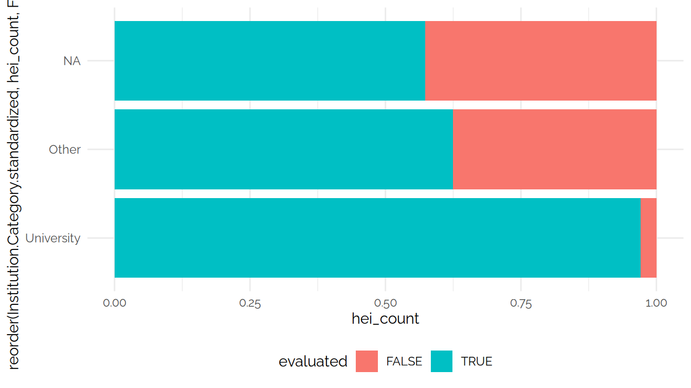
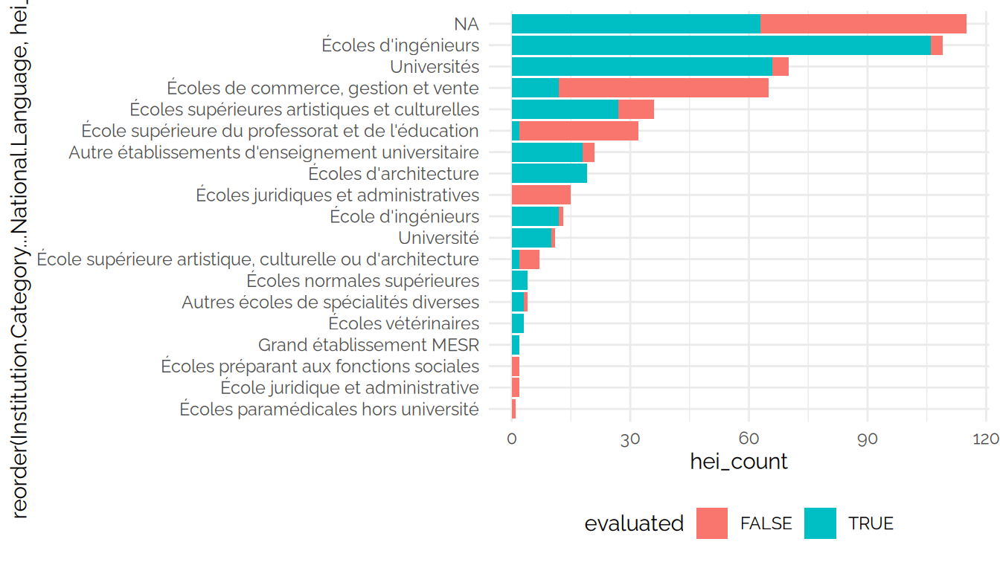

CPESR
================
CPESR
2025-05-02

## Données

- <https://www.eqar.eu/qa-results/download-data-sets/>
- <https://eter-project.com/data/data-for-download-and-visualisations/database/>
- <https://eter-project.com/wp-content/uploads/2022/10/ETERIV_Handbook_2022.pdf>

## Explorations

Nombre de rapports par agence ( 57 lignes)

| report_agency | Nombre_rapport | Nombre_institution | Range                   |
|:--------------|---------------:|-------------------:|:------------------------|
| AQAS          |          11392 |                255 | 2008-03-24 - 2025-10-01 |
| HCERES        |           9416 |                373 | 2011-06-24 - 2025-01-07 |
| ASIIN         |           9399 |                359 | 2008-03-18 - 2025-10-01 |
| NVAO          |           9336 |                174 | 2008-12-15 - 2025-09-01 |
| ACQUIN        |           8740 |                320 | 2008-03-24 - 2025-10-01 |
| ARACIS        |           5926 |                103 | 2012-03-29 - 2025-03-30 |
| PKA           |           5273 |                398 | 2010-06-24 - 2025-03-28 |
| ZEvA          |           5154 |                216 | 2008-03-19 - 2025-10-01 |
| ACCUA         |           5004 |                193 | 2009-05-13 - 2025-03-18 |
| AQU           |           4870 |                238 | 2011-06-08 - 2025-04-11 |
| IAAR          |           4018 |                162 | 2017-05-15 - 2025-02-12 |
| CTI           |           3577 |                235 | 2009-09-01 - 2024-09-01 |
| A3ES          |           3426 |                146 | 2015-02-11 - 2025-07-31 |
| AEQES         |           3382 |                116 | 2011-06-30 - 2024-11-07 |
| FIBAA         |           3088 |                254 | 2008-03-13 - 2025-10-01 |
| IQAA          |           2845 |                 90 | 2017-01-16 - 2024-12-21 |
| madri+d       |           2562 |                155 | 2015-07-07 - 2025-02-28 |
| ACSUCYL       |           2280 |                109 | 2010-01-22 - 2024-10-08 |
| SKVC          |           2062 |                 47 | 2012-01-01 - 2025-02-28 |
| AHPGS         |           1722 |                174 | 2009-05-14 - 2025-03-01 |
| NCEQE         |           1237 |                 62 | 2018-11-28 - 2024-04-15 |
| SQAA          |           1197 |                 54 | 2013-11-01 - 2024-12-19 |
| EVALAG        |           1119 |                117 | 2010-06-18 - 2024-12-03 |
| CYQAA         |           1084 |                 69 | 2019-02-18 - 2025-09-01 |
| NEAA          |           1079 |                 70 | 2015-01-30 - 2024-04-25 |
| MAB           |            936 |                 67 | 2018-09-21 - 3019-11-15 |
| NCPA          |            864 |                 50 | 2016-01-21 - 2022-12-23 |
| AQ Austria    |            757 |                 95 | 2012-11-27 - 2024-11-21 |
| ACSUG         |            555 |                 79 | 2011-07-26 - 2025-01-21 |
| ASHE          |            524 |                136 | 2011-09-02 - 2025-01-31 |
| ACPUA         |            383 |                 16 | 2017-01-17 - 2025-03-06 |
| Unibasq       |            360 |                 53 | 2014-11-28 - 2023-11-06 |
| HAKA          |            223 |                 35 | 2012-06-13 - 2024-07-02 |
| AIC           |            199 |                 50 | 2019-02-22 - 2025-03-19 |
| QAA           |            165 |                120 | 2014-09-02 - 2025-01-15 |
| AAQ           |            164 |                 70 | 2012-05-11 - 2024-12-13 |
| AVAP          |            159 |                 62 | 2022-11-03 - 2025-04-07 |
| ECAQA         |            154 |                 21 | 2021-06-17 - 2025-02-20 |
| ACCUEE        |            143 |                  5 | 2023-03-19 - 2025-01-09 |
| FINEEC        |            132 |                 47 | 2011-01-27 - 2024-06-14 |
| MusiQuE       |            113 |                 26 | 2017-06-02 - 2025-03-31 |
| THEQC         |            110 |                110 | 2021-08-18 - 2025-03-21 |
| EAEVE         |            109 |                 78 | 2018-03-19 - 2024-10-21 |
| BAC           |            104 |                 41 | 2015-07-09 - 2025-01-23 |
| NOKUT         |             81 |                 56 | 2013-02-13 - 2025-01-20 |
| IEP           |             76 |                 65 | 2015-01-01 - 2025-03-27 |
| AI            |             76 |                 37 | 2014-12-11 - 2025-02-19 |
| UKÄ           |             74 |                 41 | 2021-01-18 - 2024-05-30 |
| ANQA          |             51 |                 30 | 2017-10-20 - 2024-01-17 |
| SAAHE         |             34 |                 31 | 2024-02-29 - 2025-01-15 |
| QQI           |             20 |                 19 | 2018-11-23 - 2025-01-23 |
| ECTE          |             19 |                 19 | 2022-07-26 - 2025-03-11 |
| GAC           |             19 |                 15 | 2021-10-01 - 2025-05-07 |
| AKAST         |             12 |                 10 | 2021-10-01 - 2023-10-01 |
| AKKORK        |              4 |                  2 | 2016-06-08 - 2019-12-12 |
| VLUHR QA      |              2 |                 13 | 2022-12-16 - 2024-12-23 |
| EQ-Arts       |              2 |                  2 | 2021-07-31 - 2022-08-29 |

Rapport AQAS ( 10 lignes)

| report_agency | country | report_crossborder | report_type | report_esg_activity_short | Nombre_rapport | Nombre_institution | Range |
|:---|:---|:---|:---|:---|---:|---:|:---|
| AQAS | Germany | FALSE | programme | Programme accreditation | 11087 | 157 | 2008-03-24 - 2025-04-01 |
| AQAS | Germany | FALSE |  |  | 45 | 11 | 2024-09-01 - 2025-10-01 |
| AQAS | Germany | FALSE | institutional | System accreditation | 42 | 21 | 2011-11-22 - 2024-10-01 |
| AQAS | Germany | FALSE | joint programme | European Approach for QA of Joint Programmes | 14 | 10 | 2018-05-14 - 2025-02-24 |
| AQAS | Paraguay | FALSE | programme | Programme accreditation | 11 | 1 | 2008-08-18 - 2017-05-23 |
| AQAS | United States | FALSE | programme | Programme accreditation | 8 | 1 | 2008-05-05 - 2011-08-22 |
| AQAS |  | FALSE | programme | Programme accreditation | 8 | 2 | 2018-12-03 - 2024-12-02 |
| AQAS | Malta | FALSE | programme | Programme accreditation | 5 | 1 | 2017-08-29 - 2023-05-22 |
| AQAS | Mauritius | FALSE | programme | Programme accreditation | 5 | 1 | 2017-08-29 - 2023-05-22 |
| AQAS | Argentina | FALSE | joint programme | European Approach for QA of Joint Programmes | 1 | 1 | 2024-01-15 - 2024-01-15 |

Nombre de rapports par pays ( 124 lignes)

| country | Nombre_rapport | Nombre_institution | Nombre_agences | Range |
|:---|---:|---:|---:|:---|
| Germany | 37629 | 443 | 22 | 2008-03-13 - 2025-10-01 |
| Spain | 16506 | 867 | 25 | 2009-05-13 - 2025-09-01 |
| France | 12544 | 403 | 17 | 2009-09-01 - 2025-09-01 |
| Kazakhstan | 7610 | 153 | 11 | 2013-09-27 - 2025-06-06 |
| Netherlands | 6386 | 101 | 12 | 2008-12-15 - 2025-09-01 |
| Romania | 5960 | 98 | 12 | 2012-03-29 - 2025-07-31 |
| Poland | 5370 | 393 | 14 | 2010-06-24 - 2025-09-01 |
| Belgium (French Community) | 3547 | 117 | 5 | 2011-06-30 - 2024-11-07 |
| Portugal | 3450 | 121 | 14 | 2013-07-16 - 2025-07-31 |
| Belgium (Flemish Community) | 3085 | 37 | 11 | 2009-09-01 - 2025-09-01 |
| Lithuania | 2126 | 45 | 12 | 2010-07-20 - 2025-07-31 |
| Slovenia | 1290 | 53 | 12 | 2012-12-07 - 2025-02-24 |
| Georgia | 1244 | 60 | 6 | 2018-11-28 - 2025-03-31 |
| Bulgaria | 1124 | 70 | 6 | 2009-09-01 - 2024-04-25 |
| Cyprus | 1091 | 51 | 5 | 2015-05-29 - 2025-09-01 |
| Russia | 973 | 70 | 9 | 2009-02-17 - 2024-11-08 |
| Hungary | 972 | 68 | 13 | 2013-09-20 - 3019-11-15 |
| Indonesia | 783 | 66 | 8 | 2015-06-26 - 2025-03-12 |
| Croatia | 546 | 134 | 12 | 2011-09-02 - 2025-09-01 |
| Austria | 422 | 66 | 16 | 2011-12-15 - 2025-07-31 |
| Lebanon | 386 | 13 | 9 | 2009-09-01 - 2025-01-13 |
| Italy | 312 | 33 | 16 | 2013-07-16 - 2025-03-18 |
| Moldova | 276 | 20 | 5 | 2013-12-19 - 2025-03-11 |
| Finland | 236 | 46 | 11 | 2011-01-27 - 2025-09-01 |
| Türkiye | 236 | 119 | 7 | 2016-01-01 - 2025-03-21 |
| Estonia | 204 | 22 | 6 | 2012-06-13 - 2024-07-31 |
| Vietnam | 203 | 20 | 7 | 2010-09-01 - 2025-03-12 |
| Switzerland | 201 | 64 | 17 | 2009-09-23 - 2025-03-11 |
| Latvia | 196 | 46 | 2 | 2017-07-01 - 2025-03-19 |
| Saudi Arabia | 174 | 21 | 4 | 2011-04-01 - 2024-09-24 |
| United Kingdom (England) | 154 | 91 | 11 | 2012-03-30 - 2025-09-01 |
| Kyrgyzstan | 146 | 17 | 6 | 2013-03-22 - 2024-11-16 |
| China, People’s Republic of | 115 | 21 | 11 | 2008-09-23 - 2024-11-05 |
| United Arab Emirates | 115 | 14 | 9 | 2010-09-01 - 2024-10-25 |
|  | 111 | 7 | 6 | 2011-06-28 - 2024-12-02 |
| United States | 105 | 7 | 10 | 2008-03-28 - 2024-11-27 |
| Tunisia | 96 | 19 | 5 | 2016-04-08 - 2024-12-06 |
| Norway | 92 | 56 | 9 | 2013-02-13 - 2025-03-18 |
| Sweden | 85 | 43 | 9 | 2015-04-22 - 2025-07-31 |
| Denmark | 83 | 38 | 6 | 2014-12-11 - 2025-02-19 |
| Australia | 79 | 3 | 3 | 2014-09-26 - 2023-09-22 |
| Paraguay | 75 | 1 | 4 | 2008-08-18 - 2019-07-09 |
| Uzbekistan | 75 | 12 | 4 | 2021-11-16 - 2025-02-20 |
| Armenia | 73 | 33 | 6 | 2014-03-28 - 2024-05-27 |
| Egypt | 60 | 8 | 8 | 2008-09-23 - 2024-09-24 |
| Tajikistan | 59 | 9 | 3 | 2017-12-04 - 2024-07-13 |
| Ukraine | 58 | 29 | 13 | 2014-06-27 - 2025-02-06 |
| Azerbaijan | 51 | 8 | 5 | 2015-02-12 - 2024-11-27 |
| United Kingdom (Scotland) | 45 | 20 | 6 | 2018-08-10 - 2025-02-20 |
| Oman | 41 | 1 | 4 | 2015-12-11 - 2024-09-24 |
| Greece | 40 | 16 | 7 | 2011-07-21 - 2024-09-01 |
| Ireland | 39 | 22 | 11 | 2015-06-03 - 2025-01-23 |
| Serbia | 39 | 3 | 4 | 2013-06-28 - 2024-12-06 |
| Slovakia | 39 | 31 | 5 | 2021-09-22 - 2025-01-15 |
| Mongolia | 37 | 8 | 3 | 2013-12-06 - 2024-03-22 |
| Singapore | 36 | 5 | 6 | 2008-09-23 - 2024-09-12 |
| Czech Republic | 34 | 14 | 12 | 2011-07-21 - 2025-07-31 |
| Belarus | 33 | 5 | 1 | 2021-06-11 - 2023-01-27 |
| Brazil | 33 | 4 | 6 | 2008-09-23 - 2024-09-12 |
| India | 33 | 3 | 5 | 2008-09-23 - 2024-11-27 |
| United Kingdom (Wales) | 26 | 16 | 2 | 2016-06-30 - 2024-05-08 |
| North Macedonia | 24 | 6 | 4 | 2015-04-01 - 2024-09-07 |
| Belgium | 23 | 5 | 3 | 2009-09-01 - 2024-10-01 |
| Luxembourg | 22 | 3 | 6 | 2017-01-01 - 2024-12-04 |
| Mexico | 22 | 2 | 2 | 2013-09-27 - 2024-03-22 |
| Nigeria | 21 | 8 | 2 | 2018-12-03 - 2024-07-12 |
| Qatar | 21 | 3 | 4 | 2016-07-14 - 2025-03-12 |
| Peru | 20 | 2 | 1 | 2014-09-26 - 2023-09-22 |
| Bosnia and Herzegovina | 19 | 6 | 5 | 2016-09-21 - 2024-09-07 |
| Malta | 19 | 3 | 7 | 2016-02-12 - 2025-03-18 |
| Jordan | 18 | 6 | 5 | 2015-09-30 - 2024-12-06 |
| United Kingdom | 18 | 6 | 4 | 2015-07-09 - 2024-05-22 |
| Cameroon | 16 | 2 | 2 | 2017-04-24 - 2021-09-01 |
| Ghana | 16 | 6 | 4 | 2018-05-14 - 2024-08-26 |
| Iraq | 16 | 2 | 3 | 2017-03-23 - 2024-07-25 |
| Burkina Faso | 15 | 3 | 2 | 2009-09-01 - 2024-06-28 |
| South Africa | 15 | 7 | 2 | 2017-07-27 - 2025-02-24 |
| Iceland | 14 | 1 | 1 | 2022-03-18 - 2022-03-18 |
| Mauritius | 14 | 3 | 5 | 2015-11-26 - 2025-01-17 |
| Kosovo | 13 | 4 | 2 | 2013-02-01 - 2024-04-25 |
| Albania | 12 | 6 | 6 | 2015-11-27 - 2024-09-07 |
| Central African Republic | 10 | 1 | 1 | 2013-01-08 - 2024-11-29 |
| Bahrain | 9 | 3 | 2 | 2019-03-29 - 2024-09-13 |
| Chile | 9 | 3 | 1 | 2017-12-04 - 2024-12-02 |
| Montenegro | 9 | 9 | 1 | 2018-05-01 - 2018-08-01 |
| Liechtenstein | 8 | 3 | 3 | 2013-09-24 - 2022-06-24 |
| Malaysia | 8 | 4 | 3 | 2016-07-14 - 2024-09-24 |
| Argentina | 7 | 2 | 5 | 2015-10-03 - 2024-09-24 |
| Thailand | 6 | 3 | 2 | 2017-11-22 - 2021-11-30 |
| Uganda | 6 | 2 | 3 | 2012-07-10 - 2025-02-24 |
| Cote d’Ivoire (Ivory Coast) | 5 | 2 | 2 | 2023-07-07 - 2024-08-06 |
| Djibouti | 5 | 1 | 1 | 2019-05-27 - 2023-04-04 |
| Israel | 5 | 1 | 1 | 2013-07-16 - 2024-05-16 |
| Togo | 5 | 1 | 1 | 2024-02-07 - 2024-05-27 |
| United Kingdom (Northern Ireland) | 5 | 4 | 2 | 2013-03-22 - 2024-07-10 |
| Canada | 4 | 4 | 2 | 2015-09-30 - 2021-03-16 |
| Costa Rica | 4 | 2 | 2 | 2017-11-29 - 2024-02-08 |
| Ethiopia | 4 | 1 | 3 | 2020-10-01 - 2024-09-20 |
| Japan | 4 | 6 | 2 | 2019-06-09 - 2024-06-28 |
| Kuwait | 4 | 3 | 1 | 2023-10-02 - 2025-01-03 |
| Belgium (German-speaking Community) | 3 | 1 | 1 | 2011-06-30 - 2016-06-30 |
| Curaçao | 3 | 1 | 1 | 2019-05-27 - 2022-12-05 |
| Kenya | 3 | 2 | 3 | 2012-07-10 - 2025-01-17 |
| Morocco | 3 | 2 | 2 | 2018-01-01 - 2024-10-25 |
| Tanzania | 3 | 3 | 3 | 2012-07-10 - 2024-03-22 |
| Ecuador | 2 | 1 | 1 | 2019-06-28 - 2019-06-28 |
| El Salvador | 2 | 1 | 1 | 2020-07-27 - 2020-07-27 |
| Guatemala | 2 | 1 | 1 | 2020-05-26 - 2020-05-26 |
| Hong Kong | 2 | 2 | 2 | 2016-02-25 - 2022-09-22 |
| Mali | 2 | 2 | 1 | 2020-04-24 - 2024-06-28 |
| Namibia | 2 | 1 | 1 | 2017-03-31 - 2017-03-31 |
| Senegal | 2 | 2 | 1 | 2024-06-28 - 2024-06-28 |
| Sudan | 2 | 1 | 1 | 2019-08-19 - 2025-02-24 |
| Zambia | 2 | 1 | 1 | 2024-12-06 - 2024-12-06 |
| Cape Verde | 1 | 1 | 1 | 2024-06-28 - 2024-06-28 |
| Dominica | 1 | 1 | 1 | 2023-06-16 - 2023-06-16 |
| Fiji | 1 | 1 | 1 | 2023-03-27 - 2023-03-27 |
| Malawi | 1 | 1 | 1 | 2020-02-17 - 2020-02-17 |
| Maldives | 1 | 1 | 1 | 2023-10-02 - 2023-10-02 |
| Niger | 1 | 1 | 1 | 2023-11-16 - 2023-11-16 |
| San Marino | 1 | 1 | 1 | 2025-03-27 - 2025-03-27 |
| Syria | 1 | 1 | 1 | 2019-06-25 - 2019-06-25 |
| Turks and Caicos Islands | 1 | 1 | 1 | 2020-03-24 - 2020-03-24 |
| Uruguay | 1 | 1 | 1 | 2024-09-01 - 2024-09-01 |

### CTI

Rapport CTI par décision ( 14 lignes)

| country | report_decision | Nombre_rapport | Nombre_institution | Nombre_agences | Range |
|:---|:---|---:|---:|---:|:---|
| France | positive | 3210 | 203 | 1 | 2009-09-01 - 2024-09-01 |
| Lebanon | positive | 207 | 2 | 1 | 2009-09-01 - 2022-09-01 |
| Belgium (French Community) | positive | 161 | 13 | 1 | 2013-09-01 - 2023-01-01 |
| Belgium (Flemish Community) | positive | 68 | 3 | 1 | 2016-09-01 - 2023-01-01 |
| Switzerland | positive | 54 | 1 | 1 | 2010-09-01 - 2023-01-01 |
| United Arab Emirates | positive | 54 | 1 | 1 | 2010-09-01 - 2023-01-01 |
| Tunisia | positive | 32 | 6 | 1 | 2017-01-01 - 2021-09-01 |
| Vietnam | positive | 13 | 2 | 1 | 2010-09-01 - 2016-09-01 |
| Cameroon | positive | 12 | 1 | 1 | 2017-09-01 - 2021-09-01 |
| Burkina Faso | positive | 11 | 1 | 1 | 2009-09-01 - 2020-09-01 |
| China, People’s Republic of | positive | 9 | 1 | 1 | 2014-09-01 - 2021-09-01 |
| Bulgaria | positive | 7 | 2 | 1 | 2009-09-01 - 2020-09-01 |
| Belgium | positive | 3 | 1 | 1 | 2009-09-01 - 2021-09-01 |
| Morocco | positive | 2 | 1 | 1 | 2018-01-01 - 2021-09-01 |

French reports by agency ( 23 lignes)

| country | report_agency | report_decision | Nombre_rapport | Nombre_institution | Nombre_agences | Range |
|:---|:---|:---|---:|---:|---:|:---|
| France | HCERES | not applicable | 9257 | 314 | 1 | 2011-06-24 - 2025-01-07 |
| France | CTI | positive | 3210 | 203 | 1 | 2009-09-01 - 2024-09-01 |
| France | ASIIN | positive | 15 | 13 | 1 | 2012-09-28 - 2023-03-24 |
| France | NVAO | positive | 13 | 4 | 1 | 2013-07-16 - 2025-09-01 |
| France | AQ Austria | positive | 13 | 2 | 1 | 2015-02-17 - 2022-05-20 |
| France | EVALAG | positive with conditions or restrictions | 6 | 1 | 1 | 2016-09-19 - 2021-09-24 |
| France | Unibasq | positive | 3 | 3 | 1 | 2019-09-16 - 2023-03-30 |
| France | AQU | positive | 3 | 2 | 1 | 2020-12-17 - 2024-12-18 |
| France | BAC | positive | 3 | 1 | 1 | 2024-06-27 - 2024-06-27 |
| France | AQAS | positive with conditions or restrictions | 3 | 3 | 1 | 2018-12-03 - 2023-12-04 |
| France | AQ Austria | positive with conditions or restrictions | 3 | 1 | 1 | 2015-07-27 - 2022-12-19 |
| France | ACCUA | positive | 2 | 2 | 1 | 2023-05-21 - 2024-07-05 |
| France | ASIIN | positive with conditions or restrictions | 2 | 2 | 1 | 2017-09-30 - 2017-09-30 |
| France | EAEVE | positive | 2 | 2 | 1 | 2020-03-09 - 2021-06-07 |
| France | VLUHR QA | negative | 1 | 1 | 1 | 2024-12-23 - 2024-12-23 |
| France | EAEVE | positive with conditions or restrictions | 1 | 1 | 1 | 2024-09-23 - 2024-09-23 |
| France | ASHE | positive | 1 | 1 | 1 | 2021-07-26 - 2021-07-26 |
| France | NCEQE | positive | 1 | 1 | 1 | 2019-12-19 - 2019-12-19 |
| France | EAEVE | negative | 1 | 1 | 1 | 2020-03-09 - 2020-03-09 |
| France | PKA | positive | 1 | 1 | 1 | 2025-02-20 - 2025-02-20 |
| France | AQ Austria | negative | 1 | 1 | 1 | 2020-07-29 - 2020-07-29 |
| France | A3ES | positive | 1 | 2 | 1 | 2025-07-31 - 2025-07-31 |
| France | AQAS | positive | 1 | 1 | 1 | 2023-04-06 - 2023-04-06 |

## Institutions non évaluées

### Check

Doublon dquar_id ( 2 lignes)

| country | deqar_id | deqar_url | eter_id | identifiers_all | founding_date | closure_date | name_primary | name_official | name_versions | city | website_link | report_count | report_first | report_last | cb_report_count | cb_report_first | cb_report_last | parent_institution | parent_eter_id | historic_relationships |
|:---|:---|:---|:---|:---|:---|:---|:---|:---|:---|:---|:---|---:|:---|:---|---:|:---|:---|:---|:---|:---|
| France | DEQARINST4596 | <https://data.deqar.eu/institution/4596> | FR0918 | HCERES:0932066R, WHED:IAU-004180, ROR:<https://ror.org/003hyqr30> | 1926-01-01 |  | Ecole nationale supérieure Louis Lumière | Ecole nationale supérieure Louis Lumière |  | Noisy-le-Grand | <http://www.ens-louis-lumiere.fr/> | 2 | 2014-11-25 | 2014-12-01 | 0 |  |  | DEQARINST4887 Comue Université Paris-Lumière | FR0816 |  |
| France | DEQARINST4596 | <https://data.deqar.eu/institution/4596> | FR0918 | HCERES:0932066R, WHED:IAU-004180, ROR:<https://ror.org/003hyqr30> | 1926-01-01 |  | Ecole nationale supérieure Louis Lumière | Ecole nationale supérieure Louis Lumière |  | Saint-Denis | <http://www.ens-louis-lumiere.fr/> | 2 | 2014-11-25 | 2014-12-01 | 0 |  |  | DEQARINST4887 Comue Université Paris-Lumière | FR0816 |  |

Doublon eter_id ( 0 lignes)

| country | deqar_id | deqar_url | eter_id | identifiers_all | founding_date | closure_date | name_primary | name_official | name_versions | city | website_link | report_count | report_first | report_last | cb_report_count | cb_report_first | cb_report_last | parent_institution | parent_eter_id | historic_relationships | ETER.ID.Year | Institution.Name | English.Institution.Name | Reference.year | Institution.Acronym | Country.Code | Legal.status | Institution.Category…National.Language | Institution.Category…English | Institution.Category.standardized | Notes.on.institution.category | Foundation.year | University.hospital | Region.of.establishment..NUTS.3. | Name.of.the.city | Geographic.coordinates…latitude | Geographic.coordinates…longitude | Postcode | Multi.site.institution | Total.Current.expenditure..PPP. | Total.Current.revenues..PPP. | Total.academic.personnel..FTE. | Total.personnel..FTE. | Lowest.degree.delivered | Highest.degree.delivered | Total.students.enrolled.at.ISCED.5 | Total.students.enrolled.at.ISCED.6 | Total.students.enrolled.at.ISCED.7 | Total.students.enrolled.ISCED.7.long.degree | Total.students.enrolled.ISCED.5.7 | Distance.education.institution | Total.graduates.at.ISCED.5 | Total.graduates.at.ISCED.6 | Total.graduates.at.ISCED.7 | Total.graduates.at.ISCED.7.long.degree | Total.graduates.ISCED.5.7 | Total.students.enrolled.at.ISCED.8 | Total.graduates.at.ISCED.8 | Share.of.women.students.ISCED.5.7 | Share.of.women.academic.staff | Share.of.foreigners.students.ISCED.5.7 | Herfindahl.index.students.ISCED.5.7 | PhD.intensity | Erasmus.total.incoming.students | Erasmus.total.outgoing.students | hei_name | hei_eter_id | Other | HCERES | CTI | Total | evaluated |
|:---|:---|:---|:---|:---|:---|:---|:---|:---|:---|:---|:---|---:|:---|:---|---:|:---|:---|:---|:---|:---|:---|:---|:---|---:|:---|:---|:---|:---|:---|:---|:---|---:|---:|:---|:---|:---|:---|:---|---:|:---|:---|:---|:---|---:|---:|:---|:---|:---|:---|:---|---:|:---|:---|:---|:---|:---|:---|:---|:---|:---|:---|:---|:---|---:|---:|:---|:---|---:|---:|---:|---:|:---|

Not in ETER ( 105 lignes)

| country | deqar_id | deqar_url | eter_id | identifiers_all | founding_date | closure_date | name_primary | name_official | name_versions | city | website_link | report_count | report_first | report_last | cb_report_count | cb_report_first | cb_report_last | parent_institution | parent_eter_id | historic_relationships | ETER.ID.Year | Institution.Name | English.Institution.Name | Reference.year | Institution.Acronym | Country.Code | Legal.status | Institution.Category…National.Language | Institution.Category…English | Institution.Category.standardized | Notes.on.institution.category | Foundation.year | University.hospital | Region.of.establishment..NUTS.3. | Name.of.the.city | Geographic.coordinates…latitude | Geographic.coordinates…longitude | Postcode | Multi.site.institution | Total.Current.expenditure..PPP. | Total.Current.revenues..PPP. | Total.academic.personnel..FTE. | Total.personnel..FTE. | Lowest.degree.delivered | Highest.degree.delivered | Total.students.enrolled.at.ISCED.5 | Total.students.enrolled.at.ISCED.6 | Total.students.enrolled.at.ISCED.7 | Total.students.enrolled.ISCED.7.long.degree | Total.students.enrolled.ISCED.5.7 | Distance.education.institution | Total.graduates.at.ISCED.5 | Total.graduates.at.ISCED.6 | Total.graduates.at.ISCED.7 | Total.graduates.at.ISCED.7.long.degree | Total.graduates.ISCED.5.7 | Total.students.enrolled.at.ISCED.8 | Total.graduates.at.ISCED.8 | Share.of.women.students.ISCED.5.7 | Share.of.women.academic.staff | Share.of.foreigners.students.ISCED.5.7 | Herfindahl.index.students.ISCED.5.7 | PhD.intensity | Erasmus.total.incoming.students | Erasmus.total.outgoing.students | hei_name | hei_eter_id | Other | HCERES | CTI | Total | evaluated |
|:---|:---|:---|:---|:---|:---|:---|:---|:---|:---|:---|:---|---:|:---|:---|---:|:---|:---|:---|:---|:---|:---|:---|:---|---:|:---|:---|:---|:---|:---|:---|:---|---:|---:|:---|:---|:---|:---|:---|---:|:---|:---|:---|:---|---:|---:|:---|:---|:---|:---|:---|---:|:---|:---|:---|:---|:---|:---|:---|:---|:---|:---|:---|:---|---:|---:|:---|:---|---:|---:|---:|---:|:---|
| France | DEQARINST7604 | <https://data.deqar.eu/institution/7604> | FR0467 |  | 2004-01-01 |  | ECAM group | ECAM group |  |  | N/A | 0 |  |  | NA |  |  |  |  |  | NA | NA | NA | NA | NA | NA | NA | NA | NA | NA | NA | NA | NA | NA | NA | NA | NA | NA | NA | NA | NA | NA | NA | NA | NA | NA | NA | NA | NA | NA | NA | NA | NA | NA | NA | NA | NA | NA | NA | NA | NA | NA | NA | NA | NA | NA | NA | 0 | 0 | 0 | 0 | FALSE |
| France | DEQARINST4575 | <https://data.deqar.eu/institution/4575> | FR0865 | HCERES:0130221V, WHED:IAU-007903, ROR:<https://ror.org/0406m4x33> | 1956-01-01 |  | Institut d’études politiques d’Aix-en-Provence | Institut d’études politiques d’Aix-en-Provence |  | Aix-en-Provence | <http://www.sciencespo-aix.fr/> | 6 | 2011-10-11 | 2023-10-23 | 0 |  |  | DEQARINST0899 Aix-Marseille University, DEQARINST0899 Aix-Marseille University | FR0007, FR0007 |  | NA | NA | NA | NA | NA | NA | NA | NA | NA | NA | NA | NA | NA | NA | NA | NA | NA | NA | NA | NA | NA | NA | NA | NA | NA | NA | NA | NA | NA | NA | NA | NA | NA | NA | NA | NA | NA | NA | NA | NA | NA | NA | NA | NA | NA | Institut d’études politiques d’Aix-en-Provence | FR0865 | 0 | 6 | 0 | 6 | TRUE |
| France | DEQARINST7036 | <https://data.deqar.eu/institution/7036> | FR0871 | WHED:IAU-019545-028455 | 1991-01-01 |  | Institut des sciences et techniques de l’ingénieur d’Angers | Institut des sciences et techniques de l’ingénieur d’Angers |  | Angers | <http://www.polytech-angers.fr/> | 20 | 2014-09-01 | 2021-09-01 | 0 |  |  | DEQARINST0984 University of Angers | FR0099 |  | NA | NA | NA | NA | NA | NA | NA | NA | NA | NA | NA | NA | NA | NA | NA | NA | NA | NA | NA | NA | NA | NA | NA | NA | NA | NA | NA | NA | NA | NA | NA | NA | NA | NA | NA | NA | NA | NA | NA | NA | NA | NA | NA | NA | NA | University of Angers / Institut des sciences et techniques de l’ingénieur d’Angers | FR0871 | 0 | 0 | 20 | 20 | TRUE |
| France | DEQARINST7030 | <https://data.deqar.eu/institution/7030> | FR0872 | WHED:IAU-019636-028558 | 1996-01-01 |  | Institut supérieur aquitain du bâtiment et des travaux publics | Institut supérieur aquitain du bâtiment et des travaux publics |  | Anglet | <https://isabtp.univ-pau.fr/fr/index.html> | 7 | 2011-09-01 | 2021-09-01 | 0 |  |  | DEQARINST1024 University of Pau and Pays de l’Adour | FR0140 |  | NA | NA | NA | NA | NA | NA | NA | NA | NA | NA | NA | NA | NA | NA | NA | NA | NA | NA | NA | NA | NA | NA | NA | NA | NA | NA | NA | NA | NA | NA | NA | NA | NA | NA | NA | NA | NA | NA | NA | NA | NA | NA | NA | NA | NA | University of Pau and Pays de l’Adour / Institut supérieur aquitain du bâtiment et des travaux publics | FR0872 | 0 | 0 | 7 | 7 | TRUE |
| France | DEQARINST6994 | <https://data.deqar.eu/institution/6994> | FR0873 | WHED:IAU-028588 | 1957-01-01 |  | Centre des hautes études de la construction | Centre des hautes études de la construction |  | Arcueil | <https://www.chec.fr> | 3 | 2017-09-01 | 2019-09-01 | 0 |  |  |  |  |  | NA | NA | NA | NA | NA | NA | NA | NA | NA | NA | NA | NA | NA | NA | NA | NA | NA | NA | NA | NA | NA | NA | NA | NA | NA | NA | NA | NA | NA | NA | NA | NA | NA | NA | NA | NA | NA | NA | NA | NA | NA | NA | NA | NA | NA | Centre des hautes études de la construction | FR0873 | 0 | 0 | 3 | 3 | TRUE |
| France | DEQARINST7063 | <https://data.deqar.eu/institution/7063> | FR0875 | ROR:<https://ror.org/006z7v557> | 2002-01-01 |  | École Nationale Supérieure d’Ingénieurs en Informatique Automatique Mécanique Énergétique et Électronique | École Nationale Supérieure d’Ingénieurs en Informatique Automatique Mécanique Énergétique et Électronique |  | Aulnoy-lez-Valenciennes | <http://www.univ-valenciennes.fr/ensiame> | 28 | 2019-09-01 | 2022-09-01 | 0 |  |  | DEQARINST1007 Université Polytechnique Hauts-de-France | FR0122 | 2019-01-01: succeeded by DEQARINST7600 Institut National des Sciences Appliquées Hauts-de-France | NA | NA | NA | NA | NA | NA | NA | NA | NA | NA | NA | NA | NA | NA | NA | NA | NA | NA | NA | NA | NA | NA | NA | NA | NA | NA | NA | NA | NA | NA | NA | NA | NA | NA | NA | NA | NA | NA | NA | NA | NA | NA | NA | NA | NA | Université Polytechnique Hauts-de-France / École Nationale Supérieure d’Ingénieurs en Informatique Automatique Mécanique Énergétique et Électronique | FR0875 | 0 | 0 | 28 | 28 | TRUE |
| France | DEQARINST7034 | <https://data.deqar.eu/institution/7034> | FR0876 | WHED:IAU-019583-028562 | 2001-01-01 |  | Institut supérieur d’ingénieurs de Franche-Comté | Institut supérieur d’ingénieurs de Franche-Comté |  | Besançon | <http://isifc.univ-fcomte.fr/> | 6 | 2010-09-01 | 2016-09-01 | 0 |  |  | DEQARINST0913 University of Franche-Comté | FR0022 |  | NA | NA | NA | NA | NA | NA | NA | NA | NA | NA | NA | NA | NA | NA | NA | NA | NA | NA | NA | NA | NA | NA | NA | NA | NA | NA | NA | NA | NA | NA | NA | NA | NA | NA | NA | NA | NA | NA | NA | NA | NA | NA | NA | NA | NA | University of Franche-Comté / Institut supérieur d’ingénieurs de Franche-Comté | FR0876 | 0 | 0 | 6 | 6 | TRUE |
| France | DEQARINST7011 | <https://data.deqar.eu/institution/7011> |  |  |  |  | Ecole nationale supérieure de technologie des biomolécules de Bordeaux | Ecole nationale supérieure de technologie des biomolécules de Bordeaux |  | Bordeaux | <https://enstbb.bordeaux-inp.fr/fr> | 7 | 2011-09-01 | 2022-09-01 | 0 |  |  |  |  |  | NA | NA | NA | NA | NA | NA | NA | NA | NA | NA | NA | NA | NA | NA | NA | NA | NA | NA | NA | NA | NA | NA | NA | NA | NA | NA | NA | NA | NA | NA | NA | NA | NA | NA | NA | NA | NA | NA | NA | NA | NA | NA | NA | NA | NA | Ecole nationale supérieure de technologie des biomolécules de Bordeaux |  | 0 | 0 | 7 | 7 | TRUE |
| France | DEQARINST4555 | <https://data.deqar.eu/institution/4555> | FR0801 | ROR:<https://ror.org/05vbaw293> | 2015-01-01 |  | Communauté d’universités et établissements d’Aquitaine | Communauté d’universités et établissements d’Aquitaine |  | Bordeaux | <http://www.cue-aquitaine.fr/> | 0 |  |  | NA |  |  |  |  |  | NA | NA | NA | NA | NA | NA | NA | NA | NA | NA | NA | NA | NA | NA | NA | NA | NA | NA | NA | NA | NA | NA | NA | NA | NA | NA | NA | NA | NA | NA | NA | NA | NA | NA | NA | NA | NA | NA | NA | NA | NA | NA | NA | NA | NA | NA | NA | 0 | 0 | 0 | 0 | FALSE |
| France | DEQARINST6711 | <https://data.deqar.eu/institution/6711> | FR0890 |  | 2016-01-01 |  | Institut supérieur de l’électronique et du numérique | YNCREA group |  | Brest | <https://www.isen.fr/> | 0 |  |  | NA |  |  |  |  |  | NA | NA | NA | NA | NA | NA | NA | NA | NA | NA | NA | NA | NA | NA | NA | NA | NA | NA | NA | NA | NA | NA | NA | NA | NA | NA | NA | NA | NA | NA | NA | NA | NA | NA | NA | NA | NA | NA | NA | NA | NA | NA | NA | NA | NA | NA | NA | 0 | 0 | 0 | 0 | FALSE |
| France | DEQARINST4560 | <https://data.deqar.eu/institution/4560> | FR0807 | HCERES:0142382N, ROR:<https://ror.org/01k40cz91> | 2014-01-01 |  | Normandie université | Normandie université |  | Caen | <http://www.normandie-univ.fr/> | 1 | 2021-12-05 | 2021-12-05 | 0 |  |  |  |  |  | NA | NA | NA | NA | NA | NA | NA | NA | NA | NA | NA | NA | NA | NA | NA | NA | NA | NA | NA | NA | NA | NA | NA | NA | NA | NA | NA | NA | NA | NA | NA | NA | NA | NA | NA | NA | NA | NA | NA | NA | NA | NA | NA | NA | NA | Normandie université | FR0807 | 0 | 1 | 0 | 1 | TRUE |
| France | DEQARINST6997 | <https://data.deqar.eu/institution/6997> | FR0878 |  | 1991-01-01 |  | Ecole d’Ingénieurs du Littoral Côte d’Opale | Ecole d’Ingénieurs du Littoral Côte d’Opale |  | Calais | <https://www.eilco-ulco.fr/> | 15 | 2012-09-01 | 2021-09-01 | 0 |  |  | DEQARINST1012 University of the Littoral Opal Coast | FR0127 |  | NA | NA | NA | NA | NA | NA | NA | NA | NA | NA | NA | NA | NA | NA | NA | NA | NA | NA | NA | NA | NA | NA | NA | NA | NA | NA | NA | NA | NA | NA | NA | NA | NA | NA | NA | NA | NA | NA | NA | NA | NA | NA | NA | NA | NA | University of the Littoral Opal Coast / Ecole d’Ingénieurs du Littoral Côte d’Opale | FR0878 | 0 | 0 | 15 | 15 | TRUE |
| France | DEQARINST4593 | <https://data.deqar.eu/institution/4593> | FR0915 | WHED:IAU-004092, ROR:<https://ror.org/03ac68784> | 1964-01-01 |  | Ecole nationale supérieure de formation de l’enseignement agricole | Ecole nationale supérieure de formation de l’enseignement agricole |  | Castanet Tolosan | <http://www.ensfea.fr/> | 0 |  |  | NA |  |  | DEQARINST4567 Université fédérale de Toulouse-Midi-Pyrénées | FR0814 |  | NA | NA | NA | NA | NA | NA | NA | NA | NA | NA | NA | NA | NA | NA | NA | NA | NA | NA | NA | NA | NA | NA | NA | NA | NA | NA | NA | NA | NA | NA | NA | NA | NA | NA | NA | NA | NA | NA | NA | NA | NA | NA | NA | NA | NA | NA | NA | 0 | 0 | 0 | 0 | FALSE |
| France | DEQARINST4600 | <https://data.deqar.eu/institution/4600> | FR0922 | ROR:<https://ror.org/03d1tvr44> | 2013-01-01 |  | Ecole ITESCIA | Ecole ITESCIA |  | Cergy | <https://www.itescia.fr/> | 0 |  |  | NA |  |  | DEQARINST4570 Université Paris-Seine | FR0818 | 2013-07-01: succeeded DEQARINST4327 Institut des Techniques Informatiques Nixdorf, 2013-07-01: succeeded DEQARINST4337 Ecole supérieure de comptabilité et d’informatique par alternance | NA | NA | NA | NA | NA | NA | NA | NA | NA | NA | NA | NA | NA | NA | NA | NA | NA | NA | NA | NA | NA | NA | NA | NA | NA | NA | NA | NA | NA | NA | NA | NA | NA | NA | NA | NA | NA | NA | NA | NA | NA | NA | NA | NA | NA | NA | NA | 0 | 0 | 0 | 0 | FALSE |
| France | DEQARINST7019 | <https://data.deqar.eu/institution/7019> | FR0950 |  | 2018-01-01 |  | Ecole supérieure d’ingénieurs de Paris-Est | Ecole supérieure d’ingénieurs de Paris-Est |  | Champs-sur-Marne | <https://esipe.univ-gustave-eiffel.fr/> | 29 | 2009-09-01 | 2020-09-01 | 0 |  |  | DEQARINST1107 University of Marne la Vallée | FR0223 |  | NA | NA | NA | NA | NA | NA | NA | NA | NA | NA | NA | NA | NA | NA | NA | NA | NA | NA | NA | NA | NA | NA | NA | NA | NA | NA | NA | NA | NA | NA | NA | NA | NA | NA | NA | NA | NA | NA | NA | NA | NA | NA | NA | NA | NA | University of Marne la Vallée / Ecole supérieure d’ingénieurs de Paris-Est | FR0950 | 0 | 0 | 29 | 29 | TRUE |
| France | DEQARINST4565 | <https://data.deqar.eu/institution/4565> | FR0812 | HCERES:0861420B | 2015-01-01 |  | Université confédérale Léonard de Vinci | Université confédérale Léonard de Vinci |  | Chasseneuil-du-Poitou | <http://www.u-ldevinci.fr/en/home-2/> | 4 | 2022-02-14 | 2022-02-14 | 0 |  |  |  |  |  | NA | NA | NA | NA | NA | NA | NA | NA | NA | NA | NA | NA | NA | NA | NA | NA | NA | NA | NA | NA | NA | NA | NA | NA | NA | NA | NA | NA | NA | NA | NA | NA | NA | NA | NA | NA | NA | NA | NA | NA | NA | NA | NA | NA | NA | Université confédérale Léonard de Vinci | FR0812 | 0 | 4 | 0 | 4 | TRUE |
| France | DEQARINST7040 | <https://data.deqar.eu/institution/7040> | FR0880 | WHED:IAU-019575-028611 | 2011-01-01 |  | Ecole d’ingénieurs Paoli Tech | Ecole d’ingénieurs Paoli Tech |  | Corte | <https://paolitech.univ-corse.fr/> | 4 | 2011-09-01 | 2018-09-01 | 0 |  |  | DEQARINST1163 University of Corsica Pascal Paoli | FR0281 |  | NA | NA | NA | NA | NA | NA | NA | NA | NA | NA | NA | NA | NA | NA | NA | NA | NA | NA | NA | NA | NA | NA | NA | NA | NA | NA | NA | NA | NA | NA | NA | NA | NA | NA | NA | NA | NA | NA | NA | NA | NA | NA | NA | NA | NA | University of Corsica Pascal Paoli / Ecole d’ingénieurs Paoli Tech | FR0880 | 0 | 0 | 4 | 4 | TRUE |
| France | DEQARINST7021 | <https://data.deqar.eu/institution/7021> | FR0881 | WHED:IAU-019567-028536 | 1991-01-01 |  | Ecole supérieure d’ingénieurs de recherche en matériaux | Ecole supérieure d’ingénieurs de recherche en matériaux |  | Dijon | <https://esirem.u-bourgogne.fr> | 7 | 2010-09-01 | 2020-09-01 | 0 |  |  | DEQARINST0909 University of Burgundy | FR0018 |  | NA | NA | NA | NA | NA | NA | NA | NA | NA | NA | NA | NA | NA | NA | NA | NA | NA | NA | NA | NA | NA | NA | NA | NA | NA | NA | NA | NA | NA | NA | NA | NA | NA | NA | NA | NA | NA | NA | NA | NA | NA | NA | NA | NA | NA | University of Burgundy / Ecole supérieure d’ingénieurs de recherche en matériaux | FR0881 | 0 | 0 | 7 | 7 | TRUE |
| France | DEQARINST7012 | <https://data.deqar.eu/institution/7012> | FR0882 | WHED:IAU-019610-028533 | 1985-01-01 |  | Ecole nationale supérieure des technologies et industries du bois | Ecole nationale supérieure des technologies et industries du bois |  | Épinal | <https://www.enstib.univ-lorraine.fr/fr/> | 6 | 2010-09-01 | 2020-09-01 | 0 |  |  | DEQARINST0990 University of Lorraine | FR0105 |  | NA | NA | NA | NA | NA | NA | NA | NA | NA | NA | NA | NA | NA | NA | NA | NA | NA | NA | NA | NA | NA | NA | NA | NA | NA | NA | NA | NA | NA | NA | NA | NA | NA | NA | NA | NA | NA | NA | NA | NA | NA | NA | NA | NA | NA | University of Lorraine / Ecole nationale supérieure des technologies et industries du bois | FR0882 | 0 | 0 | 6 | 6 | TRUE |
| France | DEQARINST7046 | <https://data.deqar.eu/institution/7046> | FR0886 | WHED:IAU-019650-028552 | 1970-01-01 |  | Télécom Physique Strasbourg | Télécom Physique Strasbourg |  | Illkirch-Graffenstaden | <http://www.telecom-physique.fr> | 15 | 2010-09-01 | 2019-09-01 | 0 |  |  | DEQARINST1033 University of Strasbourg | FR0149 |  | NA | NA | NA | NA | NA | NA | NA | NA | NA | NA | NA | NA | NA | NA | NA | NA | NA | NA | NA | NA | NA | NA | NA | NA | NA | NA | NA | NA | NA | NA | NA | NA | NA | NA | NA | NA | NA | NA | NA | NA | NA | NA | NA | NA | NA | University of Strasbourg / Télécom Physique Strasbourg | FR0886 | 0 | 0 | 15 | 15 | TRUE |
| France | DEQARINST7015 | <https://data.deqar.eu/institution/7015> | FR0885 | ROR:<https://ror.org/05eyymj94> | 1982-01-01 |  | Ecole supérieure de biotechnologie de Strasbourg | Ecole supérieure de biotechnologie de Strasbourg |  | Illkirch-Graffenstaden | <https://esbs.unistra.fr/en/> | 3 | 2010-09-01 | 2016-09-01 | 0 |  |  | DEQARINST1033 University of Strasbourg | FR0149 |  | NA | NA | NA | NA | NA | NA | NA | NA | NA | NA | NA | NA | NA | NA | NA | NA | NA | NA | NA | NA | NA | NA | NA | NA | NA | NA | NA | NA | NA | NA | NA | NA | NA | NA | NA | NA | NA | NA | NA | NA | NA | NA | NA | NA | NA | University of Strasbourg / Ecole supérieure de biotechnologie de Strasbourg | FR0885 | 0 | 0 | 3 | 3 | TRUE |
| France | DEQARINST7247 | <https://data.deqar.eu/institution/7247> | FR0868 | WHED:IAU-009577, ROR:<https://ror.org/04t6r6d34> | 1987-01-01 |  | International Space University | International Space University |  | Illkirch-Graffenstaden | <http://isunet.edu> | 1 | 2023-03-24 | 2023-03-24 | 1 | 2023-03-24 | 2023-03-24 |  |  |  | NA | NA | NA | NA | NA | NA | NA | NA | NA | NA | NA | NA | NA | NA | NA | NA | NA | NA | NA | NA | NA | NA | NA | NA | NA | NA | NA | NA | NA | NA | NA | NA | NA | NA | NA | NA | NA | NA | NA | NA | NA | NA | NA | NA | NA | International Space University | FR0868 | 1 | 0 | 0 | 1 | TRUE |
| France | DEQARINST7590 | <https://data.deqar.eu/institution/7590> | FR0360 | ROR:<https://ror.org/05d3bn623> | 2005-01-01 |  | École des technologies numériques appliquées | École des technologies numériques appliquées |  | Ivry-sur-seine | <http://www.etna.io/> | 0 |  |  | NA |  |  |  |  |  | NA | NA | NA | NA | NA | NA | NA | NA | NA | NA | NA | NA | NA | NA | NA | NA | NA | NA | NA | NA | NA | NA | NA | NA | NA | NA | NA | NA | NA | NA | NA | NA | NA | NA | NA | NA | NA | NA | NA | NA | NA | NA | NA | NA | NA | NA | NA | 0 | 0 | 0 | 0 | FALSE |
| France | DEQARINST7589 | <https://data.deqar.eu/institution/7589> | FR0359 |  | 2009-01-01 |  | IONIS School of Technology and Management | IONIS School of Technology and Management |  | Ivry-sur-seine | <http://www.ionis-stm.com/> | 0 |  |  | NA |  |  |  |  |  | NA | NA | NA | NA | NA | NA | NA | NA | NA | NA | NA | NA | NA | NA | NA | NA | NA | NA | NA | NA | NA | NA | NA | NA | NA | NA | NA | NA | NA | NA | NA | NA | NA | NA | NA | NA | NA | NA | NA | NA | NA | NA | NA | NA | NA | NA | NA | 0 | 0 | 0 | 0 | FALSE |
| France | DEQARINST7010 | <https://data.deqar.eu/institution/7010> | FR0887 | WHED:IAU-019641-028605 | 1986-01-01 |  | Ecole nationale supérieure des sciences appliquées et de technologie de Lannion | Ecole nationale supérieure des sciences appliquées et de technologie de Lannion |  | Lannion | <https://www.enssat.fr/en_US/home> | 16 | 2009-09-01 | 2022-09-01 | 0 |  |  |  |  |  | NA | NA | NA | NA | NA | NA | NA | NA | NA | NA | NA | NA | NA | NA | NA | NA | NA | NA | NA | NA | NA | NA | NA | NA | NA | NA | NA | NA | NA | NA | NA | NA | NA | NA | NA | NA | NA | NA | NA | NA | NA | NA | NA | NA | NA | Ecole nationale supérieure des sciences appliquées et de technologie de Lannion | FR0887 | 0 | 0 | 16 | 16 | TRUE |
| France | DEQARINST7033 | <https://data.deqar.eu/institution/7033> | FR0895 |  | 1994-01-01 |  | Institut supérieur d’études logistiques | Institut supérieur d’études logistiques |  | Le Havre | <http://www.isel-logistique.fr/> | 13 | 2014-09-01 | 2021-09-01 | 0 |  |  | DEQARINST1104 University of Le Havre | FR0220 |  | NA | NA | NA | NA | NA | NA | NA | NA | NA | NA | NA | NA | NA | NA | NA | NA | NA | NA | NA | NA | NA | NA | NA | NA | NA | NA | NA | NA | NA | NA | NA | NA | NA | NA | NA | NA | NA | NA | NA | NA | NA | NA | NA | NA | NA | University of Le Havre / Institut supérieur d’études logistiques | FR0895 | 0 | 0 | 13 | 13 | TRUE |
| France | DEQARINST7592 | <https://data.deqar.eu/institution/7592> | FR0362 |  | 2014-01-01 |  | SECURESPHERE | Securesphere |  | Le Kremlin-Bicêtre | <https://www.securesphere.fr/> | 0 |  |  | NA |  |  |  |  |  | NA | NA | NA | NA | NA | NA | NA | NA | NA | NA | NA | NA | NA | NA | NA | NA | NA | NA | NA | NA | NA | NA | NA | NA | NA | NA | NA | NA | NA | NA | NA | NA | NA | NA | NA | NA | NA | NA | NA | NA | NA | NA | NA | NA | NA | NA | NA | 0 | 0 | 0 | 0 | FALSE |
| France | DEQARINST7591 | <https://data.deqar.eu/institution/7591> | FR0361 |  | 2013-01-01 |  | IONISx | IONISx |  | Le Kremlin-Bicêtre | <https://ionisx.com/> | 0 |  |  | NA |  |  |  |  |  | NA | NA | NA | NA | NA | NA | NA | NA | NA | NA | NA | NA | NA | NA | NA | NA | NA | NA | NA | NA | NA | NA | NA | NA | NA | NA | NA | NA | NA | NA | NA | NA | NA | NA | NA | NA | NA | NA | NA | NA | NA | NA | NA | NA | NA | NA | NA | 0 | 0 | 0 | 0 | FALSE |
| France | DEQARINST7593 | <https://data.deqar.eu/institution/7593> | FR0363 |  | 1999-01-01 |  | Coding Academy | Coding Academy |  | Le Kremlin-Bicêtre | <https://www.coding-academy.fr> | 0 |  |  | NA |  |  |  |  |  | NA | NA | NA | NA | NA | NA | NA | NA | NA | NA | NA | NA | NA | NA | NA | NA | NA | NA | NA | NA | NA | NA | NA | NA | NA | NA | NA | NA | NA | NA | NA | NA | NA | NA | NA | NA | NA | NA | NA | NA | NA | NA | NA | NA | NA | NA | NA | 0 | 0 | 0 | 0 | FALSE |
| France | DEQARINST7587 | <https://data.deqar.eu/institution/7587> | FR0357 |  | 2010-01-01 |  | <Web@cademie> | <Web@cademie> |  | Le Kremlin-Bicêtre | <http://webacademie.org/> | 0 |  |  | NA |  |  |  |  |  | NA | NA | NA | NA | NA | NA | NA | NA | NA | NA | NA | NA | NA | NA | NA | NA | NA | NA | NA | NA | NA | NA | NA | NA | NA | NA | NA | NA | NA | NA | NA | NA | NA | NA | NA | NA | NA | NA | NA | NA | NA | NA | NA | NA | NA | NA | NA | 0 | 0 | 0 | 0 | FALSE |
| France | DEQARINST7017 | <https://data.deqar.eu/institution/7017> | FR0898 | WHED:IAU-003183-028535 | 1946-01-01 |  | Ecole supérieure des géomètres et topographes | Ecole supérieure des géomètres et topographes |  | Le Mans | <https://www.esgt.cnam.fr/> | 1 | 2010-09-01 | 2010-09-01 | 0 |  |  | DEQARINST1077 Conservatoire national des arts et métiers | FR0193 |  | NA | NA | NA | NA | NA | NA | NA | NA | NA | NA | NA | NA | NA | NA | NA | NA | NA | NA | NA | NA | NA | NA | NA | NA | NA | NA | NA | NA | NA | NA | NA | NA | NA | NA | NA | NA | NA | NA | NA | NA | NA | NA | NA | NA | NA | Conservatoire national des arts et métiers / Ecole supérieure des géomètres et topographes | FR0898 | 0 | 0 | 1 | 1 | TRUE |
| France | DEQARINST7008 | <https://data.deqar.eu/institution/7008> | FR0896 | WHED:IAU-019699-028474 | 1994-01-01 |  | Ecole nationale supérieure d’ingénieurs du Mans | Ecole nationale supérieure d’ingénieurs du Mans |  | Le Mans | <http://ensim.univ-lemans.fr/fr/ecole-d-ingenieur-du-mans.html> | 8 | 2014-09-01 | 2021-09-01 | 0 |  |  | DEQARINST1053 Le Mans University | FR0169 |  | NA | NA | NA | NA | NA | NA | NA | NA | NA | NA | NA | NA | NA | NA | NA | NA | NA | NA | NA | NA | NA | NA | NA | NA | NA | NA | NA | NA | NA | NA | NA | NA | NA | NA | NA | NA | NA | NA | NA | NA | NA | NA | NA | NA | NA | Le Mans University / Ecole nationale supérieure d’ingénieurs du Mans | FR0896 | 0 | 0 | 8 | 8 | TRUE |
| France | DEQARINST7062 | <https://data.deqar.eu/institution/7062> | FR0899 | WHED:IAU-028557, ROR:<https://ror.org/02evec030> | 1885-01-01 |  | Junia | Junia |  | Lille | <https://www.junia.com/> | 0 |  |  | NA |  |  | DEQARINST6711 Institut supérieur de l’électronique et du numérique | FR0890 |  | NA | NA | NA | NA | NA | NA | NA | NA | NA | NA | NA | NA | NA | NA | NA | NA | NA | NA | NA | NA | NA | NA | NA | NA | NA | NA | NA | NA | NA | NA | NA | NA | NA | NA | NA | NA | NA | NA | NA | NA | NA | NA | NA | NA | NA | NA | NA | 0 | 0 | 0 | 0 | FALSE |
| France | DEQARINST4568 | <https://data.deqar.eu/institution/4568> | FR0815 | HCERES:0694094A, ROR:<https://ror.org/01rk35k63> | 2015-01-01 |  | Université de Lyon | Université de Lyon |  | Lyon | <http://www.universite-lyon.fr/> | 1 | 2022-05-10 | 2022-05-10 | 0 |  |  |  |  |  | NA | NA | NA | NA | NA | NA | NA | NA | NA | NA | NA | NA | NA | NA | NA | NA | NA | NA | NA | NA | NA | NA | NA | NA | NA | NA | NA | NA | NA | NA | NA | NA | NA | NA | NA | NA | NA | NA | NA | NA | NA | NA | NA | NA | NA | Université de Lyon | FR0815 | 0 | 1 | 0 | 1 | TRUE |
| France | DEQARINST6715 | <https://data.deqar.eu/institution/6715> | FR5006 |  | 2010-01-01 |  | French agency for food, environmental and occupational health safety | Agence nationale de sécurité sanitaire de l’alimentation, de l’environnement et du travail |  | Maisons-Alfort | <https://www.anses.fr/fr> | 0 |  |  | NA |  |  | DEQARINST4563 Université Bretagne Loire | FR0810 | 2010-07-01: succeeded DEQARINST6713 French Food Safety Agency, 2010-07-01: succeeded DEQARINST6714 French Agency for Environmental and Occupational Health Safety | NA | NA | NA | NA | NA | NA | NA | NA | NA | NA | NA | NA | NA | NA | NA | NA | NA | NA | NA | NA | NA | NA | NA | NA | NA | NA | NA | NA | NA | NA | NA | NA | NA | NA | NA | NA | NA | NA | NA | NA | NA | NA | NA | NA | NA | NA | NA | 0 | 0 | 0 | 0 | FALSE |
| France | DEQARINST4336 | <https://data.deqar.eu/institution/4336> | FR0933 | HCERES:0755754X, ROR:<https://ror.org/01p6yxw64> | 1994-01-01 |  | Groupe des écoles nationales d’économie et statistique | Groupe des écoles nationales d’économie et statistique |  | Malakoff | <http://www.groupe-genes.fr/> | 1 | 2020-03-20 | 2020-03-20 | 0 |  |  | DEQARINST4569 Comue Université Paris-Saclay | FR0817 |  | NA | NA | NA | NA | NA | NA | NA | NA | NA | NA | NA | NA | NA | NA | NA | NA | NA | NA | NA | NA | NA | NA | NA | NA | NA | NA | NA | NA | NA | NA | NA | NA | NA | NA | NA | NA | NA | NA | NA | NA | NA | NA | NA | NA | NA | Groupe des écoles nationales d’économie et statistique | FR0933 | 0 | 1 | 0 | 1 | TRUE |
| France | DEQARINST7606 | <https://data.deqar.eu/institution/7606> | FR0949 | ROR:<https://ror.org/01c7wz417> | 2010-01-01 |  | VetAgro Sup | VetAgro Sup |  | Marcy-l’Étoile | <http://www.vetagro-sup.fr/> | 0 |  |  | NA |  |  |  |  |  | NA | NA | NA | NA | NA | NA | NA | NA | NA | NA | NA | NA | NA | NA | NA | NA | NA | NA | NA | NA | NA | NA | NA | NA | NA | NA | NA | NA | NA | NA | NA | NA | NA | NA | NA | NA | NA | NA | NA | NA | NA | NA | NA | NA | NA | NA | NA | 0 | 0 | 0 | 0 | FALSE |
| France | DEQARINST4559 | <https://data.deqar.eu/institution/4559> | FR0806 | HCERES:0342255S, ROR:<https://ror.org/04f6hmf16> | 2014-01-01 |  | Languedoc-Roussillon Universités | Languedoc-Roussillon Universités |  | Montpellier | <https://languedoc-roussillon-universites.fr/> | 0 |  |  | NA |  |  |  |  |  | NA | NA | NA | NA | NA | NA | NA | NA | NA | NA | NA | NA | NA | NA | NA | NA | NA | NA | NA | NA | NA | NA | NA | NA | NA | NA | NA | NA | NA | NA | NA | NA | NA | NA | NA | NA | NA | NA | NA | NA | NA | NA | NA | NA | NA | NA | NA | 0 | 0 | 0 | 0 | FALSE |
| France | DEQARINST8765 | <https://data.deqar.eu/institution/8765> | FR0990 |  |  |  | Protestant Institute of Theology | Institut Protestant de Théologie |  | Montpellier | <https://ipt-edu.fr/> | 1 | 2024-11-22 | 2024-11-22 | 0 |  |  |  |  |  | NA | NA | NA | NA | NA | NA | NA | NA | NA | NA | NA | NA | NA | NA | NA | NA | NA | NA | NA | NA | NA | NA | NA | NA | NA | NA | NA | NA | NA | NA | NA | NA | NA | NA | NA | NA | NA | NA | NA | NA | NA | NA | NA | NA | NA | Protestant Institute of Theology | FR0990 | 0 | 1 | 0 | 1 | TRUE |
| France | DEQARINST4590 | <https://data.deqar.eu/institution/4590> | FR0912 |  | 1961-01-01 |  | Ecole supérieure de danse de Cannes Rosella Hightower | Ecole supérieure de danse de Cannes Rosella Hightower |  | Mougins | <https://www.cannesdance.com/> | 0 |  |  | NA |  |  | DEQARINST4566 Comue Université Côte d’Azur | FR0813 |  | NA | NA | NA | NA | NA | NA | NA | NA | NA | NA | NA | NA | NA | NA | NA | NA | NA | NA | NA | NA | NA | NA | NA | NA | NA | NA | NA | NA | NA | NA | NA | NA | NA | NA | NA | NA | NA | NA | NA | NA | NA | NA | NA | NA | NA | NA | NA | 0 | 0 | 0 | 0 | FALSE |
| France | DEQARINST7042 | <https://data.deqar.eu/institution/7042> | FR0979 | WHED:IAU-019610-028553 | 1990-01-01 |  | Telecom Nancy | Telecom Nancy |  | Nancy | <https://telecomnancy.univ-lorraine.fr/> | 5 | 2010-09-01 | 2016-09-01 | 0 |  |  | DEQARINST0990 University of Lorraine | FR0105 |  | NA | NA | NA | NA | NA | NA | NA | NA | NA | NA | NA | NA | NA | NA | NA | NA | NA | NA | NA | NA | NA | NA | NA | NA | NA | NA | NA | NA | NA | NA | NA | NA | NA | NA | NA | NA | NA | NA | NA | NA | NA | NA | NA | NA | NA | University of Lorraine / Telecom Nancy | FR0979 | 0 | 0 | 5 | 5 | TRUE |
| France | DEQARINST7038 | <https://data.deqar.eu/institution/7038> | FR0953 | WHED:IAU-019610-028542, ROR:<https://ror.org/02rzzjk74> | 1919-01-01 |  | Ecole nationale supérieure des mines de Nancy | Ecole nationale supérieure des mines de Nancy |  | Nancy | <https://mines-nancy.univ-lorraine.fr/> | 17 | 2010-09-01 | 2016-09-01 | 0 |  |  | DEQARINST0990 University of Lorraine | FR0105 |  | NA | NA | NA | NA | NA | NA | NA | NA | NA | NA | NA | NA | NA | NA | NA | NA | NA | NA | NA | NA | NA | NA | NA | NA | NA | NA | NA | NA | NA | NA | NA | NA | NA | NA | NA | NA | NA | NA | NA | NA | NA | NA | NA | NA | NA | University of Lorraine / Ecole nationale supérieure des mines de Nancy | FR0953 | 0 | 0 | 17 | 17 | TRUE |
| France | DEQARINST7007 | <https://data.deqar.eu/institution/7007> | FR0952 | WHED:IAU-019610-028531 | 1887-01-01 |  | Ecole nationale supérieure des industries chimiques | Ecole nationale supérieure des industries chimiques |  | Nancy | <https://ensic.univ-lorraine.fr/> | 13 | 2010-01-01 | 2018-09-01 | 0 |  |  | DEQARINST0990 University of Lorraine | FR0105 |  | NA | NA | NA | NA | NA | NA | NA | NA | NA | NA | NA | NA | NA | NA | NA | NA | NA | NA | NA | NA | NA | NA | NA | NA | NA | NA | NA | NA | NA | NA | NA | NA | NA | NA | NA | NA | NA | NA | NA | NA | NA | NA | NA | NA | NA | University of Lorraine / Ecole nationale supérieure des industries chimiques | FR0952 | 0 | 0 | 13 | 13 | TRUE |
| France | DEQARINST7005 | <https://data.deqar.eu/institution/7005> | FR0955 | WHED:IAU-019610-028529 | 1993-01-01 |  | Ecole Nationale Supérieure en Génie des Systèmes et de l’Innovation | Ecole Nationale Supérieure en Génie des Systèmes et de l’Innovation |  | Nancy | <http://www.ensgsi.univ-lorraine.fr/> | 4 | 2010-09-01 | 2016-09-01 | 0 |  |  | DEQARINST0990 University of Lorraine | FR0105 |  | NA | NA | NA | NA | NA | NA | NA | NA | NA | NA | NA | NA | NA | NA | NA | NA | NA | NA | NA | NA | NA | NA | NA | NA | NA | NA | NA | NA | NA | NA | NA | NA | NA | NA | NA | NA | NA | NA | NA | NA | NA | NA | NA | NA | NA | University of Lorraine / Ecole Nationale Supérieure en Génie des Systèmes et de l’Innovation | FR0955 | 0 | 0 | 4 | 4 | TRUE |
| France | DEQARINST6996 | <https://data.deqar.eu/institution/6996> | FR0954 |  | 1991-01-01 |  | Ecole européenne d’ingénieurs en génie des matériaux | Ecole européenne d’ingénieurs en génie des matériaux |  | Nancy | <http://www.eeigm.univ-lorraine.fr/> | 4 | 2010-09-01 | 2016-09-01 | 0 |  |  | DEQARINST0990 University of Lorraine | FR0105 |  | NA | NA | NA | NA | NA | NA | NA | NA | NA | NA | NA | NA | NA | NA | NA | NA | NA | NA | NA | NA | NA | NA | NA | NA | NA | NA | NA | NA | NA | NA | NA | NA | NA | NA | NA | NA | NA | NA | NA | NA | NA | NA | NA | NA | NA | University of Lorraine / Ecole européenne d’ingénieurs en génie des matériaux | FR0954 | 0 | 0 | 4 | 4 | TRUE |
| France | DEQARINST7031 | <https://data.deqar.eu/institution/7031> | FR0956 | WHED:IAU-019567-028555, ROR:<https://ror.org/020120f86> | 1991-01-01 |  | Institut supérieur de l’automobile et des transports de Nevers | Institut supérieur de l’automobile et des transports de Nevers |  | Nevers | <http://www.isat.fr/> | 6 | 2010-09-01 | 2016-09-01 | 0 |  |  |  |  |  | NA | NA | NA | NA | NA | NA | NA | NA | NA | NA | NA | NA | NA | NA | NA | NA | NA | NA | NA | NA | NA | NA | NA | NA | NA | NA | NA | NA | NA | NA | NA | NA | NA | NA | NA | NA | NA | NA | NA | NA | NA | NA | NA | NA | NA | Institut supérieur de l’automobile et des transports de Nevers | FR0956 | 0 | 0 | 6 | 6 | TRUE |
| France | DEQARINST4591 | <https://data.deqar.eu/institution/4591> | FR0913 | ROR:<https://ror.org/048nq7g61> | 1978-01-01 |  | National Center for Musical Creation | Centres nationaux de création musicale |  | Nice | <http://www.cirm-manca.org/> | 0 |  |  | NA |  |  | DEQARINST4566 Comue Université Côte d’Azur | FR0813 |  | NA | NA | NA | NA | NA | NA | NA | NA | NA | NA | NA | NA | NA | NA | NA | NA | NA | NA | NA | NA | NA | NA | NA | NA | NA | NA | NA | NA | NA | NA | NA | NA | NA | NA | NA | NA | NA | NA | NA | NA | NA | NA | NA | NA | NA | NA | NA | 0 | 0 | 0 | 0 | FALSE |
| France | DEQARINST4334 | <https://data.deqar.eu/institution/4334> | FR0929 |  | 1916-01-01 |  | Conservatoire national à rayonnement régional de Nice | Conservatoire national à rayonnement régional de Nice - Pierre cochereau |  | Nice | <http://www.crr-nice.org/> | 0 |  |  | NA |  |  | DEQARINST4566 Comue Université Côte d’Azur | FR0813 |  | NA | NA | NA | NA | NA | NA | NA | NA | NA | NA | NA | NA | NA | NA | NA | NA | NA | NA | NA | NA | NA | NA | NA | NA | NA | NA | NA | NA | NA | NA | NA | NA | NA | NA | NA | NA | NA | NA | NA | NA | NA | NA | NA | NA | NA | NA | NA | 0 | 0 | 0 | 0 | FALSE |
| France | DEQARINST4579 | <https://data.deqar.eu/institution/4579> | FR0889 |  | 1904-01-01 |  | ESIEE Group | ESIEE Group |  | Noisy-le-Grand | <https://www.insead.edu/> | 0 |  |  | NA |  |  |  |  |  | NA | NA | NA | NA | NA | NA | NA | NA | NA | NA | NA | NA | NA | NA | NA | NA | NA | NA | NA | NA | NA | NA | NA | NA | NA | NA | NA | NA | NA | NA | NA | NA | NA | NA | NA | NA | NA | NA | NA | NA | NA | NA | NA | NA | NA | NA | NA | 0 | 0 | 0 | 0 | FALSE |
| France | DEQARINST7582 | <https://data.deqar.eu/institution/7582> | FR0351 | WHED:IAU-009631 | 1980-01-01 |  | Institut supérieur européen de gestion group | Institut supérieur européen de gestion group |  | Paris | <http://www.iseg.fr/> | 0 |  |  | NA |  |  |  |  |  | NA | NA | NA | NA | NA | NA | NA | NA | NA | NA | NA | NA | NA | NA | NA | NA | NA | NA | NA | NA | NA | NA | NA | NA | NA | NA | NA | NA | NA | NA | NA | NA | NA | NA | NA | NA | NA | NA | NA | NA | NA | NA | NA | NA | NA | NA | NA | 0 | 0 | 0 | 0 | FALSE |
| France | DEQARINST7584 | <https://data.deqar.eu/institution/7584> | FR0353 | ROR:<https://ror.org/04b0z7q78> | 1954-01-01 |  | Institut des Sciences Techniques et Humaines | Institut des Sciences Techniques et Humaines |  | Paris | <https://www.isth.fr/> | 0 |  |  | NA |  |  |  |  |  | NA | NA | NA | NA | NA | NA | NA | NA | NA | NA | NA | NA | NA | NA | NA | NA | NA | NA | NA | NA | NA | NA | NA | NA | NA | NA | NA | NA | NA | NA | NA | NA | NA | NA | NA | NA | NA | NA | NA | NA | NA | NA | NA | NA | NA | NA | NA | 0 | 0 | 0 | 0 | FALSE |
| France | DEQARINST7581 | <https://data.deqar.eu/institution/7581> | FR0350 |  | 1980-01-01 |  | IONIS Education Group | IONIS Education Group |  | Paris | <https://www.ionis-group.com/en/> | 0 |  |  | NA |  |  | DEQARINST7041 Paris Biotechnology Engineering School - Sup’Biotech, DEQARINST6693 ISG Paris, DEQARINST7582 Institut supérieur européen de gestion group, DEQARINST7583 Moda Domani Institute, DEQARINST7584 Institut des Sciences Techniques et Humaines, DEQARINST7585 ICS Bégué, DEQARINST7586 Institut supérieur européen de formation par l’action, DEQARINST7484 Epitech, DEQARINST7587 <Web@cademie>, DEQARINST7588 E-artsup, DEQARINST7589 IONIS School of Technology and Management, DEQARINST7590 École des technologies numériques appliquées, DEQARINST7591 IONISx, DEQARINST7592 SECURESPHERE, DEQARINST7593 Coding Academy, DEQARINST1150 ESME Sudria, DEQARINST1152 École pour l’informatique et les techniques avancées, DEQARINST1153 Institut polytechnique des sciences avancées | FR0978, FR0442, FR0351, FR0352, FR0353, FR0354, FR0355, FR0356, FR0357, FR0358, FR0359, FR0360, FR0361, FR0362, FR0363, FR0268, FR0270, FR0271 |  | NA | NA | NA | NA | NA | NA | NA | NA | NA | NA | NA | NA | NA | NA | NA | NA | NA | NA | NA | NA | NA | NA | NA | NA | NA | NA | NA | NA | NA | NA | NA | NA | NA | NA | NA | NA | NA | NA | NA | NA | NA | NA | NA | NA | NA | NA | NA | 0 | 0 | 0 | 0 | FALSE |
| France | DEQARINST7249 | <https://data.deqar.eu/institution/7249> | FR0870 | ROR:<https://ror.org/006yrbb28> | 1951-01-01 |  | Ecole de Psychologues Praticiens | Ecole de Psychologues Praticiens |  | Paris | <http://www.psycho-prat.fr/> | 0 |  |  | NA |  |  |  |  |  | NA | NA | NA | NA | NA | NA | NA | NA | NA | NA | NA | NA | NA | NA | NA | NA | NA | NA | NA | NA | NA | NA | NA | NA | NA | NA | NA | NA | NA | NA | NA | NA | NA | NA | NA | NA | NA | NA | NA | NA | NA | NA | NA | NA | NA | NA | NA | 0 | 0 | 0 | 0 | FALSE |
| France | DEQARINST8830 | <https://data.deqar.eu/institution/8830> | FR0991 |  | 2019-01-01 |  | Institut Brittany d’Enseignement Supérieur | Institut Brittany d’Enseignement Supérieur |  | Paris | <https://ibesuni.fr/> | 3 | 2024-06-27 | 2024-06-27 | 3 | 2024-06-27 | 2024-06-27 |  |  |  | NA | NA | NA | NA | NA | NA | NA | NA | NA | NA | NA | NA | NA | NA | NA | NA | NA | NA | NA | NA | NA | NA | NA | NA | NA | NA | NA | NA | NA | NA | NA | NA | NA | NA | NA | NA | NA | NA | NA | NA | NA | NA | NA | NA | NA | Institut Brittany d’Enseignement Supérieur | FR0991 | 3 | 0 | 0 | 3 | TRUE |
| France | DEQARINST7583 | <https://data.deqar.eu/institution/7583> | FR0352 |  | 2014-01-01 |  | Moda Domani Institute | Moda Domani Institute |  | Paris | <http://www.modadomani.fr/> | 0 |  |  | NA |  |  |  |  |  | NA | NA | NA | NA | NA | NA | NA | NA | NA | NA | NA | NA | NA | NA | NA | NA | NA | NA | NA | NA | NA | NA | NA | NA | NA | NA | NA | NA | NA | NA | NA | NA | NA | NA | NA | NA | NA | NA | NA | NA | NA | NA | NA | NA | NA | NA | NA | 0 | 0 | 0 | 0 | FALSE |
| France | DEQARINST8572 | <https://data.deqar.eu/institution/8572> | FR0500 |  | 1975-01-01 |  | ESG Group | Etablissement d’enseignement supérieur technique privé |  | Paris | <https://www.esg.fr/> | 0 |  |  | NA |  |  |  |  |  | NA | NA | NA | NA | NA | NA | NA | NA | NA | NA | NA | NA | NA | NA | NA | NA | NA | NA | NA | NA | NA | NA | NA | NA | NA | NA | NA | NA | NA | NA | NA | NA | NA | NA | NA | NA | NA | NA | NA | NA | NA | NA | NA | NA | NA | NA | NA | 0 | 0 | 0 | 0 | FALSE |
| France | DEQARINST6708 | <https://data.deqar.eu/institution/6708> | FR0458 | ROR:<https://ror.org/01qtp1053> | 2006-01-01 |  | Paris School of Economics | École d’économie de Paris |  | Paris | <https://www.parisschoolofeconomics.eu/en/> | 0 |  |  | NA |  |  |  |  |  | NA | NA | NA | NA | NA | NA | NA | NA | NA | NA | NA | NA | NA | NA | NA | NA | NA | NA | NA | NA | NA | NA | NA | NA | NA | NA | NA | NA | NA | NA | NA | NA | NA | NA | NA | NA | NA | NA | NA | NA | NA | NA | NA | NA | NA | NA | NA | 0 | 0 | 0 | 0 | FALSE |
| France | DEQARINST4610 | <https://data.deqar.eu/institution/4610> | FR0948 | HCERES:0690197P, ROR:<https://ror.org/0581esp57> | 1963-01-01 |  | Fondation Maison des sciences de l’homme | Fondation Maison des sciences de l’homme |  | Paris | <http://www.fmsh.fr/> | 1 | 2022-05-17 | 2022-05-17 | 0 |  |  | DEQARINST4572 Université Sorbonne Paris Cité | FR0820 |  | NA | NA | NA | NA | NA | NA | NA | NA | NA | NA | NA | NA | NA | NA | NA | NA | NA | NA | NA | NA | NA | NA | NA | NA | NA | NA | NA | NA | NA | NA | NA | NA | NA | NA | NA | NA | NA | NA | NA | NA | NA | NA | NA | NA | NA | Fondation Maison des sciences de l’homme | FR0948 | 0 | 1 | 0 | 1 | TRUE |
| France | DEQARINST4604 | <https://data.deqar.eu/institution/4604> | FR0926 | HCERES:0751794T, ROR:<https://ror.org/00fmnpw63> | 1898-01-01 |  | Ecole française d’extrême orient | Ecole française d’extrême orient |  | Paris | <https://www.efeo.fr/> | 3 | 2012-04-24 | 2023-01-23 | 0 |  |  | DEQARINST4571 Université de recherche Paris sciences et lettres | FR0819 |  | NA | NA | NA | NA | NA | NA | NA | NA | NA | NA | NA | NA | NA | NA | NA | NA | NA | NA | NA | NA | NA | NA | NA | NA | NA | NA | NA | NA | NA | NA | NA | NA | NA | NA | NA | NA | NA | NA | NA | NA | NA | NA | NA | NA | NA | Ecole française d’extrême orient | FR0926 | 0 | 3 | 0 | 3 | TRUE |
| France | DEQARINST4572 | <https://data.deqar.eu/institution/4572> | FR0820 | HCERES:0755598C, ROR:<https://ror.org/001z21q04> | 2014-01-01 |  | Université Sorbonne Paris Cité | Université Sorbonne Paris Cité |  | Paris | <http://www.sorbonne-paris-cite.fr/en> | 27 | 2013-07-26 | 2019-09-18 | 0 |  |  |  |  |  | NA | NA | NA | NA | NA | NA | NA | NA | NA | NA | NA | NA | NA | NA | NA | NA | NA | NA | NA | NA | NA | NA | NA | NA | NA | NA | NA | NA | NA | NA | NA | NA | NA | NA | NA | NA | NA | NA | NA | NA | NA | NA | NA | NA | NA | Université Sorbonne Paris Cité | FR0820 | 0 | 27 | 0 | 27 | TRUE |
| France | DEQARINST4561 | <https://data.deqar.eu/institution/4561> | FR0808 | HCERES:0755574B, ROR:<https://ror.org/02en5vm52> | 2015-01-01 |  | Association Sorbonne Université | Association Sorbonne Université |  | Paris | <http://www.sorbonne-universites.fr/> | 31 | 2010-09-01 | 2020-03-20 | 1 | 2020-03-20 | 2020-03-20 |  |  |  | NA | NA | NA | NA | NA | NA | NA | NA | NA | NA | NA | NA | NA | NA | NA | NA | NA | NA | NA | NA | NA | NA | NA | NA | NA | NA | NA | NA | NA | NA | NA | NA | NA | NA | NA | NA | NA | NA | NA | NA | NA | NA | NA | NA | NA | Association Sorbonne Université | FR0808 | 1 | 0 | 30 | 31 | TRUE |
| France | DEQARINST6717 | <https://data.deqar.eu/institution/6717> | FR5008 |  | 1988-01-01 |  | Agence nationale de recherches sur le sida et les hépatites virales | Agence nationale de recherches sur le sida et les hépatites virales |  | Paris | <http://www.anrs.fr/en> | 0 |  |  | NA |  |  |  |  |  | NA | NA | NA | NA | NA | NA | NA | NA | NA | NA | NA | NA | NA | NA | NA | NA | NA | NA | NA | NA | NA | NA | NA | NA | NA | NA | NA | NA | NA | NA | NA | NA | NA | NA | NA | NA | NA | NA | NA | NA | NA | NA | NA | NA | NA | NA | NA | 0 | 0 | 0 | 0 | FALSE |
| France | DEQARINST4335 | <https://data.deqar.eu/institution/4335> | FR0932 | HCERES:0755661W, ROR:<https://ror.org/025vp2923> | 1996-01-01 |  | Institut Mines-Télécom | Institut Mines-Télécom |  | Paris | <https://www.imt.fr/> | 1 | 2018-08-22 | 2018-08-22 | 0 |  |  | DEQARINST4569 Comue Université Paris-Saclay | FR0817 |  | NA | NA | NA | NA | NA | NA | NA | NA | NA | NA | NA | NA | NA | NA | NA | NA | NA | NA | NA | NA | NA | NA | NA | NA | NA | NA | NA | NA | NA | NA | NA | NA | NA | NA | NA | NA | NA | NA | NA | NA | NA | NA | NA | NA | NA | Institut Mines-Télécom | FR0932 | 0 | 1 | 0 | 1 | TRUE |
| France | DEQARINST7585 | <https://data.deqar.eu/institution/7585> | FR0354 | ROR:<https://ror.org/05whrjc31> | 1957-01-01 |  | ICS Bégué | ICS Bégué |  | Paris | <https://www.ics-begue.com/> | 0 |  |  | NA |  |  |  |  |  | NA | NA | NA | NA | NA | NA | NA | NA | NA | NA | NA | NA | NA | NA | NA | NA | NA | NA | NA | NA | NA | NA | NA | NA | NA | NA | NA | NA | NA | NA | NA | NA | NA | NA | NA | NA | NA | NA | NA | NA | NA | NA | NA | NA | NA | NA | NA | 0 | 0 | 0 | 0 | FALSE |
| France | DEQARINST8750 | <https://data.deqar.eu/institution/8750> | FR0989 | WHED:IAU-026991-0 | 2020-01-01 |  | Agro Institute | Institut Agro |  | Paris | <https://www.institut-agro.fr/en> | 0 |  |  | NA |  |  |  |  |  | NA | NA | NA | NA | NA | NA | NA | NA | NA | NA | NA | NA | NA | NA | NA | NA | NA | NA | NA | NA | NA | NA | NA | NA | NA | NA | NA | NA | NA | NA | NA | NA | NA | NA | NA | NA | NA | NA | NA | NA | NA | NA | NA | NA | NA | NA | NA | 0 | 0 | 0 | 0 | FALSE |
| France | DEQARINST4557 | <https://data.deqar.eu/institution/4557> | FR0804 | HCERES:0755581J, ROR:<https://ror.org/042949r55> | 2015-01-01 |  | Hésam Université | Hésam Université |  | Paris | <http://www.hesam.eu/> | 0 |  |  | NA |  |  |  |  |  | NA | NA | NA | NA | NA | NA | NA | NA | NA | NA | NA | NA | NA | NA | NA | NA | NA | NA | NA | NA | NA | NA | NA | NA | NA | NA | NA | NA | NA | NA | NA | NA | NA | NA | NA | NA | NA | NA | NA | NA | NA | NA | NA | NA | NA | NA | NA | 0 | 0 | 0 | 0 | FALSE |
| France | DEQARINST7006 | <https://data.deqar.eu/institution/7006> | FR0957 |  | 1991-01-01 |  | Ecole nationale supérieure en génie des technologies industrielles | Ecole nationale supérieure en génie des technologies industrielles |  | Pau | <http://ensgti.univ-pau.fr/> | 7 | 2011-09-01 | 2021-09-01 | 0 |  |  | DEQARINST1024 University of Pau and Pays de l’Adour | FR0140 |  | NA | NA | NA | NA | NA | NA | NA | NA | NA | NA | NA | NA | NA | NA | NA | NA | NA | NA | NA | NA | NA | NA | NA | NA | NA | NA | NA | NA | NA | NA | NA | NA | NA | NA | NA | NA | NA | NA | NA | NA | NA | NA | NA | NA | NA | University of Pau and Pays de l’Adour / Ecole nationale supérieure en génie des technologies industrielles | FR0957 | 0 | 0 | 7 | 7 | TRUE |
| France | DEQARINST4293 | <https://data.deqar.eu/institution/4293> | FR0861 | HCERES:0330192E, WHED:IAU-007904, ROR:<https://ror.org/01b5nw197> | 1948-01-01 |  | Institut d’études politiques de Bordeaux | Institut d’études politiques de Bordeaux |  | Pessac | <http://www.sciencespobordeaux.fr> | 4 | 2015-07-01 | 2022-03-07 | 0 |  |  | DEQARINST4555 Communauté d’universités et établissements d’Aquitaine , DEQARINST1169 University of Bordeaux, DEQARINST4284 Montesquieu University – Bordeaux 4 | FR0801, FR0288, FR0049 |  | NA | NA | NA | NA | NA | NA | NA | NA | NA | NA | NA | NA | NA | NA | NA | NA | NA | NA | NA | NA | NA | NA | NA | NA | NA | NA | NA | NA | NA | NA | NA | NA | NA | NA | NA | NA | NA | NA | NA | NA | NA | NA | NA | NA | NA | Institut d’études politiques de Bordeaux | FR0861 | 0 | 4 | 0 | 4 | TRUE |
| France | DEQARINST6716 | <https://data.deqar.eu/institution/6716> | FR5007 | ROR:<https://ror.org/011ed2d57> | 1992-01-01 |  | French Polar Institute Paul-Émile Victor | Institut polaire français Paul-Émile-Victor |  | Plouzané | <https://www.institut-polaire.fr/language/en/> | 0 |  |  | NA |  |  |  |  |  | NA | NA | NA | NA | NA | NA | NA | NA | NA | NA | NA | NA | NA | NA | NA | NA | NA | NA | NA | NA | NA | NA | NA | NA | NA | NA | NA | NA | NA | NA | NA | NA | NA | NA | NA | NA | NA | NA | NA | NA | NA | NA | NA | NA | NA | NA | NA | 0 | 0 | 0 | 0 | FALSE |
| France | DEQARINST7018 | <https://data.deqar.eu/institution/7018> | FR0959 | WHED:IAU-019568-028550 | 1991-01-01 |  | Ecole Supérieure d’Ingénieurs en Agroalimentaire de Bretagne atlantique | Ecole Supérieure d’Ingénieurs en Agroalimentaire de Bretagne atlantique |  | Plouzané | <https://www.univ-brest.fr/esiab> | 13 | 2011-09-01 | 2021-09-01 | 0 |  |  | DEQARINST0917 University of Western Brittany | FR0026 |  | NA | NA | NA | NA | NA | NA | NA | NA | NA | NA | NA | NA | NA | NA | NA | NA | NA | NA | NA | NA | NA | NA | NA | NA | NA | NA | NA | NA | NA | NA | NA | NA | NA | NA | NA | NA | NA | NA | NA | NA | NA | NA | NA | NA | NA | University of Western Brittany / Ecole Supérieure d’Ingénieurs en Agroalimentaire de Bretagne atlantique | FR0959 | 0 | 0 | 13 | 13 | TRUE |
| France | DEQARINST7009 | <https://data.deqar.eu/institution/7009> | FR0960 | WHED:IAU-019639-028641 | 1984-01-01 |  | Ecole nationale supérieure d’ingénieurs de Poitiers | Ecole nationale supérieure d’ingénieurs de Poitiers |  | Poitiers | <http://ensip.univ-poitiers.fr/> | 7 | 2009-09-01 | 2021-09-01 | 0 |  |  | DEQARINST1123 University of Poitiers | FR0239 |  | NA | NA | NA | NA | NA | NA | NA | NA | NA | NA | NA | NA | NA | NA | NA | NA | NA | NA | NA | NA | NA | NA | NA | NA | NA | NA | NA | NA | NA | NA | NA | NA | NA | NA | NA | NA | NA | NA | NA | NA | NA | NA | NA | NA | NA | University of Poitiers / Ecole nationale supérieure d’ingénieurs de Poitiers | FR0960 | 0 | 0 | 7 | 7 | TRUE |
| France | DEQARINST7020 | <https://data.deqar.eu/institution/7020> | FR0961 |  | 1981-01-01 |  | Ecole nationale supérieure d’ingénieurs de Reims | Ecole nationale supérieure d’ingénieurs de Reims |  | Reims | <https://www.univ-reims.fr/esireims/> | 6 | 2010-09-01 | 2019-09-01 | 0 |  |  | DEQARINST0987 University of Reims Champagne-Ardenne | FR0102 |  | NA | NA | NA | NA | NA | NA | NA | NA | NA | NA | NA | NA | NA | NA | NA | NA | NA | NA | NA | NA | NA | NA | NA | NA | NA | NA | NA | NA | NA | NA | NA | NA | NA | NA | NA | NA | NA | NA | NA | NA | NA | NA | NA | NA | NA | University of Reims Champagne-Ardenne / Ecole nationale supérieure d’ingénieurs de Reims | FR0961 | 0 | 0 | 6 | 6 | TRUE |
| France | DEQARINST4564 | <https://data.deqar.eu/institution/4564> | FR0811 | HCERES:0512141A | 2015-01-01 |  | Université de Champagne | Université de Champagne |  | Reims | <https://www.univ-reims.fr> | 0 |  |  | NA |  |  |  |  |  | NA | NA | NA | NA | NA | NA | NA | NA | NA | NA | NA | NA | NA | NA | NA | NA | NA | NA | NA | NA | NA | NA | NA | NA | NA | NA | NA | NA | NA | NA | NA | NA | NA | NA | NA | NA | NA | NA | NA | NA | NA | NA | NA | NA | NA | NA | NA | 0 | 0 | 0 | 0 | FALSE |
| France | DEQARINST7251 | <https://data.deqar.eu/institution/7251> | FR0892 |  | 1994-01-01 |  | L’École des transmissions | L’École des transmissions |  | Rennes |  | 0 |  |  | NA |  |  |  |  |  | NA | NA | NA | NA | NA | NA | NA | NA | NA | NA | NA | NA | NA | NA | NA | NA | NA | NA | NA | NA | NA | NA | NA | NA | NA | NA | NA | NA | NA | NA | NA | NA | NA | NA | NA | NA | NA | NA | NA | NA | NA | NA | NA | NA | NA | NA | NA | 0 | 0 | 0 | 0 | FALSE |
| France | DEQARINST4563 | <https://data.deqar.eu/institution/4563> | FR0810 | HCERES:0352756F, ROR:<https://ror.org/04x1a4s97> | 2016-01-01 |  | Université Bretagne Loire | Université Bretagne Loire |  | Rennes | <https://u-bretagneloire.fr/> | 0 |  |  | NA |  |  |  |  | 2016-07-01: succeeded DEQARINST4262 Université européenne de Bretagne, 2016-07-01: succeeded DEQARINST4295 Université Nantes Angers Le Mans | NA | NA | NA | NA | NA | NA | NA | NA | NA | NA | NA | NA | NA | NA | NA | NA | NA | NA | NA | NA | NA | NA | NA | NA | NA | NA | NA | NA | NA | NA | NA | NA | NA | NA | NA | NA | NA | NA | NA | NA | NA | NA | NA | NA | NA | NA | NA | 0 | 0 | 0 | 0 | FALSE |
| France | DEQARINST7022 | <https://data.deqar.eu/institution/7022> | FR0962 |  | 2009-01-01 |  | Ecole supérieure d’ingénieurs Réunion Océan Indien | Ecole supérieure d’ingénieurs Réunion Océan Indien |  | Saint-Denis | <https://esiroi.univ-reunion.fr/> | 11 | 2009-09-01 | 2019-09-01 | 0 |  |  | DEQARINST1165 University of La Réunion | FR0283 |  | NA | NA | NA | NA | NA | NA | NA | NA | NA | NA | NA | NA | NA | NA | NA | NA | NA | NA | NA | NA | NA | NA | NA | NA | NA | NA | NA | NA | NA | NA | NA | NA | NA | NA | NA | NA | NA | NA | NA | NA | NA | NA | NA | NA | NA | University of La Réunion / Ecole supérieure d’ingénieurs Réunion Océan Indien | FR0962 | 0 | 0 | 11 | 11 | TRUE |
| France | DEQARINST7039 | <https://data.deqar.eu/institution/7039> | FR0461 | WHED:IAU-023077-004169, ROR:<https://ror.org/05a1dws80> | 1816-01-01 |  | Ecole des Mines de Saint-Étienne | Ecole des Mines de Saint-Étienne |  | Saint-Étienne | <https://www.mines-stetienne.fr/> | 38 | 2009-09-01 | 2020-09-01 | 0 |  |  | DEQARINST4335 Institut Mines-Télécom | FR0932 |  | NA | NA | NA | NA | NA | NA | NA | NA | NA | NA | NA | NA | NA | NA | NA | NA | NA | NA | NA | NA | NA | NA | NA | NA | NA | NA | NA | NA | NA | NA | NA | NA | NA | NA | NA | NA | NA | NA | NA | NA | NA | NA | NA | NA | NA | Institut Mines-Télécom / Ecole des Mines de Saint-Étienne | FR0461 | 0 | 0 | 38 | 38 | TRUE |
| France | DEQARINST4573 | <https://data.deqar.eu/institution/4573> | FR0863 | HCERES:0380134P, WHED:IAU-019745-007905, ROR:<https://ror.org/03c7zyj82> | 1948-01-01 |  | Institut d’études politiques de Grenoble | Institut d’études politiques de Grenoble |  | Saint-Martin-d’Hères | <http://www.sciencespo-grenoble.fr/> | 3 | 2015-07-01 | 2020-06-05 | 0 |  |  | DEQARINST4909 Université de Grenoble Alpes, DEQARINST0963 Communauté Université Grenoble-Alpes , DEQARINST0960 Pierre Mendès-France University, DEQARINST7597 EPE université Grenoble Alpes | FR0335, FR0077, FR0074, FR0367 |  | NA | NA | NA | NA | NA | NA | NA | NA | NA | NA | NA | NA | NA | NA | NA | NA | NA | NA | NA | NA | NA | NA | NA | NA | NA | NA | NA | NA | NA | NA | NA | NA | NA | NA | NA | NA | NA | NA | NA | NA | NA | NA | NA | NA | NA | Institut d’études politiques de Grenoble | FR0863 | 0 | 3 | 0 | 3 | TRUE |
| France | DEQARINST7025 | <https://data.deqar.eu/institution/7025> | FR0964 | WHED:IAU-019745-008108 | 1960-01-01 |  | Ecole nationale supérieure d’informatique et de mathématiques appliquées | Ecole nationale supérieure d’informatique et de mathématiques appliquées |  | Saint-Martin-d’Hères | <http://ensimag.grenoble-inp.fr/> | 9 | 2009-09-01 | 2020-09-01 | 0 |  |  | DEQARINST0962 Grenoble institute of technology | FR0076 |  | NA | NA | NA | NA | NA | NA | NA | NA | NA | NA | NA | NA | NA | NA | NA | NA | NA | NA | NA | NA | NA | NA | NA | NA | NA | NA | NA | NA | NA | NA | NA | NA | NA | NA | NA | NA | NA | NA | NA | NA | NA | NA | NA | NA | NA | Grenoble institute of technology / Ecole nationale supérieure d’informatique et de mathématiques appliquées | FR0964 | 0 | 0 | 9 | 9 | TRUE |
| France | DEQARINST7027 | <https://data.deqar.eu/institution/7027> | FR0963 | WHED:IAU-019745-028602 | 1907-01-01 |  | Ecole internationale du papier, de la communication imprimée et des biomatériaux | Ecole internationale du papier, de la communication imprimée et des biomatériaux |  | Saint-Martin-d’Hères | <https://pagora.grenoble-inp.fr/en> | 7 | 2015-09-01 | 2020-09-01 | 0 |  |  | DEQARINST0962 Grenoble institute of technology | FR0076 |  | NA | NA | NA | NA | NA | NA | NA | NA | NA | NA | NA | NA | NA | NA | NA | NA | NA | NA | NA | NA | NA | NA | NA | NA | NA | NA | NA | NA | NA | NA | NA | NA | NA | NA | NA | NA | NA | NA | NA | NA | NA | NA | NA | NA | NA | Grenoble institute of technology / Ecole internationale du papier, de la communication imprimée et des biomatériaux | FR0963 | 0 | 0 | 7 | 7 | TRUE |
| France | DEQARINST6710 | <https://data.deqar.eu/institution/6710> | FR0460 |  | 1970-01-01 |  | École nationale de voile et des sports nautiques | École nationale de voile et des sports nautiques |  | Saint-Pierre Quiberon | <https://www.envsn.sports.gouv.fr/> | 0 |  |  | NA |  |  |  |  |  | NA | NA | NA | NA | NA | NA | NA | NA | NA | NA | NA | NA | NA | NA | NA | NA | NA | NA | NA | NA | NA | NA | NA | NA | NA | NA | NA | NA | NA | NA | NA | NA | NA | NA | NA | NA | NA | NA | NA | NA | NA | NA | NA | NA | NA | NA | NA | 0 | 0 | 0 | 0 | FALSE |
| France | DEQARINST4580 | <https://data.deqar.eu/institution/4580> | FR0900 | ROR:<https://ror.org/01nnh1n81> | 1945-01-01 |  | France Education International | France Education International |  | Sèvres | <http://www.ciep.fr/> | 0 |  |  | NA |  |  | DEQARINST6648 Sorbonne Université, DEQARINST4561 Association Sorbonne Université | FR0347, FR0808 |  | NA | NA | NA | NA | NA | NA | NA | NA | NA | NA | NA | NA | NA | NA | NA | NA | NA | NA | NA | NA | NA | NA | NA | NA | NA | NA | NA | NA | NA | NA | NA | NA | NA | NA | NA | NA | NA | NA | NA | NA | NA | NA | NA | NA | NA | NA | NA | 0 | 0 | 0 | 0 | FALSE |
| France | DEQARINST7013 | <https://data.deqar.eu/institution/7013> | FR0967 | WHED:IAU-019650-028618, ROR:<https://ror.org/030qxve40> | 1920-01-01 |  | School and Observatory for Earth Sciences | Ecole et observatoire des sciences de la Terre |  | Strasbourg | <http://eost.unistra.fr/en/> | 2 | 2010-09-01 | 2016-09-01 | 0 |  |  | DEQARINST1033 University of Strasbourg | FR0149 |  | NA | NA | NA | NA | NA | NA | NA | NA | NA | NA | NA | NA | NA | NA | NA | NA | NA | NA | NA | NA | NA | NA | NA | NA | NA | NA | NA | NA | NA | NA | NA | NA | NA | NA | NA | NA | NA | NA | NA | NA | NA | NA | NA | NA | NA | University of Strasbourg / School and Observatory for Earth Sciences | FR0967 | 0 | 0 | 2 | 2 | TRUE |
| France | DEQARINST6995 | <https://data.deqar.eu/institution/6995> | FR0968 |  | 1995-01-01 |  | Ecole européenne de chimie, polymères et matériaux de Strasbourg | Ecole européenne de chimie, polymères et matériaux de Strasbourg |  | Strasbourg | <https://ecpm.unistra.fr/> | 3 | 2010-09-01 | 2016-09-01 | 0 |  |  | DEQARINST1033 University of Strasbourg | FR0149 |  | NA | NA | NA | NA | NA | NA | NA | NA | NA | NA | NA | NA | NA | NA | NA | NA | NA | NA | NA | NA | NA | NA | NA | NA | NA | NA | NA | NA | NA | NA | NA | NA | NA | NA | NA | NA | NA | NA | NA | NA | NA | NA | NA | NA | NA | University of Strasbourg / Ecole européenne de chimie, polymères et matériaux de Strasbourg | FR0968 | 0 | 0 | 3 | 3 | TRUE |
| France | DEQARINST7002 | <https://data.deqar.eu/institution/7002> | FR0958 | WHED:IAU-008105-028525 | 1969-01-01 |  | École nationale supérieure en environnement, géoressources et ingénierie du développement durable | École nationale supérieure en environnement, géoressources et ingénierie du développement durable |  | Talence | <https://ensegid.bordeaux-inp.fr/fr/une-histoire-de-plus-de-45-ans-d-experiences> | 6 | 2011-09-01 | 2022-09-01 | 0 |  |  |  |  |  | NA | NA | NA | NA | NA | NA | NA | NA | NA | NA | NA | NA | NA | NA | NA | NA | NA | NA | NA | NA | NA | NA | NA | NA | NA | NA | NA | NA | NA | NA | NA | NA | NA | NA | NA | NA | NA | NA | NA | NA | NA | NA | NA | NA | NA | École nationale supérieure en environnement, géoressources et ingénierie du développement durable | FR0958 | 0 | 0 | 6 | 6 | TRUE |
| France | DEQARINST7001 | <https://data.deqar.eu/institution/7001> | FR0969 | WHED:IAU-008105-028524 | 2003-01-01 |  | Ecole nationale supérieure de cognitique | Ecole nationale supérieure de cognitique |  | Talence | <https://ensc.bordeaux-inp.fr/fr> | 7 | 2009-09-01 | 2021-09-01 | 0 |  |  |  |  |  | NA | NA | NA | NA | NA | NA | NA | NA | NA | NA | NA | NA | NA | NA | NA | NA | NA | NA | NA | NA | NA | NA | NA | NA | NA | NA | NA | NA | NA | NA | NA | NA | NA | NA | NA | NA | NA | NA | NA | NA | NA | NA | NA | NA | NA | Ecole nationale supérieure de cognitique | FR0969 | 0 | 0 | 7 | 7 | TRUE |
| France | DEQARINST7248 | <https://data.deqar.eu/institution/7248> | FR0869 | ROR:<https://ror.org/04tdxpm82> | 1983-01-01 |  | Franch Institute European De Chiropraxie | Institut Franco Européen de Chiropraxie |  | Toulouse | <https://www.ifec.net> | 0 |  |  | NA |  |  |  |  |  | NA | NA | NA | NA | NA | NA | NA | NA | NA | NA | NA | NA | NA | NA | NA | NA | NA | NA | NA | NA | NA | NA | NA | NA | NA | NA | NA | NA | NA | NA | NA | NA | NA | NA | NA | NA | NA | NA | NA | NA | NA | NA | NA | NA | NA | NA | NA | 0 | 0 | 0 | 0 | FALSE |
| France | DEQARINST7044 | <https://data.deqar.eu/institution/7044> | FR0971 | WHED:IAU-008088-028004, ROR:<https://ror.org/05wfw4946> | 1907-01-01 |  | The National School of Electrical Engineering, Electronics, Computer Science, Hydraulics and Telecommunications | Ecole nationale supérieure d’électrotechnique, d’électronique, d’informatique, d’hydraulique et des télécommunications |  | Toulouse | <https://www.enseeiht.fr/fr/index.html> | 41 | 2009-09-01 | 2020-09-01 | 0 |  |  | DEQARINST0928 National Polytechnic Institute of Toulouse | FR0037 |  | NA | NA | NA | NA | NA | NA | NA | NA | NA | NA | NA | NA | NA | NA | NA | NA | NA | NA | NA | NA | NA | NA | NA | NA | NA | NA | NA | NA | NA | NA | NA | NA | NA | NA | NA | NA | NA | NA | NA | NA | NA | NA | NA | NA | NA | National Polytechnic Institute of Toulouse / The National School of Electrical Engineering, Electronics, Computer Science, Hydraulics and Telecommunications | FR0971 | 0 | 0 | 41 | 41 | TRUE |
| France | DEQARINST4902 | <https://data.deqar.eu/institution/4902> | FR0930 |  | 1946-01-01 |  | Centre de ressources, d’expertise et de performance sportives de Toulouse Midi-Pyrénées | Centre de ressources, d’expertise et de performance sportives de Toulouse Midi-Pyrénées |  | Toulouse | <http://www.creps-toulouse-midi-pyrenees.jeunesse-sports.gouv.fr/> | 0 |  |  | NA |  |  | DEQARINST4567 Université fédérale de Toulouse-Midi-Pyrénées | FR0814 |  | NA | NA | NA | NA | NA | NA | NA | NA | NA | NA | NA | NA | NA | NA | NA | NA | NA | NA | NA | NA | NA | NA | NA | NA | NA | NA | NA | NA | NA | NA | NA | NA | NA | NA | NA | NA | NA | NA | NA | NA | NA | NA | NA | NA | NA | NA | NA | 0 | 0 | 0 | 0 | FALSE |
| France | DEQARINST7043 | <https://data.deqar.eu/institution/7043> | FR0879 | WHED:IAU-008088-028001, ROR:<https://ror.org/03d5w9863> | 1909-01-01 |  | Ecole nationale supérieure agronomique de Toulouse | Ecole nationale supérieure agronomique de Toulouse |  | Toulouse | <http://www.ensat.fr/> | 7 | 2009-09-01 | 2020-09-01 | 0 |  |  | DEQARINST0928 National Polytechnic Institute of Toulouse | FR0037 |  | NA | NA | NA | NA | NA | NA | NA | NA | NA | NA | NA | NA | NA | NA | NA | NA | NA | NA | NA | NA | NA | NA | NA | NA | NA | NA | NA | NA | NA | NA | NA | NA | NA | NA | NA | NA | NA | NA | NA | NA | NA | NA | NA | NA | NA | National Polytechnic Institute of Toulouse / Ecole nationale supérieure agronomique de Toulouse | FR0879 | 0 | 0 | 7 | 7 | TRUE |
| France | DEQARINST4567 | <https://data.deqar.eu/institution/4567> | FR0814 | HCERES:0312758E, ROR:<https://ror.org/004raaa70> | 2015-01-01 |  | Université fédérale de Toulouse-Midi-Pyrénées | Université fédérale de Toulouse-Midi-Pyrénées |  | Toulouse | <http://www.univ-toulouse.fr/> | 2 | 2020-05-28 | 2020-06-16 | 0 |  |  |  |  |  | NA | NA | NA | NA | NA | NA | NA | NA | NA | NA | NA | NA | NA | NA | NA | NA | NA | NA | NA | NA | NA | NA | NA | NA | NA | NA | NA | NA | NA | NA | NA | NA | NA | NA | NA | NA | NA | NA | NA | NA | NA | NA | NA | NA | NA | Université fédérale de Toulouse-Midi-Pyrénées | FR0814 | 0 | 2 | 0 | 2 | TRUE |
| France | DEQARINST4294 | <https://data.deqar.eu/institution/4294> | FR0862 | HCERES:0310133B, WHED:IAU-007911, ROR:<https://ror.org/022scmy89> | 1948-01-01 |  | Institut d’études politiques de Toulouse | Institut d’études politiques de Toulouse |  | Toulouse | <http://www.sciencespo-toulouse.fr/> | 3 | 2015-07-01 | 2020-07-29 | 0 |  |  | DEQARINST4567 Université fédérale de Toulouse-Midi-Pyrénées , DEQARINST0929 Toulouse 1 University Capitole | FR0814, FR0038 |  | NA | NA | NA | NA | NA | NA | NA | NA | NA | NA | NA | NA | NA | NA | NA | NA | NA | NA | NA | NA | NA | NA | NA | NA | NA | NA | NA | NA | NA | NA | NA | NA | NA | NA | NA | NA | NA | NA | NA | NA | NA | NA | NA | NA | NA | Institut d’études politiques de Toulouse | FR0862 | 0 | 3 | 0 | 3 | TRUE |
| France | DEQARINST7045 | <https://data.deqar.eu/institution/7045> | FR0972 | WHED:IAU-008088-028530, ROR:<https://ror.org/013948m30> | 2001-01-01 |  | National School of Engineers in Chemical and Technological Arts | Ecole nationale supérieure des ingénieurs en arts chimiques et technologiques |  | Toulouse | <https://www.ensiacet.fr/fr/index.html> | 45 | 2009-09-01 | 2020-09-01 | 0 |  |  | DEQARINST0928 National Polytechnic Institute of Toulouse | FR0037 |  | NA | NA | NA | NA | NA | NA | NA | NA | NA | NA | NA | NA | NA | NA | NA | NA | NA | NA | NA | NA | NA | NA | NA | NA | NA | NA | NA | NA | NA | NA | NA | NA | NA | NA | NA | NA | NA | NA | NA | NA | NA | NA | NA | NA | NA | National Polytechnic Institute of Toulouse / National School of Engineers in Chemical and Technological Arts | FR0972 | 0 | 0 | 45 | 45 | TRUE |
| France | DEQARINST7026 | <https://data.deqar.eu/institution/7026> | FR0973 | WHED:IAU-019745-028538 | 1995-01-01 |  | Ecole nationale supérieure en systèmes avancés et réseaux | Ecole nationale supérieure en systèmes avancés et réseaux |  | Valence | <https://esisar.grenoble-inp.fr/fr/l-ecole> | 9 | 2009-09-01 | 2020-09-01 | 0 |  |  | DEQARINST0962 Grenoble institute of technology | FR0076 |  | NA | NA | NA | NA | NA | NA | NA | NA | NA | NA | NA | NA | NA | NA | NA | NA | NA | NA | NA | NA | NA | NA | NA | NA | NA | NA | NA | NA | NA | NA | NA | NA | NA | NA | NA | NA | NA | NA | NA | NA | NA | NA | NA | NA | NA | Grenoble institute of technology / Ecole nationale supérieure en systèmes avancés et réseaux | FR0973 | 0 | 0 | 9 | 9 | TRUE |
| France | DEQARINST7004 | <https://data.deqar.eu/institution/7004> | FR0975 |  | 1908-01-01 |  | The National School of Geology | Ecole nationale supérieure de géologie |  | Vandoeuvre-lès-Nancy | <https://ensg.univ-lorraine.fr/> | 8 | 2010-09-01 | 2019-09-01 | 0 |  |  | DEQARINST0990 University of Lorraine | FR0105 |  | NA | NA | NA | NA | NA | NA | NA | NA | NA | NA | NA | NA | NA | NA | NA | NA | NA | NA | NA | NA | NA | NA | NA | NA | NA | NA | NA | NA | NA | NA | NA | NA | NA | NA | NA | NA | NA | NA | NA | NA | NA | NA | NA | NA | NA | University of Lorraine / The National School of Geology | FR0975 | 0 | 0 | 8 | 8 | TRUE |
| France | DEQARINST7003 | <https://data.deqar.eu/institution/7003> | FR0974 | WHED:IAU-019610-028527 | 1900-01-01 |  | Ecole nationale supérieure d’électricité et de mécanique de Nancy | Ecole nationale supérieure d’électricité et de mécanique de Nancy |  | Vandoeuvre-lès-Nancy | <https://ensem.univ-lorraine.fr/en/home/> | 12 | 2010-09-01 | 2021-09-01 | 0 |  |  | DEQARINST0990 University of Lorraine | FR0105 |  | NA | NA | NA | NA | NA | NA | NA | NA | NA | NA | NA | NA | NA | NA | NA | NA | NA | NA | NA | NA | NA | NA | NA | NA | NA | NA | NA | NA | NA | NA | NA | NA | NA | NA | NA | NA | NA | NA | NA | NA | NA | NA | NA | NA | NA | University of Lorraine / Ecole nationale supérieure d’électricité et de mécanique de Nancy | FR0974 | 0 | 0 | 12 | 12 | TRUE |
| France | DEQARINST7000 | <https://data.deqar.eu/institution/7000> | FR0976 | WHED:IAU-019610-028522 | 1970-01-01 |  | Ecole nationale supérieure d’agronomie et des industries alimentaires | Ecole nationale supérieure d’agronomie et des industries alimentaires |  | Vandoeuvre-lès-Nancy | <https://ensaia.univ-lorraine.fr/> | 10 | 2010-09-01 | 2016-09-01 | 0 |  |  | DEQARINST0990 University of Lorraine | FR0105 |  | NA | NA | NA | NA | NA | NA | NA | NA | NA | NA | NA | NA | NA | NA | NA | NA | NA | NA | NA | NA | NA | NA | NA | NA | NA | NA | NA | NA | NA | NA | NA | NA | NA | NA | NA | NA | NA | NA | NA | NA | NA | NA | NA | NA | NA | University of Lorraine / Ecole nationale supérieure d’agronomie et des industries alimentaires | FR0976 | 0 | 0 | 10 | 10 | TRUE |
| France | DEQARINST7037 | <https://data.deqar.eu/institution/7037> | FR0977 | WHED:IAU-028626 | 1992-01-01 |  | Institut des sciences et techniques des Yvelines | Institut des sciences et techniques des Yvelines |  | Vélizy-Villacoublay | <https://www.isty.uvsq.fr/> | 10 | 2009-09-01 | 2019-09-01 | 0 |  |  | DEQARINST1113 Versailles Saint-Quentin-en-Yvelines University | FR0229 |  | NA | NA | NA | NA | NA | NA | NA | NA | NA | NA | NA | NA | NA | NA | NA | NA | NA | NA | NA | NA | NA | NA | NA | NA | NA | NA | NA | NA | NA | NA | NA | NA | NA | NA | NA | NA | NA | NA | NA | NA | NA | NA | NA | NA | NA | Versailles Saint-Quentin-en-Yvelines University / Institut des sciences et techniques des Yvelines | FR0977 | 0 | 0 | 10 | 10 | TRUE |
| France | DEQARINST4601 | <https://data.deqar.eu/institution/4601> | FR0923 | ROR:<https://ror.org/055a50447> | 1970-01-01 |  | Institut supérieur international du parfum, de la cosmétique et de l’aromatique alimentaire (ISIPCA) | Institut supérieur international du parfum, de la cosmétique et de l’aromatique alimentaire (ISIPCA) |  | Versailles | <https://www.isipca.fr/> | 0 |  |  | NA |  |  | DEQARINST4570 Université Paris-Seine | FR0818 |  | NA | NA | NA | NA | NA | NA | NA | NA | NA | NA | NA | NA | NA | NA | NA | NA | NA | NA | NA | NA | NA | NA | NA | NA | NA | NA | NA | NA | NA | NA | NA | NA | NA | NA | NA | NA | NA | NA | NA | NA | NA | NA | NA | NA | NA | NA | NA | 0 | 0 | 0 | 0 | FALSE |
| France | DEQARINST4556 | <https://data.deqar.eu/institution/4556> | FR0802 | HCERES:0596870X, ROR:<https://ror.org/03btvgn05> | 2015-01-01 |  | Communauté d’universités et établissements Lille Nord de France | Communauté d’universités et établissements Lille Nord de France |  | Villeneuve-d’Ascq | <http://www.cue-lillenorddefrance.fr/> | 4 | 2019-06-06 | 2019-06-06 | 0 |  |  |  |  |  | NA | NA | NA | NA | NA | NA | NA | NA | NA | NA | NA | NA | NA | NA | NA | NA | NA | NA | NA | NA | NA | NA | NA | NA | NA | NA | NA | NA | NA | NA | NA | NA | NA | NA | NA | NA | NA | NA | NA | NA | NA | NA | NA | NA | NA | Communauté d’universités et établissements Lille Nord de France | FR0802 | 0 | 4 | 0 | 4 | TRUE |
| France | DEQARINST7028 | <https://data.deqar.eu/institution/7028> | FR0874 | WHED:IAU-019555-028595, ROR:<https://ror.org/01bv2n867> | 1993-01-01 | 2021-01-01 | Institut d’informatique d’Auvergne | Institut d’informatique d’Auvergne |  | Aubière | <https://www.isima.fr/accueil-english/> | 7 | 2009-09-01 | 2020-09-01 | 0 |  |  |  |  | 2021-01-01: succeeded by DEQARINST7603 Institut national polytechnique Clermont-Auvergne | NA | NA | NA | NA | NA | NA | NA | NA | NA | NA | NA | NA | NA | NA | NA | NA | NA | NA | NA | NA | NA | NA | NA | NA | NA | NA | NA | NA | NA | NA | NA | NA | NA | NA | NA | NA | NA | NA | NA | NA | NA | NA | NA | NA | NA | Institut d’informatique d’Auvergne | FR0874 | 0 | 0 | 7 | 7 | TRUE |
| France | DEQARINST6712 | <https://data.deqar.eu/institution/6712> | FR0947 | ROR:<https://ror.org/03ntmtb29> | 2010-01-01 | 2019-01-01 | Centre Val de Loire Université | Centre Val de Loire Université |  | Orléans |  | 0 |  |  | NA |  |  | DEQARINST4565 Université confédérale Léonard de Vinci | FR0812 |  | NA | NA | NA | NA | NA | NA | NA | NA | NA | NA | NA | NA | NA | NA | NA | NA | NA | NA | NA | NA | NA | NA | NA | NA | NA | NA | NA | NA | NA | NA | NA | NA | NA | NA | NA | NA | NA | NA | NA | NA | NA | NA | NA | NA | NA | NA | NA | 0 | 0 | 0 | 0 | FALSE |
| France | DEQARINST6649 | <https://data.deqar.eu/institution/6649> | FR0348 |  | 1995-01-01 | 2012-12-31 | ESIEE Management | ESIEE Management |  | Amiens | <http://www.esiee-management.fr/> | 0 |  |  | NA |  |  | DEQARINST4579 ESIEE Group | FR0889 | 2012-07-01: was absorbed by DEQARINST1146 École Supérieure d’Ingénieurs en Électronique et Électrotechnique | NA | NA | NA | NA | NA | NA | NA | NA | NA | NA | NA | NA | NA | NA | NA | NA | NA | NA | NA | NA | NA | NA | NA | NA | NA | NA | NA | NA | NA | NA | NA | NA | NA | NA | NA | NA | NA | NA | NA | NA | NA | NA | NA | NA | NA | NA | NA | 0 | 0 | 0 | 0 | FALSE |
| France | DEQARINST6713 | <https://data.deqar.eu/institution/6713> | FR5004 |  | 1999-01-01 | 2010-12-31 | French Food Safety Agency | Agence française de sécurité sanitaire des aliments |  | Maisons-Alfort |  | 0 |  |  | NA |  |  |  |  | 2010-07-01: succeeded by DEQARINST6715 French agency for food, environmental and occupational health safety | NA | NA | NA | NA | NA | NA | NA | NA | NA | NA | NA | NA | NA | NA | NA | NA | NA | NA | NA | NA | NA | NA | NA | NA | NA | NA | NA | NA | NA | NA | NA | NA | NA | NA | NA | NA | NA | NA | NA | NA | NA | NA | NA | NA | NA | NA | NA | 0 | 0 | 0 | 0 | FALSE |
| France | DEQARINST6714 | <https://data.deqar.eu/institution/6714> | FR5005 |  | 2001-01-01 | 2010-12-31 | French Agency for Environmental and Occupational Health Safety | Agence française de sécurité sanitaire de l’environnement et du travail |  | Maisons-Alfort |  | 0 |  |  | NA |  |  |  |  | 2010-07-01: succeeded by DEQARINST6715 French agency for food, environmental and occupational health safety | NA | NA | NA | NA | NA | NA | NA | NA | NA | NA | NA | NA | NA | NA | NA | NA | NA | NA | NA | NA | NA | NA | NA | NA | NA | NA | NA | NA | NA | NA | NA | NA | NA | NA | NA | NA | NA | NA | NA | NA | NA | NA | NA | NA | NA | NA | NA | 0 | 0 | 0 | 0 | FALSE |

Institutions ( 531 lignes)

| deqar_id | eter_id | name_primary | Institution.Name | Legal.status | Institution.Category…National.Language | Institution.Category.standardized | evaluated |
|:---|:---|:---|:---|:---|:---|:---|:---|
| DEQARINST7604 | FR0467 | ECAM group | NA | NA | NA | NA | FALSE |
| DEQARINST6666 | FR0415 | SUD MANAGEMENT | Sud Management - EGC Agen | Private | Écoles de commerce, gestion et vente | Other | FALSE |
| DEQARINST0979 | FR0094 | École nationale d’administration pénitentiaire | École nationale d’administration pénitentiaire | Public | Écoles juridiques et administratives | Other | FALSE |
| DEQARINST4575 | FR0865 | Institut d’études politiques d’Aix-en-Provence | NA | NA | NA | NA | TRUE |
| DEQARINST1116 | FR0232 | École nationale supérieure des mines d’Albi-Carmaux | École nationale supérieure des mines d’Albi-Carmaux | Public | Écoles d’ingénieurs | Other | TRUE |
| DEQARINST1117 | FR0233 | National University Institute Jean-Francois Champollion | Institut national universitaire Jean-François-Champollion | Public | Universités | University | TRUE |
| DEQARINST0920 | FR0029 | École des mines d’Alès | École des mines d’Alès | Public | Écoles d’ingénieurs | Other | TRUE |
| DEQARINST1115 | FR0231 | ESIEE Amiens | École Supérieure d’Ingénieurs en Électronique et Électrotechnique Amiens | Private | Écoles d’ingénieurs | Other | TRUE |
| DEQARINST1171 | FR0290 | INSPé de l’académie d’Amiens | ESPE de l’académie d’Amiens | Public | École supérieure du professorat et de l’éducation | Other | FALSE |
| DEQARINST6662 | FR0411 | ESC Amiens | École supérieure de commerce d’Amiens | Private | Écoles de commerce, gestion et vente | Other | FALSE |
| DEQARINST4853 | FR0341 | École supérieure d’art et de design d’Amiens | École supérieure d’art et de design d’Amiens | Public | Écoles supérieures artistiques et culturelles | Other | TRUE |
| DEQARINST1114 | FR0230 | Université d’Amiens | Université de Picardie Jules Verne | Public | Universités | University | TRUE |
| DEQARINST0980 | FR0095 | École régionale des beaux-arts d’Angers | École régionale des beaux-arts d’Angers | Public | Écoles supérieures artistiques et culturelles | Other | FALSE |
| DEQARINST6682 | FR0431 | ESSCA School of Management | Ecole supérieure des sciences commerciales d’Angers | Private | Écoles de commerce, gestion et vente | Other | FALSE |
| DEQARINST1158 | FR0276 | École d’ingénieur d’agro-développement international | École d’ingénieur d’agro-développement international | Private | Écoles d’ingénieurs | Other | TRUE |
| DEQARINST0981 | FR0096 | École supérieure d’agriculture d’Angers | École supérieure d’agriculture d’Angers | Private | Écoles d’ingénieurs | Other | TRUE |
| DEQARINST0982 | FR0097 | École supérieure d’électronique de l’Ouest | École supérieure d’électronique de l’Ouest | Private | Écoles d’ingénieurs | Other | TRUE |
| DEQARINST0983 | FR0098 | Catholic University of the West | Facultés libres de l’Ouest | Private | Autre établissements d’enseignement universitaire | Other | TRUE |
| DEQARINST0984 | FR0099 | University of Angers | Université d’Angers | Public | Universités | University | TRUE |
| DEQARINST7036 | FR0871 | Institut des sciences et techniques de l’ingénieur d’Angers | NA | NA | NA | NA | TRUE |
| DEQARINST7030 | FR0872 | Institut supérieur aquitain du bâtiment et des travaux publics | NA | NA | NA | NA | TRUE |
| DEQARINST0904 | FR0012 | École européenne supérieure de l’image | École européenne supérieure de l’image | Public | École supérieure artistique, culturelle ou d’architecture | Other | FALSE |
| DEQARINST4643 | FR0338 | École supérieure d’art Annecy Alpes | École supérieure d’art Annecy Alpes | Public | Écoles supérieures artistiques et culturelles | Other | TRUE |
| DEQARINST6994 | FR0873 | Centre des hautes études de la construction | NA | NA | NA | NA | TRUE |
| DEQARINST1151 | FR0269 | École supérieure d’ingénieurs des travaux de la construction de Paris | École supérieure d’ingénieurs des travaux de la construction de Paris | Private | Écoles d’ingénieurs | Other | TRUE |
| DEQARINST1016 | FR0132 | Artois University | Université d’Artois | Public | Universités | University | TRUE |
| DEQARINST7603 | FR0466 | Institut national polytechnique Clermont-Auvergne | Institut national polytechnique Clermont-Auvergne | NA | NA | NA | FALSE |
| DEQARINST1007 | FR0122 | Université Polytechnique Hauts-de-France | Université Polytechnique Hauts-de-France | Public | Universités | University | TRUE |
| DEQARINST7600 | FR0463 | Institut National des Sciences Appliquées Hauts-de-France | Institut National des Sciences Appliquées Hauts-de-France | NA | Écoles d’ingénieurs | NA | FALSE |
| DEQARINST7063 | FR0875 | École Nationale Supérieure d’Ingénieurs en Informatique Automatique Mécanique Énergétique et Électronique | NA | NA | NA | NA | TRUE |
| DEQARINST1120 | FR0236 | University of Avignon | Université d’Avignon | Public | Universités | University | TRUE |
| DEQARINST1162 | FR0280 | Institut régional d’administration de Bastia | Institut régional d’administration de Bastia | Public | Écoles juridiques et administratives | Other | FALSE |
| DEQARINST4292 | FR0344 | Université Lasalle | Université Lasalle | NA | Écoles d’ingénieurs | NA | TRUE |
| DEQARINST6663 | FR0412 | ESTA Belfort | École supérieure des technologies et des affaires de Belfort | Private | Écoles de commerce, gestion et vente | Other | TRUE |
| DEQARINST0913 | FR0022 | University of Franche-Comté | Université de Franche-Comté | Public | Universités | University | TRUE |
| DEQARINST4562 | FR0809 | Comue Université Bourgogne Franche-Comté | Comue Université Bourgogne Franche-Comté | Public | Universités | University | TRUE |
| DEQARINST1180 | FR0299 | INSPé de l’académie de Besançon | ESPE de l’académie de Besançon | Public | École supérieure du professorat et de l’éducation | Other | FALSE |
| DEQARINST7034 | FR0876 | Institut supérieur d’ingénieurs de Franche-Comté | NA | NA | NA | NA | TRUE |
| DEQARINST0912 | FR0021 | École nationale supérieure de mécanique et des microtechniques | École nationale supérieure de mécanique et des microtechniques | Public | Écoles d’ingénieurs | Other | TRUE |
| DEQARINST4854 | FR0342 | Institut supérieur des beaux-arts de Besançon Franche-Comté | Institut supérieur des beaux-arts de Besançon Franche-Comté | Public | Écoles supérieures artistiques et culturelles | Other | TRUE |
| DEQARINST1026 | FR0142 | École supérieure des technologies industrielles avancées | École supérieure des technologies industrielles avancées | Private | Écoles d’ingénieurs | Other | TRUE |
| DEQARINST7024 | FR0462 | Eurecom | Eurecom | Public | École d’ingénieurs | Other | TRUE |
| DEQARINST1179 | FR0298 | INSPé de l’académie de Créteil | ESPE de l’académie de Créteil | Public | École supérieure du professorat et de l’éducation | Other | FALSE |
| DEQARINST7011 |  | Ecole nationale supérieure de technologie des biomolécules de Bordeaux | NA | NA | NA | NA | TRUE |
| DEQARINST0936 | FR0047 | École des beaux-arts de Bordeaux | École des beaux-arts de Bordeaux | Public | Écoles supérieures artistiques et culturelles | Other | TRUE |
| DEQARINST0937 | FR0048 | French national school for the judiciary | École nationale de la magistrature | Public | Écoles juridiques et administratives | Other | FALSE |
| DEQARINST1169 | FR0288 | University of Bordeaux | Université de Bordeaux | Public | Universités | University | TRUE |
| DEQARINST4555 | FR0801 | Communauté d’universités et établissements d’Aquitaine | NA | NA | NA | NA | FALSE |
| DEQARINST8581 | FR0509 | ESI Business School | ESI Business School | Private | Écoles de commerce, gestion et vente | Other | FALSE |
| DEQARINST0907 | FR0015 | École nationale supérieure d’art de Bourges | École nationale supérieure d’art de Bourges | Public | Écoles supérieures artistiques et culturelles | Other | TRUE |
| DEQARINST1200 | FR0319 | Institut national des sciences appliquées Centre Val de Loire | Institut national des sciences appliquées Centre Val de Loire | Public | École d’ingénieurs | Other | TRUE |
| DEQARINST0917 | FR0026 | University of Western Brittany | Université de Bretagne Occidentale | Public | Universités | University | TRUE |
| DEQARINST6699 | FR0448 | Brest Business School | Brest Business School | Private | Écoles de commerce, gestion et vente | Other | FALSE |
| DEQARINST6711 | FR0890 | Institut supérieur de l’électronique et du numérique | NA | NA | NA | NA | FALSE |
| DEQARINST4605 | FR0343 | École des Mines Télécom Atlantique | École des Mines Télécom Atlantique | NA | Écoles d’ingénieurs | NA | TRUE |
| DEQARINST0919 | FR0028 | Institut supérieur de l’électronique et du numérique Brest | Institut supérieur de l’électronique et du numérique Brest | Private | Écoles d’ingénieurs | Other | TRUE |
| DEQARINST0916 | FR0025 | École nationale supérieure de techniques avancées Bretagne | École nationale supérieure de techniques avancées Bretagne | Public | Écoles d’ingénieurs | Other | TRUE |
| DEQARINST0914 | FR0023 | École nationale d’ingénieurs de Brest | École nationale d’ingénieurs de Brest | Public | Écoles d’ingénieurs | Other | TRUE |
| DEQARINST0951 | FR0065 | Catholic University of Rennes | Institut catholique de Rennes | Private | Autre établissements d’enseignement universitaire | Other | TRUE |
| DEQARINST0952 | FR0066 | École des métiers de l’environnement | École des métiers de l’environnement | Private | Écoles d’ingénieurs | Other | TRUE |
| DEQARINST1201 | FR0320 | École normale supérieure de Rennes | École normale supérieure de Rennes | Public | Écoles normales supérieures | Other | TRUE |
| DEQARINST0950 | FR0064 | ECAM Rennes Louis de Broglie | ECAM Rennes Louis de Broglie | Private | Écoles d’ingénieurs | Other | TRUE |
| DEQARINST0954 | FR0068 | École nationale de la statistique et de l’analyse de l’information | École nationale de la statistique et de l’analyse de l’information | Public | Écoles d’ingénieurs | Other | TRUE |
| DEQARINST0953 | FR0067 | École des Avocats du Grand Ouest | École des Avocats du Grand Ouest | Private | Écoles juridiques et administratives | Other | FALSE |
| DEQARINST1154 | FR0272 | École spéciale des travaux publics, du bâtiment et de l’industrie | École spéciale des travaux publics, du bâtiment et de l’industrie | Private | Écoles d’ingénieurs | Other | TRUE |
| DEQARINST1147 | FR0265 | École normale supérieure Paris-Saclay | École normale supérieure Paris-Saclay | Public | Écoles normales supérieures | Other | TRUE |
| DEQARINST1175 | FR0294 | INSPé de l’académie de Caen | ESPE de l’académie de Caen | Public | École supérieure du professorat et de l’éducation | Other | FALSE |
| DEQARINST4560 | FR0807 | Normandie université | NA | NA | NA | NA | TRUE |
| DEQARINST0902 | FR0010 | École nationale supérieure d’ingénieurs de Caen | École nationale supérieure d’ingénieurs de Caen | Public | Écoles d’ingénieurs | Other | TRUE |
| DEQARINST0900 | FR0008 | University of Caen Lower Normandy | Université de Caen Basse-Normandie | Public | Universités | University | TRUE |
| DEQARINST0901 | FR0009 | École supérieure d’arts et médias de Caen - Cherbourg | École supérieure d’arts et médias de Caen - Cherbourg | Public | Écoles supérieures artistiques et culturelles | Other | TRUE |
| DEQARINST6997 | FR0878 | Ecole d’Ingénieurs du Littoral Côte d’Opale | NA | NA | NA | NA | TRUE |
| DEQARINST4593 | FR0915 | Ecole nationale supérieure de formation de l’enseignement agricole | NA | NA | NA | NA | FALSE |
| DEQARINST1208 | FR0327 | University of French Guiana | Université de Guyane | Public | Universités | University | TRUE |
| DEQARINST1183 | FR0302 | INSPé de l’académie de Guyane | ESPE de l’académie de Guyane | Public | École supérieure du professorat et de l’éducation | Other | FALSE |
| DEQARINST4598 | FR0456 | ESSEC Business School | Ecole supérieure des sciences économiques et commerciales | Private | Écoles de commerce, gestion et vente | Other | TRUE |
| DEQARINST1203 | FR0322 | École nationale supérieure d’arts de Paris-Cergy | École nationale supérieure d’arts de Paris-Cergy | Public | Écoles supérieures artistiques et culturelles | Other | TRUE |
| DEQARINST1155 | FR0273 | École nationale supérieure de l’électronique et de ses applications de Cergy | École nationale supérieure de l’électronique et de ses applications de Cergy | Public | Écoles d’ingénieurs | Other | TRUE |
| DEQARINST1160 | FR0278 | ECAM - EPMI Graduate School of Engineering | ECAM - EPMI Graduate School of Engineering | Private | Écoles d’ingénieurs | Other | TRUE |
| DEQARINST7596 | FR0366 | CY Cergy Paris University | CY Cergy Paris Université | NA | Universités | NA | TRUE |
| DEQARINST1159 | FR0277 | Institut libre d’éducation physique supérieur | Institut libre d’éducation physique supérieur | Private | Autre établissements d’enseignement universitaire | Other | FALSE |
| DEQARINST1161 | FR0279 | École de biologie industrielle | École de biologie industrielle | Private | Écoles d’ingénieurs | Other | TRUE |
| DEQARINST4600 | FR0922 | Ecole ITESCIA | NA | NA | NA | NA | FALSE |
| DEQARINST1177 | FR0296 | INSPé de l’académie de Clermont-Ferrand | ESPE de l’académie de Clermont-Ferrand | Public | École supérieure du professorat et de l’éducation | Other | FALSE |
| DEQARINST1054 | FR0170 | University of Savoy Mont Blanc | Université de Savoie Mont Blanc | Public | Universités | University | TRUE |
| DEQARINST1110 | FR0226 | Université Paris-Est | Université Paris-Est | Public | Universités | University | TRUE |
| DEQARINST7019 | FR0950 | Ecole supérieure d’ingénieurs de Paris-Est | NA | NA | NA | NA | TRUE |
| DEQARINST7602 | FR0465 | Ecole Nationale des Sciences Géographiques | Ecole Nationale des Sciences Géographiques | Public | École d’ingénieurs | Other | FALSE |
| DEQARINST1108 | FR0224 | École nationale des ponts et chaussées | École nationale des ponts et chaussées | Public | Écoles d’ingénieurs | Other | TRUE |
| DEQARINST1109 | FR0225 | École d’architecture de la ville et des territoires à Marne-la-Vallée | École d’architecture de la ville et des territoires à Marne-la-Vallée | Public | Écoles d’architecture | Other | TRUE |
| DEQARINST1122 | FR0238 | École nationale supérieure de mécanique et d’aérotechnique de Poitiers | École nationale supérieure de mécanique et d’aérotechnique de Poitiers | Public | Écoles d’ingénieurs | Other | TRUE |
| DEQARINST4565 | FR0812 | Université confédérale Léonard de Vinci | NA | NA | NA | NA | TRUE |
| DEQARINST6668 | FR0417 | ESC Clermont | École supérieure de commerce de Clermont-Ferrand | Private | Écoles de commerce, gestion et vente | Other | FALSE |
| DEQARINST4608 | FR0945 | EPE-Université Clermont Auvergne | EPE-Université Clermont Auvergne | NA | Universités | NA | TRUE |
| DEQARINST1020 | FR0136 | École nationale supérieure d’architecture de Clermont-Ferrand | École nationale supérieure d’architecture de Clermont-Ferrand | Public | Écoles d’architecture | Other | TRUE |
| DEQARINST1015 | FR0131 | École supérieure de chimie organique et minérale | École supérieure de chimie organique et minérale | Private | Écoles d’ingénieurs | Other | TRUE |
| DEQARINST1014 | FR0130 | University of technology of compiègne | Université de technologie de Compiègne | Public | Écoles d’ingénieurs | Other | TRUE |
| DEQARINST7040 | FR0880 | Ecole d’ingénieurs Paoli Tech | NA | NA | NA | NA | TRUE |
| DEQARINST1163 | FR0281 | University of Corsica Pascal Paoli | Université de Corse Pasquale Paoli | Public | Universités | University | TRUE |
| DEQARINST1178 | FR0297 | INSPé de l’académie de Corse | ESPE de l’académie de Corse | Public | École supérieure du professorat et de l’éducation | Other | FALSE |
| DEQARINST1141 | FR0259 | Leonardo da Vinci Engineering School | École supérieure d’ingénieurs Léonard-de-Vinci | Private | Écoles d’ingénieurs | Other | TRUE |
| DEQARINST6705 | FR0455 | EMLV Business School | École de Management Léonard de Vinci | Public | Écoles de commerce, gestion et vente | Other | FALSE |
| DEQARINST6704 | FR0454 | EDC Paris Business School | Ecole des dirigeants et créateurs d’entreprise | Private | Écoles de commerce, gestion et vente | Other | FALSE |
| DEQARINST8576 | FR0504 | ESG Finance | Ecole de gestion et finance Paris | Private | Écoles de commerce, gestion et vente | Other | FALSE |
| DEQARINST1148 | FR0266 | Paris 12 Val de Marne University | Université Paris-Est Créteil Val-de-Marne | Public | Universités | University | TRUE |
| DEQARINST1100 | FR0216 | École nationale supérieure d’architecture de Normandie | École nationale supérieure d’architecture de Normandie | Public | Écoles d’architecture | Other | TRUE |
| DEQARINST1168 | FR0287 | University Center of Mayotte | Centre Universitaire de Mayotte | Public | Universités | University | FALSE |
| DEQARINST6670 | FR0419 | Dijon-Burgundy Business School | École supérieure de commerce de Dijon-Bourgogne | Private | Écoles de commerce, gestion et vente | Other | FALSE |
| DEQARINST1173 | FR0292 | INSPé de l’académie de Dijon | ESPE de l’académie de Dijon | Public | École supérieure du professorat et de l’éducation | Other | FALSE |
| DEQARINST0911 | FR0020 | Institut national supérieur des sciences agronomiques, de l’alimentation et de l’environnement | Institut national supérieur des sciences agronomiques, de l’alimentation et de l’environnement | Public | Écoles d’ingénieurs | Other | TRUE |
| DEQARINST0910 | FR0019 | École nationale des greffes | École nationale des greffes | Public | Écoles juridiques et administratives | Other | FALSE |
| DEQARINST0909 | FR0018 | University of Burgundy | Université de Bourgogne | Public | Universités | University | TRUE |
| DEQARINST7021 | FR0881 | Ecole supérieure d’ingénieurs de recherche en matériaux | NA | NA | NA | NA | TRUE |
| DEQARINST0908 | FR0017 | École nationale supérieure d’art de Dijon | École nationale supérieure d’art de Dijon | Public | Écoles supérieures artistiques et culturelles | Other | TRUE |
| DEQARINST1012 | FR0127 | University of the Littoral Opal Coast | Université du Littoral Côte d’Opale | Public | Universités | University | TRUE |
| DEQARINST8587 | FR0515 | Institut Lyfe | Institut Paul Bocuse | Private | Écoles de commerce, gestion et vente | Other | FALSE |
| DEQARINST1049 | FR0165 | Institut textile et chimique | Institut textile et chimique | Private | Écoles d’ingénieurs | Other | TRUE |
| DEQARINST6651 | FR0400 | EM Lyon Business School | EM Lyon Business School | Public | Écoles de commerce, gestion et vente | Other | FALSE |
| DEQARINST1037 | FR0153 | École centrale de Lyon | École centrale de Lyon | Public | Écoles d’ingénieurs | Other | TRUE |
| DEQARINST7012 | FR0882 | Ecole nationale supérieure des technologies et industries du bois | NA | NA | NA | NA | TRUE |
| DEQARINST0903 | FR0011 | École supérieure d’ingénieurs des travaux de la construction de Caen | École supérieure d’ingénieurs des travaux de la construction de Caen | Private | Écoles d’ingénieurs | Other | TRUE |
| DEQARINST1131 | FR0248 | Télécom SudParis | Télécom SudParis | Public | Écoles d’ingénieurs | Other | TRUE |
| DEQARINST1134 | FR0251 | École nationale supérieure d’informatique pour l’industrie et l’entreprise | École nationale supérieure d’informatique pour l’industrie et l’entreprise | Public | Écoles d’ingénieurs | Other | TRUE |
| DEQARINST1133 | FR0250 | Institut Mines-Télécom Business School | Institut Mines-Télécom Business School | Public | Écoles de commerce, gestion et vente | Other | FALSE |
| DEQARINST1132 | FR0249 | University of Évry Val d’Essonne | Université d’Évry-Val d’Essonne | Public | Universités | University | TRUE |
| DEQARINST8582 | FR0510 | École interarmées des sports | École interarmées des sports | Private | Écoles de commerce, gestion et vente | Other | FALSE |
| DEQARINST6669 | FR0418 | European Institute of Business Administration | Institut Européen d’Administration des Affaires | Private | Écoles de commerce, gestion et vente | Other | FALSE |
| DEQARINST1189 | FR0308 | INSPé de l’académie de Martinique | ESPE de l’académie de Martinique | Public | École supérieure du professorat et de l’éducation | Other | FALSE |
| DEQARINST7599 | FR0369 | University Paris-Saclay | Université Paris-saclay | NA | Universités | NA | FALSE |
| DEQARINST1205 | FR0324 | CentraleSupélec | CentraleSupélec | Public | Écoles d’ingénieurs | Other | TRUE |
| DEQARINST0934 | FR0043 | École nationale supérieure des sciences agronomiques de Bordeaux Aquitaine | École nationale supérieure des sciences agronomiques de Bordeaux Aquitaine | Public | Écoles d’ingénieurs | Other | TRUE |
| DEQARINST0958 | FR0072 | École supérieure d’art de Grenoble | École supérieure d’art de Grenoble | Public | Écoles supérieures artistiques et culturelles | Other | FALSE |
| DEQARINST1181 | FR0300 | INSPé de l’académie de Grenoble | ESPE de l’académie de Grenoble | Public | École supérieure du professorat et de l’éducation | Other | FALSE |
| DEQARINST0957 | FR0071 | École nationale supérieure d’architecture de Grenoble | École nationale supérieure d’architecture de Grenoble | Public | Écoles d’architecture | Other | TRUE |
| DEQARINST0962 | FR0076 | Grenoble institute of technology | Grenoble INP | Public | Écoles d’ingénieurs | Other | TRUE |
| DEQARINST6653 | FR0402 | Grenoble EM | Grenoble École de management | Private | Écoles de commerce, gestion et vente | Other | FALSE |
| DEQARINST0991 | FR0106 | École spéciale militaire de Saint-Cyr | École spéciale militaire de Saint-Cyr | Public | Écoles d’ingénieurs | Other | TRUE |
| DEQARINST0992 | FR0107 | École militaire interarmes | École militaire interarmes | Public | Écoles juridiques et administratives | Other | FALSE |
| DEQARINST7046 | FR0886 | Télécom Physique Strasbourg | NA | NA | NA | NA | TRUE |
| DEQARINST7015 | FR0885 | Ecole supérieure de biotechnologie de Strasbourg | NA | NA | NA | NA | TRUE |
| DEQARINST7247 | FR0868 | International Space University | NA | NA | NA | NA | TRUE |
| DEQARINST1096 | FR0212 | École de formation professionnelle des barreaux de la cour d’appel de Paris | École de formation professionnelle des barreaux de la cour d’appel de Paris | Private | École juridique et administrative | Other | FALSE |
| DEQARINST7590 | FR0360 | École des technologies numériques appliquées | NA | NA | NA | NA | FALSE |
| DEQARINST7589 | FR0359 | IONIS School of Technology and Management | NA | NA | NA | NA | FALSE |
| DEQARINST1150 | FR0268 | ESME Sudria | ESME Sudria | Private | Écoles d’ingénieurs | Other | TRUE |
| DEQARINST1153 | FR0271 | Institut polytechnique des sciences avancées | Institut polytechnique des sciences avancées | Private | Écoles d’ingénieurs | Other | TRUE |
| DEQARINST6652 | FR0401 | HEC Paris | École des hautes études commerciales de Paris | Private | Écoles de commerce, gestion et vente | Other | FALSE |
| DEQARINST1118 | FR0234 | University of Toulon | Université de Toulon | Public | Universités | University | TRUE |
| DEQARINST7010 | FR0887 | Ecole nationale supérieure des sciences appliquées et de technologie de Lannion | NA | NA | NA | NA | TRUE |
| DEQARINST0915 | FR0024 | École Navale | École Navale | Public | Écoles d’ingénieurs | Other | TRUE |
| DEQARINST6697 | FR0446 | Excelia Group | Excelia Group | Private | Écoles de commerce, gestion et vente | Other | FALSE |
| DEQARINST0905 | FR0013 | École d’ingénieurs en génie des systèmes industriels | École d’ingénieurs en génie des systèmes industriels | Private | Écoles d’ingénieurs | Other | TRUE |
| DEQARINST0906 | FR0014 | University of La Rochelle | Université de La Rochelle | Public | Universités | University | TRUE |
| DEQARINST1121 | FR0237 | Catholic Institute of Higher Studies | Institut catholique d’études supérieures | Private | Autre établissements d’enseignement universitaire | Other | TRUE |
| DEQARINST6681 | FR0430 | EGC Vendée | Ecole de gestion et de commerce de Vendée | Private | Écoles de commerce, gestion et vente | Other | FALSE |
| DEQARINST7033 | FR0895 | Institut supérieur d’études logistiques | NA | NA | NA | NA | TRUE |
| DEQARINST1104 | FR0220 | University of Le Havre | Université du Havre | Public | Universités | University | TRUE |
| DEQARINST6701 | FR0450 | EM Normandie Business School | École de Management de Normandie | Private | Écoles de commerce, gestion et vente | Other | FALSE |
| DEQARINST1142 | FR0260 | École nationale supérieure maritime | École nationale supérieure maritime | Public | Écoles d’ingénieurs | Other | TRUE |
| DEQARINST1152 | FR0270 | École pour l’informatique et les techniques avancées | École pour l’informatique et les techniques avancées | Private | Écoles d’ingénieurs | Other | TRUE |
| DEQARINST7484 | FR0356 | Epitech | Epitech | Private | Autres écoles de spécialités diverses | Other | TRUE |
| DEQARINST7592 | FR0362 | SECURESPHERE | NA | NA | NA | NA | FALSE |
| DEQARINST7591 | FR0361 | IONISx | NA | NA | NA | NA | FALSE |
| DEQARINST7593 | FR0363 | Coding Academy | NA | NA | NA | NA | FALSE |
| DEQARINST7587 | FR0357 | <Web@cademie> | NA | NA | NA | NA | FALSE |
| DEQARINST7017 | FR0898 | Ecole supérieure des géomètres et topographes | NA | NA | NA | NA | TRUE |
| DEQARINST7008 | FR0896 | Ecole nationale supérieure d’ingénieurs du Mans | NA | NA | NA | NA | TRUE |
| DEQARINST1053 | FR0169 | Le Mans University | Le Mans Université | Public | Universités | University | TRUE |
| DEQARINST7035 | FR0897 | Institut supérieur des matériaux du Mans | Institut supérieur des matériaux du Mans | Private | École d’ingénieurs | Other | TRUE |
| DEQARINST1022 | FR0138 | VetAgro Sup | VetAgro Sup Lempdes | Public | Écoles d’ingénieurs | Other | TRUE |
| DEQARINST1003 | FR0118 | Institut catholique de Lille | Institut catholique de Lille | Private | Autre établissements d’enseignement universitaire | Other | TRUE |
| DEQARINST9080 | FR0703 | Win Sport School | WIN Ecole de management du sport | Private | Écoles de commerce, gestion et vente | Other | FALSE |
| DEQARINST4583 | FR0423 | SKEMA Business School | SKEMA Business School | Private | Écoles de commerce, gestion et vente | Other | TRUE |
| DEQARINST4576 | FR0866 | Institut d’études politiques de Lille | Institut d’études politiques de Lille | NA | Universités | NA | TRUE |
| DEQARINST7062 | FR0899 | Junia | NA | NA | NA | NA | FALSE |
| DEQARINST1011 | FR0126 | Institut régional d’administration de Lille | Institut régional d’administration de Lille | Public | Écoles juridiques et administratives | Other | FALSE |
| DEQARINST1004 | FR0119 | Institut supérieur de l’électronique et du numérique Lille | Institut supérieur de l’électronique et du numérique Lille | Private | Écoles d’ingénieurs | Other | TRUE |
| DEQARINST0430 | FR0128 | IXAD École des avocats de la région Nord-Ouest | IXAD École des avocats de la région Nord-Ouest | Private | Écoles juridiques et administratives | Other | FALSE |
| DEQARINST1005 | FR0120 | Junia HEI | Hautes études d’ingénieur | Private | Écoles d’ingénieurs | Other | TRUE |
| DEQARINST8583 | FR0511 | Institut supérieur européen de gestion Lille | Institut supérieur européen de gestion Lille | Public | Écoles de commerce, gestion et vente | Other | FALSE |
| DEQARINST1002 | FR0117 | Groupe Institut supérieur d’agriculture de Lille | Groupe Institut supérieur d’agriculture de Lille | Private | Écoles d’ingénieurs | Other | TRUE |
| DEQARINST4614 | FR0404 | IÉSEG School of Management | Institut d’Économie Scientifique et de Gestion | Private | Écoles de commerce, gestion et vente | Other | TRUE |
| DEQARINST1126 | FR0242 | Institut d’ingénierie informatique de Limoges | Institut d’ingénierie informatique de Limoges | Private | Écoles d’ingénieurs | Other | TRUE |
| DEQARINST1186 | FR0305 | INSPé de l’académie de Limoges | ESPE de l’académie de Limoges | Public | École supérieure du professorat et de l’éducation | Other | FALSE |
| DEQARINST1124 | FR0240 | University of Limoges | Université de Limoges | Public | Universités | University | TRUE |
| DEQARINST0993 | FR0108 | University of Southern Brittany | Université de Bretagne-Sud | Public | Universités | University | TRUE |
| DEQARINST1042 | FR0158 | Lumière University Lyon 2 | Université Lumière - Lyon 2 | Public | Universités | University | TRUE |
| DEQARINST1052 | FR0168 | École normale supérieure de Lyon | École normale supérieure de Lyon | Public | Écoles normales supérieures | Other | TRUE |
| DEQARINST1048 | FR0164 | Conservatoire national supérieur musique et danse de Lyon | Conservatoire national supérieur musique et danse de Lyon | Public | Écoles supérieures artistiques et culturelles | Other | TRUE |
| DEQARINST8585 | FR0513 | Institut supérieur européen de gestion Lyon | Institut supérieur européen de gestion Lyon | Private | Écoles de commerce, gestion et vente | Other | FALSE |
| DEQARINST1045 | FR0161 | Jean Moulin University Lyon 3 | Université Jean Moulin - Lyon 3 | Public | Universités | University | TRUE |
| DEQARINST4568 | FR0815 | Université de Lyon | NA | NA | NA | NA | TRUE |
| DEQARINST8577 | FR0505 | ESG Lyon | Ecole de Commerce Lyon | Public | Écoles de commerce, gestion et vente | Other | FALSE |
| DEQARINST4574 | FR0864 | Institut d’études politiques de Lyon | Institut d’études politiques de Lyon | NA | Universités | NA | TRUE |
| DEQARINST1188 | FR0307 | INSPé de l’académie de Lyon | ESPE de l’académie de Lyon | Public | École supérieure du professorat et de l’éducation | Other | FALSE |
| DEQARINST6677 | FR0426 | IDRAC Business School | Institut de recherche et d’action commerciale | Private | Écoles de commerce, gestion et vente | Other | FALSE |
| DEQARINST1044 | FR0160 | Institut supérieur d’agriculture et d’agroalimentaire Rhône-Alpes | Institut supérieur d’agriculture et d’agroalimentaire Rhône-Alpes | Private | Écoles d’ingénieurs | Other | TRUE |
| DEQARINST1040 | FR0156 | Catholic University of Lyon | Institut catholique de Lyon | Private | Autre établissements d’enseignement universitaire | Other | TRUE |
| DEQARINST1039 | FR0155 | École catholique d’arts et métiers LaSalle | École catholique d’arts et métiers LaSalle | Private | Écoles d’ingénieurs | Other | TRUE |
| DEQARINST1036 | FR0152 | École nationale supérieure des beaux-arts de Lyon | École nationale supérieure des beaux-arts de Lyon | Public | Écoles supérieures artistiques et culturelles | Other | TRUE |
| DEQARINST4595 | FR0917 | Ecole nationale supérieure des arts et techniques du théâtre | Ecole nationale supérieure des arts et techniques du théâtre | Public | Écoles supérieures artistiques et culturelles | Other | TRUE |
| DEQARINST6675 | FR0424 | Ecole Supérieure de Commerce et Développement – Afrique, Amériques, Asie | Ecole Supérieure de Commerce et Développement – Afrique, Amériques, Asie | Private | Écoles de commerce, gestion et vente | Other | FALSE |
| DEQARINST6676 | FR0425 | ESDES Business School | Ecole supérieure pour le développement économique et social de Lyon | NA | NA | NA | FALSE |
| DEQARINST6715 | FR5006 | French agency for food, environmental and occupational health safety | NA | NA | NA | NA | FALSE |
| DEQARINST1211 | FR0330 | National veterinary school of Alfort | École nationale vétérinaire d’Alfort | Public | Écoles vétérinaires | Other | TRUE |
| DEQARINST4336 | FR0933 | Groupe des écoles nationales d’économie et statistique | NA | NA | NA | NA | TRUE |
| DEQARINST7606 | FR0949 | VetAgro Sup | NA | NA | NA | NA | FALSE |
| DEQARINST1209 | FR0328 | Institut d’enseignement supérieur et de recherche en alimentation, santé animale, sciences agronomiques et de l’environnement | VetAgro Sup Marcy-l’Étoile | Public | Écoles vétérinaires | Other | TRUE |
| DEQARINST1170 | FR0289 | INSPé de l’académie d’Aix-Marseille | ESPE de l’académie d’Aix-Marseille | Public | École supérieure du professorat et de l’éducation | Other | FALSE |
| DEQARINST7032 | FR0951 | Institut supérieur du bâtiment et des travaux publics | Institut supérieur du bâtiment et des travaux publics | Private | École d’ingénieurs | Other | TRUE |
| DEQARINST0896 | FR0004 | École nationale supérieure d’architecture de Marseille | École nationale supérieure d’architecture de Marseille | Public | Écoles d’architecture | Other | TRUE |
| DEQARINST0898 | FR0006 | École centrale de Marseille | École centrale de Marseille | Public | Écoles d’ingénieurs | Other | TRUE |
| DEQARINST0897 | FR0005 | École supérieure d’art et de design Marseille-Mediterranée | École supérieure d’art et de design Marseille-Mediterranée | Public | Écoles supérieures artistiques et culturelles | Other | TRUE |
| DEQARINST0899 | FR0007 | Aix-Marseille University | Aix-Marseille université | Public | Universités | University | TRUE |
| DEQARINST1187 | FR0306 | INSPé de l’académie de Nancy-Metz | ESPE de l’académie de Nancy-Metz | Public | École supérieure du professorat et de l’éducation | Other | TRUE |
| DEQARINST1106 | FR0222 | École des officiers de la gendarmerie nationale | École des officiers de la gendarmerie nationale | Public | Écoles juridiques et administratives | Other | FALSE |
| DEQARINST1172 | FR0291 | INSPé de l’académie de Bordeaux | ESPE de l’académie de Bordeaux | Public | École supérieure du professorat et de l’éducation | Other | FALSE |
| DEQARINST7252 | FR0893 | Georgia Tech Lorraine | Georgia Tech Lorraine | Public | Autres écoles de spécialités diverses | Other | FALSE |
| DEQARINST0995 | FR0110 | Institut régional d’administration de Metz | Institut régional d’administration de Metz | Public | Écoles juridiques et administratives | Other | FALSE |
| DEQARINST0996 | FR0111 | École supérieure d’ingénieurs des travaux de la construction de Metz | École supérieure d’ingénieurs des travaux de la construction de Metz | Private | Écoles d’ingénieurs | Other | TRUE |
| DEQARINST1140 | FR0258 | École supérieure des techniques aéronautiques et de construction automobile | École supérieure des techniques aéronautiques et de construction automobile | Private | Écoles d’ingénieurs | Other | TRUE |
| DEQARINST4559 | FR0806 | Languedoc-Roussillon Universités | NA | NA | NA | NA | FALSE |
| DEQARINST1190 | FR0309 | INSPé de l’académie de Montpellier | ESPE de l’académie de Montpellier | Public | École supérieure du professorat et de l’éducation | Other | FALSE |
| DEQARINST8765 | FR0990 | Protestant Institute of Theology | NA | NA | NA | NA | TRUE |
| DEQARINST8574 | FR0502 | ESG Montpelllier | Ecole de Commmerce Montpellier | Private | Écoles de commerce, gestion et vente | Other | FALSE |
| DEQARINST1204 | FR0323 | University of Montpellier | Université de Montpellier | Public | Université | University | TRUE |
| DEQARINST0942 | FR0056 | Institut national d’études supérieures agronomiques de Montpellier | Institut national d’études supérieures agronomiques de Montpellier | Public | Écoles d’ingénieurs | Other | TRUE |
| DEQARINST0941 | FR0055 | Paul Valéry University, Montpellier 3 | Université Montpellier 3 - Paul-Valéry | Public | Universités | University | TRUE |
| DEQARINST0940 | FR0052 | École nationale supérieure d’architecture de Montpellier | École nationale supérieure d’architecture de Montpellier | Public | Écoles d’architecture | Other | TRUE |
| DEQARINST6679 | FR0428 | Montpellier Business School | Montpellier Business School | Private | Écoles de commerce, gestion et vente | Other | FALSE |
| DEQARINST0939 | FR0051 | École nationale supérieure de chimie de Montpellier | École nationale supérieure de chimie de Montpellier | Public | Écoles d’ingénieurs | Other | TRUE |
| DEQARINST1196 | FR0315 | INSPé de l’académie de Rouen | ESPE de l’académie de Rouen | Public | École supérieure du professorat et de l’éducation | Other | FALSE |
| DEQARINST6656 | FR0405 | Neoma business school | Neoma business school | Private | Écoles de commerce, gestion et vente | Other | TRUE |
| DEQARINST1102 | FR0218 | University of Rouen | Université de Rouen | Public | Universités | University | TRUE |
| DEQARINST4590 | FR0912 | Ecole supérieure de danse de Cannes Rosella Hightower | NA | NA | NA | NA | FALSE |
| DEQARINST1034 | FR0150 | University of Upper Alsace | Université de Haute-Alsace | Public | Universités | University | TRUE |
| DEQARINST0990 | FR0105 | University of Lorraine | Université de Lorraine | Public | Universités | Other | TRUE |
| DEQARINST7042 | FR0979 | Telecom Nancy | NA | NA | NA | NA | TRUE |
| DEQARINST7038 | FR0953 | Ecole nationale supérieure des mines de Nancy | NA | NA | NA | NA | TRUE |
| DEQARINST0988 | FR0103 | School of architecture of Nancy | École nationale supérieure d’architecture de Nancy | Public | Écoles d’architecture | Other | TRUE |
| DEQARINST0989 | FR0104 | École nationale supérieure d’art de Nancy | École nationale supérieure d’art de Nancy | Public | Écoles supérieures artistiques et culturelles | Other | TRUE |
| DEQARINST7007 | FR0952 | Ecole nationale supérieure des industries chimiques | NA | NA | NA | NA | TRUE |
| DEQARINST7005 | FR0955 | Ecole Nationale Supérieure en Génie des Systèmes et de l’Innovation | NA | NA | NA | NA | TRUE |
| DEQARINST6680 | FR0429 | ICN Business School ARTEM | ICN Nancy-Metz Ecole de management | Private | Écoles de commerce, gestion et vente | Other | TRUE |
| DEQARINST6996 | FR0954 | Ecole européenne d’ingénieurs en génie des matériaux | NA | NA | NA | NA | TRUE |
| DEQARINST1138 | FR0255 | University Paris Nanterre | Université Paris Nanterre | Public | Universités | University | TRUE |
| DEQARINST0971 | FR0086 | École supérieure des beaux-arts de Nantes Métropole | École supérieure des beaux-arts de Nantes Métropole | Public | Écoles supérieures artistiques et culturelles | Other | TRUE |
| DEQARINST0972 | FR0087 | University of Nantes | Université de Nantes | Public | Université | University | TRUE |
| DEQARINST1191 | FR0310 | INSPé de l’académie de Nantes | ESPE de l’académie de Nantes | Public | École supérieure du professorat et de l’éducation | Other | FALSE |
| DEQARINST0970 | FR0085 | École nationale supérieure d’architecture de Nantes | École nationale supérieure d’architecture de Nantes | Public | Écoles d’architecture | Other | TRUE |
| DEQARINST0969 | FR0084 | Ecole centrale de Nantes | Ecole centrale de Nantes | Public | Écoles d’ingénieurs | Other | TRUE |
| DEQARINST0976 | FR0091 | École supérieure du bois | École supérieure du bois | Private | Écoles d’ingénieurs | Other | TRUE |
| DEQARINST1212 | FR0331 | Nantes-Atlantic national college of veterinary medicine, food science and engineering | École nationale vétérinaire, agroalimentaire et de l’alimentation, Nantes-Atlantique | Public | Écoles d’ingénieurs | Other | TRUE |
| DEQARINST0973 | FR0088 | Institut régional d’administration de Nantes | Institut régional d’administration de Nantes | Public | Écoles juridiques et administratives | Other | FALSE |
| DEQARINST4613 | FR0403 | Audiencia Business School | Audencia Nantes Ecole de management | Private | Écoles de commerce, gestion et vente | Other | TRUE |
| DEQARINST7031 | FR0956 | Institut supérieur de l’automobile et des transports de Nevers | NA | NA | NA | NA | TRUE |
| DEQARINST4554 | FR0340 | Ecole nationale supérieure d’art Villa d’Arson | Ecole nationale supérieure d’art Villa d’Arson | Public | Écoles supérieures artistiques et culturelles | Other | TRUE |
| DEQARINST4591 | FR0913 | National Center for Musical Creation | NA | NA | NA | NA | FALSE |
| DEQARINST4901 | FR0911 | The sustainable design school | The sustainable design school | Private | Écoles supérieures artistiques et culturelles | Other | FALSE |
| DEQARINST4334 | FR0929 | Conservatoire national à rayonnement régional de Nice | NA | NA | NA | NA | FALSE |
| DEQARINST7594 | FR0364 | Côte d’Azur University | Université Côte d’Azur | NA | Universités | NA | TRUE |
| DEQARINST1192 | FR0311 | INSPé de l’académie de Nice | ESPE de l’académie de Nice | Public | École supérieure du professorat et de l’éducation | Other | FALSE |
| DEQARINST0921 | FR0030 | University of Nîmes | Université de Nîmes | Public | Universités | University | TRUE |
| DEQARINST4596 | FR0918 | Ecole nationale supérieure Louis Lumière | Ecole nationale supérieure Louis Lumière | Public | Écoles supérieures artistiques et culturelles | Other | TRUE |
| DEQARINST1146 | FR0264 | École Supérieure d’Ingénieurs en Électronique et Électrotechnique | École Supérieure d’Ingénieurs en Électronique et Électrotechnique Paris | Private | Écoles d’ingénieurs | Other | TRUE |
| DEQARINST4579 | FR0889 | ESIEE Group | NA | NA | NA | NA | FALSE |
| DEQARINST1018 | FR0134 | Ecole nationale des finances publiques | Ecole nationale des finances publiques | Public | Écoles juridiques et administratives | Other | FALSE |
| DEQARINST1166 | FR0285 | University of New Caledonia | Université de la Nouvelle-Calédonie | Public | Universités | University | TRUE |
| DEQARINST1206 | FR0325 | ESPE Nouvelle-Calédonie | ESPE Nouvelle-Calédonie | Public | École supérieure du professorat et de l’éducation | Other | FALSE |
| DEQARINST0978 | FR0093 | École supérieure d’art et de design d’Orléans | École supérieure d’art et de design d’Orléans | Public | Écoles supérieures artistiques et culturelles | Other | TRUE |
| DEQARINST1176 | FR0295 | INSPé de l’académie d’Orléans-Tours | ESPE de l’académie d’Orléans-Tours | Public | École supérieure du professorat et de l’éducation | Other | FALSE |
| DEQARINST0977 | FR0092 | University of Orléans | Université d’Orléans | Public | Universités | University | TRUE |
| DEQARINST1129 | FR0245 | University of Paris-Sud | Université Paris-Sud | Public | Université | University | TRUE |
| DEQARINST1130 | FR0247 | École polytechnique | École polytechnique | Public | Écoles d’ingénieurs | Other | TRUE |
| DEQARINST1139 | FR0257 | École Nationale de la Statistique et de l’Administration Économique | École Nationale de la Statistique et de l’Administration Économique | Public | Écoles d’ingénieurs | Other | TRUE |
| DEQARINST1135 | FR0252 | École nationale supérieure de techniques avancées | École nationale supérieure de techniques avancées | Public | Écoles d’ingénieurs | Other | TRUE |
| DEQARINST1128 | FR0244 | Institut d’Optique Graduate School | Institut d’Optique Graduate School | Public | Écoles d’ingénieurs | Other | TRUE |
| DEQARINST1077 | FR0193 | Conservatoire national des arts et métiers | Conservatoire national des arts et métiers | Public | Écoles d’ingénieurs | Other | TRUE |
| DEQARINST1079 | FR0195 | Collège de France | Collège de France | Public | Grand établissement MESR | Other | TRUE |
| DEQARINST1080 | FR0196 | École pratique des hautes études | École pratique des hautes études | Public | Autre établissements d’enseignement universitaire | Other | TRUE |
| DEQARINST1081 | FR0197 | Institut national des langues et civilisations orientales | Institut national des langues et civilisations orientales | Public | Autre établissements d’enseignement universitaire | Other | TRUE |
| DEQARINST1082 | FR0198 | École du Louvre | École du Louvre | Public | Écoles supérieures artistiques et culturelles | Other | TRUE |
| DEQARINST1083 | FR0199 | École nationale supérieure des mines de Paris | École nationale supérieure des mines de Paris | Public | Écoles d’ingénieurs | Other | TRUE |
| DEQARINST1084 | FR0200 | National museum of natural history | Muséum national d’histoire naturelle | Public | Autre établissements d’enseignement universitaire | Other | TRUE |
| DEQARINST1085 | FR0201 | Conservatoire national supérieur de musique et de danse de Paris | Conservatoire national supérieur de musique et de danse de Paris | Public | Écoles supérieures artistiques et culturelles | Other | TRUE |
| DEQARINST1086 | FR0202 | Observatoire de Paris | Observatoire de Paris | Public | Autre établissements d’enseignement universitaire | Other | TRUE |
| DEQARINST1087 | FR0203 | Télécom Paris | Télécom Paris | Public | Écoles d’ingénieurs | Other | TRUE |
| DEQARINST1088 | FR0204 | Institut Catholique de Paris | Institut Catholique de Paris | Private | Autre établissements d’enseignement universitaire | Other | TRUE |
| DEQARINST1089 | FR0205 | Institut supérieur d’électronique de Paris | Institut supérieur d’électronique de Paris | Private | Écoles d’ingénieurs | Other | TRUE |
| DEQARINST1090 | FR0206 | École supérieure d’informatique, électronique, automatique | École supérieure d’informatique, électronique, automatique | Private | Écoles d’ingénieurs | Other | TRUE |
| DEQARINST1091 | FR0207 | École nationale supérieure des beaux-arts | École nationale supérieure des beaux-arts | Public | Écoles supérieures artistiques et culturelles | Other | TRUE |
| DEQARINST1092 | FR0208 | School for advanced studies in the social sciences | École des hautes études en sciences sociales | Public | Autre établissements d’enseignement universitaire | Other | TRUE |
| DEQARINST1093 | FR0209 | École centrale d’électronique | École centrale d’électronique | Private | Écoles d’ingénieurs | Other | TRUE |
| DEQARINST1094 | FR0210 | École nationale supérieure d’architecture de Paris-Val de Seine | École nationale supérieure d’architecture de Paris-Val de Seine | Public | Écoles d’architecture | Other | TRUE |
| DEQARINST1095 | FR0211 | École nationale supérieure de création industrielle | École nationale supérieure de création industrielle | Public | Écoles supérieures artistiques et culturelles | Other | TRUE |
| DEQARINST1097 | FR0213 | Centre des études supérieures industrielles | Centre des études supérieures industrielles | Private | Écoles d’ingénieurs | Other | TRUE |
| DEQARINST1098 | FR0214 | Institut catholique d’arts et métiers | Institut catholique d’arts et métiers | Private | Écoles d’ingénieurs | Other | TRUE |
| DEQARINST1060 | FR0176 | University of Paris 3 - Sorbonne Nouvelle | Université Sorbonne Nouvelle - Paris 3 | Public | Universités | University | TRUE |
| DEQARINST1059 | FR0175 | Pantheon-Assas University | Université Panthéon-Assas | Public | Université | University | TRUE |
| DEQARINST1058 | FR0174 | Pantheon-Sorbonne University | Université Paris 1 - Panthéon Sorbonne | Public | Universités | University | TRUE |
| DEQARINST1057 | FR0173 | Paris Dauphine University | Université Paris-Dauphine | Public | Autre établissements d’enseignement universitaire | Other | TRUE |
| DEQARINST1055 | FR0171 | École d’ingénieur de la ville de Paris | École d’ingénieur de la ville de Paris | Public | Écoles d’ingénieurs | Other | TRUE |
| DEQARINST4585 | FR0906 | Ecole pratique du service social | Ecole pratique du service social | Private | Écoles préparant aux fonctions sociales | Other | FALSE |
| DEQARINST7582 | FR0351 | Institut supérieur européen de gestion group | NA | NA | NA | NA | FALSE |
| DEQARINST6694 | FR0443 | ISTEC Paris | Institut supérieur privé des sciences, techniques et économie commerciales | Private | Écoles de commerce, gestion et vente | Other | FALSE |
| DEQARINST7584 | FR0353 | Institut des Sciences Techniques et Humaines | NA | NA | NA | NA | FALSE |
| DEQARINST8586 | FR0514 | Institut supérieur européen de gestion Paris | Institut supérieur européen de gestion Paris | Private | Écoles de commerce, gestion et vente | Other | FALSE |
| DEQARINST8578 | FR0506 | ESG RH | Ecole de Gestion en Ressources Humaines | Private | Écoles de commerce, gestion et vente | Other | FALSE |
| DEQARINST4589 | FR0910 | Ecole supérieure de réalisation audiovisuelle | Ecole supérieure de réalisation audiovisuelle | Private | Écoles supérieures artistiques et culturelles | Other | FALSE |
| DEQARINST6688 | FR0437 | Ecole Ferrandi Paris | Ecole Ferrandi Paris | Private | Écoles de commerce, gestion et vente | Other | FALSE |
| DEQARINST7581 | FR0350 | IONIS Education Group | NA | NA | NA | NA | FALSE |
| DEQARINST7249 | FR0870 | Ecole de Psychologues Praticiens | NA | NA | NA | NA | FALSE |
| DEQARINST8830 | FR0991 | Institut Brittany d’Enseignement Supérieur | NA | NA | NA | NA | TRUE |
| DEQARINST7605 | FR0468 | PSL Research University | Université Paris sciences et lettres | NA | Universités | NA | TRUE |
| DEQARINST7595 | FR0365 | University of Paris | Université Paris Cité | NA | Universités | NA | TRUE |
| DEQARINST6650 | FR0349 | Efrei Paris | Efrei Paris | Private | Écoles d’ingénieurs | Other | FALSE |
| DEQARINST7583 | FR0352 | Moda Domani Institute | NA | NA | NA | NA | FALSE |
| DEQARINST8580 | FR0508 | Sup Career Alternance | Sup Career Alternance | Private | Écoles de commerce, gestion et vente | Other | FALSE |
| DEQARINST8572 | FR0500 | ESG Group | NA | NA | NA | NA | FALSE |
| DEQARINST4290 | FR0339 | Centre Sèvres | Centre Sèvres | Private | Autre établissements d’enseignement universitaire | Other | FALSE |
| DEQARINST7586 | FR0355 | Institut supérieur européen de formation par l’action | Institut supérieur européen de formation par l’action | Private | Écoles de commerce, gestion et vente | Other | FALSE |
| DEQARINST7246 | FR0867 | Gustave Eiffel University | Université Gustave-Eiffel | NA | Universités | NA | TRUE |
| DEQARINST1056 | FR0172 | Faculté Libre de Droit, d’Economie et de Gestion | Faculté Libre de Droit, d’Economie et de Gestion | Private | Autre établissements d’enseignement universitaire | Other | FALSE |
| DEQARINST7029 | FR0883 | Institut national des sciences et techniques nucléaires | Institut national des sciences et techniques nucléaires | Public | École d’ingénieurs | Other | TRUE |
| DEQARINST6695 | FR0444 | Institut Français de la Mode | Institut Français de la Mode | Private | Écoles de commerce, gestion et vente | Other | TRUE |
| DEQARINST6691 | FR0440 | IPAG Business School | Institut de préparation à l’administration et à la gestion | Private | Écoles de commerce, gestion et vente | Other | TRUE |
| DEQARINST6648 | FR0347 | Sorbonne Université | Sorbonne Université | Public | Universités | University | TRUE |
| DEQARINST6708 | FR0458 | Paris School of Economics | NA | NA | NA | NA | FALSE |
| DEQARINST4910 | FR0336 | Facultés libres de philosophie et de psychologie | Facultés libres de philosophie et de psychologie | Private | Autre établissements d’enseignement universitaire | Other | TRUE |
| DEQARINST4610 | FR0948 | Fondation Maison des sciences de l’homme | NA | NA | NA | NA | TRUE |
| DEQARINST4604 | FR0926 | Ecole française d’extrême orient | NA | NA | NA | NA | TRUE |
| DEQARINST4603 | FR0925 | École nationale supérieure des métiers de l’image et du son | École nationale supérieure des métiers de l’image et du son | Private | Écoles supérieures artistiques et culturelles | Other | TRUE |
| DEQARINST4578 | FR0888 | Institut National du Patrimoine | Institut National du Patrimoine | Public | Écoles supérieures artistiques et culturelles | Other | TRUE |
| DEQARINST4572 | FR0820 | Université Sorbonne Paris Cité | NA | NA | NA | NA | TRUE |
| DEQARINST4561 | FR0808 | Association Sorbonne Université | NA | NA | NA | NA | TRUE |
| DEQARINST6693 | FR0442 | ISG Paris | Institut Superieur de Gestion | Private | Écoles de commerce, gestion et vente | Other | FALSE |
| DEQARINST4887 | FR0816 | Comue Université Paris-Lumière | Comue Université Paris-Lumière | Public | Universités | University | FALSE |
| DEQARINST6689 | FR0438 | ICD International Business School | Institut international du commerce et du développement | Public | Écoles de commerce, gestion et vente | Other | FALSE |
| DEQARINST6717 | FR5008 | Agence nationale de recherches sur le sida et les hépatites virales | NA | NA | NA | NA | FALSE |
| DEQARINST4335 | FR0932 | Institut Mines-Télécom | NA | NA | NA | NA | TRUE |
| DEQARINST6690 | FR0439 | INSEEC Business School | Institut des hautes études économiques et commerciales | Private | Écoles de commerce, gestion et vente | Other | FALSE |
| DEQARINST7585 | FR0354 | ICS Bégué | NA | NA | NA | NA | FALSE |
| DEQARINST6685 | FR0434 | European Business School Paris | Ecole européenne de management | Private | Écoles de commerce, gestion et vente | Other | FALSE |
| DEQARINST1099 | FR0215 | Pôle supérieur d’enseignement artistique Paris Boulogne-Billancourt | Pôle supérieur d’enseignement artistique Paris Boulogne-Billancourt | Public | Écoles supérieures artistiques et culturelles | Other | FALSE |
| DEQARINST6709 | FR0459 | Institut polytechnique de Paris | Institut polytechnique de Paris | Public | Écoles d’ingénieurs | Other | FALSE |
| DEQARINST6696 | FR0445 | PSB Paris School of Business | PSB Paris School of Business | Private | Écoles de commerce, gestion et vente | Other | FALSE |
| DEQARINST4602 | FR0924 | Conservatoire national supérieur d’Art dramatique | Conservatoire national supérieur d’Art dramatique | Public | Écoles supérieures artistiques et culturelles | Other | FALSE |
| DEQARINST8579 | FR0507 | Ecole supérieure de Communication et de Publicité | Ecole supérieure de Communication et de Publicité | Private | Écoles de commerce, gestion et vente | Other | FALSE |
| DEQARINST6686 | FR0435 | ESCE International Business School | Ecole supérieure du commerce extérieur | Private | Écoles de commerce, gestion et vente | Other | FALSE |
| DEQARINST7588 | FR0358 | E-artsup | E-artsup | Private | Écoles supérieures artistiques et culturelles | Other | FALSE |
| DEQARINST6692 | FR0441 | ISC Paris Business School | Institut supérieur du commerce de Paris | Private | Écoles de commerce, gestion et vente | Other | FALSE |
| DEQARINST1202 | FR0321 | Hourdé École supérieure des arts et techniques | Hourdé École supérieure des arts et techniques | Private | École supérieure artistique, culturelle ou d’architecture | Other | FALSE |
| DEQARINST8573 | FR0501 | ESGCI Paris | École de commerce spécialisée en marketing et management | Private | Écoles de commerce, gestion et vente | Other | FALSE |
| DEQARINST1068 | FR0184 | Groupe ESPI École supérieure des professions immobilières | Groupe ESPI École supérieure des professions immobilières | Private | École juridique et administrative | Other | FALSE |
| DEQARINST6687 | FR0436 | ESCP Europe Business School | ESCP Europe | Public | Écoles de commerce, gestion et vente | Other | FALSE |
| DEQARINST8750 | FR0989 | Agro Institute | NA | NA | NA | NA | FALSE |
| DEQARINST4557 | FR0804 | Hésam Université | NA | NA | NA | NA | FALSE |
| DEQARINST1193 | FR0312 | INSPé de l’académie de Paris | ESPE de l’académie de Paris | Public | École supérieure du professorat et de l’éducation | Other | FALSE |
| DEQARINST8588 | FR0516 | ESLSCA Business School | ESLSCA Business School | Private | Écoles de commerce, gestion et vente | Other | FALSE |
| DEQARINST1065 | FR0181 | École nationale supérieure d’architecture de Paris-Malaquais | École nationale supérieure d’architecture de Paris-Malaquais | Public | Écoles d’architecture | Other | TRUE |
| DEQARINST1066 | FR0182 | École nationale supérieure d’architecture de Paris-La Villette | École nationale supérieure d’architecture de Paris-La Villette | Public | Écoles d’architecture | Other | TRUE |
| DEQARINST1067 | FR0183 | École nationale supérieure d’architecture de Paris-Belleville | École nationale supérieure d’architecture de Paris-Belleville | Public | Écoles d’architecture | Other | TRUE |
| DEQARINST1069 | FR0185 | École nationale supérieure d’arts et métiers | École nationale supérieure d’arts et métiers | Public | Écoles d’ingénieurs | Other | TRUE |
| DEQARINST1070 | FR0186 | École nationale supérieure de chimie de Paris | École nationale supérieure de chimie de Paris | Public | Écoles d’ingénieurs | Other | TRUE |
| DEQARINST1071 | FR0187 | Institut de physique du globe | Institut de physique du globe | Public | Grand établissement MESR | Other | TRUE |
| DEQARINST1072 | FR0188 | École supérieure de physique et de chimie industrielles de la ville de Paris | École supérieure de physique et de chimie industrielles de la ville de Paris | Public | Écoles d’ingénieurs | Other | TRUE |
| DEQARINST1073 | FR0189 | Paris Institute of political studies | Institut d’études politiques de Paris | Public | Autre établissements d’enseignement universitaire | Other | TRUE |
| DEQARINST1074 | FR0190 | École normale supérieure de Paris | École normale supérieure de Paris | Public | Écoles normales supérieures | Other | TRUE |
| DEQARINST1075 | FR0191 | Institut des sciences et industries du vivant et de l’environnement | Institut des sciences et industries du vivant et de l’environnement | Public | École d’ingénieurs | Other | TRUE |
| DEQARINST1076 | FR0192 | École nationale supérieure des arts décoratifs | École nationale supérieure des arts décoratifs | Public | Écoles supérieures artistiques et culturelles | Other | TRUE |
| DEQARINST1078 | FR0194 | École nationale des Chartes | École nationale des Chartes | Public | Autre établissements d’enseignement universitaire | Other | TRUE |
| DEQARINST7006 | FR0957 | Ecole nationale supérieure en génie des technologies industrielles | NA | NA | NA | NA | TRUE |
| DEQARINST1024 | FR0140 | University of Pau and Pays de l’Adour | Université de Pau et des Pays de l’Adour | Public | Universités | University | TRUE |
| DEQARINST1025 | FR0141 | École supérieure d’art des Pyrénées — Pau Tarbes | École supérieure d’art des Pyrénées — Pau Tarbes | Public | École supérieure artistique, culturelle ou d’architecture | Other | FALSE |
| DEQARINST6665 | FR0414 | ESC Pau Business School | École supérieure de commerce de Pau | Private | Écoles de commerce, gestion et vente | Other | FALSE |
| DEQARINST1028 | FR0144 | University of Perpignan | Université de Perpignan - Via Domitia | Public | Universités | University | TRUE |
| DEQARINST0935 | FR0046 | Bordeaux Montaigne University | Université Bordeaux Montaigne | Public | Universités | University | TRUE |
| DEQARINST4293 | FR0861 | Institut d’études politiques de Bordeaux | NA | NA | NA | NA | TRUE |
| DEQARINST6716 | FR5007 | French Polar Institute Paul-Émile Victor | NA | NA | NA | NA | FALSE |
| DEQARINST7018 | FR0959 | Ecole Supérieure d’Ingénieurs en Agroalimentaire de Bretagne atlantique | NA | NA | NA | NA | TRUE |
| DEQARINST1182 | FR0301 | INSPé de l’académie de Guadeloupe | ESPE de l’académie de Guadeloupe | Public | École supérieure du professorat et de l’éducation | Other | FALSE |
| DEQARINST1164 | FR0282 | University of the French West Indies | Université des Antilles | Public | Universités | University | TRUE |
| DEQARINST1123 | FR0239 | University of Poitiers | Université de Poitiers | Public | Universités | University | TRUE |
| DEQARINST1194 | FR0313 | INSPé de l’académie de Poitiers | ESPE de l’académie de Poitiers | Public | École supérieure du professorat et de l’éducation | Other | FALSE |
| DEQARINST7009 | FR0960 | Ecole nationale supérieure d’ingénieurs de Poitiers | NA | NA | NA | NA | TRUE |
| DEQARINST1207 | FR0326 | ESPE Polynésie Française | ESPE Polynésie Française | Public | École supérieure du professorat et de l’éducation | Other | FALSE |
| DEQARINST1167 | FR0286 | University of French Polynesia | Université de la Polynésie Française | Public | Universités | University | TRUE |
| DEQARINST4588 | FR0909 | Institut Régional du Travail Social de Champagne Ardennes | Institut Régional du Travail Social de Champagne Ardennes | Private | Écoles préparant aux fonctions sociales | Other | FALSE |
| DEQARINST0986 | FR0101 | École supérieure d’art et de design de Reims | École supérieure d’art et de design de Reims | Public | École supérieure artistique, culturelle ou d’architecture | Other | TRUE |
| DEQARINST7020 | FR0961 | Ecole nationale supérieure d’ingénieurs de Reims | NA | NA | NA | NA | TRUE |
| DEQARINST0987 | FR0102 | University of Reims Champagne-Ardenne | Université de Reims Champagne-Ardenne | Public | Universités | University | TRUE |
| DEQARINST1195 | FR0314 | INSPé de l’académie de Reims | ESPE de l’académie de Reims | Public | École supérieure du professorat et de l’éducation | Other | FALSE |
| DEQARINST4564 | FR0811 | Université de Champagne | NA | NA | NA | NA | FALSE |
| DEQARINST0955 | FR0069 | Institut supérieur des sciences agronomiques, agroalimentaires, horticoles et du paysage | Institut supérieur des sciences agronomiques, agroalimentaires, horticoles et du paysage | Public | Écoles d’ingénieurs | Other | TRUE |
| DEQARINST7251 | FR0892 | L’École des transmissions | NA | NA | NA | NA | FALSE |
| DEQARINST4577 | FR0877 | Institut d’études politiques de Rennes | Institut d’études politiques de Rennes | NA | Universités | NA | TRUE |
| DEQARINST0949 | FR0063 | University of Rennes 2 – Upper Brittany | Université Rennes 2 | Public | Universités | University | TRUE |
| DEQARINST0947 | FR0061 | Institut national des sciences appliquées de Rennes | Institut national des sciences appliquées de Rennes | Public | Écoles d’ingénieurs | Other | TRUE |
| DEQARINST0946 | FR0060 | École des hautes études en santé publique | École des hautes études en santé publique | Public | Autre établissements d’enseignement universitaire | Other | TRUE |
| DEQARINST1174 | FR0293 | INSPé de l’académie de Rennes | ESPE de l’académie de Rennes | Public | École supérieure du professorat et de l’éducation | Other | FALSE |
| DEQARINST0944 | FR0058 | École nationale supérieure d’architecture de Bretagne | École nationale supérieure d’architecture de Bretagne | Public | Écoles d’architecture | Other | TRUE |
| DEQARINST0943 | FR0057 | École nationale supérieure de chimie de Rennes | École nationale supérieure de chimie de Rennes | Public | Écoles d’ingénieurs | Other | TRUE |
| DEQARINST6700 | FR0449 | Rennes School of Business | Rennes School of Business | Private | Écoles de commerce, gestion et vente | Other | FALSE |
| DEQARINST0945 | FR0059 | École régionale des beaux-arts de Rennes | École régionale des beaux-arts de Rennes | Public | École supérieure artistique, culturelle ou d’architecture | Other | FALSE |
| DEQARINST4563 | FR0810 | Université Bretagne Loire | NA | NA | NA | NA | FALSE |
| DEQARINST6672 | FR0421 | EGC Réunion | Ecole de gestion et de commerce de La Réunion | Private | Écoles de commerce, gestion et vente | Other | FALSE |
| DEQARINST6703 | FR0452 | EGC Occitanie | Ecole de gestion et de commerce d’Occitanie | Private | Écoles de commerce, gestion et vente | Other | FALSE |
| DEQARINST0999 | FR0114 | École nationale supérieure des arts et industries textiles | École nationale supérieure des arts et industries textiles | Public | Écoles d’ingénieurs | Other | TRUE |
| DEQARINST4584 | FR0422 | EDHEC Business School | École des hautes études commerciales du nord | Private | Écoles de commerce, gestion et vente | Other | TRUE |
| DEQARINST1137 | FR0254 | IFP School | École nationale supérieure du pétrole et des moteurs | Public | Écoles d’ingénieurs | Other | TRUE |
| DEQARINST0985 | FR0100 | École supérieure angevine en informatique et productique | École supérieure angevine en informatique et productique | Private | Écoles d’ingénieurs | Other | TRUE |
| DEQARINST1165 | FR0283 | University of La Réunion | Université de La Réunion | Public | Universités | University | TRUE |
| DEQARINST1145 | FR0263 | Paris 8 University | Université Paris 8 - Vincennes - Saint-Denis | Public | Universités | University | TRUE |
| DEQARINST1184 | FR0303 | INSPé de l’académie de la Réunion | ESPE de l’académie de la Réunion | Public | École supérieure du professorat et de l’éducation | Other | FALSE |
| DEQARINST7022 | FR0962 | Ecole supérieure d’ingénieurs Réunion Océan Indien | NA | NA | NA | NA | TRUE |
| DEQARINST0966 | FR0081 | Telecom Saint-Étienne | Telecom Saint-Étienne | Public | Écoles d’ingénieurs | Other | TRUE |
| DEQARINST7039 | FR0461 | Ecole des Mines de Saint-Étienne | NA | NA | NA | NA | TRUE |
| DEQARINST0968 | FR0083 | École nationale supérieure d’architecture de Saint-Étienne | École nationale supérieure d’architecture de Saint-Étienne | Public | Écoles d’architecture | Other | TRUE |
| DEQARINST0964 | FR0079 | École supérieure d’art et design Saint-Étienne | École supérieure d’art et design Saint-Étienne | Public | Écoles supérieures artistiques et culturelles | Other | TRUE |
| DEQARINST0965 | FR0080 | École nationale d’ingénieurs de Saint-Étienne | École nationale d’ingénieurs de Saint-Étienne | Public | École d’ingénieurs | Other | TRUE |
| DEQARINST0967 | FR0082 | Jean Monnet University | Université Jean Monnet | Public | Universités | University | TRUE |
| DEQARINST1101 | FR0217 | Institut national des sciences appliquées de Rouen | Institut national des sciences appliquées de Rouen | Public | Écoles d’ingénieurs | Other | TRUE |
| DEQARINST1103 | FR0219 | École supérieure d’ingénieurs en génie électrique | École supérieure d’ingénieurs en génie électrique | Private | Écoles d’ingénieurs | Other | TRUE |
| DEQARINST1199 | FR0318 | INSPé de l’académie de Versailles | ESPE de l’académie de Versailles | Public | École supérieure du professorat et de l’éducation | Other | FALSE |
| DEQARINST6667 | FR0416 | EGC Normandie | École de gestion et de commerce de Normandie | Private | Écoles de commerce, gestion et vente | Other | FALSE |
| DEQARINST4573 | FR0863 | Institut d’études politiques de Grenoble | NA | NA | NA | NA | TRUE |
| DEQARINST7597 | FR0367 | EPE université Grenoble Alpes | EPE université Grenoble Alpes | NA | Universités | NA | FALSE |
| DEQARINST7025 | FR0964 | Ecole nationale supérieure d’informatique et de mathématiques appliquées | NA | NA | NA | NA | TRUE |
| DEQARINST7027 | FR0963 | Ecole internationale du papier, de la communication imprimée et des biomatériaux | NA | NA | NA | NA | TRUE |
| DEQARINST1143 | FR0261 | Institut supérieur de mécanique de Paris | Institut supérieur de mécanique de Paris | Public | Écoles d’ingénieurs | Other | TRUE |
| DEQARINST6710 | FR0460 | École nationale de voile et des sports nautiques | NA | NA | NA | NA | FALSE |
| DEQARINST9274 | FR7092 | Ecole Danhier | Ecole Danhier | Private | Écoles paramédicales hors université | Other | FALSE |
| DEQARINST6998 | FR0966 | Ecole d’ingénieurs des sciences aérospatiales | Ecole d’ingénieurs des sciences aérospatiales | Private | Écoles d’ingénieurs | Other | TRUE |
| DEQARINST0895 | FR0003 | École de l’air | École de l’air | Public | Écoles d’ingénieurs | Other | TRUE |
| DEQARINST4582 | FR0253 | EPF - École d’ingénieurs | EPF - École d’ingénieurs | Private | Écoles d’ingénieurs | Other | TRUE |
| DEQARINST1214 | FR0333 | École catholique d’arts et métiers Strasbourg-Europe | École catholique d’arts et métiers Strasbourg-Europe | Private | École d’ingénieurs | Other | TRUE |
| DEQARINST1127 | FR0243 | University of technology of Belfort-Montbéliard | Université de technologie de Belfort-Montbéliard | Public | Écoles d’ingénieurs | Other | TRUE |
| DEQARINST4580 | FR0900 | France Education International | NA | NA | NA | NA | FALSE |
| DEQARINST7016 | FR0965 | Ecole supérieure de fonderie et de forge | Ecole supérieure de fonderie et de forge | Private | École d’ingénieurs | Other | TRUE |
| DEQARINST4586 | FR0907 | Ecole Nationale d’Administration | Ecole Nationale d’Administration | Public | Écoles juridiques et administratives | Other | FALSE |
| DEQARINST1197 | FR0316 | INSPé de l’académie de Strasbourg | ESPE de l’académie de Strasbourg | Public | École supérieure du professorat et de l’éducation | Other | FALSE |
| DEQARINST4609 | FR0946 | Haute École des arts du Rhin | Haute École des arts du Rhin | Public | Écoles supérieures artistiques et culturelles | Other | TRUE |
| DEQARINST6702 | FR0451 | EM Strasbourg Business School | EM Strasbourg Business School | NA | NA | NA | FALSE |
| DEQARINST7013 | FR0967 | School and Observatory for Earth Sciences | NA | NA | NA | NA | TRUE |
| DEQARINST1030 | FR0146 | École supérieure des arts décoratifs de Strasbourg | École supérieure des arts décoratifs de Strasbourg | Public | École supérieure artistique, culturelle ou d’architecture | Other | FALSE |
| DEQARINST6995 | FR0968 | Ecole européenne de chimie, polymères et matériaux de Strasbourg | NA | NA | NA | NA | TRUE |
| DEQARINST1033 | FR0149 | University of Strasbourg | Université de Strasbourg | Public | Universités | University | TRUE |
| DEQARINST1032 | FR0148 | Institut national des sciences appliquées de Strasbourg | Institut national des sciences appliquées de Strasbourg | Public | Écoles d’ingénieurs | Other | TRUE |
| DEQARINST1031 | FR0147 | École nationale du génie de l’eau et de l’environnement de Strasbourg | École nationale du génie de l’eau et de l’environnement de Strasbourg | Public | Écoles d’ingénieurs | Other | TRUE |
| DEQARINST1029 | FR0145 | École nationale supérieure d’architecture de Strasbourg | École nationale supérieure d’architecture de Strasbourg | Public | Écoles d’architecture | Other | TRUE |
| DEQARINST4597 | FR0919 | Institut national supérieur de formation et de recherche pour l’éducation des jeunes handicapés et les enseignements adaptés (INSHEA) | Institut national supérieur de formation et de recherche pour l’éducation des jeunes handicapés et les enseignements adaptés (INSHEA) | Public | Autres écoles de spécialités diverses | University | TRUE |
| DEQARINST0933 | FR0042 | École nationale supérieure d’architecture et de paysage de Bordeaux | École nationale supérieure d’architecture et de paysage de Bordeaux | Public | Écoles d’architecture | Other | TRUE |
| DEQARINST0938 | FR0050 | Institut polytechnique de Bordeaux | Institut polytechnique de Bordeaux | Public | Écoles d’ingénieurs | Other | TRUE |
| DEQARINST7002 | FR0958 | École nationale supérieure en environnement, géoressources et ingénierie du développement durable | NA | NA | NA | NA | TRUE |
| DEQARINST7001 | FR0969 | Ecole nationale supérieure de cognitique | NA | NA | NA | NA | TRUE |
| DEQARINST6659 | FR0408 | Kedge business school | Kedge business school | Private | Écoles de commerce, gestion et vente | Other | TRUE |
| DEQARINST1027 | FR0143 | École nationale d’ingénieurs de Tarbes | École nationale d’ingénieurs de Tarbes | Public | Écoles d’ingénieurs | Other | TRUE |
| DEQARINST1119 | FR0235 | Institut supérieur de l’électronique et du numérique Toulon | Institut supérieur de l’électronique et du numérique Toulon | Private | Écoles d’ingénieurs | Other | TRUE |
| DEQARINST7248 | FR0869 | Franch Institute European De Chiropraxie | NA | NA | NA | NA | FALSE |
| DEQARINST1210 | FR0329 | National veterinary school of Toulouse | École nationale vétérinaire de Toulouse | Public | Écoles vétérinaires | Other | TRUE |
| DEQARINST7044 | FR0971 | The National School of Electrical Engineering, Electronics, Computer Science, Hydraulics and Telecommunications | NA | NA | NA | NA | TRUE |
| DEQARINST4902 | FR0930 | Centre de ressources, d’expertise et de performance sportives de Toulouse Midi-Pyrénées | NA | NA | NA | NA | FALSE |
| DEQARINST0922 | FR0031 | Institut supérieur des Arts de Toulouse | Institut supérieur des Arts de Toulouse | Public | Écoles supérieures artistiques et culturelles | Other | TRUE |
| DEQARINST0932 | FR0041 | Institut supérieur de l’aéronautique et de l’espace | Institut supérieur de l’aéronautique et de l’espace | Public | Écoles d’ingénieurs | Other | TRUE |
| DEQARINST0926 | FR0035 | Catholic University of Toulouse | Institut catholique de Toulouse | Private | Autre établissements d’enseignement universitaire | Other | TRUE |
| DEQARINST0925 | FR0034 | École d’ingénieurs de Purpan | École d’ingénieurs de Purpan | Private | Écoles d’ingénieurs | Other | TRUE |
| DEQARINST6999 | FR0970 | National School of Meteorology | École nationale de la meteorologie | Public | École d’ingénieurs | Other | TRUE |
| DEQARINST7043 | FR0879 | Ecole nationale supérieure agronomique de Toulouse | NA | NA | NA | NA | TRUE |
| DEQARINST0924 | FR0033 | Institut national des sciences appliquées de Toulouse | Institut national des sciences appliquées de Toulouse | Public | Écoles d’ingénieurs | Other | TRUE |
| DEQARINST0923 | FR0032 | École nationale supérieure d’architecture de Toulouse | École nationale supérieure d’architecture de Toulouse | Public | Écoles d’architecture | Other | TRUE |
| DEQARINST1198 | FR0317 | INSPé de l’académie de Toulouse | ESPE de l’académie de Toulouse | Public | École supérieure du professorat et de l’éducation | Other | FALSE |
| DEQARINST4592 | FR0914 | Toulouse Business School | Toulouse Business School | Private | Écoles de commerce, gestion et vente | Other | FALSE |
| DEQARINST0928 | FR0037 | National Polytechnic Institute of Toulouse | Institut national polytechnique de Toulouse | Public | Écoles d’ingénieurs | Other | TRUE |
| DEQARINST0929 | FR0038 | Toulouse 1 University Capitole | Université Toulouse 1 - Capitole | Public | Université | University | TRUE |
| DEQARINST0930 | FR0039 | University of Toulouse II - Jean Jaurès | Université Toulouse - Jean Jaurès | Public | Universités | University | TRUE |
| DEQARINST4567 | FR0814 | Université fédérale de Toulouse-Midi-Pyrénées | NA | NA | NA | NA | TRUE |
| DEQARINST4294 | FR0862 | Institut d’études politiques de Toulouse | NA | NA | NA | NA | TRUE |
| DEQARINST0931 | FR0040 | Paul Sabatier University | Université de Toulouse 3 - Paul Sabatier | Public | Universités | University | TRUE |
| DEQARINST7045 | FR0972 | National School of Engineers in Chemical and Technological Arts | NA | NA | NA | NA | TRUE |
| DEQARINST0927 | FR0036 | French Civil Aviation University | École nationale de l’aviation civile | Public | Écoles d’ingénieurs | Other | TRUE |
| DEQARINST6646 | FR0345 | École supérieure d’art du Nord-Pas de Calais / Dunkerque-Tourcoing | École supérieure d’art du Nord-Pas de Calais / Dunkerque-Tourcoing | Public | Écoles supérieures artistiques et culturelles | Other | FALSE |
| DEQARINST8575 | FR0503 | ESG Tours | Ecole de Commerce Tours | Private | Écoles de commerce, gestion et vente | Other | FALSE |
| DEQARINST6684 | FR0433 | Ecole supérieure de commerce et de management | Ecole supérieure de commerce et de management | NA | NA | NA | FALSE |
| DEQARINST0956 | FR0070 | University of Tours | Université de Tours | Public | Universités | University | TRUE |
| DEQARINST6698 | FR0447 | Y Schools | Y Schools | Private | Écoles de commerce, gestion et vente | Other | TRUE |
| DEQARINST0894 | FR0002 | University of Technology of Troyes | Université de technologie de Troyes | Public | Écoles d’ingénieurs | Other | TRUE |
| DEQARINST6671 | FR0420 | EGC Valence | École de gestion et de commerce de Valence | Private | Écoles de commerce, gestion et vente | Other | FALSE |
| DEQARINST7026 | FR0973 | Ecole nationale supérieure en systèmes avancés et réseaux | NA | NA | NA | NA | TRUE |
| DEQARINST7004 | FR0975 | The National School of Geology | NA | NA | NA | NA | TRUE |
| DEQARINST7003 | FR0974 | Ecole nationale supérieure d’électricité et de mécanique de Nancy | NA | NA | NA | NA | TRUE |
| DEQARINST7000 | FR0976 | Ecole nationale supérieure d’agronomie et des industries alimentaires | NA | NA | NA | NA | TRUE |
| DEQARINST1047 | FR0163 | École nationale des travaux publics de l’État | École nationale des travaux publics de l’État | Public | Écoles d’ingénieurs | Other | TRUE |
| DEQARINST1035 | FR0151 | École nationale supérieure d’architecture de Lyon | École nationale supérieure d’architecture de Lyon | Public | École supérieure artistique, culturelle ou d’architecture | Other | TRUE |
| DEQARINST7037 | FR0977 | Institut des sciences et techniques des Yvelines | NA | NA | NA | NA | TRUE |
| DEQARINST1112 | FR0228 | École des beaux-arts de Versailles | École des beaux-arts de Versailles | Public | Écoles supérieures artistiques et culturelles | Other | FALSE |
| DEQARINST4601 | FR0923 | Institut supérieur international du parfum, de la cosmétique et de l’aromatique alimentaire (ISIPCA) | NA | NA | NA | NA | FALSE |
| DEQARINST1113 | FR0229 | Versailles Saint-Quentin-en-Yvelines University | Université de Versailles Saint-Quentin-en-Yvelines | Public | Universités | University | TRUE |
| DEQARINST1111 | FR0227 | École nationale supérieure d’architecture de Versailles | École nationale supérieure d’architecture de Versailles | Public | Écoles d’architecture | Other | TRUE |
| DEQARINST1213 | FR0332 | École nationale supérieure de paysage de Versailles | École nationale supérieure de paysage de Versailles | Public | Autres écoles de spécialités diverses | Other | TRUE |
| DEQARINST7041 | FR0978 | Paris Biotechnology Engineering School - Sup’Biotech | Institut supérieur des biotechnologies de Paris | Private | Écoles d’ingénieurs | Other | TRUE |
| DEQARINST1185 | FR0304 | INSPé de l’académie de Lille | ESPE de l’académie de Lille | Public | École supérieure du professorat et de l’éducation | Other | TRUE |
| DEQARINST4606 | FR0943 | ENS Mines-Telecom Nord Europe | ENS Mines-Telecom Nord Europe | Private | Écoles d’ingénieurs | Other | TRUE |
| DEQARINST1006 | FR0121 | Centrale Lille Institut | Centrale Lille Institut | Public | Écoles d’ingénieurs | Other | TRUE |
| DEQARINST0998 | FR0113 | École nationale supérieure d’architecture et de paysage de Lille | École nationale supérieure d’architecture et de paysage de Lille | Public | Écoles d’architecture | Other | TRUE |
| DEQARINST0997 | FR0112 | École nationale supérieure de chimie de Lille | École nationale supérieure de chimie de Lille | Public | École d’ingénieurs | Other | TRUE |
| DEQARINST4556 | FR0802 | Communauté d’universités et établissements Lille Nord de France | NA | NA | NA | NA | TRUE |
| DEQARINST1144 | FR0262 | Paris 13 University | Université Paris 13 - Paris Nord | Public | Universités | University | TRUE |
| DEQARINST1051 | FR0167 | École des avocats Rhône-Alpes | École des avocats Rhône-Alpes | Private | Écoles juridiques et administratives | Other | FALSE |
| DEQARINST1038 | FR0154 | Institut national des sciences appliquées de Lyon | Institut national des sciences appliquées de Lyon | Public | Écoles d’ingénieurs | Other | TRUE |
| DEQARINST1041 | FR0157 | Université Claude Bernard Lyon 1 | Université Claude Bernard - Lyon 1 | Public | Universités | University | TRUE |
| DEQARINST1046 | FR0162 | École nationale supérieure des sciences de l’information et des bibliothèques | École nationale supérieure des sciences de l’information et des bibliothèques | Public | Autre établissements d’enseignement universitaire | Other | TRUE |
| DEQARINST1050 | FR0166 | École supérieure chimie physique électronique de Lyon | École supérieure chimie physique électronique de Lyon | Private | Écoles d’ingénieurs | Other | TRUE |
| DEQARINST1043 | FR0159 | Institut régional d’administration de Lyon | Institut régional d’administration de Lyon | Public | Université | Other | FALSE |
| DEQARINST7023 | FR0980 | Higher School of Welding and its Applications | Ecole supérieure du soudage et de ses applications | Private | École d’ingénieurs | Other | TRUE |
| DEQARINST7028 | FR0874 | Institut d’informatique d’Auvergne | NA | NA | NA | NA | TRUE |
| DEQARINST4909 | FR0335 | Université de Grenoble Alpes | Université de Grenoble Alpes | NA | NA | NA | TRUE |
| DEQARINST1064 | FR0180 | Paris Diderot University | Université Paris Diderot | Public | Université | University | TRUE |
| DEQARINST1062 | FR0178 | Paris Descartes University | Université Paris Descartes | Public | Université | University | TRUE |
| DEQARINST1107 | FR0223 | University of Marne la Vallée | Université Paris-Est Marne-la-Vallée | Public | Université | University | TRUE |
| DEQARINST6712 | FR0947 | Centre Val de Loire Université | NA | NA | NA | NA | FALSE |
| DEQARINST1061 | FR0177 | Paris-Sorbonne University | Université Paris-Sorbonne | Public | Université | University | TRUE |
| DEQARINST1063 | FR0179 | Pierre and Marie Curie University | Université Pierre et Marie Curie | Public | Université | University | TRUE |
| DEQARINST4852 | FR0337 | École supérieure d’ingénieurs en informatique et génie des télécommunications | École supérieure d’ingénieurs en informatique et génie des télécommunications | NA | NA | NA | FALSE |
| DEQARINST6661 | FR0410 | Euromed Management | Euromed Management | NA | NA | NA | FALSE |
| DEQARINST6657 | FR0406 | Rouen business school | École supérieure de commerce de Rouen | NA | NA | NA | FALSE |
| DEQARINST6658 | FR0407 | Reims management school | École supérieure de commerce de Reims | NA | NA | NA | FALSE |
| DEQARINST6660 | FR0409 | Bordeaux Management School | Bordeaux école de management | NA | NA | NA | FALSE |
| DEQARINST6649 | FR0348 | ESIEE Management | NA | NA | NA | NA | FALSE |
| DEQARINST4607 | FR0944 | École nationale des impôts | École nationale des impôts | Public | Écoles juridiques et administratives | Other | FALSE |
| DEQARINST6713 | FR5004 | French Food Safety Agency | NA | NA | NA | NA | FALSE |
| DEQARINST6714 | FR5005 | French Agency for Environmental and Occupational Health Safety | NA | NA | NA | NA | FALSE |

### Evaluation FR

    ##   evaluated hei_count proportion
    ## 1     FALSE       182  0.3427495
    ## 2      TRUE       349  0.6572505

rates ( 32 lignes)

| Legal.status | Institution.Category…National.Language | Institution.Category.standardized | eval_FALSE | eval_TRUE | rate |
|:---|:---|:---|---:|---:|---:|
| NA | NA | NA | 52 | 63 | 0.5478261 |
| Private | Écoles de commerce, gestion et vente | Other | 46 | 12 | 0.2068966 |
| Public | Écoles juridiques et administratives | Other | 12 | 0 | 0.0000000 |
| Public | Écoles d’ingénieurs | Other | 1 | 60 | 0.9836066 |
| Public | Universités | University | 2 | 56 | 0.9655172 |
| Private | Écoles d’ingénieurs | Other | 1 | 44 | 0.9777778 |
| Public | École supérieure du professorat et de l’éducation | Other | 30 | 2 | 0.0625000 |
| Public | Écoles supérieures artistiques et culturelles | Other | 6 | 26 | 0.8125000 |
| Private | Autre établissements d’enseignement universitaire | Other | 3 | 8 | 0.7272727 |
| Public | École supérieure artistique, culturelle ou d’architecture | Other | 4 | 2 | 0.3333333 |
| NA | Écoles d’ingénieurs | NA | 1 | 2 | 0.6666667 |
| Public | École d’ingénieurs | Other | 1 | 7 | 0.8750000 |
| Public | Écoles normales supérieures | Other | 0 | 4 | 1.0000000 |
| Private | Écoles juridiques et administratives | Other | 3 | 0 | 0.0000000 |
| NA | Universités | NA | 2 | 9 | 0.8181818 |
| Public | Écoles d’architecture | Other | 0 | 19 | 1.0000000 |
| Public | Écoles de commerce, gestion et vente | Other | 7 | 0 | 0.0000000 |
| Private | École juridique et administrative | Other | 2 | 0 | 0.0000000 |
| Private | Autres écoles de spécialités diverses | Other | 0 | 1 | 1.0000000 |
| Private | École d’ingénieurs | Other | 0 | 5 | 1.0000000 |
| Public | Écoles vétérinaires | Other | 0 | 3 | 1.0000000 |
| Public | Autres écoles de spécialités diverses | Other | 1 | 1 | 0.5000000 |
| Public | Université | University | 0 | 10 | 1.0000000 |
| Public | Universités | Other | 0 | 1 | 1.0000000 |
| Private | Écoles supérieures artistiques et culturelles | Other | 3 | 1 | 0.2500000 |
| Public | Grand établissement MESR | Other | 0 | 2 | 1.0000000 |
| Public | Autre établissements d’enseignement universitaire | Other | 0 | 10 | 1.0000000 |
| Private | Écoles préparant aux fonctions sociales | Other | 2 | 0 | 0.0000000 |
| Private | École supérieure artistique, culturelle ou d’architecture | Other | 1 | 0 | 0.0000000 |
| Private | Écoles paramédicales hors université | Other | 1 | 0 | 0.0000000 |
| Public | Autres écoles de spécialités diverses | University | 0 | 1 | 1.0000000 |
| Public | Université | Other | 1 | 0 | 0.0000000 |

University not evaluated ( 2 lignes)

| country | deqar_id | deqar_url | eter_id | identifiers_all | founding_date | closure_date | name_primary | name_official | name_versions | city | website_link | report_count | report_first | report_last | cb_report_count | cb_report_first | cb_report_last | parent_institution | parent_eter_id | historic_relationships | ETER.ID.Year | Institution.Name | English.Institution.Name | Reference.year | Institution.Acronym | Country.Code | Legal.status | Institution.Category…National.Language | Institution.Category…English | Institution.Category.standardized | Notes.on.institution.category | Foundation.year | University.hospital | Region.of.establishment..NUTS.3. | Name.of.the.city | Geographic.coordinates…latitude | Geographic.coordinates…longitude | Postcode | Multi.site.institution | Total.Current.expenditure..PPP. | Total.Current.revenues..PPP. | Total.academic.personnel..FTE. | Total.personnel..FTE. | Lowest.degree.delivered | Highest.degree.delivered | Total.students.enrolled.at.ISCED.5 | Total.students.enrolled.at.ISCED.6 | Total.students.enrolled.at.ISCED.7 | Total.students.enrolled.ISCED.7.long.degree | Total.students.enrolled.ISCED.5.7 | Distance.education.institution | Total.graduates.at.ISCED.5 | Total.graduates.at.ISCED.6 | Total.graduates.at.ISCED.7 | Total.graduates.at.ISCED.7.long.degree | Total.graduates.ISCED.5.7 | Total.students.enrolled.at.ISCED.8 | Total.graduates.at.ISCED.8 | Share.of.women.students.ISCED.5.7 | Share.of.women.academic.staff | Share.of.foreigners.students.ISCED.5.7 | Herfindahl.index.students.ISCED.5.7 | PhD.intensity | Erasmus.total.incoming.students | Erasmus.total.outgoing.students | hei_name | hei_eter_id | Other | HCERES | CTI | Total | evaluated |
|:---|:---|:---|:---|:---|:---|:---|:---|:---|:---|:---|:---|---:|:---|:---|---:|:---|:---|:---|:---|:---|:---|:---|:---|---:|:---|:---|:---|:---|:---|:---|:---|---:|---:|:---|:---|:---|:---|:---|---:|:---|:---|:---|:---|---:|---:|:---|:---|:---|:---|:---|---:|:---|:---|:---|:---|:---|:---|:---|:---|:---|:---|:---|:---|---:|---:|:---|:---|---:|---:|---:|---:|:---|
| France | DEQARINST1168 | <https://data.deqar.eu/institution/1168> | FR0287 | WHED:IAU-028685, FR-ETER.BAS.NATID:9760358K | 2011-01-01 |  | University Center of Mayotte | Centre Universitaire de Mayotte |  | Dembéni | <http://www.univ-mayotte.fr/> | 0 |  |  | NA |  |  |  |  |  | FR0287.2022 | Centre Universitaire de Mayotte | University Center of Mayotte | 2022 | CU de Mayotte | FR | Public | Universités | University | University |  | 2011 | 0 | FRZZZ | Dembéni | -12.84548 | 45.187217 | 97660 | 0 | 3428815.0623553135 | 4933543.984765887 | NA | NA | 1 | 1 | 0 | 1252 | 0 | 0 | 1252 | 0 | 0 | 227 | 0 | 0 | 227 | 0 | 0 | 0.7196485623003195 | NA | 0.2340255591054313 | 0.3064387714481111 | 0 | 0 | 0 | NA | NA | 0 | 0 | 0 | 0 | FALSE |
| France | DEQARINST4887 | <https://data.deqar.eu/institution/4887> | FR0816 | HCERES:0755698L, ROR:<https://ror.org/03b4d6f26> | 2014-01-01 |  | Comue Université Paris-Lumière | Comue Université Paris-Lumière |  | Paris | <http://www.u-plum.fr/> | 0 |  |  | NA |  |  |  |  |  | FR0816.2022 | Comue Université Paris-Lumière |  | 2022 | NA | FR | Public | Universités | University | University |  | 2014 | 0 | FR101 | Paris | 48.8596401699 | 2.35737131563 | 75013 | 0 | 3182227.802255246 | 3540395.601523411 | NA | NA | 1 | 3 | 0 | 39 | 40 | 0 | 79 | 0 | 0 | 12 | 12 | 0 | 24 | NA | NA | 0.6582278481012658 | NA | 0.08860759493670886 | 1 | NA | NA | NA | NA | NA | 0 | 0 | 0 | 0 | FALSE |

