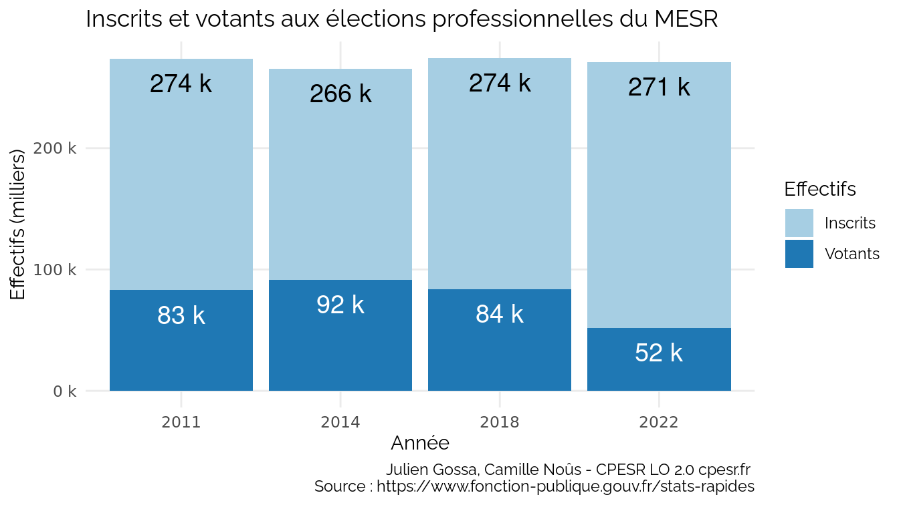

Elections pros
================

## taux de participation

    ## Warning: Using `size` aesthetic for lines was deprecated in ggplot2 3.4.0.
    ## ℹ Please use `linewidth` instead.

## Participants

## Votants

