Immobilier
================

Source :
<https://data.enseignementsup-recherche.gouv.fr/explore/dataset/fr-esr-patrimoine-immobilier-des-operateurs-de-l-enseignement-superieur/>

    ##  [1] "Année"                    "Etablissement"           
    ##  [3] "Multi.occupation"         "Code.Site"               
    ##  [5] "Code.bât.ter"             "Libellé.bât.ter"         
    ##  [7] "GA"                       "Paysage_id"              
    ##  [9] "Id.interne"               "Ref..parcelle"           
    ## [11] "Etat.santé"               "SUB"                     
    ## [13] "SDP"                      "Type.bât."               
    ## [15] "Domaine.bat."             "Propriétaire.bat."       
    ## [17] "Réglementation.générale"  "Catégorie.ERP"           
    ## [19] "Type.ERP"                 "Class..Monument.histo."  
    ## [21] "Etat.access."             "Access..AdAP"            
    ## [23] "Access..date"             "Access..dérog."          
    ## [25] "Energie.class."           "Energie.valeur"          
    ## [27] "GES"                      "GES.valeur"              
    ## [29] "Audit.energie"            "Audit.energie.date"      
    ## [31] "Audit.energie.prog."      "Audit.energie.prog..date"
    ## [33] "Bilan.carbone"            "Bilan.carbone.date"      
    ## [35] "Bilan.carbone.prog."      "Bilan.carbone.prog..date"
    ## [37] "Site.géo."                "latlong"                 
    ## [39] "Adresse"                  "CP"                      
    ## [41] "Ville"                    "Pays"                    
    ## [43] "COM_CODE"                 "COM_NOM"                 
    ## [45] "UUCR_ID"                  "UUCR_NOM"                
    ## [47] "DEP_ID"                   "DEP_NOM"                 
    ## [49] "ACA_ID"                   "ACA_NOM"                 
    ## [51] "REG_ID"                   "REG_NOM"                 
    ## [53] "date_extract"

    ## `summarise()` has grouped output by 'Année'. You can override using the
    ## `.groups` argument.

    ## Warning: Using `size` aesthetic for lines was deprecated in ggplot2 3.4.0.
    ## ℹ Please use `linewidth` instead.
    ## This warning is displayed once every 8 hours.
    ## Call `lifecycle::last_lifecycle_warnings()` to see where this warning was
    ## generated.

## Etat.santé

<!-- --><!-- -->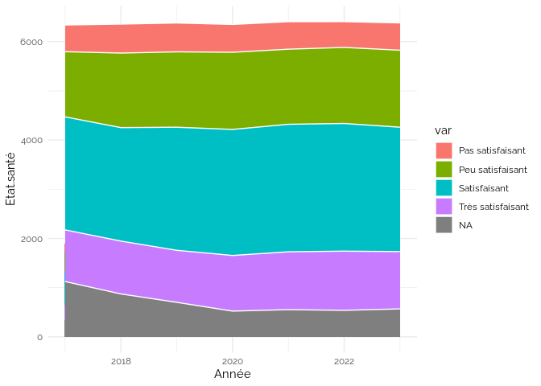<!-- -->

    ## `summarise()` has grouped output by 'Année'. You can override using the
    ## `.groups` argument.

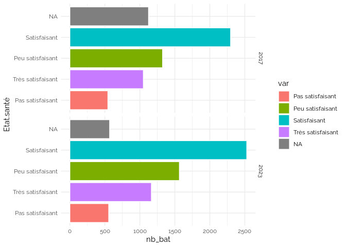<!-- -->

## Type.bât.

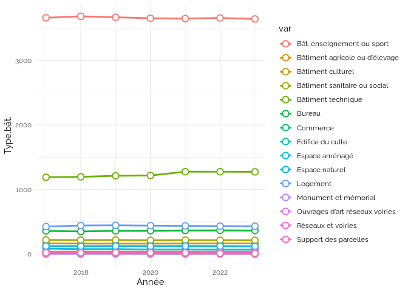<!-- --><!-- -->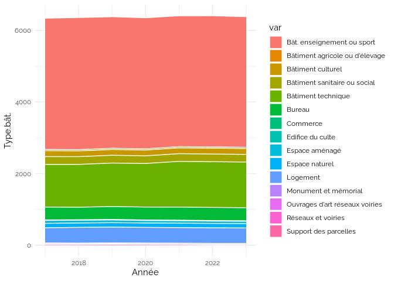<!-- -->

    ## `summarise()` has grouped output by 'Année'. You can override using the
    ## `.groups` argument.

<!-- -->

## Domaine.bat.

<!-- -->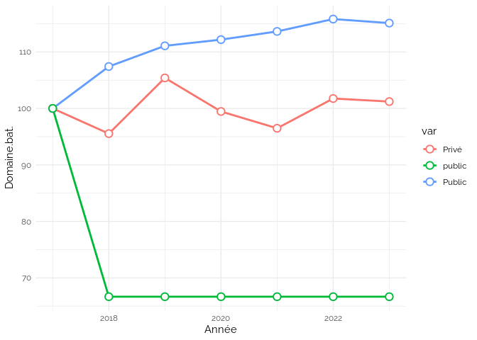<!-- --><!-- -->

    ## `summarise()` has grouped output by 'Année'. You can override using the
    ## `.groups` argument.

<!-- -->

## Propriétaire.bat.

<!-- --><!-- --><!-- -->

    ## `summarise()` has grouped output by 'Année'. You can override using the
    ## `.groups` argument.

<!-- -->

## Réglementation.générale

<!-- --><!-- --><!-- -->

    ## `summarise()` has grouped output by 'Année'. You can override using the
    ## `.groups` argument.

<!-- -->

## Catégorie.ERP

<!-- --><!-- --><!-- -->

    ## `summarise()` has grouped output by 'Année'. You can override using the
    ## `.groups` argument.

<!-- -->

## Type.ERP

<!-- -->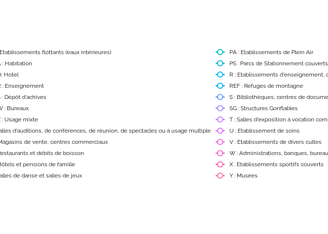<!-- --><!-- -->

    ## `summarise()` has grouped output by 'Année'. You can override using the
    ## `.groups` argument.

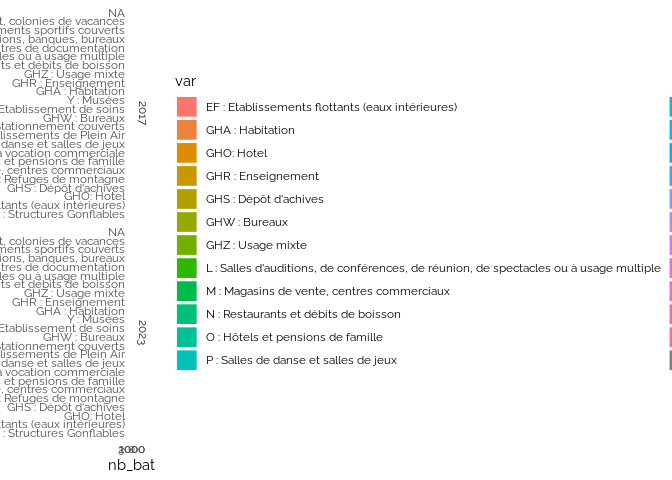<!-- -->

## Class..Monument.histo.

<!-- -->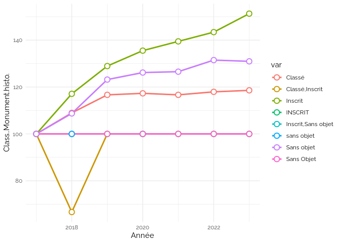<!-- --><!-- -->

    ## `summarise()` has grouped output by 'Année'. You can override using the
    ## `.groups` argument.

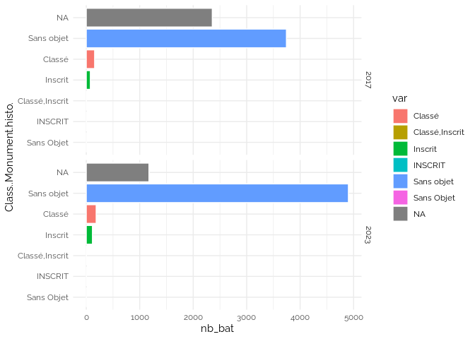<!-- -->

## Etat.access.

<!-- --><!-- --><!-- -->

    ## `summarise()` has grouped output by 'Année'. You can override using the
    ## `.groups` argument.

<!-- -->

## Access..AdAP

<!-- -->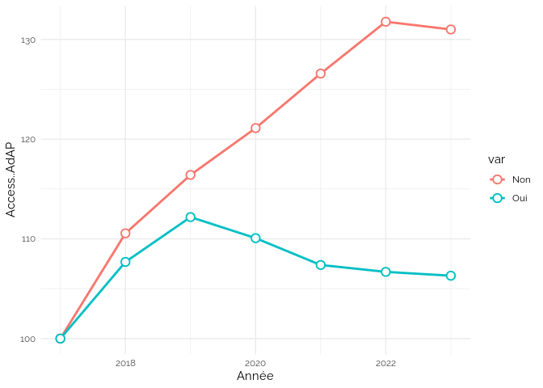<!-- -->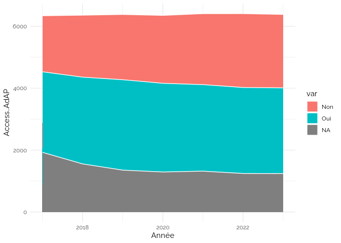<!-- -->

    ## `summarise()` has grouped output by 'Année'. You can override using the
    ## `.groups` argument.

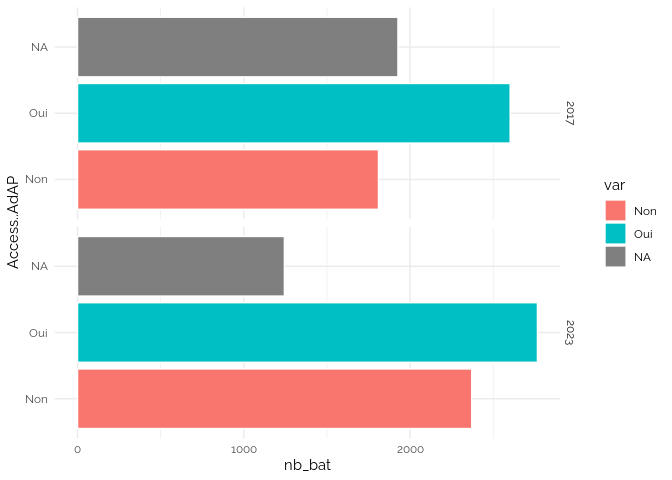<!-- -->

## Access..dérog.

<!-- --><!-- --><!-- -->

    ## `summarise()` has grouped output by 'Année'. You can override using the
    ## `.groups` argument.

<!-- -->

## Energie.class.

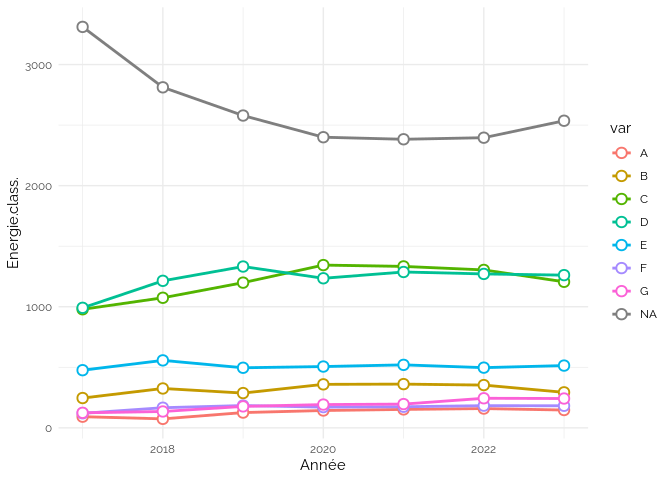<!-- --><!-- --><!-- -->

    ## `summarise()` has grouped output by 'Année'. You can override using the
    ## `.groups` argument.

<!-- -->

## GES

<!-- --><!-- -->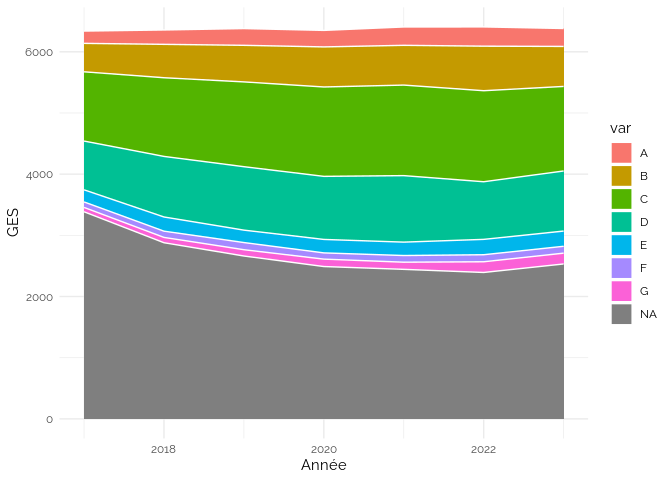<!-- -->

    ## `summarise()` has grouped output by 'Année'. You can override using the
    ## `.groups` argument.

<!-- -->

## Audit.energie

<!-- --><!-- -->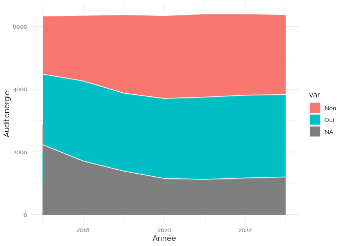<!-- -->

    ## `summarise()` has grouped output by 'Année'. You can override using the
    ## `.groups` argument.

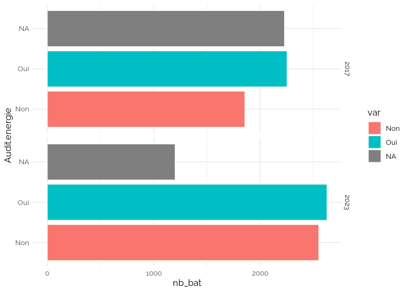<!-- -->

## Bilan.carbone

<!-- --><!-- --><!-- -->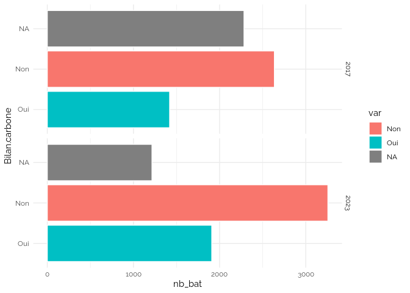<!-- -->

## Classement GES

    ## Warning: remplacement de l'importation précédente 'ggthemes::theme_map' par
    ## 'cowplot::theme_map' lors du chargement de 'kpiESR'

    ## `summarise()` has grouped output by 'etab'. You can override using the
    ## `.groups` argument.

<!-- -->

## Propriétaires

<!-- -->

<!-- -->

En 2017

| Année | Type.bât.                    | Domaine.bat. |  nb |
|------:|:-----------------------------|:-------------|----:|
|  2017 | Bât. enseignement ou sport   | Public       | 333 |
|  2017 | Bâtiment technique           | Public       |  76 |
|  2017 | Bât. enseignement ou sport   | Privé        |  53 |
|  2017 | Logement                     | Public       |  39 |
|  2017 | Bureau                       | Public       |  24 |
|  2017 | Bâtiment technique           | Privé        |  14 |
|  2017 | Bureau                       | Privé        |  13 |
|  2017 | Bâtiment sanitaire ou social | Public       |  11 |
|  2017 | Logement                     | Privé        |   8 |
|  2017 | Bâtiment culturel            | Public       |   7 |
|  2017 | Bât. enseignement ou sport   | NA           |   6 |
|  2017 | Espace naturel               | Privé        |   5 |
|  2017 | Espace aménagé               | Public       |   3 |
|  2017 | Bâtiment sanitaire ou social | Privé        |   2 |
|  2017 | Logement                     | NA           |   2 |
|  2017 | Bâtiment culturel            | Privé        |   2 |
|  2017 | Espace naturel               | Public       |   2 |
|  2017 | Commerce                     | Privé        |   2 |
|  2017 | Commerce                     | Public       |   1 |

Nouveaux après 2017

| Type.bât.                      | Domaine.bat. |  nb |
|:-------------------------------|:-------------|----:|
| Bât. enseignement ou sport     | Public       | 209 |
| Bâtiment technique             | Public       |  72 |
| Bât. enseignement ou sport     | Privé        |  44 |
| Logement                       | Public       |  25 |
| Bâtiment sanitaire ou social   | Public       |  13 |
| Bureau                         | Public       |  12 |
| Bureau                         | Privé        |   9 |
| Ouvrages d’art réseaux voiries | Public       |   7 |
| Bâtiment technique             | Privé        |   6 |
| Bâtiment culturel              | Public       |   5 |
| Bâtiment sanitaire ou social   | Privé        |   4 |
| Commerce                       | Privé        |   2 |
| Espace naturel                 | Public       |   2 |
| Espace aménagé                 | Public       |   1 |
| Logement                       | Privé        |   1 |
| Espace aménagé                 | Privé        |   1 |
| Bât. enseignement ou sport     | NA           |   1 |

