Immobilier
================

    ##  [1] "Année"                    "Etablissement"           
    ##  [3] "Multi.occupation"         "Code.Site"               
    ##  [5] "Code.bât.ter"             "Libellé.bât.ter"         
    ##  [7] "GA"                       "Paysage_id"              
    ##  [9] "Id.interne"               "Ref..parcelle"           
    ## [11] "Etat.santé"               "Type.bât."               
    ## [13] "Domaine.bat."             "Propriétaire.bat."       
    ## [15] "Réglementation.générale"  "Catégorie.ERP"           
    ## [17] "Type.ERP"                 "Class..Monument.histo."  
    ## [19] "Etat.access."             "Access..AdAP"            
    ## [21] "Access..date"             "Access..dérog."          
    ## [23] "Energie.class."           "Energie.valeur"          
    ## [25] "GES"                      "GES.valeur"              
    ## [27] "Audit.energie"            "Audit.energie.date"      
    ## [29] "Audit.energie.prog."      "Audit.energie.prog..date"
    ## [31] "Bilan.carbone"            "Bilan.carbone.date"      
    ## [33] "Bilan.carbone.prog."      "Bilan.carbone.prog..date"
    ## [35] "Site.géo."                "latlong"                 
    ## [37] "Adresse"                  "CP"                      
    ## [39] "Ville"                    "Pays"                    
    ## [41] "COM_CODE"                 "COM_NOM"                 
    ## [43] "UUCR_ID"                  "UUCR_NOM"                
    ## [45] "DEP_ID"                   "DEP_NOM"                 
    ## [47] "ACA_ID"                   "ACA_NOM"                 
    ## [49] "REG_ID"                   "REG_NOM"                 
    ## [51] "date_extract"

    ## `summarise()` has grouped output by 'Année'. You can override using the
    ## `.groups` argument.

## Etat.santé

<!-- -->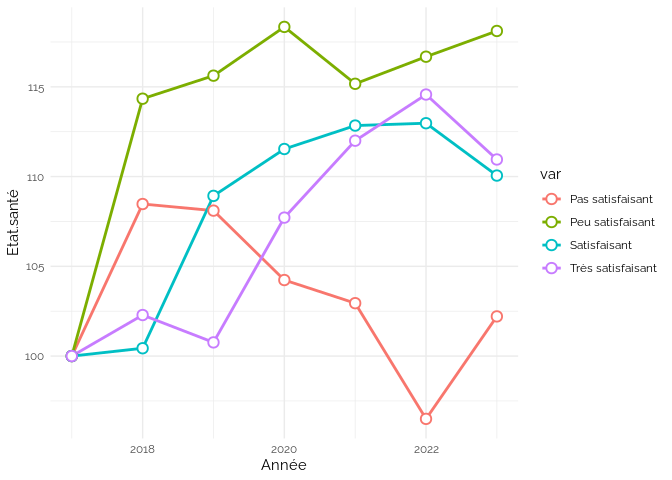<!-- --><!-- -->

    ## `summarise()` has grouped output by 'Année'. You can override using the
    ## `.groups` argument.

<!-- -->

## Type.bât.

<!-- --><!-- --><!-- -->

    ## `summarise()` has grouped output by 'Année'. You can override using the
    ## `.groups` argument.

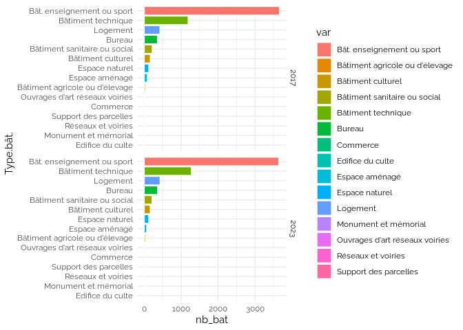<!-- -->

## Domaine.bat.

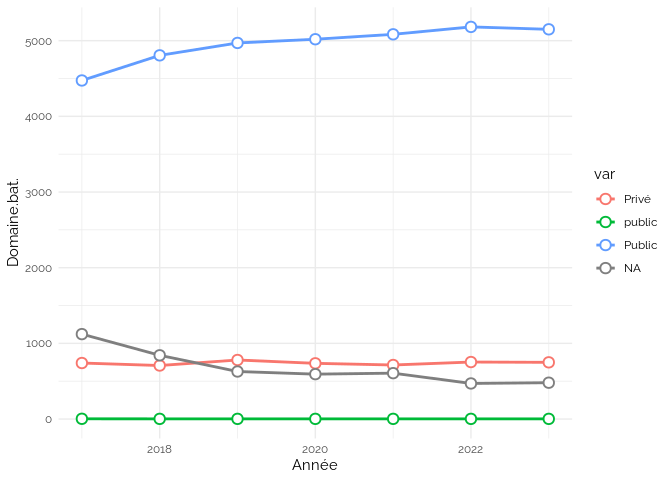<!-- --><!-- --><!-- -->

    ## `summarise()` has grouped output by 'Année'. You can override using the
    ## `.groups` argument.

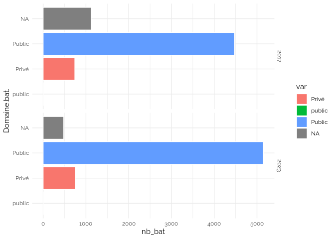<!-- -->

## Propriétaire.bat.

<!-- -->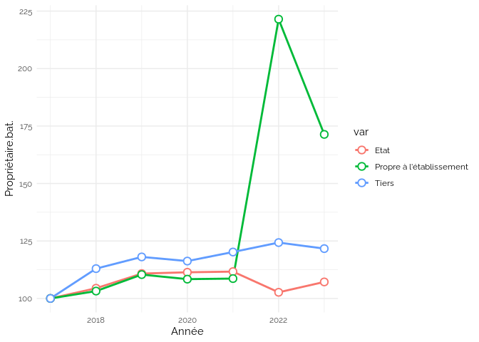<!-- --><!-- -->

    ## `summarise()` has grouped output by 'Année'. You can override using the
    ## `.groups` argument.

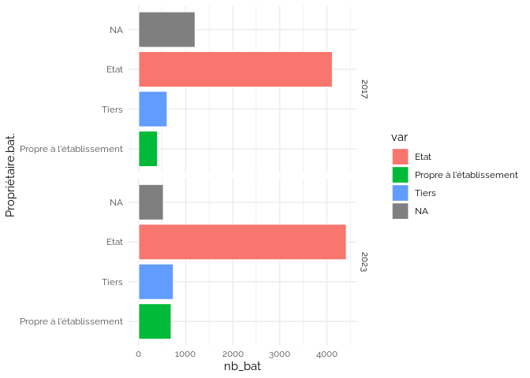<!-- -->

## Réglementation.générale

<!-- -->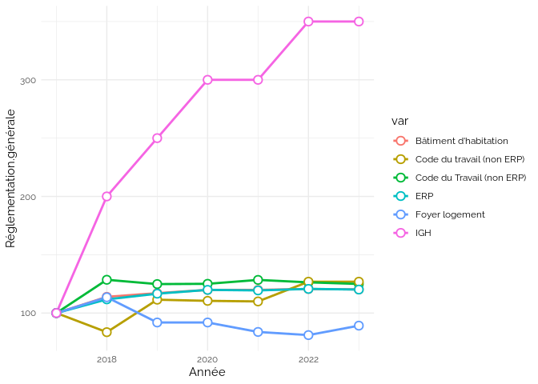<!-- --><!-- -->

    ## `summarise()` has grouped output by 'Année'. You can override using the
    ## `.groups` argument.

<!-- -->

## Catégorie.ERP

<!-- --><!-- -->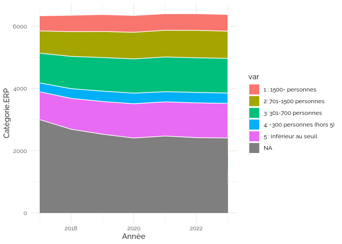<!-- -->

    ## `summarise()` has grouped output by 'Année'. You can override using the
    ## `.groups` argument.

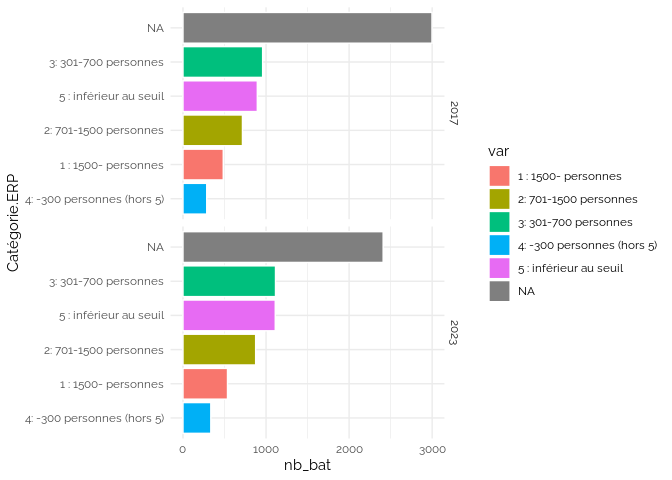<!-- -->

## Type.ERP

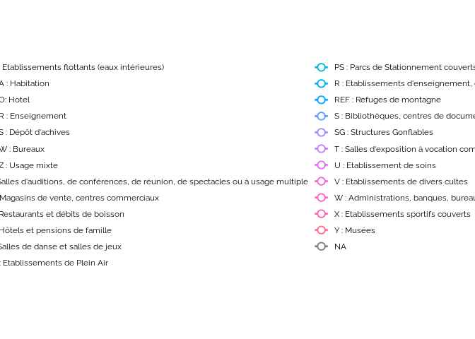<!-- --><!-- --><!-- -->

    ## `summarise()` has grouped output by 'Année'. You can override using the
    ## `.groups` argument.

<!-- -->

## Class..Monument.histo.

<!-- --><!-- --><!-- -->

    ## `summarise()` has grouped output by 'Année'. You can override using the
    ## `.groups` argument.

<!-- -->

## Etat.access.

<!-- --><!-- --><!-- -->

    ## `summarise()` has grouped output by 'Année'. You can override using the
    ## `.groups` argument.

<!-- -->

## Access..AdAP

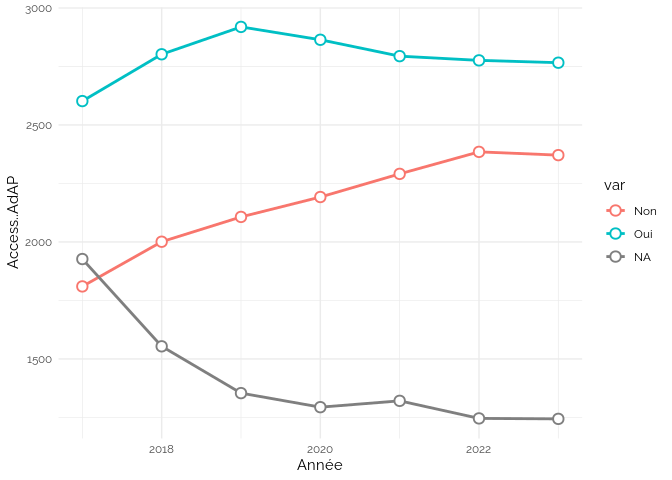<!-- --><!-- --><!-- -->

    ## `summarise()` has grouped output by 'Année'. You can override using the
    ## `.groups` argument.

<!-- -->

## Access..dérog.

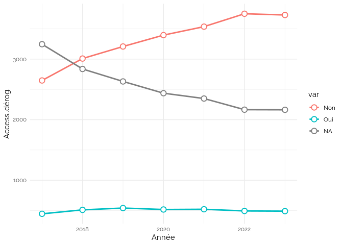<!-- -->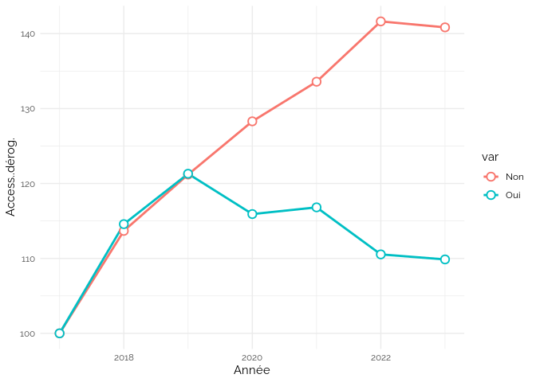<!-- --><!-- -->

    ## `summarise()` has grouped output by 'Année'. You can override using the
    ## `.groups` argument.

<!-- -->

## Energie.class.

<!-- --><!-- --><!-- -->

    ## `summarise()` has grouped output by 'Année'. You can override using the
    ## `.groups` argument.

<!-- -->

## GES

<!-- -->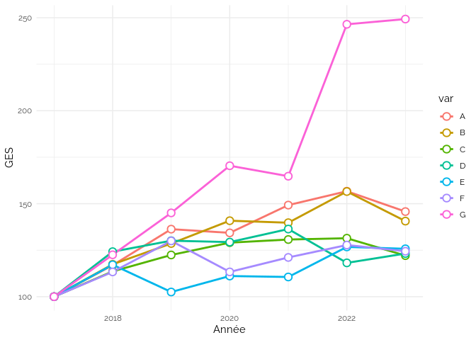<!-- --><!-- -->

    ## `summarise()` has grouped output by 'Année'. You can override using the
    ## `.groups` argument.

<!-- -->

## Audit.energie

<!-- --><!-- --><!-- -->

    ## `summarise()` has grouped output by 'Année'. You can override using the
    ## `.groups` argument.

<!-- -->

## Bilan.carbone

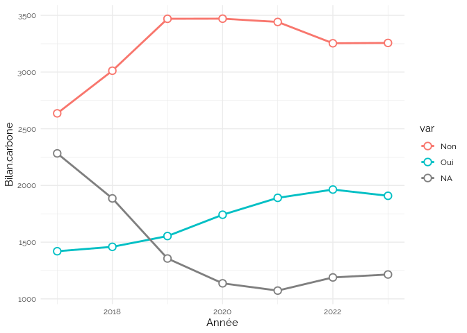<!-- -->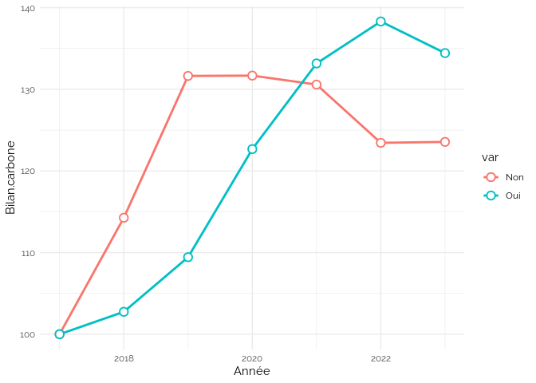<!-- -->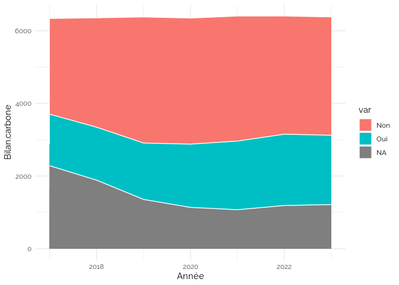<!-- --><!-- -->
