CPESR
================
CPESR
2023-11-20

## Données

- <https://data.enseignementsup-recherche.gouv.fr/explore/dataset/fr-esr-insertion_professionnelle-master>
- <https://data.enseignementsup-recherche.gouv.fr/explore/dataset/fr-esr-insertion_professionnelle-master_donnees_nationales>

Note : l’absence de Discipline “Ensemble Lettres, langues, arts” est
pénible à gérer

- Taux d’insertion = diplômé en emploi / diplômés sur le marché du
  travail (emploi + chômage, ou taux d’emploi *net*)
- Taux d’emploi = diplômés en emploi / diplômés
- Taux d’emploi salarié en France = diplômés en emploi seulement salarié
  en France / diplômés

Les données sont : diplômés de Masters hors MEEF de la session 2020, à
30 mois.

## Taux d’insertion par domaine

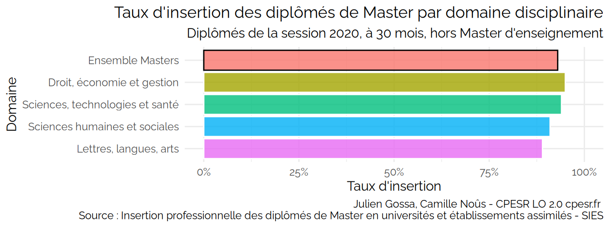

## Taux d’insertion par discipline

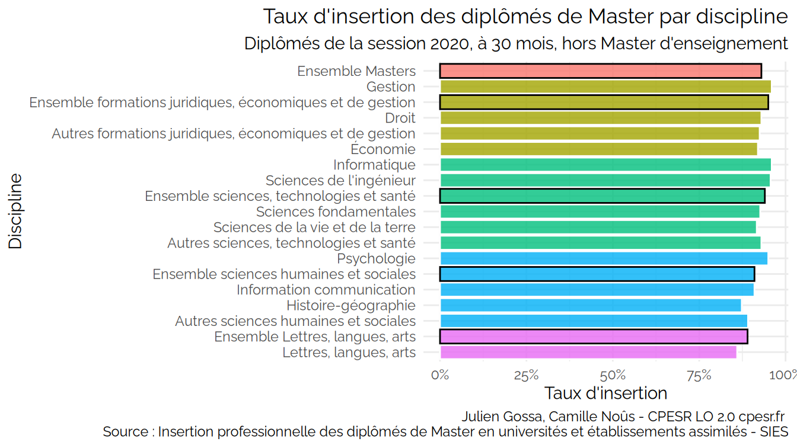
Attention : les valeurs sont une moyenne imparfaite.

## Taux d’insertion par secteur disciplinaire

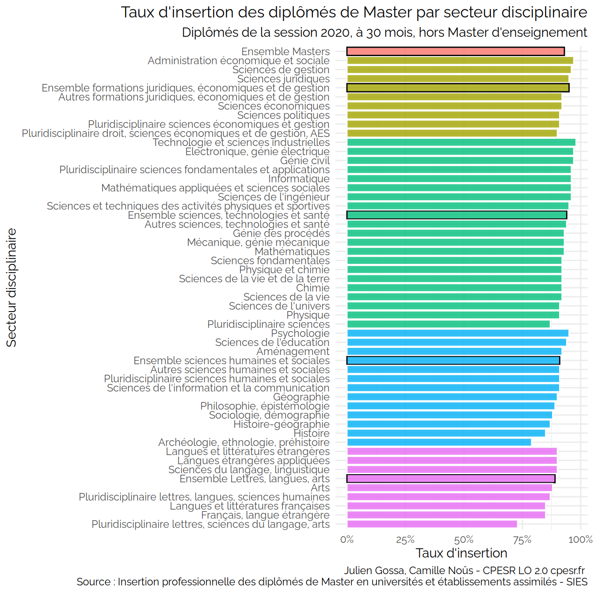

## Différents taux domaine

## Comparaison des différents taux par secteur disciplinaire

    ## Warning: Using `size` aesthetic for lines was deprecated in ggplot2 3.4.0.
    ## ℹ Please use `linewidth` instead.
    ## This warning is displayed once every 8 hours.
    ## Call `lifecycle::last_lifecycle_warnings()` to see where this warning was
    ## generated.

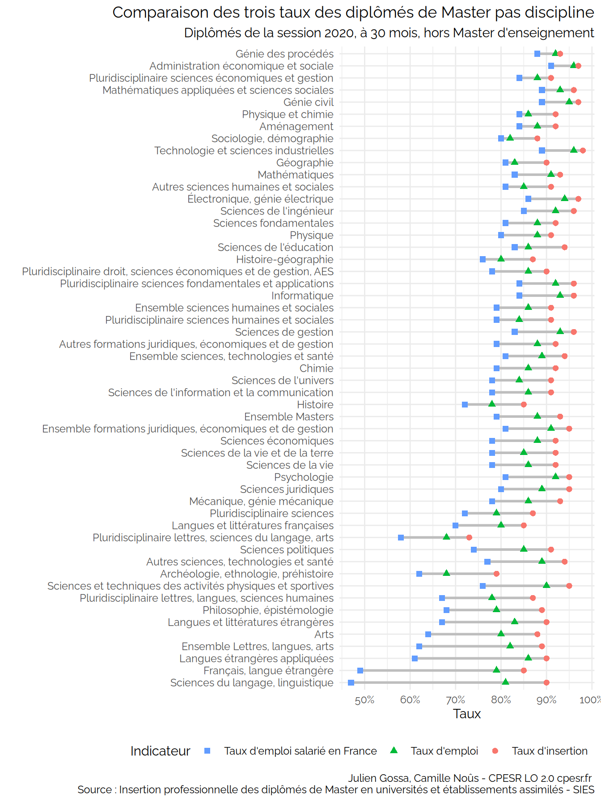

## Comparaison des différents taux par établissement (tri par différence)

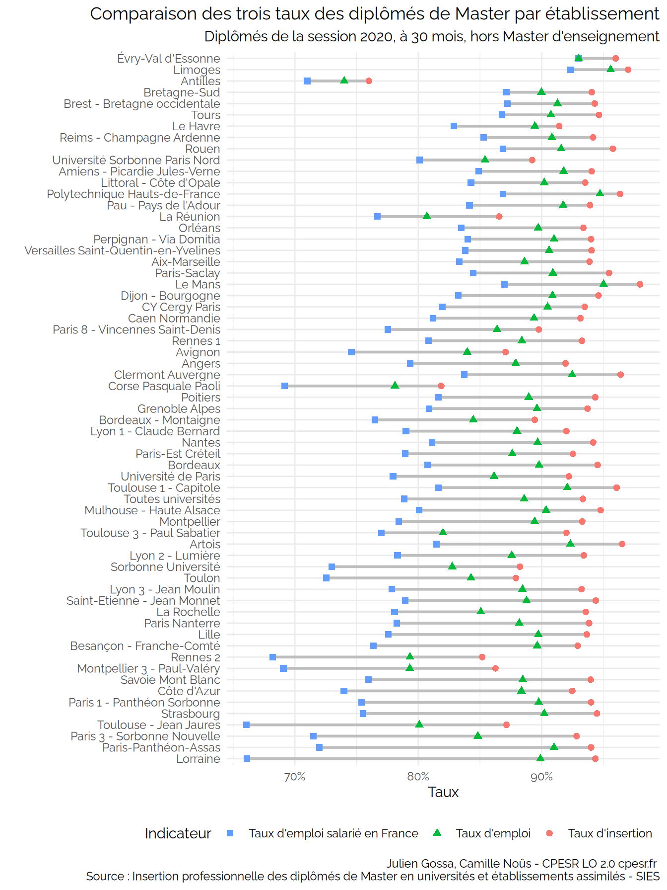

## Comparaison des différents taux par établissement (tri par taux d’insertion)

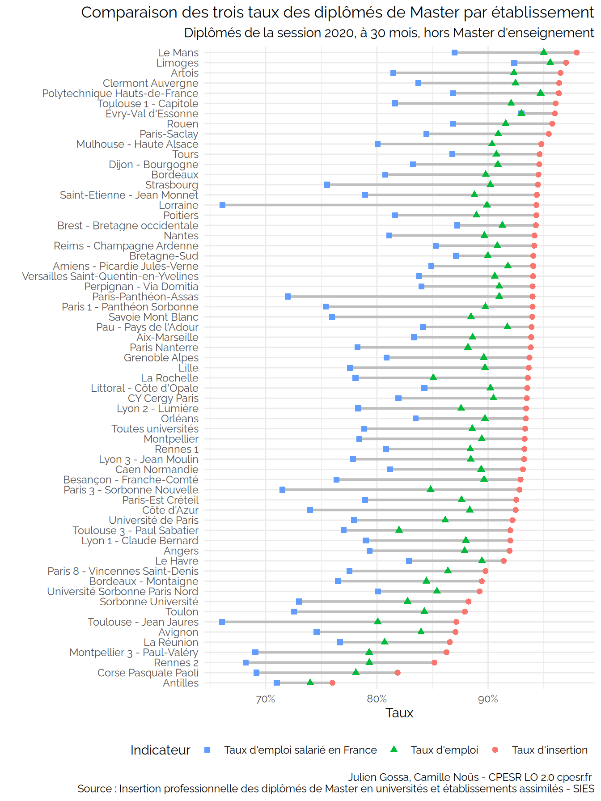

## Comparaison des différents taux par établissement (tri par taux d’emploi salarié en France)

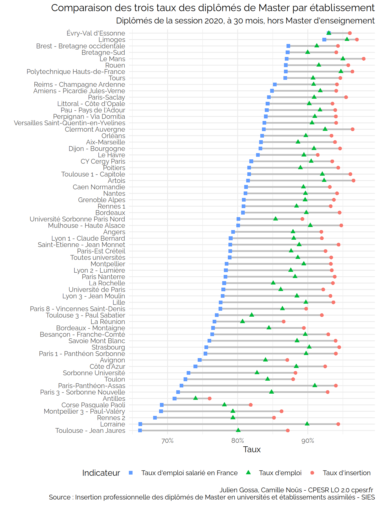

## Comparaison différence \[Taux d’emploi salarié en France - Taux d’insertion\] et \[Taux d’emplois extérieurs à la région\]

Attention : Le Taux emplois extérieur à la région est peut-être calculé
sur le taux d’emploi salarié en France

    ## Warning: Removed 1 rows containing missing values (`geom_point()`).

    ## Warning: Removed 1 rows containing missing values (`geom_text_repel()`).

    ## Warning: ggrepel: 6 unlabeled data points (too many overlaps). Consider
    ## increasing max.overlaps

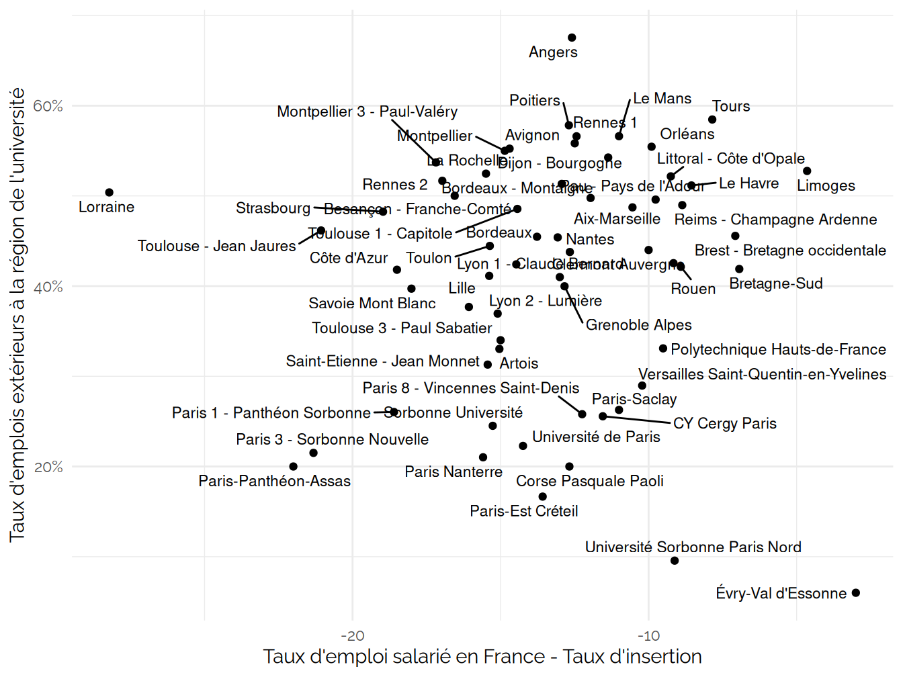

    ## Warning: Removed 8 rows containing missing values (`geom_point()`).

    ## Warning: Removed 8 rows containing missing values (`geom_text_repel()`).

    ## Warning: ggrepel: 21 unlabeled data points (too many overlaps). Consider
    ## increasing max.overlaps

    ## Warning: ggrepel: 9 unlabeled data points (too many overlaps). Consider
    ## increasing max.overlaps

    ## Warning: ggrepel: 6 unlabeled data points (too many overlaps). Consider
    ## increasing max.overlaps

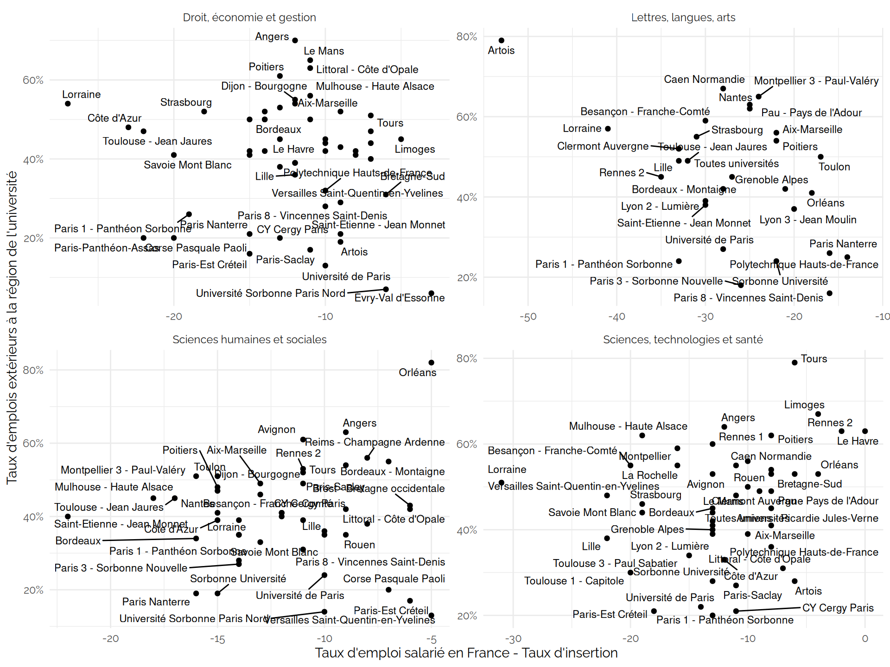

## Comparaison des taux par établissement et domaine

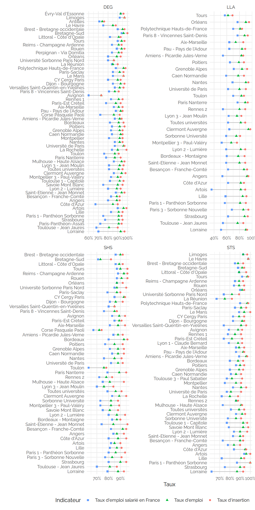

## Université de Lorraine

    ## Scale for colour is already present.
    ## Adding another scale for colour, which will replace the existing scale.
    ## Scale for shape is already present.
    ## Adding another scale for shape, which will replace the existing scale.

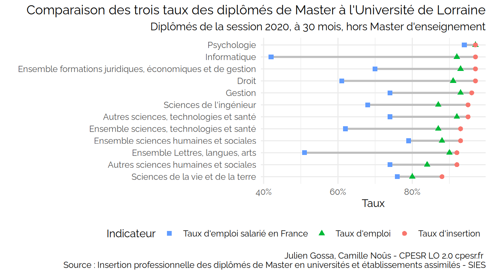

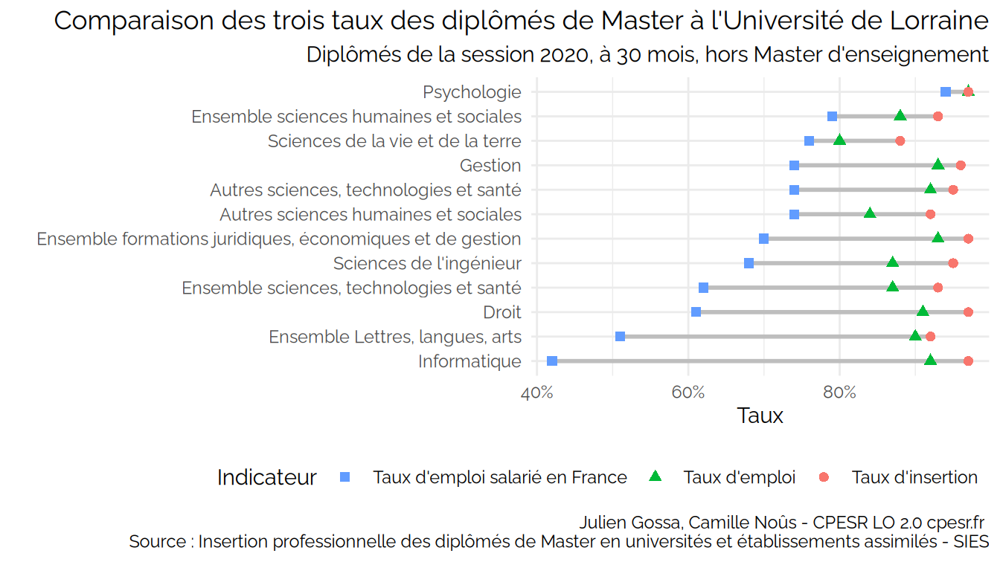
