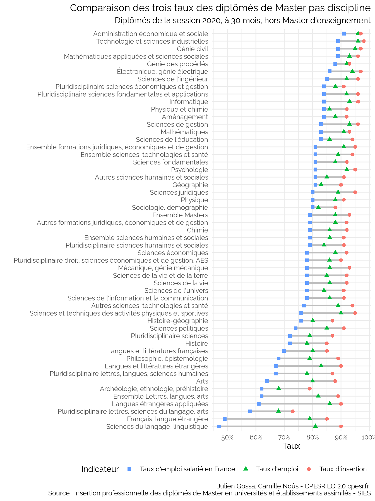
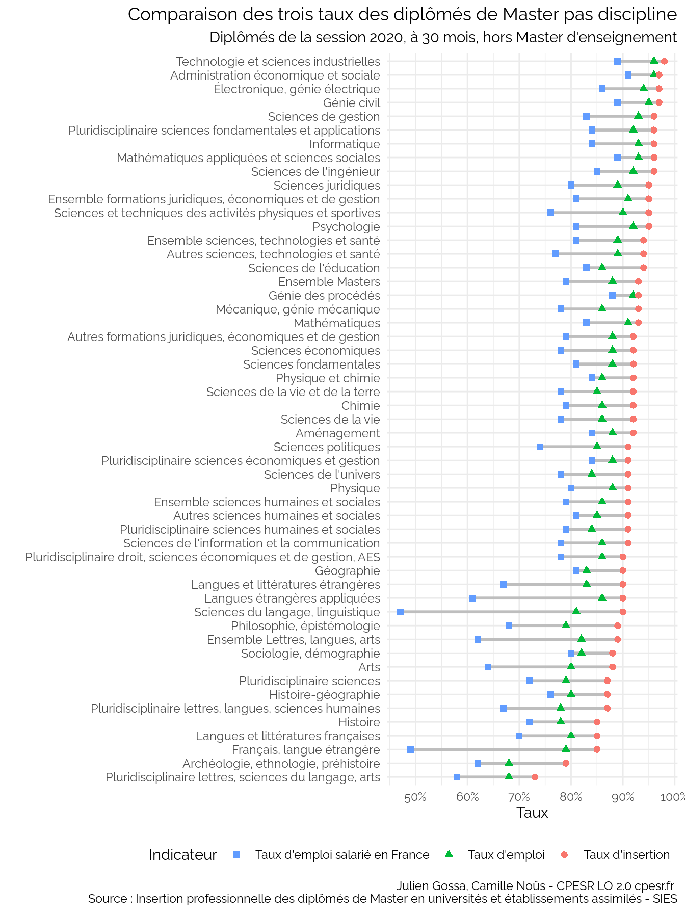
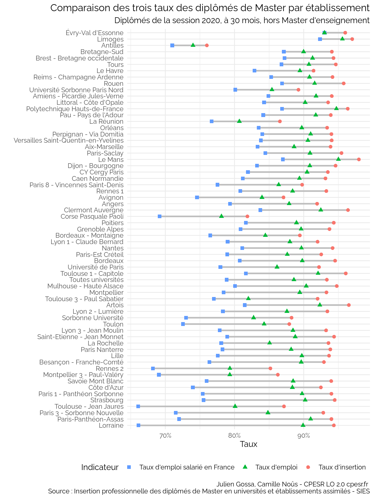
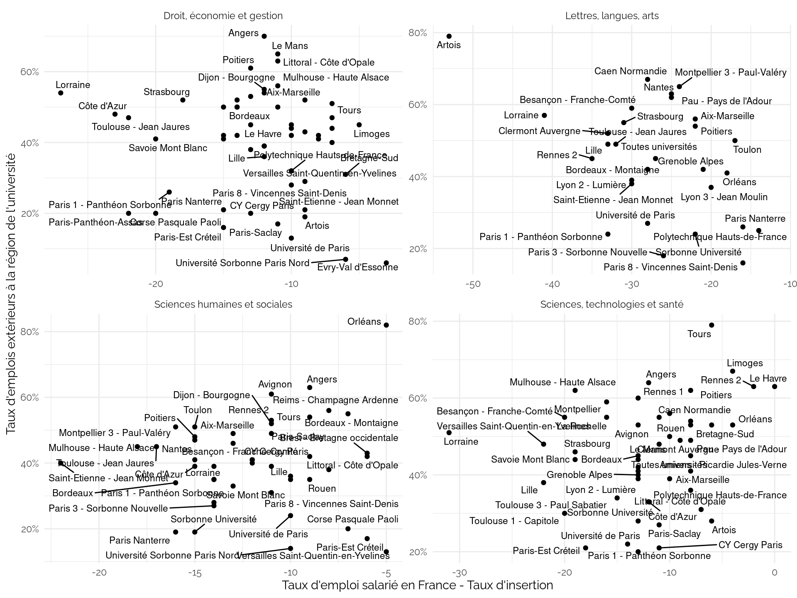
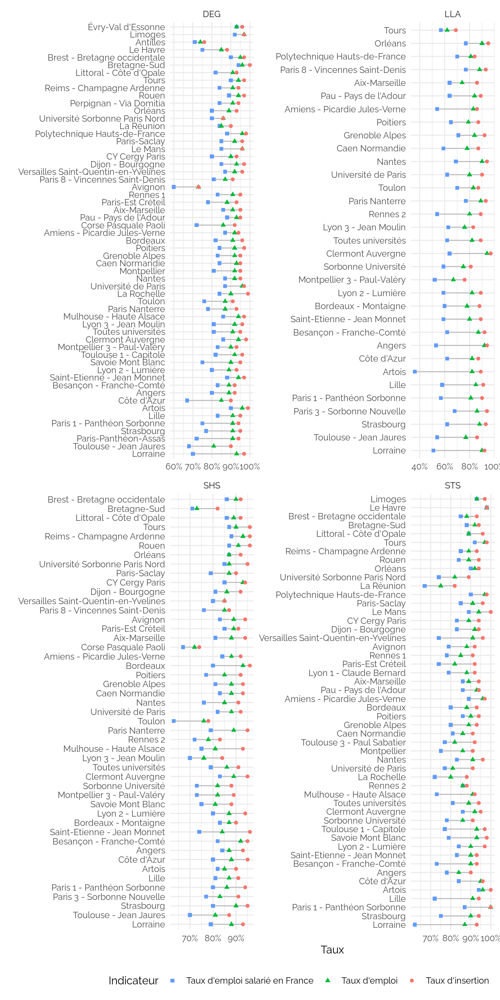

CPESR
================
CPESR
2024-06-06

## Données

- <https://data.enseignementsup-recherche.gouv.fr/explore/dataset/fr-esr-insertion_professionnelle-master>
- <https://data.enseignementsup-recherche.gouv.fr/explore/dataset/fr-esr-insertion_professionnelle-master_donnees_nationales>

Note : l’absence de Discipline “Ensemble Lettres, langues, arts” est
pénible à gérer

- Taux d’insertion = diplômé en emploi / diplômés sur le marché du
  travail (emploi + chômage, ou taux d’emploi *net*)
- Taux d’emploi = diplômés en emploi / diplômés
- Taux d’emploi salarié en France = diplômés en emploi seulement salarié
  en France / diplômés

Les données sont : diplômés de Masters hors MEEF de la session 2020, à
30 mois.

## Taux d’insertion par domaine

## Taux d’insertion par discipline

Attention : les valeurs sont une moyenne imparfaite.

## Taux d’insertion par secteur disciplinaire

## Différents taux domaine

## Comparaison des différents taux par secteur disciplinaire

    ## Warning: Using `size` aesthetic for lines was deprecated in ggplot2 3.4.0.
    ## ℹ Please use `linewidth` instead.
    ## This warning is displayed once every 8 hours.
    ## Call `lifecycle::last_lifecycle_warnings()` to see where this warning was
    ## generated.

## Comparaison des différents taux par établissement (tri par différence)

## Comparaison des différents taux par établissement (tri par taux d’insertion)

## Comparaison des différents taux par établissement (tri par taux d’emploi salarié en France)

## Comparaison différence \[Taux d’emploi salarié en France - Taux d’insertion\] et \[Taux d’emplois extérieurs à la région\]

Attention : Le Taux emplois extérieur à la région est peut-être calculé
sur le taux d’emploi salarié en France

    ## Warning: Removed 1 row containing missing values or values outside the scale range
    ## (`geom_point()`).

    ## Warning: Removed 1 row containing missing values or values outside the scale range
    ## (`geom_text_repel()`).

    ## Warning: ggrepel: 6 unlabeled data points (too many overlaps). Consider
    ## increasing max.overlaps

    ## Warning: Removed 8 rows containing missing values or values outside the scale range
    ## (`geom_point()`).

    ## Warning: Removed 8 rows containing missing values or values outside the scale range
    ## (`geom_text_repel()`).

    ## Warning: ggrepel: 21 unlabeled data points (too many overlaps). Consider
    ## increasing max.overlaps

    ## Warning: ggrepel: 9 unlabeled data points (too many overlaps). Consider
    ## increasing max.overlaps

    ## Warning: ggrepel: 6 unlabeled data points (too many overlaps). Consider
    ## increasing max.overlaps

## Comparaison des taux par établissement et domaine

## Université de Lorraine

    ## Scale for colour is already present.
    ## Adding another scale for colour, which will replace the existing scale.
    ## Scale for shape is already present.
    ## Adding another scale for shape, which will replace the existing scale.

## Dispersion

## IP vs socio

    ## Warning: Using an external vector in selections was deprecated in tidyselect 1.1.0.
    ## ℹ Please use `all_of()` or `any_of()` instead.
    ##   # Was:
    ##   data %>% select(variable)
    ## 
    ##   # Now:
    ##   data %>% select(all_of(variable))
    ## 
    ## See <https://tidyselect.r-lib.org/reference/faq-external-vector.html>.
    ## This warning is displayed once every 8 hours.
    ## Call `lifecycle::last_lifecycle_warnings()` to see where this warning was
    ## generated.

    ## Joining with `by = join_by(Secteur.disciplinaire)`
    ## Joining with `by = join_by(Secteur.disciplinaire)`

    ## 
    ## 

    ##   
 ipmn miss 

    ## 
    ## 
    ## 
    ## |Secteur.disciplinaire                                   |
    ## |:-------------------------------------------------------|
    ## |Ensemble sciences, technologies et santé                |
    ## |Autres formations juridiques, économiques et de gestion |
    ## |Ensemble Lettres, langues, arts                         |
    ## |Ensemble sciences humaines et sociales                  |
    ## |Histoire-géographie                                     |
    ## |Autres sciences humaines et sociales                    |
    ## 
    ## 
    ## 

    ## `geom_smooth()` using formula = 'y ~ x'

    ## Warning: Removed 17 rows containing non-finite outside the scale range
    ## (`stat_smooth()`).

    ## Warning: Removed 17 rows containing missing values or values outside the scale range
    ## (`geom_point()`).

    ## Warning: Removed 17 rows containing missing values or values outside the scale range
    ## (`geom_text_repel()`).

    ## Warning: ggrepel: 7 unlabeled data points (too many overlaps). Consider
    ## increasing max.overlaps

    ## `geom_smooth()` using formula = 'y ~ x'

    ## Warning: Removed 51 rows containing non-finite outside the scale range
    ## (`stat_smooth()`).

    ## Warning: Removed 51 rows containing missing values or values outside the scale range
    ## (`geom_point()`).

    ## `geom_smooth()` using formula = 'y ~ x'

    ## Warning: Removed 17 rows containing non-finite outside the scale range
    ## (`stat_smooth()`).

    ## Warning: Removed 17 rows containing missing values or values outside the scale range
    ## (`geom_point()`).

    ## Warning: Removed 17 rows containing missing values or values outside the scale range
    ## (`geom_text_repel()`).

    ## Warning: ggrepel: 9 unlabeled data points (too many overlaps). Consider
    ## increasing max.overlaps

    ## `geom_smooth()` using formula = 'y ~ x'

    ## Warning: Removed 51 rows containing non-finite outside the scale range
    ## (`stat_smooth()`).

    ## Warning: Removed 51 rows containing missing values or values outside the scale range
    ## (`geom_point()`).

## Taux chômage

    ## `geom_smooth()` using formula = 'y ~ x'

    ## Warning: There was 1 warning in `mutate()`.
    ## ℹ In argument: `Code = as.numeric(Code)`.
    ## Caused by warning:
    ## ! NAs introduits lors de la conversion automatique

    ## Warning: There was 1 warning in `mutate()`.
    ## ℹ In argument: `Code = as.numeric(str_sub(Code.département, 2))`.
    ## Caused by warning:
    ## ! NAs introduits lors de la conversion automatique

    ## Joining with `by = join_by(Code)`

    ## Warning in left_join(., chômage): Detected an unexpected many-to-many relationship between `x` and `y`.
    ## ℹ Row 30 of `x` matches multiple rows in `y`.
    ## ℹ Row 70 of `y` matches multiple rows in `x`.
    ## ℹ If a many-to-many relationship is expected, set `relationship =
    ##   "many-to-many"` to silence this warning.

    ## Joining with `by = join_by(pid)`

    ## Warning in left_join(., etab): Detected an unexpected many-to-many relationship between `x` and `y`.
    ## ℹ Row 43 of `x` matches multiple rows in `y`.
    ## ℹ Row 29 of `y` matches multiple rows in `x`.
    ## ℹ If a many-to-many relationship is expected, set `relationship =
    ##   "many-to-many"` to silence this warning.

    ## `geom_smooth()` using formula = 'y ~ x'

    ## Warning: Removed 24 rows containing non-finite outside the scale range
    ## (`stat_smooth()`).

    ## Warning: Removed 24 rows containing missing values or values outside the scale range
    ## (`geom_point()`).

    ## Joining with `by = join_by(pid)`

    ## Warning in left_join(., etab): Detected an unexpected many-to-many relationship between `x` and `y`.
    ## ℹ Row 43 of `x` matches multiple rows in `y`.
    ## ℹ Row 29 of `y` matches multiple rows in `x`.
    ## ℹ If a many-to-many relationship is expected, set `relationship =
    ##   "many-to-many"` to silence this warning.

    ## `geom_smooth()` using formula = 'y ~ x'

