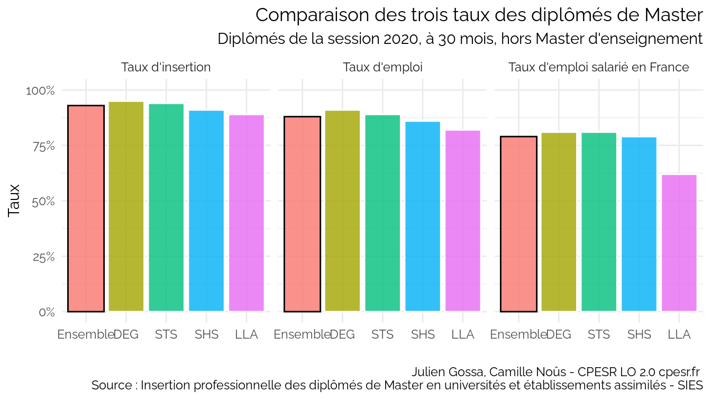
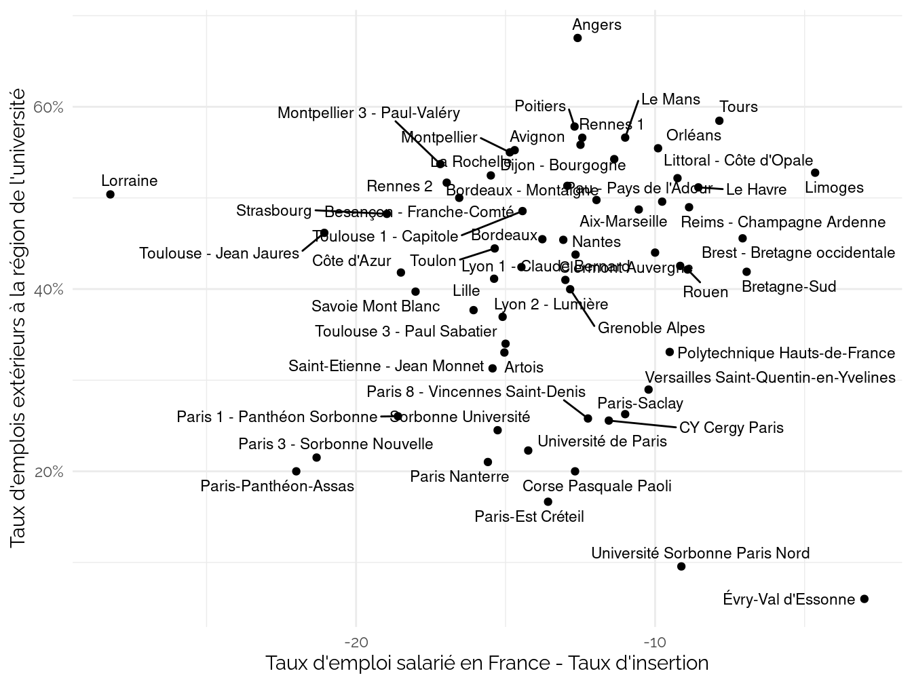

CPESR
================
CPESR
2023-11-19

## Données

- <https://data.enseignementsup-recherche.gouv.fr/explore/dataset/fr-esr-insertion_professionnelle-master>

Interprétation à vérifier :

- Taux d’insertion = diplômé en emploi / diplômés sur le marché du
  travail (emploi + chômage, ou taux d’emploi *net*)
- Taux d’emploi = diplômés en emploi / diplômés
- Taux d’emploi en France = diplômés en emploi en France / diplômés

## National

    ## Warning: Using `size` aesthetic for lines was deprecated in ggplot2 3.4.0.
    ## ℹ Please use `linewidth` instead.
    ## This warning is displayed once every 8 hours.
    ## Call `lifecycle::last_lifecycle_warnings()` to see where this warning was
    ## generated.

## Taux d’emploi salarié en France vs. Taux d’insertion pro (median, 2020, 30 mois, hors MEEF)

## Taux d’emploi salarié en France vs. Taux d’insertion pro vs. Taux d’emplois extérieur à la région (median, 2020, 30 mois, hors MEEF)

Attention : Le Taux emplois extérieur à la région est peut-être calculé
sur le taux d’emploi salarié en France

    ## Warning: Removed 1 rows containing missing values (`geom_point()`).

    ## Warning: Removed 1 rows containing missing values (`geom_text_repel()`).

    ## Warning: ggrepel: 1 unlabeled data points (too many overlaps). Consider
    ## increasing max.overlaps

## Taux d’emploi salarié en France vs. Taux d’insertion pro (median, 2020, 30 mois, hors MEEF) par domaine

## Université de Lorraine

