CPESR
================
CPESR
2024-06-10

## Données

- <https://data.enseignementsup-recherche.gouv.fr/explore/dataset/fr-esr-insertion_professionnelle-master>
- <https://data.enseignementsup-recherche.gouv.fr/explore/dataset/fr-esr-insertion_professionnelle-master_donnees_nationales>

Note : l’absence de Discipline “Ensemble Lettres, langues, arts” est
pénible à gérer

- Taux d’insertion = diplômé en emploi / diplômés sur le marché du
  travail (emploi + chômage, ou taux d’emploi *net*)
- Taux d’emploi = diplômés en emploi / diplômés
- Taux d’emploi salarié en France = diplômés en emploi seulement salarié
  en France / diplômés

Les données sont : diplômés de Masters hors MEEF de la session 2020, à
30 mois.

## Taux d’insertion par domaine

## Taux d’insertion par discipline

Attention : les valeurs sont une moyenne imparfaite.

## Taux d’insertion par secteur disciplinaire

## Différents taux domaine

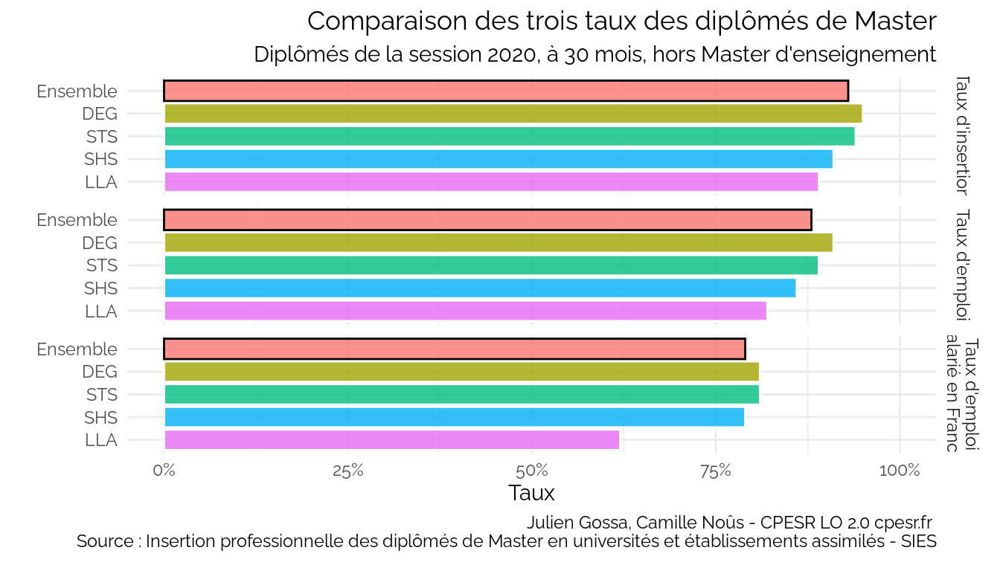

## Comparaison des différents taux par secteur disciplinaire

## Comparaison des différents taux par établissement (tri par différence)

## Comparaison des différents taux par établissement (tri par taux d’insertion)

## Comparaison des différents taux par établissement (tri par taux d’emploi salarié en France)

## Comparaison différence \[Taux d’emploi salarié en France - Taux d’insertion\] et \[Taux d’emplois extérieurs à la région\]

Attention : Le Taux emplois extérieur à la région est peut-être calculé
sur le taux d’emploi salarié en France

## Comparaison des taux par établissement et domaine

## Université de Lorraine

## Dispersion

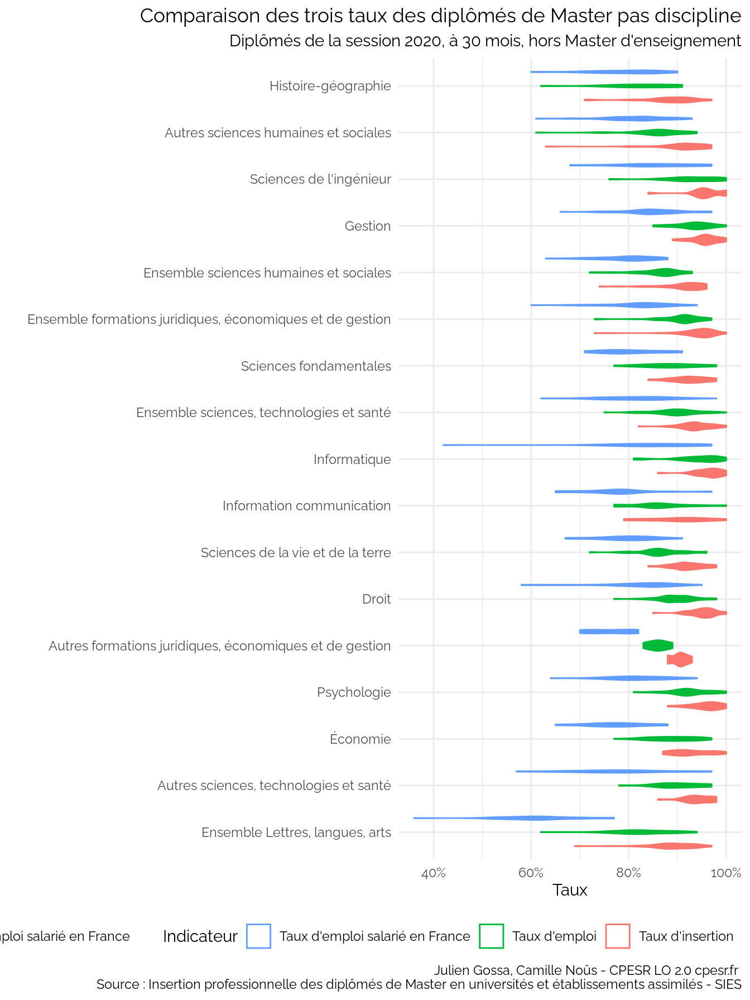

## IP vs socio

    ## 
    ## 

    ##   
 ipmn miss 

    ## 
    ## 
    ## 
    ## |Secteur.disciplinaire                                   |
    ## |:-------------------------------------------------------|
    ## |Ensemble sciences, technologies et santé                |
    ## |Autres formations juridiques, économiques et de gestion |
    ## |Ensemble Lettres, langues, arts                         |
    ## |Ensemble sciences humaines et sociales                  |
    ## |Histoire-géographie                                     |
    ## |Autres sciences humaines et sociales                    |
    ## 
    ## 
    ## 

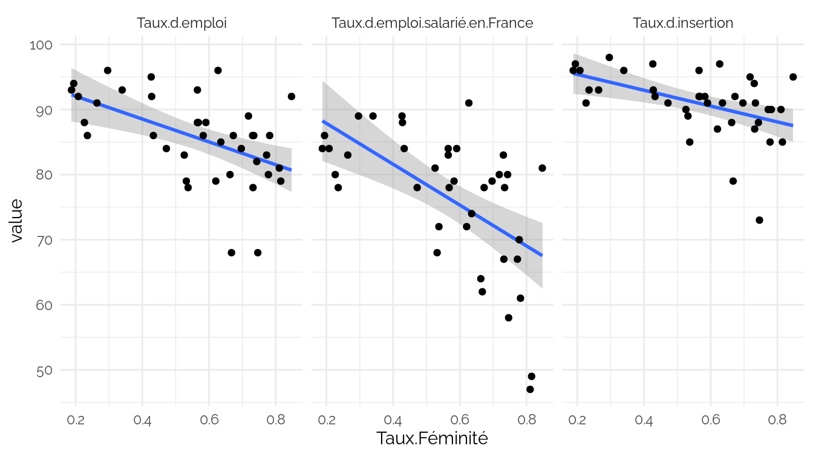

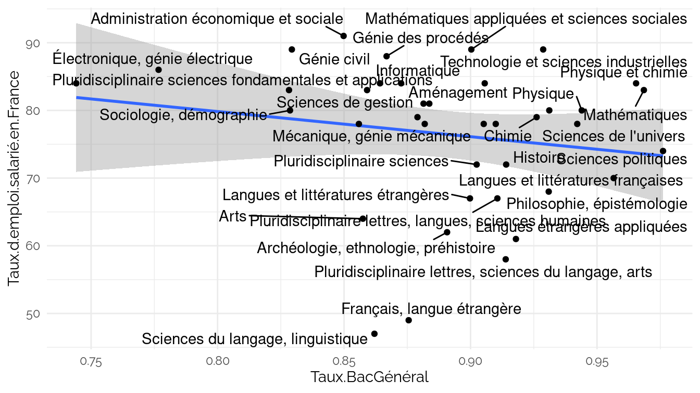

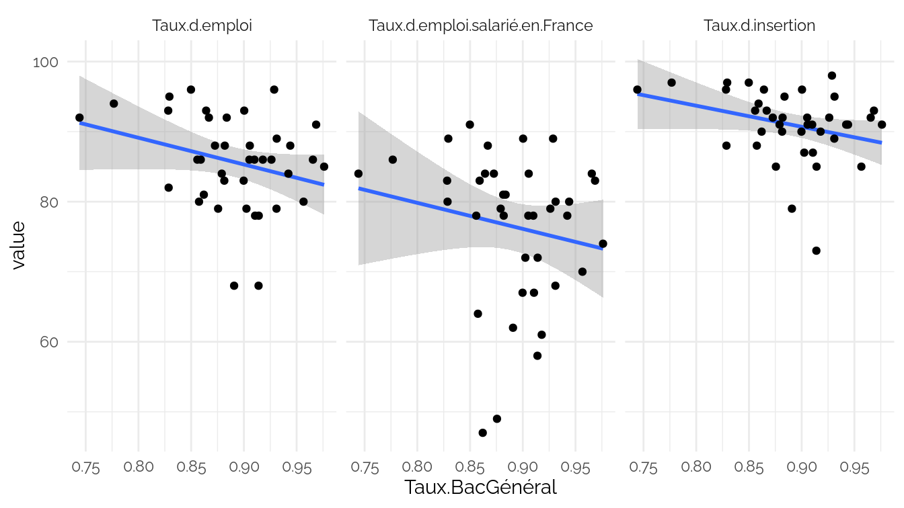

## Taux chômage

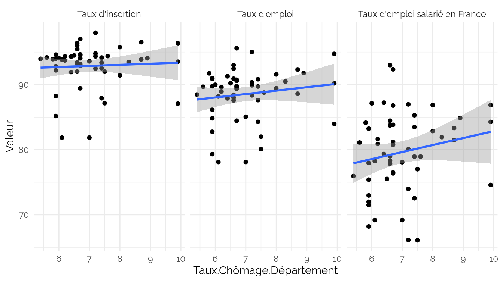

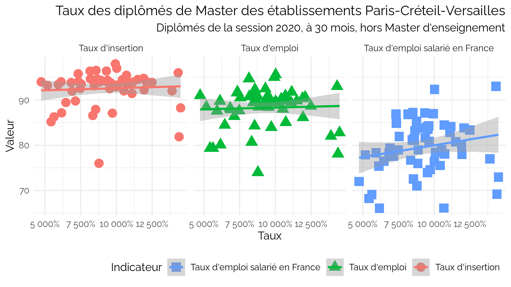

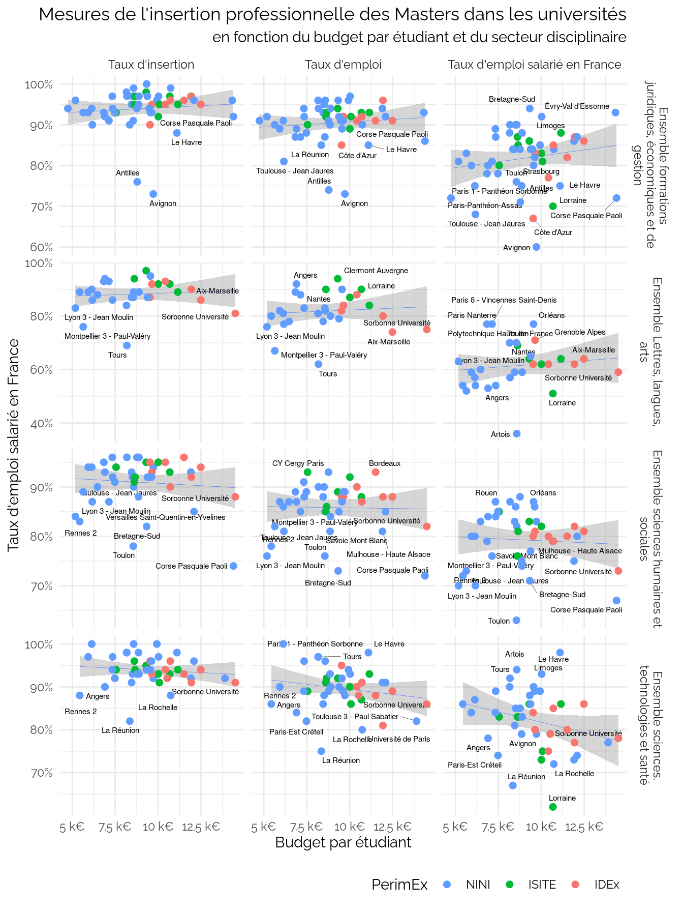

## Apprentissage

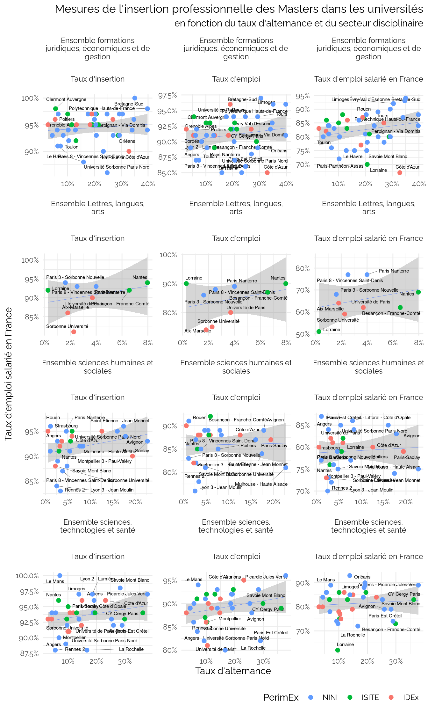

### Alternance vs SCSP

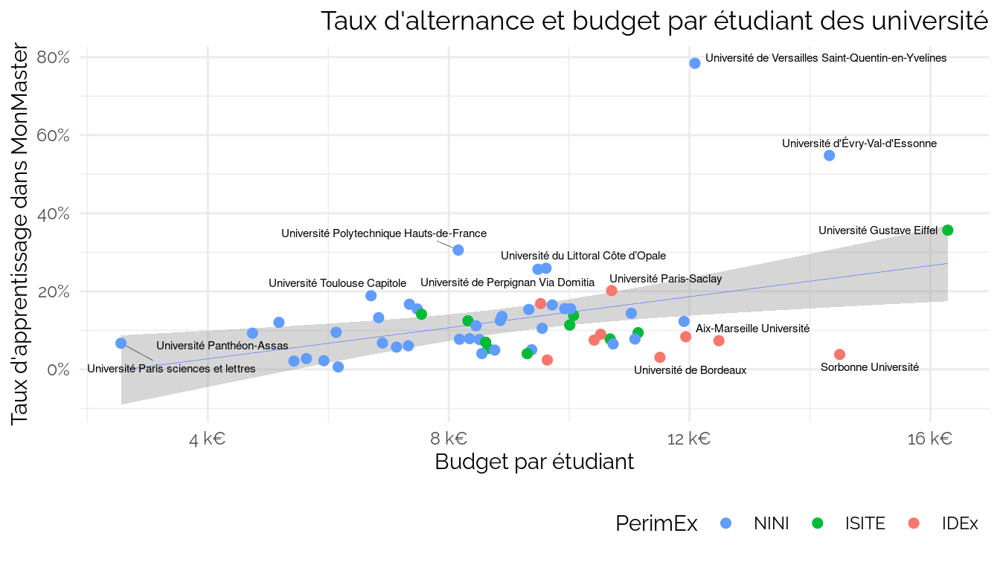

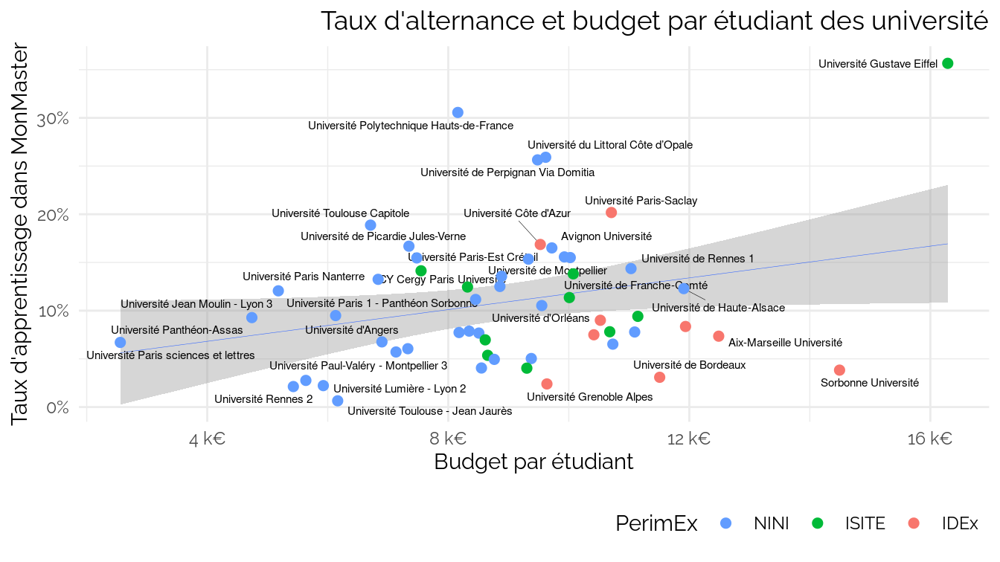
