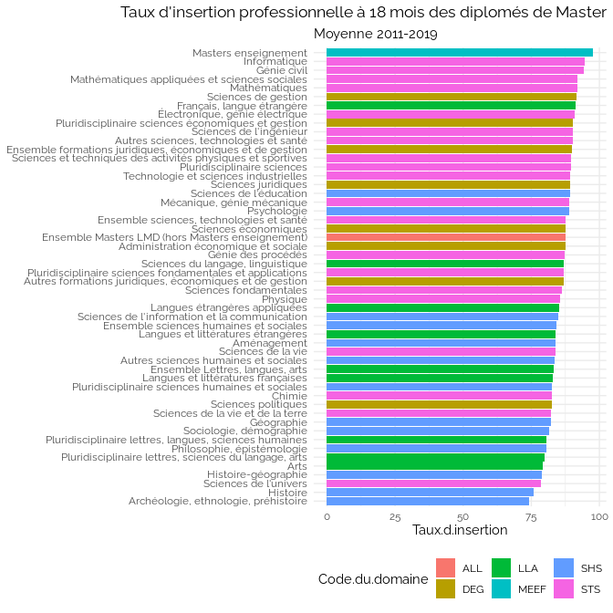
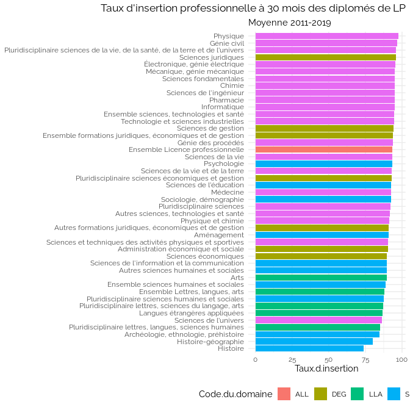

Insertion Pro
================

<https://data.enseignementsup-recherche.gouv.fr/explore/dataset/fr-esr-insertion_professionnelle-master_donnees_nationales/export/>

<https://data.enseignementsup-recherche.gouv.fr/explore/dataset/fr-esr-insertion_professionnelle-lp_donnees_nationales/export/>

<https://www.education.gouv.fr/l-insertion-des-jeunes-apres-une-formation-en-voie-professionnelle-307956>

    ## `summarise()` has grouped output by 'Secteur.disciplinaire'. You can override
    ## using the `.groups` argument.

<!-- -->

    ## `summarise()` has grouped output by 'Secteur.disciplinaire'. You can override
    ## using the `.groups` argument.

<!-- -->

### Chimie vs. socio

<!-- -->

## LP

    ## `summarise()` has grouped output by 'Secteur.disciplinaire'. You can override
    ## using the `.groups` argument.

<!-- -->

    ## `summarise()` has grouped output by 'Secteur.disciplinaire'. You can override
    ## using the `.groups` argument.

<!-- -->

### Informatique vs. socio

<!-- -->

## Socio vs Voie Pro

    ## `summarise()` has grouped output by 'Diplôme'. You can override using the
    ## `.groups` argument.

<!-- -->

    ## `summarise()` has grouped output by 'Diplôme'. You can override using the
    ## `.groups` argument.

<!-- -->

<!-- -->
