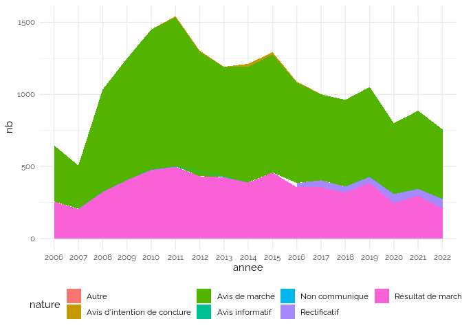
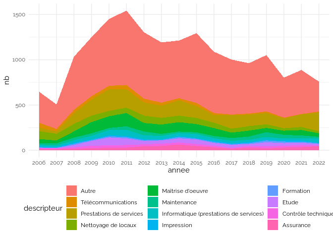

Marchés Publics
================

## Source : BOAMP

<https://boamp-datadila.opendatasoft.com/explore/dataset/boamp/table/?q=universit%C3%A9>

Variables données brutes

| x                                |
|:---------------------------------|
| idweb                            |
| annonce_reference_schema_v110    |
| objet                            |
| Filename                         |
| famille                          |
| code_departement                 |
| code_departement_prestation      |
| famille_libelle                  |
| dateparution                     |
| datefindiffusion                 |
| datelimitereponse                |
| nomacheteur                      |
| titulaire                        |
| perimetre                        |
| type_procedure                   |
| soustype_procedure               |
| procedure_libelle                |
| procedure_categorise             |
| nature                           |
| sousnature                       |
| nature_libelle                   |
| sousnature_libelle               |
| nature_categorise                |
| nature_categorise_libelle        |
| criteres                         |
| marche_public_simplifie          |
| marche_public_simplifie_label    |
| etat                             |
| descripteur_code                 |
| dc                               |
| descripteur_libelle              |
| type_marche                      |
| type_marche_facette              |
| type_avis                        |
| annonce_lie                      |
| annonces_anterieures             |
| annonces_anterieures_schema_v110 |
| source_schema                    |
| GESTION                          |
| DONNEES                          |

Période : 2006-01-02, 2022-11-29

### Fix type na

    ## `summarise()` has grouped output by 'descripteur_libelle'. You can override
    ## using the `.groups` argument.
    ## Joining, by = "descripteur_libelle"
    ## Joining, by = "descripteur_libelle.first"

Vérification

| type_marche_facette | descripteur_libelle                                                                                                                 |
|:--------------------|:------------------------------------------------------------------------------------------------------------------------------------|
| NA                  | Clocher                                                                                                                             |
| NA                  | Dragage                                                                                                                             |
| NA                  | Caoutchouc;Matériel électronique;Matériel électronique médical                                                                      |
| NA                  | Poteaux d’incendie                                                                                                                  |
| NA                  | Caoutchouc;Equipement sportif;Jeux, jouets;Plastique                                                                                |
| NA                  | Drainage;Terrain de sport;Aire de jeux                                                                                              |
| NA                  | Captage;Equipement hydraulique;Travaux sous-marins                                                                                  |
| NA                  | Carton                                                                                                                              |
| NA                  | Fondations spéciales;Maçonnerie;Menuiserie;Peinture (travaux);Plomberie (travaux)                                                   |
| NA                  | Fondations spéciales;Maçonnerie;Menuiserie;Peinture (travaux);Plomberie (travaux)                                                   |
| NA                  | Travaux sous-marins                                                                                                                 |
| NA                  | Fondations spéciales;Forage                                                                                                         |
| NA                  | Crédit-bail                                                                                                                         |
| NA                  | Carton                                                                                                                              |
| NA                  | Captage                                                                                                                             |
| NA                  | Clocher;Dragage                                                                                                                     |
| NA                  | Travaux d’électricité                                                                                                               |
| NA                  | Travaux d’électricité;Ferronnerie;Métallerie;Serrurerie                                                                             |
| NA                  | Diététique                                                                                                                          |
| NA                  | Travaux sous-marins                                                                                                                 |
| NA                  | Captage;Forage;Installation portuaire                                                                                               |
| NA                  | Couches;Clocher;Drainage;Electroménager                                                                                             |
| NA                  | Carton                                                                                                                              |
| NA                  | Travaux d’électricité;Isolation;Peinture (travaux);Plâtrerie;Revêtements de sols                                                    |
| NA                  | Travaux d’électricité;Gros oeuvre;Menuiserie;Peinture (travaux);Plâtrerie;Plomberie (travaux);Revêtements de sols;Sécurité incendie |
| NA                  | Travaux d’électricité                                                                                                               |
| NA                  | Travaux d’électricité                                                                                                               |
| NA                  | Travaux d’électricité                                                                                                               |
| NA                  | Clocher                                                                                                                             |
| NA                  | Caoutchouc;Chauffage (fourniture)                                                                                                   |
| NA                  | Travaux d’électricité;Equipements spécialisés                                                                                       |
| NA                  | Carton;Collecte sélective;Papeterie;Déchets                                                                                         |
| NA                  | Fondations spéciales;Génie civil                                                                                                    |
| NA                  | Equipement piscine                                                                                                                  |
| NA                  | Captage;Equipement hydraulique;Travaux sous-marins                                                                                  |

### Data

Variables

| x              |
|:---------------|
| idweb          |
| objet          |
| famille        |
| acheteur       |
| titulaire      |
| perimetre      |
| type           |
| procedure      |
| sous_procedure |
| descripteur    |
| nature         |
| annee          |
| dateparution   |
| donnees        |

## Types

    ## `summarise()` has grouped output by 'annee'. You can override using the
    ## `.groups` argument.

<!-- -->

    ## `summarise()` has grouped output by 'annee'. You can override using the
    ## `.groups` argument.

<!-- -->

## Services

Réduction des données aux services.

### Nature

    ## `summarise()` has grouped output by 'annee'. You can override using the
    ## `.groups` argument.

<!-- -->

## Ligne plus récente seulement

Réduction des données à la ligne la plus récente par identifiant.

    ## `summarise()` has grouped output by 'annee'. You can override using the
    ## `.groups` argument.

<!-- -->

## Descripteur

    ## `summarise()` has grouped output by 'annee'. You can override using the
    ## `.groups` argument.

<!-- -->

## Mots clés

Détection de “conseil”, “accompagnement” et “assistance” dans objet, et
du descripteur “Etude”.

    ## `summarise()` has grouped output by 'annee'. You can override using the
    ## `.groups` argument.

<!-- -->

## acheteur

Voir les données

| acheteur                                                                      |  nb |
|:------------------------------------------------------------------------------|----:|
| université de strasbourg                                                      | 109 |
| université de nantes                                                          |  91 |
| université de lorraine                                                        |  88 |
| université de nice sophia antipolis                                           |  87 |
| université d’aix-marseille                                                    |  84 |
| université de bordeaux                                                        |  66 |
| université d’angers                                                           |  59 |
| université pierre et marie curie                                              |  48 |
| université paul sabatier                                                      |  47 |
| pres université de lyon                                                       |  46 |
| université paris 8                                                            |  45 |
| université paris-sud 11                                                       |  36 |
| université lumière lyon 2 - dajim                                             |  35 |
| cue - université de lyon                                                      |  33 |
| université paris descartes                                                    |  33 |
| université de corse                                                           |  32 |
| université de bretagne occidentale                                            |  31 |
| université de la réunion                                                      |  31 |
| université de versailles-saint quentin                                        |  31 |
| université d’artois                                                           |  29 |
| université joseph fourier                                                     |  29 |
| pres aix-marseille université                                                 |  28 |
| université de bourgogne                                                       |  28 |
| université de reims champagne ardenne                                         |  27 |
| université de limoges                                                         |  26 |
| agence mutualisation des universités                                          |  25 |
| université claude bernard lyon 1                                              |  25 |
| université de rouen                                                           |  25 |
| université paris 13                                                           |  25 |
| université paris sud                                                          |  25 |
| université paris-dauphine                                                     |  24 |
| université toulouse 1 sciences sociale                                        |  24 |
| sorbonne université                                                           |  23 |
| université bordeaux 1                                                         |  23 |
| université de la méditerranée                                                 |  23 |
| université paris x nanterre                                                   |  23 |
| université antilles guyane                                                    |  21 |
| université de caen normandie                                                  |  21 |
| université paris-sorbonne (paris iv)                                          |  21 |
| université avignon et pays de vaucluse                                        |  20 |
| université paris 1 panthéon-sorbonne                                          |  20 |
| université de technologie de compiègne                                        |  19 |
| université denis diderot - paris 7                                            |  19 |
| université de cergy pontoise                                                  |  18 |
| université nice sophia-antipolis                                              |  18 |
| université du littoral côte d’opale                                           |  17 |
| université montpellier 1                                                      |  17 |
| université paris 7-denis diderot                                              |  17 |
| université paris est marne-la-vallée                                          |  17 |
| université européenne de bretagne                                             |  16 |
| université montpellier ii                                                     |  16 |
| pres université lille nord de france                                          |  15 |
| université claude bernard - lyon 1                                            |  15 |
| université de cergy-pontoise                                                  |  15 |
| université paris dauphine                                                     |  15 |
| université paris ouest nanterre                                               |  15 |
| université de marne-la-vallée                                                 |  14 |
| université de rennes 1                                                        |  14 |
| université lille 1                                                            |  14 |
| université paris 12 - val de marne                                            |  14 |
| université paul-valéry                                                        |  14 |
| université de toulouse                                                        |  13 |
| université lille 1 sciences et techno                                         |  13 |
| université lumière - lyon 2                                                   |  13 |
| université paul verlaine - metz                                               |  13 |
| université de lille 2                                                         |  12 |
| université françois rabelais de tours                                         |  12 |
| université jean moulin lyon 3                                                 |  12 |
| université paris-est créteil                                                  |  12 |
| université rennes 2                                                           |  12 |
| chancellerie des universités de paris                                         |  11 |
| université blaise pascal                                                      |  11 |
| université de caen - basse-normandie                                          |  11 |
| université panthéon assas paris 2                                             |  11 |
| pres - université de grenoble                                                 |  10 |
| université d’orléans                                                          |  10 |
| université de la rochelle                                                     |  10 |
| université de valenciennes                                                    |  10 |
| université fédérale toulouse                                                  |  10 |
| université mde montaigne bordeaux 3                                           |  10 |
| université panthéon-assas paris ii                                            |  10 |
| université rennes 2 - haute bretagne                                          |  10 |
| université toulouse ii le mirail                                              |  10 |
| pres de l’université de lorraine                                              |   9 |
| université de franche-comté                                                   |   9 |
| université de picardie jules verne                                            |   9 |
| université de provence                                                        |   9 |
| université grenoble alpes                                                     |   9 |
| université paris 1 - panthéon sorbonne                                        |   9 |
| agence de mutualisation des université                                        |   8 |
| pres université de grenoble                                                   |   8 |
| université de bretagne sud                                                    |   8 |
| université de savoie                                                          |   8 |
| université françois rabelais                                                  |   8 |
| université lille 2                                                            |   8 |
| université lyon 2                                                             |   8 |
| université michel de montaigne bordeau                                        |   8 |
| université paris est                                                          |   8 |
| université savoie mont blanc                                                  |   8 |
| université toulouse ii                                                        |   8 |
| université charles de gaulle - lille 3                                        |   7 |
| université de picardie jules vernes                                           |   7 |
| université de toulon                                                          |   7 |
| université de toulouse le mirail                                              |   7 |
| avignon université                                                            |   6 |
| université de haute alsace                                                    |   6 |
| université du maine                                                           |   6 |
| université louis pasteur                                                      |   6 |
| l’université nantes-angers-le mans                                            |   5 |
| pres - université de lyon                                                     |   5 |
| sria université de bordeaux                                                   |   5 |
| université de caen                                                            |   5 |
| université de guyane                                                          |   5 |
| université de poitiers                                                        |   5 |
| université henri poincaré                                                     |   5 |
| université pantheon-assas paris ii                                            |   5 |
| université sorbonne nelle paris 3                                             |   5 |
| université sorbonne paris nord                                                |   5 |
| présidence université de nantes                                               |   4 |
| université blaise pascal - clermont                                           |   4 |
| université d’auvergne                                                         |   4 |
| université de pau et des pays de l’ado                                        |   4 |
| université de picardie                                                        |   4 |
| université jean monnet                                                        |   4 |
| université louis-pasteur                                                      |   4 |
| université panthéon assas paris ii                                            |   4 |
| université stendhal-grenoble3                                                 |   4 |
| université via domitia de perpignan                                           |   4 |
| epcs nancy université                                                         |   3 |
| grenoble universités - service aménagement                                    |   3 |
| université bretagne loire                                                     |   3 |
| université d’evry val d’essonne                                               |   3 |
| université de pau et pays de l’adour                                          |   3 |
| université du havre                                                           |   3 |
| université du sud toulon var                                                  |   3 |
| université henri poincaré, nancy 1                                            |   3 |
| université nancy 2                                                            |   3 |
| université poitiers - dpi                                                     |   3 |
| université toulouse ii - le mirail                                            |   3 |
| université victor segalen bordeaux2                                           |   3 |
| chancellerie des universités - sge                                            |   2 |
| pres - université lille nord de france                                        |   2 |
| université - r descartes paris 5                                              |   2 |
| université de lille 3 - dml                                                   |   2 |
| université de technologie de troyes                                           |   2 |
| université de versailles - saint-quentin-en-yvelines                          |   2 |
| université de versailles saint-quentin                                        |   2 |
| université de versailles saint-quentin-en-yvelines                            |   2 |
| université nancy 2 - service patrimoin                                        |   2 |
| université paris 2                                                            |   2 |
| université paris 3 - sorbonne nouvelle                                        |   2 |
| université paris 3 sorbonne nouvelle                                          |   2 |
| université paul cézanne aix-marseille3                                        |   2 |
| université paul-sabatier                                                      |   2 |
| université pierre mendès france                                               |   2 |
| université stendhal - grenoble 3                                              |   2 |
| agence de mutualisation des universités et établissements                     |   1 |
| comue université grenoble alpes                                               |   1 |
| l’unam - l’université nantes-angers-                                          |   1 |
| l’unam - l’université nantes-angers-le mans                                   |   1 |
| pres clermont université                                                      |   1 |
| pres normandie-université                                                     |   1 |
| université blaise pascal - clermont-ferrand 2                                 |   1 |
| université blaise-pascal                                                      |   1 |
| université bordeaux iv                                                        |   1 |
| université bordeaux montaigne                                                 |   1 |
| université bordeaux segalen                                                   |   1 |
| université claude-bernard lyon 1                                              |   1 |
| université de la polynésie française                                          |   1 |
| université de perpignan via domitia                                           |   1 |
| université de reims - champagne-ardenne                                       |   1 |
| université de rennes i                                                        |   1 |
| université de versailles saint quentin                                        |   1 |
| université des antilles                                                       |   1 |
| université des sciences et technologies de lille                              |   1 |
| université lille 3 - dp                                                       |   1 |
| université louis-pasteur à strasbourg                                         |   1 |
| université marc bloch                                                         |   1 |
| université panthéon-assas paris-ii                                            |   1 |
| université paris 3-sorbonne nouvelle, service des travaux hygiène et sécurité |   1 |
| université paris 8 saint denis                                                |   1 |
| université paris sud 11                                                       |   1 |
| université paris x nanterre d f c                                             |   1 |
| université paris-dauphine code d’identification nationale : 19754692200018    |   1 |
| université paris-i panthéon-sorbonne, daf, service de la commande publique    |   1 |
| université paris-x nanterre                                                   |   1 |
| université pau et des pays de l’adour                                         |   1 |
| université paul valéry                                                        |   1 |
| université pierre et marie curie - paris 6, service achats publics            |   1 |
| université pierre-et-marie-curie                                              |   1 |
| université pierre-et-marie-curie, service achats publics                      |   1 |
| université pm curie-laboratoire arago                                         |   1 |
| université robert schuman                                                     |   1 |
| université sorbonne nouvelle-paris 3                                          |   1 |

    ## `summarise()` has grouped output by 'acheteur'. You can override using the
    ## `.groups` argument.

<!-- -->

université de strasbourg

| objet                                                                                                                                                                                                 | titulaire                                                                                                          | famille                                 | descripteur                                                    | nature             |
|:------------------------------------------------------------------------------------------------------------------------------------------------------------------------------------------------------|:-------------------------------------------------------------------------------------------------------------------|:----------------------------------------|:---------------------------------------------------------------|:-------------------|
| fourniture d’une mission de relations presse et de conseil en communication à strasbourg cedex                                                                                                        | NA                                                                                                                 | Marchés \<90 k€ (MAPA)                  | Assistance technique;Prestations de services;Publicité         | Avis de marché     |
| mission d’assistance dans la construction du schéma directeur numérique de l’université de strasbourg                                                                                                 | NA                                                                                                                 | Marchés entre 90 k€ et seuils européens | Assistance technique                                           | Avis de marché     |
| elaboration du schéma directeur de mise en sécurité des bâtiments de l’université de strasbourg                                                                                                       | NA                                                                                                                 | Marchés européens                       | Etude;Prestations de services                                  | Avis de marché     |
| mission d’assistance dans la construction du schéma directeur numérique de l’université de strasbourg                                                                                                 | NA                                                                                                                 | Marchés entre 90 k€ et seuils européens | Assistance technique                                           | Résultat de marché |
| campagne de levée de fonds pour le colloque ciuen 2010 organisé par l’université de strasbourg à strasbourg                                                                                           | NA                                                                                                                 | Marchés \<90 k€ (MAPA)                  | Etude;Prestations de services                                  | Avis de marché     |
| diagnostic technique sur l’accessibilité des personnes handicapées aux sites universitaires à strasbourg                                                                                              | NA                                                                                                                 | Marchés européens                       | Etude;Prestations de services                                  | Avis de marché     |
| assistance à la conduite du changement dans le cadre du déploiement d’un logiciel financier et comptable à strasbourg                                                                                 | NA                                                                                                                 | Marchés entre 90 k€ et seuils européens | Assistance technique                                           | Avis de marché     |
| mission de conseil opération campus à strasbourg                                                                                                                                                      | NA                                                                                                                 | Marchés entre 90 k€ et seuils européens | Prestations de services                                        | Avis de marché     |
| mission de conseil opération campus à strasbourg (rectificatif)                                                                                                                                       | NA                                                                                                                 | Marchés entre 90 k€ et seuils européens | Prestations de services                                        | Avis de marché     |
| mission de programmation pour la modernisation de l’iut d’illkirch                                                                                                                                    | NA                                                                                                                 | Marchés entre 90 k€ et seuils européens | Etude                                                          | Avis de marché     |
| elaboration du schéma directeur de mise en sécurité des bâtiments de l’université de strasbourg                                                                                                       | qualiconsult                                                                                                       | Marchés européens                       | Etude;Prestations de services                                  | Résultat de marché |
| diagnostic technique sur l’accessibilité des personnes handicapées aux sites universitaires à strasbourg                                                                                              | accesmetrie                                                                                                        | Marchés européens                       | Etude;Prestations de services                                  | Résultat de marché |
| mise à disposition de personnels en régie au support informatique pour assurer la mission d’assistance aux utilisateurs, à strasbourg                                                                 | trsb                                                                                                               | Marchés européens                       | Informatique (prestations de services);Prestations de services | Résultat de marché |
| etudes préalables à la restructuration de la cité paul appell à strasbourg                                                                                                                            | NA                                                                                                                 | Marchés entre 90 k€ et seuils européens | Etude                                                          | Avis de marché     |
| etudes préalables à la réalisation du pôle géoscience-eau-environnement-ingenierie de l’université à strasbourg                                                                                       | NA                                                                                                                 | Marchés entre 90 k€ et seuils européens | Etude                                                          | Avis de marché     |
| etudes préalables à la réalisation de bâtiment d’accompagnement à l’opération campus pour l’universite à strasbourg                                                                                   | NA                                                                                                                 | Marchés entre 90 k€ et seuils européens | Etude                                                          | Avis de marché     |
| etudes préalables à la réalisation de nouveaux équipements sportifs sur les campus à strasbourg                                                                                                       | NA                                                                                                                 | Marchés entre 90 k€ et seuils européens | Etude                                                          | Avis de marché     |
| mission d’assistance pour la réalisation d’une cartographie des risques de l’université de strasbourg.                                                                                                | NA                                                                                                                 | Marchés \<90 k€ (MAPA)                  | Prestations de services                                        | Avis de marché     |
| etudes préalables à la réalisation de l’insectarium et de l’extension de l’ibmc à strasbourg                                                                                                          | NA                                                                                                                 | Marchés entre 90 k€ et seuils européens | Etude                                                          | Avis de marché     |
| etudes préalables à la réalisation d’une maison de l’étudiant et d’un learning center pour l’université à strasbourg                                                                                  | NA                                                                                                                 | Marchés entre 90 k€ et seuils européens | Etude                                                          | Avis de marché     |
| etudes préalables à la réalisation d’un pavillon des arts et des sciences et d’un pôle culture, science et société à strasbourg                                                                       | NA                                                                                                                 | Marchés entre 90 k€ et seuils européens | Etude                                                          | Avis de marché     |
| etudes préalables à la restructuration de la cité paul appell à strasbourg (rectificatif)                                                                                                             | NA                                                                                                                 | Marchés entre 90 k€ et seuils européens | Etude                                                          | Avis de marché     |
| études préalables à la réalisation du pôle géoscience - eau - environnement - ingenierie de l’université à strasbourg (rectificatif)                                                                  | NA                                                                                                                 | Marchés entre 90 k€ et seuils européens | Etude                                                          | Avis de marché     |
| études préalables à la réalisation de bâtiment d’accompagnement à l’opération campus pour l’université à strasbourg (rectificatif)                                                                    | NA                                                                                                                 | Marchés entre 90 k€ et seuils européens | Etude                                                          | Avis de marché     |
| études préalables à la réalisation de nouveaux équipements sportifs sur les campus à strasbourg (rectificatif)                                                                                        | NA                                                                                                                 | Marchés entre 90 k€ et seuils européens | Etude                                                          | Avis de marché     |
| études préalables à la réalisation de l’insectarium et de l’extension de l’ibmc à strasbourg (rectificatif)                                                                                           | NA                                                                                                                 | Marchés entre 90 k€ et seuils européens | Etude                                                          | Avis de marché     |
| études préalables à la réalisation d’une maison de l’étudiant et d’un learning center pour l’université à strasbourg (rectificatif)                                                                   | NA                                                                                                                 | Marchés entre 90 k€ et seuils européens | Etude                                                          | Avis de marché     |
| études préalables à la réalisation d’un pavillon des arts et des sciences et d’un pôle culture, science et société à strasbourg (rectificatif)                                                        | NA                                                                                                                 | Marchés entre 90 k€ et seuils européens | Etude                                                          | Avis de marché     |
| mission d’étude relative à l’analyse économique et juridique d’un green datacenter pour l’université de strasbourg                                                                                    | NA                                                                                                                 | Marchés européens                       | Etude                                                          | Avis de marché     |
| mission d’accompagnement pour la mise en place opérationnelle du schéma directeur numérique de l’université de strasbourg                                                                             | NA                                                                                                                 | Marchés entre 90 k€ et seuils européens | Prestations de services                                        | Résultat de marché |
| mission de programmation pour la modernisation de l’iut d’illkirch                                                                                                                                    | NA                                                                                                                 | Marchés entre 90 k€ et seuils européens | Etude                                                          | Résultat de marché |
| mission d’accompagnement de l’université de strasbourg pour les projets initiative d’excellence et le projet satt                                                                                     | NA                                                                                                                 | Marchés entre 90 k€ et seuils européens | Prestations de services                                        | Avis de marché     |
| assistance à la mise en place d’un marché d’assurances pour l’université de strasbourg et l’université paul verlaine à metz                                                                           | NA                                                                                                                 | Marchés entre 90 k€ et seuils européens | Assistance technique;Prestations de services                   | Avis de marché     |
| description :mission d’accompagnement à la rédaction du cdg pour le futur si intégré de gestion de la formation et suivi des étudiants. à strasbourg                                                  | NA                                                                                                                 | Marchés \<90 k€ (MAPA)                  | Prestations de services                                        | Avis de marché     |
| prestations de sténotypie lors de conseils d’administration et de congrès à strasbourg                                                                                                                | NA                                                                                                                 | Marchés \<90 k€ (MAPA)                  | Prestations de services                                        | Avis de marché     |
| mise à disposition de personnels en régie au support informatique pour assurer la mission d’assistance aux utilisateurs, à strasbourg                                                                 | NA                                                                                                                 | Marchés européens                       | Informatique (prestations de services);Prestations de services | Avis de marché     |
| assistance à la maîtrise d’ouvrage pour la conduite du changement dans le cadre de la mise en place d’un progiciel de bibliothèques (sigb) unique à strasbourg                                        | NA                                                                                                                 | Marchés \<90 k€ (MAPA)                  | Prestations de services                                        | Avis de marché     |
| mission d’accompagnement pour la mise en place opérationnelle du schéma directeur numérique de l’université de strasbourg                                                                             | NA                                                                                                                 | Marchés entre 90 k€ et seuils européens | Prestations de services                                        | Avis de marché     |
| accord-cadre pour des missions d’assistance à la personne publique pour l’université de strasbourg                                                                                                    | NA                                                                                                                 | Marchés européens                       | Assistance technique;Prestations de services                   | Avis de marché     |
| assistance à maîtrise d’ouvrage du schéma directeur numérique de l’université à strasbourg.                                                                                                           | sans suite                                                                                                         | Marchés européens                       | Maîtrise d’oeuvre                                              | Résultat de marché |
| mission d’accompagnement de l’université de strasbourg pour les projets initiative d’excellence et le projet satt                                                                                     | NA                                                                                                                 | Marchés entre 90 k€ et seuils européens | Prestations de services                                        | Résultat de marché |
| fourniture d’une mission de relations presse et de conseil en communication pour l’ecole de management de strasbourg                                                                                  | NA                                                                                                                 | Marchés européens                       | Prestations de services                                        | Avis de marché     |
| mission d’accompagnement pour la mise en oeuvre de la suite logicielle symantec altiris. à strasbourg                                                                                                 | NA                                                                                                                 | Marchés \<90 k€ (MAPA)                  | Informatique (prestations de services)                         | Avis de marché     |
| prestation d’études de programmation dans le cadre de l’opération campus à strasbourg                                                                                                                 | NA                                                                                                                 | Marchés européens                       | Etude;Prestations de services                                  | Avis de marché     |
| études de programmation dans le cadre de l’opération campus à strasbourg                                                                                                                              | NA                                                                                                                 | Marchés européens                       | Etude                                                          | Avis de marché     |
| etude muséographique dans le cadre du pôle science, culture et société pour le compte de l’université à strasbourg                                                                                    | NA                                                                                                                 | Marchés entre 90 k€ et seuils européens | Etude;Prestations de services                                  | Avis de marché     |
| etude muséographique dans le cadre du pôle science, culture et société pour le compte de l’université à strasbourg(rectificatif)                                                                      | NA                                                                                                                 | Marchés entre 90 k€ et seuils européens | Etude;Prestations de services                                  | Avis de marché     |
| fourniture d’une mission de relations presse et de conseil en communication pour l’ecole de management de strasbourg                                                                                  | NA                                                                                                                 | Marchés européens                       | Prestations de services                                        | Résultat de marché |
| accord-cadre pour des missions d’assistance à la personne publique pour l’université de strasbourg                                                                                                    | cabinet earth avocats fcl price water house coopers selarl matharan pintat raymundie selarl soler couteaux llorens | Marchés européens                       | Assistance technique;Prestations de services                   | Résultat de marché |
| mission d’assistance à la personne publique dans le cadre de l’opération campus à strasbourg                                                                                                          | sce                                                                                                                | Marchés européens                       | Etude;Prestations de services                                  | Résultat de marché |
| mission d’étude relative à l’analyse économique et juridique d’un green datacenter pour l’université de strasbourg                                                                                    | performance management partner                                                                                     | Marchés européens                       | Etude                                                          | Résultat de marché |
| prestations de conseil, d’accompagnement, de création graphique et de réalisation de supports papier d’information et de communication pour le compte de l’université de strasbourg                   | mille watts welcome byzance lintranquille emonet cline graffiti prospective                                        | Marchés européens                       | Prestations de services                                        | Résultat de marché |
| assistance à maîtrise d’oeuvre sur l’ensemble des projets du schéma directeur numérique de l’université de strasbourg                                                                                 | bull sas ibm france sogeti france                                                                                  | Marchés européens                       | Assistance technique;Prestations de services                   | Résultat de marché |
| etudes préalables à la réalisation d’un pavillon des arts et des sciences et d’un pôle culture, science et société à strasbourg                                                                       | NA                                                                                                                 | Marchés entre 90 k€ et seuils européens | Etude                                                          | Résultat de marché |
| etudes préalables à la réalisation d’une maison de l’étudiant et d’un learning center pour l’université à strasbourg                                                                                  | NA                                                                                                                 | Marchés entre 90 k€ et seuils européens | Etude                                                          | Résultat de marché |
| etudes préalables à la réalisation de bâtiment d’accompagnement à l’opération campus pour l’universite à strasbourg                                                                                   | NA                                                                                                                 | Marchés entre 90 k€ et seuils européens | Etude                                                          | Résultat de marché |
| etudes préalables à la réalisation du pôle géoscience-eau-environnement-ingenierie de l’université à strasbourg                                                                                       | NA                                                                                                                 | Marchés entre 90 k€ et seuils européens | Etude                                                          | Résultat de marché |
| etudes préalables à la restructuration de la cité paul appell à strasbourg                                                                                                                            | NA                                                                                                                 | Marchés entre 90 k€ et seuils européens | Etude                                                          | Résultat de marché |
| etudes préalables à la réalisation de nouveaux équipements sportifs sur les campus à strasbourg                                                                                                       | NA                                                                                                                 | Marchés entre 90 k€ et seuils européens | Etude                                                          | Résultat de marché |
| etudes préalables à la réalisation de l’insectarium et de l’extension de l’ibmc à strasbourg                                                                                                          | NA                                                                                                                 | Marchés entre 90 k€ et seuils européens | Etude                                                          | Résultat de marché |
| assistance à maîtrise d’ouvrage du schéma directeur numérique de l’université à strasbourg.                                                                                                           | NA                                                                                                                 | Marchés européens                       | Maîtrise d’oeuvre                                              | Avis de marché     |
| mission d’assistance à la personne publique dans le cadre de l’opération campus à strasbourg                                                                                                          | NA                                                                                                                 | Marchés européens                       | Etude;Prestations de services                                  | Avis de marché     |
| mission d’accompagnement pour la mise en oeuvre de la suite logicielle symantec altiris à strasbourg                                                                                                  | NA                                                                                                                 | Marchés \<90 k€ (MAPA)                  | Informatique (prestations de services)                         | Avis de marché     |
| mission d’accompagnement de l’université de strasbourg pour le projet initiative d’excellence, dossier de sélection investissements d’avenir 2011. à strasbourg                                       | NA                                                                                                                 | Marchés \<90 k€ (MAPA)                  | Etude;Prestations de services                                  | Avis de marché     |
| assistance à maîtrise d’oeuvre sur l’ensemble des projets du schéma directeur numérique de l’université de strasbourg                                                                                 | NA                                                                                                                 | Marchés européens                       | Assistance technique;Prestations de services                   | Avis de marché     |
| prestations de conseil, d’accompagnement, de création graphique et de réalisation de supports papier d’information et de communication pour le compte de l’université de strasbourg                   | NA                                                                                                                 | Marchés européens                       | Prestations de services                                        | Avis de marché     |
| assistance à la mise en place de marchés de services d’assurances pour l’université de strasbourg, l’université de haute-alsace et l’université de lorraine pour le compte de université à strasbourg | NA                                                                                                                 | Marchés européens                       | Assurance;Prestations de services                              | Avis de marché     |
| etudes de programmation dans le cadre de l’opération campus à strasbourg                                                                                                                              | filigrane programmation                                                                                            | Marchés européens                       | Etude                                                          | Résultat de marché |
| mission d’assistance à maitrise d’ouvrage et programmation de la restructuration de l’institut de physiologie et de chimie biologique pour le compte de l’université à strasbourg                     | NA                                                                                                                 | Marchés entre 90 k€ et seuils européens | Prestations de services                                        | Avis de marché     |
| mission de conseil et d’assistance technique à maîtrise d’ouvrage relative aux travaux de mise en conformité des ascenseurs, sur campus de l’ université de strasbourg                                | acceo                                                                                                              | Marchés européens                       | Assistance technique;Prestations de services                   | Résultat de marché |
| mission d’assistance à maitrise d’ouvrage et études de programmation pour la rénovation énergétique de la faculté de droit et de l’irma à strasbourg                                                  | NA                                                                                                                 | Marchés entre 90 k€ et seuils européens | Assistance technique;Etude;Maîtrise d’oeuvre                   | Avis de marché     |
| assistance à maitrise d’ouvrage et programmation de la restructuration de l’institut de physiologie et de chimie biologique de l’université à strasbourg                                              | NA                                                                                                                 | Marchés entre 90 k€ et seuils européens | Prestations de services                                        | Avis de marché     |
| assistance à la mise en place de marchés de services d’assurances pour l’université de strasbourg, l’université de haute-alsace et l’université de lorraine pour le compte de université à strasbourg | crpi sa                                                                                                            | Marchés européens                       | Assurance;Prestations de services                              | Résultat de marché |
| mission d’assistance à personne publique d’ordre technique, qui fera l’objet de marchés subséquents pour chaque opération et projet de contrat de partenariat, au profit de l’université à strasbourg | NA                                                                                                                 | Marchés européens                       | Assistance technique;Etude                                     | Avis de marché     |
| mission de conseil et d’assistance technique à maîtrise d’ouvrage relative aux travaux de mise en conformité des ascenseurs, sur campus de l’ université de strasbourg                                | NA                                                                                                                 | Marchés européens                       | Assistance technique;Prestations de services                   | Avis de marché     |
| mission d’assistance a maitrise d’ouvrage et études de programmation pour la réalisation d’un nouvel édifice ” maison de l’étudiant - learning centre ” au profit de l’université à strasbourg        | NA                                                                                                                 | Marchés entre 90 k€ et seuils européens | Prestations de services                                        | Avis de marché     |
| prestation d’assistance à maître d’ouvrage dans le cadre de la réalisation du datacenter de l’université de strasbourg                                                                                | NA                                                                                                                 | Marchés européens                       | Assistance technique                                           | Avis de marché     |
| assistance à la maitrise d’ouvrage, définition des équipements techniques d’un nouveau planétarium à université de strasbourg                                                                         | NA                                                                                                                 | Marchés européens                       | Prestations de services                                        | Avis de marché     |
| prestations de conseil, d’accompagnement, de création graphique et de réalisation de supports d’information et de communication pour le compte de l’université à strasbourg                           | NA                                                                                                                 | Marchés européens                       | Prestations de services                                        | Avis de marché     |
| missions d’assistance a la maitrise d’ouvrage : process pharmaceutique usine-école ease à illkirch                                                                                                    | NA                                                                                                                 | Marchés européens                       | Prestations de services                                        | Avis de marché     |
| recrutement d’une assistance à maîtrise d’ouvrage pour définir, acheter et mettre en fonctionnement l’équipement d’un planétarium à strasbourg                                                        | anamnesia                                                                                                          | Marchés européens                       | Prestations de services                                        | Résultat de marché |
| assistance à maître d’ouvrage a pour objectif de fournir l’expertise et l’assistance technique nécessaires pour assurer la réalisation du datacenter de l’université à strasbourg                     | NA                                                                                                                 | Marchés européens                       | Prestations de services                                        | Avis de marché     |
| réalisation d’études géotechniques pour l’université de strasbourg                                                                                                                                    | NA                                                                                                                 | Marchés européens                       | Etude                                                          | Avis de marché     |
| marché d’assurance responsabilité civile générale & rc dirigeants et protection juridique (lot 1) et assistance rapatriement & individuelle accident (lot 2) à strasbourg                             | NA                                                                                                                 | Marchés européens                       | Assurance                                                      | Avis de marché     |
| marché d’assistance à maître d’ouvrage a pour objectif de fournir l’expertise et l’assistance technique nécessaires pour assurer la réalisation du datacenter de l’université de strasbourg           | ebrc                                                                                                               | Marchés européens                       | Assistance technique;Prestations de services                   | Résultat de marché |
| mission d’assistance a maitrise d’ouvrage pour des missions de programmation                                                                                                                          | mp conseilpolyprogrammemp conseil                                                                                  | Marchés européens                       | Assistance à maîtrise d’ouvrage                                | Résultat de marché |
| accord cadre pour des missions d’études géotechniques                                                                                                                                                 | NA                                                                                                                 | Marchés européens                       | Etude;Forage;Prestations de services;Topographie               | Résultat de marché |
| elaboration du schéma directeur de transition énergétique de l’université de strasbourg                                                                                                               | NA                                                                                                                 | Marchés européens                       | Etude                                                          | Avis de marché     |
| mission d’assistance à maitrise d’ouvrage pour des missions de programmation à strasbourg                                                                                                             | NA                                                                                                                 | Marchés européens                       | Prestations de services                                        | Avis de marché     |
| missions d’études géotechniques sur les différents campus de l’université à strasbourg                                                                                                                | NA                                                                                                                 | Marchés européens                       | Etude;Topographie                                              | Avis de marché     |
| prestations de conseil, d’accompagnement, de création graphique et de réalisation de supports d’information et de communication pour le compte de l’université à strasbourg                           | mille watts citeasen welcome byzancewelcome byzance la couleur du zebre emonet clinemille watts                    | Marchés européens                       | Prestations de services                                        | Résultat de marché |
| assistance à maîtrise d’ouvrage pour la réalisation du schéma directeur immobilier                                                                                                                    | NA                                                                                                                 | Marchés européens                       | Assistance à maîtrise d’ouvrage                                | Avis de marché     |
| missions d’assistance à l’élaboration d’un schéma directeur pour la mise aux normes des installations aérauliques de la faculté de pharmacie de strasbourg                                            | NA                                                                                                                 | Marchés entre 90 k€ et seuils européens | Assistance à maîtrise d’ouvrage                                | Avis de marché     |
| mission d’assistance à maîtrise d’ouvrage pour la valorisation des certificats d’économies d’énergie                                                                                                  | NA                                                                                                                 | Marchés entre 90 k€ et seuils européens | Assistance à maîtrise d’ouvrage                                | Avis de marché     |
| prestation de démonstration d’une stimulation chimique innovante et douce du puits de réinjection gpk-4 situé à soultz-sous-forêts (67250)                                                            | NA                                                                                                                 | Marchés européens                       | Etude                                                          | Avis de marché     |
| assistance à maîtrise d’ouvrage pour la réalisation du schéma directeur immobilier                                                                                                                    | NA                                                                                                                 | Marchés européens                       | Assistance à maîtrise d’ouvrage                                | Résultat de marché |
| assistance à maitrise d’ouvrage pour la rédaction de baux d’installations photovoltaïques                                                                                                             | NA                                                                                                                 | Marchés entre 90 k€ et seuils européens | Panneaux                                                       | Avis de marché     |
| assistance technique à maitrise d’ouvrage pour la construction du centre européen de sciences quantiques (cesq)                                                                                       | NA                                                                                                                 | Marchés entre 90 k€ et seuils européens | Assistance technique                                           | Avis de marché     |
| maitrise d’oeuvre pour la restauration de clôtures sur le campus historique de l’université de strasbourg                                                                                             | NA                                                                                                                 | Marchés européens                       | Etude                                                          | Avis de marché     |
| prestation de démonstration d’une stimulation chimique innovante et douce du puits de réinjection gpk-4 situé à soultz-sous-forêts (67250)                                                            | NA                                                                                                                 | Marchés européens                       | Etude                                                          | Résultat de marché |
| accord cadre relatif a des missions d’études géotechniques                                                                                                                                            | NA                                                                                                                 | Marchés européens                       | Etude                                                          | Avis de marché     |
| missions d’assistance à maitrise d’ouvrage pour les études de faisabilité et la programmation du devenir du bâtiment d’institut de botanique à strasbourg.                                            | NA                                                                                                                 | Marchés entre 90 k€ et seuils européens | Etude;Assistance à maîtrise d’ouvrage                          | Avis de marché     |
| missions d’assistance à maitrise d’ouvrage pour les études de faisabilité et la programmation du devenir du bâtiment d’institut de botanique à strasbourg.                                            | NA                                                                                                                 | Marchés entre 90 k€ et seuils européens | Etude;Assistance à maîtrise d’ouvrage                          | Avis de marché     |
| accord cadre relatif a des missions d’études géotechniques                                                                                                                                            | geotecginger cebtp sasuvinire geotechnique sas                                                                     | Marchés européens                       | Etude                                                          | Résultat de marché |
| missions d’assistance à maitrise d’ouvrage pour les études de faisabilité et la programmation de la restructuration des bâtiments du site neuvic au neuhof.                                           | NA                                                                                                                 | Marchés entre 90 k€ et seuils européens | Etude;Assistance à maîtrise d’ouvrage                          | Avis de marché     |
| missions d’assistance à maitrise d’ouvrage pour les études de faisabilité et la programmation de la reconversion de la tour de chimie.                                                                | NA                                                                                                                 | Marchés entre 90 k€ et seuils européens | Etude;Assistance à maîtrise d’ouvrage                          | Avis de marché     |
| missions d’assistance à maitrise d’ouvrage pour les études de faisabilité et la programmation sur le site médecine à strasbourg.                                                                      | NA                                                                                                                 | Marchés entre 90 k€ et seuils européens | Etude;Assistance à maîtrise d’ouvrage                          | Avis de marché     |
| missions d’assistance à maitrise d’ouvrage pour les études de faisabilité et la programmation de la reconversion de la tour de chimie.                                                                | NA                                                                                                                 | Marchés entre 90 k€ et seuils européens | Etude;Assistance à maîtrise d’ouvrage                          | Avis de marché     |
| missions d’étude relative au remplacement / la rénovation des différents systèmes sécurité incendie (ssi) actuellement installés dans les bâtiments de l’ecole européenne d’ingénieurs de             | NA                                                                                                                 | Marchés entre 90 k€ et seuils européens | Etude;Maîtrise d’oeuvre                                        | Avis de marché     |

université de nantes

| objet                                                                                                                                                                                                   | titulaire                                            | famille                                 | descripteur                                                          | nature                       |
|:--------------------------------------------------------------------------------------------------------------------------------------------------------------------------------------------------------|:-----------------------------------------------------|:----------------------------------------|:---------------------------------------------------------------------|:-----------------------------|
| diagnostic accessibilité à l’université de nantes                                                                                                                                                       | NA                                                   | Marchés \<90 k€ (MAPA)                  | Etude                                                                | Avis de marché               |
| diagnostic accessibilité à l’université de nantes                                                                                                                                                       | NA                                                   | Marchés \<90 k€ (MAPA)                  | Etude                                                                | Résultat de marché           |
| mission d’assistance à la personne publique pour la constitution d’un contrat de partenariat public-privé pour l’opération campus prometteur de l’université à nantes                                   | NA                                                   | Marchés entre 90 k€ et seuils européens | Assistance technique;Prestations de services                         | Avis de marché               |
| mission de programmation et d’assistance a maitrise d’ouvrage pour la construction d’un iufm à la roche sur yon (85).                                                                                   | NA                                                   | Marchés \<90 k€ (MAPA)                  | Assistance technique;Etude;Maîtrise d’oeuvre                         | Résultat de marché           |
| mission d’assistance à maîtrise d’ouvrage haute qualité environnementale et performances energétiques à nantes cedex 1                                                                                  | NA                                                   | Marchés \<90 k€ (MAPA)                  | Assistance technique;Etude;Prestations de services                   | Résultat de marché           |
| implantation de l’université de nantes dans le quartier de la création sur l’ile de nantesmission de programmation                                                                                      | NA                                                   | Marchés \<90 k€ (MAPA)                  | Etude                                                                | Avis de marché               |
| mission d’assistance à la personne publique pour la constitution d’un contrat de partenariat public-privé pour l’opération campus prometteur de l’université à nantes                                   | NA                                                   | Marchés entre 90 k€ et seuils européens | Assistance technique;Prestations de services                         | Résultat de marché           |
| mission de programmation et d’assistance à maîtrise d’ouvrage pour l’extension de la présidence de l’université à nantes                                                                                | NA                                                   | Marchés entre 90 k€ et seuils européens | Assistance technique;Prestations de services                         | Avis de marché               |
| mission de programmation et d’assistance a maitrise d’ouvrage pour la construction d’un iufm à la roche sur yon (85).                                                                                   | NA                                                   | Marchés \<90 k€ (MAPA)                  | Assistance technique;Etude;Maîtrise d’oeuvre                         | Avis de marché               |
| mission d’assistance à maîtrise d’ouvrage haute qualité environnementale et performances energétiques à nantes cedex 1                                                                                  | NA                                                   | Marchés \<90 k€ (MAPA)                  | Assistance technique;Etude;Prestations de services                   | Avis de marché               |
| mission d’assistance juridique et financière à personne publique dans le cadre d’un contrat de partenariat à nantes                                                                                     | NA                                                   | Marchés européens                       | Prestations de services                                              | Avis de marché               |
| mission d’assistance technique à personne publique dans le cadre d’un contrat de partenariat, à nantes                                                                                                  | NA                                                   | Marchés européens                       | Assistance technique                                                 | Avis de marché               |
| mission d’assistance technique à personne publique dans le cadre d’un contrat de partenariat, à nantes                                                                                                  | groupement algo mandataire proptim nobatek           | Marchés européens                       | Assistance technique                                                 | Résultat de marché           |
| mission d’assistance juridique et financière à personne publique dans le cadre d’un contrat de partenariat à nantes (rectificatif)                                                                      | NA                                                   | Marchés européens                       | Prestations de services                                              | Avis de marché               |
| mission d’assistance technique à personne publique dans le cadre d’un contrat de partenariat, à nantes (rectificatif)                                                                                   | NA                                                   | Marchés européens                       | Assistance technique                                                 | Avis de marché               |
| mission d’assistance juridique et financière à personne publique dans le cadre d’un contrat de partenariat à nantes                                                                                     | groupement finance consult mandatairenorton rose llp | Marchés européens                       | Prestations de services                                              | Résultat de marché           |
| implantation de l’université de nantes dans le quartier de la création sur l’ile de nantesmission de programmation                                                                                      | NA                                                   | Marchés \<90 k€ (MAPA)                  | Etude                                                                | Résultat de marché           |
| réalisation du diagnostic du système d’information de l’université à nantes                                                                                                                             | gfi informatique                                     | Marchés européens                       | Etude;Informatique (prestations de services);Prestations de services | Résultat de marché           |
| etude de définition d’un schéma directeur immobilier des surfaces de formation universitaire dans le secteur de la santé au profit de l’université à nantes                                             | NA                                                   | Marchés européens                       | Etude                                                                | Avis de marché               |
| mission d’assistance à maîtrise d’ouvrage dans le cadre de la mise en oeuvre du projet d’évolution de la fonction finance de l’université de nantes                                                     | NA                                                   | Marchés \<90 k€ (MAPA)                  | Assistance technique;Prestations de services                         | Avis de marché               |
| assistance méthodologique d’accompagnement au changement pour l’université de nantes                                                                                                                    | NA                                                   | Marchés européens                       | Prestations de services                                              | Avis de marché               |
| assistance à maîtrise d’ouvrage pour l’élaboration d’une réponse ligéro-bretonne à l’appel à projets “initiatives d’excellence” du programme investissements d’avenir 2 à nantes                        | mazars sas                                           | Marchés européens                       | Assistance technique;Prestations de services                         | Résultat de marché           |
| audit sur la réorganisation du service commun de documentation de l’université de nantes                                                                                                                | NA                                                   | Marchés \<90 k€ (MAPA)                  | Etude                                                                | Avis de marché               |
| mission d’assistance au chsct du site tertre pour le projet nouveau tertre                                                                                                                              | NA                                                   | Marchés \<90 k€ (MAPA)                  | Assistance technique;Etude;Prestations de services                   | Avis de marché               |
| assistance à la gestion du projet de nouveau système d’information “ressources humaines” de l’université à nantes                                                                                       | NA                                                   | Marchés entre 90 k€ et seuils européens | Prestations de services                                              | Avis de marché               |
| diagnostic de la gestion des déchets de l’université de nantes                                                                                                                                          | NA                                                   | Marchés entre 90 k€ et seuils européens | Audit;Etude;Prestations de services;Déchets                          | Avis de marché               |
| accompagnement dans la construction d’une stratégie de développement de la fondation partenariale de projets de l’université de nantes à nantes                                                         | NA                                                   | Marchés européens                       | Prestations de services                                              | Avis d’intention de conclure |
| etude pour un schéma directeur immobilier fonctionnel, technique et energétique du site universitaire de la lombarderie à nantes                                                                        | NA                                                   | Marchés européens                       | Etude                                                                | Avis de marché               |
| audit sur la réorganisation du service commun de documentation de l’université de nantes                                                                                                                | NA                                                   | Marchés \<90 k€ (MAPA)                  | Etude                                                                | Résultat de marché           |
| assistance à l’élaboration du schéma directeur numérique - système d’information, usages et organisation de l’université à nantes                                                                       | NA                                                   | Marchés entre 90 k€ et seuils européens | Etude                                                                | Avis de marché               |
| etude de définition d’un schéma directeur immobilier des surfaces de formation universitaire dans le secteur de la santé au profit de l’université à nantes                                             | algoe                                                | Marchés européens                       | Etude                                                                | Résultat de marché           |
| prestation d’assistance à maîtrise d’ouvrage pour l’élaboration d’une réponse ligéro-bretonne à l’appel à projets “initiatives d’excellence” du programme investissements d’avenir 2 à nantes           | NA                                                   | Marchés européens                       | Assistance technique;Prestations de services                         | Avis de marché               |
| assistance à l’élaboration du schéma directeur numérique - système d’information, usages et organisation de l’université de nantes à nantes (rectificatif)                                              | NA                                                   | Marchés entre 90 k€ et seuils européens | Informatique (prestations de services)                               | Avis de marché               |
| assistance à la gestion du projet de nouveau système d’information “ressources humaines” de l’université, à nantes                                                                                      | NA                                                   | Marchés entre 90 k€ et seuils européens | Prestations de services                                              | Résultat de marché           |
| mission de levé terrain, restitution numérique et diagnostic des réseaux des sites de l’université à nantes                                                                                             | NA                                                   | Marchés européens                       | Etude;Informatique (prestations de services);Topographie             | Avis de marché               |
| assistance méthodologique d’accompagnement au changement au profit de l’université à nantes                                                                                                             | plein sens                                           | Marchés européens                       | Prestations de services                                              | Résultat de marché           |
| mission d’assistance au chsct du site tertre pour le projet nouveau tertre                                                                                                                              | NA                                                   | Marchés \<90 k€ (MAPA)                  | Assistance technique;Etude;Prestations de services                   | Résultat de marché           |
| assistance à l’élaboration du schéma directeur numérique - système d’information, usages et organisation de l’université à nantes                                                                       | NA                                                   | Marchés entre 90 k€ et seuils européens | Etude                                                                | Résultat de marché           |
| mission d’assistance à maîtrise d’ouvrage dans le cadre de la mise en oeuvre du projet d’évolution de la fonction finance de l’université de nantes                                                     | NA                                                   | Marchés \<90 k€ (MAPA)                  | Assistance technique;Prestations de services                         | Résultat de marché           |
| assistance à maîtrise d’ouvrage pour l’élaboration de l’agenda d’accessibilité programmé de l’université à nantes                                                                                       | socotec                                              | Marchés entre 90 k€ et seuils européens | Prestations de services                                              | Résultat de marché           |
| etude a pour but de construire et de déployer une méthodologie innovante en matière de conduite du changement en matière d’usages de l’énergie au sein des bâtiments de l’université à nantes           | sarl latitude                                        | Marchés européens                       | Etude                                                                | Résultat de marché           |
| assistance à maîtrise d’ouvrage pour l’accompagnement dans le montage d’un projet i-site du programme investissement d’avenir 2 (pia 2) université à nantes                                             | NA                                                   | Marchés entre 90 k€ et seuils européens | Etude;Prestations de services                                        | Avis de marché               |
| assistance à maîtrise d’ouvrage pour l’accompagnement dans le montage d’un projet i-site du programme investissement d’avenir 2 (pia 2) à nantes (rectificatif)                                         | NA                                                   | Marchés entre 90 k€ et seuils européens | Etude;Prestations de services                                        | Avis de marché               |
| etude de préprogrammation portant sur le regroupement des activités de l’enseignement supérieur et de la recherche sur le site de saint nazaire                                                         | NA                                                   | Marchés \<90 k€ (MAPA)                  | Etude                                                                | Avis de marché               |
| etude pour un schéma directeur immobilier fonctionnel, technique et énergétique du site universitaire de la lombarderie à nantes                                                                        | inddigo                                              | Marchés européens                       | Etude                                                                | Résultat de marché           |
| marché d’assistance à maîtrise d’ouvrage pour l’élaboration de l’agenda d’accessibilité programmé de l’université de nantes, à nantes                                                                   | NA                                                   | Marchés entre 90 k€ et seuils européens | Prestations de services                                              | Avis de marché               |
| l’étude a pour but de construire et de déployer une méthodologie innovante en matière de conduite du changement en matière d’usages de l’énergie au sein des bâtiments de l’université à nantes         | NA                                                   | Marchés européens                       | Etude                                                                | Avis de marché               |
| assistance à la maîtrise d’ouvrage relative à la préparation et la passation des marchés d’assurances                                                                                                   | audit assurance                                      | Marchés entre 90 k€ et seuils européens | Assurance;Etude;Assistance à maîtrise d’ouvrage                      | Résultat de marché           |
| accord cadre pour l’assistance méthodologique d’accompagnement du changement                                                                                                                            | plein sens                                           | Marchés européens                       | Etude                                                                | Résultat de marché           |
| assistance au changement pour la mise en place d’un service l’assistance aux utilisateurs des services numériques. université de nantes 1, quai de tourville 13522 44035 nantes cedex 1                 | NA                                                   | Marchés \<90 k€ (MAPA)                  | Etude                                                                | Avis de marché               |
| assistance à maîtrise d’ouvrage pour l’accompagnement dans le montage d’un projet i-site du programme investissement d’avenir 2 (pia 2) à nantes                                                        | cm international                                     | Marchés entre 90 k€ et seuils européens | Etude;Prestations de services                                        | Résultat de marché           |
| etude de programmation pour la requalification des bibliothèques universitaires de l’erdre                                                                                                              | NA                                                   | Marchés entre 90 k€ et seuils européens | Etude                                                                | Avis de marché               |
| accord-cadre pour la réalisation de prestations de conseil et d’assistance en matière d’expertise fiscale.                                                                                              | fidal altraconsulting mazars societe davocats        | Marchés européens                       | Assistance juridique                                                 | Résultat de marché           |
| assistance au changement pour la mise en place d’un service l’assistance aux utilisateurs des services numériques. université de nantes 1, quai de tourville 13522 44035 nantes cedex 1                 | cg conseil                                           | Marchés \<90 k€ (MAPA)                  | Etude                                                                | Résultat de marché           |
| etude de préprogrammation portant sur le regroupement des activités de l’enseignement supérieur et de la recherche sur le site de saint nazaire                                                         | narthex sarl                                         | Marchés \<90 k€ (MAPA)                  | Etude                                                                | Résultat de marché           |
| etude d’ingénierie de désenfumage                                                                                                                                                                       | NA                                                   | Marchés \<90 k€ (MAPA)                  | Etude                                                                | Avis de marché               |
| assistance à l’élaboration d’une stratégie d’évolution du système d’information du patrimoine dédié à la gestion du patrimoine immobilier de l’université, à nantes                                     | NA                                                   | Marchés entre 90 k€ et seuils européens | Informatique (prestations de services);Prestations de services       | Avis de marché               |
| assistance à la maîtrise d’ouvrage relative à la préparation et la passation des marchés d’assurances pour l’université de nantes                                                                       | NA                                                   | Marchés entre 90 k€ et seuils européens | Assistance technique;Prestations de services                         | Avis de marché               |
| assistance à l’élaboration d’une stratégie d’évolution du système d’information du patrimoine dédié à la gestion du patrimoine immobilier de l’université, à nantes (rectificatif)                      | NA                                                   | Marchés entre 90 k€ et seuils européens | Informatique (prestations de services);Prestations de services       | Avis de marché               |
| accord cadre pour l’assistance méthodologique d’accompagnement du changement                                                                                                                            | NA                                                   | Marchés européens                       | Prestations de services                                              | Avis de marché               |
| prestations de conseil et d’assistance en matière d’expertise fiscale au profit de l’université à nantes                                                                                                | NA                                                   | Marchés européens                       | Prestations de services                                              | Avis de marché               |
| assistance à l’élaboration d’une stratégie d’évolution du système d’information du patrimoine (sip) dédié à la gestion du patrimoine immobilier de l’université de nantes.ces                           | atexo conseil                                        | Marchés entre 90 k€ et seuils européens | Assistance technique;Prestations de services                         | Résultat de marché           |
| etude de programmation pour la construction d’un bâtiment d’enseignement à destination du département informatique de l’iut de nantes sur le campus universitaire de la lombarderie à nan               | NA                                                   | Marchés \<90 k€ (MAPA)                  | Etude                                                                | Avis de marché               |
| prestations dassistance à maîtrise douvrage . elaboration dun marché de maintenance des installations de sûreté, intrusion, télésurveillance, interphonie et accès automatique . actualisation et réd.. | architecture rseaux et communication                 | Marchés entre 90 k€ et seuils européens | Assistance à maîtrise d’ouvrage                                      | Résultat de marché           |
| réalisation de prestations d’ingénierie logicielle et de conseil, expertise, assistance à maîtrise d’oeuvre pour l’université de nantes                                                                 | NA                                                   | Marchés européens                       | Informatique (prestations de services)                               | Avis de marché               |
| etude de programmation pour la construction d’un bâtiment d’enseignement à destination du département informatique de l’iut de nantes sur le campus universitaire de la lombarderie à nan               | narthex                                              | Marchés \<90 k€ (MAPA)                  | Etude                                                                | Résultat de marché           |
| etude de programmation pour la requalification des bibliothèques universitaires de l’erdre                                                                                                              | scp aubry guiguet                                    | Marchés entre 90 k€ et seuils européens | Etude                                                                | Résultat de marché           |
| missions de programmation et d’assistance à maîtrise d’ouvrage pour la requalification de la bibliothèque universitaire de lettres                                                                      | NA                                                   | Marchés entre 90 k€ et seuils européens | Assistance à maîtrise d’ouvrage                                      | Avis de marché               |
| prestations dassistance à maîtrise douvrage. elaboration dun marché de maintenance des installations de sûreté, intrusion, télésurveillance, interphonie et accès automatique. actualisation et réd..   | NA                                                   | Marchés entre 90 k€ et seuils européens | Assistance à maîtrise d’ouvrage                                      | Avis de marché               |
| accompagnement pour le montage de projets du programme investissements d’avenir (pia3) et du grand plan d’investissement                                                                                | cm international                                     | Marchés européens                       | Prestations de services                                              | Résultat de marché           |
| missions de programmation et d’assistance à maîtrise d’ouvrage pour la requalification de la bibliothèque universitaire de lettres                                                                      | ag studio programme                                  | Marchés entre 90 k€ et seuils européens | Assistance à maîtrise d’ouvrage                                      | Résultat de marché           |
| accord-cadre pour la réalisation de prestations d’accompagnement rh de l’université de nantes                                                                                                           | NA                                                   | Marchés européens                       | Prestations de services                                              | Avis de marché               |
| réalisation de prestations d’ingénierie logicielle et de conseil, expertise, assistance à maîtrise d’oeuvre - relance                                                                                   | NA                                                   | Marchés européens                       | Prestations de services;Informatique (assistance)                    | Avis de marché               |
| accompagnement pour le montage de projets du programme investissements d’avenir (pia3) et du grand plan d’investissement                                                                                | NA                                                   | Marchés européens                       | Prestations de services                                              | Avis de marché               |
| réalisation de prestations d’ingénierie logicielle et de conseil, expertise, assistance à maîtrise d’oeuvre - relance                                                                                   | kosmos                                               | Marchés européens                       | Prestations de services;Informatique (assistance)                    | Résultat de marché           |
| accompagnement des doctorants à l’insertion professionnelle pour le collège doctoral nantes atlantique - université de nantes                                                                           | NA                                                   | Marchés \<90 k€ (MAPA)                  | Formation                                                            | Avis de marché               |
| réalisation du schéma directeur immobilier de l’iut de nantes                                                                                                                                           | NA                                                   | Marchés entre 90 k€ et seuils européens | Etude                                                                | Avis de marché               |
| élaboration d’un schéma directeur des installations sportives universitaires de l’université de nantes                                                                                                  | NA                                                   | Marchés entre 90 k€ et seuils européens | Etude                                                                | Avis de marché               |
| élaboration d’un schéma directeur des installations sportives universitaires de l’université de nantes                                                                                                  | NA                                                   | Marchés européens                       | Etude                                                                | Avis de marché               |
| accord-cadre pour la réalisation de prestations d’accompagnement rh de l’université de nantes                                                                                                           | convictions rh                                       | Marchés européens                       | Prestations de services                                              | Résultat de marché           |
| accompagnement des doctorants à l’insertion professionnelle pour le collège doctoral nantes atlantique - université de nantes                                                                           | sophie bellec consultantesophie bellec consultante   | Marchés \<90 k€ (MAPA)                  | Formation                                                            | Résultat de marché           |
| moe pour la mise en conformité et la rénovation du parc d’ascenseurs de l’université de nantes                                                                                                          | acceo                                                | Marchés européens                       | Etude;Prestations de services                                        | Résultat de marché           |
| accompagnement au pilotage et à la co-construction du plan de transformation numérique des personnels de l’université de nantes                                                                         | NA                                                   | Marchés \<90 k€ (MAPA)                  | Formation                                                            | Avis de marché               |
| mission d’assistance à maîtrise d’ouvrage amiante et plomb portant sur les bâtiments de l’université de nantes                                                                                          | NA                                                   | Marchés entre 90 k€ et seuils européens | Etude;Amiante (diagnostic);Ingénierie                                | Avis de marché               |
| accompagnement au pilotage et à la co-construction du plan de transformation numérique des personnels de l’université de nantes                                                                         | NA                                                   | Marchés \<90 k€ (MAPA)                  | Formation                                                            | Avis de marché               |
| moe pour la mise en conformité et la rénovation du parc d’ascenseurs de l’université de nantes                                                                                                          | NA                                                   | Marchés européens                       | Etude;Prestations de services                                        | Avis de marché               |
| accompagnement au pilotage et à la co-construction du plan de transformation numérique des personnels de l’université de nantes                                                                         | infhotep                                             | Marchés \<90 k€ (MAPA)                  | Formation                                                            | Résultat de marché           |
| accompagnement par une amo pour une analyse stratégique, la construction et la rédaction de la feuille de route scientique de l’i-site next                                                             | NA                                                   | Marchés européens                       | Etude;Prestations de services                                        | Avis de marché               |
| missions d’assistance technique à maîtrise d’ouvrage dans le cadre de l’opération de nantes université relative à l’opération de réorganisation des bâtiments 7, 8 et 9 (recherche e                    | NA                                                   | Marchés entre 90 k€ et seuils européens | Etude                                                                | Avis de marché               |
| mission d assistance technique à maîtrise d’ouvrage - pour les volets programmation et démarche environnementale - dans le cadre de la construction d un data center sur le site de la chantrerie       | NA                                                   | Marchés européens                       | Prestations de services                                              | Avis de marché               |
| etudes pour la construction et la gestion d’un centre de stockage de produits chimiques à l’ufr des sciences et techniques à nantes                                                                     | NA                                                   | Marchés entre 90 k€ et seuils européens | Etude                                                                | Avis de marché               |

université de lorraine

| objet                                                                                                                                                                                               | titulaire                                                                    | famille                                 | descripteur                                                          | nature             |
|:----------------------------------------------------------------------------------------------------------------------------------------------------------------------------------------------------|:-----------------------------------------------------------------------------|:----------------------------------------|:---------------------------------------------------------------------|:-------------------|
| etude quality-by-design (qbd) d’un prototype de thérapie photodynamique (projet cyber pdt) pour le centre de recherche en automatique de nancy (cran) à vandoeuvre les nancy                        | NA                                                                           | Marchés \<90 k€ (MAPA)                  | Etude                                                                | Avis de marché     |
| maintenance des équipements et outils logiciels déployés sur le réseau régional lothaire, dans les campus et bâtiments et l’ assistance et le support technique au profit de l’université à nancy   | axians interact systemes                                                     | Marchés européens                       | Informatique (prestations de services)                               | Résultat de marché |
| recrutement d’un maître d’oeuvre pour les travaux préalables à la mise en sécurité électrique du bâtiment a de la faculté des sciences et technologies de vandoeuvre-lès-nancy                      | NA                                                                           | Marchés \<90 k€ (MAPA)                  | Electricité;Etude                                                    | Avis de marché     |
| conception, réalisation, fourniture, livraison de capteurs multi-biomarqueurs sanguins de l’insuffisance cardiaque pour le cran à nancy                                                             | socit ezuslyon                                                               | Marchés européens                       | Etude                                                                | Résultat de marché |
| réalisation d’une essp (etude de sûreté et de sécurité publique) pour le compte de l’université de lorraine, à metz                                                                                 | NA                                                                           | Marchés européens                       | Etude                                                                | Avis de marché     |
| maintenance des équipements et outils logiciels déployés sur le réseau régional lothaire, dans les campus et bâtiments et l’ assistance et le support technique au profit de l’université à nancy   | NA                                                                           | Marchés européens                       | Informatique (prestations de services)                               | Avis de marché     |
| prestation d’assistance à maitrise d’ouvrage pour l’exploitation génie climatique de l’université de lorraine à nancy                                                                               | NA                                                                           | Marchés européens                       | Assistance technique;Maîtrise d’oeuvre                               | Avis de marché     |
| etude des activités commerciales au sein de l’université de lorraine et de leur organisation pour la direction des partenariats à vandoeuvre les nancy                                              | NA                                                                           | Marchés \<90 k€ (MAPA)                  | Etude;Prestations de services                                        | Avis de marché     |
| réalisation d’une étude technique foudre                                                                                                                                                            | NA                                                                           | Marchés \<90 k€ (MAPA)                  | Etude;Paratonnerre                                                   | Avis de marché     |
| maintenance des équipements et outils logiciels sur les systèmes de téléphonie de certains sites de l’université de lorraine et d’assistance et d’un support technique pour ces équipements à nancy | NA                                                                           | Marchés européens                       | Informatique (prestations de services);Logiciel                      | Avis de marché     |
| maîtrise d’oeuvre pour mise en conformité assainissement montet                                                                                                                                     | NA                                                                           | Marchés \<90 k€ (MAPA)                  | Assainissement;Etude                                                 | Avis de marché     |
| maintenance des équipements et outils logiciels sur les systèmes de téléphonie pour l’université de lorraine et assistance et support technique pour ces équipements à nancy (rectificatif)         | NA                                                                           | Marchés européens                       | Informatique (prestations de services);Logiciel                      | Avis de marché     |
| maîtrise d’oeuvre pour l’amélioration du confort thermique à l’ensgsi                                                                                                                               | NA                                                                           | Marchés \<90 k€ (MAPA)                  | Bâtiment;Etude                                                       | Avis de marché     |
| caractérisation in vitro des activités anticancéreuses des macrolides stambomycines pour le laboratoire dynamique des génomes et adaptation microbienne (umr ul inra 1128)                          | NA                                                                           | Marchés \<90 k€ (MAPA)                  | Banc d’essais;Etude                                                  | Avis de marché     |
| réalisation d’une mission d’aide et d’accompagnement de certains personnels de l’université de lorraine à nancy                                                                                     | NA                                                                           | Marchés entre 90 k€ et seuils européens | Prestations de services                                              | Avis de marché     |
| realisation d’une etude in vivo chez l’animal                                                                                                                                                       | NA                                                                           | Marchés \<90 k€ (MAPA)                  | Etude                                                                | Avis de marché     |
| marché d’assistance à maîtrise d’ouvrage pour passation d’un marché de travaux courant faible                                                                                                       | NA                                                                           | Marchés \<90 k€ (MAPA)                  | Etude;Maîtrise d’oeuvre                                              | Avis de marché     |
| etude in vivo sur l’animal. faculté de médecine, 9, avenue de la forêt de haye, 54500 vandoeuvre les nancy                                                                                          | NA                                                                           | Marchés \<90 k€ (MAPA)                  | Animaux;Etude                                                        | Avis de marché     |
| maintenance et prestation d’assistance des équipements et outils logiciels sur les systèmes de téléphonie de certains sites universitaires de lorraine au profit de l’université à nancy            | spie communicationseiffage energie communicationsreseaux securitetl systemes | Marchés européens                       | Informatique (prestations de services);Logiciel                      | Résultat de marché |
| détermination des doses maximales tolérées (dmt) des stambomycines sur modèle animal pour le laboratoire dynamique des génomes et adaptation microbienne (umr ul-inra 1128 dynamic)                 | NA                                                                           | Marchés \<90 k€ (MAPA)                  | Animaux;Etude;Prestations de services                                | Avis de marché     |
| accompagnement à la démarche qualité des instituts de formation sanitaire de lorraine                                                                                                               | NA                                                                           | Marchés \<90 k€ (MAPA)                  | Prestations de services                                              | Avis de marché     |
| accompagnement au management du projet newfibre                                                                                                                                                     | NA                                                                           | Marchés \<90 k€ (MAPA)                  | Prestations de services                                              | Avis de marché     |
| réalisation d’une prestation intellectuelle visant à penser la transformation de trois sites de l’université                                                                                        | NA                                                                           | Marchés entre 90 k€ et seuils européens | Etude                                                                | Avis de marché     |
| constitution et/ou mise à jour des dossiers techniques amiantes des bâtiments de l’université de lorraine à nancy                                                                                   | NA                                                                           | Marchés européens                       | Etude;Amiante (diagnostic)                                           | Avis de marché     |
| extraction à partir d’orties de principes actifs par technologie enzymatique                                                                                                                        | biolie                                                                       | Marchés européens                       | Etude;Prestations de services                                        | Résultat de marché |
| missions d’audit relatives aux prestations de gardiennage de certains sites de l’université de lorraine et missions d’expertise sureté sur les sites de l’université                                | NA                                                                           | Marchés entre 90 k€ et seuils européens | Etude;Prestations de services                                        | Avis de marché     |
| accord-cadre sur des prestations d’assistance à maîtrise d’ouvrage lors des opérations de déménagement de certains sites de l’université de lorraine                                                | NA                                                                           | Marchés entre 90 k€ et seuils européens | Déménagement;Assistance à maîtrise d’ouvrage                         | Avis de marché     |
| 2016_gp_079_01                                                                                                                                                                                      | socotecdekradekra                                                            | Marchés européens                       | Etude                                                                | Résultat de marché |
| realisation d’une etude concernant les evolutions de l’organisation et du perimetre d’action des universites numeriques unera et unire                                                              | NA                                                                           | Marchés \<90 k€ (MAPA)                  | Etude                                                                | Avis de marché     |
| détermination de la dose maximale tolérée totale de la stambomycine et évaluation de l’efficacité anti-tumorale de la stambomycine in vivo sur modèles animaux pour l’université à nancy            | NA                                                                           | Marchés entre 90 k€ et seuils européens | Etude                                                                | Avis de marché     |
| mission d’assistance à maitre d’ouvrage - appui technique ponctuel phase études et suivi travaux pour la réhabilitation d’un niveau du bâtiment libération à nancy (54) à nancy                     | NA                                                                           | Marchés \<90 k€ (MAPA)                  | Assistance technique;Etude;Maîtrise d’oeuvre;Prestations de services | Avis de marché     |
| prestation d’assistance à maîtrise d’ouvrage pour l’exploitation génie climatique de site de l’université de lorraine                                                                               | NA                                                                           | Marchés européens                       | Assistance à maîtrise d’ouvrage;Ingénierie                           | Avis de marché     |
| accompagnement au management du projet newfibre                                                                                                                                                     | ceis compagnie europenne dintelligence stratgique                            | Marchés \<90 k€ (MAPA)                  | Prestations de services                                              | Résultat de marché |
| accord-cadre portant sur des prestations d’assistance à maîtrise d’ouvrage lors des opérations de déménagement de certains sites de l’université de lorraine                                        | NA                                                                           | Marchés européens                       | Assistance à maîtrise d’ouvrage                                      | Avis de marché     |
| accord-cadre portant sur des prestations d’assistance à maîtrise d’ouvrage lors des opérations de déménagement de certains sites de l’université de lorraine                                        | mouvement conseil                                                            | Marchés européens                       | Assistance à maîtrise d’ouvrage                                      | Résultat de marché |
| le présent marché a pour objet l’accompagnement du peel dans sa stratégie et ses actions de communication, et la valorisation de ses partenariats auprès des acteurs de l’écosystème.               | NA                                                                           | Marchés entre 90 k€ et seuils européens | Prestations de services                                              | Avis de marché     |
| l’accompagnement des etudiants issus du pole entrepreneuriat etudiant de lorraine (peel)                                                                                                            | NA                                                                           | Marchés \<90 k€ (MAPA)                  | Prestations de services                                              | Avis de marché     |
| assistance à maitrise d’ouvrage pour la mise en place de marchés d’assurances                                                                                                                       | NA                                                                           | Marchés \<90 k€ (MAPA)                  | Assistance juridique                                                 | Avis de marché     |
| aide et accompagnement de certains personnels de l’universite de lorraine sous forme d’une prise en charge (essentiellement presentielle) individuelle ou en groupes sur les problematiques de      | NA                                                                           | Marchés entre 90 k€ et seuils européens | Formation                                                            | Avis de marché     |
| missions d’études géotechnique                                                                                                                                                                      | NA                                                                           | Marchés \<90 k€ (MAPA)                  | Etude                                                                | Avis de marché     |
| marche n°18a20 portant sur la realisation d’une etude concernant l’appui methodologique a l’evaluation des impacts economiques de l’alimentation en circuits courts sur la grande re                | NA                                                                           | Marchés \<90 k€ (MAPA)                  | Etude                                                                | Avis de marché     |
| recrutement d’un maitre d’oeuvre pour l’étude et la réhabilitation des réseaux d’eau potable et de chaleur pour l’établissement de l’iut du montet                                                  | NA                                                                           | Marchés \<90 k€ (MAPA)                  | Etude                                                                | Avis de marché     |
| maitrise d’oeuvre pour vérification et mise en conformité locaux type l de l’université de lorraine                                                                                                 | NA                                                                           | Marchés \<90 k€ (MAPA)                  | Etude                                                                | Avis de marché     |
| prestation d’assistance à la création d’une structure (filiale) pour l’université de lorraine                                                                                                       | NA                                                                           | Marchés entre 90 k€ et seuils européens | Audit                                                                | Avis de marché     |
| le projet consiste en la création d’un espace co-working mais aussi d’un sas et d’un escalier de dégagement extérieur.                                                                              | NA                                                                           | Marchés \<90 k€ (MAPA)                  | Etude                                                                | Avis de marché     |
| maîtrise d ’oeuvre pour le projet d’installation et de mise en service de matériel de vidéoprotection                                                                                               | NA                                                                           | Marchés européens                       | Etude                                                                | Résultat de marché |
| réalisation d’une étude concernant les marchés potentiels des extractibles du bois pour le lermab à nancy.                                                                                          | NA                                                                           | Marchés \<90 k€ (MAPA)                  | Etude                                                                | Avis de marché     |
| maîtrise d ’oeuvre pour le projet d’installation et de mise en service de matériel de vidéoprotection                                                                                               | NA                                                                           | Marchés européens                       | Etude                                                                | Avis de marché     |
| missions d’audit et d’accompagnement dans le cadre du développement d’une nouvelle filière à l’ecole européenne d’ingénieurs en génie des matériaux (eeigm)                                         | NA                                                                           | Marchés entre 90 k€ et seuils européens | Audit                                                                | Avis de marché     |
| etudes des toitures des bâtiments h2 et h3 en acier corten                                                                                                                                          | NA                                                                           | Marchés \<90 k€ (MAPA)                  | Etude                                                                | Avis de marché     |
| accompagnement des étudiants issus du pôle entrepreneuriat étudiant de lorraine (peel) et des doctorants dans le cadre du programme ‘global incubation’ de lorraine université d’excellen           | NA                                                                           | Marchés entre 90 k€ et seuils européens | Etude                                                                | Avis de marché     |
| mission de maîtrise d’oeuvre pour la réhabilitation de bâtiments suite au départ de l’ufr mim - campus du saulcy metz (57)                                                                          | NA                                                                           | Marchés européens                       | Etude;Prestations de services                                        | Avis de marché     |
| etude résolution inconfort thermique iut d’epinal                                                                                                                                                   | NA                                                                           | Marchés \<90 k€ (MAPA)                  | Etude                                                                | Avis de marché     |
| assistance à la rédaction et au suivi d’un projet d’acquisition d’une plate-forme numérique                                                                                                         | NA                                                                           | Marchés \<90 k€ (MAPA)                  | Informatique (prestations de services)                               | Avis de marché     |
| etude pour la rationalisation des points de comptage électrique et création d’une boucle hta sur l’ile du saulcy                                                                                    | NA                                                                           | Marchés \<90 k€ (MAPA)                  | Etude                                                                | Avis de marché     |
| marche d’étude relatif au désenfumage sur les bâtiments iut gmp campus du saulcy à metz bu aiguillettes vandoeuvre les nancy                                                                        | NA                                                                           | Marchés \<90 k€ (MAPA)                  | Etude                                                                | Avis de marché     |
| etude pour la reprise des toitures de l’enstib suite à sinistres                                                                                                                                    | NA                                                                           | Marchés \<90 k€ (MAPA)                  | Etude                                                                | Avis de marché     |
| le présent marché a pour objet l’accompagnement du peel dans sa stratégie et ses actions de communication, et la valorisation de ses partenariats auprès des acteurs de l’écosystème. les diff      | NA                                                                           | Marchés entre 90 k€ et seuils européens | Publicité, Communication                                             | Avis de marché     |
| marche de maîtrise d’oeuvre concernant la reprise et/ou réfection des murs rideaux de la maison honecker présidence de l’université de lorraine, cours léopold à nancy.                             | NA                                                                           | Marchés \<90 k€ (MAPA)                  | Etude                                                                | Avis de marché     |
| prestations de conseils en relations presse pour l’école des mines de nancy, université de lorraine                                                                                                 | NA                                                                           | Marchés entre 90 k€ et seuils européens | Etude                                                                | Avis de marché     |
| etudes diag-aps projets d’extensions gymnases suaps saulcy et brabois                                                                                                                               | NA                                                                           | Marchés \<90 k€ (MAPA)                  | Etude                                                                | Avis de marché     |
| concours restreint de maîtrise d’oeuvre sur aps pour le transfert de l’irt (institut régional du travail) sur le campus carnot ravinelle à nancy (54)                                               | NA                                                                           | Marchés européens                       | Etude                                                                | Avis de marché     |
| mission de maîtrise d’oeuvre pour des travaux de réhabilitation et restructuration de deux bâtiments sur le site du campus du saulcy à metz.                                                        | NA                                                                           | Marchés européens                       | Etude;Prestations de services                                        | Avis de marché     |
| etude pour l’aménagement d’installations sportives en extérieure campus bridoux avenue du general delestraint 57 000 metz                                                                           | NA                                                                           | Marchés \<90 k€ (MAPA)                  | Etude                                                                | Avis de marché     |
| etude pour l’aménagement d’installations sportives en extérieure campus bridoux avenue du general delestraint 57 000 metz                                                                           | NA                                                                           | Marchés \<90 k€ (MAPA)                  | Etude                                                                | Avis de marché     |
| recrutement d’une équipe de programmation fonctionnelle et technique pour le campus aiguillettes de l’université de lorraine                                                                        | NA                                                                           | Marchés européens                       | Etude                                                                | Avis de marché     |
| recrutement d’une équipe de maîtrise d’oeuvre chargée de la réhabilitation d’un bâtiment de l’iut nancy brabois en vue du transfert du laboratoire de recherche lrgp svs                            | NA                                                                           | Marchés entre 90 k€ et seuils européens | Etude                                                                | Avis de marché     |
| le présent programme a pour vocation le recrutement d’une équipe de maîtrise d’oeuvre en vue de la mise en conformité de l’accessibilité des aménagements extérieurs du site du montet, s           | NA                                                                           | Marchés entre 90 k€ et seuils européens | Etude;Assistance à maîtrise d’ouvrage;Ingénierie                     | Avis de marché     |
| conseil média et achats d’espaces ou de prestations publicitaires sur les réseaux sociaux et google                                                                                                 | NA                                                                           | Marchés \<90 k€ (MAPA)                  | Publicité, Communication                                             | Avis de marché     |
| accord-cadre portant sur des prestations d’assistance à maîtrise d’ouvrage lors des opérations de déménagement de certains sites de l’université de lorraine                                        | mouvement conseil                                                            | Marchés européens                       | Assistance à maîtrise d’ouvrage                                      | Résultat de marché |
| marché de coordonnateur sécurité et protection de la santé de niveau 2 travaux de rénovation énergétique du complexe sportif des océanautes à nancy (54)                                            | NA                                                                           | Marchés \<90 k€ (MAPA)                  | Contrôle technique;Etude                                             | Avis de marché     |
| recrutement d’une équipe de programmation fonctionnelle et technique pour le campus aiguillettes de l’université de lorraine                                                                        | kardham                                                                      | Marchés européens                       | Etude                                                                | Résultat de marché |
| concours restreint de maîtrise d’oeuvre sur aps pour le transfert de l’irt (institut régional du travail) sur le campus carnot ravinelle à nancy (54)                                               | agence vulcanogibello architectes                                            | Marchés européens                       | Etude                                                                | Résultat de marché |
| marché public de maîtrise d’oeuvre - travaux de rénovation de l’amphithéâtre le moigne2021dmo558moe                                                                                                 | NA                                                                           | Marchés entre 90 k€ et seuils européens | Etude                                                                | Avis de marché     |
| mission de maîtrise d’oeuvre pour la réhabilitation de bâtiments suite au départ de l’ufr mim - campus du saulcy metz (57)                                                                          | NA                                                                           | Marchés européens                       | Etude;Prestations de services                                        | Résultat de marché |
| mission de maîtrise d’oeuvre pour des travaux de réhabilitation et restructuration de deux bâtiments sur le site du campus du saulcy à metz.                                                        | NA                                                                           | Marchés européens                       | Etude;Prestations de services                                        | Résultat de marché |
| marché public de maîtrise d’oeuvre - travaux de rénovation de l’amphithéâtre le moigne2021dmo558moe                                                                                                 | NA                                                                           | Marchés entre 90 k€ et seuils européens | Etude                                                                | Avis de marché     |
| prestation d’accompagnement de l’université de lorraine dans une réflexion organisationnelle de ses fonctions support                                                                               | pricewaterhouse coopers advisory sas                                         | Marchés européens                       | Audit                                                                | Résultat de marché |
| prestations d’ingénierie pédagogique (plateforme lms), d’accompagnement et d’expertise dans le cadre du développement de l’offre de formation continue à distance de la faculté des                 | NA                                                                           | Marchés entre 90 k€ et seuils européens | Prestations de services                                              | Avis de marché     |
| réalisation d’une mission d’accompagnement de l’université de lorraine dans une réflexion organisationnelle et de coaching d’équipe du service universitaire de médecine préventive                 | NA                                                                           | Marchés entre 90 k€ et seuils européens | Audit                                                                | Avis de marché     |
| réalisation d’une mission d’accompagnement de l’université de lorraine dans une réflexion organisationnelle et de coaching d’équipe du service universitaire de médecine préventive                 | NA                                                                           | Marchés entre 90 k€ et seuils européens | Audit                                                                | Avis de marché     |
| prestation d’accompagnement de l’université de lorraine dans une réflexion organisationnelle de ses fonctions support                                                                               | NA                                                                           | Marchés européens                       | Audit                                                                | Avis de marché     |
| accord-cadre portant sur des prestations d’assistance à maîtrise d’ouvrage lors des opérations de déménagement de certains sites de l’université de lorraine                                        | NA                                                                           | Marchés européens                       | Assistance à maîtrise d’ouvrage                                      | Avis de marché     |
| accompagnement des etudiants du peel et du programme orion ainsi que des doctorants dans le cadre du programme ‘global incubation’                                                                  | incubateur lorrain                                                           | Marchés européens                       | Prestations de services                                              | Résultat de marché |
| recrutement de la maitrise d’oeuvre pour l’installation de matériel de vidéoprotection sur plusieurs sites.                                                                                         | NA                                                                           | Marchés \<90 k€ (MAPA)                  | Etude;Surveillance;Ingénierie                                        | Avis de marché     |
| diagnostic de mise en sécurité des installations gaz et aérauliques de l’ensemble des locaux et laboratoires du bâtiment principal de l’ensaia                                                      | NA                                                                           | Marchés entre 90 k€ et seuils européens | Equipements spécialisés;Etude                                        | Avis de marché     |
| assistance à maitrise d’ouvrage pour la passation d’accords-cadres de travaux multi-attributaires tous corps d’etat pour les besoins des composantes de l’université de lorraine                    | NA                                                                           | Marchés européens                       | Prestations de services                                              | Avis de marché     |
| accompagnement des etudiants du peel et du programme orion ainsi que des doctorants dans le cadre du programme ‘global incubation’                                                                  | NA                                                                           | Marchés européens                       | Prestations de services                                              | Avis de marché     |

université de nice sophia antipolis

| objet                                                                                                                                                                                                 | titulaire                              | famille                                 | descripteur                                                                | nature             |
|:------------------------------------------------------------------------------------------------------------------------------------------------------------------------------------------------------|:---------------------------------------|:----------------------------------------|:---------------------------------------------------------------------------|:-------------------|
| marché pour une mission d’assistance pour la préparation au passage à l’autonomie à nice cedex 2                                                                                                      | NA                                     | Marchés \<90 k€ (MAPA)                  | Etude                                                                      | Avis de marché     |
| connaissance précise de l’image de l’université nice sophia antipolis dans sa zone de recrutement, préparation d’un plan de communication, conseil en stratégie de communication.                     | NA                                     | Marchés \<90 k€ (MAPA)                  | Prestations de services                                                    | Avis de marché     |
| marché d’étude pour la mise en place d’un marché de téléphonie fixe et mobile à nice                                                                                                                  | NA                                     | Marchés \<90 k€ (MAPA)                  | Etude                                                                      | Avis de marché     |
| le marché public a pour objet le lancement (5 décembre) dans les médias d’une fondation de l’université nice-sophia antipolis.-conseil-conception/réalisation-suivi-relations presse                  | NA                                     | Marchés \<90 k€ (MAPA)                  | Prestations de services                                                    | Avis de marché     |
| marché pour une mission d’assistance pour la préparation au passage à l’autonomie à nice cedex 2                                                                                                      | NA                                     | Marchés \<90 k€ (MAPA)                  | Etude                                                                      | Résultat de marché |
| mission d’assistance pour la préparation au passage à l’autonomie de l’université de nice sophia-antipolis                                                                                            | NA                                     | Marchés \<90 k€ (MAPA)                  | Prestations de services                                                    | Avis de marché     |
| réalisation d’un audit d’image de l’université nice-sophia antipolis (uns). connaissance précise de l’image de l’uns auprès de ses différentes cibles dans sa zone de recrutement.                    | NA                                     | Marchés \<90 k€ (MAPA)                  | Etude;Prestations de services;Sondage                                      | Avis de marché     |
| assurance “frais de santé, assistance rapatriement et responsabilité civile générale” dans le cadre du projet emma à nice                                                                             | suisscourtage                          | Marchés européens                       | Assurance                                                                  | Résultat de marché |
| marché relatif à une mission de conseil et de réalisation d’actions et de supports de communication à nice cedex 2                                                                                    | NA                                     | Marchés \<90 k€ (MAPA)                  | Prestations de services                                                    | Avis de marché     |
| mission d’assistance pour la création et le lancement de la fondation universitaire à nice                                                                                                            | NA                                     | Marchés \<90 k€ (MAPA)                  | Prestations de services                                                    | Avis de marché     |
| mission d’assistance pouir la création et le lancement de la fondation universitaire à nice cedex 2                                                                                                   | NA                                     | Marchés \<90 k€ (MAPA)                  | Prestations de services                                                    | Avis de marché     |
| mission d’assistance pour la création et le lancement de la fondation universitaire à nice                                                                                                            | NA                                     | Marchés \<90 k€ (MAPA)                  | Prestations de services                                                    | Résultat de marché |
| mission d’assistance pour la préparation au passage à l’autonomie de l’université de nice sophia-antipolis                                                                                            | NA                                     | Marchés \<90 k€ (MAPA)                  | Prestations de services                                                    | Résultat de marché |
| mission de prestations intellectuelles pour la réalisation d’un audit énergétique en vue de la réhabilitation thermique du parc immobilier du domaine de valrose à nice                               | NA                                     | Marchés \<90 k€ (MAPA)                  | Audit;Bâtiment;Etude                                                       | Avis de marché     |
| mission d’assistance pour la préparation technique d’un partenariat public privé. à nice cedex 2                                                                                                      | NA                                     | Marchés \<90 k€ (MAPA)                  | Prestations de services                                                    | Avis de marché     |
| mission de diagnostic technique accessibilité des personnes handicapés. tous sites                                                                                                                    | NA                                     | Marchés \<90 k€ (MAPA)                  | Etude                                                                      | Avis de marché     |
| marché d’étude pour la mise en place d’un marché de téléphonie fixe et mobile à nice                                                                                                                  | NA                                     | Marchés \<90 k€ (MAPA)                  | Etude                                                                      | Résultat de marché |
| etudes pour la rénovation de la villa monique à nice                                                                                                                                                  | NA                                     | Marchés entre 90 k€ et seuils européens | Etude                                                                      | Avis de marché     |
| mission d’accompagnement au développement d’asure formation à nice cedex 2                                                                                                                            | NA                                     | Marchés \<90 k€ (MAPA)                  | Audit;Mission de coordination                                              | Avis de marché     |
| mission d’accompagnement démarche des comités d’orientation stratégique entreprise (cose) à nice cedex 2                                                                                              | NA                                     | Marchés \<90 k€ (MAPA)                  | Audit;Prestations de services                                              | Avis de marché     |
| mission de développement de la structure commerciale à nice cedex 2                                                                                                                                   | NA                                     | Marchés \<90 k€ (MAPA)                  | Audit;Etude;Mission de coordination                                        | Avis de marché     |
| marché d’étude pour la mise en place d’un marché de téléphonie mobile à nice                                                                                                                          | NA                                     | Marchés \<90 k€ (MAPA)                  | Etude                                                                      | Avis de marché     |
| marché d’étude, de conseil et de services pour la mise en place et le suivi d’un marché de nettoyage à nice                                                                                           | NA                                     | Marchés entre 90 k€ et seuils européens | Etude                                                                      | Résultat de marché |
| mission de prestations intellectuelles pour la réalisation d’un audit énergétique en vue de la réhabilitation thermique du parc immobilier du domaine de valrose à nice                               | NA                                     | Marchés \<90 k€ (MAPA)                  | Audit;Bâtiment;Etude                                                       | Résultat de marché |
| mission d’assistance pour la préparation technique d’un partenariat public privé. à nice cedex 2                                                                                                      | NA                                     | Marchés \<90 k€ (MAPA)                  | Prestations de services                                                    | Résultat de marché |
| vérifications périodiques et assistance technique pour les installations techniques des bâtiments de l’université de nice sophia-antipolis                                                            | NA                                     | Marchés européens                       | Assistance technique;Prestations de services                               | Avis de marché     |
| mission de développement de la structure commerciale à nice cedex 2                                                                                                                                   | NA                                     | Marchés \<90 k€ (MAPA)                  | Audit;Etude;Mission de coordination                                        | Résultat de marché |
| mission d’accompagnement démarche des comités d’orientation stratégique entreprise (cose) à nice cedex 2                                                                                              | NA                                     | Marchés \<90 k€ (MAPA)                  | Audit;Prestations de services                                              | Résultat de marché |
| mission d’accompagnement au développement d’asure formation à nice cedex 2                                                                                                                            | NA                                     | Marchés \<90 k€ (MAPA)                  | Audit;Mission de coordination                                              | Résultat de marché |
| avis rectificatif mission de prestations intellectuelles pour la réalisation d’un audit énergétique en vue de la réhabilitation thermique du parc immobilier du domaine de valrose à nice cedex 2     | NA                                     | Marchés \<90 k€ (MAPA)                  | Assistance technique;Bâtiment;Etude                                        | Avis de marché     |
| marché d’étude, de conseil et de services pour la mise en place et le suivi d’un marché de nettoyage alpes-maritimes et var                                                                           | NA                                     | Marchés \<90 k€ (MAPA)                  | Audit;Etude;Nettoyage de locaux;Prestations de services                    | Avis de marché     |
| marché d’étude, de conseil et de services pour la mise en place et le suivi d’un marché de nettoyage à nice                                                                                           | NA                                     | Marchés entre 90 k€ et seuils européens | Etude                                                                      | Avis de marché     |
| annulation de l’annonce no 10-42664 remplacée par la no 10-52125 du boamp pour le marché d’étude, de conseil et de services pour la mise en place et le suivi d’un marché de nettoyage à nice cedex 2 | NA                                     | Marchés \<90 k€ (MAPA)                  | Etude;Nettoyage de locaux;Prestations de services                          | Avis de marché     |
| etudes sur une mission d’assistance à personne publique pour la mise en oeuvre du projet campus prometteur de l’université de nice-sophia antipolis                                                   | NA                                     | Marchés européens                       | Assistance technique;Etude                                                 | Avis de marché     |
| mission d’assistance financière dans le cadre de la procédure de passation d’un contrat de partenariat pour l’extension de la faculté de médecine sur le campus pasteur                               | NA                                     | Marchés \<90 k€ (MAPA)                  | Audit;Etude                                                                | Avis de marché     |
| mission d’assistance juridique dans le cadre de la procédure de passation d’un contrat de partenariat pour l’extension de la faculté de médecine sur le campus pasteur                                | NA                                     | Marchés \<90 k€ (MAPA)                  | Audit;Etude                                                                | Avis de marché     |
| mission d’assistance financière dans le cadre de la procédure de passation d’un contrat de partenariat relatif à la réalisation de l’imredd                                                           | NA                                     | Marchés \<90 k€ (MAPA)                  | Audit;Etude                                                                | Avis de marché     |
| mission d’assistance juridique dans le cadre de la procédure de passation d’un contrat de partenariat relatif à la réalisation de l’imredd                                                            | NA                                     | Marchés \<90 k€ (MAPA)                  | Audit;Etude                                                                | Avis de marché     |
| marché de maîtrise d’oeuvre - rénovation de la villa passiflore campus de trotabas                                                                                                                    | NA                                     | Marchés \<90 k€ (MAPA)                  | Assistance technique;Etude;Maîtrise d’oeuvre                               | Avis de marché     |
| etudes sur une mission d’assistance à personne publique pour la mise en oeuvre du projet campus prometteur de l’université de nice-sophia antipolis                                                   | sampo sas                              | Marchés européens                       | Assistance technique;Etude                                                 | Résultat de marché |
| marché d’étude pour la mise en place d’un marché de prestations d’agence de voyage et de prestations d’hébergement hôtelier                                                                           | NA                                     | Marchés \<90 k€ (MAPA)                  | Etude;Prestations de services                                              | Avis de marché     |
| mission d’assistance technique dans le cadre de la procédure de passation du contrat de partenariat de l’imredd à nice                                                                                | NA                                     | Marchés européens                       | Assistance technique                                                       | Avis de marché     |
| mission de maîtrise d’oeuvre et de coordination de systèmes de sécurité incendie (ssi) pour l’opération de maintenance immobilière t10-25. à nice                                                     | NA                                     | Marchés \<90 k€ (MAPA)                  | Assistance technique;Etude;Maîtrise d’oeuvre                               | Avis de marché     |
| vérifications périodiques et assistance technique pour les installations techniques des bâtiments de l’université de nice sophia-antipolis                                                            | dekra inspection                       | Marchés européens                       | Assistance technique;Prestations de services                               | Résultat de marché |
| marché de service relatif à la prestation d’assurance “frais de santé, assistance - rapatriement et responsabilité civile générale” pour les besoins de l’université de nice - sophia antipolis       | NA                                     | Marchés \<90 k€ (MAPA)                  | Assurance                                                                  | Avis de marché     |
| marché de service relatif à la prestation d’assurance “frais de santé, assistance - rapatriement et responsabilité civile générale” pour les besoins de l’université de nice - sophia antipolis       | NA                                     | Marchés \<90 k€ (MAPA)                  | Assurance                                                                  | Résultat de marché |
| marché prestation d’assurance “frais de santé, assistance - rapatriement et responsabilité civile générale” dans le cadre du projet emma pour les besoins de l’université de nice-sophia antipolis    | NA                                     | Marchés \<90 k€ (MAPA)                  | Assurance                                                                  | Avis de marché     |
| marché d’assistance et d’étude pour la mise en place et le suivi d’un marché d’assurance.. l’université de nice sophia-antipolis souhaite se faire assister, par un bureau d&ap                       | NA                                     | Marchés \<90 k€ (MAPA)                  | Assurance                                                                  | Avis de marché     |
| mission d’assistance technique dans le cadre de la procédure de passation du contrat de partenariat de l’imredd à nice                                                                                | stern                                  | Marchés européens                       | Assistance technique                                                       | Résultat de marché |
| marché d’assistance et d’étude pour la mise en place et le suivi d’un marché d’assurance.. l’université de nice sophia-antipolis souhaite se faire assister, par un bureau d&ap                       | NA                                     | Marchés \<90 k€ (MAPA)                  | Assurance                                                                  | Résultat de marché |
| marché de maîtrise d’oeuvre pour la rénovation de la boucle électrique sur le campus de valrose. campus valrose - 28 avenue valrose 06103 nice cedex 2                                                | NA                                     | Marchés \<90 k€ (MAPA)                  | Electricité;Etude                                                          | Avis de marché     |
| marché d’études pour l’établissement du schéma d’aménagement du campus universitaire de santé (cus). campus pasteur - 28 avenue valombrose 06107 nice cedex 2                                         | NA                                     | Marchés \<90 k€ (MAPA)                  | Bâtiment;Etude                                                             | Avis de marché     |
| marché d’études pour l’établissement du schéma d’aménagement du campus universitaire de santé (cus). campus pasteur - 28 avenue valombrose 06107 nice cedex 2 (rectificatif)                          | NA                                     | Marchés \<90 k€ (MAPA)                  | Bâtiment;Etude                                                             | Avis de marché     |
| marché de maîtrise d’oeuvre pour la rénovation des ascenseurs (duplex et monte-charge) à la faculté de médecine.. campus pasteur - 28 avenue valombrose 06107 nice cedex 2                            | NA                                     | Marchés \<90 k€ (MAPA)                  | Ascenseur;Etude;Maîtrise d’oeuvre                                          | Avis de marché     |
| marché d’assistance et d’étude pour la mise en place et le suivi d’un marché d’assurance.. l’université de nice sophia-antipolis souhaite se faire assister, par un bureau d&ap                       | NA                                     | Marchés \<90 k€ (MAPA)                  | Assurance;Etude                                                            | Avis de marché     |
| marché d’assistance et d’étude pour la mise en place et le suivi d’un marché d’assurance.. l’université de nice sophia-antipolis souhaite se faire assister, par un bureau d&ap (rectificatif)        | NA                                     | Marchés \<90 k€ (MAPA)                  | Assurance;Etude                                                            | Avis de marché     |
| marché d’étude, de conseil et de service pour la mise en place et le suivi d’un marché de nettoyage                                                                                                   | NA                                     | Marchés \<90 k€ (MAPA)                  | Assistance technique;Nettoyage de locaux;Prestations de services           | Avis de marché     |
| assistance à maîtrise d’ouvrage pour l’accompagnement à la réponse à l’appel à projet relatif au programme idex et i-site pour le compte de l’université de nice sophia antipolis à nice              | NA                                     | Marchés entre 90 k€ et seuils européens | Prestations de services                                                    | Avis de marché     |
| prestation intellectuelle à valbonne                                                                                                                                                                  | NA                                     | Marchés \<90 k€ (MAPA)                  | Etude;Prestations de services                                              | Avis de marché     |
| prestation intellectuelle à valbonne (rectificatif)                                                                                                                                                   | NA                                     | Marchés \<90 k€ (MAPA)                  | Etude;Prestations de services                                              | Avis de marché     |
| missions d’assistance à maîtrise d’ouvrage relatives à la construction d’un batiment pour l’imredd à nice                                                                                             | NA                                     | Marchés européens                       | Prestations de services                                                    | Avis de marché     |
| réfection des tirants d’ancrage de l’igh du campus pasteur. l’objectif de l’opération vise au remplacement de certains tirants suite au rapport de contrôle de l’ensemble des t                       | NA                                     | Marchés \<90 k€ (MAPA)                  | Contrôle technique;Etude;Maîtrise d’oeuvre;Mur de soutènement              | Avis de marché     |
| vérifications périodiques et assistance technique pour les installations techniques des bâtiments de l’université nice sophia-antipolis                                                               | NA                                     | Marchés européens                       | Assistance technique;Contrôle technique                                    | Avis de marché     |
| prestation d’assurance “frais de santé, assistance - rapatriement et responsabilité civile générale” pour les besoins de l’université à nice (rectificatif)                                           | NA                                     | Marchés européens                       | Assurance                                                                  | Avis de marché     |
| prestation d’assurance ” frais de santé, assistance - rapatriement et responsabilité civile générale ” pour les besoins de l’université de nice - sophia antipolis à nice                             | NA                                     | Marchés européens                       | Assurance                                                                  | Avis de marché     |
| marché de service relatif à la prestation d’assurance “frais de santé, assistance - rapatriement et responsabilité civile générale” pour les besoins de l’université à nice (annulation)              | NA                                     | Marchés européens                       | Assurance                                                                  | Avis de marché     |
| marché d’assistance à maitrise d’ouvrage dans le domaine de la téléphonie                                                                                                                             | NA                                     | Marchés \<90 k€ (MAPA)                  | Autocommutateur;Etude;Prestations de services;Télécommunications;Téléphone | Avis de marché     |
| marché d’études et de contrôle des tirants d’ancrage de l’igh du campus pasteur. dans le cadre d’une étude géotechnique, il est demandé au bureau d’études de contrôler la stab                       | NA                                     | Marchés \<90 k€ (MAPA)                  | Contrôle technique;Etude;Mur de soutènement                                | Avis de marché     |
| marché d’assistance à maîtrise d’ouvrage pour la mise en place et le suivi de 3 marchés d’exploitations thermiques pour le compte de l’université de nice sophia antipolis à nice                     | NA                                     | Marchés entre 90 k€ et seuils européens | Assistance technique;Maîtrise d’oeuvre                                     | Avis de marché     |
| quantification du manteau neigeux des alpes du sud franco italiennes. à sophia antipolis                                                                                                              | NA                                     | Marchés \<90 k€ (MAPA)                  | Etude                                                                      | Avis de marché     |
| marché d’assistance à maitrise d’ouvrage dans le domaine de la téléphonie                                                                                                                             | NA                                     | Marchés \<90 k€ (MAPA)                  | Autocommutateur;Etude;Prestations de services;Télécommunications;Téléphone | Résultat de marché |
| marché d’assistance et d’étude pour la mise en place et le suivi d’un marché d’assurance.                                                                                                             | NA                                     | Marchés \<90 k€ (MAPA)                  | Assurance;Etude                                                            | Résultat de marché |
| missions de csps - niveau 1 - construction d’un batiment pour l’institut méditerranéen du risque, de l’environnement et du développement durable (imredd)                                             | NA                                     | Marchés \<90 k€ (MAPA)                  | Bâtiment;Etude;Tous corps d’état                                           | Avis de marché     |
| acquisition d’un stéréo-microscope équipé en épifluorescence avec sa caméra numérique couleur dédiée, de l’équipement de micro-manipulation/microinjection et un stéréomicroscope d’appoint. à nice   | NA                                     | Marchés \<90 k€ (MAPA)                  | Etude                                                                      | Avis de marché     |
| mission d’assistance à maitrise d’ouvrage - economie de la construction pour l’institut de physique de nice                                                                                           | NA                                     | Marchés \<90 k€ (MAPA)                  | Etude                                                                      | Avis de marché     |
| missions d’assistance à maîtrise d’ouvrage relatives à la construction d’un batiment pour l’imredd à nice                                                                                             | bureau dtudes eegeniegescem            | Marchés européens                       | Prestations de services                                                    | Résultat de marché |
| marché d’assistance à maîtrise d’ouvrage pour la mise en place et le suivi du marché d’exploitations thermiques du campus de saint jean d’angély                                                      | NA                                     | Marchés entre 90 k€ et seuils européens | Prestations de services                                                    | Avis de marché     |
| vérifications périodiques et assistance technique pour les installations techniques des bâtiments de l’université nice sophia-antipolis                                                               | dekrabureau veritasdekrabureau veritas | Marchés européens                       | Assistance technique;Contrôle technique                                    | Résultat de marché |
| mission d’assistance à maîtrise d’ouvrage pour la réhabilitation d’un batiment pour la création du plateau d’exploration expérimentale en médecine personnalisée du cancer et vieill                  | NA                                     | Marchés \<90 k€ (MAPA)                  | Etude;Maîtrise d’oeuvre                                                    | Avis de marché     |
| assistance à maîtrise d’ouvrage pour le suivi de la maintenance et la mise en conformité des ascenseurs, monte-charges et élévateurs pmr de l’université à nice                                       | NA                                     | Marchés entre 90 k€ et seuils européens | Etude                                                                      | Avis de marché     |
| assistance à maîtrise d’ouvrage pour le suivi de la maintenance et la mise en conformité des ascenseurs, monte-charges et élévateurs pmr de l’université à nice (rectificatif)                        | NA                                     | Marchés entre 90 k€ et seuils européens | Etude                                                                      | Avis de marché     |
| formation-action et accompagnement au ‘design thinking’                                                                                                                                               | opencommunitiesconsulting              | Marchés \<90 k€ (MAPA)                  | Formation                                                                  | Résultat de marché |
| formation-action et accompagnement au ‘design thinking’                                                                                                                                               | NA                                     | Marchés \<90 k€ (MAPA)                  | Formation                                                                  | Avis de marché     |
| prestation d’études préalables à l’opération cancéropôle régional pasteur valrose contrat de plan 2007-2013 pour l’université de nice sophia antipolis (annulation)                                   | NA                                     | Marchés entre 90 k€ et seuils européens | Etude                                                                      | Avis de marché     |
| prestation d’études préalables à l’opération cancéropôle régional pasteur valrose contrat de plan 2007-2013 pour l’université de nice sophia antipolis                                                | NA                                     | Marchés entre 90 k€ et seuils européens | Etude                                                                      | Avis de marché     |
| etudes préalables à l’opération cancéropôle régional pasteur valrose cper 2007-2013 pour l’université de nice sophia-antipolis                                                                        | NA                                     | Marchés entre 90 k€ et seuils européens | Etude                                                                      | Avis de marché     |
| études préalables à l’opération cancéropôle régional pasteur valrose à nice                                                                                                                           | NA                                     | Marchés entre 90 k€ et seuils européens | Etude                                                                      | Avis de marché     |

université d’aix-marseille

| objet                                                                                                                                                                                                    | titulaire                                                                                                                                                                                      | famille                                 | descripteur                                                                                                                                                           | nature                       |
|:---------------------------------------------------------------------------------------------------------------------------------------------------------------------------------------------------------|:-----------------------------------------------------------------------------------------------------------------------------------------------------------------------------------------------|:----------------------------------------|:----------------------------------------------------------------------------------------------------------------------------------------------------------------------|:-----------------------------|
| études géotechnique - opération campus à aix en provence                                                                                                                                                 | NA                                                                                                                                                                                             | Marchés \<90 k€ (MAPA)                  | Etude;Sondage;Topographie                                                                                                                                             | Avis de marché               |
| assistance technique de la constitution a l’attribution d’un marché de fourniture de gaz pour l’université d’aix marseille à marseille                                                                   | NA                                                                                                                                                                                             | Marchés \<90 k€ (MAPA)                  | Assistance technique                                                                                                                                                  | Avis de marché               |
| mission d’assistance à maîtrise d’ouvrage - travaux de désamiantage, démolition et évacuation de matériels pour le site universitaire de marseille-luminy                                                | NA                                                                                                                                                                                             | Marchés européens                       | Assistance technique;Amiante;Démolition;Prestations de services                                                                                                       | Avis de marché               |
| ce marché a pour objet la réalisation d’une enquête en face à face auprès de 100 personnes sur les communes vaison-la-romaine, draguignan, berre-l’etang, miramas. à marseille                           | NA                                                                                                                                                                                             | Marchés \<90 k€ (MAPA)                  | Etude                                                                                                                                                                 | Avis de marché               |
| fourniture, lnstallation et mise en service d’un échographe haute fréquence pour l’analyse de modèles expérimentaux chez le petit animal à marseille                                                     | visualsonics inc                                                                                                                                                                               | Marchés européens                       | Etude                                                                                                                                                                 | Résultat de marché           |
| travaux de maintenance, grosses réparations et réhabilitation des bâtiments et équipements à usage administratif, enseignement, sportif, bureaux, culturels et de recherche à marseille (rectificatif)   | NA                                                                                                                                                                                             | Marchés européens                       | Assistance technique;Contrôle technique;Etude;Maintenance;Maîtrise d’oeuvre;Mission de coordination;Topographie                                                       | Avis de marché               |
| developpement et mise en oeuvre d’une offre de services numeriques pour accompagnement de l’insertion professionnelle à marseille                                                                        | NA                                                                                                                                                                                             | Marchés européens                       | Informatique (prestations de services);Logiciel                                                                                                                       | Avis de marché               |
| mission d’assistance à maîtrise d’ouvrage - travaux de désamiantage, démolition et évacuation de matériels pour le site universitaire à marseille-luminy                                                 | alcyon                                                                                                                                                                                         | Marchés européens                       | Assistance technique;Amiante;Démolition;Prestations de services                                                                                                       | Résultat de marché           |
| assistance à maîtrise d’ouvrage pour la réalisation d’études de pré-programmation, de programmation et d’élaboration des schémas directeurs pour l’université d’aix-marseille                            | NA                                                                                                                                                                                             | Marchés européens                       | Assistance technique;Prestations de services                                                                                                                          | Avis de marché               |
| assistance à l’élaboration du schéma directeur du numérique de l’université d’aix marseille à marseille                                                                                                  | NA                                                                                                                                                                                             | Marchés entre 90 k€ et seuils européens | Prestations de services                                                                                                                                               | Avis de marché               |
| assistance à l’élaboration du schéma directeur du numérique de l’université d’aix marseille à marseille (rectificatif)                                                                                   | NA                                                                                                                                                                                             | Marchés entre 90 k€ et seuils européens | Prestations de services                                                                                                                                               | Avis de marché               |
| mission d’expertise et d’accompagnement sur les risques psycho-sociaux, à marseille                                                                                                                      | NA                                                                                                                                                                                             | Marchés européens                       | Prestations de services                                                                                                                                               | Avis de marché               |
| mission de diagnostics bâtiment sur le site de marseille - luminy dans le cadre de l’opération campus. à marseille cedex 9                                                                               | NA                                                                                                                                                                                             | Marchés \<90 k€ (MAPA)                  | Amiante;Etude;Topographie                                                                                                                                             | Avis de marché               |
| travaux de maintenance, grosses réparations et réhabilitation des bâtiments et équipements à usage administratif, enseignement, sportif, bureaux, culturels et de recherche à marseille                  | NA                                                                                                                                                                                             | Marchés européens                       | Assistance technique;Contrôle technique;Etude;Maintenance;Maîtrise d’oeuvre;Mission de coordination;Topographie                                                       | Avis de marché               |
| prestation de service en analyse par résonance magnétique nucléaire du solide avec polarisation dynamique nucléaire pour le compte de l’université d’aix à marseille                                     | bruker                                                                                                                                                                                         | Marchés européens                       | Etude;Prestations de services                                                                                                                                         | Résultat de marché           |
| assistance technique et administrative pour la gestion et le controle d’éxcécution du marché d’exploitation des installations thermiques du campus de luminy et de l’iut à digne les bains               | NA                                                                                                                                                                                             | Marchés européens                       | Assistance technique;Contrôle technique                                                                                                                               | Avis de marché               |
| mission d’assistance à maitrise d’ouvrage entretien des espaces extérieurs aménages et naturels pour l’ensemble des sites de l’université d’aix marseille à marseille                                    | NA                                                                                                                                                                                             | Marchés européens                       | Prestations de services                                                                                                                                               | Avis de marché               |
| schéma énergétique patrimonial au profit de l’université à marseille                                                                                                                                     | socit scet                                                                                                                                                                                     | Marchés européens                       | Etude;Prestations de services                                                                                                                                         | Résultat de marché           |
| assistance technique à la préparation et passation de l’appel d’offres des opérateurs de télécommunication à marseille cedex 7                                                                           | NA                                                                                                                                                                                             | Marchés \<90 k€ (MAPA)                  | Prestations de services;Télécommunications                                                                                                                            | Avis de marché               |
| marché de maîtrise d’oeuvre (bet) etude technique en fluides (chauffage, ventilation, climatisation et plomberie, sanitaire) au profit de l’université d’aix à marseille                                 | NA                                                                                                                                                                                             | Marchés entre 90 k€ et seuils européens | Etude;Maîtrise d’oeuvre                                                                                                                                               | Avis de marché               |
| réalisation des diagnostics avant travaux - amiante, plomb, termites au profit de l’université d’aix-marseille, à marseille                                                                              | NA                                                                                                                                                                                             | Marchés entre 90 k€ et seuils européens | Amiante;Etude                                                                                                                                                         | Avis de marché               |
| assistance à maîtrise d’ouvrage pour la réalisation d’études de pré-programmation, de programmation et d’élaboration des schémas directeurs pour l’université d’aix-marseille                            | sarl celsius bureau dtudes thermique programmation et qe mandataire du groupement solidaire avec rm avec socit tangram architectes et sarl amo et sarl horizons conseils et marielle grossmann | Marchés européens                       | Assistance technique;Prestations de services                                                                                                                          | Résultat de marché           |
| schéma énergétique patrimonial au profit de l’université à marseille                                                                                                                                     | NA                                                                                                                                                                                             | Marchés européens                       | Etude;Prestations de services                                                                                                                                         | Avis de marché               |
| mission d’expertise et d’accompagnement sur les risques psycho-sociaux, à marseille                                                                                                                      | eurl cateis                                                                                                                                                                                    | Marchés européens                       | Prestations de services                                                                                                                                               | Résultat de marché           |
| assistance à maitrise d’ouvrage du réseau raimu iii à marseille                                                                                                                                          | NA                                                                                                                                                                                             | Marchés \<90 k€ (MAPA)                  | Informatique (prestations de services)                                                                                                                                | Avis de marché               |
| assistance à mission de formation sur la création d’entreprise à aix en provence                                                                                                                         | cci paca                                                                                                                                                                                       | Marchés européens                       | Formation                                                                                                                                                             | Avis d’intention de conclure |
| mission d’assistance à maitrise d’ouvrage entretien des espaces extérieurs aménages et naturels pour l’ensemble des sites de l’ université d’aix marseille à marseille                                   | NA                                                                                                                                                                                             | Marchés européens                       | Prestations de services                                                                                                                                               | Résultat de marché           |
| mission d’assistance a maitrise d’ouvrageentretien des espaces extérieurs aménages et naturels pour l’ensemble des sites de l’université d’aix-marseille                                                 | NA                                                                                                                                                                                             | Marchés \<90 k€ (MAPA)                  | Prestations de services                                                                                                                                               | Avis de marché               |
| mission d’assistance a maitrise d’ouvrage pour travaux d’aménagements de ” locaux serveurs ” dans les bâtiments tpr1 et tpr2 du campus de luminy                                                         | NA                                                                                                                                                                                             | Marchés \<90 k€ (MAPA)                  | Assistance technique;Informatique (prestations de services);Prestations de services                                                                                   | Avis de marché               |
| assistance à mission de formation sur la création d’entreprise à aix-en-provence                                                                                                                         | irce                                                                                                                                                                                           | Marchés européens                       | Formation                                                                                                                                                             | Avis d’intention de conclure |
| developpement et mise en oeuvre d’une offre de services numeriques pour accompagnement de l’insertion professionnelle à marseille                                                                        | NA                                                                                                                                                                                             | Marchés européens                       | Informatique (prestations de services);Logiciel                                                                                                                       | Résultat de marché           |
| diagnostics amiante et plomb avant travaux et démolition pour aix-marseille université dans le cadre du projet arts à marseille cedex 7                                                                  | NA                                                                                                                                                                                             | Marchés \<90 k€ (MAPA)                  | Amiante;Etude;Prestations de services                                                                                                                                 | Avis de marché               |
| prestations intellectuelles pour l’accompagnement managérial et la formation professionnelle des métiers de la santé, à marseille                                                                        | iatros conseil                                                                                                                                                                                 | Marchés européens                       | Prestations de services;Formation                                                                                                                                     | Avis d’intention de conclure |
| assistance technique à la préparation et passation de l’appel d’offres des opérateurs de télécommunication à marseille cedex 7 (rectificatif)                                                            | NA                                                                                                                                                                                             | Marchés \<90 k€ (MAPA)                  | Prestations de services;Télécommunications                                                                                                                            | Avis de marché               |
| migration, assistance et maintenance de la plate-forme de téléphonie sur ip à marseille                                                                                                                  | NA                                                                                                                                                                                             | Marchés européens                       | Informatique (prestations de services);Logiciel                                                                                                                       | Avis de marché               |
| prestation de migration, assistance et maintenance de la plate-forme de téléphonie sur ip à marseille (rectificatif)                                                                                     | NA                                                                                                                                                                                             | Marchés européens                       | Informatique (prestations de services);Logiciel                                                                                                                       | Avis de marché               |
| modélisation numérique biogéochimique de la dynamique temporelle de l’oxygène dans le continuum colonne d’eau-couche limite benthique-sédiment de l’étang de berre à marseille                           | niva norwegian institute of water research                                                                                                                                                     | Marchés européens                       | Etude;Prestations de services                                                                                                                                         | Avis d’intention de conclure |
| mission d’assistance a maitrise d’ouvrage pour travaux d’aménagements de ” locaux serveurs ” dans les bâtiments tpr1 et tpr2 du campus de luminy                                                         | NA                                                                                                                                                                                             | Marchés \<90 k€ (MAPA)                  | Assistance technique;Informatique (prestations de services);Prestations de services                                                                                   | Résultat de marché           |
| prestations intellectuelles liées aux opérations de travaux de l’université à marseille                                                                                                                  | NA                                                                                                                                                                                             | Marchés européens                       | Etude;Mission de coordination;Prestations de services                                                                                                                 | Avis de marché               |
| prestation de service pour la capacité de souches vaccinantes candidates à conférer une protection contre brucella melitensis chez les ovins en confinement de haute sécurité de type l3/a3, à marseille | NA                                                                                                                                                                                             | Marchés européens                       | Etude;Réactifs                                                                                                                                                        | Avis de marché               |
| assistance à maîtrise d’ouvrage pour la préparation de l’évaluation de fin de période probatoire d’a\*midex.                                                                                             | NA                                                                                                                                                                                             | Marchés \<90 k€ (MAPA)                  | Etude;Prestations de services                                                                                                                                         | Avis de marché               |
| assistance et conseil passation contrat de concession de service établissement multi-accueils collectif jeunes enfants                                                                                   | NA                                                                                                                                                                                             | Marchés \<90 k€ (MAPA)                  | Assistance technique;Prestations de services;Assistance à maîtrise d’ouvrage;Assistance juridique                                                                     | Avis de marché               |
| contrôle technique et coordination sps dans le cadre du projet espe-sciences pour aix-marseille université                                                                                               | NA                                                                                                                                                                                             | Marchés \<90 k€ (MAPA)                  | Contrôle technique;Etude                                                                                                                                              | Avis de marché               |
| assistance et conseil passation contrat de concession de service établissement multi-accueils collectif jeunes enfants                                                                                   | finance consult                                                                                                                                                                                | Marchés \<90 k€ (MAPA)                  | Assistance technique;Prestations de services;Assistance à maîtrise d’ouvrage;Assistance juridique                                                                     | Résultat de marché           |
| co-construction en intelligence collective, l’animation et la coordiantion du projet de groupe d’échanges entre aménageurs et scientifiques autour de la biodiversité et des infrastructures à marseille | appeldairbp rue du petit puits                                                                                                                                                                 | Marchés européens                       | Etude;Prestations de services                                                                                                                                         | Avis d’intention de conclure |
| co-construction en intelligence collective, l’animation et la coordiantion du projet de groupe d’échanges entre aménageurs et scientifiques autour de la biodiversité et des infrastructures à marseille | appeldair consultants                                                                                                                                                                          | Marchés européens                       | Etude;Prestations de services                                                                                                                                         | Résultat de marché           |
| prestation de service pour la capacité de souches vaccinantes candidates à conférer une protection contre brucella melitensis chez les ovins en confinement de haute sécurité de type l3/a3, à marseille | NA                                                                                                                                                                                             | Marchés européens                       | Etude;Réactifs                                                                                                                                                        | Résultat de marché           |
| assistance et support technique dans le cadre de simulations de gestion d’entreprise pour l’iae                                                                                                          | NA                                                                                                                                                                                             | Marchés \<90 k€ (MAPA)                  | Informatique (prestations de services);Informatique (assistance)                                                                                                      | Avis de marché               |
| assistance et support technique dans le cadre de simulations de gestion d’entreprise pour l’iae (rectificatif)                                                                                           | NA                                                                                                                                                                                             | Marchés \<90 k€ (MAPA)                  | Informatique (prestations de services);Informatique (assistance)                                                                                                      | Avis de marché               |
| mission de programmation de l’opération de rénovation du grand hall à luminy dans le cadre de l’opération campus                                                                                         | NA                                                                                                                                                                                             | Marchés européens                       | Assistance technique;Etude;Assistance à maîtrise d’ouvrage;Assistance juridique;Ingénierie                                                                            | Avis de marché               |
| accord-cadre d’études pré-opérationnelles                                                                                                                                                                | NA                                                                                                                                                                                             | Marchés européens                       | Assistance technique;Etude;Assistance à maîtrise d’ouvrage;Assistance juridique;Ingénierie                                                                            | Avis de marché               |
| mission de développement des partenariats avec le monde socio-economique pour la dpmse d’aix-marseille universite (amu)                                                                                  | NA                                                                                                                                                                                             | Marchés entre 90 k€ et seuils européens | Etude;Prestations de services                                                                                                                                         | Avis de marché               |
| evaluations de dossiers de candidatures scientifiques déposés dans le cadre de l’appel à projets ” interdisciplinarité ” lancé par amidex                                                                | NA                                                                                                                                                                                             | Marchés entre 90 k€ et seuils européens | Etude;Prestations de services                                                                                                                                         | Avis de marché               |
| diagnostics avant travaux plan campus                                                                                                                                                                    | NA                                                                                                                                                                                             | Marchés européens                       | Etude;Prestations de services;Amiante (diagnostic);Ingénierie                                                                                                         | Avis de marché               |
| accompagnement d’aix marseille université dans l’élaboration de réponse(s) aux aap stratégiques de type gpi/pia                                                                                          | NA                                                                                                                                                                                             | Marchés \<90 k€ (MAPA)                  | Prestations de services                                                                                                                                               | Avis de marché               |
| mission de programmation de l’opération de rénovation du grand hall à luminy dans le cadre de l’opération campus                                                                                         | NA                                                                                                                                                                                             | Marchés européens                       | Assistance technique;Etude;Assistance à maîtrise d’ouvrage;Assistance juridique;Ingénierie                                                                            | Résultat de marché           |
| le présent marché a pour objet la migration, l’assistance et la maintenance de la plate-forme de téléphonie sur ip d’aix marseille université (amu) ainsi que la réalisation de prestations associées    | axians systelcom sas                                                                                                                                                                           | Marchés européens                       | Informatique (assistance)                                                                                                                                             | Résultat de marché           |
| diagnostics avant travaux plan campus                                                                                                                                                                    | sodi a agissant sous la marque arcaliaburgeapcronos conseil                                                                                                                                    | Marchés européens                       | Etude;Prestations de services;Amiante (diagnostic);Ingénierie                                                                                                         | Résultat de marché           |
| accompagnement d’aix marseille université dans l’élaboration de réponse(s) aux aap stratégiques de type gpi/pia et l’appui dans la mise en oeuvre des projets transformants                              | NA                                                                                                                                                                                             | Marchés européens                       | Ingénierie                                                                                                                                                            | Avis de marché               |
| actualisation du schéma directeur sciences et technologies pour aix-marseille université                                                                                                                 | NA                                                                                                                                                                                             | Marchés entre 90 k€ et seuils européens | Etude;Ingénierie                                                                                                                                                      | Avis de marché               |
| accord-cadre relatif à missions pré-opérationnelle et d’assistance à maitrise d’ouvrage pour la réalisation de schémas directeurs, d’études de faisabilité, de pré-programmation et de programmation     | egis conseil                                                                                                                                                                                   | Marchés européens                       | Assistance technique;Etude;Assistance à maîtrise d’ouvrage;Ingénierie                                                                                                 | Résultat de marché           |
| mission maitrise d’oeuvre dans le cadre de l’operation de remise en etat des reseaux -eu/ev, ep, aep des batiments d’aix-marseille universite du p.p.i. (moe ” réhabilitation, réutilisation “)          | NA                                                                                                                                                                                             | Marchés européens                       | Etude;Maîtrise d’oeuvre;Mission d’ordonnancement, pilotage, coordination (OPC);Ingénierie                                                                             | Avis de marché               |
| mission maitrise d’oeuvre dans le cadre de l’operation de remise en etat des reseaux -eu/ev, ep, aep des batiments d’amu du p.p.i. (moe ” réhabilitation, réutilisation “) (rectificatif)                | NA                                                                                                                                                                                             | Marchés européens                       | Etude;Maîtrise d’oeuvre;Mission d’ordonnancement, pilotage, coordination (OPC);Ingénierie                                                                             | Rectificatif                 |
| accord-cadre relatif à missions pré-opérationnelle et d’assistance à maitrise d’ouvrage pour la réalisation de schémas directeurs, d’études de faisabilité, de pré-programmation et de programmation     | NA                                                                                                                                                                                             | Marchés européens                       | Assistance technique;Etude;Assistance à maîtrise d’ouvrage;Ingénierie                                                                                                 | Avis de marché               |
| accord-cadre relatif à missions pré-opérationnelle et d’amo pour la réalisation de schémas directeurs, d’études de faisabilité, de pré-programmation et de programmation (rectificatif)                  | NA                                                                                                                                                                                             | Marchés européens                       | Assistance technique;Etude;Assistance à maîtrise d’ouvrage;Ingénierie                                                                                                 | Rectificatif                 |
| le présent marché a pour objet la réalisation d’une étude de programmation pour une opération se déroulant sur deux sites de l’université d’aix-marseille situés à aix-en-provence.                      | NA                                                                                                                                                                                             | Marchés entre 90 k€ et seuils européens | Etude;Assistance à maîtrise d’ouvrage;Ingénierie                                                                                                                      | Avis de marché               |
| accord-cadre relatif à missions pré-opérationnelle et d’amo pour la réalisation de schémas directeurs, d’études de faisabilité, de pré-programmation et de programmation (rectificatif)                  | NA                                                                                                                                                                                             | Marchés européens                       | Assistance technique;Etude;Assistance à maîtrise d’ouvrage;Ingénierie                                                                                                 | Rectificatif                 |
| le présent marché a pour objet la réalisation d’une étude de programmation pour une opération se déroulant sur deux sites de l’université d’aix-marseille situés à aix-en-provence. (rectificatif)       | NA                                                                                                                                                                                             | Marchés entre 90 k€ et seuils européens | Etude;Assistance à maîtrise d’ouvrage;Ingénierie                                                                                                                      | Avis de marché               |
| accompagnement d’aix marseille université dans l’élaboration de réponse(s) aux aap stratégiques de type gpi/pia et l’appui dans la mise en oeuvre des projets transformants                              | dual conseil                                                                                                                                                                                   | Marchés européens                       | Ingénierie                                                                                                                                                            | Résultat de marché           |
| etude d’un revêtement antifouling/anticorrosion en utilisant les propriétés de l’enzyme ssopox                                                                                                           | NA                                                                                                                                                                                             | Marchés \<90 k€ (MAPA)                  | Etude                                                                                                                                                                 | Avis de marché               |
| no amu104-2021 - prestation de coaching pour les doctorants de l’université d’aix-marseille, : accompagnement durant la thèse - préparation a la poursuite de carrière                                   | NA                                                                                                                                                                                             | Marchés entre 90 k€ et seuils européens | Formation                                                                                                                                                             | Avis de marché               |
| assistance et support technique dans le cadre de simulations de gestion d’entreprise pour l’iae                                                                                                          | NA                                                                                                                                                                                             | Marchés \<90 k€ (MAPA)                  | Dématérialisation;Informatique (prestations de services);Site internet;Informatique (assistance);Informatique (maintenance serveurs et réseaux)                       | Avis de marché               |
| mission de maîtrise d’oeuvre pour l’operation de réhabilitation partielle des bâtiments a & b pour aix-marseille université                                                                              | NA                                                                                                                                                                                             | Marchés européens                       | Etude;Maîtrise d’oeuvre;Ingénierie                                                                                                                                    | Avis de marché               |
| missions pré-opérationnelle et d’assistance à maitrise d’ouvrage pour la réalisation de schémas directeurs, d’études de faisabilité, de pré-programmation et de programmation. (rectificatif)            | NA                                                                                                                                                                                             | Marchés européens                       | Assistance à maîtrise d’ouvrage                                                                                                                                       | Rectificatif                 |
| prestation de service pour la mise en oeuvre d’une plateforme collaborative et interdisciplinaire de préfiguration de l’” université de la mer ”                                                         | NA                                                                                                                                                                                             | Marchés entre 90 k€ et seuils européens | Assistance technique;Etude;Informatique (prestations de services);Site internet;Logiciel;Prestations de services;Progiciel;Informatique (assistance);Sondage, enquête | Avis de marché               |
| accompagnement d’amu dans l’élaboration de réponses aux aap collaboratifs horizon europe                                                                                                                 | euronovia                                                                                                                                                                                      | Marchés européens                       | Assistance technique;Etude;Prestations de services;Ingénierie                                                                                                         | Résultat de marché           |
| service de conseil éditorial et production audiovisuelle pour une chaine de diffusion numérique                                                                                                          | NA                                                                                                                                                                                             | Marchés entre 90 k€ et seuils européens | Publicité, Communication;Vidéo, cinéma                                                                                                                                | Avis de marché               |
| no amu104-2021 - prestation de coaching pour les doctorants de l’université d’aix-marseille, : accompagnement durant la thèse - préparation a la poursuite de carrière                                   | socit lhh locataire grant de bpi group                                                                                                                                                         | Marchés entre 90 k€ et seuils européens | Formation                                                                                                                                                             | Résultat de marché           |
| accompagnement d’amu dans l’élaboration de réponses aux aap collaboratifs horizon europe                                                                                                                 | NA                                                                                                                                                                                             | Marchés européens                       | Assistance technique;Etude;Prestations de services;Ingénierie                                                                                                         | Avis de marché               |
| evaluations des dossiers de candidatures déposés dans le cadre des appels à projets lancés par a\*midex                                                                                                  | NA                                                                                                                                                                                             | Marchés européens                       | Assistance technique;Audit;Etude;Prestations de services;Ingénierie                                                                                                   | Avis de marché               |
| service de conseil editorial et production audiovisuelle pour le laboratoire amse d’ aix- marseille université                                                                                           | NA                                                                                                                                                                                             | Marchés entre 90 k€ et seuils européens | Audiovisuel;Vidéo, cinéma                                                                                                                                             | Résultat de marché           |
| evaluations des dossiers de candidatures scientifiques et/ou pédagogiques déposés dans le cadre des appels à projets lancés par a\*midex (rectificatif)                                                  | NA                                                                                                                                                                                             | Marchés européens                       | Assistance technique;Audit;Etude;Prestations de services;Ingénierie                                                                                                   | Rectificatif                 |
| missions pré-opérationnelle et d’assistance à maitrise d’ouvrage pour la réalisation de schémas directeurs, d’études de faisabilité, de pré-programmation et de programmation.                           | NA                                                                                                                                                                                             | Marchés européens                       | Assistance à maîtrise d’ouvrage                                                                                                                                       | Avis de marché               |
| accord-cadre relatif à la mission d’expertise et d’accompagnement à la création d’un observatoire social                                                                                                 | NA                                                                                                                                                                                             | Marchés européens                       | Etude;Sondage, enquête                                                                                                                                                | Avis de marché               |

université de bordeaux

| objet                                                                                                                                                                                                 | titulaire                                                                                                                          | famille                                 | descripteur                                                                                         | nature             |
|:------------------------------------------------------------------------------------------------------------------------------------------------------------------------------------------------------|:-----------------------------------------------------------------------------------------------------------------------------------|:----------------------------------------|:----------------------------------------------------------------------------------------------------|:-------------------|
| prestations intellectuelles: élaboration du projet de l’université numérique d’aquitaine à bordeaux                                                                                                   | NA                                                                                                                                 | Marchés européens                       | Etude;Prestations de services                                                                       | Avis de marché     |
| prestations de services juridiques conseils en propriétés intellectuelle et industrielle pour l’université à bordeaux                                                                                 | NA                                                                                                                                 | Marchés européens                       | Prestations de services                                                                             | Avis de marché     |
| prestations intellectuelles: élaboration du projet de l’université numérique d’aquitaine à bordeaux                                                                                                   | deloitte conseil                                                                                                                   | Marchés européens                       | Etude;Prestations de services                                                                       | Résultat de marché |
| conseil et accompagnement de l’université de bordeaux dans sa réponse aux appels à projets “grand emprunt” 2010-02 à bordeaux                                                                         | ineum consulting                                                                                                                   | Marchés européens                       | Prestations de services                                                                             | Résultat de marché |
| prestation d’élaborer un plan de déplacements ßclassiquex pour les usagers du site de carreire - université bordeaux 2 pour l’université de bordeaux                                                  | NA                                                                                                                                 | Marchés européens                       | Etude;Prestations de services                                                                       | Avis de marché     |
| étude d’opportunité et de marché relative à un centre d’innovation et de technologie dans le domaines des langues et des cultures à bordeaux                                                          | NA                                                                                                                                 | Marchés \<90 k€ (MAPA)                  | Assistance technique;Etude;Prestations de services                                                  | Avis de marché     |
| études de programmation immobilière (locaux d’enseignement, de recherche et de vie de campus) pour l’université de bordeaux                                                                           | NA                                                                                                                                 | Marchés européens                       | Etude                                                                                               | Avis de marché     |
| prestation d’élaborer un plan de déplacements ßclassiquex pour les usagers du site de carreire - université bordeaux 2 pour l’université de bordeaux                                                  | mobility                                                                                                                           | Marchés européens                       | Etude;Prestations de services                                                                       | Résultat de marché |
| opération campus - programmation et conception urbaine bordeaux carreire - saint augustin                                                                                                             | NA                                                                                                                                 | Marchés européens                       | Etude;Prestations de services                                                                       | Avis de marché     |
| assistance et accompagnement de l’université de bordeaux dans l’élaboration de son schéma de gouvernance. la prestation relève du conseil en méthodologie. à bordeaux                                 | NA                                                                                                                                 | Marchés \<90 k€ (MAPA)                  | Etude                                                                                               | Avis de marché     |
| conseil et accompagnement de l’université de bordeaux dans sa réponse aux appels à projets “grand emprunt” 2010-02 à bordeaux                                                                         | NA                                                                                                                                 | Marchés européens                       | Prestations de services                                                                             | Avis de marché     |
| etude d’opportunité et de faisabilité d’un auditorium dans le cadre du projet de maison internationale des langues et cultures à bordeaux                                                             | NA                                                                                                                                 | Marchés \<90 k€ (MAPA)                  | Assistance technique;Bâtiment;Etude;Prestations de services                                         | Avis de marché     |
| opération campus - programmation et conception urbaine bordeaux carreire - saint augustin (rectificatif)                                                                                              | NA                                                                                                                                 | Marchés européens                       | Etude;Prestations de services                                                                       | Avis de marché     |
| etudes de programmation et de conception architecturale urbaine et paysagère du campus de talence, pessac et gradignan                                                                                | NA                                                                                                                                 | Marchés européens                       | Etude                                                                                               | Avis de marché     |
| etudes de programmation et de conception architecturale urbaine et paysagère du campus de talence, pessac et gradignan (rectificatif)                                                                 | NA                                                                                                                                 | Marchés européens                       | Etude                                                                                               | Avis de marché     |
| opération campus - programmation et conception urbaine bordeaux carreire - saint augustin                                                                                                             | groupement bouriette et vaconsin mandataire bordeauxcetab ingnierie bordeauxlaprojects bordeauxtetra paristerridev levalloisperret | Marchés européens                       | Etude;Prestations de services                                                                       | Résultat de marché |
| etudes de programmation et de conception architecturale urbaine et paysagère du campus de talence, pessac et gradignan                                                                                | agence ter sarl                                                                                                                    | Marchés européens                       | Etude                                                                                               | Résultat de marché |
| assistance à maîtrise d’ouvrage, pour la mise en oeuvre opérationnelle du programme investissements d’avenir, pour l’université à bordeaux                                                            | NA                                                                                                                                 | Marchés européens                       | Assistance technique;Prestations de services                                                        | Avis de marché     |
| etudes de réalisation du dossier de présentation de la tranche 3 de l’opération campus- programmation immobilière pour le compte de l’université à bordeaux                                           | NA                                                                                                                                 | Marchés européens                       | Etude;Prestations de services                                                                       | Avis de marché     |
| études de programmation immobilière (locaux d’enseignement, de recherche et de vie de campus) pour l’université de bordeaux                                                                           | athegram mandataire et hc nergie cotraitant                                                                                        | Marchés européens                       | Etude                                                                                               | Résultat de marché |
| etudes de réalisation du dossier de présentation de la tranche 3 de l’opération campus- programmation immobilière pour le compte de l’université à bordeaux                                           | athegram sarl                                                                                                                      | Marchés européens                       | Etude;Prestations de services                                                                       | Résultat de marché |
| réalisation de relevés et de diagnostics techniques du batiment et d’aménagement pour l’université à bordeaux                                                                                         | NA                                                                                                                                 | Marchés européens                       | Etude;Topographie                                                                                   | Avis de marché     |
| etudes de réalisation du dossier de présentation de la tranche 3 de l’opération campus- programmation immobilière pour le compte de l’université à bordeaux (rectificatif)                            | NA                                                                                                                                 | Marchés européens                       | Etude;Prestations de services                                                                       | Avis de marché     |
| assistance à maîtrise d’ouvrage, pour la mise en oeuvre opérationnelle du programme investissements d’avenir, pour l’université à bordeaux                                                            | ernst et young mazarserdyncapital high techbearing point france                                                                    | Marchés européens                       | Assistance technique;Prestations de services                                                        | Résultat de marché |
| réalisation de relevés et de diagnostics techniques du batiment et d’aménagement pour l’université à bordeaux                                                                                         | go aquitainecabinet ptuaud ltanggexpertise dgo sat                                                                                 | Marchés européens                       | Etude;Topographie                                                                                   | Résultat de marché |
| éalisation d’une étude de marché préalable à la commercialisation de l’offre de services optopath dans le domaine de la psychopathologie expérimentale à bordeaux                                     | NA                                                                                                                                 | Marchés entre 90 k€ et seuils européens | Etude                                                                                               | Avis de marché     |
| le marché a pour objet la mise à disposition d’un service en ligne d’accompagnement à la recherche de logements pour les étudiants en mobilité temporaire de l’université de bordeaux                 | NA                                                                                                                                 | Marchés \<90 k€ (MAPA)                  | Informatique (prestations de services)                                                              | Avis de marché     |
| mission d’assistance à maitrise d’ouvrage contrats d’exploitation des installations de génie climatique de l’université de bordeaux à talence                                                         | NA                                                                                                                                 | Marchés européens                       | Assistance technique;Prestations de services                                                        | Avis de marché     |
| le présent marché a pour objet l’assistance à maîtrise d’ouvrage pour la mise en oeuvre d’outils contractuels pour la gestion patrimoniale de l’université de bordeaux. à talence                     | NA                                                                                                                                 | Marchés \<90 k€ (MAPA)                  | Prestations de services                                                                             | Avis de marché     |
| projets européens et internationaux (de recherche et de formation) portés par l’université \<\< idex bordeaux \>\> à talence                                                                          | NA                                                                                                                                 | Marchés entre 90 k€ et seuils européens | Etude                                                                                               | Avis de marché     |
| assistance à maîtrise d’ouvrage, établissement d’un schéma directeur eau-énergie, au profit de l’université à bordeaux                                                                                | explicit                                                                                                                           | Marchés européens                       | Prestations de services                                                                             | Résultat de marché |
| assistance à maîtrise d’ouvrage, établissement d’un schéma directeur eau-énergie, au profit de l’université à bordeaux (rectificatif)                                                                 | NA                                                                                                                                 | Marchés européens                       | Prestations de services                                                                             | Résultat de marché |
| réalisation de diagnostics sur des bâtiments et réseaux des universités dans le cadre de l’opération campus (4 lots) à talence, bordeaux et pessac                                                    | aed expertiseakila ingenierieambienteegis batiments sudouest                                                                       | Marchés européens                       | Amiante;Etude;Prestations de services                                                               | Résultat de marché |
| assistance à maitrise d’ouvrage pour la réalisation du schéma pluriannuel de stratégie immobilière à talence                                                                                          | NA                                                                                                                                 | Marchés européens                       | Prestations de services                                                                             | Avis de marché     |
| réalisation d’études de programmation immobilière pour l’opération campus de l’université de bordeaux à talence                                                                                       | athegram                                                                                                                           | Marchés européens                       | Etude                                                                                               | Résultat de marché |
| assistance à maîtrise d’ouvrage, établissement d’un schéma directeur eau-énergie, au profit de l’université à bordeaux                                                                                | NA                                                                                                                                 | Marchés européens                       | Prestations de services                                                                             | Avis de marché     |
| réalisation de diagnostics sur des bâtiments et réseaux des universités dans le cadre de l’opération campus (4 lots) à talence, bordeaux et pessac                                                    | NA                                                                                                                                 | Marchés européens                       | Amiante;Etude;Prestations de services                                                               | Avis de marché     |
| assistance à maîtrise d’ouvrage, établissement d’un schéma directeur eau-énergie, au profit de l’université à bordeaux (rectificatif)                                                                 | NA                                                                                                                                 | Marchés européens                       | Prestations de services                                                                             | Avis de marché     |
| assistance à maitrise d’ouvrage pour la réalisation du schéma pluriannuel de stratégie immobilière (spsi) de l’université de bordeaux.                                                                | colliers international                                                                                                             | Marchés européens                       | Ingénierie                                                                                          | Résultat de marché |
| assistance à maitrise d’ouvrage pour l’établissement d’un schéma directeur d’aménagement de la plaine rocquencourt pour l’opération campus de bordeaux.                                               | NA                                                                                                                                 | Marchés \<90 k€ (MAPA)                  | Assistance à maîtrise d’ouvrage                                                                     | Avis de marché     |
| evaluation des projets et candidatures scientifiques déposés dans le cadre des projets investissements d’avenir portés par l’université de bordeaux                                                   | NA                                                                                                                                 | Marchés entre 90 k€ et seuils européens | Etude                                                                                               | Avis de marché     |
| accompagnement de l’évolution organisationnelle du pôle recherche, international, partenariats et innovation et cartographie des missions contractuelles du pôle au regard de la stratégie à bordeaux | NA                                                                                                                                 | Marchés entre 90 k€ et seuils européens | Audit                                                                                               | Avis de marché     |
| assistance à maitrise d’ouvrage pour l’amélioration du schéma directeur stratégique des animaleries de l’université de bordeaux.                                                                      | NA                                                                                                                                 | Marchés entre 90 k€ et seuils européens | Assistance à maîtrise d’ouvrage                                                                     | Avis de marché     |
| evaluation des projets et candidatures scientifiques déposés dans le cadre des projets d’investissements d’avenir portés par l’université de bordeaux                                                 | NA                                                                                                                                 | Marchés \<90 k€ (MAPA)                  | Etude                                                                                               | Avis de marché     |
| la présente consultation porte sur une mission d’assistance à maitrise d’ouvrage pour la programmation urbaine sur les secteurs montaigne-montesquieu et antilles-bardanac                            | NA                                                                                                                                 | Marchés entre 90 k€ et seuils européens | Assistance à maîtrise d’ouvrage                                                                     | Avis de marché     |
| assistance à maîtrise d’ouvrage (amo) pour l’organisation, la recherche de financements et l’accompagnement dans la mise en oeuvre opérationnelle de la robocup 2020, du 23 au 29 juin 2020           | NA                                                                                                                                 | Marchés européens                       | Mission d’ordonnancement, pilotage, coordination (OPC);Assistance à maîtrise d’ouvrage;Evénementiel | Avis de marché     |
| assistance à maîtrise d’ouvrage pour le projet aéronautix                                                                                                                                             | delta si                                                                                                                           | Marchés européens                       | Aéronautique;Formation;Assistance à maîtrise d’ouvrage                                              | Résultat de marché |
| assistance à maîtrise d’ouvrage (amo) pour l’organisation, la recherche de financements et l’accompagnement dans la mise en oeuvre opérationnelle de la robocup 2020, du 23 au 29 juin 2020           | agence cote ouest                                                                                                                  | Marchés européens                       | Mission d’ordonnancement, pilotage, coordination (OPC);Assistance à maîtrise d’ouvrage;Evénementiel | Résultat de marché |
| assistance à maîtrise d’ouvrage pour le projet aéronautix                                                                                                                                             | NA                                                                                                                                 | Marchés européens                       | Aéronautique;Formation;Assistance à maîtrise d’ouvrage                                              | Avis de marché     |
| evaluation des projets et candidatures scientifiques déposés dans le cadre des projets investissements d’avenir portés par l’université de bordeaux                                                   | fondation europenne de la science                                                                                                  | Marchés européens                       | Etude                                                                                               | Résultat de marché |
| elaboration d’une feuille de route sur le positionnement stratégique de l’institut des sciences de la vigne et du vin, composante de l’université de bordeaux                                         | NA                                                                                                                                 | Marchés européens                       | Etude;Prestations de services                                                                       | Avis de marché     |
| elaboration d’une feuille de route sur le positionnement stratégique de l’institut des sciences de la vigne et du vin, composante de l’université de bordeaux (rectificatif)                          | NA                                                                                                                                 | Marchés européens                       | Etude;Prestations de services                                                                       | Rectificatif       |
| evaluation des projets et candidatures scientifiques déposés portés par l’université de bordeaux                                                                                                      | fondation europenne de la science                                                                                                  | Marchés européens                       | Etude                                                                                               | Résultat de marché |
| evaluation des projets et candidatures scientifiques déposés portés par l’université de bordeaux                                                                                                      | NA                                                                                                                                 | Marchés européens                       | Etude                                                                                               | Avis de marché     |
| réalisation d’une étude globale relative à la gestion de l’eau, des espaces verts, des voiries et de l’éclairage public sur le domaine universitaire de l’université de bordeaux                      | NA                                                                                                                                 | Marchés européens                       | Etude                                                                                               | Résultat de marché |
| réalisation d’une étude globale relative à la gestion de l’eau, des espaces verts, des voiries et de l’éclairage public sur le domaine universitaire de l’université de bordeaux                      | NA                                                                                                                                 | Marchés européens                       | Etude                                                                                               | Avis de marché     |
| réalisation d’une étude globale relative à la gestion de l’eau, des espaces verts, des voiries et de l’éclairage public sur le domaine universitaire de l’université de bordeaux                      | NA                                                                                                                                 | Marchés européens                       | Etude                                                                                               | Résultat de marché |
| diagnostics structures pour diverses opérations de réhabilitation de bâtiments de l’université de bordeaux dans le cadre du plan de relance national                                                  | NA                                                                                                                                 | Marchés européens                       | Etude;Prestations de services;Ingénierie                                                            | Avis de marché     |
| prestations juridiques de conseil, d’assistance et de représentation en justice au profit de l’université de bordeaux                                                                                 | NA                                                                                                                                 | Marchés européens                       | Assistance juridique                                                                                | Avis de marché     |
| prestations d’accompagnement aux recrutements de profils en expertise technique spécialisés en technologies de l’information (it) et numérique                                                        | NA                                                                                                                                 | Marchés entre 90 k€ et seuils européens | Prestations de services                                                                             | Avis de marché     |
| diagnostics structures pour diverses opérations de réhabilitation de bâtiments de l’université de bordeaux dans le cadre du plan de relance national                                                  | bureau veritas solutionsakila ingenierie occitanie                                                                                 | Marchés européens                       | Etude;Prestations de services;Ingénierie                                                            | Résultat de marché |
| réalisation d’une étude globale relative à la gestion de l’eau, des espaces verts, des voiries et de l’éclairage public sur le domaine universitaire de l’université de bordeaux                      | NA                                                                                                                                 | Marchés européens                       | Etude                                                                                               | Avis de marché     |
| prestations juridiques de conseil, d’assistance et de représentation en justice au profit de l’université de bordeaux                                                                                 | adaltys affaires publiques                                                                                                         | Marchés européens                       | Assistance juridique                                                                                | Résultat de marché |
| mission d’expertise d’évaluation de la valeur vénale - foncier multi-site                                                                                                                             | segat                                                                                                                              | Marchés européens                       | Etude                                                                                               | Résultat de marché |
| mission d’expertise d’évaluation de la valeur vénale - foncier multi-site                                                                                                                             | NA                                                                                                                                 | Marchés européens                       | Etude                                                                                               | Avis de marché     |
| assistance à maîtrise d’ouvrage pour l’élaboration et le suivi du volet environnemental du projet sireauco pessac                                                                                     | NA                                                                                                                                 | Marchés entre 90 k€ et seuils européens | Assistance à maîtrise d’ouvrage;Ingénierie                                                          | Avis de marché     |

université d’angers

| objet                                                                                                                                                                                     | titulaire                  | famille                                 | descripteur                                                                                                | nature             |
|:------------------------------------------------------------------------------------------------------------------------------------------------------------------------------------------|:---------------------------|:----------------------------------------|:-----------------------------------------------------------------------------------------------------------|:-------------------|
| diagnostic technique sur l’accessibilité des personnes handicapées au cadre bâti et non- bâti à angers cedex 01                                                                           | NA                         | Marchés \<90 k€ (MAPA)                  | Etude;Prestations de services                                                                              | Avis de marché     |
| assistance à maîtrise d’ouvrage pour la rénovation des instalaltions de chauffage de l’iut                                                                                                | NA                         | Marchés \<90 k€ (MAPA)                  | Assistance technique;Maîtrise d’oeuvre                                                                     | Avis de marché     |
| assistance à maîtrise d’ouvrage pour la passation du marché des installations de chauffage, ventilation, climatisation, eau                                                               | NA                         | Marchés entre 90 k€ et seuils européens | Prestations de services                                                                                    | Avis de marché     |
| diagnostic technique sur l’accessibilité des personnes handicapées au cadre bâti et non- bâti à angers cedex 01                                                                           | NA                         | Marchés \<90 k€ (MAPA)                  | Etude;Prestations de services                                                                              | Résultat de marché |
| etude de faisabilité d’une chaufferie centrale biomasse de ses réseaux et de ses sous-traitants à angers cedex 01                                                                         | NA                         | Marchés \<90 k€ (MAPA)                  | Assistance technique;Etude                                                                                 | Avis de marché     |
| annule et remplace l’annonce no10-203261étude de faisabilité d’une chaufferie centrale biomasse de ses réseaux et de ses sous-traitants à angers cedex 01                                 | NA                         | Marchés \<90 k€ (MAPA)                  | Assistance technique;Etude                                                                                 | Avis de marché     |
| etudes sur patrimoine immobilier etats des lieux, diagnostic et perspectives de developpement du patrimoine immobilier de l’université à angers                                           | NA                         | Marchés européens                       | Etude                                                                                                      | Avis de marché     |
| etudes sur patrimoine immobilier réalisation du schéma directeur de mise en sécurité et du schéma pluriannuel de stratégie immobilière (spsi) pour le compte de l’université à angers     | NA                         | Marchés européens                       | Etude                                                                                                      | Avis de marché     |
| réalisation d’états des lieux, diagnostic et perspectives de développement dans le cadre d’une étude du patrimoine immobilier de l’université à angers (rectificatif)                     | NA                         | Marchés européens                       | Etude                                                                                                      | Avis de marché     |
| assistance à maîtrise d’ouvrage pour la rénovation des instalaltions de chauffage de l’iut                                                                                                | NA                         | Marchés \<90 k€ (MAPA)                  | Assistance technique;Maîtrise d’oeuvre                                                                     | Résultat de marché |
| assistance à maîtrise d’ouvrage pour la passation du marché des installations de chauffage, ventilation, climatisation, eau                                                               | NA                         | Marchés entre 90 k€ et seuils européens | Prestations de services                                                                                    | Résultat de marché |
| etudes sur patrimoine immobilier etats des lieux, diagnostic et perspectives de developpement du patrimoine immobilier de l’université à angers                                           | credit foncier immobilier  | Marchés européens                       | Etude                                                                                                      | Résultat de marché |
| etudes sur patrimoine immobilier réalisation du schéma directeur de mise en sécurité et du schéma pluriannuel de stratégie immobilière (spsi) pour le compte de l’université à angers     | dtz consulting et research | Marchés européens                       | Etude                                                                                                      | Résultat de marché |
| annule et remplace l’annonce no10-203261étude de faisabilité d’une chaufferie centrale biomasse de ses réseaux et de ses sous-traitants à angers cedex 01                                 | NA                         | Marchés \<90 k€ (MAPA)                  | Assistance technique;Etude                                                                                 | Résultat de marché |
| etude de faisabilité d’une chaufferie centrale biomasse de ses réseaux et de ses sous-traitants à angers cedex 01                                                                         | NA                         | Marchés \<90 k€ (MAPA)                  | Assistance technique;Etude                                                                                 | Résultat de marché |
| assistance à maîtrise d’ouvrage des marchés d’assurance                                                                                                                                   | NA                         | Marchés \<90 k€ (MAPA)                  | Assurance                                                                                                  | Avis de marché     |
| assistance à maîtrise d’ouvrage pour la constitution d’un projet de recherche concernant les nanotechnologies répondant à un appel à projet européen d’horizon 2020                       | NA                         | Marchés \<90 k€ (MAPA)                  | Assistance technique                                                                                       | Avis de marché     |
| assistance à maîtrise d’ouvrage des marchés d’assurance                                                                                                                                   | NA                         | Marchés \<90 k€ (MAPA)                  | Assurance                                                                                                  | Résultat de marché |
| assistance à maîtrise d’ouvrage pour la constitution d’un projet de recherche concernant les nanotechnologies répondant à un appel à projet européen d’horizon 2020                       | NA                         | Marchés \<90 k€ (MAPA)                  | Assistance technique                                                                                       | Résultat de marché |
| etude technico-économique du démonstrateur pré-industriel de phénotypage dédié à l’horticulture et aux semences du pôle d’ingénierie végétale - université d’angers                       | NA                         | Marchés \<90 k€ (MAPA)                  | Etude;Prestations de services                                                                              | Résultat de marché |
| réalisation d’une mission d’assistance à maitrise d’ouvrage relative à l’établissement d’un schéma directeur - angers (49).                                                               | NA                         | Marchés \<90 k€ (MAPA)                  | Etude;Maîtrise d’oeuvre;Prestations de services                                                            | Avis de marché     |
| diagnostic energetique                                                                                                                                                                    | NA                         | Marchés européens                       | Etude                                                                                                      | Avis de marché     |
| étude de toxicité réglementaire concernant des nanocapsules lipidiques marquées au rhénium 188 à angers                                                                                   | NA                         | Marchés européens                       | Etude                                                                                                      | Avis de marché     |
| etude de toxicité réglementaire concernant des nanocapsules lipidiques marquées au rhénium 188                                                                                            | cerb                       | Marchés européens                       | Etude                                                                                                      | Résultat de marché |
| conception et réalisation d’un plan stratégique pour l’institut mitovasc                                                                                                                  | NA                         | Marchés \<90 k€ (MAPA)                  | Etude                                                                                                      | Avis de marché     |
| diagnostic energetique                                                                                                                                                                    | NA                         | Marchés européens                       | Etude                                                                                                      | Résultat de marché |
| conception et réalisation d’un plan stratégique pour l’institut mitovasc                                                                                                                  | NA                         | Marchés \<90 k€ (MAPA)                  | Etude                                                                                                      | Résultat de marché |
| conception et réalisation d’un plan stratégique pour l’institut mitovasc                                                                                                                  | NA                         | Marchés \<90 k€ (MAPA)                  | Etude                                                                                                      | Avis de marché     |
| le présent marché a pour objet une mission de programmation et d’assistance à maîtrise d’ouvrage dans le cadre de la consultation de maîtrise d’oeuvre et de suivi des études de concepti | preprogram                 | Marchés entre 90 k€ et seuils européens | Ingénierie                                                                                                 | Résultat de marché |
| assistance à maitrise d’ouvrage pour la préparation et la passation de marchés d’assurances                                                                                               | NA                         | Marchés \<90 k€ (MAPA)                  | Assurance;Assistance à maîtrise d’ouvrage                                                                  | Avis de marché     |
| le présent marché a pour objet une mission de programmation et d’assistance à maîtrise d’ouvrage dans le cadre de la consultation de maîtrise d’oeuvre et de suivi des études de concepti | NA                         | Marchés entre 90 k€ et seuils européens | Ingénierie                                                                                                 | Avis de marché     |
| le présent marché a pour objet une mission de programmation et d’assistance à maîtrise d’ouvrage dans le cadre de la consultation de maîtrise d’oeuvre et de suivi des études de concepti | NA                         | Marchés entre 90 k€ et seuils européens | Ingénierie                                                                                                 | Avis de marché     |
| mission d’assistance à maitrise d’ouvrage en vue de l’aménagement du site daviers.                                                                                                        | cerur                      | Marchés \<90 k€ (MAPA)                  | Assistance à maîtrise d’ouvrage                                                                            | Résultat de marché |
| mission d’assistance à maîtrise d’ouvrage en vue du réaménagement des espaces situés au rez-de-chaussée de la bibliothèque saint serge (57 quai félix faure à angers).                    | NA                         | Marchés \<90 k€ (MAPA)                  | Assistance à maîtrise d’ouvrage                                                                            | Avis de marché     |
| mission de maîtrise d’oeuvre : réhabilitation                                                                                                                                             | NA                         | Marchés européens                       | Etude                                                                                                      | Avis de marché     |
| conception et réalisation d’un plan stratégique pour l’institut mitovasc                                                                                                                  | technopolis france         | Marchés \<90 k€ (MAPA)                  | Etude                                                                                                      | Résultat de marché |
| assistance à l’administration d’une plateforme moodle                                                                                                                                     | NA                         | Marchés \<90 k€ (MAPA)                  | Logiciel;Informatique (assistance)                                                                         | Avis de marché     |
| mission d’assistance à maîtrise d’ouvrage en vue du réaménagement des espaces situés au rez-de-chaussée de la bibliothèque saint serge (57 quai félix faure à angers).                    | mp conseil                 | Marchés \<90 k€ (MAPA)                  | Assistance à maîtrise d’ouvrage                                                                            | Résultat de marché |
| mission d’assistance à maitrise d’ouvrage en vue de l’aménagement du site daviers.                                                                                                        | NA                         | Marchés \<90 k€ (MAPA)                  | Assistance à maîtrise d’ouvrage                                                                            | Avis de marché     |
| assistance à maitrise d’ouvrage pour la préparation et la passation de marchés d’assurances                                                                                               | qualites risque conseils   | Marchés \<90 k€ (MAPA)                  | Assurance;Assistance à maîtrise d’ouvrage                                                                  | Résultat de marché |
| maintenance et assistance avec acquisition de licences pour le logiciel centreon                                                                                                          | NA                         | Marchés \<90 k€ (MAPA)                  | Logiciel;Maintenance                                                                                       | Avis de marché     |
| assistance à l’administration d’une plateforme moodle                                                                                                                                     | itop education             | Marchés \<90 k€ (MAPA)                  | Logiciel;Informatique (assistance)                                                                         | Résultat de marché |
| mission de maîtrise d’oeuvre : réhabilitation                                                                                                                                             | NA                         | Marchés européens                       | Etude                                                                                                      | Résultat de marché |
| maintenance et assistance avec acquisition de licences pour le logiciel centreon                                                                                                          | NA                         | Marchés \<90 k€ (MAPA)                  | Logiciel;Maintenance                                                                                       | Résultat de marché |
| maintenance et assistance avec acquisition de licences pour le logiciel centreon                                                                                                          | NA                         | Marchés \<90 k€ (MAPA)                  | Logiciel;Maintenance                                                                                       | Avis de marché     |
| mission d’assistance à maîtrise d’ouvrage (amo) en vue de la mise en place d’un contrat de maintenance des équipements techniques du datacenter de l’université d’angers et le            | NA                         | Marchés entre 90 k€ et seuils européens | Assistance à maîtrise d’ouvrage                                                                            | Avis de marché     |
| assistance à l’administration d’une plateforme moodle                                                                                                                                     | NA                         | Marchés \<90 k€ (MAPA)                  | Logiciel;Informatique (assistance)                                                                         | Résultat de marché |
| assistance à l’administration d’une plateforme moodle                                                                                                                                     | NA                         | Marchés \<90 k€ (MAPA)                  | Logiciel;Informatique (assistance)                                                                         | Avis de marché     |
| le présent marché a pour objet de confier une mission de maîtrise d’oeuvre dans le cadre de l’intracting (dispositif de financement innovant), en vue de travaux de réhabilitation cvc.   | NA                         | Marchés entre 90 k€ et seuils européens | Chauffage (travaux);Climatisation;Etude;Mission d’ordonnancement, pilotage, coordination (OPC);Ventilation | Avis de marché     |
| mission d’assistance à maîtrise d’ouvrage                                                                                                                                                 | NA                         | Marchés européens                       | Prestations de services;Assistance à maîtrise d’ouvrage                                                    | Avis de marché     |
| le présent marché a pour objet de confier une mission de maîtrise d’oeuvre dans le cadre de l’intracting (dispositif de financement innovant), en vue de travaux de réhabilitation cvc.   | itherm conseil sas         | Marchés entre 90 k€ et seuils européens | Chauffage (travaux);Climatisation;Etude;Mission d’ordonnancement, pilotage, coordination (OPC);Ventilation | Résultat de marché |
| mission d’assistance à maîtrise d’ouvrage (amo) en vue de la mise en place d’un contrat de maintenance des équipements techniques du datacenter de l’université d’angers et le            | cap ingelec                | Marchés entre 90 k€ et seuils européens | Assistance à maîtrise d’ouvrage                                                                            | Résultat de marché |
| mission d’assistance à maîtrise d’ouvrage                                                                                                                                                 | NA                         | Marchés européens                       | Prestations de services;Assistance à maîtrise d’ouvrage                                                    | Résultat de marché |
| assistance pour la préparation et la passation de marches publics d’assurance                                                                                                             | NA                         | Marchés \<90 k€ (MAPA)                  | Assurance;Assistance à maîtrise d’ouvrage                                                                  | Avis de marché     |
| assistance pour la préparation et la passation de marches publics d’assurance                                                                                                             | protectas                  | Marchés \<90 k€ (MAPA)                  | Assurance;Assistance à maîtrise d’ouvrage                                                                  | Résultat de marché |
| diagnostic et redaction d’un schema directeur de vie etudiante et de campus                                                                                                               | coopaname                  | Marchés \<90 k€ (MAPA)                  | Etude                                                                                                      | Résultat de marché |
| mission d’assistance à maîtrise d’ouvrage pour l’acquisition et le déploiement d’un système d’informations patrimoniales (sip)                                                            | NA                         | Marchés \<90 k€ (MAPA)                  | Assistance à maîtrise d’ouvrage                                                                            | Avis de marché     |
| diagnostic et élaboration d’une stratégie à l’internationale                                                                                                                              | NA                         | Marchés \<90 k€ (MAPA)                  | Etude                                                                                                      | Avis de marché     |
| diagnostic et redaction d’un schema directeur de vie etudiante et de campus                                                                                                               | NA                         | Marchés \<90 k€ (MAPA)                  | Etude                                                                                                      | Avis de marché     |

université pierre et marie curie

| objet                                                                                                                                                                                                    | titulaire                                           | famille                                 | descripteur                                                | nature             |
|:---------------------------------------------------------------------------------------------------------------------------------------------------------------------------------------------------------|:----------------------------------------------------|:----------------------------------------|:-----------------------------------------------------------|:-------------------|
| etude et conseils géotechniques ” pour la construction d’un bâtiment sur le site de l’université p & m curie (upmc) - observatoire océanologique de villefranche sur mer (06230)                         | NA                                                  | Marchés \<90 k€ (MAPA)                  | Etude                                                      | Résultat de marché |
| assistance à maîtrise d’ouvrage pour la rédaction des documents nécessaires au choix et à l’établissement d’un marché de restauration collective sur le campus jussieu à paris                           | NA                                                  | Marchés entre 90 k€ et seuils européens | Prestations de services                                    | Avis de marché     |
| mission d’étude technique préalable à la restructuration des bâtiments du campus des cordeliers (15 rue de l’ecole de médecine 75006 paris                                                               | NA                                                  | Marchés européens                       | Etude                                                      | Avis de marché     |
| elaboration de diagnostics d’accessibilité pour les bâtiments de l’université pierre et marie curie à paris                                                                                              | socotec                                             | Marchés européens                       | Etude;Prestations de services                              | Résultat de marché |
| etude et conseils géotechniques ” pour la construction d’un bâtiment sur le site de l’université p & m curie (upmc) - observatoire océanologique de villefranche sur mer (06230)                         | NA                                                  | Marchés \<90 k€ (MAPA)                  | Etude                                                      | Avis de marché     |
| elaboration de schémas directeurs. mise en sécurité du patrimoine immobilier de l’université pierre et marie curie à paris                                                                               | NA                                                  | Marchés entre 90 k€ et seuils européens | Etude                                                      | Avis de marché     |
| assistance à maîtrise d’ouvrage pour la rédaction des documents nécessaires au choix et à l’établissement d’un marché de restauration collective sur le campus jussieu à paris                           | NA                                                  | Marchés entre 90 k€ et seuils européens | Prestations de services                                    | Résultat de marché |
| mission d’étude technique préalable à la restructuration des bâtiments du campus des cordeliers (15 rue de l’ecole de médecine) 75006 paris                                                              | arcadis esg                                         | Marchés européens                       | Etude                                                      | Résultat de marché |
| amo accompagnement du projet de révision du schéma directeur stratégique du système d’information de l’université pierre et marie curie à paris                                                          | NA                                                  | Marchés \<90 k€ (MAPA)                  | Informatique (prestations de services);Maîtrise d’oeuvre   | Avis de marché     |
| etudes de programmation et d’assistance à maîtrise d’ouvrage à la désignation des concepteurs en vue de la création d’un centre de recherche pour l’institut de la longévité à ivry sur seine            | NA                                                  | Marchés entre 90 k€ et seuils européens | Etude                                                      | Avis de marché     |
| amo accompagnement du projet de révision du schéma directeur stratégique du système d’information de l’université pierre et marie curie à paris                                                          | NA                                                  | Marchés \<90 k€ (MAPA)                  | Informatique (prestations de services);Maîtrise d’oeuvre   | Résultat de marché |
| assistance à la maîtrise d’ouvrage pour le suivi de l’exploitation des installations c.v.c. sur le campus jussieu et les sites franciliens à paris                                                       | NA                                                  | Marchés européens                       | Prestations de services                                    | Avis de marché     |
| etudes de programmation et d’assistance à maîtrise d’ouvrage à la désignation des concepteurs en vue de la création d’un centre de recherche pour l’institut de la longévité à ivry sur seine            | NA                                                  | Marchés entre 90 k€ et seuils européens | Etude                                                      | Résultat de marché |
| assistance à la maîtrise d’ouvrage pour le suivi de l’exploitation des installations c.v.c. à paris                                                                                                      | mandataire envinergie co traitant bbj environnement | Marchés européens                       | Prestations de services                                    | Résultat de marché |
| mission d’étude et d’aasistanceau déploiement de comptage sur le ssite de jussieu.                                                                                                                       | NA                                                  | Marchés \<90 k€ (MAPA)                  | Etude                                                      | Avis de marché     |
| elaboration de schémas directeurs. mise en sécurité du patrimoine immobilier de l’université pierre et marie curie à paris                                                                               | NA                                                  | Marchés entre 90 k€ et seuils européens | Etude                                                      | Résultat de marché |
| mandat d’assistance à maîtrise d’ouvrage pour la conception et le contrôle de transferts pour la fondation cricm à paris                                                                                 | NA                                                  | Marchés entre 90 k€ et seuils européens | Maîtrise d’oeuvre;Prestations de services                  | Avis de marché     |
| téléprospection - communauté de l’université pierre et marie curie à paris                                                                                                                               | NA                                                  | Marchés entre 90 k€ et seuils européens | Etude                                                      | Avis de marché     |
| prestations intellectuelles pour la réalisation d’études techniques et économiques, mise au point de pièces écrites et graphiques constitutives de marchés de travaux à paris                            | NA                                                  | Marchés entre 90 k€ et seuils européens | Etude;Prestations de services                              | Avis de marché     |
| études techniques et économiques, la mise au point de pièces écrites et graphiques constitutives de marchés de travaux en 2 phases, pour l’université pierre et marie curie à paris                      | NA                                                  | Marchés entre 90 k€ et seuils européens | Etude                                                      | Avis de marché     |
| prestations intellectuelles pour la réalisation d’études techniques et économiques, mise au point de pièces écrites et graphiques constitutives de marchés de travaux à paris                            | NA                                                  | Marchés entre 90 k€ et seuils européens | Etude;Prestations de services                              | Résultat de marché |
| marché de prestations intellectuelles pour la rénovation, le réaménagement et la mise en conformité de la sécurité incendie et de l’accessibilité du centre de formation eau de paris à ivry sur seine.  | NA                                                  | Marchés \<90 k€ (MAPA)                  | Etude                                                      | Avis de marché     |
| prestations de conseil et d’appui à l’élaboration d’un argumentaire de soutien à la fondation upmc à paris                                                                                               | NA                                                  | Marchés \<90 k€ (MAPA)                  | Prestations de services                                    | Avis de marché     |
| marché de prestations intellectuelles pour la rénovation, le réaménagement et la mise en conformité de la sécurité incendie et de l’accessibilité du centre de formation eau de paris à ivry sur seine.  | NA                                                  | Marchés \<90 k€ (MAPA)                  | Etude                                                      | Résultat de marché |
| le marché a pour objet l’exécution de prestations de service d’enquête d’insertion professionnelle des diplômés de licence 3 professionnelle et de master 2 à l’upmc.                                    | NA                                                  | Marchés \<90 k€ (MAPA)                  | Etude;Prestations de services;Sondage                      | Avis de marché     |
| le marché a pour objet l’exécution de prestations de service d’enquête d’insertion professionnelle des diplômés de licence 3 professionnelle et de master 2 à l’upmc. (rectificatif)                     | NA                                                  | Marchés \<90 k€ (MAPA)                  | Etude;Prestations de services;Sondage                      | Avis de marché     |
| le marché a pour objet l’exécution de prestations de service d’enquête d’insertion professionnelle des diplômés de licence 3 professionnelle et de master 2 à l’upmc.                                    | NA                                                  | Marchés \<90 k€ (MAPA)                  | Etude;Prestations de services;Sondage                      | Résultat de marché |
| la présente consultation a pour objet la prestation de service d’enquête d’insertion professionnelle des diplômés de licence et de master de l’upmc. à paris                                             | NA                                                  | Marchés \<90 k€ (MAPA)                  | Etude;Sondage                                              | Résultat de marché |
| mission d’assistance à l’élaboration du schéma directeur de sûreté du campus jussieu à paris cedex 05                                                                                                    | NA                                                  | Marchés \<90 k€ (MAPA)                  | Assistance technique;Surveillance                          | Avis de marché     |
| la présente consultation a pour objet la prestation de service d’enquête d’insertion professionnelle des diplômés de licence et de master de l’upmc. à paris                                             | NA                                                  | Marchés \<90 k€ (MAPA)                  | Etude;Sondage                                              | Avis de marché     |
| marché de prestations intellectuelles pour la réalisation d’études techniques et économiques sur le site pitié-salpêtrière - 91 , boulevard de l’hôpital à paris                                         | NA                                                  | Marchés entre 90 k€ et seuils européens | Etude                                                      | Avis de marché     |
| mission d’assistance à l’élaboration du schéma directeur de sûreté du campus jussieu à paris cedex 05                                                                                                    | NA                                                  | Marchés \<90 k€ (MAPA)                  | Assistance technique;Surveillance                          | Résultat de marché |
| prestations de service d’assistance et de rapatriement des personnels et étudiants de l’upmc à paris cedex 5                                                                                             | NA                                                  | Marchés \<90 k€ (MAPA)                  | Assurance                                                  | Avis de marché     |
| assistance à maîtrise d’ouvrage du suivi de l’exploitation et de la maintenance des installations de chauffage - ventilation - climatisation et sorbonne du campus jussieu et les sites distants à paris | NA                                                  | Marchés européens                       | Etude;Prestations de services                              | Avis de marché     |
| prestations de services d’accompagnement à la réalisation du diagnostic des risques psycho-sociaux et à l’élaboration du plan d’action pour l’université pierre et marie curie à paris cedex 05          | NA                                                  | Marchés \<90 k€ (MAPA)                  | Etude;Prestations de services                              | Résultat de marché |
| mission d’assistance à maitrise d’ouvrage pour la création d’une nouvelle université regroupant paris-sorbonne et l’université pierre et marie curie                                                     | siris academic sl                                   | Marchés européens                       | Assistance à maîtrise d’ouvrage                            | Résultat de marché |
| prestations de services d’accompagnement à la réalisation du diagnostic des risques psycho-sociaux et à l’élaboration du plan d’action pour l’université pierre et marie curie à paris cedex 05          | interface conseil etudes formation                  | Marchés \<90 k€ (MAPA)                  | Etude;Prestations de services                              | Résultat de marché |
| assistance à maîtrise d’ouvrage du suivi de l’exploitation et de la maintenance des installations de chauffage - ventilation - climatisation et sorbonne du campus jussieu et les sites distants à paris | isiom conseil sas                                   | Marchés européens                       | Etude;Prestations de services                              | Résultat de marché |
| mission d’assistance à maitrise d’ouvrage pour la création d’une nouvelle université regroupant paris-sorbonne et l’université pierre et marie curie                                                     | NA                                                  | Marchés européens                       | Assistance à maîtrise d’ouvrage                            | Avis de marché     |
| conseil juridique en optimisation fiscale pour l’université pierre et marie curie de l’analyse de la situation existante au montage du ou des dossiers en dégrèvement le cas échéant.                    | selarl cabinet cabanes cabanes neveu associsavocats | Marchés entre 90 k€ et seuils européens | Audit;Assistance juridique                                 | Résultat de marché |
| assistance à maîtrise d’ouvrage administrative, juridique et financière pour la rédaction, la passation et le suivi d’un contrat de concession de travaux.                                               | agence kpmg secteur public                          | Marchés entre 90 k€ et seuils européens | Audit;Assistance à maîtrise d’ouvrage;Assistance juridique | Résultat de marché |
| conseil juridique en optimisation fiscale pour l’université pierre et marie curie de l’analyse de la situation existante au montage du ou des dossiers en dégrèvement le cas échéant.                    | NA                                                  | Marchés entre 90 k€ et seuils européens | Audit;Assistance juridique                                 | Avis de marché     |
| assistance à maîtrise d’ouvrage administrative, juridique et financière pour la rédaction, la passation et le suivi d’un contrat de concession de travaux.                                               | NA                                                  | Marchés entre 90 k€ et seuils européens | Audit;Assistance à maîtrise d’ouvrage;Assistance juridique | Avis de marché     |
| conseil juridique en optimisation fiscale pour l’université pierre et marie curie de l’analyse de la situation existante au montage du ou des dossiers en dégrèvement le cas échéant.                    | NA                                                  | Marchés entre 90 k€ et seuils européens | Audit;Assistance juridique                                 | Résultat de marché |
| conseil juridique en optimisation fiscale pour l’université pierre et marie curie de l’analyse de la situation existante au montage du ou des dossiers en dégrèvement le cas échéant.                    | NA                                                  | Marchés entre 90 k€ et seuils européens | Audit;Assistance juridique                                 | Avis de marché     |
| service d’accompagnement par un expert agréé du chsct de l’upmc dans le cadre de la création d’une nouvelle université regroupant paris sorbonne et l’upmc                                               | NA                                                  | Marchés entre 90 k€ et seuils européens | Etude;Prestations de services                              | Avis de marché     |
| elaboration de diagnostics d’accessibilité pour les bâtiments de l’université pierre et marie curie à paris                                                                                              | NA                                                  | Marchés européens                       | Etude;Prestations de services                              | Avis de marché     |
| etudes programmation en vue de réaliser la construction d’un centre d’hébergement à l’observatoire océanologique à banyuls-sur-mer                                                                       | NA                                                  | Marchés entre 90 k€ et seuils européens | Etude;Prestations de services                              | Avis de marché     |

université paul sabatier

| objet                                                                                                                                                                                          | titulaire                                                                     | famille                                 | descripteur                                                                   | nature             |
|:-----------------------------------------------------------------------------------------------------------------------------------------------------------------------------------------------|:------------------------------------------------------------------------------|:----------------------------------------|:------------------------------------------------------------------------------|:-------------------|
| assistance à maîtrise d’ouvrage dans le cadre de la mise en place du système d’information financier analytique et comptable (sifac) de l’université paul sabatier. à toulouse cedex 9         | NA                                                                            | Marchés \<90 k€ (MAPA)                  | Prestations de services                                                       | Résultat de marché |
| assistance a maitrise d’ouvrage prestation de preparation et de lancement du projet europeen interbio à toulouse                                                                               | NA                                                                            | Marchés entre 90 k€ et seuils européens | Assistance technique;Prestations de services                                  | Avis de marché     |
| 31 réalisation du diagnostic et élaboration du schéma directeur de mise en sécurité du parc immobilier de l’ensemble des sites de l’université paul sabatier - toulouse iii                    | NA                                                                            | Marchés européens                       | Etude                                                                         | Avis de marché     |
| assistance à la mise en place sifac et aux besoins liés à la dématérialisation du traitement des factures pour l’université paul sabatier à toulouse                                           | NA                                                                            | Marchés entre 90 k€ et seuils européens | Etude;Prestations de services                                                 | Avis de marché     |
| assistance a maitrise d’ouvrage prestation de preparation et de lancement du projet europeen interbio à toulouse                                                                               | NA                                                                            | Marchés entre 90 k€ et seuils européens | Maîtrise d’oeuvre;Prestations de services                                     | Résultat de marché |
| finalisation du projet d’etablissement et mise en place d’une demarche de pilotage pour l’université paul sabatier à toulouse                                                                  | capgemini sud                                                                 | Marchés européens                       | Etude                                                                         | Résultat de marché |
| réalisation de diagnostics de performance énergétique de l’ensemble des bâtiments de l’université paul sabatier - toulouse iii                                                                 | NA                                                                            | Marchés européens                       | Etude;Prestations de services                                                 | Avis de marché     |
| réalisation de diagnostics de performance énergétique de l’ensemble des bâtiments de l’université paul sabatier - toulouse iii                                                                 | ade                                                                           | Marchés européens                       | Etude;Prestations de services                                                 | Résultat de marché |
| finalisation du projet d’ établissement et mise en place d’une démarche de pilotage à toulouse                                                                                                 | NA                                                                            | Marchés européens                       | Etude                                                                         | Avis de marché     |
| réalisation du diagnostic et élaboration du schéma directeur de mise en sécurité du parc immobilier de l’ensemble des sites de l’université paul sabatier - toulouse iii                       | otce midipyrnes sas                                                           | Marchés européens                       | Etude                                                                         | Résultat de marché |
| assistance à maîtrise d’ouvrage pour la mise en accessibilité du patrimoine immobilier de l’iut a à toulouse                                                                                   | NA                                                                            | Marchés entre 90 k€ et seuils européens | Assistance technique;Prestations de services                                  | Avis de marché     |
| assistance dans le dossier de candidature à l’agrément d’hébergeur de données de santé auprès de la dtsi de l’université paul sabatier à toulouse                                              | NA                                                                            | Marchés entre 90 k€ et seuils européens | Audit;Prestations de services                                                 | Avis de marché     |
| élaboration du programme détaillé pour la restructuration des espaces administratifs des services centraux de l’université paul sabatier à toulouse                                            | NA                                                                            | Marchés entre 90 k€ et seuils européens | Assistance technique;Etude;Prestations de services                            | Avis de marché     |
| missions de maîtrise d’oeuvre et d’assistance technique, de rénovation, de réhabilitation, de mise en conformité réglementaire ou bien des opérations de maintenance ou d’entretien à toulouse | groupement bet ferrer bema idtec groupement beterem be climatherm cap ingelec | Marchés européens                       | Maîtrise d’oeuvre                                                             | Résultat de marché |
| assistance à maîtrise d’ouvrage en informatique et réseaux, à toulouse                                                                                                                         | NA                                                                            | Marchés entre 90 k€ et seuils européens | Informatique (prestations de services);Maîtrise d’oeuvre                      | Avis de marché     |
| missions de maîtrise d’oeuvre et d’assistance technique, de rénovation, de réhabilitation, de mise en conformité réglementaire ou bien des opérations de maintenance ou d’entretien à toulouse | NA                                                                            | Marchés européens                       | Assistance technique;Maîtrise d’oeuvre                                        | Avis de marché     |
| contrôle technique relatif à la restructuration des espaces administratifs et des services centraux de l’université toulouse iii paul sabatier                                                 | NA                                                                            | Marchés \<90 k€ (MAPA)                  | Contrôle technique;Etude                                                      | Avis de marché     |
| contrôle technique relatif à la restructuration des espaces administratifs et des services centraux de l’université toulouse iii paul sabatier                                                 | NA                                                                            | Marchés \<90 k€ (MAPA)                  | Contrôle technique;Etude                                                      | Résultat de marché |
| mission géotechnique pour la restructuration des espaces administratifs et des services centraux de l’université toulouse iii paul sabatier                                                    | NA                                                                            | Marchés \<90 k€ (MAPA)                  | Etude;Sondage                                                                 | Avis de marché     |
| mission géotechnique pour la restructuration des espaces administratifs et des services centraux de l’université toulouse iii paul sabatier                                                    | NA                                                                            | Marchés \<90 k€ (MAPA)                  | Etude;Sondage                                                                 | Résultat de marché |
| mission d’assistance technique à maîtrise d’ouvrage pour les exigences acoustiques et vibratoires du projet de construction réorganisation de la physique à toulouse                           | NA                                                                            | Marchés entre 90 k€ et seuils européens | Assistance technique                                                          | Avis de marché     |
| assistance à maîtrise d’ouvrage en informatique et réseaux, à toulouse                                                                                                                         | NA                                                                            | Marchés entre 90 k€ et seuils européens | Informatique (prestations de services);Maîtrise d’oeuvre                      | Résultat de marché |
| assistance à maîtrise d’ouvrage pour le suivi d’exploitation du parc d’appareils élévateurs de l’université toulouse iii paul sabatier à toulouse                                              | NA                                                                            | Marchés entre 90 k€ et seuils européens | Assistance technique                                                          | Avis de marché     |
| prestation de conseil en fiscalité, pour le compte de l’université, à toulouse                                                                                                                 | NA                                                                            | Marchés entre 90 k€ et seuils européens | Prestations de services                                                       | Avis de marché     |
| caractérisation, contrôle d’intégrité et de pré-conditionnement de sources radioactives pour l’université paul sabatier à toulouse                                                             | NA                                                                            | Marchés européens                       | Contrôle technique;Etude;Prestations de services;Produits radioactifs;Déchets | Avis de marché     |
| mission de relevé topographique du bâtiment 3r1 de l’université toulouse iii paul sabatier dans le cadre du projet toulouse campus de la réorganisation de la physique (rphy) (rectificatif)   | NA                                                                            | Marchés \<90 k€ (MAPA)                  | Etude                                                                         | Avis de marché     |
| mission de relevé topographique du bâtiment 3r1 de l’université toulouse iii paul sabatier dans le cadre du projet toulouse campus de la réorganisation de la physique (rphy)                  | sarl gea                                                                      | Marchés \<90 k€ (MAPA)                  | Etude                                                                         | Résultat de marché |
| réalisation d’une étude géotechnique pour le projet toulouse campus centre de biologie intégrative de l’université toulouse 3 paul sabatier                                                    | NA                                                                            | Marchés entre 90 k€ et seuils européens | Etude                                                                         | Avis de marché     |
| mission d’assistance technique à maitrise d’ouvrage (atmo) pour les exigences acoustiques et vibratoires du projet de construction réorganisation de la physique (rphy)                        | NA                                                                            | Marchés entre 90 k€ et seuils européens | Prestations de services                                                       | Résultat de marché |
| mission de relevé topographique du bâtiment 3r1 de l’université toulouse iii paul sabatier dans le cadre du projet toulouse campus de la réorganisation de la physique (rphy)                  | NA                                                                            | Marchés \<90 k€ (MAPA)                  | Etude                                                                         | Avis de marché     |
| assistance à maîtrise d’ouvrage en informatique et réseaux.                                                                                                                                    | NA                                                                            | Marchés entre 90 k€ et seuils européens | Informatique (prestations de services)                                        | Avis de marché     |
| assistance à la maîtrise d’ouvrage pour des prestations de services d’assurance lors de la construction de nouveaux bâtiments à l’université paul sabatier toulouse iii                        | NA                                                                            | Marchés entre 90 k€ et seuils européens | Assurance;Assistance à maîtrise d’ouvrage                                     | Avis de marché     |
| assistance à maîtrise d’ouvrage en informatique et réseaux.                                                                                                                                    | lug consulting                                                                | Marchés entre 90 k€ et seuils européens | Informatique (prestations de services)                                        | Résultat de marché |
| missions de maîtrise d’oeuvre et d’assistance technique                                                                                                                                        | NA                                                                            | Marchés européens                       | Maîtrise d’oeuvre                                                             | Avis de marché     |
| missions de maîtrise d’oeuvre et d’assistance technique                                                                                                                                        | bet ferrer                                                                    | Marchés européens                       | Maîtrise d’oeuvre                                                             | Résultat de marché |
| assistance à l’élaboration du schéma pluriannuel de stratégie immobilière de l’université toulouse iii paul sabatier                                                                           | NA                                                                            | Marchés \<90 k€ (MAPA)                  | Assistance à maîtrise d’ouvrage                                               | Avis de marché     |
| assistance à maitrise d’ouvrage pour le suivi d’exploitation du parc d’appareils élévateurs dans les locaux et bâtiments concernés de l’université toulouse iii paul sabatier.                 | NA                                                                            | Marchés \<90 k€ (MAPA)                  | Assistance à maîtrise d’ouvrage                                               | Avis de marché     |
| prestation de mesures électriques                                                                                                                                                              | NA                                                                            | Marchés \<90 k€ (MAPA)                  | Etude                                                                         | Avis de marché     |
| prestations de gardiennage, de sécurité et d’assistance a personnes                                                                                                                            | NA                                                                            | Marchés européens                       | Gardiennage                                                                   | Avis de marché     |
| prestations de gardiennage, de sécurité et d’assistance a personnes                                                                                                                            | gardiennage eclipse securite                                                  | Marchés européens                       | Gardiennage                                                                   | Résultat de marché |
| le présent marché a pour objet l’assistance à maîtrise d’ouvrage en informatique etréseaux.                                                                                                    | NA                                                                            | Marchés entre 90 k€ et seuils européens | Informatique (assistance)                                                     | Avis de marché     |
| assistance à maîtrise d’ouvrage pour l’accompagnement à la stratégie contractuelle et opérationnelle d’un projet immobilier structurant de l’université toulouse iii paul sabatier             | NA                                                                            | Marchés européens                       | Prestations de services;Assistance à maîtrise d’ouvrage                       | Avis de marché     |
| mission de diagnostic structurel du bâtiment géotechnique dans le cadre du projet toulouse campus visant à réhabiliter ce bâtiment (projet ” geotech “)                                        | NA                                                                            | Marchés \<90 k€ (MAPA)                  | Etude;Ingénierie                                                              | Avis de marché     |
| mission de diagnostic structurel du bâtiment géotechnique dans le cadre du projet toulouse campus visant à réhabiliter ce bâtiment (projet ” geotech “)                                        | NA                                                                            | Marchés \<90 k€ (MAPA)                  | Etude;Ingénierie                                                              | Avis de marché     |
| missions de maîtrise d’oeuvre et assistance technique - université toulouse iii paul sabatier                                                                                                  | NA                                                                            | Marchés européens                       | Etude;Prestations de services                                                 | Avis de marché     |
| le présent marché a pour objet l’assistance à maîtrise d’ouvrage en informatique etréseaux.                                                                                                    | lug consulting technologies                                                   | Marchés entre 90 k€ et seuils européens | Informatique (assistance)                                                     | Résultat de marché |
| mission de géomètre dans le cadre de l’opération toulouse campus bâtiment geotech                                                                                                              | NA                                                                            | Marchés \<90 k€ (MAPA)                  | Etude                                                                         | Avis de marché     |

pres université de lyon

| objet                                                                                                                                                                                            | titulaire                       | famille                                 | descripteur                                  | nature                       |
|:-------------------------------------------------------------------------------------------------------------------------------------------------------------------------------------------------|:--------------------------------|:----------------------------------------|:---------------------------------------------|:-----------------------------|
| schéma directeur immobilier et études préalables dans le cadre du projet lyon cité campus à lyon                                                                                                 | ineum consulting                | Marchés européens                       | Etude;Prestations de services                | Résultat de marché           |
| mission de conseil et d’assistance à maîtrise d’ouvrage au pôle de recherche et d’enseignement supérieur de l’université de lyon                                                                 | NA                              | Marchés entre 90 k€ et seuils européens | Prestations de services                      | Avis de marché               |
| réalisation d’études de faisabilité portant sur les sites universitaires de lyon sud et gerland à lyon                                                                                           | NA                              | Marchés entre 90 k€ et seuils européens | Etude                                        | Avis de marché               |
| assistance à la réflexion préalable relative aux montages, aux périmètres et à l’organisation des assistances ultérieures pour la mise en oeuvre de lyon cité campus à lyon                      | NA                              | Marchés entre 90 k€ et seuils européens | Assistance technique                         | Avis de marché               |
| marché d’assistance à la réflexion préalable relative aux montages, aux périmètres et à l’organisation des assistances ultérieures pour la mise en oeuvre de lyon cité campus à lyon             | NA                              | Marchés entre 90 k€ et seuils européens | Prestations de services                      | Résultat de marché           |
| définition et mise en oeuvre de la stratégie de relations presse de l’université de lyon                                                                                                         | NA                              | Marchés entre 90 k€ et seuils européens | Etude;Prestations de services                | Avis de marché               |
| définition et mise en oeuvre de la stratégie de relations presse de l’université de lyon (rectificatif)                                                                                          | NA                              | Marchés entre 90 k€ et seuils européens | Etude;Prestations de services                | Avis de marché               |
| le présent marché a pour objet de définir la consistance de la mission d’étude relative aux hôtels à projets pour la mise en oeuvre du projet plan campus à lyon                                 | NA                              | Marchés européens                       | Etude                                        | Avis de marché               |
| etude action relative à la gouvernance du campus lyontech à villeurbanne - la doua                                                                                                               | NA                              | Marchés \<90 k€ (MAPA)                  | Etude                                        | Avis de marché               |
| rédaction d’un schéma directeur numérique pour pres université de lyon                                                                                                                           | NA                              | Marchés européens                       | Etude;Prestations de services                | Avis de marché               |
| mission de conception et de réalisation d’une enquête sur l’évolution des pratiques documentaires des étudiants et des chercheurs de l’université de lyon.                                       | NA                              | Marchés \<90 k€ (MAPA)                  | Etude                                        | Avis de marché               |
| assistance juridique, opérationnelle et administrative à la passation des marchés publics pour le service développement et aménagement des campus à lyon                                         | NA                              | Marchés entre 90 k€ et seuils européens | Prestations de services                      | Avis de marché               |
| etude de préfiguration d’un schéma directeur immobilier et d’aménagement du campus lyon ouest à lyon                                                                                             | NA                              | Marchés entre 90 k€ et seuils européens | Etude                                        | Avis de marché               |
| étude relative aux logements pour étudiants et pour chercheurs du projet lyon cité campus à lyon                                                                                                 | NA                              | Marchés entre 90 k€ et seuils européens | Etude                                        | Avis de marché               |
| mission d’études circulation et stationnement dans le cadre du plan campus : université claude bernard lyon 1 site lyon sud                                                                      | NA                              | Marchés \<90 k€ (MAPA)                  | Assistance technique;Etude;Transport;Voirie  | Avis de marché               |
| mission d’étude pour le schéma directeur immobilier et d’aménagement des ens pour l’université de lyon                                                                                           | NA                              | Marchés entre 90 k€ et seuils européens | Etude;Prestations de services                | Avis de marché               |
| mission d’étude de sol pour pres université de lyon                                                                                                                                              | NA                              | Marchés européens                       | Etude;Prestations de services                | Avis de marché               |
| mission de géomètre pour pres université de lyon                                                                                                                                                 | NA                              | Marchés européens                       | Etude;Prestations de services                | Avis de marché               |
| mission d’études circulation et stationnement dans le cadre du plan campus : université claude bernard lyon 1 site lyon sud                                                                      | NA                              | Marchés \<90 k€ (MAPA)                  | Assistance technique;Etude;Transport;Voirie  | Résultat de marché           |
| mission d’études juridiques relative à la mise en oeuvre du plan campus sur le site lyon sud à lyon                                                                                              | NA                              | Marchés entre 90 k€ et seuils européens | Etude                                        | Avis de marché               |
| etude de préfiguration d’un schéma directeur immobilier et d’aménagement du campus lyon ouest                                                                                                    | NA                              | Marchés entre 90 k€ et seuils européens | Etude                                        | Résultat de marché           |
| grand emprunt: mission d’assistance à la maîtrise d’ouvrage (amo) en pilotage et management du projet grand emprunt à lyon                                                                       | NA                              | Marchés entre 90 k€ et seuils européens | Assistance technique;Prestations de services | Avis de marché               |
| etude action relative à la gouvernance du campus lyontech à villeurbanne - la doua                                                                                                               | NA                              | Marchés \<90 k€ (MAPA)                  | Etude                                        | Résultat de marché           |
| mission d’amo en montage d’une société d’accélération de transfert de technologie pour le compte de l’université de lyon (69)                                                                    | NA                              | Marchés \<90 k€ (MAPA)                  | Assistance technique;Etude                   | Avis de marché               |
| mission d’assistance à maîtrise d’ouvrage pour la fourniture d’indicateurs et d’analyse sur le positionnement scientifique du site lyon-saint-etienne de l’université de lyon (                  | NA                              | Marchés \<90 k€ (MAPA)                  | Etude                                        | Avis de marché               |
| mission de programmation, relative à la mise en oeuvre du plan campus sur le site des quais à lyon 7ème                                                                                          | NA                              | Marchés européens                       | Etude                                        | Avis de marché               |
| mission de concertation relative à la mise en oeuvre du projet lyon cité campus.                                                                                                                 | NA                              | Marchés \<90 k€ (MAPA)                  | Etude                                        | Avis de marché               |
| mission d’études urbaines, architecturales et paysagères, relative à la mise en oeuvre du plan campus sur le site de l’ens de lyon                                                               | NA                              | Marchés \<90 k€ (MAPA)                  | Etude                                        | Avis de marché               |
| amo pour la réalisation d’une étude des besoins et étude de faisabilité en vue de l’augmentation de la capacité d’accueil en restauration universitaire sur gerland sud à lyon.                  | NA                              | Marchés \<90 k€ (MAPA)                  | Etude                                        | Avis de marché               |
| mission de programmation, relative à la mise en oeuvre du plan campus sur le site de l’ens de lyon                                                                                               | NA                              | Marchés européens                       | Etude                                        | Avis de marché               |
| assistance à la personne publique pour la mise en oeuvre du plan campus de l’université de lyon                                                                                                  | NA                              | Marchés européens                       | Assistance technique                         | Avis de marché               |
| mission de concertation, relative à la mise en oeuvre du projet lyon cité campus à lyon                                                                                                          | NA                              | Marchés entre 90 k€ et seuils européens | Etude;Prestations de services                | Avis de marché               |
| assistance à la personne publique pour la mise en oeuvre du contrat de partenariat ” lyon sud ” de l’université de lyon sur les aspects juridiques désigné ” app juridique lyon sud” à lyon      | NA                              | Marchés européens                       | Prestations de services                      | Avis de marché               |
| mission de pré-programmation, relative à la mise en oeuvre du plan campus sur le site de lyontech-la doua à villeurbanne                                                                         | NA                              | Marchés européens                       | Etude;Prestations de services                | Avis de marché               |
| assistance à la personne publique pour la mise en oeuvre du contrat de partenariat ” lyon sud ” de l’université de lyon                                                                          | latournerie wolfrom et associes | Marchés européens                       | Prestations de services                      | Avis d’intention de conclure |
| assistance juridique à la personne publique pour passation d’un contrat de partenariat relatif à l’amélioration énergétique et à l’augmentation des capacités de recherche de l’e.n. sup.de lyon | NA                              | Marchés européens                       | Assistance technique;Prestations de services | Avis de marché               |
| mission de programmiste, relative à la mise en oeuvre du plan campus sur le site lyon sud à pierre bénite                                                                                        | NA                              | Marchés européens                       | Etude;Prestations de services                | Avis de marché               |
| mission générale de reconnaissance des sols et d’études géotechniques sur les campus lyontech et charles mérieux à lyon                                                                          | gpt arcadisfondasol             | Marchés européens                       | Etude;Prestations de services;Sondage        | Résultat de marché           |
| mission d’assistance à maîtrise d’ouvrage pour le suivi des reconnaissances et diagnostics pré-opérationnels dans le cadre du plan campus à lyon                                                 | NA                              | Marchés européens                       | Maîtrise d’oeuvre                            | Avis de marché               |
| mission d’assistance en vue de préparer un contrat de partenariat relatif à la construction de locaux d’enseignement de la faculté de médecine de lyon sud à lyon                                | NA                              | Marchés européens                       | Assistance technique;Prestations de services | Avis de marché               |
| amo technique et programmation - quartiers scientifiques - lyontech-la doua à villeurbanne                                                                                                       | NA                              | Marchés européens                       | Etude;Maintenance;Prestations de services    | Avis de marché               |
| etude relative à l’opportunité et à la faisabilité de la maison de l’innovation à lyon                                                                                                           | NA                              | Marchés entre 90 k€ et seuils européens | Etude                                        | Avis de marché               |
| mission d’amo conseil juridique pour la mise en place d’une société in house dans le cadre de la mise en oeuvre de l’opération campus sur le campus lyontech-la doua, à villeurbanne             | NA                              | Marchés européens                       | Prestations de services                      | Avis de marché               |
| mission de diagnostics des structures de bâtiments universitaires situés sur les campus lyonnais à villeurbanne                                                                                  | NA                              | Marchés européens                       | Etude                                        | Avis de marché               |
| assistance à maitrise d’oouvrage pour la programmation fonctionnelle et technique détaillée d’un projet, pour le compte de l’université, à villeurbanne                                          | artelia btiment et industrie    | Marchés européens                       | Etude;Maintenance;Prestations de services    | Résultat de marché           |
| schéma directeur immobilier et études préalables dans le cadre du projet lyon cité campus à lyon                                                                                                 | NA                              | Marchés européens                       | Etude;Prestations de services                | Avis de marché               |

université paris 8

| objet                                                                                                                                                                                                    | titulaire               | famille                                 | descripteur                                                 | nature             |
|:---------------------------------------------------------------------------------------------------------------------------------------------------------------------------------------------------------|:------------------------|:----------------------------------------|:------------------------------------------------------------|:-------------------|
| mission de diagnostic et de rédaction du schéma directeur pour la mise en sécurité du patrimoine immobilier de l’université paris 8 à saint-denis                                                        | NA                      | Marchés entre 90 k€ et seuils européens | Etude;Prestations de services                               | Avis de marché     |
| prestations de conseils et d’analyse juridique dans le domaine de la gestion patrimoniale de l’université paris 8 à saint denis                                                                          | symchowicz et weissberg | Marchés européens                       | Etude;Prestations de services                               | Résultat de marché |
| site d’accompagnement en ligne pour l’aide à l’insertion professionnelle des étudiants proposé par le scuio-ip                                                                                           | NA                      | Marchés \<90 k€ (MAPA)                  | Informatique (prestations de services);Logiciel             | Avis de marché     |
| prestations de conseil et d’analyse juridique en gestion patrimoniale pour l’université paris 8                                                                                                          | NA                      | Marchés européens                       | Prestations de services                                     | Avis de marché     |
| prestations de conseils et d’analyse juridique dans le domaine de la gestion patrimoniale, à saint denis (rectificatif)                                                                                  | NA                      | Marchés européens                       | Prestations de services                                     | Avis de marché     |
| accompagnement stratégique et opérationnel pour l’optimisation de la présence en ligne du service de la formation permanente de l’université paris 8                                                     | NA                      | Marchés \<90 k€ (MAPA)                  | Etude;Internet;Publicité                                    | Avis de marché     |
| prestations de conseils en communication pour le compte de l’université paris 8 à saint denis                                                                                                            | NA                      | Marchés entre 90 k€ et seuils européens | Prestations de services                                     | Avis de marché     |
| prestations de conseils juridiques pour le compte de l’université paris 8 à saint denis                                                                                                                  | NA                      | Marchés entre 90 k€ et seuils européens | Prestations de services                                     | Avis de marché     |
| etude et préconisations pour la conception d’une signalétique directionnelle à l’université paris 8 de saint denis                                                                                       | NA                      | Marchés entre 90 k€ et seuils européens | Etude;Prestations de services                               | Avis de marché     |
| réalisation d’un schéma directeur ” paris 8 dans la cité ” : prévention des risques et gestion des ressources à l’université paris 8 à saint denis                                                       | NA                      | Marchés entre 90 k€ et seuils européens | Etude                                                       | Avis de marché     |
| prestations de conseils juridiques pour l’université paris 8 à saint denis (rectificatif)                                                                                                                | NA                      | Marchés entre 90 k€ et seuils européens | Prestations de services                                     | Avis de marché     |
| réalisation d’un schéma directeur ” paris 8 dans la cité ” : prévention des risques et gestion des ressources à l’université paris 8 à saint denis (rectificatif)                                        | NA                      | Marchés entre 90 k€ et seuils européens | Etude                                                       | Avis de marché     |
| réalisation d’un schéma directeur sureté ” paris 8 dans la cité ” à saint denis                                                                                                                          | NA                      | Marchés entre 90 k€ et seuils européens | Etude                                                       | Avis de marché     |
| prestation d’assistance à l’élaboration du schéma directeur du numérique et du système d’information (sdnsi) de l’université paris 8                                                                     | NA                      | Marchés \<90 k€ (MAPA)                  | Assistance technique;Informatique (prestations de services) | Avis de marché     |
| prestations de conseils juridiques pour l’université paris 8 à saint denis                                                                                                                               | NA                      | Marchés entre 90 k€ et seuils européens | Prestations de services                                     | Résultat de marché |
| mission diag relative à la faisabilité structurelle de l’extension partielle du r+4 du bâtiment g de l’ université à saint-denis                                                                         | NA                      | Marchés entre 90 k€ et seuils européens | Etude;Prestations de services                               | Avis de marché     |
| assistance et formation du personnel du site pour la maintenance de la signalétique à réaliser au-delà de la période de garantie pour l’université paris 8 à saint-denis                                 | NA                      | Marchés européens                       | Maintenance;Panneaux;Signalétique;Formation                 | Avis de marché     |
| prestations de surveillance et de sécurité incendie, y compris l’assistance à personne, au sein de l’université paris 8 vincennes - saint-denis, à saint denis                                           | NA                      | Marchés européens                       | Prestations de services;Surveillance                        | Avis de marché     |
| séminaire contrat établissement                                                                                                                                                                          | NA                      | Marchés \<90 k€ (MAPA)                  | Etude                                                       | Avis de marché     |
| etude sur les éléments d’organisation préalable à la mise en place du projet de numérisation des pièces justificatives sur la chaîne d’inscription des étudiants, saint-denis                            | NA                      | Marchés \<90 k€ (MAPA)                  | Etude                                                       | Avis de marché     |
| enquête sur les publics et non-publics de la bibliothèque de l’université paris 8, afin de mesurer leur satisfaction et leurs besoins relatifs aux sces de la bibliothèque                               | NA                      | Marchés entre 90 k€ et seuils européens | Etude                                                       | Avis de marché     |
| enquête sur les publics et non-publics de la bibliothèque de l’université paris 8, afin de mesurer leur satisfaction et leurs besoins relatifs aux sces de la bibliothèque (rectificatif)                | NA                      | Marchés entre 90 k€ et seuils européens | Etude                                                       | Avis de marché     |
| ce marché a pour objet la mise en place d’un test, accessible par le web, ayant pour but d’évaluer les connaissances de la langue anglaise pour le compte de l’université paris 8, à saint-denis         | NA                      | Marchés entre 90 k€ et seuils européens | Etude;Prestations de services                               | Avis de marché     |
| séjours à rome                                                                                                                                                                                           | NA                      | Marchés \<90 k€ (MAPA)                  | Etude;Voyage                                                | Avis de marché     |
| réalisation de prestations de conseil juridique et de règlement de contentieux, incluant la représentation en justice devant les tribunaux, sauf la cour de cassation et le conseil d’etat à saint denis | NA                      | Marchés entre 90 k€ et seuils européens | Prestations de services                                     | Avis de marché     |
| assistance et formation du personnel du site pour la maintenance de la signalétique à réaliser au-delà de la période de garantie pour l’université paris 8 à saint denis                                 | bouvier signaletique    | Marchés européens                       | Maintenance;Panneaux;Signalétique;Formation                 | Résultat de marché |
| le marché a pour objet la réalisation d’un bilan d’image de l’université de paris 8 et la proposition d’un positionnement, d’une stratégie de communication et d’un plan d                               | NA                      | Marchés \<90 k€ (MAPA)                  | Etude;Prestations de services                               | Avis de marché     |
| prestations de surveillance et de sécurité incendie, y compris l’assistance à personne, au sein de l’université pparis 8 vincennes - saint-denis, à saint-denis                                          | axis                    | Marchés européens                       | Prestations de services;Surveillance                        | Résultat de marché |
| etude sur les éléments d’organisation préalable à la mise en place du projet de numérisation des pièces justificatives sur la chaîne d’inscription des étudiants, saint-denis                            | NA                      | Marchés \<90 k€ (MAPA)                  | Etude                                                       | Avis de marché     |
| réalisation d’une étude sur ” la médiation et la valorisation numériques du patrimoine et de la culture ” pour le programme idefi créatic de l’université paris 8                                        | reciproque              | Marchés \<90 k€ (MAPA)                  | Etude                                                       | Résultat de marché |
| réalisation d’une étude sur ” la médiation et la valorisation numériques du patrimoine et de la culture ” pour le programme idefi créatic de l’université paris 8                                        | NA                      | Marchés \<90 k€ (MAPA)                  | Etude                                                       | Avis de marché     |
| le présent accord-cadre a pour objet les prestations de traiteur de pauses déjeuner organisées à l’occasion de réunions de travail, conseils d’administration, colloques, réceptions diverses.           | NA                      | Marchés \<90 k€ (MAPA)                  | Repas, traiteur                                             | Avis de marché     |
| conduite d’opérations sur plusieurs projets de l’université paris 8                                                                                                                                      | NA                      | Marchés \<90 k€ (MAPA)                  | Etude;Maîtrise d’oeuvre                                     | Avis de marché     |
| accompagnement de la reorganisation de la direction de la recherche de l’universite paris 8                                                                                                              | NA                      | Marchés \<90 k€ (MAPA)                  | Etude                                                       | Avis de marché     |
| 2017ad07 mission de programmation pour la création d’un coeur de campus pour le compte de l’université paris 8                                                                                           | NA                      | Marchés \<90 k€ (MAPA)                  | Etude                                                       | Avis de marché     |
| assistance à maîtrise d’ouvrage pour la restructuration des bâtiments a, b et c de l’université paris 8                                                                                                  | NA                      | Marchés européens                       | Etude                                                       | Avis de marché     |
| 2018ad07 prestations ergonomiques cockpit                                                                                                                                                                | NA                      | Marchés \<90 k€ (MAPA)                  | Etude                                                       | Avis de marché     |
| prestations de conseils juridiques et de règlement de contentieux pour l’université paris 8                                                                                                              | NA                      | Marchés entre 90 k€ et seuils européens | Assistance juridique                                        | Avis de marché     |
| 2019ad04 mission de maitrise d’oeuvre pour l’aménagement de la direction de la formation de l’université paris 8                                                                                         | NA                      | Marchés \<90 k€ (MAPA)                  | Etude                                                       | Avis de marché     |
| le présent marché a pour objet une mission d’assistance à maîtrise d’ouvrage pour le suivi du marché d’entretien maintenance cvc et le pilotage de l’énergie pour le compte de l&apo                     | NA                      | Marchés entre 90 k€ et seuils européens | Chauffage (exploitation, entretien);Ingénierie              | Avis de marché     |
| assistance a maitrise d’ouvrage pour la renovation energetique des batiments b et c de l’universite paris 8                                                                                              | NA                      | Marchés européens                       | Assistance à maîtrise d’ouvrage                             | Avis de marché     |
| assistance a maitrise d’ouvrage pour la renovation energetique des batiments b et c de l’universite paris 8                                                                                              | NA                      | Marchés européens                       | Assistance à maîtrise d’ouvrage                             | Rectificatif       |
| etude de faisabilité pour la création de deux salles serveurs                                                                                                                                            | NA                      | Marchés \<90 k€ (MAPA)                  | Etude                                                       | Avis de marché     |
| cheques accompagnement personnalise cap pour l’universite paris 8                                                                                                                                        | up                      | Marchés européens                       | Chèque cadeau                                               | Résultat de marché |
| cheques accompagnement personnalise cap pour l’universite paris 8                                                                                                                                        | NA                      | Marchés européens                       | Chèque cadeau                                               | Avis de marché     |

université paris-sud 11

| objet                                                                                                                                                                                              | titulaire                | famille                                 | descripteur                                                 | nature             |
|:---------------------------------------------------------------------------------------------------------------------------------------------------------------------------------------------------|:-------------------------|:----------------------------------------|:------------------------------------------------------------|:-------------------|
| mission d’accompagnement des formateurs dans le cadre du passage à sifac université paris-sud 11 à orsay                                                                                           | NA                       | Marchés entre 90 k€ et seuils européens | Prestations de services;Formation                           | Avis de marché     |
| prestations intellectuelles en vu de la réalisation de l’opération campus université de paris-sud 11 pharmacie biologie santé/ chimie - marché n\]2 juridique et financier à orsay                 | NA                       | Marchés européens                       | Etude;Prestations de services                               | Avis de marché     |
| mission d’accompagnement des formateurs dans le cadre du passage à sifac pour l’université paris-sud 11 à orsay                                                                                    | NA                       | Marchés entre 90 k€ et seuils européens | Prestations de services                                     | Résultat de marché |
| audit et assistance à la consultation - ateliers de reprographie de l’ufr sciences à orsay (91) et de l’ufr de pharmacie à châtenay-malabry (92) à orsay cedex                                     | NA                       | Marchés \<90 k€ (MAPA)                  | Assistance technique                                        | Avis de marché     |
| réalisation d’un diagnostic technique sur l’accessibilité des personnes handicapées dans le cadre des obligations définies par la loi “handicap” à orsay                                           | pyramide conseil         | Marchés européens                       | Assistance technique;Etude                                  | Résultat de marché |
| séquençage massif par méthode sanger et par des méthodes de nouvelle génération, pour l’université paris-sud 11 à orsay                                                                            | NA                       | Marchés européens                       | Etude;Prestations de services                               | Avis de marché     |
| assistance à la personne publique juridique et financière pour l’opération campus du plateau de saclay de l’université paris sud 11 à orsay                                                        | salans                   | Marchés européens                       | Prestations de services                                     | Résultat de marché |
| assistance à la personne publique programmation et définitions techniques pour l’université paris sud 11 d’orsay.                                                                                  | setec organisation       | Marchés européens                       | Prestations de services                                     | Résultat de marché |
| assistance à la personne publique, maintenance et services opération campus du plateau de saclay de l’université paris sud 11 à orsay.                                                             | coteba                   | Marchés européens                       | Prestations de services                                     | Résultat de marché |
| assistance à la personne publique: programmation et définitions techniques pour l’université paris-sud 11                                                                                          | setec organisation       | Marchés européens                       | Assistance technique;Informatique (prestations de services) | Résultat de marché |
| assistance à la personne publique: juridique et financier pour l’université paris-sud 11                                                                                                           | salans                   | Marchés européens                       | Assistance technique;Prestations de services                | Résultat de marché |
| mission d’assistance à la personne publique sur les aspects maintenance et services dans le cadre de l’opération campus du plateau de saclay de l’université paris sud 11 à orsay                  | coteba                   | Marchés européens                       | Prestations de services                                     | Résultat de marché |
| audit et assistance à maîtrise d’ouvrage pour la gestion du réseau de distribution d’eau potable du campus de bures/orsay/gif                                                                      | NA                       | Marchés \<90 k€ (MAPA)                  | Assistance technique;Réseaux divers                         | Avis de marché     |
| séquençage massif par méthode sanger et par des méthodes de nouvelle génération pour l’université paris-sud 11 à orsay                                                                             | beckman coulter genomics | Marchés européens                       | Etude;Prestations de services                               | Résultat de marché |
| 92 réalisation d’une mission de programmiste et d’assistance à maîtrise d’ouvrage pour le projet de restructuration du bâtiment c de l’ancienne ens de fontenay-aux-roses                          | NA                       | Marchés européens                       | Prestations de services                                     | Avis de marché     |
| 92 réalisation d’une mission de programmiste et d’assistance à maîtrise d’ouvrage pour le projet de restructuration du bâtiment c de l’ancienne ens de fontenay aux roses                          | at osborne               | Marchés européens                       | Etude;Prestations de services                               | Résultat de marché |
| assistance à maitrise d’ouvrage des projets immobiliers pour l’opération du ” centre de physique matière et rayonnement ” au profit du l’université paris-sud 11 à orsay                           | NA                       | Marchés européens                       | Prestations de services                                     | Avis de marché     |
| assistance à maîtrise d’ouvrage pour la conduite du schéma directeur numérique de l’université paris-sud à orsay                                                                                   | ibm                      | Marchés européens                       | Assistance technique;Informatique (prestations de services) | Résultat de marché |
| études de programmation fonctionnelle, technique et environnementale des projets immobiliers à orsay                                                                                               | NA                       | Marchés européens                       | Etude                                                       | Avis de marché     |
| etudes de phasage et d’organisation des chantiers de l’ensemble de l’opération ” centre de physique matière et rayonnement ” à orsay                                                               | NA                       | Marchés entre 90 k€ et seuils européens | Etude                                                       | Avis de marché     |
| mission d’assistance à maîtrise d’ouvrage pour la passation et le suivi du marché d’exploitation et de chauffage de l’université paris sud à orsay                                                 | NA                       | Marchés européens                       | Assistance technique;Maîtrise d’oeuvre                      | Avis de marché     |
| assistance à maitrise d’ouvrage des projets immobiliers pour l’opération du ” centre de physique matière et rayonnement ” au profit du l’université paris-sud 11 à orsay                           | csd ingenieurs           | Marchés européens                       | Prestations de services                                     | Résultat de marché |
| prestation d’un inventaire physique et de rapprochement comptable des biens pour le compte de l’université paris-sud 11 à orsay                                                                    | NA                       | Marchés entre 90 k€ et seuils européens | Etude                                                       | Avis de marché     |
| assistance à maîtrise d’ouvrage pour la conduite du schéma directeur numérique de l’université paris-sud à orsay                                                                                   | NA                       | Marchés européens                       | Assistance technique;Informatique (prestations de services) | Avis de marché     |
| l’assistance à la personne publique pour la mise en place d’un contrat de partenariat du pôle biologie-pharmacie- chimie sur le plateau de saclay à orsay                                          | NA                       | Marchés européens                       | Assistance technique;Prestations de services                | Avis de marché     |
| l’assistance à la personne publique pour la mise en place d’un contrat de partenariat du pôle biologie-pharmacie- chimie sur le plateau de saclay à orsay (rectificatif)                           | NA                       | Marchés européens                       | Assistance technique;Prestations de services                | Avis de marché     |
| mission de conseil en matière de tva pour l’université paris sud : analyse et diagnostic de l’existant et proposition de solutions pour sécuriser et optimiser la pratique de l’université à orsay | NA                       | Marchés entre 90 k€ et seuils européens | Prestations de services                                     | Avis de marché     |
| mission de conseil en matière de tva pour l’université paris sud : analyse et diagnostic de l’existant et proposition de solutions pour sécuriser et optimiser la pratique de l’université à orsay | NA                       | Marchés entre 90 k€ et seuils européens | Prestations de services                                     | Résultat de marché |
| fourniture et livraison de petits matériels nécessaires à la mise en place d’un circuit de prélèvements biologiques pour la réalisation d’une biobanque de plasma/serum et d’une urothèque à orsay | NA                       | Marchés entre 90 k€ et seuils européens | Etude                                                       | Résultat de marché |
| etudes de phasage et d’organisation des chantiers de l’ensemble de l’opération ” centre de physique matière et rayonnement ” à orsay                                                               | NA                       | Marchés entre 90 k€ et seuils européens | Etude                                                       | Résultat de marché |
| études de programmation fonctionnelle, technique et environnementale des projets immobiliers à orsay                                                                                               | polyprogramme            | Marchés européens                       | Etude                                                       | Résultat de marché |
| assistance à maîtrise d’ouvrage pour la passation et le suivi du marché d’exploitation et de chauffage de l’université paris sud, à orsay                                                          | egis conseil batiments   | Marchés européens                       | Assistance technique;Maîtrise d’oeuvre                      | Résultat de marché |
| assistance à maîtrise d’ouvrage pour le marché d’exploitation et de chauffage de l’université paris sud 11 à orsay                                                                                 | NA                       | Marchés européens                       | Assistance technique                                        | Avis de marché     |
| services et assistance ponctuelle nécessaires à l’accès aux réseaux de télécommunication mobile à orsay                                                                                            | NA                       | Marchés européens                       | Télécommunications                                          | Avis de marché     |
| assistance à maîtrise d’ouvrage pour le marché d’exploitation et de chauffage de l’université paris sud 11 à orsay                                                                                 | icade gestec             | Marchés européens                       | Assistance technique                                        | Résultat de marché |
| services et assistance ponctuelle nécessaires à l’accès aux réseaux de télécommunication mobile à orsay                                                                                            | l j c                    | Marchés européens                       | Télécommunications                                          | Résultat de marché |

université lumière lyon 2 - dajim

| objet                                                                                                                                                                                         | titulaire                                        | famille                                 | descripteur                                                                                                                       | nature             |
|:----------------------------------------------------------------------------------------------------------------------------------------------------------------------------------------------|:-------------------------------------------------|:----------------------------------------|:----------------------------------------------------------------------------------------------------------------------------------|:-------------------|
| marchés ingénierie et assistance technique à la maîtrise d’ouvrage à lyon                                                                                                                     | NA                                               | Marchés européens                       | Assistance technique;Prestations de services                                                                                      | Avis de marché     |
| prestations de conseil, d’assistance et de représentation juridiques pour l’université lumière lyon 2 à lyon                                                                                  | NA                                               | Marchés entre 90 k€ et seuils européens | Prestations de services                                                                                                           | Avis de marché     |
| assistance à maîtrise d’ouvrage pour la préparation et la passation d’une procédure de marché public d’assurance à lyon cedex 07                                                              | NA                                               | Marchés \<90 k€ (MAPA)                  | Assistance technique                                                                                                              | Avis de marché     |
| mission d’accompagnement pour la mise en oeuvre d’un agenda d’accesssibilité programmée (ad’ap) à lyon                                                                                        | NA                                               | Marchés \<90 k€ (MAPA)                  | Audit;Etude;Prestations de services                                                                                               | Avis de marché     |
| prestations de conseil, d’assistance et de représentation juridiques pour l’université lumière à lyon                                                                                         | cabinet karenmaud verrier                        | Marchés entre 90 k€ et seuils européens | Prestations de services                                                                                                           | Résultat de marché |
| mission d’accompagnement pour la mise en oeuvre d’un agenda d’accesssibilité programmée (ad’ap) à lyon                                                                                        | qcs services sas                                 | Marchés \<90 k€ (MAPA)                  | Audit;Etude;Prestations de services                                                                                               | Résultat de marché |
| prestations d’assistance sociale pour les besoins duservice général d’action sociale de l’université lumière lyon 2.                                                                          | NA                                               | Marchés \<90 k€ (MAPA)                  | Prestations de services                                                                                                           | Résultat de marché |
| prestations d’assistance sociale pour les besoins duservice général d’action sociale de l’université lumière lyon 2.                                                                          | NA                                               | Marchés \<90 k€ (MAPA)                  | Prestations de services                                                                                                           | Avis de marché     |
| prestations d’assistance sociale pour les besoins duservice général d’action sociale de l’université lumière lyon 2. (rectificatif)                                                           | NA                                               | Marchés \<90 k€ (MAPA)                  | Prestations de services                                                                                                           | Avis de marché     |
| assistance à maîtrise d’ouvrage pour l’élaboration d’un schéma pluriannuel de stratégie immobilière (spsi).                                                                                   | NA                                               | Marchés \<90 k€ (MAPA)                  | Assistance technique;Assistance à maîtrise d’ouvrage                                                                              | Avis de marché     |
| lancement d’une enquête sur le covoiturage                                                                                                                                                    | inkidata sarl                                    | Marchés \<90 k€ (MAPA)                  | Etude                                                                                                                             | Résultat de marché |
| assistance à maîtrise d’ouvrage pour l’élaboration d’un schéma pluriannuel de stratégie immobilière (spsi). (annulation)                                                                      | NA                                               | Marchés \<90 k€ (MAPA)                  | Assistance technique;Assistance à maîtrise d’ouvrage                                                                              | Avis de marché     |
| écoute et accompagnement individuel dans le cadre de la prévention et du traitement des risques psychosociaux.                                                                                | NA                                               | Marchés européens                       | Prestations de services                                                                                                           | Avis de marché     |
| assistance à maîtrise d’ouvrage pour l’élaboration d’un schéma pluriannuel de stratégie immobilière.                                                                                          | NA                                               | Marchés \<90 k€ (MAPA)                  | Assistance à maîtrise d’ouvrage                                                                                                   | Avis de marché     |
| lancement d’une enquête sur le covoiturage                                                                                                                                                    | NA                                               | Marchés \<90 k€ (MAPA)                  | Etude                                                                                                                             | Avis de marché     |
| conception, réalisation et maintenance du site internet, des sous-sites et de l’offre de formation, accompagnement et suivi du projet de refonte                                              | NA                                               | Marchés européens                       | Site internet                                                                                                                     | Avis de marché     |
| assistance à maitrise d’ouvrage pour la conception d’une signalétique intérieure et extérieures des campus berges du rhône et porte des alpes de l’université lyon 2                          | groupement via design mandataire mmapbllb france | Marchés \<90 k€ (MAPA)                  | Signalétique;Assistance à maîtrise d’ouvrage                                                                                      | Résultat de marché |
| la présente consultation concerne des prestations juridiques pour le conseil, l’assistance et la représentation en justice de l’université lumière lyon 2.                                    | NA                                               | Marchés entre 90 k€ et seuils européens | Assistance juridique                                                                                                              | Avis de marché     |
| assistance à maîtrise d’ouvrage pour la rénovation du réseau de chauffage sur le campus de la porte des alpes.                                                                                | NA                                               | Marchés \<90 k€ (MAPA)                  | Chauffage (travaux);Assistance à maîtrise d’ouvrage                                                                               | Avis de marché     |
| écoute et accompagnement individuel dans le cadre de la prévention et du traitement des risques psychosociaux.                                                                                | psya                                             | Marchés européens                       | Prestations de services                                                                                                           | Résultat de marché |
| conception, réalisation et maintenance du site internet, des sous-sites et de l’offre de formation, accompagnement et suivi du projet de refonte                                              | kosmosla fabrik click                            | Marchés européens                       | Site internet                                                                                                                     | Résultat de marché |
| assistance à maitrise d’ouvrage pour la conception d’une signalétique intérieure et extérieures des campus berges du rhône et porte des alpes de l’université lyon 2                          | NA                                               | Marchés \<90 k€ (MAPA)                  | Signalétique;Assistance à maîtrise d’ouvrage                                                                                      | Avis de marché     |
| assistance à maitrise d’ouvrage pour la conception d’une signalétique intérieure et extérieures des campus berges du rhône et porte des alpes de l’université lyon 2 (rectificatif)           | NA                                               | Marchés \<90 k€ (MAPA)                  | Signalétique;Assistance à maîtrise d’ouvrage                                                                                      | Avis de marché     |
| assistance à maîtrise d’ouvrage pour l’élaboration d’un schéma pluriannuel de stratégie immobilière.                                                                                          | algoe consultants                                | Marchés \<90 k€ (MAPA)                  | Assistance à maîtrise d’ouvrage                                                                                                   | Résultat de marché |
| assistance à maitrise d’ouvrage pour la conception d’une signalétique intérieure et extérieures des campus berges du rhône et porte des alpes de l’université lyon 2 (2ème avis rectificatif) | NA                                               | Marchés \<90 k€ (MAPA)                  | Signalétique;Assistance à maîtrise d’ouvrage                                                                                      | Avis de marché     |
| la présente consultation concerne des prestations juridiques pour le conseil, l’assistance et la représentation en justice de l’université lumière lyon 2.                                    | NA                                               | Marchés entre 90 k€ et seuils européens | Assistance juridique                                                                                                              | Résultat de marché |
| assistance à maîtrise d’ouvrage pour la rénovation du réseau de chauffage sur le campus de la porte des alpes.                                                                                | sfe ingenierie                                   | Marchés \<90 k€ (MAPA)                  | Chauffage (travaux);Assistance à maîtrise d’ouvrage                                                                               | Résultat de marché |
| missions de soutien, de conseil et d’accompagnement collectif                                                                                                                                 | NA                                               | Marchés européens                       | Assistance technique;Audit;Formation                                                                                              | Résultat de marché |
| accompagnement à la mise en place d’un budget participatif                                                                                                                                    | NA                                               | Marchés \<90 k€ (MAPA)                  | Assistance technique;Informatique (prestations de services);Publicité, Communication;Assistance à maîtrise d’ouvrage;Evénementiel | Avis de marché     |
| missions de soutien, de conseil et d’accompagnement collectif                                                                                                                                 | NA                                               | Marchés européens                       | Assistance technique;Audit;Formation                                                                                              | Avis de marché     |
| assistance à maîtrise d’ouvrage pour la préparation et la passation d’une procédure de marché public d’assurances                                                                             | cs entreprisecs entreprise                       | Marchés \<90 k€ (MAPA)                  | Assistance technique;Assurance;Assistance à maîtrise d’ouvrage                                                                    | Résultat de marché |
| assistance à maîtrise d’ouvrage pour la rénovation du réseau voix, données, images (vdi) de la mom et du crda                                                                                 | NA                                               | Marchés \<90 k€ (MAPA)                  | Assistance technique                                                                                                              | Avis de marché     |
| assistance à maîtrise d’ouvrage pour la préparation et la passation d’une procédure de marché public d’assurances                                                                             | NA                                               | Marchés \<90 k€ (MAPA)                  | Assistance technique;Assurance;Assistance à maîtrise d’ouvrage                                                                    | Avis de marché     |
| assistance urbaine, paysagère et programmation                                                                                                                                                | NA                                               | Marchés européens                       | Etude;Prestations de services;Assistance à maîtrise d’ouvrage                                                                     | Avis de marché     |
| assistance urbaine, paysagère et programmation                                                                                                                                                | flors                                            | Marchés européens                       | Etude;Prestations de services;Assistance à maîtrise d’ouvrage                                                                     | Résultat de marché |

cue - université de lyon

| objet                                                                                                                                                                                     | titulaire                                                       | famille                                 | descripteur                                                    | nature             |
|:------------------------------------------------------------------------------------------------------------------------------------------------------------------------------------------|:----------------------------------------------------------------|:----------------------------------------|:---------------------------------------------------------------|:-------------------|
| mission d’assistance technique et économique pour la gestion du contrat de partenariat relatif à l’extension de la faculté de médecine, pour le compte de l’université, à lyon            | NA                                                              | Marchés entre 90 k€ et seuils européens | Prestations de services                                        | Avis de marché     |
| etude pour la conception d’une signalétique - opération lyon cité campus - campus lyontech la doua à villeurbanne (69100)                                                                 | NA                                                              | Marchés \<90 k€ (MAPA)                  | Assistance technique;Etude;Signalisation                       | Avis de marché     |
| prestation d’accompagnement des labex en matière de management, développement et ingénierie financière pour le compte de cue - université à lyon                                          | NA                                                              | Marchés européens                       | Prestations de services                                        | Avis de marché     |
| mission d’assistance à personne publique pour le compte de l’université, à lyon                                                                                                           | artelia btiment et industrie                                    | Marchés européens                       | Prestations de services                                        | Résultat de marché |
| marché d’accompagnement des labex en matière de management, développement et ingénierie financière à lyon                                                                                 | lyon ingenierie projets                                         | Marchés européens                       | Prestations de services                                        | Résultat de marché |
| étude des équipements sportifs sur le site lyon/saint-etienne, comprenant un état des lieux et une phase d’orientation stratégique au profit de la cue à lyon                             | concevoatelier zou                                              | Marchés européens                       | Etude                                                          | Résultat de marché |
| mission d’assistance à maîtrise d’ouvrage dans le domaine de la qualité environnementale du bâtiment, sur le site universitaire des quais berthelot à lyon 7e.                            | NA                                                              | Marchés \<90 k€ (MAPA)                  | Assistance technique;Bâtiment;Etude;Matériaux de construction  | Avis de marché     |
| mission d’assistance à maîtrise d’ouvrage exploitation-maintenance pour l’opération lyon cité campus sur le site des quais-berthelot des universités lyon 2 et lyon 3 à lyon 7e.          | NA                                                              | Marchés \<90 k€ (MAPA)                  | Assistance technique;Bâtiment;Etude;Matériaux de construction  | Avis de marché     |
| mission d’assistance à maîtrise d’ouvrage dans le domaine de la qualité environnementale du bâtiment, sur le site universitaire des quais berthelot à lyon 7e. (rectificatif)             | NA                                                              | Marchés \<90 k€ (MAPA)                  | Assistance technique;Bâtiment;Etude;Matériaux de construction  | Avis de marché     |
| mission d’assistance à maitrise d’ouvrage pour l’élaboration d’une charte d’engagement pour la transition énergétique et écologique du site à lyon                                        | algoetransenergie saernstyoung socit davocatsernstyoung associs | Marchés européens                       | Prestations de services                                        | Résultat de marché |
| accompagnement outils open source à lyon                                                                                                                                                  | NA                                                              | Marchés entre 90 k€ et seuils européens | Informatique (prestations de services)                         | Avis de marché     |
| accompagnement outils open source, à lyon (rectificatif)                                                                                                                                  | NA                                                              | Marchés entre 90 k€ et seuils européens | Informatique (prestations de services)                         | Avis de marché     |
| mission d’assistance au pilotage, coordination et animation du contrat de projet état région 2015-2020 - volet enseignement supérieur et recherche à lyon                                 | setec organisationsetec btiment                                 | Marchés européens                       | Mission de coordination;Prestations de services                | Résultat de marché |
| mission d’assistance à maitrise d’ouvrage pour l’élaboration d’une charte d’engagement pour la transition énergétique et écologique du site lyon saint-étienne                            | NA                                                              | Marchés européens                       | Prestations de services                                        | Avis de marché     |
| mission d’assistance au pilotage, coordination et animation du contrat de projet état région 2015-2020 - volet enseignement supérieur et recherche à lyon                                 | NA                                                              | Marchés européens                       | Mission de coordination;Prestations de services                | Avis de marché     |
| mission études préalables programmation et expertise pour l’école supérieure du professorat et de l’éducation espe site de lyon                                                           | NA                                                              | Marchés entre 90 k€ et seuils européens | Bâtiment;Etude                                                 | Avis de marché     |
| assistance juridique à personne publique - pôle stratégie immobilière, développement et vie des campus, à lyon                                                                            | NA                                                              | Marchés entre 90 k€ et seuils européens | Assistance juridique                                           | Avis de marché     |
| accompagnement outils open source (hors ksup)                                                                                                                                             | NA                                                              | Marchés européens                       | Informatique (prestations de services);Logiciel                | Avis de marché     |
| plateforme d’accès à l’offre de logements et accompagnement des étudiants de l’université de lyon                                                                                         | NA                                                              | Marchés européens                       | Informatique (matériel);Informatique (prestations de services) | Avis de marché     |
| plateforme d’accès à l’offre de logements et accompagnement des étudiants de l’université de lyon                                                                                         | NA                                                              | Marchés européens                       | Informatique (matériel);Informatique (prestations de services) | Résultat de marché |
| mission d’accompagnement pour le dispositif du doctorat a l’emploi (ddae) de l’université de lyon                                                                                         | NA                                                              | Marchés européens                       | Prestations de services                                        | Avis de marché     |
| accompagnement à la construction de l’université cible                                                                                                                                    | NA                                                              | Marchés européens                       | Prestations de services                                        | Avis de marché     |
| accompagnement à la construction de l’université cible                                                                                                                                    | plein sensplein sensplein senssiris academic sl                 | Marchés européens                       | Prestations de services                                        | Résultat de marché |
| mission d’accompagnement pour le dispositif du doctorat a l’emploi (ddae) de l’université de lyon                                                                                         | objectif pour lemploi des cadres en rhnealpes                   | Marchés européens                       | Prestations de services                                        | Résultat de marché |
| accompagnement outils open source (hors ksup)                                                                                                                                             | smile sas                                                       | Marchés européens                       | Informatique (prestations de services);Logiciel                | Résultat de marché |
| accompagnement pour le dispositif du doctorat à l’emploi (ddae)                                                                                                                           | verneil                                                         | Marchés européens                       | Prestations de services                                        | Résultat de marché |
| accompagnement pour le dispositif du doctorat a l’emploi (ddae)                                                                                                                           | NA                                                              | Marchés européens                       | Prestations de services                                        | Avis de marché     |
| accompagnement pour le dispositif du doctorat a l’emploi (ddae)                                                                                                                           | NA                                                              | Marchés européens                       | Prestations de services                                        | Rectificatif       |
| assistance à personne publique technique ens                                                                                                                                              | NA                                                              | Marchés entre 90 k€ et seuils européens | Assistance technique                                           | Avis de marché     |
| assistance juridique à personne publique - pôle stratégie immobilière, développement et vie des campus                                                                                    | NA                                                              | Marchés entre 90 k€ et seuils européens | Assistance juridique                                           | Avis de marché     |
| la présente consultation porte sur des missions d’assistance et d’expertise pour la mise en valeur et développement de l’offre à destination des acteurs socioéconomiques pour la comue ” | NA                                                              | Marchés entre 90 k€ et seuils européens | Prestations de services                                        | Avis de marché     |
| mission d’assistance à maitrise d’ouvrage pour la réalisation de la pré-programmation, programmation technique détaillée pour la création d’un campus artistique au sein du site actuel d | NA                                                              | Marchés européens                       | Prestations de services                                        | Avis de marché     |
| mission d’assistance à maitrise d’ouvrage pour la réalisation de la pré-programmation, programmation technique détaillée pour la création d’un campus artistique au sein du site actuel d | NA                                                              | Marchés européens                       | Prestations de services                                        | Résultat de marché |

université paris descartes

| objet                                                                                                                                                                                                   | titulaire         | famille                                 | descripteur                           | nature                       |
|:--------------------------------------------------------------------------------------------------------------------------------------------------------------------------------------------------------|:------------------|:----------------------------------------|:--------------------------------------|:-----------------------------|
| mission de programmation pour le désamiantage, la mise en sécurité et le réaménagement de l’université paris descartes sur le site de la faculté necker à paris                                         | elix              | Marchés européens                       | Amiante;Etude;Prestations de services | Résultat de marché           |
| maîtrise d’oeuvre pour la rénovation de l’amphithéâtre aboulker sur le site gustave roussy de la faculté de médecine paris descartes à paris                                                            | NA                | Marchés \<90 k€ (MAPA)                  | Etude                                 | Avis de marché               |
| maîtrise d’oeuvre pour la rénovation de l’amphithéâtre aboulker sur le site gustave roussy de la faculté de médecine paris descartes à paris                                                            | NA                | Marchés \<90 k€ (MAPA)                  | Etude                                 | Résultat de marché           |
| diagnostics des installations techniques en vue du réaménagement du site de necker de la faculté de médecine de paris descartes 156 rue de vaugirard 75015 paris                                        | NA                | Marchés \<90 k€ (MAPA)                  | Assainissement;Etude;Réseaux divers   | Résultat de marché           |
| mission d’effectuer dans des centres de santé et des services hôspitaliers une étude à grande échelle auprès de migrants originaires de pays d’afrique subsaharienne et vivant en ile-de-france à paris | NA                | Marchés européens                       | Etude;Prestations de services         | Avis de marché               |
| réalisation de l’étude parcours. organisation et enquête terrain pour le compte du ceped à paris (rectificatif)                                                                                         | NA                | Marchés européens                       | Etude                                 | Avis de marché               |
| diagnostics des installations techniques en vue du réaménagement du site de necker de la faculté de médecine de paris descartes 156 rue de vaugirard 75015 paris                                        | NA                | Marchés \<90 k€ (MAPA)                  | Assainissement;Etude;Réseaux divers   | Avis de marché               |
| développer une expertise en matière d’analyse anatomique 3d sur la base des logiciels et améliorer l’enseignement dispensé par l’université, à paris                                                    | useful progress   | Marchés européens                       | Etude                                 | Avis d’intention de conclure |
| diag complémentaire amiante /plomb necker                                                                                                                                                               | NA                | Marchés \<90 k€ (MAPA)                  | Amiante;Etude;Prestations de services | Avis de marché               |
| marché public de prestations juridiques : conseil, assistance et représentation                                                                                                                         | NA                | Marchés \<90 k€ (MAPA)                  | Assistance technique                  | Avis de marché               |
| prestations juridiques : conseil, assistance et représentation pour le compte de l’université descartes, à paris                                                                                        | NA                | Marchés entre 90 k€ et seuils européens | Prestations de services               | Résultat de marché           |
| marché public de prestations juridiques : conseil, assistance et représentation                                                                                                                         | NA                | Marchés \<90 k€ (MAPA)                  | Assistance technique                  | Résultat de marché           |
| prestations juridiques : conseil, assistance et représentation pour le compte de l’université descartes, à paris                                                                                        | NA                | Marchés entre 90 k€ et seuils européens | Prestations de services               | Avis de marché               |
| marché public de prestations juridiques : conseil, assistance et représentation à paris (rectificatif)                                                                                                  | NA                | Marchés entre 90 k€ et seuils européens | Prestations de services               | Avis de marché               |
| diag complémentaire amiante /plomb necker                                                                                                                                                               | NA                | Marchés \<90 k€ (MAPA)                  | Amiante;Etude;Prestations de services | Résultat de marché           |
| assistance au montage de projets européens pour l’université paris descartes à paris                                                                                                                    | NA                | Marchés entre 90 k€ et seuils européens | Prestations de services               | Avis de marché               |
| assistance au montage de projets européens pour l’université paris descartes                                                                                                                            | NA                | Marchés entre 90 k€ et seuils européens | Prestations de services               | Résultat de marché           |
| réalisation d’une mission d’assistance à maîtrise d’ouvrage pour le projet de plateforme numérique médicale en ligne de l’université paris descartes à paris                                            | NA                | Marchés entre 90 k€ et seuils européens | Assistance à maîtrise d’ouvrage       | Avis de marché               |
| prestations d’acquisition de données irm et de traitement de données irmf pour les besoins de l’umr 8240 lapsyde                                                                                        | NA                | Marchés entre 90 k€ et seuils européens | Etude                                 | Avis de marché               |
| prestations d’acquisition de données irm et de traitement de données irmf pour les besoins de l’umr 8240 lapsyde                                                                                        | m orliac franois  | Marchés entre 90 k€ et seuils européens | Etude                                 | Résultat de marché           |
| prestations d’étude dans le cadre du projet \<\< sexcol \>\>                                                                                                                                            | NA                | Marchés entre 90 k€ et seuils européens | Etude                                 | Avis de marché               |
| prestations d’accompagnement dans le cadre du projet compap                                                                                                                                             | dominique bertaud | Marchés européens                       | Prestations de services               | Résultat de marché           |
| prestation d’accompagnement et d’aide au pilotage à la création d’une université cible constituée entre l’université paris descartes, l’université paris diderot et l’ipgp                              | NA                | Marchés européens                       | Assistance technique                  | Avis de marché               |
| prestations d’accompagnement dans le cadre du projet compap                                                                                                                                             | NA                | Marchés européens                       | Prestations de services               | Avis de marché               |
| mission de maîtrise d’oeuvre pour le désamiantage et le remplacement des portes coupe-feu existantes du site de la faculté de chirurgie dentaire de l’université paris descartes                        | NA                | Marchés \<90 k€ (MAPA)                  | Etude                                 | Avis de marché               |
| prestation d’accompagnement et d’aide au pilotage à la création d’une université cible constituée entre l’université paris descartes, l’université paris diderot et l’ipgp                              | plein sens        | Marchés européens                       | Assistance technique                  | Résultat de marché           |
| mission d’assistance à maitrise d’ouvrage pour la passation et le suivi d’exécution d’un marché de nettoyage des locaux des universités paris descartes et paris diderot.                               | the core factory  | Marchés européens                       | Assistance à maîtrise d’ouvrage       | Résultat de marché           |
| mission d’assistance à maitrise d’ouvrage pour la passation et le suivi d’exécution d’un marché de nettoyage des locaux des universités paris descartes et paris diderot.                               | NA                | Marchés européens                       | Assistance à maîtrise d’ouvrage       | Avis de marché               |
| mission d’assistance à la maîtrise d’ouvrage pour : les systèmes de sécurité incendie dans les établissements recevant du public à paris                                                                | NA                | Marchés entre 90 k€ et seuils européens | Maîtrise d’oeuvre                     | Avis de marché               |
| mission d’assistance à la maîtrise d’ouvrage pour : les systèmes de sécurité incendie dans les établissements recevant du public à paris                                                                | NA                | Marchés entre 90 k€ et seuils européens | Maîtrise d’oeuvre                     | Résultat de marché           |
| diagnostic de l’accessibilité des handicapés aux locaux de l’université paris descartes                                                                                                                 | NA                | Marchés entre 90 k€ et seuils européens | Etude                                 | Avis de marché               |
| mission de programmation pour le désamiantage, la mise en sécurité et le réaménagement de l’université paris descartes sur le site de la faculté necker à paris                                         | NA                | Marchés européens                       | Amiante;Etude;Prestations de services | Avis de marché               |
| diagnostic de l’accessibilité des handicapés aux locaux de l’université paris descartes                                                                                                                 | NA                | Marchés entre 90 k€ et seuils européens | Etude                                 | Résultat de marché           |

université de corse

| objet                                                                                                                                                                                | titulaire      | famille                                 | descripteur                                        | nature             |
|:-------------------------------------------------------------------------------------------------------------------------------------------------------------------------------------|:---------------|:----------------------------------------|:---------------------------------------------------|:-------------------|
| formalisation d’une politique de gestion des ressources humaines (personnels enseignants- chercheurs et enseignants) à corte                                                         | NA             | Marchés \<90 k€ (MAPA)                  | Etude;Prestations de services                      | Avis de marché     |
| formalisation d’une politique de gestion des ressources humaines ( personnels enseignants-chercheurs et enseignants) à corte                                                         | NA             | Marchés \<90 k€ (MAPA)                  | Etude;Prestations de services                      | Avis de marché     |
| prestation d’aide à la mise en place d’un réseau d’excellence des territoires insulaires (r.e.t.i.) à corte                                                                          | NA             | Marchés \<90 k€ (MAPA)                  | Assistance technique;Etude;Prestations de services | Avis de marché     |
| assistance à une campagne de fundraising suite à la création d’une fondation à corte                                                                                                 | NA             | Marchés \<90 k€ (MAPA)                  | Etude;Prestations de services                      | Avis de marché     |
| proposition d’un ensemble de modèles et d’outils pour la caractérisation et la gestion d’un bassin hydrique dans le sud-est de la corse pour l’ université de corse à corte          | NA             | Marchés européens                       | Etude                                              | Avis de marché     |
| proposition d’un ensemble de modèles et d’outils pour la caractérisation et la gestion d’un bassin hydrique dans le sud-est de la corse pour l’ université de corse à corte          | sitec          | Marchés européens                       | Etude                                              | Résultat de marché |
| accompagnement sur la plateforme stella mare                                                                                                                                         | NA             | Marchés \<90 k€ (MAPA)                  | Etude;Prestations de services                      | Avis de marché     |
| élaboration d’un modèle d’équilibre général calculable de l’économie corse                                                                                                           | NA             | Marchés \<90 k€ (MAPA)                  | Etude                                              | Avis de marché     |
| prestation de services concernant le programme marittimo marte+, sous-projet sb:modeles de gouvernance et de suivi pour la sauvegarde et la valorisation des ressources halieutiques | NA             | Marchés \<90 k€ (MAPA)                  | Etude;Prestations de services                      | Avis de marché     |
| prestation intellectuelle de mesure de vitesse dans une flamme d’incendie par vélocimétrie par image de particule grand champ (deux prestations de mesure) à corte                   | NA             | Marchés \<90 k€ (MAPA)                  | Etude                                              | Avis de marché     |
| pêche de post-larves sur une technique innovante de collecteurs lumineux pour le programme life+sublimo à corte                                                                      | NA             | Marchés \<90 k€ (MAPA)                  | Etude;Prestations de services                      | Avis de marché     |
| prestations d’accompagnement et de formation professionnalisantes et certifiantes ‘journalisme, média et corsophonie’ à corte                                                        | esj pro        | Marchés européens                       | Prestations de services;Formation                  | Résultat de marché |
| prestations d’accompagnement et de formation professionnalisantes et certifiantes ‘journalisme, média et corsophonie’ pour l’université de corse à corte                             | NA             | Marchés entre 90 k€ et seuils européens | Prestations de services;Formation                  | Résultat de marché |
| assistance à l’élaboration du schéma directeur immobilier et d’aménagement (sdia) sur tous les sites de l’université de corse                                                        | NA             | Marchés entre 90 k€ et seuils européens | Etude                                              | Avis de marché     |
| assistance à l’élaboration du schéma directeur immobilier et d’aménagement (sdia) sur tous les sites de l’université de corse                                                        | NA             | Marchés entre 90 k€ et seuils européens | Etude                                              | Résultat de marché |
| prestations d’accompagnement et de formation professionnalisantes et certifiantes ‘journalisme, média et corsophonie’ pour l’université de corse à corte                             | NA             | Marchés entre 90 k€ et seuils européens | Prestations de services;Formation                  | Avis de marché     |
| prestations intellectuelles relatives a la recherche - deux lots à corte                                                                                                             | NA             | Marchés \<90 k€ (MAPA)                  | Etude                                              | Avis de marché     |
| prestations intellectuelles relatives a la recherche - deux lots à corte                                                                                                             | NA             | Marchés \<90 k€ (MAPA)                  | Etude                                              | Avis de marché     |
| programme d’accompagnement au développement et au déploiement d’une méthode innovante de maîtrise des performances énergétiques                                                      | NA             | Marchés entre 90 k€ et seuils européens | Audit                                              | Avis de marché     |
| assistance à l’élaboration du plan de déplacement-mobilité universitaire                                                                                                             | NA             | Marchés entre 90 k€ et seuils européens | Audit                                              | Avis de marché     |
| accord-cadre relatif à des prestations pour l’accompagnement et l’organisation logistique et événementiel de l’université de corse.                                                  | NA             | Marchés entre 90 k€ et seuils européens | Prestations de services;Evénementiel               | Avis de marché     |
| accord-cadre mono-attributaire d’assistance a maitrise d’ouvrage pour l’universite de corse                                                                                          | NA             | Marchés européens                       | Assistance à maîtrise d’ouvrage;Ingénierie         | Avis de marché     |
| prestation de service d’accompagnement technique et en ingénierie pédagogique dans le cadre de l’élaboration d’un parcours de formation à distance en langue corse                   | NA             | Marchés \<90 k€ (MAPA)                  | Informatique (prestations de services)             | Avis de marché     |
| accord-cadre mono-attributaire d’assistance a maitrise d’ouvrage pour l’universite de corse                                                                                          | cj consultants | Marchés européens                       | Assistance à maîtrise d’ouvrage                    | Résultat de marché |
| accord-cadre mono-attributaire d’assistance a maitrise d’ouvrage pour l’universite de corse                                                                                          | cj consultants | Marchés européens                       | Assistance à maîtrise d’ouvrage;Ingénierie         | Résultat de marché |
| assistance à maîtrise d’ouvrage pour la gestion de projets de coopération européens                                                                                                  | NA             | Marchés \<90 k€ (MAPA)                  | Assistance à maîtrise d’ouvrage                    | Avis de marché     |
| accord-cadre relatif à des prestations pour l’accompagnement et l’organisation logistique et événementiel de l’université de corse.                                                  | eventcom       | Marchés entre 90 k€ et seuils européens | Prestations de services;Evénementiel               | Résultat de marché |
| accord-cadre relatif à des prestations pour l’accompagnement et l’organisation logistique et événementiel de l’université de corse.                                                  | NA             | Marchés entre 90 k€ et seuils européens | Prestations de services;Evénementiel               | Avis de marché     |
| assistance à maîtrise d’ouvrage relative à la gestion et la capitalisation du projet de coopération européen - artolio                                                               | NA             | Marchés \<90 k€ (MAPA)                  | Assistance à maîtrise d’ouvrage                    | Avis de marché     |
| accord-cadre relatif a la réalisation d’études d’impact économique pour l’université de corse                                                                                        | NA             | Marchés européens                       | Etude                                              | Avis de marché     |
| prestation de service d’accompagnement technique et en ingénierie pédagogique dans le cadre de l’élaboration d’un parcours de formation a distance en langue corse                   | NA             | Marchés entre 90 k€ et seuils européens | Informatique (prestations de services)             | Avis de marché     |
| accord-cadre relatif a des prestations pour l’accompagnement et l’organisation logistique et evenementiel de l’universite de corse                                                   | NA             | Marchés entre 90 k€ et seuils européens | Prestations de services;Evénementiel               | Résultat de marché |

université de bretagne occidentale

| objet                                                                                                                                                                                                 | titulaire          | famille                                 | descripteur                                                              | nature             |
|:------------------------------------------------------------------------------------------------------------------------------------------------------------------------------------------------------|:-------------------|:----------------------------------------|:-------------------------------------------------------------------------|:-------------------|
| mission d’elaboration et valorisation du schéma directeur immobilier de l’université de bretagne occidentale à brest                                                                                  | NA                 | Marchés entre 90 k€ et seuils européens | Etude;Prestations de services                                            | Résultat de marché |
| assistance à maîtrise d’ouvrage relative à la réalisation d’un diagnostic sur le bien-être au travail à brest                                                                                         | NA                 | Marchés entre 90 k€ et seuils européens | Prestations de services                                                  | Résultat de marché |
| marché d’assistance à maîtrise d’ouvrage pour la conduite d’opérations dans le cadre du contrat projet état région 2007-2013 à brest                                                                  | NA                 | Marchés européens                       | Prestations de services                                                  | Avis de marché     |
| prestations d’élaboration et de valorisation du schéma directeur immobilier de l’université de bretagne occidentale à brest                                                                           | NA                 | Marchés entre 90 k€ et seuils européens | Etude;Prestations de services                                            | Avis de marché     |
| assistance à maîtrise d’ouvrage relative à la réalisation d’un diagnostic sur le bien-être au travail à brest                                                                                         | NA                 | Marchés entre 90 k€ et seuils européens | Assistance technique;Prestations de services                             | Avis de marché     |
| réalisation d’un diagnostic sur le bien-être au travail à l’université et élaboration d’un plan d’actions                                                                                             | NA                 | Marchés \<90 k€ (MAPA)                  | Etude;Prestations de services                                            | Avis de marché     |
| prestations intellectuelles-opération d’extension et de réhabilitation de bâtiments au sein de l’i.u.t. de quimper (29) : mission de contrôle technique et mission de coordination s.p.s.             | NA                 | Marchés \<90 k€ (MAPA)                  | Contrôle technique;Etude;Mission de coordination;Prestations de services | Avis de marché     |
| extension et réhabilitation - pôle santé à brest -institut brestoise de recherche en bio santé / contrôle technique de la construction et mission de coordination sécurité et protection de la santé. | NA                 | Marchés \<90 k€ (MAPA)                  | Contrôle technique;Etude;Mission de coordination;Prestations de services | Avis de marché     |
| réalisation d’un diagnostic sur le bien-être au travail à l’université et élaboration d’un plan d’actions                                                                                             | NA                 | Marchés \<90 k€ (MAPA)                  | Etude;Prestations de services                                            | Résultat de marché |
| extension et réhabilitation - pôle santé à brest -institut brestoise de recherche en bio santé / contrôle technique de la construction et mission de coordination sécurité et protection de la santé. | NA                 | Marchés \<90 k€ (MAPA)                  | Contrôle technique;Etude;Mission de coordination;Prestations de services | Résultat de marché |
| assistance à la passation et à l’exécution du marché des assurances de l’ubo pour la période 2013-2017                                                                                                | NA                 | Marchés \<90 k€ (MAPA)                  | Assurance                                                                | Avis de marché     |
| assistance à maîtrise d’ouvrage pour la conduite d’opérations dans le cadre du contrat projet état région 2007-2013 à brest                                                                           | preprogram         | Marchés européens                       | Assistance technique;Prestations de services                             | Résultat de marché |
| assistance à la passation et à l’exécution du marché des assurances de l’ubo pour la période 2013-2017                                                                                                | NA                 | Marchés \<90 k€ (MAPA)                  | Assurance                                                                | Résultat de marché |
| réalisation d’une extension et réhabilitation de bâtiments au sein de l’i.u.t dans le cadre du développement du pôle agro-alimentaire à quimper                                                       | NA                 | Marchés européens                       | Etude;Maîtrise d’oeuvre                                                  | Avis de marché     |
| diagnostic amiante avant travaux dans le cadre d’un projet d’extension et de réhabilitation de bâtiments au sein de l’i.u.t. à quimper                                                                | NA                 | Marchés entre 90 k€ et seuils européens | Etude                                                                    | Résultat de marché |
| etude de la consommation en produits cosmétiques de la population française pour le compte de l’université de bretagne occidentale, à brest                                                           | csa                | Marchés européens                       | Etude                                                                    | Résultat de marché |
| service de conseil juridique en optimisation fiscale pour l’université de bretagne occidentale                                                                                                        | NA                 | Marchés \<90 k€ (MAPA)                  | Prestations de services                                                  | Avis de marché     |
| service de conseil juridique en optimisation fiscale pour l’université de bretagne occidentale                                                                                                        | NA                 | Marchés \<90 k€ (MAPA)                  | Prestations de services                                                  | Résultat de marché |
| etude de la consommation en produits cosmétiques de la population française pour le compte de l’université de bretagne occidentale à brest                                                            | NA                 | Marchés européens                       | Etude;Sondage                                                            | Avis de marché     |
| prestation d’étude de la consommation en produits cosmétiques de la population française à brest (annulation)                                                                                         | NA                 | Marchés européens                       | Etude                                                                    | Avis de marché     |
| etude de la consommation en produits cosmétiques de la population française pour le compte de l’université de bretagne occidentale, à brest                                                           | NA                 | Marchés européens                       | Etude                                                                    | Avis de marché     |
| étude de faisabilté dans le cadre de la réalisation d’un centre de partage à brest                                                                                                                    | NA                 | Marchés européens                       | Etude                                                                    | Avis de marché     |
| prestation d’étude de faisabilté dans le cadre de la réalisation d’un centre de partage à brest (rectificatif)                                                                                        | NA                 | Marchés européens                       | Etude                                                                    | Avis de marché     |
| marché de prestation intellectuelle pour la réalisation d’une étude de pré-programmation et de programmation concernant la rénovation de la bibliothèque universitaire du campus du bouguen           | NA                 | Marchés \<90 k€ (MAPA)                  | Etude                                                                    | Avis de marché     |
| réalisation d’une enquête téléphonique sur l’agglomération lorientaise                                                                                                                                | NA                 | Marchés \<90 k€ (MAPA)                  | Etude                                                                    | Avis de marché     |
| marché de prestation intellectuelle pour la réalisation d’une étude de pré-programmation et de programmation concernant la rénovation de la bibliothèque universitaire du campus du bouguen           | cafe programmation | Marchés \<90 k€ (MAPA)                  | Etude                                                                    | Résultat de marché |
| réalisation d’une enquête téléphonique sur l’agglomération lorientaise                                                                                                                                | mediametrie        | Marchés \<90 k€ (MAPA)                  | Etude                                                                    | Résultat de marché |
| marché de maîtrise d’oeuvre pour la réhabilitation partielle du bâtiment d de l’iut brest                                                                                                             | NA                 | Marchés entre 90 k€ et seuils européens | Etude                                                                    | Avis de marché     |
| prestations de formation et d’accompagnement à l’innovation et à l’entrepreneuriat.                                                                                                                   | NA                 | Marchés entre 90 k€ et seuils européens | Formation                                                                | Avis de marché     |
| marché de maîtrise d’oeuvre pour la réhabilitation partielle du bâtiment d de l’iut brest                                                                                                             | idea ingenierie    | Marchés entre 90 k€ et seuils européens | Etude                                                                    | Résultat de marché |
| prestations de formation et d’accompagnement à l’innovation et à l’entrepreneuriat.                                                                                                                   | chrysalide         | Marchés entre 90 k€ et seuils européens | Formation                                                                | Résultat de marché |

université de la réunion

| objet                                                                                                                                                                                             | titulaire | famille                                 | descripteur                      | nature         |
|:--------------------------------------------------------------------------------------------------------------------------------------------------------------------------------------------------|:----------|:----------------------------------------|:---------------------------------|:---------------|
| missions de diagnostics technique, environnemental et sécurité du patrimoine immobilier de l’université de la réunion                                                                             | NA        | Marchés \<90 k€ (MAPA)                  | Etude                            | Avis de marché |
| étude prospective d évaluation et de définition de la stratégie de développement de l université de la réunion. à saint-denis messagerie cedex 9                                                  | NA        | Marchés \<90 k€ (MAPA)                  | Etude                            | Avis de marché |
| etude et réalisation du projet de construction d’un grand amphitéâtre, d’un parc de stationnement et de l’extension de l’ufr sciences et technologies à saint denis messagerie                    | NA        | Marchés entre 90 k€ et seuils européens | Bâtiment;Etude;Tous corps d’état | Avis de marché |
| mission de maîtrise d’oeuvre relative l’opération suivante aménagement d’un centre de données informatiques au rez de chaussée du bâtiment a1e. à saint-denis                                     | NA        | Marchés \<90 k€ (MAPA)                  | Etude                            | Avis de marché |
| mise en place d’une plateforme web ubiquitaire et immersive : wubii à saint-denis messagerie cedex 9                                                                                              | NA        | Marchés \<90 k€ (MAPA)                  | Etude                            | Avis de marché |
| structuration des vrd primaires de l’extension fonciere et parkings sur le campus du tampon                                                                                                       | NA        | Marchés entre 90 k€ et seuils européens | Etude;Prestations de services    | Avis de marché |
| étude et assistance à l’élaboration d’un cahier des charges relatif à la maintenance des installations de climatisation et de traitement d’air de l’université de la réunion à saint denis messag | NA        | Marchés entre 90 k€ et seuils européens | Etude;Prestations de services    | Avis de marché |
| mission de programmation et d’assistance au maitre d’ouvrage relative a l’operation construction des locaux de l’ufr sante à st pierre- zac ocean indien                                          | NA        | Marchés entre 90 k€ et seuils européens | Prestations de services          | Avis de marché |
| entretien et maintenance des systèmes de sécurité incendie de l’université de la réunion à saint denis                                                                                            | NA        | Marchés entre 90 k€ et seuils européens | Etude;Maintenance                | Avis de marché |
| assistance pour conception, coordination, accompagnement et animation d’ateliers et de formations qualifiantes et diplomantes sur les métiers de la banque et des assurances à saint-denis        | NA        | Marchés entre 90 k€ et seuils européens | Formation                        | Avis de marché |
| migration des sites web de l universite de la reunion du typo 3 4.x en typo 3 6.2                                                                                                                 | NA        | Marchés \<90 k€ (MAPA)                  | Etude                            | Avis de marché |
| mission de programmation et d’assistance au maitre d’ouvrage relative a l’operation construction des locaux de l’ufr sante a st pierre- zac ocean indien- la reunion 974                          | NA        | Marchés \<90 k€ (MAPA)                  | Etude                            | Avis de marché |
| mission de programmation et d’assistance au maitre d’ouvrage relative à la construction des locaux de l’ufr santé à saint-pierre-zac océan indien 974                                             | NA        | Marchés \<90 k€ (MAPA)                  | Etude                            | Avis de marché |
| assistance à la maitrise d’ouvrage pour l’élaboration d ’un nouveau schéma pluriannuel de stratégie immobilière                                                                                   | NA        | Marchés entre 90 k€ et seuils européens | Assistance à maîtrise d’ouvrage  | Avis de marché |
| mission d’assistance pour la réalisation du schéma opérationnel de l’université de la réunion adossé au contrat d’établissement (source).                                                         | NA        | Marchés \<90 k€ (MAPA)                  | Audit                            | Avis de marché |
| amo pour l’élaboration d’une nouvelle stratégie rh en lien avec une nouvelle gouvernance et un nouveau projet universitaire, sous la forme d’un accompagnement au changement                      | NA        | Marchés \<90 k€ (MAPA)                  | Etude                            | Avis de marché |
| la modélisation numérique des crues sur les ravines de l’ouest réunionnais                                                                                                                        | NA        | Marchés \<90 k€ (MAPA)                  | Etude                            | Avis de marché |
| la modélisation numérique des crues sur les ravines de l’ouest réunionnais                                                                                                                        | NA        | Marchés \<90 k€ (MAPA)                  | Etude                            | Avis de marché |
| mission d’assistance pour la réalisation du schéma opérationnel de l’université de la réunion adossé au contrat d’établissement (source).                                                         | NA        | Marchés \<90 k€ (MAPA)                  | Audit                            | Avis de marché |
| mission d’étude sur l’amélioration thermique et énergétqiue des bâtiments de l’université de la réunion                                                                                           | NA        | Marchés entre 90 k€ et seuils européens | Etude                            | Avis de marché |
| mission de programmation et d’assistance au maitre d’ouvrage relative à la construction du centre de simulation en santé à saint pierre terre sainte zac océan indien                             | NA        | Marchés entre 90 k€ et seuils européens | Etude                            | Avis de marché |
| mission de programmation et d’assistance au maitre d’ouvrage relative à la construction du centre de simulation en santé à saint pierre terre sainte zac océan indien                             | NA        | Marchés entre 90 k€ et seuils européens | Etude                            | Avis de marché |
| recueil de données cliniques pour une étude descriptive de l’état de santé des habitants de la réunion, particulièrement axée sur les pathologies infectieuses et cardiométaboliques              | NA        | Marchés \<90 k€ (MAPA)                  | Etude                            | Avis de marché |
| recueil de données cliniques pour une étude descriptive de l’état de santé des habitants de la réunion, particulièrement axée sur les pathologies infectieuses et cardiométaboliques              | NA        | Marchés \<90 k€ (MAPA)                  | Etude                            | Avis de marché |
| recueil de données cliniques pour une étude descriptive de l’état de santé des habitants de la réunion, particulièrement axée sur les pathologies infectieuses et cardiométaboliques              | NA        | Marchés \<90 k€ (MAPA)                  | Etude                            | Avis de marché |
| prestation d’assistance à maitrise d’ouvrage pour la préparation et la passation de marchés publics d’assurance                                                                                   | NA        | Marchés entre 90 k€ et seuils européens | Etude                            | Avis de marché |
| prestation d’assistance à maitrise d’ouvrage pour la préparation et la passation de marchés publics d’assurance                                                                                   | NA        | Marchés entre 90 k€ et seuils européens | Etude                            | Avis de marché |
| l’élaboration d’un diagnostic handicap/personnel au sein de l’université de la réunion.                                                                                                           | NA        | Marchés \<90 k€ (MAPA)                  | Etude                            | Avis de marché |
| création d’une oeuvre artistique au titre du 1% artistique dans le cadre de la construction des locaux de l’ufr santé à saint-pierre terre sainte -zac océan indien ile de la réunion             | NA        | Marchés européens                       | Etude;Prestations de services    | Avis de marché |
| prestation d’assistance à maîtrise d’ouvrage (amo) pour l’organisation de la célébration des 40 ans de l’université de la réunion (1982-2022)                                                     | NA        | Marchés \<90 k€ (MAPA)                  | Prestations de services          | Avis de marché |
| prestation d’assistance à maîtrise d’ouvrage (amo) pour l’organisation de la célébration des 40 ans de l’université de la réunion (1982-2022)                                                     | NA        | Marchés \<90 k€ (MAPA)                  | Prestations de services          | Avis de marché |

université de versailles-saint quentin

| objet                                                                                                                                                                                                   | titulaire          | famille                                 | descripteur                                  | nature             |
|:--------------------------------------------------------------------------------------------------------------------------------------------------------------------------------------------------------|:-------------------|:----------------------------------------|:---------------------------------------------|:-------------------|
| mission d’assistance à la maîtrise d’ouvrage :diagnostics techniques sur l’accessibilté des personnes handicapées à versailles cedex                                                                    | NA                 | Marchés \<90 k€ (MAPA)                  | Assistance technique;Prestations de services | Avis de marché     |
| mission d’assistance à la maîtrise d’ouvrage :diagnostics techniques sur l’accessibilté des personnes handicapées à versailles cedex                                                                    | NA                 | Marchés \<90 k€ (MAPA)                  | Assistance technique;Prestations de services | Résultat de marché |
| etude juridique, technique et financière en vue du montage d’un contrat de partenariat concernant la restructuration du site de vélizy                                                                  | NA                 | Marchés entre 90 k€ et seuils européens | Etude;Prestations de services                | Résultat de marché |
| mission de conception et d’assistance à la maîtrise d’ouvrage d’un laboratoires de recherche, à guyancourt                                                                                              | coteba             | Marchés européens                       | Etude;Prestations de services                | Résultat de marché |
| mission d’assistance à l’élaboration du schéma directeur numérique de l’université de versailles saint-quentin en yvelines à versailles                                                                 | NA                 | Marchés entre 90 k€ et seuils européens | Etude;Prestations de services                | Avis de marché     |
| mission d’élaboration du schéma directeur immobilier, d’aménagement et de sécurité de l’université de versailles saint-quentin en yvelines                                                              | NA                 | Marchés européens                       | Etude;Prestations de services                | Avis de marché     |
| reconnaissance et diagnostics des réseaux enterrés sur plusieurs sites de l’université de versailles saint-quentin en yvelines.                                                                         | NA                 | Marchés \<90 k€ (MAPA)                  | Etude;Topographie                            | Avis de marché     |
| mission d’assistance à l’élaboration du schéma directeur numérique de l’université de versailles saint-quentin en yvelines à versailles                                                                 | NA                 | Marchés entre 90 k€ et seuils européens | Etude;Prestations de services                | Résultat de marché |
| mission d’assistance à maîtrise d’ouvrage dans le cadre de l’opération de restructuration du bâtiment ” aile sud ” à des fins de recherchebergerie nationale - rambouillet à versailles cedex           | NA                 | Marchés \<90 k€ (MAPA)                  | Assistance technique;Prestations de services | Avis de marché     |
| mission d’assistance à maîtrise d’ouvrage en vue de la réalisation d’un diagnostic et schéma directeur immobilier et d’aménagement de l’uvsq                                                            | NA                 | Marchés \<90 k€ (MAPA)                  | Assistance technique;Prestations de services | Avis de marché     |
| mission de conception et d’assistance à la maîtrise d’ouvrage d’un laboratoires de recherche, à guyancourt                                                                                              | NA                 | Marchés européens                       | Etude;Prestations de services                | Avis de marché     |
| mission d’assistance à maîtrise d’ouvrage en vue de la réalisation d’un diagnostic et schéma directeur immobilier et d’aménagement de l’uvsq                                                            | NA                 | Marchés \<90 k€ (MAPA)                  | Assistance technique;Prestations de services | Résultat de marché |
| mission d’assistance à maîtrise d’ouvrage dans le cadre de l’opération de restructuration du bâtiment ” aile sud ” à des fins de recherchebergerie nationale - rambouillet à versailles cedex           | NA                 | Marchés \<90 k€ (MAPA)                  | Assistance technique;Prestations de services | Résultat de marché |
| mission d’élaboration du schéma directeur immobilier, d’aménagement et de sécurité de l’université de versailles saint-quentin en yvelines                                                              | setec organisation | Marchés européens                       | Etude;Prestations de services                | Résultat de marché |
| reconnaissance et diagnostics des réseaux enterrés sur plusieurs sites de l’université de versailles saint-quentin en yvelines.                                                                         | NA                 | Marchés \<90 k€ (MAPA)                  | Etude;Topographie                            | Résultat de marché |
| services de conseil juridique en optimisation fiscale pour l’université de versailles saint-quentin-en-yvelines à versailles                                                                            | NA                 | Marchés \<90 k€ (MAPA)                  | Prestations de services                      | Avis de marché     |
| services de conseil juridique en optimisation fiscale pour l’université de versailles saint-quentin-en-yvelines à versailles                                                                            | NA                 | Marchés \<90 k€ (MAPA)                  | Prestations de services                      | Résultat de marché |
| assistance à la mise en place d’un marché d’assurance à versailles                                                                                                                                      | NA                 | Marchés \<90 k€ (MAPA)                  | Assistance technique                         | Avis de marché     |
| mise en place d’une plateforme de validation des diagnostics et de recueil d’informations médicales auprès des volontaires de la cohorte des consultants des centres d’examens de santé à versailles    | NA                 | Marchés européens                       | Etude                                        | Avis de marché     |
| réalisation de bilans cognitifs et fonctionnels dans le cadre de la cohorte des consultants des centres d’examens de santé (constances) pour l’université à versailles (rectificatif)                   | NA                 | Marchés européens                       | Etude;Prestations de services                | Avis de marché     |
| réalisation de bilans cognitifs et fonctionnels dans le cadre de la cohorte des consultants des centres d’examens de santé (constances) pour l’université de versailles-saint quentin, à versailles     | clinsearch         | Marchés européens                       | Etude;Prestations de services                | Résultat de marché |
| réalisation de bilans cognitifs et fonctionnels dans le cadre de la cohorte des consultants des centres d’examens de santé (constances) pour l’université de versailles-saint quentin, à versailles     | NA                 | Marchés européens                       | Etude;Prestations de services                | Avis de marché     |
| mise en place d’une plateforme de validation des diagnostics et de recueil d’informations médicales auprès des volontaires de la cohorte des consultants des centres d’examens de santé à versailles    | cemka eval         | Marchés européens                       | Etude                                        | Résultat de marché |
| accompagnement stratégique du volet communication de l’étude i-share pour l’université de versailles saint quentin en yvelines à versailles                                                             | NA                 | Marchés \<90 k€ (MAPA)                  | Prestations de services                      | Avis de marché     |
| 94 codage des emplois de la cohorte des consultants des centres d’examens de santé (constances à saint maurice                                                                                          | NA                 | Marchés européens                       | Etude                                        | Avis de marché     |
| assistance à maitrise d’ouvrage pour le zonage atex et la réalisation des drpce de l’université de versailles saint-quentin-en-yvelines à versailles                                                    | NA                 | Marchés \<90 k€ (MAPA)                  | Assistance technique;Etude;Maîtrise d’oeuvre | Avis de marché     |
| collecte des données concernant les parcours d’études et l’insertion professionnelle des étudiants de l’université de versailles-saint-quentin-en-yvelines à versailles                                 | NA                 | Marchés \<90 k€ (MAPA)                  | Etude;Prestations de services                | Avis de marché     |
| assistance à la personne publique pour l’élaboration des pièces techniques du dossier de consultation visant à la construction du bâtiment de l’ufr de médecine à montigny le bretonneux                | NA                 | Marchés entre 90 k€ et seuils européens | Prestations de services                      | Avis de marché     |
| assistance à la personne publique pour l’élaboration des pièces techniques du dossier de consultation visant à la construction du bâtiment de l’ufr de médecine à montigny le bretonneux (rectificatif) | NA                 | Marchés entre 90 k€ et seuils européens | Prestations de services                      | Avis de marché     |
| assistance à la personne publique pour l’élaboration des pièces techniques du dossier de consultation visant à la construction du bâtiment de l’ufr de médecine à montigny le bretonneux                | NA                 | Marchés entre 90 k€ et seuils européens | Prestations de services                      | Résultat de marché |
| etude juridique, technique et financière en vue du montage d’un contrat de partenariat concernant la restructuration du site de vélizy                                                                  | NA                 | Marchés entre 90 k€ et seuils européens | Etude;Prestations de services                | Avis de marché     |

université d’artois

| objet                                                                                                                                                                                                   | titulaire        | famille                                 | descripteur                           | nature             |
|:--------------------------------------------------------------------------------------------------------------------------------------------------------------------------------------------------------|:-----------------|:----------------------------------------|:--------------------------------------|:-------------------|
| réalisation d’un diagnostic du parc immobilier préalable à l’élaboration d’un schéma directeur de mise en sécurité à arras                                                                              | NA               | Marchés entre 90 k€ et seuils européens | Etude                                 | Avis de marché     |
| mission de diagnostic géotechnique type g5 - recherche de vides parking de l’iut de lens.                                                                                                               | NA               | Marchés \<90 k€ (MAPA)                  | Etude;Forage                          | Avis de marché     |
| réalisation d’un diagnostic technique sur l’accessibilité des personnes handicapées aux sites et bâtiments de l’université                                                                              | NA               | Marchés \<90 k€ (MAPA)                  | Etude;Prestations de services         | Avis de marché     |
| mission d’assistance au maître d’ouvrage pour la mise en place des marchés d’exploitation des installations thermiques de chauffage, de production d’eau chaude sanitaire et de climatisation           | NA               | Marchés \<90 k€ (MAPA)                  | Prestations de services               | Avis de marché     |
| réalisation d’un diagnostic de performance énergétique et d’un audit énergétique sur le patrimoine immobilier à arras cedex                                                                             | NA               | Marchés \<90 k€ (MAPA)                  | Audit;Etude                           | Avis de marché     |
| réalisation d’un diagnostic de performance énergétique et d’un audit énergétique sur le patrimoine immobilier à arras cedex                                                                             | NA               | Marchés \<90 k€ (MAPA)                  | Audit;Etude                           | Résultat de marché |
| réalisation d’un diagnostic du parc immobilier du site iufm de douai préalable à l’obtention d’un avis favorable de la commission de sécurité pour l’exploitation du site à douai cedex                 | NA               | Marchés \<90 k€ (MAPA)                  | Etude                                 | Avis de marché     |
| réalisation d’un diagnostic du parc immobilier du site iufm de douai préalable à l’obtention d’un avis favorable de la commission de sécurité pour l’exploitation du site à douai cedex                 | NA               | Marchés \<90 k€ (MAPA)                  | Etude                                 | Résultat de marché |
| mission d’assistance au maître d’ouvrage pour la mise en place des marchés d’exploitation des installations thermiques de chauffage, de production d’eau chaude sanitaire et de climatisation           | NA               | Marchés \<90 k€ (MAPA)                  | Prestations de services               | Résultat de marché |
| mission d’étude technique relative à l’aménagement et la réfection des voiries et réseaux divers. à arras cedex                                                                                         | NA               | Marchés \<90 k€ (MAPA)                  | Etude;Maîtrise d’oeuvre               | Résultat de marché |
| mission d’étude technique relative à l’aménagement et la réfection des voiries et réseaux divers. à arras cedex                                                                                         | NA               | Marchés \<90 k€ (MAPA)                  | Etude;Maîtrise d’oeuvre               | Avis de marché     |
| mission d’assistance à maîtrise d’ouvrage dans le cadre du projet eitre à arras                                                                                                                         | NA               | Marchés européens                       | Prestations de services               | Avis de marché     |
| mission d’assistance à maîtrise d’ouvrage dans le cadre du projet eitre                                                                                                                                 | socit maning     | Marchés européens                       | Abris;Assistance à maîtrise d’ouvrage | Résultat de marché |
| mission d’assistance au maître d’ouvrage dans le cadre d’un projet de marché public globalde performance sur les installations des bâtiments des différents sites de l’université.                      | NA               | Marchés entre 90 k€ et seuils européens | Assistance à maîtrise d’ouvrage       | Avis de marché     |
| mission d’assistance au maître d’ouvrage dans le cadre d’un projet de marché public globalde performance sur les installations des bâtiments des différents sites de l’université.                      | hexa ingenierie  | Marchés entre 90 k€ et seuils européens | Assistance à maîtrise d’ouvrage       | Résultat de marché |
| prestations d’assurance en responsabilité civile, défense, individuelle accident et assistance rapatriement pour l’université d’artois.                                                                 | NA               | Marchés entre 90 k€ et seuils européens | Assurance                             | Avis de marché     |
| prestations d’assurance en responsabilité civile, défense, individuelle accident et assistance rapatriement pour l’université d’artois.                                                                 | maif             | Marchés entre 90 k€ et seuils européens | Assurance                             | Résultat de marché |
| prestations d’assurance en responsabilité civile, défense, individuelle accident et assistance rapatriement pour l’université d’artois.                                                                 | NA               | Marchés entre 90 k€ et seuils européens | Assurance                             | Avis de marché     |
| prestations d’assurance en responsabilité civile, défense, individuelle accident et assistance rapatriement pour l’université d’artois.                                                                 | maif             | Marchés entre 90 k€ et seuils européens | Assurance                             | Résultat de marché |
| mission d’assistance à maîtrise d’ouvrage relative au remplacement du système de refroidissement de la salle d’exploitation informatique de l’université d’artois à arras                               | bet cfc          | Marchés \<90 k€ (MAPA)                  | Assistance à maîtrise d’ouvrage       | Résultat de marché |
| mission d’assistance à maîtrise d’ouvrage relative au remplacement du système de refroidissement de la salle d’exploitation informatique de l’université d’artois à arras                               | NA               | Marchés \<90 k€ (MAPA)                  | Assistance à maîtrise d’ouvrage       | Avis de marché     |
| assistance à maîtrise d ouvrage : mission d analyse et de programmation relative à la construction de la plateforme tech 3e laboratoire systèmes electrotechniques et environnement à la faculté des .. | NA               | Marchés entre 90 k€ et seuils européens | Assistance à maîtrise d’ouvrage       | Résultat de marché |
| assistance à maîtrise d ouvrage : mission d analyse et de programmation relative à la construction de la plateforme tech 3e laboratoire systèmes electrotechniques et environnement à la faculté des .. | NA               | Marchés entre 90 k€ et seuils européens | Assistance à maîtrise d’ouvrage       | Avis de marché     |
| assistance à maîtrise d’ouvrage : mission d’analyse et de programmation relative à la construction d’un plateau technique et à la réhabilitation des surfaces existantes pour le départem               | NA               | Marchés entre 90 k€ et seuils européens | Assistance à maîtrise d’ouvrage       | Avis de marché     |
| assistance à maîtrise d’ouvrage : mission d’analyse et de programmation relative à l’extension et la restructuration du siège de l’université d’artois (bâtiment a) à arras.                            | NA               | Marchés entre 90 k€ et seuils européens | Assistance à maîtrise d’ouvrage       | Résultat de marché |
| assistance à maîtrise d’ouvrage : mission d’analyse et de programmation relative à la réhabilitation des surfaces du 1er étage de l’ancien restaurant universitaire de douai.                           | NA               | Marchés entre 90 k€ et seuils européens | Assistance à maîtrise d’ouvrage       | Résultat de marché |
| assistance à maîtrise d’ouvrage : mission d’analyse et de programmation relative à l’extension et la restructuration du siège de l’université d’artois (bâtiment a) à arras.                            | NA               | Marchés entre 90 k€ et seuils européens | Assistance à maîtrise d’ouvrage       | Avis de marché     |
| assistance à maîtrise d’ouvrage : mission d’analyse et de programmation relative à la réhabilitation des surfaces du 1er étage de l’ancien restaurant universitaire de douai.                           | NA               | Marchés entre 90 k€ et seuils européens | Assistance à maîtrise d’ouvrage       | Avis de marché     |
| etude et mise en place d’une infrastructure de réseau sans fil wi-fi à arras                                                                                                                            | socit nextiraone | Marchés européens                       | Etude                                 | Résultat de marché |

#### Titulaires

Voir les données

|  nb | titulaire                                                                                                                                                                                                                                                                                                         |
|----:|:------------------------------------------------------------------------------------------------------------------------------------------------------------------------------------------------------------------------------------------------------------------------------------------------------------------|
| 271 | NA                                                                                                                                                                                                                                                                                                                |
|   5 | algoe                                                                                                                                                                                                                                                                                                             |
|   5 | inddigo                                                                                                                                                                                                                                                                                                           |
|   5 | setec organisation                                                                                                                                                                                                                                                                                                |
|   4 | dual conseil                                                                                                                                                                                                                                                                                                      |
|   4 | finance consult                                                                                                                                                                                                                                                                                                   |
|   4 | plein sens                                                                                                                                                                                                                                                                                                        |
|   3 | cm international                                                                                                                                                                                                                                                                                                  |
|   3 | coteba                                                                                                                                                                                                                                                                                                            |
|   3 | deloitte conseil                                                                                                                                                                                                                                                                                                  |
|   3 | icade gestec                                                                                                                                                                                                                                                                                                      |
|   2 | acceo                                                                                                                                                                                                                                                                                                             |
|   2 | accesmetrie                                                                                                                                                                                                                                                                                                       |
|   2 | algoe consultants                                                                                                                                                                                                                                                                                                 |
|   2 | artelia btiment et industrie                                                                                                                                                                                                                                                                                      |
|   2 | athegram                                                                                                                                                                                                                                                                                                          |
|   2 | capgemini sud                                                                                                                                                                                                                                                                                                     |
|   2 | christian daudrearchitecte dplg                                                                                                                                                                                                                                                                                   |
|   2 | cj consultants                                                                                                                                                                                                                                                                                                    |
|   2 | ernst et young                                                                                                                                                                                                                                                                                                    |
|   2 | ernst et young advisory                                                                                                                                                                                                                                                                                           |
|   2 | fondation europenne de la science                                                                                                                                                                                                                                                                                 |
|   2 | ineum consulting                                                                                                                                                                                                                                                                                                  |
|   2 | maif                                                                                                                                                                                                                                                                                                              |
|   2 | mouvement conseil                                                                                                                                                                                                                                                                                                 |
|   2 | preprogram                                                                                                                                                                                                                                                                                                        |
|   2 | protectas                                                                                                                                                                                                                                                                                                         |
|   2 | qualiconsult                                                                                                                                                                                                                                                                                                      |
|   2 | salans                                                                                                                                                                                                                                                                                                            |
|   2 | samop                                                                                                                                                                                                                                                                                                             |
|   2 | sans suite                                                                                                                                                                                                                                                                                                        |
|   2 | siris academic sl                                                                                                                                                                                                                                                                                                 |
|   2 | socotec                                                                                                                                                                                                                                                                                                           |
|   2 | up                                                                                                                                                                                                                                                                                                                |
|   1 | cabinet earth avocats fcl price water house coopers selarl matharan pintat raymundie selarl soler couteaux llorens                                                                                                                                                                                                |
|   1 | accalys                                                                                                                                                                                                                                                                                                           |
|   1 | ace btp sas                                                                                                                                                                                                                                                                                                       |
|   1 | adaltys affaires publiques                                                                                                                                                                                                                                                                                        |
|   1 | adamassymchowiczsartoriocabinet llc                                                                                                                                                                                                                                                                               |
|   1 | ade                                                                                                                                                                                                                                                                                                               |
|   1 | aed expertiseakila ingenierieambienteegis batiments sudouest                                                                                                                                                                                                                                                      |
|   1 | afpa entreprises pays de la loire transitionsaxoneanalyse et action sascatalys conseil                                                                                                                                                                                                                            |
|   1 | ag studio programme                                                                                                                                                                                                                                                                                               |
|   1 | agence cote ouest                                                                                                                                                                                                                                                                                                 |
|   1 | agence kpmg secteur public                                                                                                                                                                                                                                                                                        |
|   1 | agence ter sarl                                                                                                                                                                                                                                                                                                   |
|   1 | agence urbanemandataire solidaire du groupement conjoint cotraitant aarp cotraitant addenda cotraitant slh sud ouest                                                                                                                                                                                              |
|   1 | agence vulcanogibello architectes                                                                                                                                                                                                                                                                                 |
|   1 | alain bensoussan selas                                                                                                                                                                                                                                                                                            |
|   1 | alcyon                                                                                                                                                                                                                                                                                                            |
|   1 | aleo ingenierie                                                                                                                                                                                                                                                                                                   |
|   1 | algo consultants                                                                                                                                                                                                                                                                                                  |
|   1 | algoe sa                                                                                                                                                                                                                                                                                                          |
|   1 | algoetransenergie saernstyoung socit davocatsernstyoung associs                                                                                                                                                                                                                                                   |
|   1 | allen and overy llpdeloitte conseil                                                                                                                                                                                                                                                                               |
|   1 | alphaicobureau veritas constructionqualiconsult scurit                                                                                                                                                                                                                                                            |
|   1 | altra consultingmandataire du groupement solidaire altra consulting selarl lexiane                                                                                                                                                                                                                                |
|   1 | amome conseils                                                                                                                                                                                                                                                                                                    |
|   1 | anamnesia                                                                                                                                                                                                                                                                                                         |
|   1 | aned anatome                                                                                                                                                                                                                                                                                                      |
|   1 | anteres formation conseil                                                                                                                                                                                                                                                                                         |
|   1 | appeldair consultants                                                                                                                                                                                                                                                                                             |
|   1 | arcadis esg                                                                                                                                                                                                                                                                                                       |
|   1 | architecture rseaux et communication                                                                                                                                                                                                                                                                              |
|   1 | ascaudit                                                                                                                                                                                                                                                                                                          |
|   1 | at osborne                                                                                                                                                                                                                                                                                                        |
|   1 | atejaateja                                                                                                                                                                                                                                                                                                        |
|   1 | atelier act urba                                                                                                                                                                                                                                                                                                  |
|   1 | atexo conseil                                                                                                                                                                                                                                                                                                     |
|   1 | athegram amo                                                                                                                                                                                                                                                                                                      |
|   1 | athegram mandataire et hc nergie cotraitant                                                                                                                                                                                                                                                                       |
|   1 | athegram sarl                                                                                                                                                                                                                                                                                                     |
|   1 | atos integration                                                                                                                                                                                                                                                                                                  |
|   1 | audit assurance                                                                                                                                                                                                                                                                                                   |
|   1 | auris                                                                                                                                                                                                                                                                                                             |
|   1 | axe sigatmosphre                                                                                                                                                                                                                                                                                                  |
|   1 | axians interact systemes                                                                                                                                                                                                                                                                                          |
|   1 | axians systelcom sas                                                                                                                                                                                                                                                                                              |
|   1 | axis                                                                                                                                                                                                                                                                                                              |
|   1 | axone environnement                                                                                                                                                                                                                                                                                               |
|   1 | babel strategie creation sas                                                                                                                                                                                                                                                                                      |
|   1 | be free                                                                                                                                                                                                                                                                                                           |
|   1 | bearing point france sas                                                                                                                                                                                                                                                                                          |
|   1 | beauvillard avocat                                                                                                                                                                                                                                                                                                |
|   1 | beckman coulter genomics                                                                                                                                                                                                                                                                                          |
|   1 | bet cfc                                                                                                                                                                                                                                                                                                           |
|   1 | bet ferrer                                                                                                                                                                                                                                                                                                        |
|   1 | betem ingenierie sa                                                                                                                                                                                                                                                                                               |
|   1 | biogoujard sarl                                                                                                                                                                                                                                                                                                   |
|   1 | biolie                                                                                                                                                                                                                                                                                                            |
|   1 | biotopebiotope                                                                                                                                                                                                                                                                                                    |
|   1 | bird et bird aarpicentre daffaires edouard vii                                                                                                                                                                                                                                                                    |
|   1 | bluebird immobilier sas                                                                                                                                                                                                                                                                                           |
|   1 | bouvier signaletique                                                                                                                                                                                                                                                                                              |
|   1 | bruker                                                                                                                                                                                                                                                                                                            |
|   1 | bssi                                                                                                                                                                                                                                                                                                              |
|   1 | btp consultants                                                                                                                                                                                                                                                                                                   |
|   1 | bull sas ibm france sogeti france                                                                                                                                                                                                                                                                                 |
|   1 | bureau dtudes eegeniegescem                                                                                                                                                                                                                                                                                       |
|   1 | bureau veritas solutionsakila ingenierie occitanie                                                                                                                                                                                                                                                                |
|   1 | bureau vritas                                                                                                                                                                                                                                                                                                     |
|   1 | c m international sas                                                                                                                                                                                                                                                                                             |
|   1 | cabinet clment                                                                                                                                                                                                                                                                                                    |
|   1 | cabinet clment associs mandataire du groupement dont earth avocats est le cotraitant                                                                                                                                                                                                                              |
|   1 | cabinet clment et associs                                                                                                                                                                                                                                                                                         |
|   1 | cabinet karenmaud verrier                                                                                                                                                                                                                                                                                         |
|   1 | cafe programmation                                                                                                                                                                                                                                                                                                |
|   1 | cap ingelec                                                                                                                                                                                                                                                                                                       |
|   1 | ceis compagnie europenne dintelligence stratgique                                                                                                                                                                                                                                                                 |
|   1 | cemka eval                                                                                                                                                                                                                                                                                                        |
|   1 | cerb                                                                                                                                                                                                                                                                                                              |
|   1 | cerur                                                                                                                                                                                                                                                                                                             |
|   1 | cete apave nord ouest                                                                                                                                                                                                                                                                                             |
|   1 | cg conseil                                                                                                                                                                                                                                                                                                        |
|   1 | chambre regionale dagriculture de normandie                                                                                                                                                                                                                                                                       |
|   1 | chrysalide                                                                                                                                                                                                                                                                                                        |
|   1 | cigerisk                                                                                                                                                                                                                                                                                                          |
|   1 | claisse et associsclaisse et associs                                                                                                                                                                                                                                                                              |
|   1 | cleman group                                                                                                                                                                                                                                                                                                      |
|   1 | clinsearch                                                                                                                                                                                                                                                                                                        |
|   1 | cm internationalcm internationalrenaissance urbainemille watts                                                                                                                                                                                                                                                    |
|   1 | colliers international                                                                                                                                                                                                                                                                                            |
|   1 | concevoatelier zou                                                                                                                                                                                                                                                                                                |
|   1 | convictions rh                                                                                                                                                                                                                                                                                                    |
|   1 | convictionsrh                                                                                                                                                                                                                                                                                                     |
|   1 | coopaname                                                                                                                                                                                                                                                                                                         |
|   1 | cotebamandataire solidaire du groupement conjoint cotraitant norton rose llp cotraitant groupe cp cotraitant                                                                                                                                                                                                      |
|   1 | credit foncier immobilier                                                                                                                                                                                                                                                                                         |
|   1 | cris pharma                                                                                                                                                                                                                                                                                                       |
|   1 | crpi sa                                                                                                                                                                                                                                                                                                           |
|   1 | cs entreprisecs entreprise                                                                                                                                                                                                                                                                                        |
|   1 | csa                                                                                                                                                                                                                                                                                                               |
|   1 | csd ingenieurs                                                                                                                                                                                                                                                                                                    |
|   1 | currie et brown                                                                                                                                                                                                                                                                                                   |
|   1 | cyprium                                                                                                                                                                                                                                                                                                           |
|   1 | dclar sans suite                                                                                                                                                                                                                                                                                                  |
|   1 | dconsultantkurt salmongip fipanla rochelle consulteuronovia                                                                                                                                                                                                                                                       |
|   1 | dekra construction mandataire du groupement dekra pyramide conseils                                                                                                                                                                                                                                               |
|   1 | dekra inspection                                                                                                                                                                                                                                                                                                  |
|   1 | dekrabureau veritasdekrabureau veritas                                                                                                                                                                                                                                                                            |
|   1 | dekrapyramide conseil                                                                                                                                                                                                                                                                                             |
|   1 | deloitte conseil sas                                                                                                                                                                                                                                                                                              |
|   1 | delta si                                                                                                                                                                                                                                                                                                          |
|   1 | diotime coachingsud performance                                                                                                                                                                                                                                                                                   |
|   1 | dmninge                                                                                                                                                                                                                                                                                                           |
|   1 | dominique bertaud                                                                                                                                                                                                                                                                                                 |
|   1 | dsc avocats                                                                                                                                                                                                                                                                                                       |
|   1 | dtz consulting et research                                                                                                                                                                                                                                                                                        |
|   1 | ebrc                                                                                                                                                                                                                                                                                                              |
|   1 | ec acceo                                                                                                                                                                                                                                                                                                          |
|   1 | ecomex conseil                                                                                                                                                                                                                                                                                                    |
|   1 | edfield                                                                                                                                                                                                                                                                                                           |
|   1 | egis conseil                                                                                                                                                                                                                                                                                                      |
|   1 | egis conseil batiments                                                                                                                                                                                                                                                                                            |
|   1 | egis conseil btiment                                                                                                                                                                                                                                                                                              |
|   1 | egis conseil btiments                                                                                                                                                                                                                                                                                             |
|   1 | egis conseils btiments                                                                                                                                                                                                                                                                                            |
|   1 | egis eau                                                                                                                                                                                                                                                                                                          |
|   1 | elix                                                                                                                                                                                                                                                                                                              |
|   1 | eloise                                                                                                                                                                                                                                                                                                            |
|   1 | emeo                                                                                                                                                                                                                                                                                                              |
|   1 | ernst et young mazarserdyncapital high techbearing point france                                                                                                                                                                                                                                                   |
|   1 | esj pro                                                                                                                                                                                                                                                                                                           |
|   1 | etudes et conseils sjec                                                                                                                                                                                                                                                                                           |
|   1 | eurl cateis                                                                                                                                                                                                                                                                                                       |
|   1 | eurofinsnuvisannuvisancris pharmanuvisancris pharma                                                                                                                                                                                                                                                               |
|   1 | euronovia                                                                                                                                                                                                                                                                                                         |
|   1 | europeandgo eurl                                                                                                                                                                                                                                                                                                  |
|   1 | eventcom                                                                                                                                                                                                                                                                                                          |
|   1 | exit paysagistes associes                                                                                                                                                                                                                                                                                         |
|   1 | explicit                                                                                                                                                                                                                                                                                                          |
|   1 | fidal altraconsulting mazars societe davocats                                                                                                                                                                                                                                                                     |
|   1 | filigrane programmation                                                                                                                                                                                                                                                                                           |
|   1 | finance consultcurrie et brown                                                                                                                                                                                                                                                                                    |
|   1 | flors                                                                                                                                                                                                                                                                                                             |
|   1 | frederic rey                                                                                                                                                                                                                                                                                                      |
|   1 | gardiennage eclipse securite                                                                                                                                                                                                                                                                                      |
|   1 | gartner                                                                                                                                                                                                                                                                                                           |
|   1 | geoscan sudest                                                                                                                                                                                                                                                                                                    |
|   1 | geotec sas                                                                                                                                                                                                                                                                                                        |
|   1 | geotecginger cebtp sasuvinire geotechnique sas                                                                                                                                                                                                                                                                    |
|   1 | gfi informatique                                                                                                                                                                                                                                                                                                  |
|   1 | giardini                                                                                                                                                                                                                                                                                                          |
|   1 | girus                                                                                                                                                                                                                                                                                                             |
|   1 | go aquitainecabinet ptuaud ltanggexpertise dgo sat                                                                                                                                                                                                                                                                |
|   1 | gpt arcadisfondasol                                                                                                                                                                                                                                                                                               |
|   1 | groupe interaction                                                                                                                                                                                                                                                                                                |
|   1 | groupe variance ingnierie                                                                                                                                                                                                                                                                                         |
|   1 | groupement algo mandataire proptim nobatek                                                                                                                                                                                                                                                                        |
|   1 | groupement cabinet curtis malletprevostcolt et moslecotraitant mandatairefcl cotraitant                                                                                                                                                                                                                           |
|   1 | groupement pour luminy                                                                                                                                                                                                                                                                                            |
|   1 | groupement qualiconsult mandataire agence rio chretien betem sas beta concept                                                                                                                                                                                                                                     |
|   1 | groupement rmcotraitant mandatairepomh cotraitantsnclavalin cotraitant                                                                                                                                                                                                                                            |
|   1 | groupement bet ferrer bema idtec groupement beterem be climatherm cap ingelec                                                                                                                                                                                                                                     |
|   1 | groupement bouriette et vaconsin mandataire bordeauxcetab ingnierie bordeauxlaprojects bordeauxtetra paristerridev levalloisperret                                                                                                                                                                                |
|   1 | groupement ci tech                                                                                                                                                                                                                                                                                                |
|   1 | groupement finance consult mandataire scp salans et associs                                                                                                                                                                                                                                                       |
|   1 | groupement finance consult mandatairenorton rose llp                                                                                                                                                                                                                                                              |
|   1 | groupement florence dalibard mandataire sereb concept cotraitant                                                                                                                                                                                                                                                  |
|   1 | groupement kurt salmon france sas et dual conseil                                                                                                                                                                                                                                                                 |
|   1 | groupement scetcosipeserge ducloux                                                                                                                                                                                                                                                                                |
|   1 | groupement socotecapaveveritas                                                                                                                                                                                                                                                                                    |
|   1 | groupement via design mandataire mmapbllb france                                                                                                                                                                                                                                                                  |
|   1 | hdm ingenierie sa                                                                                                                                                                                                                                                                                                 |
|   1 | hexa ingenierie                                                                                                                                                                                                                                                                                                   |
|   1 | hydratec sa                                                                                                                                                                                                                                                                                                       |
|   1 | iatros conseil                                                                                                                                                                                                                                                                                                    |
|   1 | ibm                                                                                                                                                                                                                                                                                                               |
|   1 | idea ingenierie                                                                                                                                                                                                                                                                                                   |
|   1 | ideam                                                                                                                                                                                                                                                                                                             |
|   1 | ideam en cotraitance avec betom ingnierie et cap terre                                                                                                                                                                                                                                                            |
|   1 | idex energies                                                                                                                                                                                                                                                                                                     |
|   1 | idonea                                                                                                                                                                                                                                                                                                            |
|   1 | idoneaidonea                                                                                                                                                                                                                                                                                                      |
|   1 | incubateur lorrain                                                                                                                                                                                                                                                                                                |
|   1 | infhotep                                                                                                                                                                                                                                                                                                          |
|   1 | infhotep sarl                                                                                                                                                                                                                                                                                                     |
|   1 | ingnierie et pathologie de la construction                                                                                                                                                                                                                                                                        |
|   1 | inkidata sarl                                                                                                                                                                                                                                                                                                     |
|   1 | intech                                                                                                                                                                                                                                                                                                            |
|   1 | interface conseil etudes formation                                                                                                                                                                                                                                                                                |
|   1 | ipcsbatiss                                                                                                                                                                                                                                                                                                        |
|   1 | isiom conseil sas                                                                                                                                                                                                                                                                                                 |
|   1 | itherm conseil sas                                                                                                                                                                                                                                                                                                |
|   1 | itop education                                                                                                                                                                                                                                                                                                    |
|   1 | jacob macfarlane                                                                                                                                                                                                                                                                                                  |
|   1 | jacques coste ingnierie                                                                                                                                                                                                                                                                                           |
|   1 | jmg amo                                                                                                                                                                                                                                                                                                           |
|   1 | kardham                                                                                                                                                                                                                                                                                                           |
|   1 | kbz corporate sarl                                                                                                                                                                                                                                                                                                |
|   1 | kosmos                                                                                                                                                                                                                                                                                                            |
|   1 | kosmosla fabrik click                                                                                                                                                                                                                                                                                             |
|   1 | kpmg expertise et conseil                                                                                                                                                                                                                                                                                         |
|   1 | kurt salmon                                                                                                                                                                                                                                                                                                       |
|   1 | l j c                                                                                                                                                                                                                                                                                                             |
|   1 | labomat essor                                                                                                                                                                                                                                                                                                     |
|   1 | lartigaut opc                                                                                                                                                                                                                                                                                                     |
|   1 | le march est attribu au groupement conjointdekra constructionle mandataire solidaireavenue de la constellationbp cergypontoise etpyramide conseilscotraitantrue voltaire montreuil                                                                                                                                |
|   1 | les titulaires de laccordcadre sont initial consultants samop sas algoe et setec organisation initial consultants rue bodin lyon samop sas les jardins dentreprises bt b route de gerland lyon algoe sa b route de champagne cs ecully cedex setec organisation quai de la rape immeuble centra seine paris cedex |
|   1 | lgx ingenierie                                                                                                                                                                                                                                                                                                    |
|   1 | llc associs avocatsllc associs avocats                                                                                                                                                                                                                                                                            |
|   1 | lm ingenierie audiovisuel                                                                                                                                                                                                                                                                                         |
|   1 | lug consulting                                                                                                                                                                                                                                                                                                    |
|   1 | lug consulting technologies                                                                                                                                                                                                                                                                                       |
|   1 | lugos                                                                                                                                                                                                                                                                                                             |
|   1 | lyon ingenierie projets                                                                                                                                                                                                                                                                                           |
|   1 | m orliac franois                                                                                                                                                                                                                                                                                                  |
|   1 | mag scurit                                                                                                                                                                                                                                                                                                        |
|   1 | mag securitescuritas francemag securite                                                                                                                                                                                                                                                                           |
|   1 | mandataire envinergie co traitant bbj environnement                                                                                                                                                                                                                                                               |
|   1 | marie ouguergouz                                                                                                                                                                                                                                                                                                  |
|   1 | marielle grosmann                                                                                                                                                                                                                                                                                                 |
|   1 | marsh                                                                                                                                                                                                                                                                                                             |
|   1 | matre blandine poidevin cabinet jurisexpert                                                                                                                                                                                                                                                                       |
|   1 | maxiphone                                                                                                                                                                                                                                                                                                         |
|   1 | mazars sas                                                                                                                                                                                                                                                                                                        |
|   1 | mcm consultantsalexandre levy conseil                                                                                                                                                                                                                                                                             |
|   1 | mediametrie                                                                                                                                                                                                                                                                                                       |
|   1 | median conseilsasu snapp                                                                                                                                                                                                                                                                                          |
|   1 | mille watts citeasen welcome byzancewelcome byzance la couleur du zebre emonet clinemille watts                                                                                                                                                                                                                   |
|   1 | mille watts welcome byzance lintranquille emonet cline graffiti prospective                                                                                                                                                                                                                                       |
|   1 | mobility                                                                                                                                                                                                                                                                                                          |
|   1 | mott macdonald                                                                                                                                                                                                                                                                                                    |
|   1 | mp conseil                                                                                                                                                                                                                                                                                                        |
|   1 | mp conseilpolyprogrammemp conseil                                                                                                                                                                                                                                                                                 |
|   1 | mupy                                                                                                                                                                                                                                                                                                              |
|   1 | muquans                                                                                                                                                                                                                                                                                                           |
|   1 | narthex                                                                                                                                                                                                                                                                                                           |
|   1 | narthex sarl                                                                                                                                                                                                                                                                                                      |
|   1 | ndb conseil                                                                                                                                                                                                                                                                                                       |
|   1 | nextep                                                                                                                                                                                                                                                                                                            |
|   1 | no com                                                                                                                                                                                                                                                                                                            |
|   1 | nox groupe                                                                                                                                                                                                                                                                                                        |
|   1 | objectif pour lemploi des cadres en rhnealpes                                                                                                                                                                                                                                                                     |
|   1 | opencommunitiesconsulting                                                                                                                                                                                                                                                                                         |
|   1 | oria                                                                                                                                                                                                                                                                                                              |
|   1 | otce midipyrnes                                                                                                                                                                                                                                                                                                   |
|   1 | otce midipyrnes sas                                                                                                                                                                                                                                                                                               |
|   1 | parme avocats                                                                                                                                                                                                                                                                                                     |
|   1 | performance management partner                                                                                                                                                                                                                                                                                    |
|   1 | philae partners mandataireparme avocats cotraitanthelene luanco soustraitant du mandataire                                                                                                                                                                                                                        |
|   1 | piba                                                                                                                                                                                                                                                                                                              |
|   1 | plein sens sas                                                                                                                                                                                                                                                                                                    |
|   1 | plein sensplein sensplein senssiris academic sl                                                                                                                                                                                                                                                                   |
|   1 | pluricite sarl                                                                                                                                                                                                                                                                                                    |
|   1 | polyprogramme                                                                                                                                                                                                                                                                                                     |
|   1 | pricewaterhouse coopers advisory sas                                                                                                                                                                                                                                                                              |
|   1 | pricewaterhousecoopers avec landwell et associs crystal parkrue de villiers neuillysurseine cedex                                                                                                                                                                                                                 |
|   1 | psya                                                                                                                                                                                                                                                                                                              |
|   1 | pvc                                                                                                                                                                                                                                                                                                               |
|   1 | pyramide conseil                                                                                                                                                                                                                                                                                                  |
|   1 | qcs services                                                                                                                                                                                                                                                                                                      |
|   1 | qcs services sas                                                                                                                                                                                                                                                                                                  |
|   1 | qualites risque conseils                                                                                                                                                                                                                                                                                          |
|   1 | ratp real esteateratp real estateratp real estateenergie et service                                                                                                                                                                                                                                               |
|   1 | reciproque                                                                                                                                                                                                                                                                                                        |
|   1 | rincent btp idf nord                                                                                                                                                                                                                                                                                              |
|   1 | rivire et co                                                                                                                                                                                                                                                                                                      |
|   1 | rm                                                                                                                                                                                                                                                                                                                |
|   1 | rore sas                                                                                                                                                                                                                                                                                                          |
|   1 | safege                                                                                                                                                                                                                                                                                                            |
|   1 | samop sas                                                                                                                                                                                                                                                                                                         |
|   1 | sampo sas                                                                                                                                                                                                                                                                                                         |
|   1 | sarl abl expertises et diagnostics immobiliersmandataire du groupement solidaire dentreprises                                                                                                                                                                                                                     |
|   1 | sarl celsius bureau dtudes thermique programmation et qe mandataire du groupement solidaire avec rm avec socit tangram architectes et sarl amo et sarl horizons conseils et marielle grossmann                                                                                                                    |
|   1 | sarl creations                                                                                                                                                                                                                                                                                                    |
|   1 | sarl gea                                                                                                                                                                                                                                                                                                          |
|   1 | sarl latitude                                                                                                                                                                                                                                                                                                     |
|   1 | sarl semofi                                                                                                                                                                                                                                                                                                       |
|   1 | sas efficio                                                                                                                                                                                                                                                                                                       |
|   1 | sas risques qualite et conseils                                                                                                                                                                                                                                                                                   |
|   1 | sas synapse construction                                                                                                                                                                                                                                                                                          |
|   1 | sce                                                                                                                                                                                                                                                                                                               |
|   1 | scet                                                                                                                                                                                                                                                                                                              |
|   1 | scet mandataire du groupement dont ducloux est le cotraitant                                                                                                                                                                                                                                                      |
|   1 | scet service conseil expertise territoire                                                                                                                                                                                                                                                                         |
|   1 | scp aubry guiguet                                                                                                                                                                                                                                                                                                 |
|   1 | securitas france                                                                                                                                                                                                                                                                                                  |
|   1 | segat                                                                                                                                                                                                                                                                                                             |
|   1 | selarl cabinet cabanes cabanes neveu associsavocats                                                                                                                                                                                                                                                               |
|   1 | selas adamas affaires publiquescabinet symchowicz weissberg associsscp sartorio lonqueue s agalovitsch associscabinet llc et associs                                                                                                                                                                              |
|   1 | semaphores entreprises                                                                                                                                                                                                                                                                                            |
|   1 | semdas                                                                                                                                                                                                                                                                                                            |
|   1 | services expertises conseils et territoires scet                                                                                                                                                                                                                                                                  |
|   1 | setec organisationsetec btiment                                                                                                                                                                                                                                                                                   |
|   1 | sfe ingenierie                                                                                                                                                                                                                                                                                                    |
|   1 | siris academicsl                                                                                                                                                                                                                                                                                                  |
|   1 | sitec                                                                                                                                                                                                                                                                                                             |
|   1 | smar act                                                                                                                                                                                                                                                                                                          |
|   1 | smile sas                                                                                                                                                                                                                                                                                                         |
|   1 | socit algo                                                                                                                                                                                                                                                                                                        |
|   1 | socit arp groupe avec saunier et associs et serge duccoux                                                                                                                                                                                                                                                         |
|   1 | socit dequipement du rhne et de lyon                                                                                                                                                                                                                                                                              |
|   1 | socit ezuslyon                                                                                                                                                                                                                                                                                                    |
|   1 | socit lhh locataire grant de bpi group                                                                                                                                                                                                                                                                            |
|   1 | socit maning                                                                                                                                                                                                                                                                                                      |
|   1 | socit nextiraone                                                                                                                                                                                                                                                                                                  |
|   1 | socit scet                                                                                                                                                                                                                                                                                                        |
|   1 | socotecdekradekra                                                                                                                                                                                                                                                                                                 |
|   1 | soderec                                                                                                                                                                                                                                                                                                           |
|   1 | sodi a agissant sous la marque arcaliaburgeapcronos conseil                                                                                                                                                                                                                                                       |
|   1 | solucom                                                                                                                                                                                                                                                                                                           |
|   1 | sophie bellec consultantesophie bellec consultante                                                                                                                                                                                                                                                                |
|   1 | sophie lecoq                                                                                                                                                                                                                                                                                                      |
|   1 | spie communicationseiffage energie communicationsreseaux securitetl systemes                                                                                                                                                                                                                                      |
|   1 | spotlab scop                                                                                                                                                                                                                                                                                                      |
|   1 | stern                                                                                                                                                                                                                                                                                                             |
|   1 | suisscourtage                                                                                                                                                                                                                                                                                                     |
|   1 | symchowicz et weissberg                                                                                                                                                                                                                                                                                           |
|   1 | synapse                                                                                                                                                                                                                                                                                                           |
|   1 | taylor nelson sofres sas                                                                                                                                                                                                                                                                                          |
|   1 | tbmaestro                                                                                                                                                                                                                                                                                                         |
|   1 | technopolis france                                                                                                                                                                                                                                                                                                |
|   1 | the core factory                                                                                                                                                                                                                                                                                                  |
|   1 | theradis pharma sas                                                                                                                                                                                                                                                                                               |
|   1 | tim free sas                                                                                                                                                                                                                                                                                                      |
|   1 | titulaire bureau alpes contrles titulaire bureau veritas titulaire cete apave sudeurope                                                                                                                                                                                                                           |
|   1 | trsb                                                                                                                                                                                                                                                                                                              |
|   1 | trydea                                                                                                                                                                                                                                                                                                            |
|   1 | unsens design                                                                                                                                                                                                                                                                                                     |
|   1 | veritas                                                                                                                                                                                                                                                                                                           |
|   1 | verneil                                                                                                                                                                                                                                                                                                           |
|   1 | visualsonics inc                                                                                                                                                                                                                                                                                                  |
|   1 | waters sas                                                                                                                                                                                                                                                                                                        |
|   1 | xenocs                                                                                                                                                                                                                                                                                                            |

Tentative de détection dans les données brutes :
“inddigo”,“dual”,“ernst”,“gemini”,“deloitte”,“ineum”

Voir les données

    ## `summarise()` has grouped output by 'titulaire'. You can override using the
    ## `.groups` argument.

|  nb | consultant | titulaire                                                                                                                                                                                                                                                                                                         |
|----:|:-----------|:------------------------------------------------------------------------------------------------------------------------------------------------------------------------------------------------------------------------------------------------------------------------------------------------------------------|
| 261 | FALSE      | NA                                                                                                                                                                                                                                                                                                                |
|  10 | TRUE       | NA                                                                                                                                                                                                                                                                                                                |
|   5 | FALSE      | algoe                                                                                                                                                                                                                                                                                                             |
|   5 | TRUE       | inddigo                                                                                                                                                                                                                                                                                                           |
|   5 | FALSE      | setec organisation                                                                                                                                                                                                                                                                                                |
|   4 | TRUE       | dual conseil                                                                                                                                                                                                                                                                                                      |
|   4 | FALSE      | plein sens                                                                                                                                                                                                                                                                                                        |
|   3 | FALSE      | cm international                                                                                                                                                                                                                                                                                                  |
|   3 | FALSE      | coteba                                                                                                                                                                                                                                                                                                            |
|   3 | TRUE       | deloitte conseil                                                                                                                                                                                                                                                                                                  |
|   3 | FALSE      | finance consult                                                                                                                                                                                                                                                                                                   |
|   3 | FALSE      | icade gestec                                                                                                                                                                                                                                                                                                      |
|   2 | FALSE      | acceo                                                                                                                                                                                                                                                                                                             |
|   2 | FALSE      | accesmetrie                                                                                                                                                                                                                                                                                                       |
|   2 | FALSE      | algoe consultants                                                                                                                                                                                                                                                                                                 |
|   2 | FALSE      | artelia btiment et industrie                                                                                                                                                                                                                                                                                      |
|   2 | FALSE      | athegram                                                                                                                                                                                                                                                                                                          |
|   2 | TRUE       | capgemini sud                                                                                                                                                                                                                                                                                                     |
|   2 | FALSE      | christian daudrearchitecte dplg                                                                                                                                                                                                                                                                                   |
|   2 | FALSE      | cj consultants                                                                                                                                                                                                                                                                                                    |
|   2 | TRUE       | ernst et young                                                                                                                                                                                                                                                                                                    |
|   2 | TRUE       | ernst et young advisory                                                                                                                                                                                                                                                                                           |
|   2 | FALSE      | fondation europenne de la science                                                                                                                                                                                                                                                                                 |
|   2 | TRUE       | ineum consulting                                                                                                                                                                                                                                                                                                  |
|   2 | FALSE      | maif                                                                                                                                                                                                                                                                                                              |
|   2 | FALSE      | mouvement conseil                                                                                                                                                                                                                                                                                                 |
|   2 | FALSE      | preprogram                                                                                                                                                                                                                                                                                                        |
|   2 | FALSE      | protectas                                                                                                                                                                                                                                                                                                         |
|   2 | FALSE      | qualiconsult                                                                                                                                                                                                                                                                                                      |
|   2 | FALSE      | salans                                                                                                                                                                                                                                                                                                            |
|   2 | FALSE      | samop                                                                                                                                                                                                                                                                                                             |
|   2 | FALSE      | socotec                                                                                                                                                                                                                                                                                                           |
|   2 | FALSE      | up                                                                                                                                                                                                                                                                                                                |
|   1 | FALSE      | cabinet earth avocats fcl price water house coopers selarl matharan pintat raymundie selarl soler couteaux llorens                                                                                                                                                                                                |
|   1 | FALSE      | accalys                                                                                                                                                                                                                                                                                                           |
|   1 | FALSE      | ace btp sas                                                                                                                                                                                                                                                                                                       |
|   1 | FALSE      | adaltys affaires publiques                                                                                                                                                                                                                                                                                        |
|   1 | FALSE      | adamassymchowiczsartoriocabinet llc                                                                                                                                                                                                                                                                               |
|   1 | FALSE      | ade                                                                                                                                                                                                                                                                                                               |
|   1 | FALSE      | aed expertiseakila ingenierieambienteegis batiments sudouest                                                                                                                                                                                                                                                      |
|   1 | FALSE      | afpa entreprises pays de la loire transitionsaxoneanalyse et action sascatalys conseil                                                                                                                                                                                                                            |
|   1 | FALSE      | ag studio programme                                                                                                                                                                                                                                                                                               |
|   1 | FALSE      | agence cote ouest                                                                                                                                                                                                                                                                                                 |
|   1 | FALSE      | agence kpmg secteur public                                                                                                                                                                                                                                                                                        |
|   1 | FALSE      | agence ter sarl                                                                                                                                                                                                                                                                                                   |
|   1 | FALSE      | agence urbanemandataire solidaire du groupement conjoint cotraitant aarp cotraitant addenda cotraitant slh sud ouest                                                                                                                                                                                              |
|   1 | FALSE      | agence vulcanogibello architectes                                                                                                                                                                                                                                                                                 |
|   1 | FALSE      | alain bensoussan selas                                                                                                                                                                                                                                                                                            |
|   1 | FALSE      | alcyon                                                                                                                                                                                                                                                                                                            |
|   1 | FALSE      | aleo ingenierie                                                                                                                                                                                                                                                                                                   |
|   1 | FALSE      | algo consultants                                                                                                                                                                                                                                                                                                  |
|   1 | FALSE      | algoe sa                                                                                                                                                                                                                                                                                                          |
|   1 | TRUE       | algoetransenergie saernstyoung socit davocatsernstyoung associs                                                                                                                                                                                                                                                   |
|   1 | TRUE       | allen and overy llpdeloitte conseil                                                                                                                                                                                                                                                                               |
|   1 | FALSE      | alphaicobureau veritas constructionqualiconsult scurit                                                                                                                                                                                                                                                            |
|   1 | FALSE      | altra consultingmandataire du groupement solidaire altra consulting selarl lexiane                                                                                                                                                                                                                                |
|   1 | FALSE      | amome conseils                                                                                                                                                                                                                                                                                                    |
|   1 | FALSE      | anamnesia                                                                                                                                                                                                                                                                                                         |
|   1 | FALSE      | aned anatome                                                                                                                                                                                                                                                                                                      |
|   1 | FALSE      | anteres formation conseil                                                                                                                                                                                                                                                                                         |
|   1 | FALSE      | appeldair consultants                                                                                                                                                                                                                                                                                             |
|   1 | FALSE      | arcadis esg                                                                                                                                                                                                                                                                                                       |
|   1 | FALSE      | architecture rseaux et communication                                                                                                                                                                                                                                                                              |
|   1 | FALSE      | ascaudit                                                                                                                                                                                                                                                                                                          |
|   1 | FALSE      | at osborne                                                                                                                                                                                                                                                                                                        |
|   1 | FALSE      | atejaateja                                                                                                                                                                                                                                                                                                        |
|   1 | FALSE      | atelier act urba                                                                                                                                                                                                                                                                                                  |
|   1 | FALSE      | atexo conseil                                                                                                                                                                                                                                                                                                     |
|   1 | FALSE      | athegram amo                                                                                                                                                                                                                                                                                                      |
|   1 | FALSE      | athegram mandataire et hc nergie cotraitant                                                                                                                                                                                                                                                                       |
|   1 | FALSE      | athegram sarl                                                                                                                                                                                                                                                                                                     |
|   1 | FALSE      | atos integration                                                                                                                                                                                                                                                                                                  |
|   1 | FALSE      | audit assurance                                                                                                                                                                                                                                                                                                   |
|   1 | FALSE      | auris                                                                                                                                                                                                                                                                                                             |
|   1 | FALSE      | axe sigatmosphre                                                                                                                                                                                                                                                                                                  |
|   1 | FALSE      | axians interact systemes                                                                                                                                                                                                                                                                                          |
|   1 | FALSE      | axians systelcom sas                                                                                                                                                                                                                                                                                              |
|   1 | FALSE      | axis                                                                                                                                                                                                                                                                                                              |
|   1 | FALSE      | axone environnement                                                                                                                                                                                                                                                                                               |
|   1 | FALSE      | babel strategie creation sas                                                                                                                                                                                                                                                                                      |
|   1 | FALSE      | be free                                                                                                                                                                                                                                                                                                           |
|   1 | FALSE      | bearing point france sas                                                                                                                                                                                                                                                                                          |
|   1 | FALSE      | beauvillard avocat                                                                                                                                                                                                                                                                                                |
|   1 | FALSE      | beckman coulter genomics                                                                                                                                                                                                                                                                                          |
|   1 | FALSE      | bet cfc                                                                                                                                                                                                                                                                                                           |
|   1 | FALSE      | bet ferrer                                                                                                                                                                                                                                                                                                        |
|   1 | FALSE      | betem ingenierie sa                                                                                                                                                                                                                                                                                               |
|   1 | FALSE      | biogoujard sarl                                                                                                                                                                                                                                                                                                   |
|   1 | FALSE      | biolie                                                                                                                                                                                                                                                                                                            |
|   1 | FALSE      | biotopebiotope                                                                                                                                                                                                                                                                                                    |
|   1 | FALSE      | bird et bird aarpicentre daffaires edouard vii                                                                                                                                                                                                                                                                    |
|   1 | FALSE      | bluebird immobilier sas                                                                                                                                                                                                                                                                                           |
|   1 | FALSE      | bouvier signaletique                                                                                                                                                                                                                                                                                              |
|   1 | FALSE      | bruker                                                                                                                                                                                                                                                                                                            |
|   1 | FALSE      | bssi                                                                                                                                                                                                                                                                                                              |
|   1 | FALSE      | btp consultants                                                                                                                                                                                                                                                                                                   |
|   1 | FALSE      | bull sas ibm france sogeti france                                                                                                                                                                                                                                                                                 |
|   1 | FALSE      | bureau dtudes eegeniegescem                                                                                                                                                                                                                                                                                       |
|   1 | FALSE      | bureau veritas solutionsakila ingenierie occitanie                                                                                                                                                                                                                                                                |
|   1 | FALSE      | bureau vritas                                                                                                                                                                                                                                                                                                     |
|   1 | FALSE      | c m international sas                                                                                                                                                                                                                                                                                             |
|   1 | FALSE      | cabinet clment                                                                                                                                                                                                                                                                                                    |
|   1 | FALSE      | cabinet clment associs mandataire du groupement dont earth avocats est le cotraitant                                                                                                                                                                                                                              |
|   1 | FALSE      | cabinet clment et associs                                                                                                                                                                                                                                                                                         |
|   1 | FALSE      | cabinet karenmaud verrier                                                                                                                                                                                                                                                                                         |
|   1 | FALSE      | cafe programmation                                                                                                                                                                                                                                                                                                |
|   1 | FALSE      | cap ingelec                                                                                                                                                                                                                                                                                                       |
|   1 | FALSE      | ceis compagnie europenne dintelligence stratgique                                                                                                                                                                                                                                                                 |
|   1 | FALSE      | cemka eval                                                                                                                                                                                                                                                                                                        |
|   1 | FALSE      | cerb                                                                                                                                                                                                                                                                                                              |
|   1 | FALSE      | cerur                                                                                                                                                                                                                                                                                                             |
|   1 | FALSE      | cete apave nord ouest                                                                                                                                                                                                                                                                                             |
|   1 | FALSE      | cg conseil                                                                                                                                                                                                                                                                                                        |
|   1 | FALSE      | chambre regionale dagriculture de normandie                                                                                                                                                                                                                                                                       |
|   1 | FALSE      | chrysalide                                                                                                                                                                                                                                                                                                        |
|   1 | FALSE      | cigerisk                                                                                                                                                                                                                                                                                                          |
|   1 | FALSE      | claisse et associsclaisse et associs                                                                                                                                                                                                                                                                              |
|   1 | FALSE      | cleman group                                                                                                                                                                                                                                                                                                      |
|   1 | FALSE      | clinsearch                                                                                                                                                                                                                                                                                                        |
|   1 | FALSE      | cm internationalcm internationalrenaissance urbainemille watts                                                                                                                                                                                                                                                    |
|   1 | FALSE      | colliers international                                                                                                                                                                                                                                                                                            |
|   1 | FALSE      | concevoatelier zou                                                                                                                                                                                                                                                                                                |
|   1 | FALSE      | convictions rh                                                                                                                                                                                                                                                                                                    |
|   1 | FALSE      | convictionsrh                                                                                                                                                                                                                                                                                                     |
|   1 | FALSE      | coopaname                                                                                                                                                                                                                                                                                                         |
|   1 | FALSE      | cotebamandataire solidaire du groupement conjoint cotraitant norton rose llp cotraitant groupe cp cotraitant                                                                                                                                                                                                      |
|   1 | FALSE      | credit foncier immobilier                                                                                                                                                                                                                                                                                         |
|   1 | FALSE      | cris pharma                                                                                                                                                                                                                                                                                                       |
|   1 | FALSE      | crpi sa                                                                                                                                                                                                                                                                                                           |
|   1 | FALSE      | cs entreprisecs entreprise                                                                                                                                                                                                                                                                                        |
|   1 | FALSE      | csa                                                                                                                                                                                                                                                                                                               |
|   1 | FALSE      | csd ingenieurs                                                                                                                                                                                                                                                                                                    |
|   1 | FALSE      | currie et brown                                                                                                                                                                                                                                                                                                   |
|   1 | FALSE      | cyprium                                                                                                                                                                                                                                                                                                           |
|   1 | FALSE      | dclar sans suite                                                                                                                                                                                                                                                                                                  |
|   1 | FALSE      | dconsultantkurt salmongip fipanla rochelle consulteuronovia                                                                                                                                                                                                                                                       |
|   1 | FALSE      | dekra construction mandataire du groupement dekra pyramide conseils                                                                                                                                                                                                                                               |
|   1 | FALSE      | dekra inspection                                                                                                                                                                                                                                                                                                  |
|   1 | FALSE      | dekrabureau veritasdekrabureau veritas                                                                                                                                                                                                                                                                            |
|   1 | FALSE      | dekrapyramide conseil                                                                                                                                                                                                                                                                                             |
|   1 | TRUE       | deloitte conseil sas                                                                                                                                                                                                                                                                                              |
|   1 | FALSE      | delta si                                                                                                                                                                                                                                                                                                          |
|   1 | FALSE      | diotime coachingsud performance                                                                                                                                                                                                                                                                                   |
|   1 | FALSE      | dmninge                                                                                                                                                                                                                                                                                                           |
|   1 | FALSE      | dominique bertaud                                                                                                                                                                                                                                                                                                 |
|   1 | FALSE      | dsc avocats                                                                                                                                                                                                                                                                                                       |
|   1 | FALSE      | dtz consulting et research                                                                                                                                                                                                                                                                                        |
|   1 | FALSE      | ebrc                                                                                                                                                                                                                                                                                                              |
|   1 | FALSE      | ec acceo                                                                                                                                                                                                                                                                                                          |
|   1 | FALSE      | ecomex conseil                                                                                                                                                                                                                                                                                                    |
|   1 | FALSE      | edfield                                                                                                                                                                                                                                                                                                           |
|   1 | FALSE      | egis conseil                                                                                                                                                                                                                                                                                                      |
|   1 | FALSE      | egis conseil batiments                                                                                                                                                                                                                                                                                            |
|   1 | FALSE      | egis conseil btiment                                                                                                                                                                                                                                                                                              |
|   1 | FALSE      | egis conseil btiments                                                                                                                                                                                                                                                                                             |
|   1 | FALSE      | egis conseils btiments                                                                                                                                                                                                                                                                                            |
|   1 | FALSE      | egis eau                                                                                                                                                                                                                                                                                                          |
|   1 | FALSE      | elix                                                                                                                                                                                                                                                                                                              |
|   1 | FALSE      | eloise                                                                                                                                                                                                                                                                                                            |
|   1 | FALSE      | emeo                                                                                                                                                                                                                                                                                                              |
|   1 | TRUE       | ernst et young mazarserdyncapital high techbearing point france                                                                                                                                                                                                                                                   |
|   1 | FALSE      | esj pro                                                                                                                                                                                                                                                                                                           |
|   1 | FALSE      | etudes et conseils sjec                                                                                                                                                                                                                                                                                           |
|   1 | FALSE      | eurl cateis                                                                                                                                                                                                                                                                                                       |
|   1 | FALSE      | eurofinsnuvisannuvisancris pharmanuvisancris pharma                                                                                                                                                                                                                                                               |
|   1 | FALSE      | euronovia                                                                                                                                                                                                                                                                                                         |
|   1 | FALSE      | europeandgo eurl                                                                                                                                                                                                                                                                                                  |
|   1 | FALSE      | eventcom                                                                                                                                                                                                                                                                                                          |
|   1 | FALSE      | exit paysagistes associes                                                                                                                                                                                                                                                                                         |
|   1 | FALSE      | explicit                                                                                                                                                                                                                                                                                                          |
|   1 | FALSE      | fidal altraconsulting mazars societe davocats                                                                                                                                                                                                                                                                     |
|   1 | FALSE      | filigrane programmation                                                                                                                                                                                                                                                                                           |
|   1 | TRUE       | finance consult                                                                                                                                                                                                                                                                                                   |
|   1 | FALSE      | finance consultcurrie et brown                                                                                                                                                                                                                                                                                    |
|   1 | FALSE      | flors                                                                                                                                                                                                                                                                                                             |
|   1 | FALSE      | frederic rey                                                                                                                                                                                                                                                                                                      |
|   1 | FALSE      | gardiennage eclipse securite                                                                                                                                                                                                                                                                                      |
|   1 | FALSE      | gartner                                                                                                                                                                                                                                                                                                           |
|   1 | FALSE      | geoscan sudest                                                                                                                                                                                                                                                                                                    |
|   1 | FALSE      | geotec sas                                                                                                                                                                                                                                                                                                        |
|   1 | FALSE      | geotecginger cebtp sasuvinire geotechnique sas                                                                                                                                                                                                                                                                    |
|   1 | FALSE      | gfi informatique                                                                                                                                                                                                                                                                                                  |
|   1 | FALSE      | giardini                                                                                                                                                                                                                                                                                                          |
|   1 | FALSE      | girus                                                                                                                                                                                                                                                                                                             |
|   1 | FALSE      | go aquitainecabinet ptuaud ltanggexpertise dgo sat                                                                                                                                                                                                                                                                |
|   1 | FALSE      | gpt arcadisfondasol                                                                                                                                                                                                                                                                                               |
|   1 | FALSE      | groupe interaction                                                                                                                                                                                                                                                                                                |
|   1 | FALSE      | groupe variance ingnierie                                                                                                                                                                                                                                                                                         |
|   1 | FALSE      | groupement algo mandataire proptim nobatek                                                                                                                                                                                                                                                                        |
|   1 | FALSE      | groupement cabinet curtis malletprevostcolt et moslecotraitant mandatairefcl cotraitant                                                                                                                                                                                                                           |
|   1 | FALSE      | groupement pour luminy                                                                                                                                                                                                                                                                                            |
|   1 | FALSE      | groupement qualiconsult mandataire agence rio chretien betem sas beta concept                                                                                                                                                                                                                                     |
|   1 | FALSE      | groupement rmcotraitant mandatairepomh cotraitantsnclavalin cotraitant                                                                                                                                                                                                                                            |
|   1 | FALSE      | groupement bet ferrer bema idtec groupement beterem be climatherm cap ingelec                                                                                                                                                                                                                                     |
|   1 | FALSE      | groupement bouriette et vaconsin mandataire bordeauxcetab ingnierie bordeauxlaprojects bordeauxtetra paristerridev levalloisperret                                                                                                                                                                                |
|   1 | FALSE      | groupement ci tech                                                                                                                                                                                                                                                                                                |
|   1 | FALSE      | groupement finance consult mandataire scp salans et associs                                                                                                                                                                                                                                                       |
|   1 | FALSE      | groupement finance consult mandatairenorton rose llp                                                                                                                                                                                                                                                              |
|   1 | FALSE      | groupement florence dalibard mandataire sereb concept cotraitant                                                                                                                                                                                                                                                  |
|   1 | TRUE       | groupement kurt salmon france sas et dual conseil                                                                                                                                                                                                                                                                 |
|   1 | FALSE      | groupement scetcosipeserge ducloux                                                                                                                                                                                                                                                                                |
|   1 | FALSE      | groupement socotecapaveveritas                                                                                                                                                                                                                                                                                    |
|   1 | FALSE      | groupement via design mandataire mmapbllb france                                                                                                                                                                                                                                                                  |
|   1 | FALSE      | hdm ingenierie sa                                                                                                                                                                                                                                                                                                 |
|   1 | FALSE      | hexa ingenierie                                                                                                                                                                                                                                                                                                   |
|   1 | FALSE      | hydratec sa                                                                                                                                                                                                                                                                                                       |
|   1 | FALSE      | iatros conseil                                                                                                                                                                                                                                                                                                    |
|   1 | TRUE       | ibm                                                                                                                                                                                                                                                                                                               |
|   1 | FALSE      | idea ingenierie                                                                                                                                                                                                                                                                                                   |
|   1 | FALSE      | ideam                                                                                                                                                                                                                                                                                                             |
|   1 | FALSE      | ideam en cotraitance avec betom ingnierie et cap terre                                                                                                                                                                                                                                                            |
|   1 | FALSE      | idex energies                                                                                                                                                                                                                                                                                                     |
|   1 | FALSE      | idonea                                                                                                                                                                                                                                                                                                            |
|   1 | FALSE      | idoneaidonea                                                                                                                                                                                                                                                                                                      |
|   1 | FALSE      | incubateur lorrain                                                                                                                                                                                                                                                                                                |
|   1 | FALSE      | infhotep                                                                                                                                                                                                                                                                                                          |
|   1 | FALSE      | infhotep sarl                                                                                                                                                                                                                                                                                                     |
|   1 | FALSE      | ingnierie et pathologie de la construction                                                                                                                                                                                                                                                                        |
|   1 | FALSE      | inkidata sarl                                                                                                                                                                                                                                                                                                     |
|   1 | FALSE      | intech                                                                                                                                                                                                                                                                                                            |
|   1 | FALSE      | interface conseil etudes formation                                                                                                                                                                                                                                                                                |
|   1 | FALSE      | ipcsbatiss                                                                                                                                                                                                                                                                                                        |
|   1 | FALSE      | isiom conseil sas                                                                                                                                                                                                                                                                                                 |
|   1 | FALSE      | itherm conseil sas                                                                                                                                                                                                                                                                                                |
|   1 | FALSE      | itop education                                                                                                                                                                                                                                                                                                    |
|   1 | FALSE      | jacob macfarlane                                                                                                                                                                                                                                                                                                  |
|   1 | FALSE      | jacques coste ingnierie                                                                                                                                                                                                                                                                                           |
|   1 | FALSE      | jmg amo                                                                                                                                                                                                                                                                                                           |
|   1 | FALSE      | kardham                                                                                                                                                                                                                                                                                                           |
|   1 | FALSE      | kbz corporate sarl                                                                                                                                                                                                                                                                                                |
|   1 | FALSE      | kosmos                                                                                                                                                                                                                                                                                                            |
|   1 | FALSE      | kosmosla fabrik click                                                                                                                                                                                                                                                                                             |
|   1 | FALSE      | kpmg expertise et conseil                                                                                                                                                                                                                                                                                         |
|   1 | FALSE      | kurt salmon                                                                                                                                                                                                                                                                                                       |
|   1 | FALSE      | l j c                                                                                                                                                                                                                                                                                                             |
|   1 | FALSE      | labomat essor                                                                                                                                                                                                                                                                                                     |
|   1 | FALSE      | lartigaut opc                                                                                                                                                                                                                                                                                                     |
|   1 | FALSE      | le march est attribu au groupement conjointdekra constructionle mandataire solidaireavenue de la constellationbp cergypontoise etpyramide conseilscotraitantrue voltaire montreuil                                                                                                                                |
|   1 | FALSE      | les titulaires de laccordcadre sont initial consultants samop sas algoe et setec organisation initial consultants rue bodin lyon samop sas les jardins dentreprises bt b route de gerland lyon algoe sa b route de champagne cs ecully cedex setec organisation quai de la rape immeuble centra seine paris cedex |
|   1 | FALSE      | lgx ingenierie                                                                                                                                                                                                                                                                                                    |
|   1 | FALSE      | llc associs avocatsllc associs avocats                                                                                                                                                                                                                                                                            |
|   1 | FALSE      | lm ingenierie audiovisuel                                                                                                                                                                                                                                                                                         |
|   1 | FALSE      | lug consulting                                                                                                                                                                                                                                                                                                    |
|   1 | FALSE      | lug consulting technologies                                                                                                                                                                                                                                                                                       |
|   1 | FALSE      | lugos                                                                                                                                                                                                                                                                                                             |
|   1 | FALSE      | lyon ingenierie projets                                                                                                                                                                                                                                                                                           |
|   1 | FALSE      | m orliac franois                                                                                                                                                                                                                                                                                                  |
|   1 | FALSE      | mag scurit                                                                                                                                                                                                                                                                                                        |
|   1 | FALSE      | mag securitescuritas francemag securite                                                                                                                                                                                                                                                                           |
|   1 | FALSE      | mandataire envinergie co traitant bbj environnement                                                                                                                                                                                                                                                               |
|   1 | FALSE      | marie ouguergouz                                                                                                                                                                                                                                                                                                  |
|   1 | FALSE      | marielle grosmann                                                                                                                                                                                                                                                                                                 |
|   1 | FALSE      | marsh                                                                                                                                                                                                                                                                                                             |
|   1 | FALSE      | matre blandine poidevin cabinet jurisexpert                                                                                                                                                                                                                                                                       |
|   1 | FALSE      | maxiphone                                                                                                                                                                                                                                                                                                         |
|   1 | FALSE      | mazars sas                                                                                                                                                                                                                                                                                                        |
|   1 | FALSE      | mcm consultantsalexandre levy conseil                                                                                                                                                                                                                                                                             |
|   1 | FALSE      | mediametrie                                                                                                                                                                                                                                                                                                       |
|   1 | FALSE      | median conseilsasu snapp                                                                                                                                                                                                                                                                                          |
|   1 | FALSE      | mille watts citeasen welcome byzancewelcome byzance la couleur du zebre emonet clinemille watts                                                                                                                                                                                                                   |
|   1 | FALSE      | mille watts welcome byzance lintranquille emonet cline graffiti prospective                                                                                                                                                                                                                                       |
|   1 | TRUE       | mobility                                                                                                                                                                                                                                                                                                          |
|   1 | FALSE      | mott macdonald                                                                                                                                                                                                                                                                                                    |
|   1 | FALSE      | mp conseil                                                                                                                                                                                                                                                                                                        |
|   1 | FALSE      | mp conseilpolyprogrammemp conseil                                                                                                                                                                                                                                                                                 |
|   1 | FALSE      | mupy                                                                                                                                                                                                                                                                                                              |
|   1 | FALSE      | muquans                                                                                                                                                                                                                                                                                                           |
|   1 | FALSE      | narthex                                                                                                                                                                                                                                                                                                           |
|   1 | FALSE      | narthex sarl                                                                                                                                                                                                                                                                                                      |
|   1 | FALSE      | ndb conseil                                                                                                                                                                                                                                                                                                       |
|   1 | FALSE      | nextep                                                                                                                                                                                                                                                                                                            |
|   1 | FALSE      | no com                                                                                                                                                                                                                                                                                                            |
|   1 | FALSE      | nox groupe                                                                                                                                                                                                                                                                                                        |
|   1 | FALSE      | objectif pour lemploi des cadres en rhnealpes                                                                                                                                                                                                                                                                     |
|   1 | FALSE      | opencommunitiesconsulting                                                                                                                                                                                                                                                                                         |
|   1 | FALSE      | oria                                                                                                                                                                                                                                                                                                              |
|   1 | FALSE      | otce midipyrnes                                                                                                                                                                                                                                                                                                   |
|   1 | FALSE      | otce midipyrnes sas                                                                                                                                                                                                                                                                                               |
|   1 | FALSE      | parme avocats                                                                                                                                                                                                                                                                                                     |
|   1 | FALSE      | performance management partner                                                                                                                                                                                                                                                                                    |
|   1 | FALSE      | philae partners mandataireparme avocats cotraitanthelene luanco soustraitant du mandataire                                                                                                                                                                                                                        |
|   1 | FALSE      | piba                                                                                                                                                                                                                                                                                                              |
|   1 | FALSE      | plein sens sas                                                                                                                                                                                                                                                                                                    |
|   1 | FALSE      | plein sensplein sensplein senssiris academic sl                                                                                                                                                                                                                                                                   |
|   1 | FALSE      | pluricite sarl                                                                                                                                                                                                                                                                                                    |
|   1 | FALSE      | polyprogramme                                                                                                                                                                                                                                                                                                     |
|   1 | FALSE      | pricewaterhouse coopers advisory sas                                                                                                                                                                                                                                                                              |
|   1 | FALSE      | pricewaterhousecoopers avec landwell et associs crystal parkrue de villiers neuillysurseine cedex                                                                                                                                                                                                                 |
|   1 | FALSE      | psya                                                                                                                                                                                                                                                                                                              |
|   1 | FALSE      | pvc                                                                                                                                                                                                                                                                                                               |
|   1 | FALSE      | pyramide conseil                                                                                                                                                                                                                                                                                                  |
|   1 | FALSE      | qcs services                                                                                                                                                                                                                                                                                                      |
|   1 | FALSE      | qcs services sas                                                                                                                                                                                                                                                                                                  |
|   1 | FALSE      | qualites risque conseils                                                                                                                                                                                                                                                                                          |
|   1 | FALSE      | ratp real esteateratp real estateratp real estateenergie et service                                                                                                                                                                                                                                               |
|   1 | FALSE      | reciproque                                                                                                                                                                                                                                                                                                        |
|   1 | FALSE      | rincent btp idf nord                                                                                                                                                                                                                                                                                              |
|   1 | FALSE      | rivire et co                                                                                                                                                                                                                                                                                                      |
|   1 | FALSE      | rm                                                                                                                                                                                                                                                                                                                |
|   1 | FALSE      | rore sas                                                                                                                                                                                                                                                                                                          |
|   1 | FALSE      | safege                                                                                                                                                                                                                                                                                                            |
|   1 | FALSE      | samop sas                                                                                                                                                                                                                                                                                                         |
|   1 | FALSE      | sampo sas                                                                                                                                                                                                                                                                                                         |
|   1 | FALSE      | sans suite                                                                                                                                                                                                                                                                                                        |
|   1 | TRUE       | sans suite                                                                                                                                                                                                                                                                                                        |
|   1 | FALSE      | sarl abl expertises et diagnostics immobiliersmandataire du groupement solidaire dentreprises                                                                                                                                                                                                                     |
|   1 | FALSE      | sarl celsius bureau dtudes thermique programmation et qe mandataire du groupement solidaire avec rm avec socit tangram architectes et sarl amo et sarl horizons conseils et marielle grossmann                                                                                                                    |
|   1 | FALSE      | sarl creations                                                                                                                                                                                                                                                                                                    |
|   1 | FALSE      | sarl gea                                                                                                                                                                                                                                                                                                          |
|   1 | FALSE      | sarl latitude                                                                                                                                                                                                                                                                                                     |
|   1 | FALSE      | sarl semofi                                                                                                                                                                                                                                                                                                       |
|   1 | FALSE      | sas efficio                                                                                                                                                                                                                                                                                                       |
|   1 | FALSE      | sas risques qualite et conseils                                                                                                                                                                                                                                                                                   |
|   1 | FALSE      | sas synapse construction                                                                                                                                                                                                                                                                                          |
|   1 | FALSE      | sce                                                                                                                                                                                                                                                                                                               |
|   1 | FALSE      | scet                                                                                                                                                                                                                                                                                                              |
|   1 | FALSE      | scet mandataire du groupement dont ducloux est le cotraitant                                                                                                                                                                                                                                                      |
|   1 | FALSE      | scet service conseil expertise territoire                                                                                                                                                                                                                                                                         |
|   1 | FALSE      | scp aubry guiguet                                                                                                                                                                                                                                                                                                 |
|   1 | FALSE      | securitas france                                                                                                                                                                                                                                                                                                  |
|   1 | FALSE      | segat                                                                                                                                                                                                                                                                                                             |
|   1 | FALSE      | selarl cabinet cabanes cabanes neveu associsavocats                                                                                                                                                                                                                                                               |
|   1 | FALSE      | selas adamas affaires publiquescabinet symchowicz weissberg associsscp sartorio lonqueue s agalovitsch associscabinet llc et associs                                                                                                                                                                              |
|   1 | FALSE      | semaphores entreprises                                                                                                                                                                                                                                                                                            |
|   1 | FALSE      | semdas                                                                                                                                                                                                                                                                                                            |
|   1 | FALSE      | services expertises conseils et territoires scet                                                                                                                                                                                                                                                                  |
|   1 | FALSE      | setec organisationsetec btiment                                                                                                                                                                                                                                                                                   |
|   1 | FALSE      | sfe ingenierie                                                                                                                                                                                                                                                                                                    |
|   1 | FALSE      | siris academic sl                                                                                                                                                                                                                                                                                                 |
|   1 | TRUE       | siris academic sl                                                                                                                                                                                                                                                                                                 |
|   1 | FALSE      | siris academicsl                                                                                                                                                                                                                                                                                                  |
|   1 | FALSE      | sitec                                                                                                                                                                                                                                                                                                             |
|   1 | FALSE      | smar act                                                                                                                                                                                                                                                                                                          |
|   1 | FALSE      | smile sas                                                                                                                                                                                                                                                                                                         |
|   1 | FALSE      | socit algo                                                                                                                                                                                                                                                                                                        |
|   1 | FALSE      | socit arp groupe avec saunier et associs et serge duccoux                                                                                                                                                                                                                                                         |
|   1 | FALSE      | socit dequipement du rhne et de lyon                                                                                                                                                                                                                                                                              |
|   1 | FALSE      | socit ezuslyon                                                                                                                                                                                                                                                                                                    |
|   1 | FALSE      | socit lhh locataire grant de bpi group                                                                                                                                                                                                                                                                            |
|   1 | FALSE      | socit maning                                                                                                                                                                                                                                                                                                      |
|   1 | FALSE      | socit nextiraone                                                                                                                                                                                                                                                                                                  |
|   1 | FALSE      | socit scet                                                                                                                                                                                                                                                                                                        |
|   1 | FALSE      | socotecdekradekra                                                                                                                                                                                                                                                                                                 |
|   1 | FALSE      | soderec                                                                                                                                                                                                                                                                                                           |
|   1 | FALSE      | sodi a agissant sous la marque arcaliaburgeapcronos conseil                                                                                                                                                                                                                                                       |
|   1 | FALSE      | solucom                                                                                                                                                                                                                                                                                                           |
|   1 | FALSE      | sophie bellec consultantesophie bellec consultante                                                                                                                                                                                                                                                                |
|   1 | FALSE      | sophie lecoq                                                                                                                                                                                                                                                                                                      |
|   1 | FALSE      | spie communicationseiffage energie communicationsreseaux securitetl systemes                                                                                                                                                                                                                                      |
|   1 | FALSE      | spotlab scop                                                                                                                                                                                                                                                                                                      |
|   1 | FALSE      | stern                                                                                                                                                                                                                                                                                                             |
|   1 | FALSE      | suisscourtage                                                                                                                                                                                                                                                                                                     |
|   1 | FALSE      | symchowicz et weissberg                                                                                                                                                                                                                                                                                           |
|   1 | FALSE      | synapse                                                                                                                                                                                                                                                                                                           |
|   1 | FALSE      | taylor nelson sofres sas                                                                                                                                                                                                                                                                                          |
|   1 | FALSE      | tbmaestro                                                                                                                                                                                                                                                                                                         |
|   1 | FALSE      | technopolis france                                                                                                                                                                                                                                                                                                |
|   1 | FALSE      | the core factory                                                                                                                                                                                                                                                                                                  |
|   1 | FALSE      | theradis pharma sas                                                                                                                                                                                                                                                                                               |
|   1 | FALSE      | tim free sas                                                                                                                                                                                                                                                                                                      |
|   1 | FALSE      | titulaire bureau alpes contrles titulaire bureau veritas titulaire cete apave sudeurope                                                                                                                                                                                                                           |
|   1 | FALSE      | trsb                                                                                                                                                                                                                                                                                                              |
|   1 | FALSE      | trydea                                                                                                                                                                                                                                                                                                            |
|   1 | FALSE      | unsens design                                                                                                                                                                                                                                                                                                     |
|   1 | FALSE      | veritas                                                                                                                                                                                                                                                                                                           |
|   1 | FALSE      | verneil                                                                                                                                                                                                                                                                                                           |
|   1 | FALSE      | visualsonics inc                                                                                                                                                                                                                                                                                                  |
|   1 | FALSE      | waters sas                                                                                                                                                                                                                                                                                                        |
|   1 | FALSE      | xenocs                                                                                                                                                                                                                                                                                                            |

