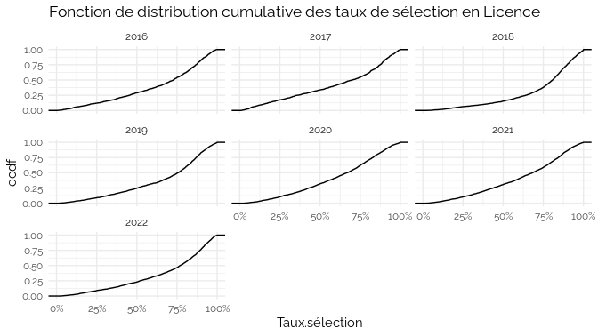
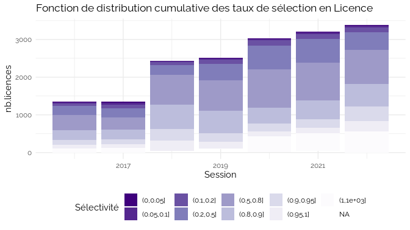
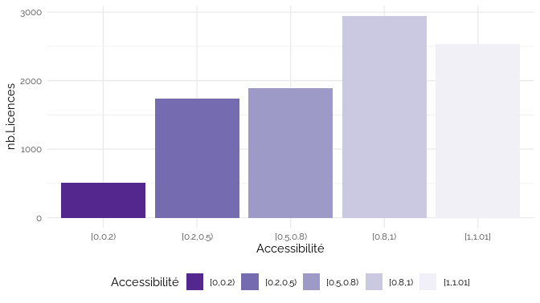
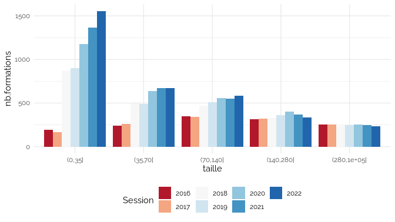
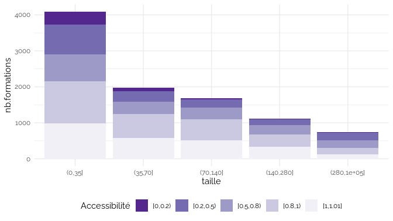
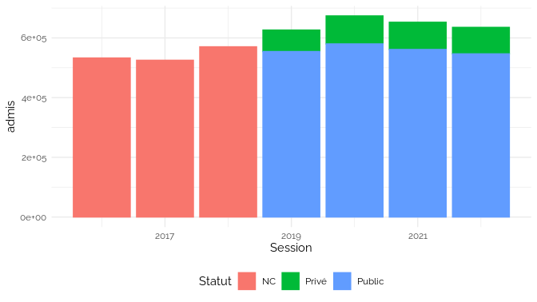
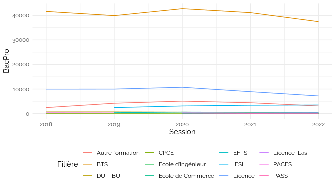

Parcoursup
================

## Données

-   <https://data.enseignementsup-recherche.gouv.fr/explore/dataset/fr-esr-parcoursup/information/>
-   <https://data.enseignementsup-recherche.gouv.fr/explore/dataset/fr-esr-parcoursup_2020/information/>
-   <https://data.enseignementsup-recherche.gouv.fr/explore/dataset/fr-esr-parcoursup-2019/information/>
-   <https://data.enseignementsup-recherche.gouv.fr/explore/dataset/fr-esr-parcoursup-2018/information/>

Voir les données

| x                                                                                                                                                |
|:-------------------------------------------------------------------------------------------------------------------------------------------------|
| Session                                                                                                                                          |
| Code.UAI.de.l.établissement                                                                                                                      |
| Établissement                                                                                                                                    |
| Code.départemental.de.l.établissement                                                                                                            |
| Département.de.l.établissement                                                                                                                   |
| Région.de.l.établissement                                                                                                                        |
| Académie.de.l.établissement                                                                                                                      |
| Filière.de.formation.très.agrégée                                                                                                                |
| Filière.de.formation                                                                                                                             |
| Filière.de.formation.détaillée                                                                                                                   |
| places                                                                                                                                           |
| candidats                                                                                                                                        |
| Rang.du.dernier.appelé                                                                                                                           |
| propositions                                                                                                                                     |
| admis                                                                                                                                            |
| Concours.communs.et.banques.d.épreuves                                                                                                           |
| Filière.de.formation.très.détaillée                                                                                                              |
| Lien.de.la.formation.sur.la.plateforme.Parcoursup                                                                                                |
| Coordonnées.GPS.de.la.formation                                                                                                                  |
| Dont.effectif.des.candidates.pour.une.formation                                                                                                  |
| Effectif.total.des.candidats.en.phase.principale                                                                                                 |
| Dont.effectif.des.candidats.ayant.postulé.en.internat                                                                                            |
| Effectif.des.candidats.néo.bacheliers.généraux.en.phase.principale                                                                               |
| Dont.effectif.des.candidats.boursiers.néo.bacheliers.généraux.en.phase.principale                                                                |
| Effectif.des.candidats.néo.bacheliers.technologiques.en.phase.principale                                                                         |
| Dont.effectif.des.candidats.boursiers.néo.bacheliers.technologiques.en.phase.principale                                                          |
| Effectif.des.candidats.néo.bacheliers.professionnels.en.phase.principale                                                                         |
| Dont.effectif.des.candidats.boursiers.néo.bacheliers.professionnels.en.phase.principale                                                          |
| Effectif.des.autres.candidats.en.phase.principale                                                                                                |
| Effectif.total.des.candidats.en.phase.complémentaire                                                                                             |
| Effectif.des.candidats.néo.bacheliers.généraux.en.phase.complémentaire                                                                           |
| Effectif.des.candidats.néo.bacheliers.technologique.en.phase.complémentaire                                                                      |
| Effectif.des.candidats.néo.bacheliers.professionnels.en.phase.complémentaire                                                                     |
| Effectifs.des.autres.candidats.en.phase.complémentaire                                                                                           |
| Effectif.total.des.candidats.classés.par.l.établissement.en.phase.principale                                                                     |
| Effectif.des.candidats.classés.par.l.établissement.en.phase.complémentaire                                                                       |
| Effectif.des.candidats.classés.par.l.établissement.en.internat..CPGE.                                                                            |
| Effectif.des.candidats.classés.par.l.établissement.hors.internat..CPGE.                                                                          |
| Effectif.des.candidats.néo.bacheliers.généraux.classés.par.l.établissement                                                                       |
| Dont.effectif.des.candidats.boursiers.néo.bacheliers.généraux.classés.par.l.établissement                                                        |
| Effectif.des.candidats.néo.bacheliers.technologiques.classés.par.l.établissement                                                                 |
| Dont.effectif.des.candidats.boursiers.néo.bacheliers.technologiques.classés.par.l.établissement                                                  |
| Effectif.des.candidats.néo.bacheliers.professionnels.classés.par.l.établissement                                                                 |
| Dont.effectif.des.candidats.boursiers.néo.bacheliers.professionnels.classés.par.l.établissement                                                  |
| Effectif.des.autres.candidats.classés.par.l.établissement                                                                                        |
| Dont.effectif.des.candidates.admises                                                                                                             |
| Effectif.des.admis.en.phase.principale                                                                                                           |
| Effectif.des.admis.en.phase.complémentaire                                                                                                       |
| Dont.effectif.des.admis.en.internat                                                                                                              |
| Dont.effectif.des.admis.boursiers.néo.bacheliers                                                                                                 |
| Effectif.des.admis.néo.bacheliers                                                                                                                |
| Effectif.des.admis.néo.bacheliers.généraux                                                                                                       |
| Effectif.des.admis.néo.bacheliers.technologiques                                                                                                 |
| Effectif.des.admis.néo.bacheliers.professionnels                                                                                                 |
| Effectif.des.autres.candidats.admis                                                                                                              |
| Dont.effectif.des.admis.néo.bacheliers.sans.information.sur.la.mention.au.bac                                                                    |
| Dont.effectif.des.admis.néo.bacheliers.sans.mention.au.bac                                                                                       |
| Dont.effectif.des.admis.néo.bacheliers.avec.mention.Assez.Bien.au.bac                                                                            |
| Dont.effectif.des.admis.néo.bacheliers.avec.mention.Bien.au.bac                                                                                  |
| Dont.effectif.des.admis.néo.bacheliers.avec.mention.Très.Bien.au.bac                                                                             |
| Effectif.des.admis.néo.bacheliers.généraux.ayant.eu.une.mention.au.bac                                                                           |
| Effectif.des.admis.néo.bacheliers.technologiques.ayant.eu.une.mention.au.bac                                                                     |
| Effectif.des.admis.néo.bacheliers.professionnels.ayant.eu.une.mention.au.bac                                                                     |
| Dont.effectif.des.admis.issus.du.même.établissement..BTS.CPGE.                                                                                   |
| Dont.effectif.des.admises.issues.du.même.établissement..BTS.CPGE.                                                                                |
| Dont.effectif.des.admis.issus.de.la.même.académie                                                                                                |
| Dont.effectif.des.admis.issus.de.la.même.académie..Paris.Créteil.Versailles.réunies.                                                             |
| X..d.admis.dont.filles                                                                                                                           |
| X..d.admis.néo.bacheliers.issus.de.la.même.académie                                                                                              |
| X..d.admis.néo.bacheliers.issus.de.la.même.académie..Paris.Créteil.Versailles.réunies.                                                           |
| X..d.admis.néo.bacheliers.issus.du.même.établissement..BTS.CPGE.                                                                                 |
| X..d.admis.néo.bacheliers.boursiers                                                                                                              |
| X..d.admis.néo.bacheliers                                                                                                                        |
| X..d.admis.néo.bacheliers.sans.information.sur.la.mention.au.bac                                                                                 |
| X..d.admis.néo.bacheliers.sans.mention.au.bac                                                                                                    |
| X..d.admis.néo.bacheliers.avec.mention.Assez.Bien.au.bac                                                                                         |
| X..d.admis.néo.bacheliers.avec.mention.Bien.au.bac                                                                                               |
| X..d.admis.néo.bacheliers.avec.mention.Très.Bien.au.bac                                                                                          |
| X..d.admis.néo.bacheliers.généraux                                                                                                               |
| Dont…d.admis.avec.mention                                                                                                                        |
| X..d.admis.néo.bacheliers.technologiques                                                                                                         |
| Dont…d.admis.avec.mention.1                                                                                                                      |
| X..d.admis.néo.bacheliers.professionnels                                                                                                         |
| Dont…d.admis.avec.mention.2                                                                                                                      |
| tri                                                                                                                                              |
| Statut.de.l.établissement.de.la.filière.de.formation..public..privé..                                                                            |
| Dont.effectif.des.admis.ayant.reçu.leur.proposition.d.admission.à.l.ouverture.de.la.procédure.principale                                         |
| Dont.effectif.des.admis.ayant.reçu.leur.proposition.d.admission.avant.le.baccalauréat                                                            |
| Dont.effectif.des.admis.ayant.reçu.leur.proposition.d.admission.avant.la.fin.de.la.procédure.principale                                          |
| X..d.admis.ayant.reçu.leur.proposition.d.admission.à.l.ouverture.de.la.procédure.principale                                                      |
| X..d.admis.ayant.reçu.leur.proposition.d.admission.avant.le.baccalauréat                                                                         |
| X..d.admis.ayant.reçu.leur.proposition.d.admission.avant.la.fin.de.la.procédure.principale                                                       |
| Sélectivité                                                                                                                                      |
| Libellé.formation                                                                                                                                |
| Effectif.des.candidats.en.terminale.générale.ayant.reçu.une.proposition.d.admission.de.la.part.de.l.établissement                                |
| Dont.effectif.des.candidats.boursiers.en.terminale.générale.ayant.reçu.une.proposition.d.admission.de.la.part.de.l.établissement                 |
| Effectif.des.candidats.en.terminale.technologique.ayant.reçu.une.proposition.d.admission.de.la.part.de.l.établissement                           |
| Dont.effectif.des.candidats.boursiers.en.terminale.technologique.ayant.reçu.une.proposition.d.admission.de.la.part.de.l.établissement            |
| Effectif.des.candidats.en.terminale.professionnelle.ayant.reçu.une.proposition.d.admission.de.la.part.de.l.établissement                         |
| Dont.effectif.des.candidats.boursiers.en.terminale.générale.professionnelle.ayant.reçu.une.proposition.d.admission.de.la.part.de.l.établissement |
| Effectif.des.autres.candidats.ayant.reçu.une.proposition.d.admission.de.la.part.de.l.établissement                                               |
| Regroupement.1.effectué.par.les.formations.pour.les.classements                                                                                  |
| Rang.du.dernier.appelé.du.groupe.1                                                                                                               |
| Regroupement.2.effectué.par.les.formations.pour.les.classements                                                                                  |
| Rang.du.dernier.appelé.du.groupe.2                                                                                                               |
| Regroupement.3.effectué.par.les.formations.pour.les.classements                                                                                  |
| Rang.du.dernier.appelé.du.groupe.3                                                                                                               |
| Regroupement.4.effectué.par.les.formations.pour.les.classements                                                                                  |
| Rang.du.dernier.appelé.du.groupe.4                                                                                                               |
| Regroupement.5.effectué.par.les.formations.pour.les.classements                                                                                  |
| Rang.du.dernier.appelé.du.groupe.5                                                                                                               |
| Taux.d.accès.des.candidats.ayant.postulé.à.la.formation..ratio.entre.le.dernier.appelé.et.le.nombre.vœux.PP.                                     |
| Dont.taux.d.accès.des.candidats.ayant.un.bac.professionnel.ayant.postulé.à.la.formation                                                          |
| Dont.taux.d.accès.des.candidats.ayant.un.bac.général.ayant.postulé.à.la.formation                                                                |
| Dont.taux.d.accès.des.candidats.ayant.un.bac.technologique.ayant.postulé.à.la.formation                                                          |
| COD_AFF_FORM                                                                                                                                     |
| Commune.de.l.établissement                                                                                                                       |
| Dont.effectif.des.admis.néo.bacheliers.avec.mention.Très.Bien.avec.félicitations.au.bac                                                          |
| X..d.admis.néo.bacheliers.avec.mention.Très.Bien.avec.félicitations.au.bac                                                                       |
| Dont…d.admis.avec.mention..BG.                                                                                                                   |
| Dont…d.admis.avec.mention..BT.                                                                                                                   |
| Dont…d.admis.avec.mention..BP.                                                                                                                   |
| list_com                                                                                                                                         |
| LIB_FOR_VOE_INS                                                                                                                                  |
| detail_forma2                                                                                                                                    |
| etablissement_id_paysage                                                                                                                         |
| composante_id_paysage                                                                                                                            |
| rdda                                                                                                                                             |
| Taux.sélection                                                                                                                                   |
| taux.accès                                                                                                                                       |
| Accessibilité                                                                                                                                    |
| taille                                                                                                                                           |

## Licence

### Sélectivité

Le taux de sélection est calculé comme le rang du dernier appelé divisé
par le nombre de candidatures : à 100%, tous les candidats ont été
appelé ; à 10%, seul un candidat sur 10 a été appelé.

#### Disponibilité du rang du dernier appelé

RDDA supérieur au nombre de candidats

Voir les données

| Session |   n |
|--------:|----:|
|    2016 | 114 |
|    2017 | 122 |
|    2019 |   2 |
|    2020 | 420 |
|    2021 | 470 |

#### Sélectivité

Voir les données

|       | Session | Établissement                                 | Filière.de.formation                      | Filière.de.formation.détaillée | places | candidats | rdda | ratio |
|:------|:--------|:----------------------------------------------|:------------------------------------------|:-------------------------------|:-------|:----------|:-----|:------|
| 1     | 2016    | Université Paris 2 Panthéon - Assas           | Arts, Lettres, Langues, SHS               | Information et communication   | 30     | 5001      | 31   | 0.01  |
| 2     | 2016    | Université Paris 1 Panthéon Sorbonne          | Droit - Sciences Politiques               | Science politique              | 53     | 4868      | 40   | 0.01  |
| 3     | 2016    | Université Sorbonne Nouvelle Paris 3          | Arts, Lettres, Langues, SHS               | Information et communication   | 112    | 8387      | 73   | 0.01  |
| 4     | 2017    | Université Sorbonne Nouvelle Paris 3          | Arts, Lettres, Langues, SHS               | Information et communication   | 112    | 9252      | 83   | 0.01  |
| …     | …       | NA                                            | NA                                        | NA                             | …      | …         | …    | …     |
| 13719 | 2020    | Université de Bordeaux - Antenne de Périgueux | Licence - Droit-économie-gestion          | Droit                          | 30     | 557       | 4764 | 8.55  |
| 13720 | 2021    | Université Savoie Mont Blanc - Bourget-du-Lac | Licence - Sciences - technologies - santé | Informatique                   | 5      | 47        | 436  | 9.28  |
| 13721 | 2021    | Université de Bordeaux - Antenne d’Agen       | Licence - Droit-économie-gestion          | Droit                          | 30     | 864       | 8113 | 9.39  |
| 13722 | 2020    | Université de Bordeaux - Antenne d’Agen       | Licence - Droit-économie-gestion          | Droit                          | 30     | 537       | 7294 | 13.58 |

    ## Scale for 'x' is already present. Adding another scale for 'x', which will
    ## replace the existing scale.

    ## Warning: Removed 1315 rows containing non-finite values (stat_ecdf).

<!-- -->

    ## `summarise()` has grouped output by 'Session'. You can override using the
    ## `.groups` argument.

<!-- -->

### taux d’accès en 2021

Disponibilité des données :

    ## `summarise()` has grouped output by 'Session'. You can override using the
    ## `.groups` argument.

    ## # A tibble: 8 × 3
    ## # Groups:   Session [6]
    ##   Session check     n
    ##     <int> <lgl> <int>
    ## 1    2016 FALSE  1353
    ## 2    2017 FALSE  1352
    ## 3    2018 FALSE  2434
    ## 4    2019 FALSE  2521
    ## 5    2020 FALSE     7
    ## 6    2020 TRUE   3028
    ## 7    2021 FALSE     8
    ## 8    2021 TRUE   3206

<!-- -->

<!-- -->

Voir les données

| Accessibilité | nb.Licences | nb.admis | part.licences | part.admis |
|:--------------|------------:|---------:|:--------------|:-----------|
| \[0,0.2)      |         314 |    12838 | 5.0%          | 2.12%      |
| \[0.2,0.5)    |        1090 |   122179 | 17.5%         | 20.18%     |
| \[0.5,0.8)    |        1269 |   150370 | 20.4%         | 24.83%     |
| \[0.8,1)      |        1832 |   167800 | 29.4%         | 27.71%     |
| \[1,1.01\]    |        1729 |   152342 | 27.7%         | 25.16%     |

### Par filière

    ## `summarise()` has grouped output by 'Accessibilité'. You can override using the
    ## `.groups` argument.

<!-- -->

    ## `summarise()` has grouped output by 'Accessibilité'. You can override using the
    ## `.groups` argument.

<!-- -->

    ## `summarise()` has grouped output by 'Accessibilité'. You can override using the
    ## `.groups` argument.

<!-- -->

### Par admission

<!-- -->

    ## `summarise()` has grouped output by 'Accessibilité'. You can override using the
    ## `.groups` argument.

<!-- -->

    ## `summarise()` has grouped output by 'Accessibilité'. You can override using the
    ## `.groups` argument.

<!-- -->

### Taille formation

    ## `summarise()` has grouped output by 'Session'. You can override using the
    ## `.groups` argument.

<!-- -->

    ## `summarise()` has grouped output by 'Accessibilité'. You can override using the
    ## `.groups` argument.

<!-- -->

## Diversification des formations publiques

    ## `summarise()` has grouped output by 'Session'. You can override using the
    ## `.groups` argument.

<!-- -->

### Bac Pro

    ## `summarise()` has grouped output by 'Session'. You can override using the
    ## `.groups` argument.

<!-- -->

### Droit eco gestion

    ## `summarise()` has grouped output by 'Session'. You can override using the
    ## `.groups` argument.

<!-- -->

    ## Warning: Removed 2 rows containing non-finite values (stat_boxplot).

<!-- -->

    ## Warning: Removed 1 rows containing missing values (geom_point).

<!-- -->
