Plongée dans l’INSEE
================

-   T101 Activité, emploi et chômage en 2020 et en séries longues
    <https://www.insee.fr/fr/statistiques/5359497?sommaire=5359511&q=Population+active+au+sens+du+BIT+-%20S%C3%A9ries+longues#consulter>
-   chômage/diplome :
    <https://www.insee.fr/fr/statistiques/4498649?sommaire=4498692&q=Taux+de+ch%C3%B4mage+selon+le+niveau+de+dipl%C3%B4me>
-   fm.T6 La situation démographique en 2019
    <https://www.insee.fr/fr/statistiques/5390418?sommaire=5390468>
-   NEET : <https://www.insee.fr/fr/statistiques/5346969>
-   Effectifs d’élèves et d’étudiants :
    <https://www.insee.fr/fr/statistiques/2387291>

## Taux d’emploi des 25-49 par niveau de diplôme

<!-- -->

<!-- -->

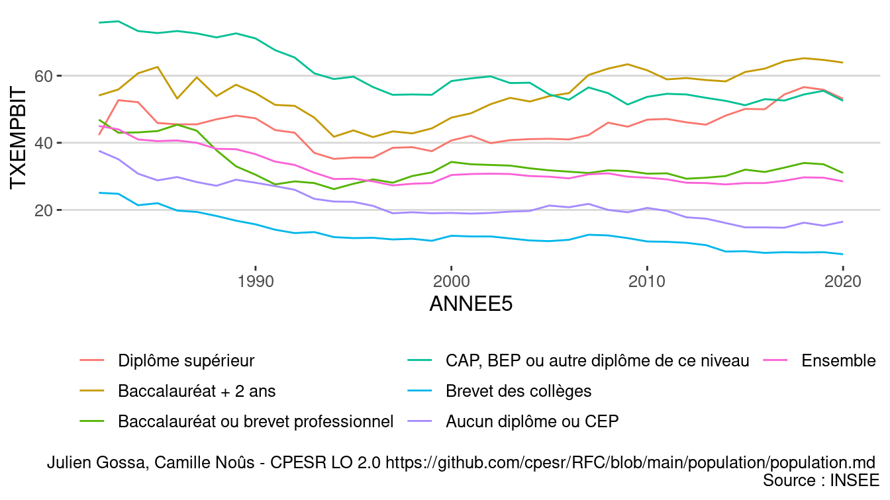<!-- -->

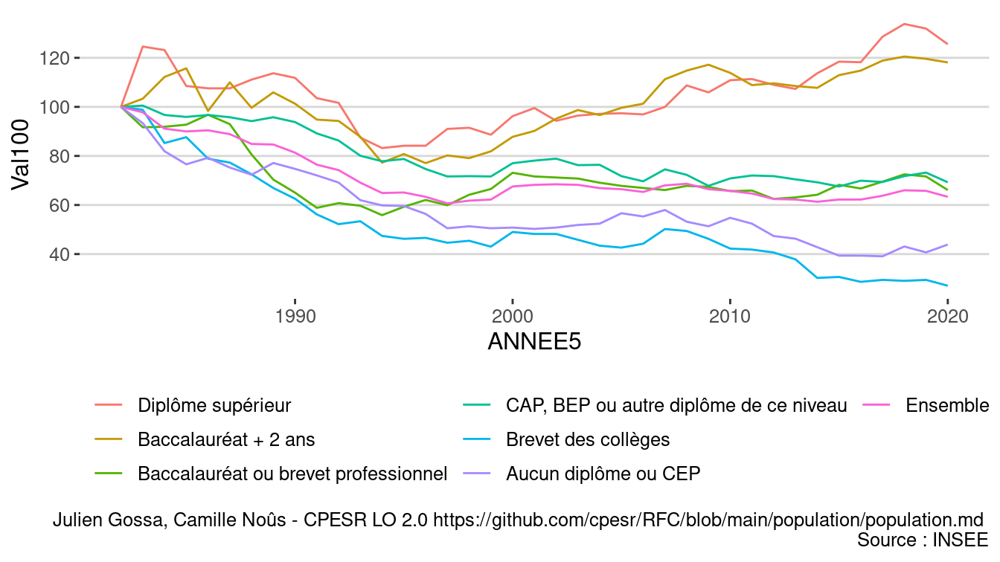<!-- -->

## Eleve du secondaire et étudiants du supérieur

<!-- -->

<!-- -->

<!-- -->

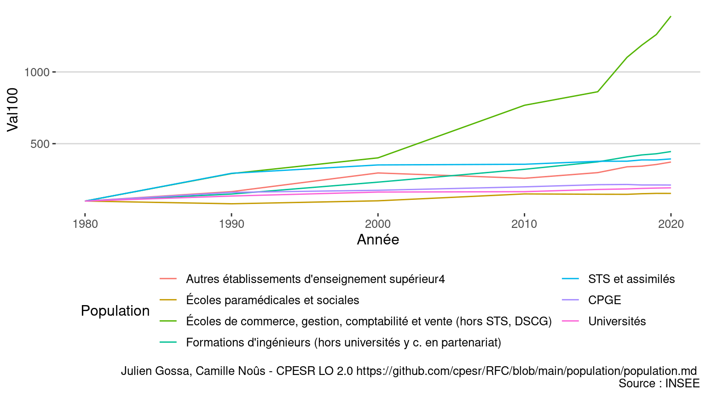<!-- -->

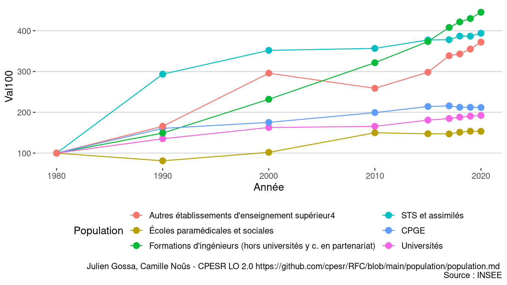<!-- -->

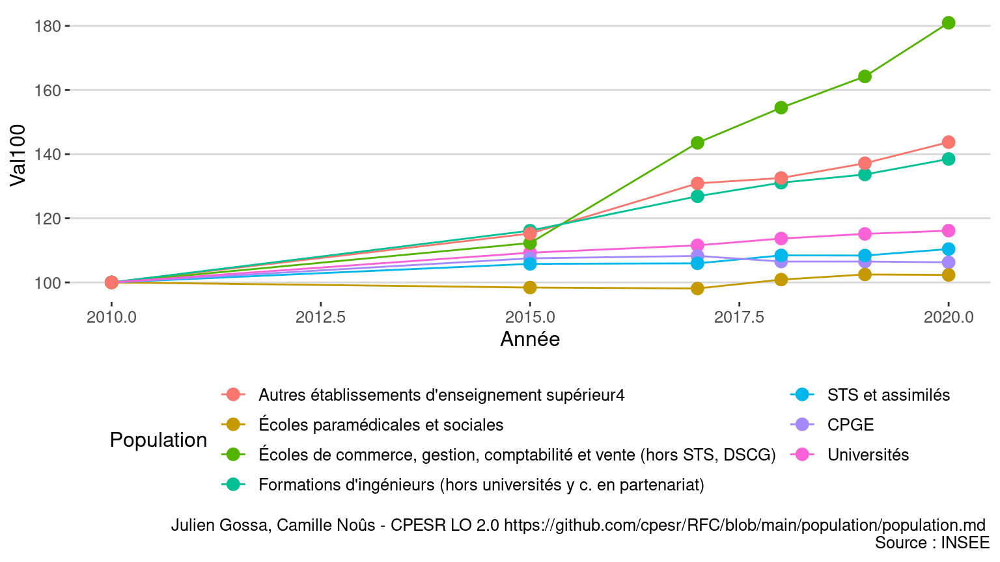<!-- -->

<!-- -->

<!-- -->

## Population active 15-29 au sens du BIT

<!-- -->

## Population totale des 15-29

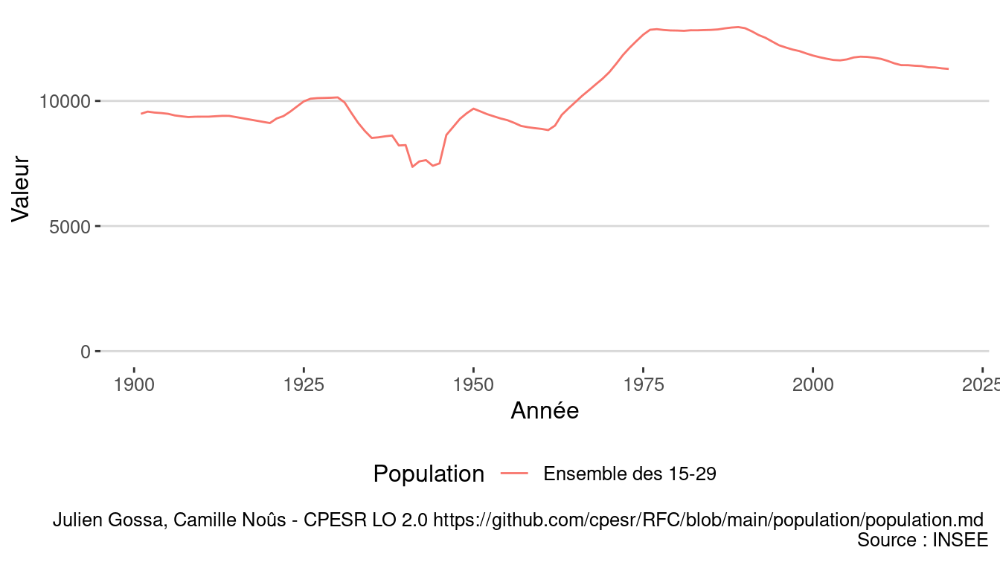<!-- -->

## Les jeunes

<!-- -->

<!-- -->

<!-- -->

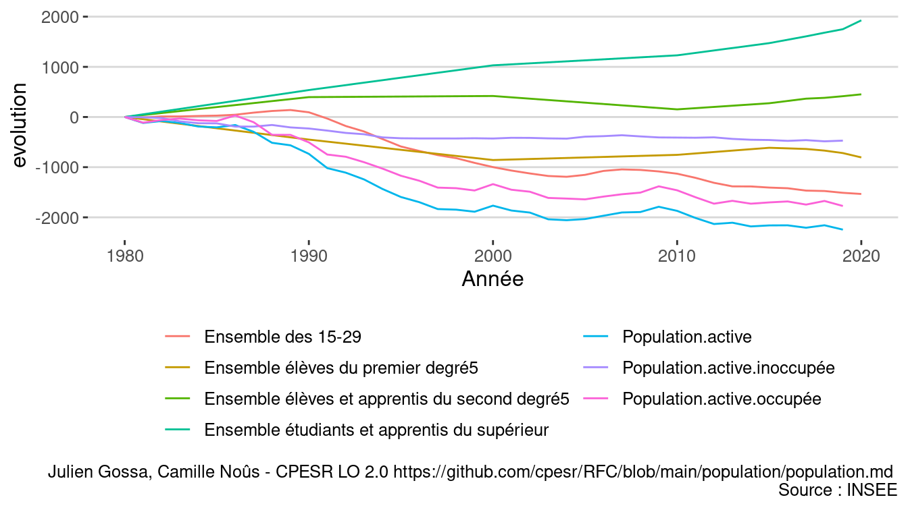<!-- -->

<!-- -->

<!-- -->

## Simulation Transfer etu -&gt; innocupés

<!-- -->

## Saphire

<https://www.insee.fr/fr/statistiques/4995124?sommaire=2414232>

## Check

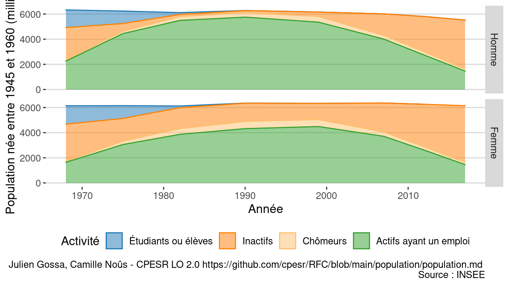<!-- -->

<!-- -->

    ## # A tibble: 2 × 8
    ##   Année   Age Sexe  Diplôme        Secteur.activité Activité CSP      Population
    ##   <int> <int> <fct> <fct>          <fct>            <fct>    <fct>         <dbl>
    ## 1  1975    15 Homme Personnes de … Inactifs ou chô… Inactifs Inactif…     411565
    ## 2  1975    15 Femme Personnes de … Inactifs ou chô… Inactifs Inactif…     394185

### Toute la population

<!-- -->

### Toute la population en 2017

<!-- -->
<!-- -->

<!-- -->

<!-- -->

### Suivi de cohorte

<!-- --><!-- --><!-- --><!-- --><!-- --><!-- --><!-- --><!-- -->

### 16-29

<!-- -->

<!-- -->

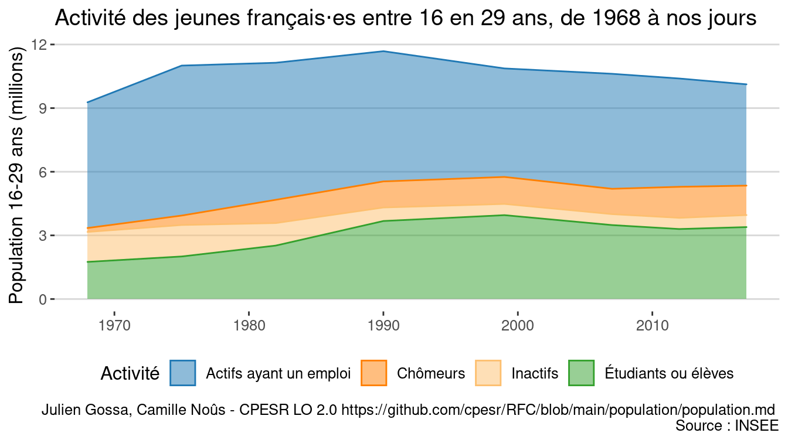<!-- -->

| Année |               Activité |  Population | Val100 | Différence |
|------:|-----------------------:|------------:|-------:|-----------:|
|  1968 | Actifs ayant un emploi |   5 925 316 |    100 |          0 |
|  1968 |               Chômeurs |     184 720 |    100 |          0 |
|  1968 |               Inactifs | 1 412 564.0 |    100 |          0 |
|  1968 |   Inactifs et chômeurs |   1 597 284 |    100 |          0 |
|  1968 |    Étudiants ou élèves |   1 751 000 |    100 |          0 |
|  1968 |               Ensemble |   9 273 600 |    100 |          0 |
|  1975 | Actifs ayant un emploi |   7 070 060 |    119 |       1145 |
|  1975 |               Chômeurs |     444 030 |    240 |        259 |
|  1975 |               Inactifs | 1 484 995.0 |    105 |         72 |
|  1975 |   Inactifs et chômeurs |   1 929 025 |    121 |        332 |
|  1975 |    Étudiants ou élèves |   2 005 910 |    115 |        255 |
|  1975 |               Ensemble |  11 004 995 |    119 |       1731 |
|  1982 | Actifs ayant un emploi |   6 460 016 |    109 |        535 |
|  1982 |               Chômeurs |   1 096 728 |    594 |        912 |
|  1982 |               Inactifs | 1 061 764.0 |     75 |       -351 |
|  1982 |   Inactifs et chômeurs |   2 158 492 |    135 |        561 |
|  1982 |    Étudiants ou élèves |   2 520 028 |    144 |        769 |
|  1982 |               Ensemble |  11 138 536 |    120 |       1865 |
|  1990 | Actifs ayant un emploi |   6 139 491 |    104 |        214 |
|  1990 |               Chômeurs |   1 228 194 |    665 |       1043 |
|  1990 |               Inactifs |   637 802.0 |     45 |       -775 |
|  1990 |   Inactifs et chômeurs |   1 865 996 |    117 |        269 |
|  1990 |    Étudiants ou élèves |   3 677 947 |    210 |       1927 |
|  1990 |               Ensemble |  11 683 434 |    126 |       2410 |
|  1999 | Actifs ayant un emploi |   5 114 894 |     86 |       -810 |
|  1999 |               Chômeurs |   1 271 810 |    689 |       1087 |
|  1999 |               Inactifs |   529 740.0 |     38 |       -883 |
|  1999 |   Inactifs et chômeurs |   1 801 550 |    113 |        204 |
|  1999 |    Étudiants ou élèves |   3 954 198 |    226 |       2203 |
|  1999 |               Ensemble |  10 870 642 |    117 |       1597 |
|  2007 | Actifs ayant un emploi |   5 421 309 |     91 |       -504 |
|  2007 |               Chômeurs |   1 193 363 |    646 |       1009 |
|  2007 |               Inactifs |   517 018.1 |     37 |       -896 |
|  2007 |   Inactifs et chômeurs |   1 710 381 |    107 |        113 |
|  2007 |    Étudiants ou élèves |   3 486 265 |    199 |       1735 |
|  2007 |               Ensemble |  10 617 955 |    114 |       1344 |
|  2012 | Actifs ayant un emploi |   5 105 583 |     86 |       -820 |
|  2012 |               Chômeurs |   1 462 360 |    792 |       1278 |
|  2012 |               Inactifs |   528 485.6 |     37 |       -884 |
|  2012 |   Inactifs et chômeurs |   1 990 845 |    125 |        394 |
|  2012 |    Étudiants ou élèves |   3 299 653 |    188 |       1549 |
|  2012 |               Ensemble |  10 396 081 |    112 |       1122 |
|  2017 | Actifs ayant un emploi |   4 774 729 |     81 |      -1151 |
|  2017 |               Chômeurs |   1 387 958 |    751 |       1203 |
|  2017 |               Inactifs |   567 615.0 |     40 |       -845 |
|  2017 |   Inactifs et chômeurs |   1 955 573 |    122 |        358 |
|  2017 |    Étudiants ou élèves |   3 391 129 |    194 |       1640 |
|  2017 |               Ensemble |  10 121 431 |    109 |        848 |

<!-- -->

| Année |               Activité | Population |
|------:|-----------------------:|-----------:|
|  1968 | Actifs ayant un emploi |  5 925.316 |
|  1968 |               Inactifs |  1 412.564 |
|  1968 |               Chômeurs |    184.720 |
|  1968 |            Amortisseur |      0.000 |
|  1968 |    Étudiants ou élèves |  1 751.000 |
|  1975 | Actifs ayant un emploi |  7 070.060 |
|  1975 |               Inactifs |  1 484.995 |
|  1975 |               Chômeurs |    444.030 |
|  1975 |            Amortisseur |    254.910 |
|  1975 |    Étudiants ou élèves |  1 751.000 |
|  1982 | Actifs ayant un emploi |  6 460.016 |
|  1982 |               Inactifs |  1 061.764 |
|  1982 |               Chômeurs |  1 096.728 |
|  1982 |            Amortisseur |    769.028 |
|  1982 |    Étudiants ou élèves |  1 751.000 |
|  1990 | Actifs ayant un emploi |  6 139.491 |
|  1990 |               Inactifs |    637.802 |
|  1990 |               Chômeurs |  1 228.194 |
|  1990 |            Amortisseur |  1 926.947 |
|  1990 |    Étudiants ou élèves |  1 751.000 |
|  1999 | Actifs ayant un emploi |  5 114.894 |
|  1999 |               Inactifs |    529.740 |
|  1999 |               Chômeurs |  1 271.810 |
|  1999 |            Amortisseur |  2 203.198 |
|  1999 |    Étudiants ou élèves |  1 751.000 |
|  2007 | Actifs ayant un emploi | 5 421.3090 |
|  2007 |               Inactifs |   517.0181 |
|  2007 |               Chômeurs | 1 193.3630 |
|  2007 |            Amortisseur | 1 735.2652 |
|  2007 |    Étudiants ou élèves | 1 751.0000 |
|  2012 | Actifs ayant un emploi | 5 105.5834 |
|  2012 |               Inactifs |   528.4856 |
|  2012 |               Chômeurs | 1 462.3596 |
|  2012 |            Amortisseur | 1 548.6526 |
|  2012 |    Étudiants ou élèves | 1 751.0000 |
|  2017 | Actifs ayant un emploi |  4 774.729 |
|  2017 |               Inactifs |    567.615 |
|  2017 |               Chômeurs |  1 387.958 |
|  2017 |            Amortisseur |  1 640.129 |
|  2017 |    Étudiants ou élèves |  1 751.000 |

### Etudiants ou élèves

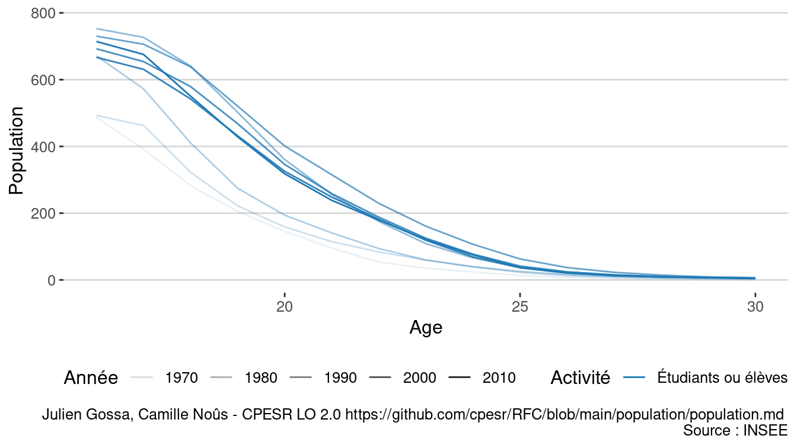<!-- -->

<!-- -->

<!-- -->

### Niveau de diplomation

<!-- -->

| Année |                                 Diplôme | Population | part | val100 |     evol |
|------:|----------------------------------------:|-----------:|-----:|-------:|---------:|
|  1968 |                           Aucun diplôme | 14 212 564 | 0.43 |    100 |        0 |
|  1968 |                              Niveau CEP | 10 610 316 | 0.32 |    100 |        0 |
|  1968 |                             Niveau BEPC |  1 672 940 | 0.05 |    100 |        0 |
|  1968 |                          Niveau CAP-BEP |  3 441 788 | 0.10 |    100 |        0 |
|  1968 |         Niveau BAC général ou technique |  1 845 400 | 0.06 |    100 |        0 |
|  1968 |       Diplôme supérieur au Baccalauréat |  1 092 992 | 0.03 |    100 |        0 |
|  1975 |                           Aucun diplôme | 12 813 645 | 0.37 |     90 | -1398919 |
|  1975 |                              Niveau CEP |  9 876 430 | 0.29 |     93 |  -733886 |
|  1975 |                             Niveau BEPC |  2 204 030 | 0.06 |    132 |   531090 |
|  1975 |                          Niveau CAP-BEP |  4 920 100 | 0.14 |    143 |  1478312 |
|  1975 |         Niveau BAC général ou technique |  2 523 570 | 0.07 |    137 |   678170 |
|  1975 |       Diplôme supérieur au Baccalauréat |  2 147 105 | 0.06 |    196 |  1054113 |
|  1982 |                           Aucun diplôme | 13 378 380 | 0.37 |     94 |  -834184 |
|  1982 |                              Niveau CEP |  8 261 484 | 0.23 |     78 | -2348832 |
|  1982 |                             Niveau BEPC |  2 463 612 | 0.07 |    147 |   790672 |
|  1982 |                          Niveau CAP-BEP |  6 007 260 | 0.17 |    175 |  2565472 |
|  1982 |         Niveau BAC général ou technique |  3 270 280 | 0.09 |    177 |  1424880 |
|  1982 |      Diplôme universitaire de 1er cycle |  1 524 128 | 0.04 |    100 |        0 |
|  1982 | Diplôme universitaire de 2e ou 3e cycle |  1 437 704 | 0.04 |    100 |        0 |
|  1990 |                           Aucun diplôme | 10 801 383 | 0.28 |     76 | -3411181 |
|  1990 |                              Niveau CEP |  8 178 864 | 0.21 |     77 | -2431452 |
|  1990 |                             Niveau BEPC |  3 089 413 | 0.08 |    185 |  1416473 |
|  1990 |                          Niveau CAP-BEP |  8 332 973 | 0.21 |    242 |  4891185 |
|  1990 |         Niveau BAC général ou technique |  4 200 257 | 0.11 |    228 |  2354857 |
|  1990 |      Diplôme universitaire de 1er cycle |  2 244 456 | 0.06 |    147 |   720328 |
|  1990 | Diplôme universitaire de 2e ou 3e cycle |  2 143 131 | 0.05 |    149 |   705427 |
|  1999 |                           Aucun diplôme |  7 795 757 | 0.19 |     55 | -6416807 |
|  1999 |                              Niveau CEP |  7 159 041 | 0.17 |     67 | -3451275 |
|  1999 |                             Niveau BEPC |  3 393 505 | 0.08 |    203 |  1720565 |
|  1999 |                          Niveau CAP-BEP | 10 395 254 | 0.25 |    302 |  6953466 |
|  1999 |         Niveau BAC général ou technique |  5 086 435 | 0.12 |    276 |  3241035 |
|  1999 |      Diplôme universitaire de 1er cycle |  3 555 840 | 0.09 |    233 |  2031712 |
|  1999 | Diplôme universitaire de 2e ou 3e cycle |  3 708 509 | 0.09 |    258 |  2270805 |
|  2007 |                           Aucun diplôme |  7 813 274 | 0.18 |     55 | -6399290 |
|  2007 |                              Niveau CEP |  5 348 485 | 0.12 |     50 | -5261831 |
|  2007 |                             Niveau BEPC |  3 000 191 | 0.07 |    179 |  1327251 |
|  2007 |                          Niveau CAP-BEP | 10 905 212 | 0.24 |    317 |  7463424 |
|  2007 |         Niveau BAC général ou technique |  7 008 824 | 0.16 |    380 |  5163424 |
|  2007 |      Diplôme universitaire de 1er cycle |  5 063 055 | 0.11 |    332 |  3538927 |
|  2007 | Diplôme universitaire de 2e ou 3e cycle |  5 386 843 | 0.12 |    375 |  3949139 |
|  2012 |                           Aucun diplôme |  7 216 211 | 0.16 |     51 | -6996353 |
|  2012 |                              Niveau CEP |  4 526 480 | 0.10 |     43 | -6083836 |
|  2012 |                             Niveau BEPC |  2 887 176 | 0.06 |    173 |  1214236 |
|  2012 |                          Niveau CAP-BEP | 11 114 800 | 0.24 |    323 |  7673012 |
|  2012 |         Niveau BAC général ou technique |  7 843 636 | 0.17 |    425 |  5998236 |
|  2012 |      Diplôme universitaire de 1er cycle |  5 903 363 | 0.13 |    387 |  4379235 |
|  2012 | Diplôme universitaire de 2e ou 3e cycle |  6 335 725 | 0.14 |    441 |  4898021 |
|  2017 |                           Aucun diplôme |  5 936 361 | 0.13 |     42 | -8276203 |
|  2017 |                              Niveau CEP |  3 742 141 | 0.08 |     35 | -6868175 |
|  2017 |                             Niveau BEPC |  2 709 007 | 0.06 |    162 |  1036067 |
|  2017 |                          Niveau CAP-BEP | 11 787 741 | 0.25 |    342 |  8345953 |
|  2017 |         Niveau BAC général ou technique |  8 129 366 | 0.17 |    441 |  6283966 |
|  2017 |      Diplôme universitaire de 1er cycle |  5 260 868 | 0.11 |    345 |  3736740 |
|  2017 | Diplôme universitaire de 2e ou 3e cycle |  8 989 408 | 0.19 |    625 |  7551704 |

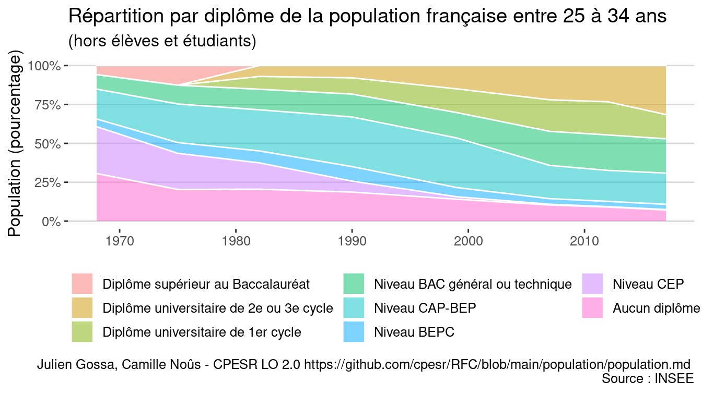<!-- -->

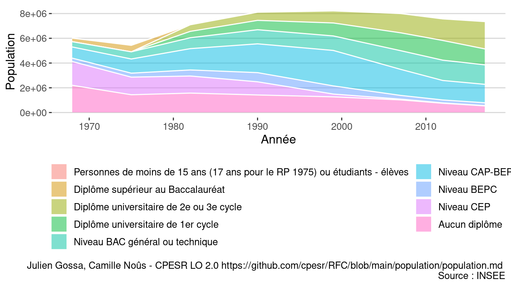<!-- -->

### GIF

<!-- -->

<!-- -->

## Pyramidage étudiants

<!-- -->

<!-- -->

<!-- -->

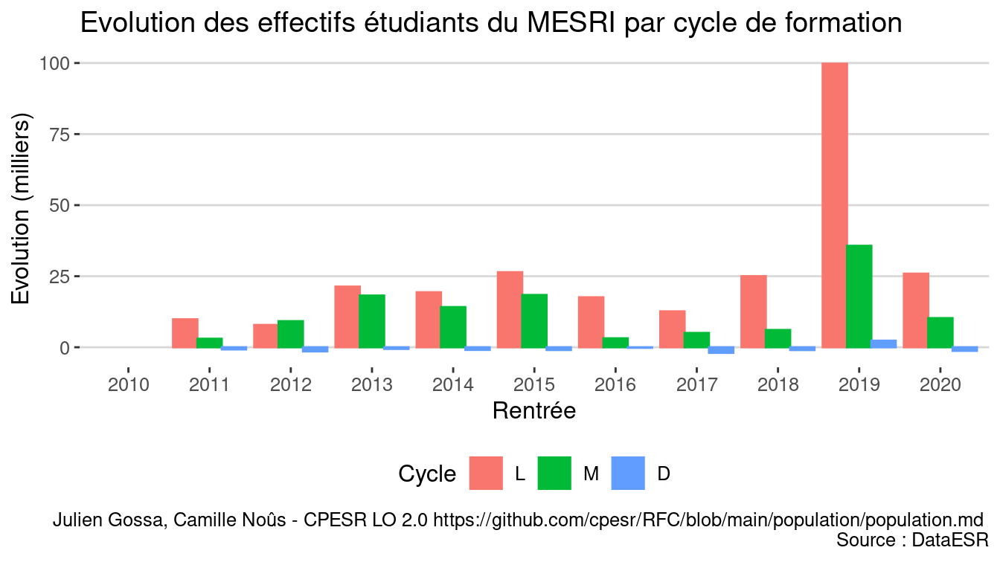<!-- -->
