Plongée dans l’INSEE
================

-   T101 Activité, emploi et chômage en 2020 et en séries longues
    <https://www.insee.fr/fr/statistiques/5359497?sommaire=5359511&q=Population+active+au+sens+du+BIT+-%20S%C3%A9ries+longues#consulter>
-   chômage/diplome :
    <https://www.insee.fr/fr/statistiques/4498649?sommaire=4498692&q=Taux+de+ch%C3%B4mage+selon+le+niveau+de+dipl%C3%B4me>
-   fm.T6 La situation démographique en 2019
    <https://www.insee.fr/fr/statistiques/5390418?sommaire=5390468>
-   NEET : <https://www.insee.fr/fr/statistiques/5346969>
-   Effectifs d’élèves et d’étudiants :
    <https://www.insee.fr/fr/statistiques/2387291>

## chômage des 25-49 par niveau de diplôme

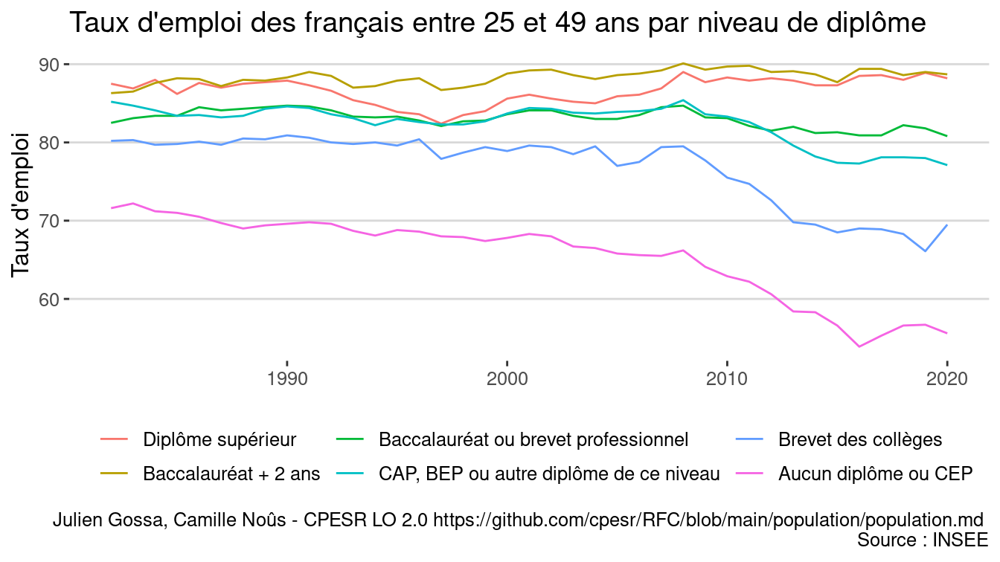<!-- -->

## Eleve du secondaire et étudiants du supérieur

<!-- --><!-- -->

## Population active 15-29 au sens du BIT

<!-- -->

## Population totale des 15-29

<!-- -->

## Les jeunes

<!-- -->

<!-- -->

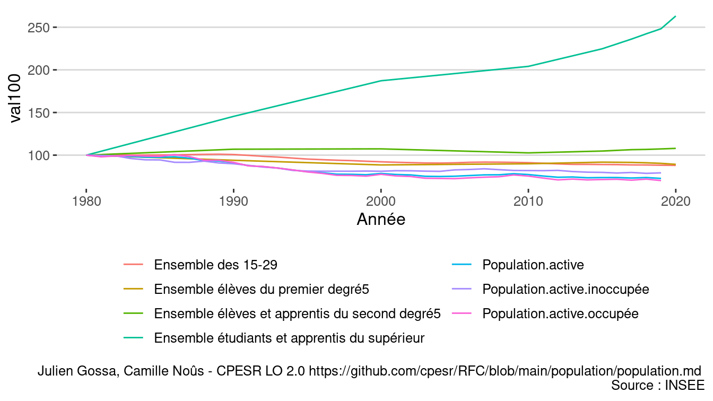<!-- -->

<!-- -->

<!-- -->

<!-- -->

## Simulation Transfer etu -&gt; innocupés

<!-- -->

## Saphire

<https://www.insee.fr/fr/statistiques/4995124?sommaire=2414232>

## Check

<!-- -->

<!-- -->

    ## # A tibble: 2 × 8
    ##   Année   Age Sexe  Diplôme        Secteur.activité Activité CSP      Population
    ##   <int> <int> <fct> <fct>          <fct>            <fct>    <fct>         <dbl>
    ## 1  1975    15 Homme Personnes de … Inactifs ou chô… Inactifs Inactif…     411565
    ## 2  1975    15 Femme Personnes de … Inactifs ou chô… Inactifs Inactif…     394185

### Toute la population

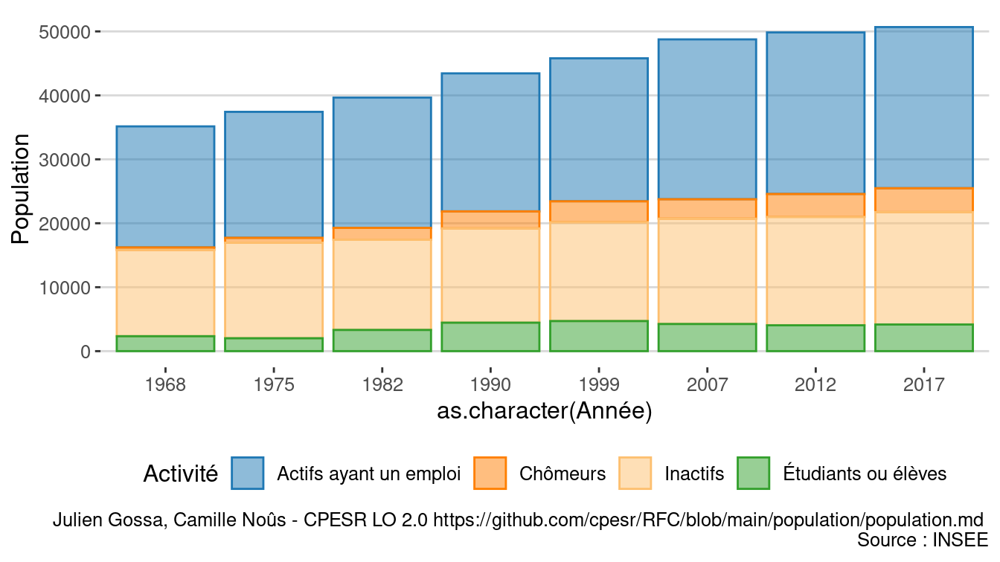<!-- -->

### Toute la population en 2017

<!-- -->
<!-- -->

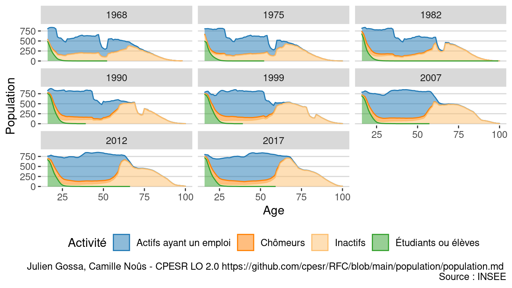<!-- -->

<!-- -->

### Suivi de cohorte

<!-- --><!-- -->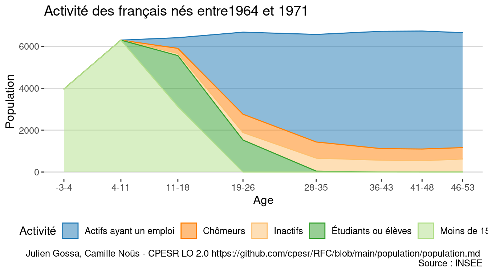<!-- -->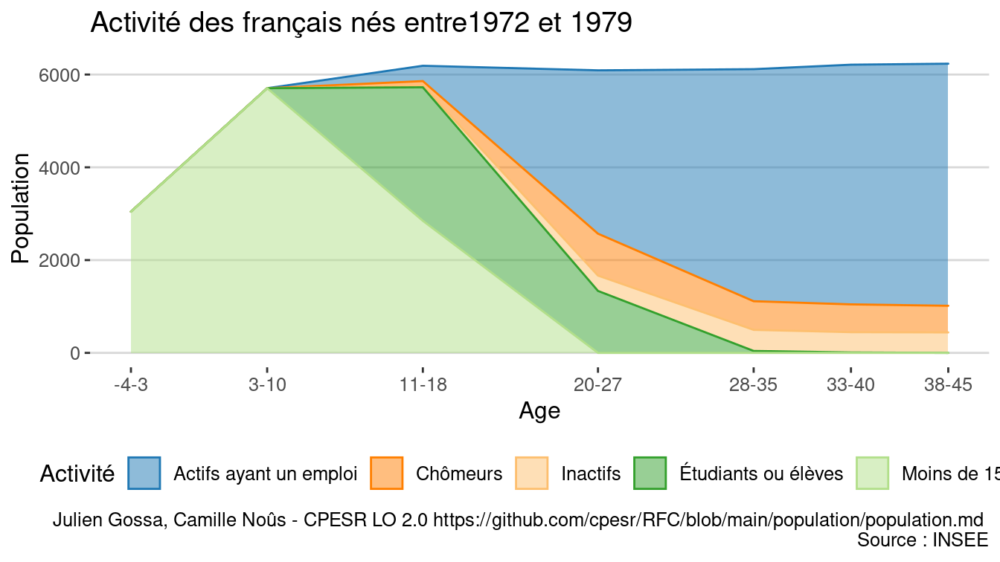<!-- -->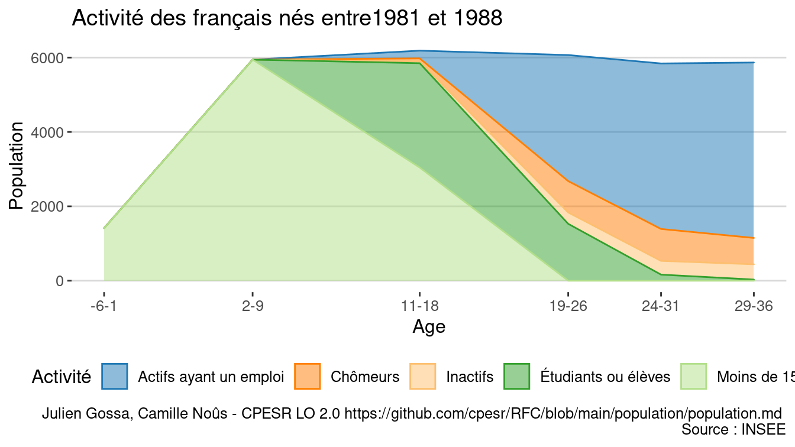<!-- --><!-- -->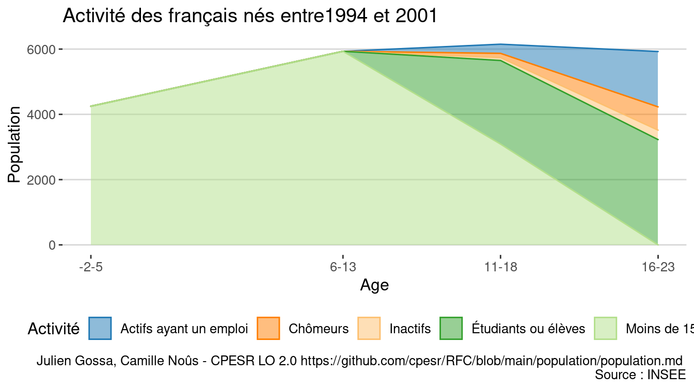<!-- --><!-- -->

### 16-29

<!-- -->

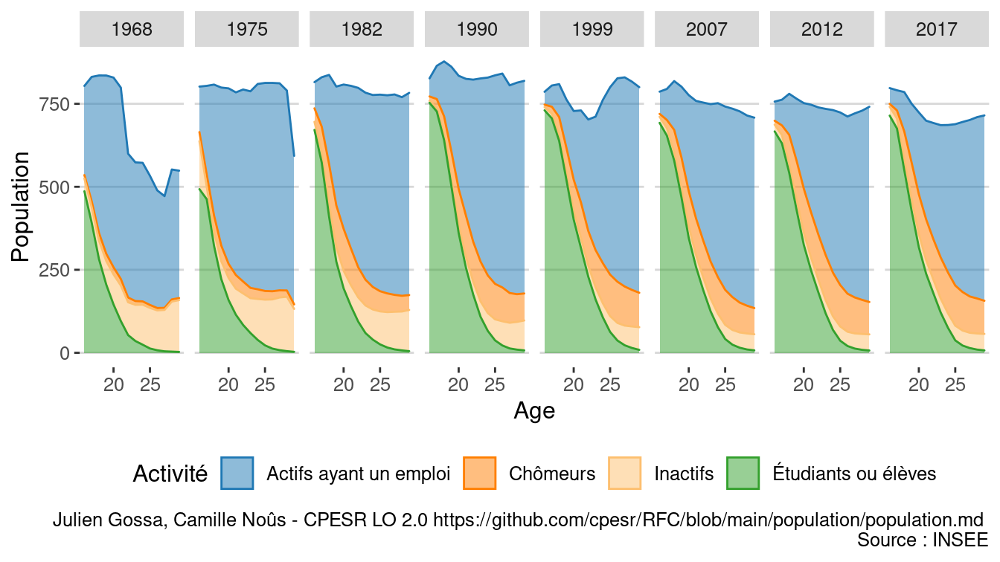<!-- -->

<!-- -->

| Année |               Activité |  Population | Val100 | Différence |
|------:|-----------------------:|------------:|-------:|-----------:|
|  1968 | Actifs ayant un emploi |   5 925 316 |    100 |          0 |
|  1968 |               Chômeurs |     184 720 |    100 |          0 |
|  1968 |               Inactifs | 1 412 564.0 |    100 |          0 |
|  1968 |   Inactifs et chômeurs |   1 597 284 |    100 |          0 |
|  1968 |    Étudiants ou élèves |   1 751 000 |    100 |          0 |
|  1975 | Actifs ayant un emploi |   7 070 060 |    119 |       1145 |
|  1975 |               Chômeurs |     444 030 |    240 |        259 |
|  1975 |               Inactifs | 1 484 995.0 |    105 |         72 |
|  1975 |   Inactifs et chômeurs |   1 929 025 |    121 |        332 |
|  1975 |    Étudiants ou élèves |   2 005 910 |    115 |        255 |
|  1982 | Actifs ayant un emploi |   6 460 016 |    109 |        535 |
|  1982 |               Chômeurs |   1 096 728 |    594 |        912 |
|  1982 |               Inactifs | 1 061 764.0 |     75 |       -351 |
|  1982 |   Inactifs et chômeurs |   2 158 492 |    135 |        561 |
|  1982 |    Étudiants ou élèves |   2 520 028 |    144 |        769 |
|  1990 | Actifs ayant un emploi |   6 139 491 |    104 |        214 |
|  1990 |               Chômeurs |   1 228 194 |    665 |       1043 |
|  1990 |               Inactifs |   637 802.0 |     45 |       -775 |
|  1990 |   Inactifs et chômeurs |   1 865 996 |    117 |        269 |
|  1990 |    Étudiants ou élèves |   3 677 947 |    210 |       1927 |
|  1999 | Actifs ayant un emploi |   5 114 894 |     86 |       -810 |
|  1999 |               Chômeurs |   1 271 810 |    689 |       1087 |
|  1999 |               Inactifs |   529 740.0 |     38 |       -883 |
|  1999 |   Inactifs et chômeurs |   1 801 550 |    113 |        204 |
|  1999 |    Étudiants ou élèves |   3 954 198 |    226 |       2203 |
|  2007 | Actifs ayant un emploi |   5 421 309 |     91 |       -504 |
|  2007 |               Chômeurs |   1 193 363 |    646 |       1009 |
|  2007 |               Inactifs |   517 018.1 |     37 |       -896 |
|  2007 |   Inactifs et chômeurs |   1 710 381 |    107 |        113 |
|  2007 |    Étudiants ou élèves |   3 486 265 |    199 |       1735 |
|  2012 | Actifs ayant un emploi |   5 105 583 |     86 |       -820 |
|  2012 |               Chômeurs |   1 462 360 |    792 |       1278 |
|  2012 |               Inactifs |   528 485.6 |     37 |       -884 |
|  2012 |   Inactifs et chômeurs |   1 990 845 |    125 |        394 |
|  2012 |    Étudiants ou élèves |   3 299 653 |    188 |       1549 |
|  2017 | Actifs ayant un emploi |   4 774 729 |     81 |      -1151 |
|  2017 |               Chômeurs |   1 387 958 |    751 |       1203 |
|  2017 |               Inactifs |   567 615.0 |     40 |       -845 |
|  2017 |   Inactifs et chômeurs |   1 955 573 |    122 |        358 |
|  2017 |    Étudiants ou élèves |   3 391 129 |    194 |       1640 |

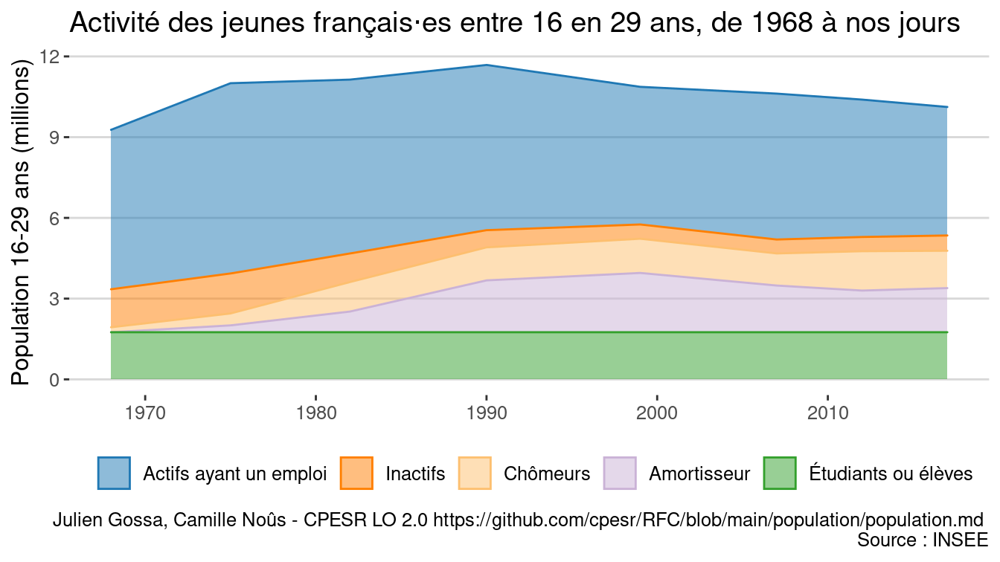<!-- -->

| Année |               Activité |  Population |
|------:|-----------------------:|------------:|
|  1968 | Actifs ayant un emploi |   5 925 316 |
|  1968 |               Inactifs |   1 412 564 |
|  1968 |               Chômeurs |     184 720 |
|  1968 |                 ?(sim) |           0 |
|  1968 |    Étudiants ou élèves |   1 751 000 |
|  1975 | Actifs ayant un emploi |   7 070 060 |
|  1975 |               Inactifs |   1 484 995 |
|  1975 |               Chômeurs |     444 030 |
|  1975 |                 ?(sim) |     254 910 |
|  1975 |    Étudiants ou élèves |   1 751 000 |
|  1982 | Actifs ayant un emploi |   6 460 016 |
|  1982 |               Inactifs |   1 061 764 |
|  1982 |               Chômeurs |   1 096 728 |
|  1982 |                 ?(sim) |     769 028 |
|  1982 |    Étudiants ou élèves |   1 751 000 |
|  1990 | Actifs ayant un emploi |   6 139 491 |
|  1990 |               Inactifs |     637 802 |
|  1990 |               Chômeurs |   1 228 194 |
|  1990 |                 ?(sim) |   1 926 947 |
|  1990 |    Étudiants ou élèves |   1 751 000 |
|  1999 | Actifs ayant un emploi |   5 114 894 |
|  1999 |               Inactifs |     529 740 |
|  1999 |               Chômeurs |   1 271 810 |
|  1999 |                 ?(sim) |   2 203 198 |
|  1999 |    Étudiants ou élèves |   1 751 000 |
|  2007 | Actifs ayant un emploi | 5 421 309.0 |
|  2007 |               Inactifs |   517 018.1 |
|  2007 |               Chômeurs | 1 193 363.0 |
|  2007 |                 ?(sim) | 1 735 265.2 |
|  2007 |    Étudiants ou élèves | 1 751 000.0 |
|  2012 | Actifs ayant un emploi | 5 105 583.4 |
|  2012 |               Inactifs |   528 485.6 |
|  2012 |               Chômeurs | 1 462 359.6 |
|  2012 |                 ?(sim) | 1 548 652.6 |
|  2012 |    Étudiants ou élèves | 1 751 000.0 |
|  2017 | Actifs ayant un emploi |   4 774 729 |
|  2017 |               Inactifs |     567 615 |
|  2017 |               Chômeurs |   1 387 958 |
|  2017 |                 ?(sim) |   1 640 129 |
|  2017 |    Étudiants ou élèves |   1 751 000 |

### GIF

<!-- -->

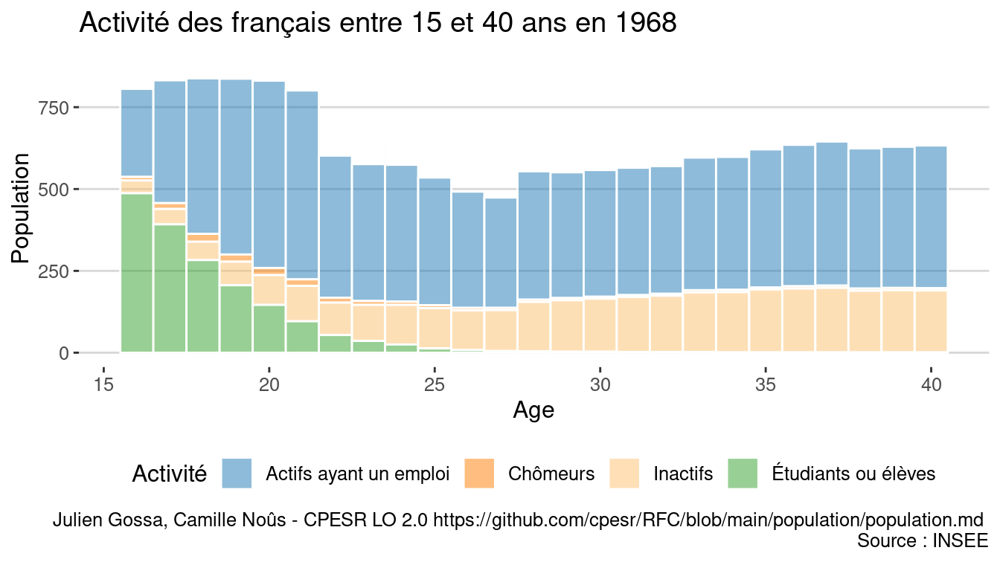<!-- -->
