Plongée dans l’INSEE
================

-   Activité, emploi et chômage en 2020 et en séries longues (T101 et
    T208) :
    <https://www.insee.fr/fr/statistiques/5359500?sommaire=5359511>
-   chômage/diplome :
    <https://www.insee.fr/fr/statistiques/4498649?sommaire=4498692&q=Taux+de+ch%C3%B4mage+selon+le+niveau+de+dipl%C3%B4me>
-   fm.T6 La situation démographique en 2019
    <https://www.insee.fr/fr/statistiques/5390418?sommaire=5390468>
-   NEET : <https://www.insee.fr/fr/statistiques/5346969>
-   Effectifs d’élèves et d’étudiants :
    <https://www.insee.fr/fr/statistiques/2387291>

## Taux d’emploi des 25-49 par niveau de diplôme

<!-- -->

<!-- -->

<!-- -->

<!-- -->

## Eleve du secondaire et étudiants du supérieur

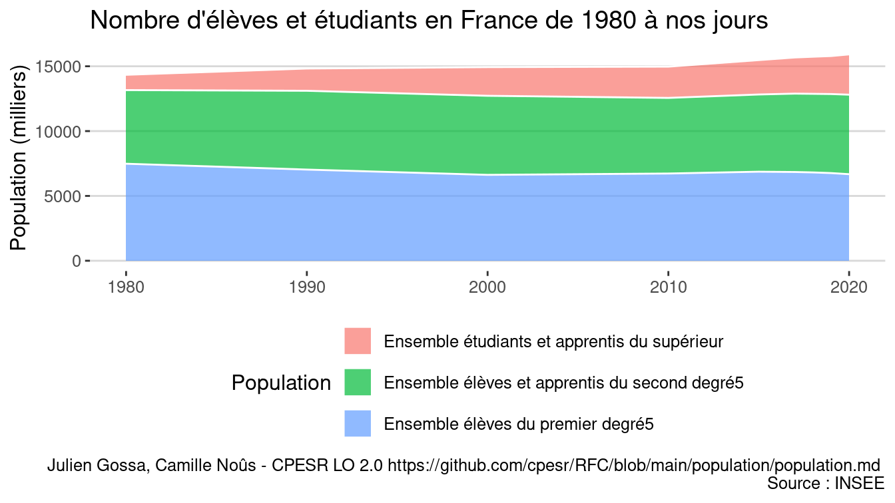<!-- -->

<!-- -->

<!-- -->

<!-- -->

<!-- -->

<!-- -->

<!-- -->

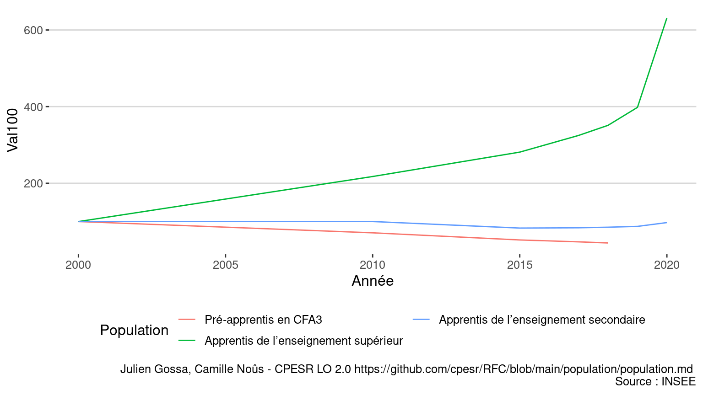<!-- -->

## Population active 15-29 au sens du BIT

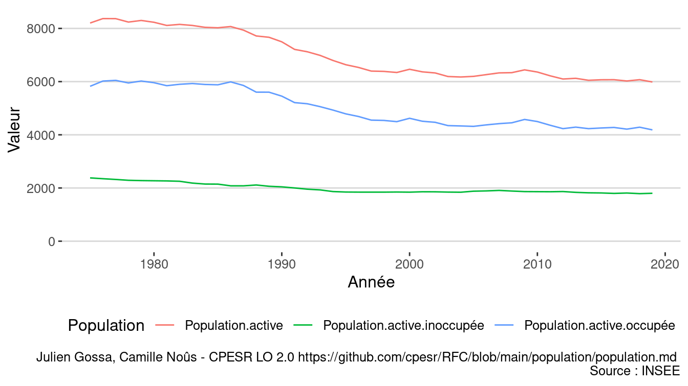<!-- -->

## Population totale des 15-29

<!-- -->

## Les jeunes

<!-- -->

<!-- -->

<!-- -->

<!-- -->

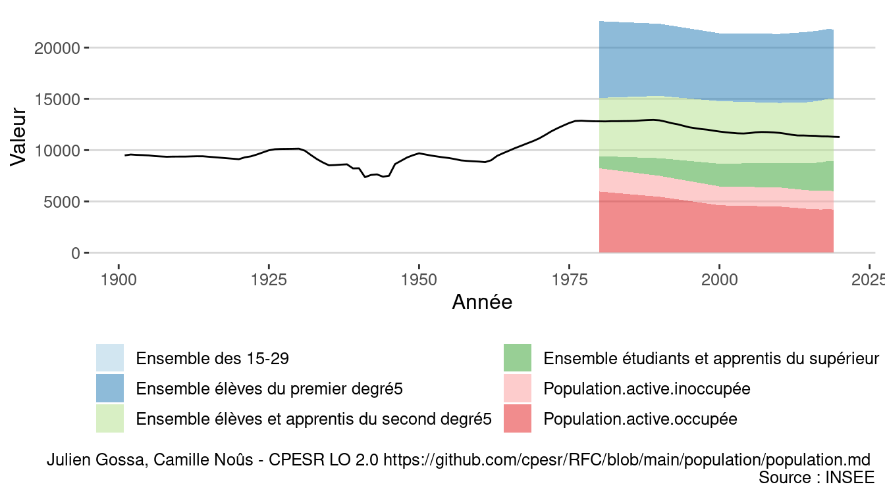<!-- -->

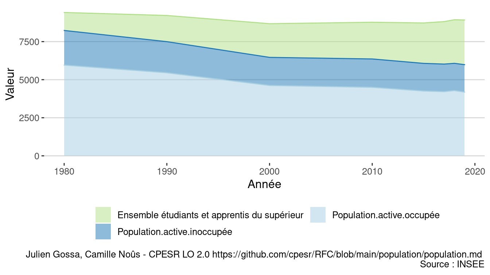<!-- -->

## Simulation Transfer etu -&gt; innocupés

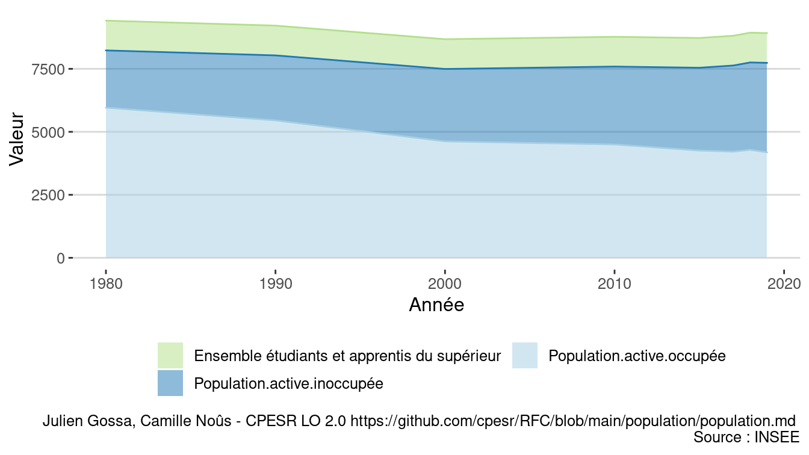<!-- -->

## Saphire

<https://www.insee.fr/fr/statistiques/4995124?sommaire=2414232>

## Check

<!-- -->

<!-- -->

    ## # A tibble: 2 × 8
    ##   Année   Age Sexe  Diplôme        Secteur.activité Activité CSP      Population
    ##   <int> <int> <fct> <fct>          <fct>            <fct>    <fct>         <dbl>
    ## 1  1975    15 Homme Personnes de … Inactifs ou chô… Inactifs Inactif…     411565
    ## 2  1975    15 Femme Personnes de … Inactifs ou chô… Inactifs Inactif…     394185

### Toute la population

<!-- -->

### Toute la population en 2017

<!-- -->
<!-- -->

<!-- -->

<!-- -->

### Suivi de cohorte

<!-- -->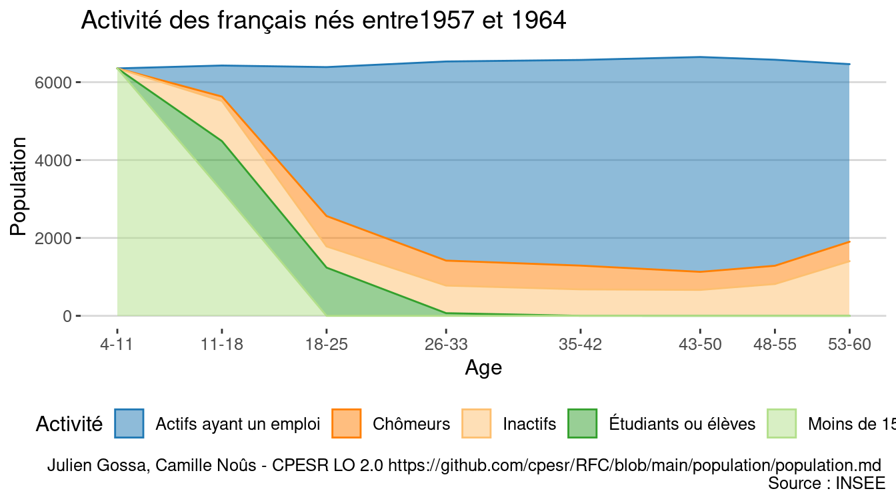<!-- --><!-- --><!-- --><!-- -->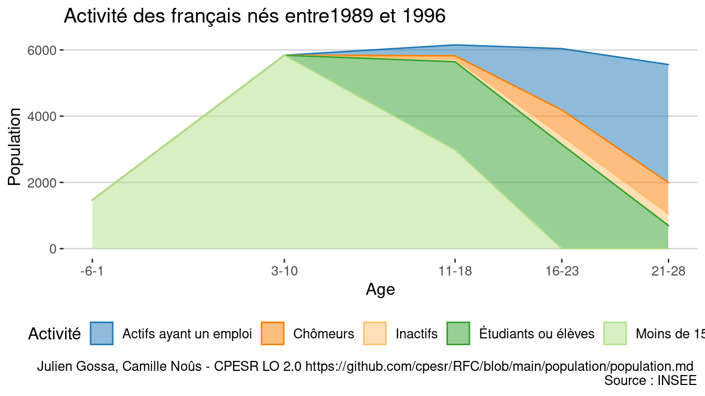<!-- --><!-- --><!-- -->

### 16-29

<!-- -->

<!-- -->

<!-- -->

Voir les données

| Année | Activité               | Population  | Val100 | Différence |
|------:|:-----------------------|:------------|-------:|-----------:|
|  1968 | Actifs ayant un emploi | 5 925 316   |    100 |          0 |
|  1968 | Chômeurs               | 184 720     |    100 |          0 |
|  1968 | Inactifs               | 1 412 564.0 |    100 |          0 |
|  1968 | Inactifs et chômeurs   | 1 597 284   |    100 |          0 |
|  1968 | Étudiants ou élèves    | 1 751 000   |    100 |          0 |
|  1968 | Ensemble               | 9 273 600   |    100 |          0 |
|  1975 | Actifs ayant un emploi | 7 070 060   |    119 |       1145 |
|  1975 | Chômeurs               | 444 030     |    240 |        259 |
|  1975 | Inactifs               | 1 484 995.0 |    105 |         72 |
|  1975 | Inactifs et chômeurs   | 1 929 025   |    121 |        332 |
|  1975 | Étudiants ou élèves    | 2 005 910   |    115 |        255 |
|  1975 | Ensemble               | 11 004 995  |    119 |       1731 |
|  1982 | Actifs ayant un emploi | 6 460 016   |    109 |        535 |
|  1982 | Chômeurs               | 1 096 728   |    594 |        912 |
|  1982 | Inactifs               | 1 061 764.0 |     75 |       -351 |
|  1982 | Inactifs et chômeurs   | 2 158 492   |    135 |        561 |
|  1982 | Étudiants ou élèves    | 2 520 028   |    144 |        769 |
|  1982 | Ensemble               | 11 138 536  |    120 |       1865 |
|  1990 | Actifs ayant un emploi | 6 139 491   |    104 |        214 |
|  1990 | Chômeurs               | 1 228 194   |    665 |       1043 |
|  1990 | Inactifs               | 637 802.0   |     45 |       -775 |
|  1990 | Inactifs et chômeurs   | 1 865 996   |    117 |        269 |
|  1990 | Étudiants ou élèves    | 3 677 947   |    210 |       1927 |
|  1990 | Ensemble               | 11 683 434  |    126 |       2410 |
|  1999 | Actifs ayant un emploi | 5 114 894   |     86 |       -810 |
|  1999 | Chômeurs               | 1 271 810   |    689 |       1087 |
|  1999 | Inactifs               | 529 740.0   |     38 |       -883 |
|  1999 | Inactifs et chômeurs   | 1 801 550   |    113 |        204 |
|  1999 | Étudiants ou élèves    | 3 954 198   |    226 |       2203 |
|  1999 | Ensemble               | 10 870 642  |    117 |       1597 |
|  2007 | Actifs ayant un emploi | 5 421 309   |     91 |       -504 |
|  2007 | Chômeurs               | 1 193 363   |    646 |       1009 |
|  2007 | Inactifs               | 517 018.1   |     37 |       -896 |
|  2007 | Inactifs et chômeurs   | 1 710 381   |    107 |        113 |
|  2007 | Étudiants ou élèves    | 3 486 265   |    199 |       1735 |
|  2007 | Ensemble               | 10 617 955  |    114 |       1344 |
|  2012 | Actifs ayant un emploi | 5 105 583   |     86 |       -820 |
|  2012 | Chômeurs               | 1 462 360   |    792 |       1278 |
|  2012 | Inactifs               | 528 485.6   |     37 |       -884 |
|  2012 | Inactifs et chômeurs   | 1 990 845   |    125 |        394 |
|  2012 | Étudiants ou élèves    | 3 299 653   |    188 |       1549 |
|  2012 | Ensemble               | 10 396 081  |    112 |       1122 |
|  2017 | Actifs ayant un emploi | 4 774 729   |     81 |      -1151 |
|  2017 | Chômeurs               | 1 387 958   |    751 |       1203 |
|  2017 | Inactifs               | 567 615.0   |     40 |       -845 |
|  2017 | Inactifs et chômeurs   | 1 955 573   |    122 |        358 |
|  2017 | Étudiants ou élèves    | 3 391 129   |    194 |       1640 |
|  2017 | Ensemble               | 10 121 431  |    109 |        848 |

<!-- -->

Voir les données

| Année | Activité               | Population | Part   |
|------:|:-----------------------|-----------:|:-------|
|  1968 | Actifs ayant un emploi |  5.9253160 | 63.9%  |
|  1968 | Inactifs               |  1.4125640 | 15.2%  |
|  1968 | Chômeurs               |  0.1847200 | 2.0%   |
|  1968 | Amortisseur            |  0.0000000 | 0.0%   |
|  1968 | Étudiants ou élèves    |  1.7510000 | 18.9%  |
|  1975 | Actifs ayant un emploi |  7.0700600 | 64.2%  |
|  1975 | Inactifs               |  1.4849950 | 13.5%  |
|  1975 | Chômeurs               |  0.4440300 | 4.0%   |
|  1975 | Amortisseur            |  0.2549100 | 2.3%   |
|  1975 | Étudiants ou élèves    |  1.7510000 | 15.9%  |
|  1982 | Actifs ayant un emploi |  6.4600160 | 58.00% |
|  1982 | Inactifs               |  1.0617640 | 9.53%  |
|  1982 | Chômeurs               |  1.0967280 | 9.85%  |
|  1982 | Amortisseur            |  0.7690280 | 6.90%  |
|  1982 | Étudiants ou élèves    |  1.7510000 | 15.72% |
|  1990 | Actifs ayant un emploi |  6.1394910 | 52.5%  |
|  1990 | Inactifs               |  0.6378020 | 5.5%   |
|  1990 | Chômeurs               |  1.2281940 | 10.5%  |
|  1990 | Amortisseur            |  1.9269470 | 16.5%  |
|  1990 | Étudiants ou élèves    |  1.7510000 | 15.0%  |
|  1999 | Actifs ayant un emploi |  5.1148940 | 47.1%  |
|  1999 | Inactifs               |  0.5297400 | 4.9%   |
|  1999 | Chômeurs               |  1.2718100 | 11.7%  |
|  1999 | Amortisseur            |  2.2031980 | 20.3%  |
|  1999 | Étudiants ou élèves    |  1.7510000 | 16.1%  |
|  2007 | Actifs ayant un emploi |  5.4213090 | 51.06% |
|  2007 | Inactifs               |  0.5170181 | 4.87%  |
|  2007 | Chômeurs               |  1.1933630 | 11.24% |
|  2007 | Amortisseur            |  1.7352652 | 16.34% |
|  2007 | Étudiants ou élèves    |  1.7510000 | 16.49% |
|  2012 | Actifs ayant un emploi |  5.1055834 | 49.11% |
|  2012 | Inactifs               |  0.5284856 | 5.08%  |
|  2012 | Chômeurs               |  1.4623596 | 14.07% |
|  2012 | Amortisseur            |  1.5486526 | 14.90% |
|  2012 | Étudiants ou élèves    |  1.7510000 | 16.84% |
|  2017 | Actifs ayant un emploi |  4.7747291 | 47.2%  |
|  2017 | Inactifs               |  0.5676150 | 5.6%   |
|  2017 | Chômeurs               |  1.3879581 | 13.7%  |
|  2017 | Amortisseur            |  1.6401286 | 16.2%  |
|  2017 | Étudiants ou élèves    |  1.7510000 | 17.3%  |

### Etudiants ou élèves

<!-- -->

<!-- -->

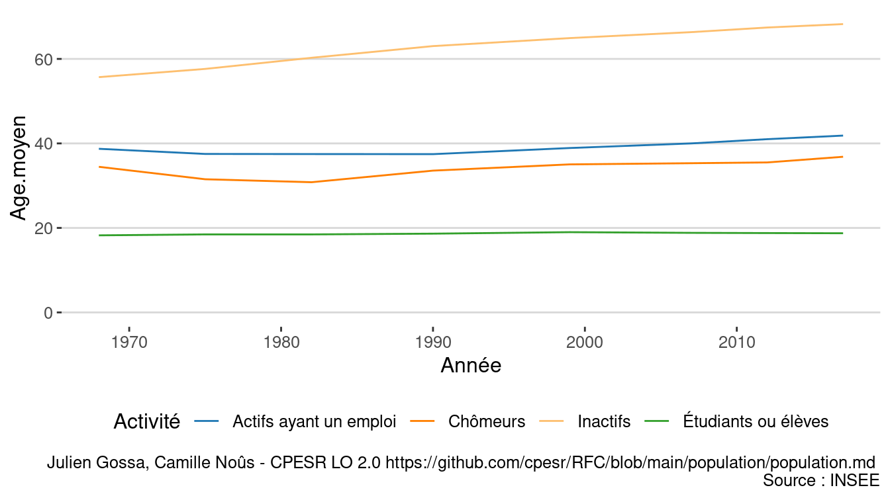<!-- -->

### Niveau de diplomation

<!-- -->

Voir les données

| Année | Diplôme                                 | Population | part | val100 |     evol |
|------:|:----------------------------------------|:-----------|-----:|-------:|---------:|
|  1968 | Aucun diplôme                           | 14 212 564 | 0.43 |    100 |        0 |
|  1968 | Niveau CEP                              | 10 610 316 | 0.32 |    100 |        0 |
|  1968 | Niveau BEPC                             | 1 672 940  | 0.05 |    100 |        0 |
|  1968 | Niveau CAP-BEP                          | 3 441 788  | 0.10 |    100 |        0 |
|  1968 | Niveau BAC général ou technique         | 1 845 400  | 0.06 |    100 |        0 |
|  1968 | Diplôme supérieur au Baccalauréat       | 1 092 992  | 0.03 |    100 |        0 |
|  1975 | Aucun diplôme                           | 12 813 645 | 0.37 |     90 | -1398919 |
|  1975 | Niveau CEP                              | 9 876 430  | 0.29 |     93 |  -733886 |
|  1975 | Niveau BEPC                             | 2 204 030  | 0.06 |    132 |   531090 |
|  1975 | Niveau CAP-BEP                          | 4 920 100  | 0.14 |    143 |  1478312 |
|  1975 | Niveau BAC général ou technique         | 2 523 570  | 0.07 |    137 |   678170 |
|  1975 | Diplôme supérieur au Baccalauréat       | 2 147 105  | 0.06 |    196 |  1054113 |
|  1982 | Aucun diplôme                           | 13 378 380 | 0.37 |     94 |  -834184 |
|  1982 | Niveau CEP                              | 8 261 484  | 0.23 |     78 | -2348832 |
|  1982 | Niveau BEPC                             | 2 463 612  | 0.07 |    147 |   790672 |
|  1982 | Niveau CAP-BEP                          | 6 007 260  | 0.17 |    175 |  2565472 |
|  1982 | Niveau BAC général ou technique         | 3 270 280  | 0.09 |    177 |  1424880 |
|  1982 | Diplôme universitaire de 1er cycle      | 1 524 128  | 0.04 |    100 |        0 |
|  1982 | Diplôme universitaire de 2e ou 3e cycle | 1 437 704  | 0.04 |    100 |        0 |
|  1990 | Aucun diplôme                           | 10 801 383 | 0.28 |     76 | -3411181 |
|  1990 | Niveau CEP                              | 8 178 864  | 0.21 |     77 | -2431452 |
|  1990 | Niveau BEPC                             | 3 089 413  | 0.08 |    185 |  1416473 |
|  1990 | Niveau CAP-BEP                          | 8 332 973  | 0.21 |    242 |  4891185 |
|  1990 | Niveau BAC général ou technique         | 4 200 257  | 0.11 |    228 |  2354857 |
|  1990 | Diplôme universitaire de 1er cycle      | 2 244 456  | 0.06 |    147 |   720328 |
|  1990 | Diplôme universitaire de 2e ou 3e cycle | 2 143 131  | 0.05 |    149 |   705427 |
|  1999 | Aucun diplôme                           | 7 795 757  | 0.19 |     55 | -6416807 |
|  1999 | Niveau CEP                              | 7 159 041  | 0.17 |     67 | -3451275 |
|  1999 | Niveau BEPC                             | 3 393 505  | 0.08 |    203 |  1720565 |
|  1999 | Niveau CAP-BEP                          | 10 395 254 | 0.25 |    302 |  6953466 |
|  1999 | Niveau BAC général ou technique         | 5 086 435  | 0.12 |    276 |  3241035 |
|  1999 | Diplôme universitaire de 1er cycle      | 3 555 840  | 0.09 |    233 |  2031712 |
|  1999 | Diplôme universitaire de 2e ou 3e cycle | 3 708 509  | 0.09 |    258 |  2270805 |
|  2007 | Aucun diplôme                           | 7 813 274  | 0.18 |     55 | -6399290 |
|  2007 | Niveau CEP                              | 5 348 485  | 0.12 |     50 | -5261831 |
|  2007 | Niveau BEPC                             | 3 000 191  | 0.07 |    179 |  1327251 |
|  2007 | Niveau CAP-BEP                          | 10 905 212 | 0.24 |    317 |  7463424 |
|  2007 | Niveau BAC général ou technique         | 7 008 824  | 0.16 |    380 |  5163424 |
|  2007 | Diplôme universitaire de 1er cycle      | 5 063 055  | 0.11 |    332 |  3538927 |
|  2007 | Diplôme universitaire de 2e ou 3e cycle | 5 386 843  | 0.12 |    375 |  3949139 |
|  2012 | Aucun diplôme                           | 7 216 211  | 0.16 |     51 | -6996353 |
|  2012 | Niveau CEP                              | 4 526 480  | 0.10 |     43 | -6083836 |
|  2012 | Niveau BEPC                             | 2 887 176  | 0.06 |    173 |  1214236 |
|  2012 | Niveau CAP-BEP                          | 11 114 800 | 0.24 |    323 |  7673012 |
|  2012 | Niveau BAC général ou technique         | 7 843 636  | 0.17 |    425 |  5998236 |
|  2012 | Diplôme universitaire de 1er cycle      | 5 903 363  | 0.13 |    387 |  4379235 |
|  2012 | Diplôme universitaire de 2e ou 3e cycle | 6 335 725  | 0.14 |    441 |  4898021 |
|  2017 | Aucun diplôme                           | 5 936 361  | 0.13 |     42 | -8276203 |
|  2017 | Niveau CEP                              | 3 742 141  | 0.08 |     35 | -6868175 |
|  2017 | Niveau BEPC                             | 2 709 007  | 0.06 |    162 |  1036067 |
|  2017 | Niveau CAP-BEP                          | 11 787 741 | 0.25 |    342 |  8345953 |
|  2017 | Niveau BAC général ou technique         | 8 129 366  | 0.17 |    441 |  6283966 |
|  2017 | Diplôme universitaire de 1er cycle      | 5 260 868  | 0.11 |    345 |  3736740 |
|  2017 | Diplôme universitaire de 2e ou 3e cycle | 8 989 408  | 0.19 |    625 |  7551704 |

<!-- -->

<!-- -->

Voir les données

| Année | Diplôme                                 | Population | Part   |
|------:|:----------------------------------------|-----------:|:-------|
|  1968 | Aucun diplôme                           |       1665 | 30.64% |
|  1968 | Niveau CEP                              |       1637 | 30.13% |
|  1968 | Niveau BEPC                             |        268 | 4.93%  |
|  1968 | Niveau CAP-BEP                          |       1044 | 19.21% |
|  1968 | Niveau BAC général ou technique         |        501 | 9.22%  |
|  1968 | Diplôme universitaire de 1er cycle      |          0 | 0.00%  |
|  1968 | Diplôme universitaire de 2e ou 3e cycle |          0 | 0.00%  |
|  1968 | Diplôme supérieur au Baccalauréat       |        319 | 5.87%  |
|  1975 | Aucun diplôme                           |       1308 | 20.39% |
|  1975 | Niveau CEP                              |       1488 | 23.20% |
|  1975 | Niveau BEPC                             |        444 | 6.92%  |
|  1975 | Niveau CAP-BEP                          |       1590 | 24.79% |
|  1975 | Niveau BAC général ou technique         |        773 | 12.05% |
|  1975 | Diplôme universitaire de 1er cycle      |          0 | 0.00%  |
|  1975 | Diplôme universitaire de 2e ou 3e cycle |          0 | 0.00%  |
|  1975 | Diplôme supérieur au Baccalauréat       |        812 | 12.66% |
|  1982 | Aucun diplôme                           |       1610 | 20.53% |
|  1982 | Niveau CEP                              |       1330 | 16.96% |
|  1982 | Niveau BEPC                             |        601 | 7.66%  |
|  1982 | Niveau CAP-BEP                          |       2072 | 26.42% |
|  1982 | Niveau BAC général ou technique         |       1035 | 13.20% |
|  1982 | Diplôme universitaire de 1er cycle      |        646 | 8.24%  |
|  1982 | Diplôme universitaire de 2e ou 3e cycle |        549 | 7.00%  |
|  1982 | Diplôme supérieur au Baccalauréat       |          0 | 0.00%  |
|  1990 | Aucun diplôme                           |       1510 | 18.70% |
|  1990 | Niveau CEP                              |        566 | 7.01%  |
|  1990 | Niveau BEPC                             |        754 | 9.34%  |
|  1990 | Niveau CAP-BEP                          |       2575 | 31.90% |
|  1990 | Niveau BAC général ou technique         |       1187 | 14.70% |
|  1990 | Diplôme universitaire de 1er cycle      |        842 | 10.43% |
|  1990 | Diplôme universitaire de 2e ou 3e cycle |        639 | 7.92%  |
|  1990 | Diplôme supérieur au Baccalauréat       |          0 | 0.00%  |
|  1999 | Aucun diplôme                           |       1129 | 14.10% |
|  1999 | Niveau CEP                              |        127 | 1.59%  |
|  1999 | Niveau BEPC                             |        475 | 5.93%  |
|  1999 | Niveau CAP-BEP                          |       2551 | 31.85% |
|  1999 | Niveau BAC général ou technique         |       1307 | 16.32% |
|  1999 | Diplôme universitaire de 1er cycle      |       1220 | 15.23% |
|  1999 | Diplôme universitaire de 2e ou 3e cycle |       1200 | 14.98% |
|  1999 | Diplôme supérieur au Baccalauréat       |          0 | 0.00%  |
|  2007 | Aucun diplôme                           |        765 | 10.38% |
|  2007 | Niveau CEP                              |         35 | 0.48%  |
|  2007 | Niveau BEPC                             |        265 | 3.60%  |
|  2007 | Niveau CAP-BEP                          |       1575 | 21.38% |
|  2007 | Niveau BAC général ou technique         |       1611 | 21.86% |
|  2007 | Diplôme universitaire de 1er cycle      |       1496 | 20.30% |
|  2007 | Diplôme universitaire de 2e ou 3e cycle |       1621 | 22.00% |
|  2007 | Diplôme supérieur au Baccalauréat       |          0 | 0.00%  |
|  2012 | Aucun diplôme                           |        652 | 9.06%  |
|  2012 | Niveau CEP                              |         19 | 0.26%  |
|  2012 | Niveau BEPC                             |        245 | 3.41%  |
|  2012 | Niveau CAP-BEP                          |       1431 | 19.89% |
|  2012 | Niveau BAC général ou technique         |       1639 | 22.78% |
|  2012 | Diplôme universitaire de 1er cycle      |       1533 | 21.31% |
|  2012 | Diplôme universitaire de 2e ou 3e cycle |       1675 | 23.28% |
|  2012 | Diplôme supérieur au Baccalauréat       |          0 | 0.00%  |
|  2017 | Aucun diplôme                           |        506 | 7.18%  |
|  2017 | Niveau CEP                              |         20 | 0.28%  |
|  2017 | Niveau BEPC                             |        236 | 3.35%  |
|  2017 | Niveau CAP-BEP                          |       1413 | 20.04% |
|  2017 | Niveau BAC général ou technique         |       1557 | 22.09% |
|  2017 | Diplôme universitaire de 1er cycle      |       1097 | 15.56% |
|  2017 | Diplôme universitaire de 2e ou 3e cycle |       2221 | 31.50% |
|  2017 | Diplôme supérieur au Baccalauréat       |          0 | 0.00%  |

<!-- -->

### GIF

<!-- -->

<!-- -->

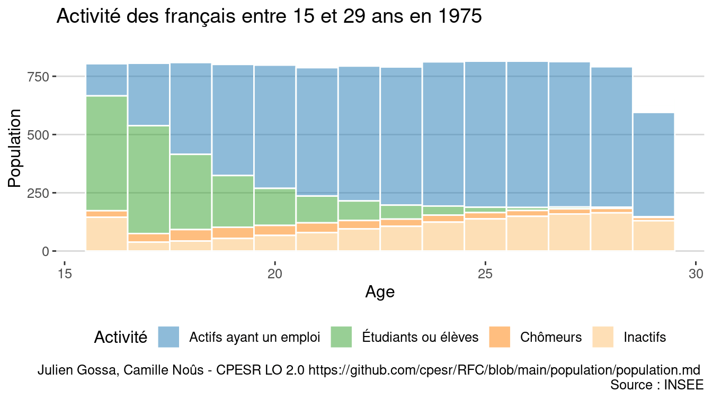<!-- -->

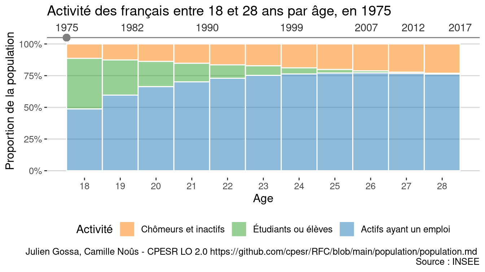<!-- -->

## Pyramidage étudiants

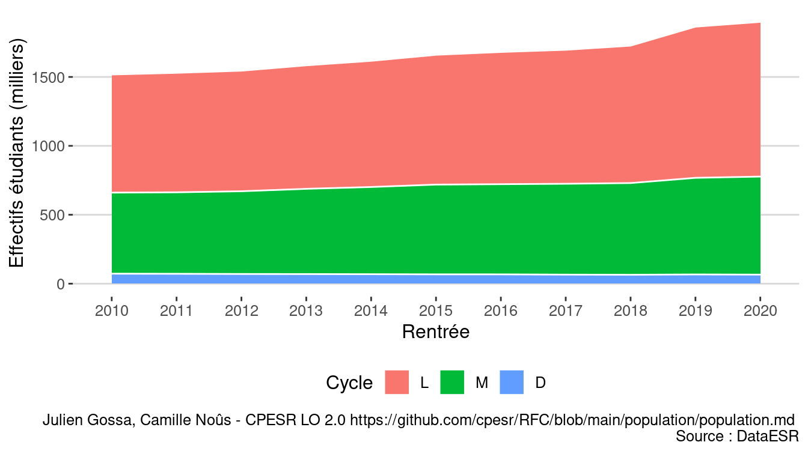<!-- -->

<!-- -->

<!-- -->

<!-- -->
