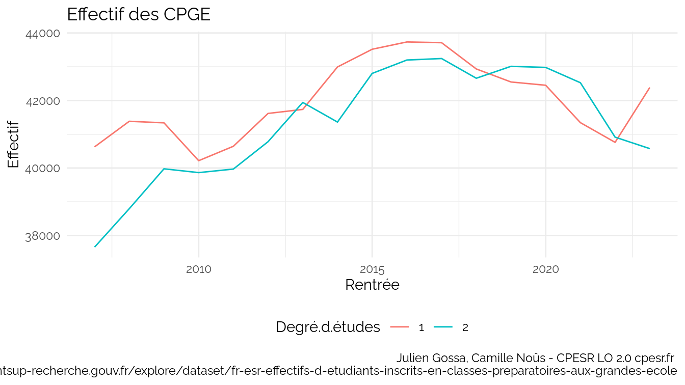
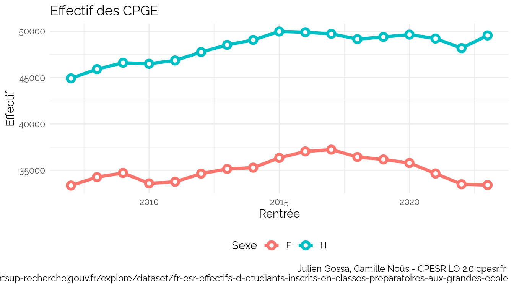
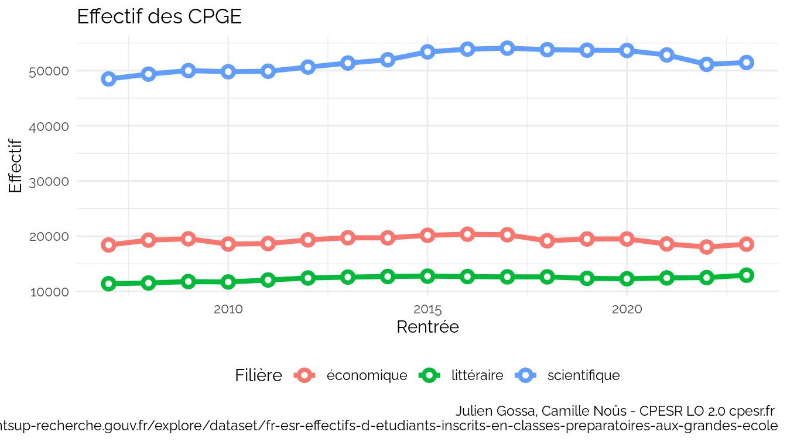
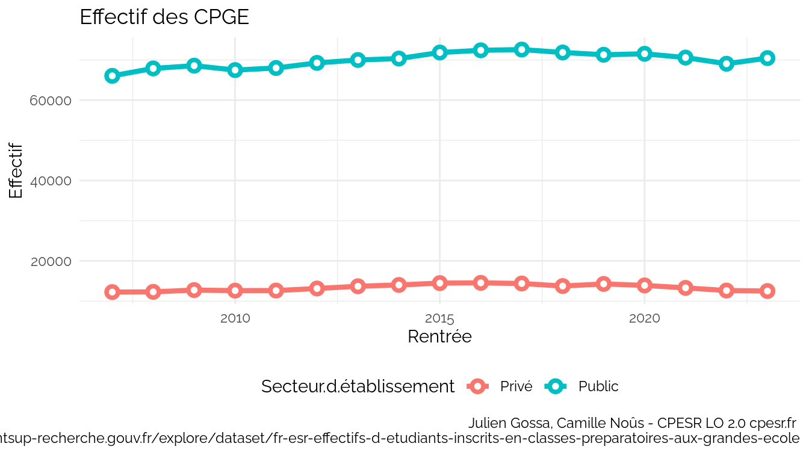

# prepas
2024-06-17

     [1] "Année.scolaire"                 "Secteur.d.établissement"       
     [3] "Code.UAI.de.l.établissement"    "Libellé.de.l.établissement"    
     [5] "Commune"                        "Filière"                       
     [7] "Spécialité"                     "Degré.d.études"                
     [9] "Sexe"                           "Nombre.d.élèves"               
    [11] "Géolocalisation"                "Région"                        
    [13] "Académie"                       "Département"                   
    [15] "Unité.urbaine"                  "Identifiant.de.la.région"      
    [17] "Identifiant.de.l.académie"      "Identifiant.du.département"    
    [19] "Identifiant.de.l.unité.urbaine" "code.de.la.commune"            
    [21] "Fortrams_7"                     "mef_stat_11"                   
    [23] "Rentrée"                       

    Warning: Using `size` aesthetic for lines was deprecated in ggplot2 3.4.0.
    ℹ Please use `linewidth` instead.

