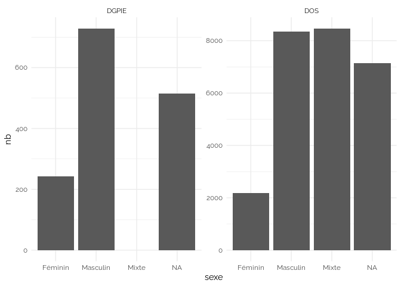
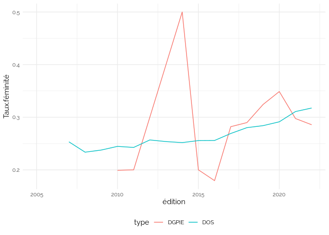

ANR
================

    ## `summarise()` has grouped output by 'prenom'. You can override using the
    ## `.groups` argument.
    ## Joining, by = "prenom"
    ## Joining, by = "Projet.Code_Decision_ANR"
    ## Joining, by = "Projet.Code_Decision_ANR"

<https://www.data.gouv.fr/fr/datasets/anr-02-projets-anr-dgpie-detail-des-projets-et-des-partenaires/>

<https://www.data.gouv.fr/fr/datasets/anr-01-projets-anr-dos-detail-des-projets-et-des-partenaires/>

<https://www.insee.fr/fr/statistiques/2540004?sommaire=4767262>

## Nombre de projets

<!-- -->

## Nombre de projets par type

    ## `summarise()` has grouped output by 'sexe'. You can override using the
    ## `.groups` argument.

<!-- -->

## Nombre de projets par sexe du coordinateur

    ## `summarise()` has grouped output by 'sexe.coordinateur'. You can override using
    ## the `.groups` argument.

<!-- -->

### Nombre de porteurs par type

    ## Warning: Removed 448 rows containing non-finite values (`stat_boxplot()`).

<!-- -->

Pour les DGPIE, un seul porteur scientifique est indiqué.

## Taux de porteuses scientifiques par année

    ## `summarise()` has grouped output by 'édition'. You can override using the
    ## `.groups` argument.

    ## Warning: Removed 4 rows containing missing values (`geom_line()`).

<!-- -->

## Financement de projets

<!-- -->

## Financement de projets par type

    ## `summarise()` has grouped output by 'sexe'. You can override using the
    ## `.groups` argument.

<!-- --> \## Financement de
projets par type pour les coordinateurs

    ## `summarise()` has grouped output by 'sexe.coordinateur'. You can override using
    ## the `.groups` argument.

<!-- -->

## Taux de financement aux porteuses scientifiques par année

    ## `summarise()` has grouped output by 'sexe', 'édition'. You can override using
    ## the `.groups` argument.

<!-- -->

    ## `summarise()` has grouped output by 'sexe', 'édition'. You can override using
    ## the `.groups` argument.

<!-- -->

Attention : 2014 correspond à une année avec extrêmement peu de projets
DGPIE

    ## `summarise()` has grouped output by 'sexe', 'édition'. You can override using
    ## the `.groups` argument.

<!-- -->

## Financement median par sexe

    ## `summarise()` has grouped output by 'sexe'. You can override using the
    ## `.groups` argument.

<!-- -->

## Financement median par sexe à partir de 2010

    ## `summarise()` has grouped output by 'sexe'. You can override using the
    ## `.groups` argument.

<!-- -->

## Coordinateurs

    ## `summarise()` has grouped output by 'sexe.coordinateur', 'édition'. You can
    ## override using the `.groups` argument.

<!-- -->

    ## `summarise()` has grouped output by 'sexe.coordinateur', 'édition'. You can
    ## override using the `.groups` argument.

<!-- -->

## Taux porteuse + financement

    ## `summarise()` has grouped output by 'édition'. You can override using the
    ## `.groups` argument.
    ## Joining, by = "édition"

<!-- -->
