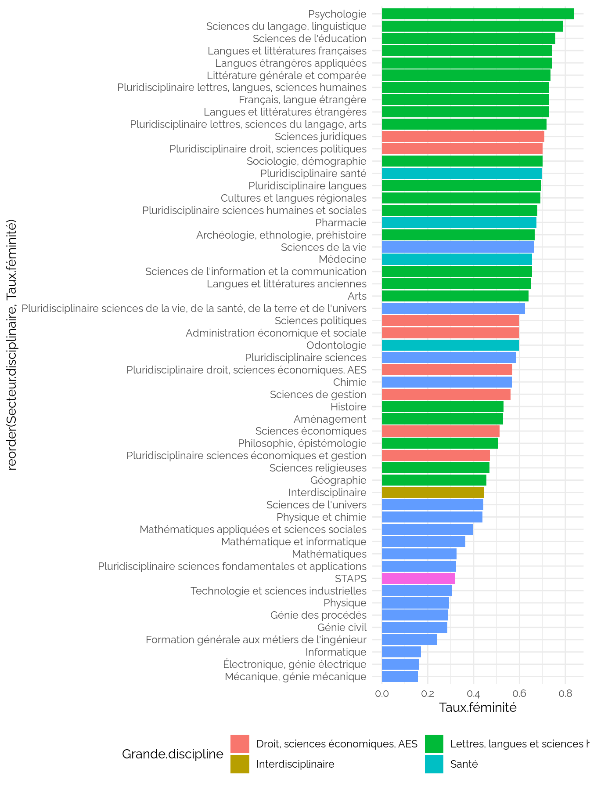
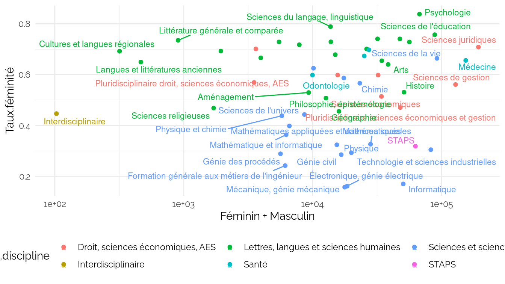
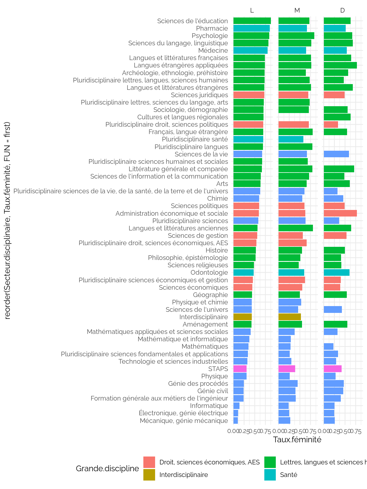
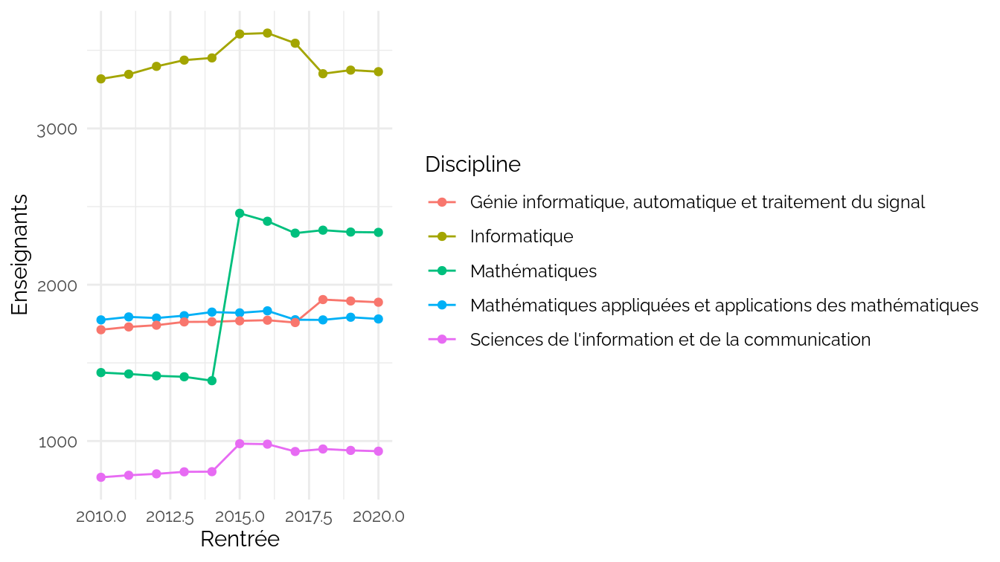
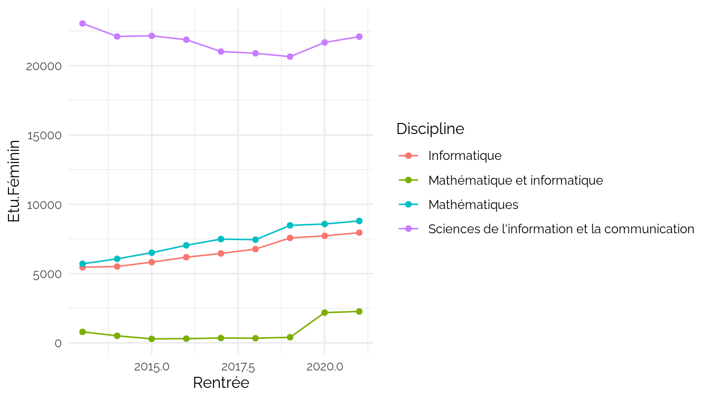
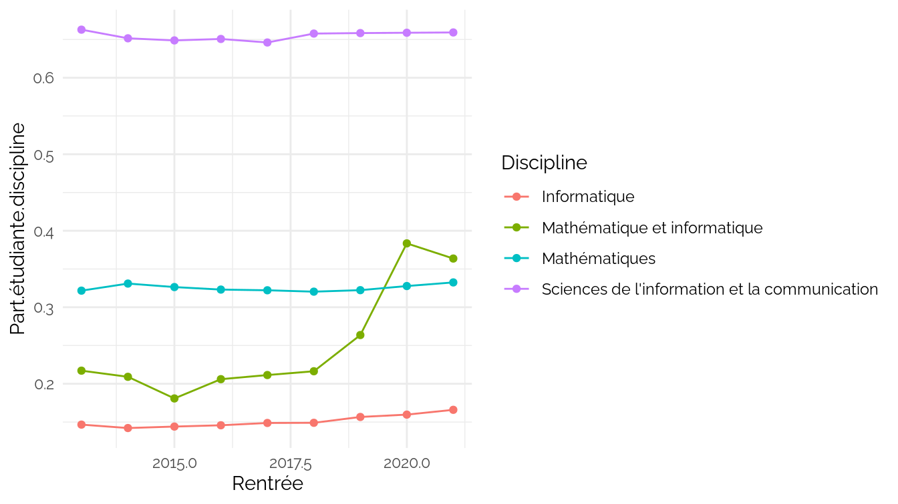
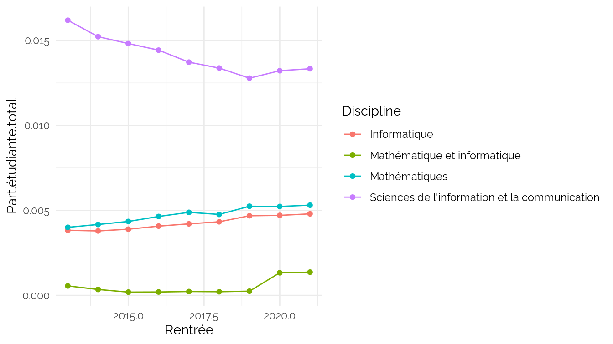
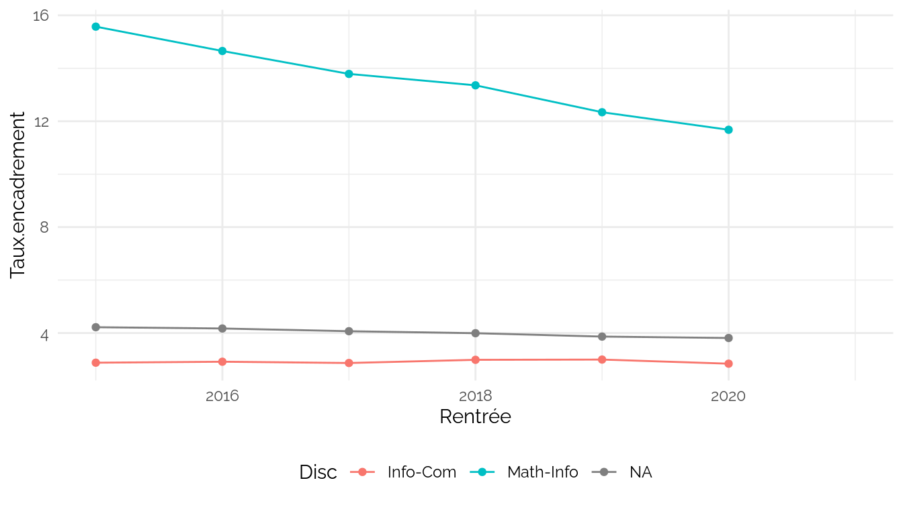

Sexe des étudiants
================
CPESR
2023-05-22

## Données

- <https://data.enseignementsup-recherche.gouv.fr/explore/dataset/fr-esr-sise-effectifs-d-etudiants-inscrits-esr-public/export/>
  -<https://data.enseignementsup-recherche.gouv.fr/explore/dataset/fr-esr-enseignants-titulaires-esr-public/export/>

<!-- -->

    ## [1] "Rentrée"               "Grande.discipline"     "Discipline"           
    ## [4] "Secteur.disciplinaire" "LMD"                   "Sexe"                 
    ## [7] "Effectif"

Voir les données

| Grande.discipline                     | Discipline                                             | Secteur.disciplinaire                                                           |
|:--------------------------------------|:-------------------------------------------------------|:--------------------------------------------------------------------------------|
| Droit, sciences économiques, AES      | Administration économique et sociale                   | Administration économique et sociale                                            |
| Droit, sciences économiques, AES      | Droit, sciences politiques                             | Pluridisciplinaire droit, sciences politiques                                   |
| Droit, sciences économiques, AES      | Droit, sciences politiques                             | Sciences juridiques                                                             |
| Droit, sciences économiques, AES      | Droit, sciences politiques                             | Sciences politiques                                                             |
| Droit, sciences économiques, AES      | Pluridisciplinaire droit, sciences économiques, AES    | Pluridisciplinaire droit, sciences économiques, AES                             |
| Droit, sciences économiques, AES      | Sciences économiques, gestion                          | Pluridisciplinaire sciences économiques et gestion                              |
| Droit, sciences économiques, AES      | Sciences économiques, gestion                          | Sciences de gestion                                                             |
| Droit, sciences économiques, AES      | Sciences économiques, gestion                          | Sciences économiques                                                            |
| Lettres, langues et sciences humaines | Langues                                                | Cultures et langues régionales                                                  |
| Lettres, langues et sciences humaines | Langues                                                | Français, langue étrangère                                                      |
| Lettres, langues et sciences humaines | Langues                                                | Langues et littératures étrangères                                              |
| Lettres, langues et sciences humaines | Langues                                                | Langues étrangères appliquées                                                   |
| Lettres, langues et sciences humaines | Langues                                                | Pluridisciplinaire langues                                                      |
| Lettres, langues et sciences humaines | Lettres, sciences du langage, arts                     | Arts                                                                            |
| Lettres, langues et sciences humaines | Lettres, sciences du langage, arts                     | Langues et littératures anciennes                                               |
| Lettres, langues et sciences humaines | Lettres, sciences du langage, arts                     | Langues et littératures françaises                                              |
| Lettres, langues et sciences humaines | Lettres, sciences du langage, arts                     | Littérature générale et comparée                                                |
| Lettres, langues et sciences humaines | Lettres, sciences du langage, arts                     | Pluridisciplinaire lettres, sciences du langage, arts                           |
| Lettres, langues et sciences humaines | Lettres, sciences du langage, arts                     | Sciences du langage, linguistique                                               |
| Lettres, langues et sciences humaines | Pluridisciplinaire lettres, langues, sciences humaines | Pluridisciplinaire lettres, langues, sciences humaines                          |
| Lettres, langues et sciences humaines | Sciences humaines et sociales                          | Aménagement                                                                     |
| Lettres, langues et sciences humaines | Sciences humaines et sociales                          | Archéologie, ethnologie, préhistoire                                            |
| Lettres, langues et sciences humaines | Sciences humaines et sociales                          | Géographie                                                                      |
| Lettres, langues et sciences humaines | Sciences humaines et sociales                          | Histoire                                                                        |
| Lettres, langues et sciences humaines | Sciences humaines et sociales                          | Philosophie, épistémologie                                                      |
| Lettres, langues et sciences humaines | Sciences humaines et sociales                          | Pluridisciplinaire sciences humaines et sociales                                |
| Lettres, langues et sciences humaines | Sciences humaines et sociales                          | Psychologie                                                                     |
| Lettres, langues et sciences humaines | Sciences humaines et sociales                          | Sciences de l’éducation                                                         |
| Lettres, langues et sciences humaines | Sciences humaines et sociales                          | Sciences de l’information et la communication                                   |
| Lettres, langues et sciences humaines | Sciences humaines et sociales                          | Sciences religieuses                                                            |
| Lettres, langues et sciences humaines | Sciences humaines et sociales                          | Sociologie, démographie                                                         |
| Santé                                 | Médecine                                               | Médecine                                                                        |
| Santé                                 | Odontologie                                            | Odontologie                                                                     |
| Santé                                 | Pharmacie                                              | Pharmacie                                                                       |
| Santé                                 | Pluridisciplinaire santé                               | Pluridisciplinaire santé                                                        |
| Sciences et sciences de l’ingénieur   | Pluridisciplinaire sciences                            | Pluridisciplinaire sciences                                                     |
| Sciences et sciences de l’ingénieur   | Sciences de la vie, de la terre et de l’univers        | Pluridisciplinaire sciences de la vie, de la santé, de la terre et de l’univers |
| Sciences et sciences de l’ingénieur   | Sciences de la vie, de la terre et de l’univers        | Sciences de l’univers                                                           |
| Sciences et sciences de l’ingénieur   | Sciences de la vie, de la terre et de l’univers        | Sciences de la vie                                                              |
| Sciences et sciences de l’ingénieur   | Sciences fondamentales et applications                 | Chimie                                                                          |
| Sciences et sciences de l’ingénieur   | Sciences fondamentales et applications                 | Électronique, génie électrique                                                  |
| Sciences et sciences de l’ingénieur   | Sciences fondamentales et applications                 | Formation générale aux métiers de l’ingénieur                                   |
| Sciences et sciences de l’ingénieur   | Sciences fondamentales et applications                 | Génie civil                                                                     |
| Sciences et sciences de l’ingénieur   | Sciences fondamentales et applications                 | Génie des procédés                                                              |
| Sciences et sciences de l’ingénieur   | Sciences fondamentales et applications                 | Informatique                                                                    |
| Sciences et sciences de l’ingénieur   | Sciences fondamentales et applications                 | Mathématique et informatique                                                    |
| Sciences et sciences de l’ingénieur   | Sciences fondamentales et applications                 | Mathématiques                                                                   |
| Sciences et sciences de l’ingénieur   | Sciences fondamentales et applications                 | Mathématiques appliquées et sciences sociales                                   |
| Sciences et sciences de l’ingénieur   | Sciences fondamentales et applications                 | Mécanique, génie mécanique                                                      |
| Sciences et sciences de l’ingénieur   | Sciences fondamentales et applications                 | Physique                                                                        |
| Sciences et sciences de l’ingénieur   | Sciences fondamentales et applications                 | Physique et chimie                                                              |
| Sciences et sciences de l’ingénieur   | Sciences fondamentales et applications                 | Pluridisciplinaire sciences fondamentales et applications                       |
| Sciences et sciences de l’ingénieur   | Sciences fondamentales et applications                 | Technologie et sciences industrielles                                           |
| STAPS                                 | STAPS                                                  | STAPS                                                                           |
| Interdisciplinaire                    | Interdisciplinaire                                     | Interdisciplinaire                                                              |

## Explorations

    ## Warning: ggrepel: 19 unlabeled data points (too many overlaps). Consider
    ## increasing max.overlaps

    ## Warning: Using `size` aesthetic for lines was deprecated in ggplot2 3.4.0.
    ## ℹ Please use `linewidth` instead.

    ## Warning: ggrepel: 42 unlabeled data points (too many overlaps). Consider
    ## increasing max.overlaps

    ## Warning: Removed 3 rows containing missing values (`position_stack()`).

### Numérique

### Nombre d’enseignants tutilaires

Attention, grosse rupture de série, sans doute dûe à des changements de
périmètre.

### Nombre d’étudiantes

### Part des étudiantes dans la discipline

### Part des étudiantes dans le total des étudiants.

### Taux d’encadrement par les titulaires de la discipline

    ## Joining, by = c("Rentrée", "Disc")

    ## Warning: Removed 3 rows containing missing values (`geom_line()`).

    ## Warning: Removed 3 rows containing missing values (`geom_point()`).

