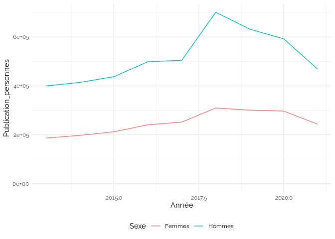

Publications
================

<https://data.enseignementsup-recherche.gouv.fr/explore/dataset/fr-esr-export-des-productions-scientifiques-exposes-dans-scanr-publications-thes/information/>

    ## Warning: Removed 1 rows containing missing values (`position_stack()`).

<!-- -->

## Publication-personnes

<!-- -->

## Sexe des auteurs

    ## `summarise()` has grouped output by 'Année'. You can override using the
    ## `.groups` argument.

<!-- -->

    ## `summarise()` has grouped output by 'Année', 'Sexe'. You can override using the
    ## `.groups` argument.
    ## `geom_line()`: Each group consists of only one observation. ℹ Do you need to
    ## adjust the group aesthetic?
    ## `geom_line()`: Each group consists of only one observation. ℹ Do you need to
    ## adjust the group aesthetic?
    ## `geom_line()`: Each group consists of only one observation. ℹ Do you need to
    ## adjust the group aesthetic?

<!-- -->

## Premier auteur

    ## `summarise()` has grouped output by 'Année'. You can override using the
    ## `.groups` argument.

<!-- -->

### Premier auteur des articles mixtes

    ## `summarise()` has grouped output by 'Année'. You can override using the
    ## `.groups` argument.

<!-- -->
