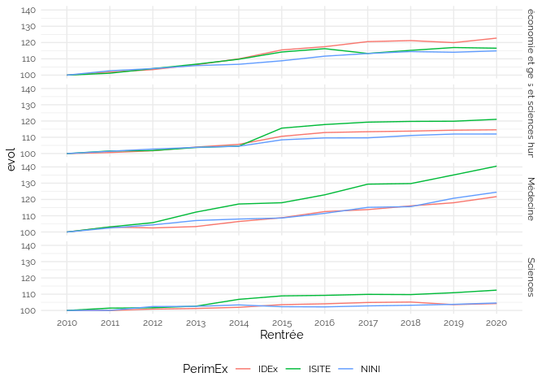

Untitled
================

    ## `summarise()` has grouped output by 'Rentrée', 'type', 'pid', 'Sexe'. You can
    ## override using the `.groups` argument.
    ## Joining, by = "pid"
    ## `summarise()` has grouped output by 'Rentrée', 'pid', 'Sexe'. You can override
    ## using the `.groups` argument.
    ## Joining, by = "pid"

## Taux de féminité enseignant : Permanents vs non permanents

    ## `summarise()` has grouped output by 'Etablissement'. You can override using the
    ## `.groups` argument.

    ## Warning: ggrepel: 49 unlabeled data points (too many overlaps). Consider
    ## increasing max.overlaps

<!-- -->

## IDEX, ISITE

    ## Warning: Removed 235 rows containing non-finite values (`stat_boxplot()`).

<!-- -->

    ## Warning: Removed 49 rows containing non-finite values (`stat_boxplot()`).

<!-- -->

    ## `summarise()` has grouped output by 'Rentrée', 'PerimEx'. You can override
    ## using the `.groups` argument.

<!-- -->

    ## # A tibble: 10 × 2
    ##    Etablissement                            Rentrée.min
    ##    <chr>                                          <int>
    ##  1 CY Cergy Paris Université                       2010
    ##  2 Nantes Université                               2010
    ##  3 Université Clermont Auvergne                    2010
    ##  4 Université de Bourgogne                         2010
    ##  5 Université de Franche-Comté                     2010
    ##  6 Université de Lille                             2012
    ##  7 Université de Lorraine                          2010
    ##  8 Université de Montpellier                       2012
    ##  9 Université de Pau et des Pays de l'Adour        2010
    ## 10 Université Gustave Eiffel                       2010

## Taux féminité vs PIA

    ## `summarise()` has grouped output by 'pid', 'Etablissement', 'Comparable'. You
    ## can override using the `.groups` argument.
    ## Joining, by = "pid"

<!-- -->

<!-- -->

<!-- -->
