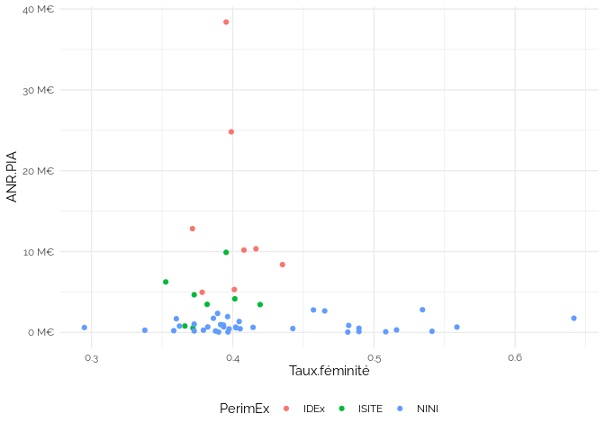

Untitled
================

    ## `summarise()` has grouped output by 'Rentrée', 'type', 'pid', 'Sexe'. You can
    ## override using the `.groups` argument.
    ## Joining with `by = join_by(pid)`
    ## `summarise()` has grouped output by 'Rentrée', 'pid', 'Sexe'. You can override
    ## using the `.groups` argument.
    ## Joining with `by = join_by(pid)`

## Taux de féminité des E-EC

    ## `summarise()` has grouped output by 'Rentrée', 'Catégorie'. You can override
    ## using the `.groups` argument.

<table>
<thead>
<tr>
<th style="text-align:right;">
Rentrée
</th>
<th style="text-align:left;">
Catégorie
</th>
<th style="text-align:right;">
Femme
</th>
<th style="text-align:right;">
Homme
</th>
<th style="text-align:right;">
Non renseigné
</th>
<th style="text-align:right;">
Taux.féminité
</th>
</tr>
</thead>
<tbody>
<tr>
<td style="text-align:right;">
2010
</td>
<td style="text-align:left;">
AM2D
</td>
<td style="text-align:right;">
5559
</td>
<td style="text-align:right;">
7332
</td>
<td style="text-align:right;">
NA
</td>
<td style="text-align:right;">
0.4312311
</td>
</tr>
<tr>
<td style="text-align:right;">
2011
</td>
<td style="text-align:left;">
AM2D
</td>
<td style="text-align:right;">
5657
</td>
<td style="text-align:right;">
7482
</td>
<td style="text-align:right;">
NA
</td>
<td style="text-align:right;">
0.4305503
</td>
</tr>
<tr>
<td style="text-align:right;">
2012
</td>
<td style="text-align:left;">
AM2D
</td>
<td style="text-align:right;">
5719
</td>
<td style="text-align:right;">
7337
</td>
<td style="text-align:right;">
NA
</td>
<td style="text-align:right;">
0.4380362
</td>
</tr>
<tr>
<td style="text-align:right;">
2013
</td>
<td style="text-align:left;">
AM2D
</td>
<td style="text-align:right;">
5763
</td>
<td style="text-align:right;">
7306
</td>
<td style="text-align:right;">
NA
</td>
<td style="text-align:right;">
0.4409672
</td>
</tr>
<tr>
<td style="text-align:right;">
2014
</td>
<td style="text-align:left;">
AM2D
</td>
<td style="text-align:right;">
5874
</td>
<td style="text-align:right;">
7255
</td>
<td style="text-align:right;">
NA
</td>
<td style="text-align:right;">
0.4474065
</td>
</tr>
<tr>
<td style="text-align:right;">
2015
</td>
<td style="text-align:left;">
AM2D
</td>
<td style="text-align:right;">
6032
</td>
<td style="text-align:right;">
7189
</td>
<td style="text-align:right;">
NA
</td>
<td style="text-align:right;">
0.4562439
</td>
</tr>
<tr>
<td style="text-align:right;">
2016
</td>
<td style="text-align:left;">
AM2D
</td>
<td style="text-align:right;">
6003
</td>
<td style="text-align:right;">
6982
</td>
<td style="text-align:right;">
NA
</td>
<td style="text-align:right;">
0.4623027
</td>
</tr>
<tr>
<td style="text-align:right;">
2017
</td>
<td style="text-align:left;">
AM2D
</td>
<td style="text-align:right;">
5981
</td>
<td style="text-align:right;">
6886
</td>
<td style="text-align:right;">
NA
</td>
<td style="text-align:right;">
0.4648325
</td>
</tr>
<tr>
<td style="text-align:right;">
2018
</td>
<td style="text-align:left;">
AM2D
</td>
<td style="text-align:right;">
6138
</td>
<td style="text-align:right;">
6972
</td>
<td style="text-align:right;">
NA
</td>
<td style="text-align:right;">
0.4681922
</td>
</tr>
<tr>
<td style="text-align:right;">
2019
</td>
<td style="text-align:left;">
AM2D
</td>
<td style="text-align:right;">
6156
</td>
<td style="text-align:right;">
6930
</td>
<td style="text-align:right;">
NA
</td>
<td style="text-align:right;">
0.4704264
</td>
</tr>
<tr>
<td style="text-align:right;">
2020
</td>
<td style="text-align:left;">
AM2D
</td>
<td style="text-align:right;">
6185
</td>
<td style="text-align:right;">
6930
</td>
<td style="text-align:right;">
NA
</td>
<td style="text-align:right;">
0.4715974
</td>
</tr>
<tr>
<td style="text-align:right;">
2010
</td>
<td style="text-align:left;">
EC
</td>
<td style="text-align:right;">
19555
</td>
<td style="text-align:right;">
36685
</td>
<td style="text-align:right;">
NA
</td>
<td style="text-align:right;">
0.3477063
</td>
</tr>
<tr>
<td style="text-align:right;">
2011
</td>
<td style="text-align:left;">
EC
</td>
<td style="text-align:right;">
19854
</td>
<td style="text-align:right;">
36592
</td>
<td style="text-align:right;">
NA
</td>
<td style="text-align:right;">
0.3517344
</td>
</tr>
<tr>
<td style="text-align:right;">
2012
</td>
<td style="text-align:left;">
EC
</td>
<td style="text-align:right;">
20174
</td>
<td style="text-align:right;">
36439
</td>
<td style="text-align:right;">
NA
</td>
<td style="text-align:right;">
0.3563492
</td>
</tr>
<tr>
<td style="text-align:right;">
2013
</td>
<td style="text-align:left;">
EC
</td>
<td style="text-align:right;">
20529
</td>
<td style="text-align:right;">
36379
</td>
<td style="text-align:right;">
NA
</td>
<td style="text-align:right;">
0.3607401
</td>
</tr>
<tr>
<td style="text-align:right;">
2014
</td>
<td style="text-align:left;">
EC
</td>
<td style="text-align:right;">
20764
</td>
<td style="text-align:right;">
36126
</td>
<td style="text-align:right;">
NA
</td>
<td style="text-align:right;">
0.3649851
</td>
</tr>
<tr>
<td style="text-align:right;">
2015
</td>
<td style="text-align:left;">
EC
</td>
<td style="text-align:right;">
20850
</td>
<td style="text-align:right;">
35586
</td>
<td style="text-align:right;">
NA
</td>
<td style="text-align:right;">
0.3694450
</td>
</tr>
<tr>
<td style="text-align:right;">
2016
</td>
<td style="text-align:left;">
EC
</td>
<td style="text-align:right;">
21252
</td>
<td style="text-align:right;">
35433
</td>
<td style="text-align:right;">
NA
</td>
<td style="text-align:right;">
0.3749140
</td>
</tr>
<tr>
<td style="text-align:right;">
2017
</td>
<td style="text-align:left;">
EC
</td>
<td style="text-align:right;">
21042
</td>
<td style="text-align:right;">
34638
</td>
<td style="text-align:right;">
NA
</td>
<td style="text-align:right;">
0.3779095
</td>
</tr>
<tr>
<td style="text-align:right;">
2018
</td>
<td style="text-align:left;">
EC
</td>
<td style="text-align:right;">
21168
</td>
<td style="text-align:right;">
34339
</td>
<td style="text-align:right;">
NA
</td>
<td style="text-align:right;">
0.3813573
</td>
</tr>
<tr>
<td style="text-align:right;">
2019
</td>
<td style="text-align:left;">
EC
</td>
<td style="text-align:right;">
21315
</td>
<td style="text-align:right;">
34223
</td>
<td style="text-align:right;">
NA
</td>
<td style="text-align:right;">
0.3837913
</td>
</tr>
<tr>
<td style="text-align:right;">
2020
</td>
<td style="text-align:left;">
EC
</td>
<td style="text-align:right;">
21454
</td>
<td style="text-align:right;">
33915
</td>
<td style="text-align:right;">
NA
</td>
<td style="text-align:right;">
0.3874731
</td>
</tr>
<tr>
<td style="text-align:right;">
2012
</td>
<td style="text-align:left;">
NA
</td>
<td style="text-align:right;">
9222
</td>
<td style="text-align:right;">
12502
</td>
<td style="text-align:right;">
4253
</td>
<td style="text-align:right;">
0.4245075
</td>
</tr>
<tr>
<td style="text-align:right;">
2013
</td>
<td style="text-align:left;">
NA
</td>
<td style="text-align:right;">
9317
</td>
<td style="text-align:right;">
12483
</td>
<td style="text-align:right;">
4166
</td>
<td style="text-align:right;">
0.4273853
</td>
</tr>
<tr>
<td style="text-align:right;">
2014
</td>
<td style="text-align:left;">
NA
</td>
<td style="text-align:right;">
9363
</td>
<td style="text-align:right;">
12530
</td>
<td style="text-align:right;">
3796
</td>
<td style="text-align:right;">
0.4276709
</td>
</tr>
<tr>
<td style="text-align:right;">
2015
</td>
<td style="text-align:left;">
NA
</td>
<td style="text-align:right;">
9616
</td>
<td style="text-align:right;">
12535
</td>
<td style="text-align:right;">
4566
</td>
<td style="text-align:right;">
0.4341113
</td>
</tr>
<tr>
<td style="text-align:right;">
2016
</td>
<td style="text-align:left;">
NA
</td>
<td style="text-align:right;">
12159
</td>
<td style="text-align:right;">
15511
</td>
<td style="text-align:right;">
119
</td>
<td style="text-align:right;">
0.4394290
</td>
</tr>
<tr>
<td style="text-align:right;">
2017
</td>
<td style="text-align:left;">
NA
</td>
<td style="text-align:right;">
12277
</td>
<td style="text-align:right;">
15669
</td>
<td style="text-align:right;">
18
</td>
<td style="text-align:right;">
0.4393115
</td>
</tr>
<tr>
<td style="text-align:right;">
2018
</td>
<td style="text-align:left;">
NA
</td>
<td style="text-align:right;">
12225
</td>
<td style="text-align:right;">
15366
</td>
<td style="text-align:right;">
NA
</td>
<td style="text-align:right;">
0.4430793
</td>
</tr>
<tr>
<td style="text-align:right;">
2019
</td>
<td style="text-align:left;">
NA
</td>
<td style="text-align:right;">
12935
</td>
<td style="text-align:right;">
15860
</td>
<td style="text-align:right;">
NA
</td>
<td style="text-align:right;">
0.4492099
</td>
</tr>
<tr>
<td style="text-align:right;">
2020
</td>
<td style="text-align:left;">
NA
</td>
<td style="text-align:right;">
13594
</td>
<td style="text-align:right;">
16316
</td>
<td style="text-align:right;">
NA
</td>
<td style="text-align:right;">
0.4544968
</td>
</tr>
</tbody>
</table>

## Taux de féminité des EC

    ## `summarise()` has grouped output by 'Année', 'Catégorie'. You can override
    ## using the `.groups` argument.

<table>
<thead>
<tr>
<th style="text-align:right;">
Année
</th>
<th style="text-align:left;">
Catégorie
</th>
<th style="text-align:right;">
Femme
</th>
<th style="text-align:right;">
Homme
</th>
<th style="text-align:right;">
Taux.féminité
</th>
</tr>
</thead>
<tbody>
<tr>
<td style="text-align:right;">
2014
</td>
<td style="text-align:left;">
Chercheur
</td>
<td style="text-align:right;">
7696
</td>
<td style="text-align:right;">
13718
</td>
<td style="text-align:right;">
0.3593911
</td>
</tr>
<tr>
<td style="text-align:right;">
2015
</td>
<td style="text-align:left;">
Chercheur
</td>
<td style="text-align:right;">
7745
</td>
<td style="text-align:right;">
13687
</td>
<td style="text-align:right;">
0.3613755
</td>
</tr>
<tr>
<td style="text-align:right;">
2016
</td>
<td style="text-align:left;">
Chercheur
</td>
<td style="text-align:right;">
7858
</td>
<td style="text-align:right;">
13697
</td>
<td style="text-align:right;">
0.3645558
</td>
</tr>
<tr>
<td style="text-align:right;">
2017
</td>
<td style="text-align:left;">
Chercheur
</td>
<td style="text-align:right;">
7929
</td>
<td style="text-align:right;">
13762
</td>
<td style="text-align:right;">
0.3655433
</td>
</tr>
<tr>
<td style="text-align:right;">
2018
</td>
<td style="text-align:left;">
Chercheur
</td>
<td style="text-align:right;">
8023
</td>
<td style="text-align:right;">
13831
</td>
<td style="text-align:right;">
0.3671181
</td>
</tr>
<tr>
<td style="text-align:right;">
2019
</td>
<td style="text-align:left;">
Chercheur
</td>
<td style="text-align:right;">
8115
</td>
<td style="text-align:right;">
13827
</td>
<td style="text-align:right;">
0.3698387
</td>
</tr>
<tr>
<td style="text-align:right;">
2020
</td>
<td style="text-align:left;">
Chercheur
</td>
<td style="text-align:right;">
8160
</td>
<td style="text-align:right;">
13897
</td>
<td style="text-align:right;">
0.3699506
</td>
</tr>
<tr>
<td style="text-align:right;">
2014
</td>
<td style="text-align:left;">
Personnel de soutien
</td>
<td style="text-align:right;">
11798
</td>
<td style="text-align:right;">
8554
</td>
<td style="text-align:right;">
0.5796973
</td>
</tr>
<tr>
<td style="text-align:right;">
2015
</td>
<td style="text-align:left;">
Personnel de soutien
</td>
<td style="text-align:right;">
11666
</td>
<td style="text-align:right;">
8403
</td>
<td style="text-align:right;">
0.5812945
</td>
</tr>
<tr>
<td style="text-align:right;">
2016
</td>
<td style="text-align:left;">
Personnel de soutien
</td>
<td style="text-align:right;">
11478
</td>
<td style="text-align:right;">
8268
</td>
<td style="text-align:right;">
0.5812823
</td>
</tr>
<tr>
<td style="text-align:right;">
2017
</td>
<td style="text-align:left;">
Personnel de soutien
</td>
<td style="text-align:right;">
11345
</td>
<td style="text-align:right;">
8115
</td>
<td style="text-align:right;">
0.5829908
</td>
</tr>
<tr>
<td style="text-align:right;">
2018
</td>
<td style="text-align:left;">
Personnel de soutien
</td>
<td style="text-align:right;">
11239
</td>
<td style="text-align:right;">
7983
</td>
<td style="text-align:right;">
0.5846946
</td>
</tr>
<tr>
<td style="text-align:right;">
2019
</td>
<td style="text-align:left;">
Personnel de soutien
</td>
<td style="text-align:right;">
11093
</td>
<td style="text-align:right;">
7846
</td>
<td style="text-align:right;">
0.5857226
</td>
</tr>
<tr>
<td style="text-align:right;">
2020
</td>
<td style="text-align:left;">
Personnel de soutien
</td>
<td style="text-align:right;">
10936
</td>
<td style="text-align:right;">
7710
</td>
<td style="text-align:right;">
0.5865065
</td>
</tr>
</tbody>
</table>

## Taux de féminité enseignant : Permanents vs non permanents

    ## `summarise()` has grouped output by 'Etablissement'. You can override using the
    ## `.groups` argument.

    ## Warning: ggrepel: 49 unlabeled data points (too many overlaps). Consider
    ## increasing max.overlaps

<!-- -->

## IDEX, ISITE

    ## Warning: Removed 235 rows containing non-finite values (`stat_boxplot()`).

<!-- -->

    ## Warning: Removed 49 rows containing non-finite values (`stat_boxplot()`).

<!-- -->

    ## `summarise()` has grouped output by 'Rentrée', 'PerimEx'. You can override
    ## using the `.groups` argument.

<!-- -->

    ## # A tibble: 10 × 2
    ##    Etablissement                            Rentrée.min
    ##    <chr>                                          <int>
    ##  1 CY Cergy Paris Université                       2010
    ##  2 Nantes Université                               2010
    ##  3 Université Clermont Auvergne                    2010
    ##  4 Université Gustave Eiffel                       2010
    ##  5 Université de Bourgogne                         2010
    ##  6 Université de Franche-Comté                     2010
    ##  7 Université de Lille                             2012
    ##  8 Université de Lorraine                          2010
    ##  9 Université de Montpellier                       2012
    ## 10 Université de Pau et des Pays de l'Adour        2010

## Taux féminité vs PIA

    ## `summarise()` has grouped output by 'pid', 'Etablissement', 'Comparable'. You
    ## can override using the `.groups` argument.
    ## Joining with `by = join_by(pid)`

<!-- -->

<!-- -->

<!-- -->

<!-- -->

    ## Warning: The following aesthetics were dropped during statistical transformation: label
    ## ℹ This can happen when ggplot fails to infer the correct grouping structure in
    ##   the data.
    ## ℹ Did you forget to specify a `group` aesthetic or to convert a numerical
    ##   variable into a factor?
    ## The following aesthetics were dropped during statistical transformation: label
    ## ℹ This can happen when ggplot fails to infer the correct grouping structure in
    ##   the data.
    ## ℹ Did you forget to specify a `group` aesthetic or to convert a numerical
    ##   variable into a factor?
    ## The following aesthetics were dropped during statistical transformation: label
    ## ℹ This can happen when ggplot fails to infer the correct grouping structure in
    ##   the data.
    ## ℹ Did you forget to specify a `group` aesthetic or to convert a numerical
    ##   variable into a factor?

<!-- -->

    ## `geom_smooth()` using formula = 'y ~ x'

    ## Warning: The following aesthetics were dropped during statistical transformation: label
    ## ℹ This can happen when ggplot fails to infer the correct grouping structure in
    ##   the data.
    ## ℹ Did you forget to specify a `group` aesthetic or to convert a numerical
    ##   variable into a factor?
    ## The following aesthetics were dropped during statistical transformation: label
    ## ℹ This can happen when ggplot fails to infer the correct grouping structure in
    ##   the data.
    ## ℹ Did you forget to specify a `group` aesthetic or to convert a numerical
    ##   variable into a factor?
    ## The following aesthetics were dropped during statistical transformation: label
    ## ℹ This can happen when ggplot fails to infer the correct grouping structure in
    ##   the data.
    ## ℹ Did you forget to specify a `group` aesthetic or to convert a numerical
    ##   variable into a factor?

<!-- -->
