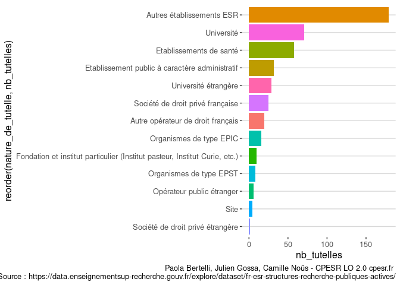
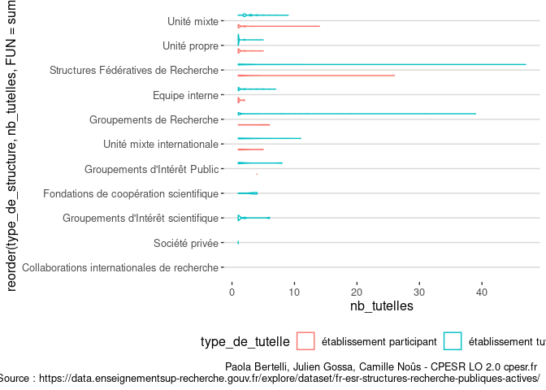

Unités de recherches
================

## Nombre de structures par type

<!-- -->

## Tutelles

### Nombre d’institutions tutelles par nature

<!-- -->

### Nombre de tutelles par nature d’institution

<!-- -->

### Nombre de tutelles des EPST et EPIC

    ## `summarise()` has grouped output by 'sigles_des_tutelles'. You can override
    ## using the `.groups` argument.

<!-- -->

### Nombre de tutelles par type de structure

    ## `summarise()` has grouped output by 'libelle', 'type_de_structure'. You can
    ## override using the `.groups` argument.

    ## Warning: Groups with fewer than two data points have been dropped.
    ## Groups with fewer than two data points have been dropped.
    ## Groups with fewer than two data points have been dropped.

<!-- -->

    ## `summarise()` has grouped output by 'libelle', 'type_de_structure'. You can
    ## override using the `.groups` argument.

<!-- -->
